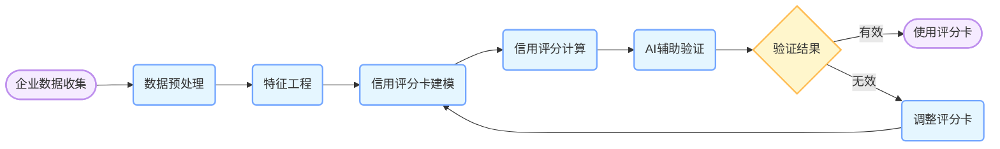

# AI辅助的企业信用评分卡验证

> 关键词：AI辅助、企业信用评分卡、验证、机器学习、数据挖掘

> 摘要：本文围绕AI辅助的企业信用评分卡验证展开，详细阐述了其背景、核心概念、算法原理、数学模型等内容。通过实际案例展示了如何运用AI技术对企业信用评分卡进行验证，分析了其在实际应用中的场景。同时，推荐了相关的学习资源、开发工具和论文著作，最后探讨了该领域未来的发展趋势与挑战，并对常见问题进行了解答。旨在为读者提供全面且深入的关于AI辅助的企业信用评分卡验证的知识体系。

## 1. 背景介绍 
### 1.1 目的和范围
企业信用评分卡是金融机构、信贷机构等评估企业信用风险的重要工具。然而，传统的信用评分卡验证方法可能存在效率低、准确性不足等问题。引入AI技术可以提高验证的效率和准确性，更好地识别企业的信用风险。本文的目的在于详细介绍如何利用AI技术辅助企业信用评分卡的验证过程，包括核心概念、算法原理、实际应用等方面。范围涵盖了从理论到实践的各个环节，为相关从业者提供全面的指导。

### 1.2 预期读者
本文预期读者包括金融机构的风险管理专家、信贷审批人员、数据分析师、从事机器学习和人工智能在金融领域应用的研究人员和开发者，以及对企业信用评估和AI技术结合感兴趣的相关专业人士。

### 1.3 文档结构概述
本文将按照以下结构展开：首先介绍核心概念与联系，阐述企业信用评分卡和AI辅助验证的基本原理和架构；接着详细讲解核心算法原理和具体操作步骤，并用Python代码进行说明；然后介绍相关的数学模型和公式，并举例说明；通过项目实战展示代码实际案例和详细解释；分析实际应用场景；推荐相关的工具和资源；最后总结未来发展趋势与挑战，解答常见问题并提供扩展阅读和参考资料。

### 1.4 术语表
#### 1.4.1 核心术语定义
- **企业信用评分卡**：是一种基于企业的各种信息（如财务数据、经营数据、信用历史等），通过一定的算法和模型计算出的一个数值，用于评估企业的信用风险。
- **AI辅助验证**：利用人工智能技术（如机器学习、深度学习等）对企业信用评分卡的准确性、有效性等进行验证和评估。
- **信用风险**：指企业在经济活动中，由于各种原因导致不能按时履行债务或合同义务，从而给债权人带来损失的可能性。

#### 1.4.2 相关概念解释
- **机器学习**：是一门多领域交叉学科，涉及概率论、统计学、逼近论、凸分析、算法复杂度理论等多门学科。它专门研究计算机怎样模拟或实现人类的学习行为，以获取新的知识或技能，重新组织已有的知识结构使之不断改善自身的性能。
- **深度学习**：是机器学习的一个分支领域，它是一种基于对数据进行表征学习的方法。深度学习通过构建具有很多层的神经网络模型，自动从大量数据中学习特征和模式。

#### 1.4.3 缩略词列表
- **AI**：Artificial Intelligence，人工智能
- **ML**：Machine Learning，机器学习
- **DL**：Deep Learning，深度学习

## 2. 核心概念与联系 

### 企业信用评分卡原理
企业信用评分卡的基本原理是通过收集企业的多维度数据，如财务报表数据（资产负债率、利润率等）、经营数据（销售额增长率、市场份额等）、信用历史数据（是否有逾期还款记录等），对这些数据进行预处理和特征工程，然后选择合适的模型（如逻辑回归、决策树等）进行建模，计算出企业的信用评分。评分越高，表明企业的信用风险越低。

### AI辅助验证原理
AI辅助验证主要是利用机器学习和深度学习算法，对已有的企业信用评分卡进行评估和验证。通过分析大量的历史数据，构建验证模型，判断评分卡的准确性、稳定性和有效性。例如，可以使用交叉验证的方法，将数据集划分为训练集和测试集，在训练集上训练验证模型，然后在测试集上评估评分卡的性能。

### 架构示意图


## 3. 核心算法原理 & 具体操作步骤 

### 逻辑回归算法原理
逻辑回归是一种常用的二分类算法，在企业信用评分卡验证中也有广泛应用。其基本原理是通过逻辑函数将线性回归的结果映射到[0, 1]区间，用于表示样本属于某个类别的概率。逻辑函数的表达式为：

$$\sigma(z)=\frac{1}{1 + e^{-z}}$$

其中，$z = \theta_0 + \theta_1x_1 + \theta_2x_2 + \cdots + \theta_nx_n$ 是线性组合，$\theta_i$ 是模型的参数，$x_i$ 是特征变量。

### Python代码实现逻辑回归验证
```python
import numpy as np
from sklearn.linear_model import LogisticRegression
from sklearn.model_selection import train_test_split
from sklearn.metrics import accuracy_score

# 假设我们有一个包含企业特征和信用标签的数据集
# 这里简单生成一些示例数据
X = np.random.rand(100, 5)  # 100个样本，每个样本有5个特征
y = np.random.randint(0, 2, 100)  # 信用标签，0或1

# 划分训练集和测试集
X_train, X_test, y_train, y_test = train_test_split(X, y, test_size=0.2, random_state=42)

# 创建逻辑回归模型
model = LogisticRegression()

# 训练模型
model.fit(X_train, y_train)

# 在测试集上进行预测
y_pred = model.predict(X_test)

# 计算准确率
accuracy = accuracy_score(y_test, y_pred)
print(f"逻辑回归模型的准确率: {accuracy}")
```

### 具体操作步骤
1. **数据准备**：收集企业的相关数据，并进行清洗和预处理，包括缺失值处理、异常值处理等。
2. **特征选择**：从众多特征中选择与信用风险相关性较高的特征，可以使用相关性分析、特征重要性排序等方法。
3. **模型训练**：选择合适的算法（如逻辑回归、决策树等），在训练集上训练模型。
4. **模型验证**：使用测试集对训练好的模型进行验证，评估模型的性能指标（如准确率、召回率、F1值等）。
5. **评分卡验证**：将验证模型应用到企业信用评分卡上，判断评分卡的有效性。

## 4. 数学模型和公式 & 详细讲解 & 举例说明 

### 逻辑回归损失函数
逻辑回归的损失函数通常使用对数损失函数（也称为交叉熵损失函数），其表达式为：

$$J(\theta)=-\frac{1}{m}\sum_{i = 1}^{m}[y^{(i)}\log(h_{\theta}(x^{(i)}))+(1 - y^{(i)})\log(1 - h_{\theta}(x^{(i)}))]$$

其中，$m$ 是样本数量，$y^{(i)}$ 是第 $i$ 个样本的真实标签，$h_{\theta}(x^{(i)})$ 是模型对第 $i$ 个样本的预测概率。

### 详细讲解
对数损失函数的目的是最小化模型预测概率与真实标签之间的差异。当真实标签 $y^{(i)} = 1$ 时，损失函数主要关注 $h_{\theta}(x^{(i)})$ 的值，希望其尽可能接近 1；当 $y^{(i)} = 0$ 时，希望 $1 - h_{\theta}(x^{(i)})$ 尽可能接近 1，即 $h_{\theta}(x^{(i)})$ 尽可能接近 0。

### 举例说明
假设我们有一个简单的二分类问题，有 3 个样本，真实标签分别为 $y = [1, 0, 1]$，模型的预测概率分别为 $h_{\theta}(x) = [0.8, 0.2, 0.6]$。则对数损失函数的值为：

$$J(\theta)=-\frac{1}{3}[(1\times\log(0.8)+(1 - 1)\times\log(1 - 0.8))+(0\times\log(0.2)+(1 - 0)\times\log(1 - 0.2))+(1\times\log(0.6)+(1 - 1)\times\log(1 - 0.6))]$$

```python
import numpy as np

y = np.array([1, 0, 1])
h = np.array([0.8, 0.2, 0.6])

J = -1/3 * (np.sum(y * np.log(h) + (1 - y) * np.log(1 - h)))
print(f"对数损失函数的值: {J}")
```

## 5. 项目实战：代码实际案例和详细解释说明 

### 5.1  开发环境搭建
- **操作系统**：推荐使用 Linux 或 macOS 系统，也可以使用 Windows 系统。
- **Python 版本**：建议使用 Python 3.7 及以上版本。
- **开发工具**：可以使用 PyCharm、Jupyter Notebook 等。
- **安装依赖库**：使用以下命令安装所需的库：
```bash
pip install numpy pandas scikit-learn matplotlib
```

### 5.2  源代码详细实现和代码解读
```python
import numpy as np
import pandas as pd
from sklearn.model_selection import train_test_split
from sklearn.linear_model import LogisticRegression
from sklearn.metrics import accuracy_score, confusion_matrix, classification_report

# 读取数据集
data = pd.read_csv('enterprise_credit_data.csv')

# 数据预处理
# 处理缺失值
data = data.dropna()

# 特征选择
X = data.drop('credit_label', axis=1)
y = data['credit_label']

# 划分训练集和测试集
X_train, X_test, y_train, y_test = train_test_split(X, y, test_size=0.2, random_state=42)

# 创建逻辑回归模型
model = LogisticRegression()

# 训练模型
model.fit(X_train, y_train)

# 在测试集上进行预测
y_pred = model.predict(X_test)

# 评估模型性能
accuracy = accuracy_score(y_test, y_pred)
conf_matrix = confusion_matrix(y_test, y_pred)
class_report = classification_report(y_test, y_pred)

print(f"模型准确率: {accuracy}")
print("混淆矩阵:")
print(conf_matrix)
print("分类报告:")
print(class_report)
```

### 代码解读与分析
1. **数据读取**：使用 `pandas` 库的 `read_csv` 函数读取企业信用数据集。
2. **数据预处理**：使用 `dropna` 函数处理数据中的缺失值。
3. **特征选择**：将数据集中的信用标签列作为目标变量 `y`，其余列作为特征变量 `X`。
4. **数据集划分**：使用 `train_test_split` 函数将数据集划分为训练集和测试集，测试集占比为 20%。
5. **模型创建与训练**：创建逻辑回归模型，并使用训练集对模型进行训练。
6. **模型预测与评估**：使用训练好的模型对测试集进行预测，计算准确率、混淆矩阵和分类报告，评估模型的性能。

## 6. 实际应用场景 
### 金融机构信贷审批
金融机构在进行企业信贷审批时，可以使用AI辅助的企业信用评分卡验证方法，对企业的信用状况进行更准确的评估。通过验证评分卡的有效性，金融机构可以更合理地决定是否给予企业贷款以及贷款的额度和利率。

### 供应链金融风险管理
在供应链金融中，核心企业需要对上下游企业的信用风险进行管理。AI辅助的企业信用评分卡验证可以帮助核心企业评估供应商和经销商的信用状况，降低供应链金融风险。

### 信用评级机构评估
信用评级机构可以利用AI技术对企业信用评分卡进行验证，提高评级的准确性和客观性。通过对大量企业数据的分析和建模，信用评级机构可以为投资者提供更可靠的信用评级信息。

## 7. 工具和资源推荐
### 7.1 学习资源推荐
#### 7.1.1 书籍推荐
- 《Python 机器学习》：详细介绍了Python在机器学习中的应用，包括数据处理、模型选择、评估等方面的内容。
- 《信用风险评分卡研究与应用》：专门针对信用评分卡的理论和实践进行了深入探讨，对企业信用评分卡验证有很好的参考价值。
- 《深度学习》：由深度学习领域的三位顶尖专家Ian Goodfellow、Yoshua Bengio和Aaron Courville撰写，全面介绍了深度学习的基本原理和应用。

#### 7.1.2 在线课程
- Coursera上的“机器学习”课程：由斯坦福大学教授Andrew Ng主讲，是机器学习领域的经典课程，涵盖了机器学习的基本概念、算法和应用。
- edX上的“人工智能基础”课程：介绍了人工智能的基本概念、技术和应用，包括机器学习、深度学习等方面的内容。
- 中国大学MOOC上的“数据挖掘与机器学习”课程：结合实际案例，介绍了数据挖掘和机器学习的基本算法和应用。

#### 7.1.3 技术博客和网站
- 机器学习算法工程师：提供了丰富的机器学习和人工智能相关的技术文章和案例分析。
- Kaggle：是一个数据科学竞赛平台，上面有很多关于信用评分和风险评估的数据集和优秀的解决方案。
- Towards Data Science：发表了大量关于数据科学、机器学习和人工智能的高质量文章。

### 7.2 开发工具框架推荐
#### 7.2.1 IDE和编辑器
- PyCharm：是一款专门为Python开发设计的集成开发环境，具有强大的代码编辑、调试和项目管理功能。
- Jupyter Notebook：是一个基于Web的交互式计算环境，适合进行数据探索、模型开发和可视化。
- Visual Studio Code：是一款轻量级的代码编辑器，支持多种编程语言和插件，可用于Python开发。

#### 7.2.2 调试和性能分析工具
- PDB：Python自带的调试工具，可以帮助开发者逐行调试代码，查找问题。
- Scikit-learn的 `learning_curve` 函数：可以用于分析模型的学习曲线，评估模型的性能和复杂度。
- TensorBoard：是TensorFlow的可视化工具，可用于监控深度学习模型的训练过程和性能。

#### 7.2.3 相关框架和库
- Scikit-learn：是Python中最常用的机器学习库，提供了丰富的机器学习算法和工具，如分类、回归、聚类等。
- TensorFlow：是一个开源的深度学习框架，广泛应用于图像识别、自然语言处理等领域。
- PyTorch：是另一个流行的深度学习框架，具有动态图机制，易于使用和调试。

### 7.3 相关论文著作推荐
#### 7.3.1 经典论文
- 《Credit Scoring Using Neural Networks》：介绍了如何使用神经网络进行信用评分，是该领域的经典论文之一。
- 《A Comparative Analysis of Logistic Regression and Decision Trees in Credit Scoring》：比较了逻辑回归和决策树在信用评分中的应用效果。

#### 7.3.2 最新研究成果
- 可以关注顶级学术会议（如KDD、ICML、NeurIPS等）和期刊（如Journal of Machine Learning Research、ACM Transactions on Intelligent Systems and Technology等）上关于信用评分和AI技术应用的最新研究成果。

#### 7.3.3 应用案例分析
- 可以查找金融机构、信用评级机构等发布的关于企业信用评分卡验证的应用案例分析报告，了解实际应用中的经验和问题。

## 8. 总结：未来发展趋势与挑战
### 未来发展趋势
- **融合更多数据源**：未来的AI辅助企业信用评分卡验证将融合更多的数据源，如社交媒体数据、物联网数据等，以更全面地评估企业的信用状况。
- **深度学习的广泛应用**：深度学习在图像识别、自然语言处理等领域取得了巨大成功，未来将在企业信用评分卡验证中得到更广泛的应用，提高验证的准确性和效率。
- **实时验证**：随着技术的发展，企业信用评分卡验证将实现实时化，能够及时反映企业信用状况的变化，为金融机构等提供更及时的决策支持。

### 挑战
- **数据质量问题**：数据质量是影响AI辅助企业信用评分卡验证准确性的关键因素之一。数据可能存在缺失值、异常值、错误标签等问题，需要进行有效的预处理。
- **模型可解释性**：深度学习模型等复杂模型虽然在性能上表现出色，但缺乏可解释性。在企业信用评分卡验证中，模型的可解释性非常重要，需要研究如何提高模型的可解释性。
- **法律法规和隐私保护**：在使用企业数据进行信用评分卡验证时，需要遵守相关的法律法规和隐私保护要求，确保数据的合法使用和用户隐私的保护。

## 9. 附录：常见问题与解答
### 问题1：AI辅助的企业信用评分卡验证与传统验证方法有什么区别？
答：传统验证方法可能主要依赖人工经验和简单的统计分析，效率较低且准确性有限。而AI辅助的验证方法利用机器学习和深度学习算法，能够处理大量的数据，自动学习数据中的模式和规律，提高验证的效率和准确性。

### 问题2：如何选择合适的AI算法进行企业信用评分卡验证？
答：选择合适的AI算法需要考虑数据的特点、问题的复杂度和业务需求等因素。对于简单的二分类问题，逻辑回归是一个不错的选择；对于复杂的非线性问题，可以考虑使用决策树、随机森林、神经网络等算法。同时，可以通过交叉验证等方法比较不同算法的性能，选择最优的算法。

### 问题3：数据量对AI辅助的企业信用评分卡验证有什么影响？
答：一般来说，数据量越大，AI模型能够学习到的模式和规律就越多，验证的准确性也就越高。但是，数据量过大也可能导致训练时间过长、计算资源消耗过多等问题。因此，需要在数据量和计算资源之间找到一个平衡点。

## 10. 扩展阅读 & 参考资料
- 《人工智能：现代方法》
- 《数据挖掘：概念与技术》
- 《金融科技前沿：技术驱动的金融创新》

作者：AI天才研究院/AI Genius Institute & 禅与计算机程序设计艺术 /Zen And The Art of Computer Programming