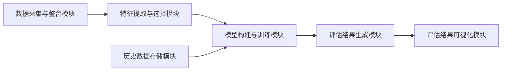

# AI辅助的企业并购整合效果评估

> 关键词：AI辅助、企业并购整合、效果评估、数据分析、机器学习

> 摘要：本文围绕AI辅助的企业并购整合效果评估展开深入探讨。首先介绍了研究的背景、目的、预期读者和文档结构，明确了相关术语。接着阐述了核心概念及其联系，给出了原理和架构的文本示意图与Mermaid流程图。详细讲解了核心算法原理，并通过Python源代码进行说明。介绍了数学模型和公式，辅以举例。通过项目实战展示了开发环境搭建、源代码实现与解读。分析了实际应用场景，推荐了学习资源、开发工具框架和相关论文著作。最后总结了未来发展趋势与挑战，提供了常见问题解答和扩展阅读参考资料，旨在为企业在并购整合效果评估中合理运用AI技术提供全面的指导。

## 1. 背景介绍 
### 1.1 目的和范围
企业并购是企业快速扩张和发展的重要战略手段，但并购后的整合效果直接关系到并购的成败。传统的企业并购整合效果评估方法往往依赖于人工经验和简单的财务指标分析，存在评估周期长、主观性强、难以全面考虑多维度因素等问题。本研究的目的是探讨如何利用AI技术辅助企业进行并购整合效果评估，提高评估的准确性、效率和全面性。

研究范围涵盖了AI技术在企业并购整合效果评估中的应用原理、算法、数学模型，以及实际项目中的开发和应用。同时，分析了不同行业企业在并购整合过程中可采用的AI辅助评估方法和策略。

### 1.2 预期读者
本文的预期读者包括企业管理人员、投资银行家、财务分析师、并购顾问、AI技术开发者和研究人员等。对于企业管理人员和并购相关从业者，本文提供了利用AI技术提升并购整合效果评估的思路和方法；对于AI技术开发者和研究人员，本文展示了AI技术在企业并购领域的具体应用场景和挑战。

### 1.3 文档结构概述
本文首先介绍了相关背景信息，包括研究目的、预期读者和文档结构。接着阐述了核心概念和它们之间的联系，给出了原理和架构的文本示意图与Mermaid流程图。然后详细讲解了核心算法原理，并使用Python源代码进行说明。随后介绍了数学模型和公式，并举例说明。通过项目实战展示了开发环境搭建、源代码实现与解读。分析了实际应用场景，推荐了学习资源、开发工具框架和相关论文著作。最后总结了未来发展趋势与挑战，提供了常见问题解答和扩展阅读参考资料。

### 1.4 术语表
#### 1.4.1 核心术语定义
- **企业并购整合**：指企业在完成并购交易后，对被并购企业的业务、财务、人员、文化等方面进行融合和协调，以实现协同效应和企业价值最大化的过程。
- **AI辅助评估**：利用人工智能技术，如机器学习、自然语言处理、数据分析等，辅助企业对并购整合效果进行评估和分析。
- **效果评估指标**：用于衡量企业并购整合效果的一系列量化和非量化指标，如财务指标、市场份额、客户满意度、员工满意度等。

#### 1.4.2 相关概念解释
- **机器学习**：是一门多领域交叉学科，涉及概率论、统计学、逼近论、凸分析、算法复杂度理论等多门学科。它专门研究计算机怎样模拟或实现人类的学习行为，以获取新的知识或技能，重新组织已有的知识结构使之不断改善自身的性能。
- **自然语言处理**：是计算机科学领域与人工智能领域中的一个重要方向。它研究能实现人与计算机之间用自然语言进行有效通信的各种理论和方法，包括文本分类、信息抽取、机器翻译等。
- **数据分析**：是指用适当的统计分析方法对收集来的大量数据进行分析，提取有用信息和形成结论而对数据加以详细研究和概括总结的过程。

#### 1.4.3 缩略词列表
- **AI**：Artificial Intelligence，人工智能
- **ML**：Machine Learning，机器学习
- **NLP**：Natural Language Processing，自然语言处理
- **KPI**：Key Performance Indicator，关键绩效指标

## 2. 核心概念与联系 
### 核心概念原理
AI辅助的企业并购整合效果评估主要基于以下几个核心概念：

#### 数据采集与整合
企业在并购整合过程中会产生大量的数据，包括财务数据、业务数据、市场数据、员工数据等。这些数据来源广泛，格式多样。AI技术可以帮助企业自动采集、清洗和整合这些数据，将其转化为统一的格式，以便后续分析。

#### 特征提取与选择
从采集到的数据中提取有价值的特征是评估的关键步骤。AI算法可以通过特征工程技术，自动识别和提取与并购整合效果相关的特征，如财务比率、市场增长率、员工流动率等。同时，还可以通过特征选择方法，筛选出最具代表性和区分度的特征，减少数据维度，提高评估效率。

#### 模型构建与训练
基于提取的特征，选择合适的机器学习模型进行构建和训练。常见的模型包括决策树、支持向量机、神经网络等。通过对历史数据的学习和训练，模型可以学习到并购整合效果与各种特征之间的关系，从而对未来的并购整合效果进行预测和评估。

#### 评估结果可视化
将评估结果以直观的图表、报表等形式展示给企业管理者，便于他们理解和决策。AI技术可以帮助生成各种可视化图表，如柱状图、折线图、饼图等，同时还可以提供交互式的可视化界面，让管理者可以根据自己的需求进行数据查询和分析。

### 架构的文本示意图
```plaintext
|----------------------|          |----------------------|
| 数据采集与整合模块  | -------> | 特征提取与选择模块  |
|----------------------|          |----------------------|
                                       |
                                       v
|----------------------|          |----------------------|
| 模型构建与训练模块  | <------- | 历史数据存储模块    |
|----------------------|          |----------------------|
                                       |
                                       v
|----------------------|          |----------------------|
| 评估结果生成模块    | -------> | 评估结果可视化模块  |
|----------------------|          |----------------------|
```

### Mermaid流程图


## 3. 核心算法原理 & 具体操作步骤 
### 核心算法原理
在AI辅助的企业并购整合效果评估中，常用的机器学习算法包括决策树、支持向量机和神经网络。下面以决策树算法为例，详细介绍其原理和操作步骤。

决策树是一种基于树结构进行决策的机器学习算法。它通过对数据的特征进行递归划分，构建一棵决策树。每个内部节点表示一个特征上的测试，每个分支表示测试输出，每个叶节点表示一个类别或值。决策树的构建过程就是寻找最优划分特征和划分点的过程。

### 具体操作步骤
#### 步骤1：数据准备
首先，收集企业并购整合过程中的相关数据，包括财务数据、业务数据、市场数据等。对数据进行清洗和预处理，去除缺失值、异常值等，将数据转换为适合决策树算法处理的格式。

```python
import pandas as pd
from sklearn.preprocessing import LabelEncoder

# 读取数据
data = pd.read_csv('merger_data.csv')

# 处理缺失值
data = data.dropna()

# 对分类特征进行编码
categorical_columns = data.select_dtypes(include=['object']).columns
for col in categorical_columns:
    le = LabelEncoder()
    data[col] = le.fit_transform(data[col])
```

#### 步骤2：特征选择
从数据中选择与并购整合效果相关的特征。可以使用相关性分析、信息增益等方法进行特征选择。

```python
from sklearn.feature_selection import SelectKBest
from sklearn.feature_selection import chi2

# 分离特征和目标变量
X = data.drop('integration_effect', axis=1)
y = data['integration_effect']

# 选择K个最好的特征
selector = SelectKBest(score_func=chi2, k=5)
X_new = selector.fit_transform(X, y)
```

#### 步骤3：模型训练
使用训练数据对决策树模型进行训练。

```python
from sklearn.tree import DecisionTreeClassifier
from sklearn.model_selection import train_test_split

# 划分训练集和测试集
X_train, X_test, y_train, y_test = train_test_split(X_new, y, test_size=0.2, random_state=42)

# 创建决策树模型
model = DecisionTreeClassifier()

# 训练模型
model.fit(X_train, y_train)
```

#### 步骤4：模型评估
使用测试数据对训练好的模型进行评估，计算模型的准确率、召回率、F1值等指标。

```python
from sklearn.metrics import accuracy_score, recall_score, f1_score

# 预测测试集
y_pred = model.predict(X_test)

# 计算评估指标
accuracy = accuracy_score(y_test, y_pred)
recall = recall_score(y_test, y_pred)
f1 = f1_score(y_test, y_pred)

print(f"Accuracy: {accuracy}")
print(f"Recall: {recall}")
print(f"F1-score: {f1}")
```

#### 步骤5：结果可视化
将决策树模型以图形的形式展示出来，便于理解和分析。

```python
from sklearn.tree import export_graphviz
import graphviz

# 导出决策树图形
dot_data = export_graphviz(model, out_file=None, 
                           feature_names=X.columns[selector.get_support()],  
                           class_names=['Poor', 'Good'],  
                           filled=True, rounded=True,  
                           special_characters=True)  
graph = graphviz.Source(dot_data)  
graph
```

## 4. 数学模型和公式 & 详细讲解 & 举例说明 
### 信息增益公式
在决策树算法中，常用信息增益来选择最优划分特征。信息增益的计算公式如下：

$$
IG(D, A) = H(D) - H(D|A)
$$

其中，$IG(D, A)$ 表示特征 $A$ 对数据集 $D$ 的信息增益，$H(D)$ 表示数据集 $D$ 的信息熵，$H(D|A)$ 表示在特征 $A$ 给定的条件下数据集 $D$ 的条件熵。

### 信息熵公式
信息熵是用来衡量数据集纯度的指标，计算公式如下：

$$
H(D) = -\sum_{k=1}^{K} p_k \log_2 p_k
$$

其中，$D$ 表示数据集，$K$ 表示数据集中类别的数量，$p_k$ 表示第 $k$ 类样本在数据集中所占的比例。

### 条件熵公式
条件熵是在给定某个特征的条件下，数据集的不确定性，计算公式如下：

$$
H(D|A) = \sum_{i=1}^{n} \frac{|D_i|}{|D|} H(D_i)
$$

其中，$A$ 表示特征，$n$ 表示特征 $A$ 的取值个数，$D_i$ 表示特征 $A$ 取值为第 $i$ 个值时的子集，$|D|$ 表示数据集 $D$ 的样本数量，$|D_i|$ 表示子集 $D_i$ 的样本数量。

### 举例说明
假设有一个数据集 $D$，包含 10 个样本，分为 2 类：正类和负类，其中正类有 6 个样本，负类有 4 个样本。则数据集 $D$ 的信息熵为：

$$
H(D) = -\frac{6}{10} \log_2 \frac{6}{10} - \frac{4}{10} \log_2 \frac{4}{10} \approx 0.971
$$

假设存在一个特征 $A$，有 2 个取值：$A_1$ 和 $A_2$。其中，$A$ 取值为 $A_1$ 的子集 $D_1$ 包含 4 个样本，正类有 3 个，负类有 1 个；$A$ 取值为 $A_2$ 的子集 $D_2$ 包含 6 个样本，正类有 3 个，负类有 3 个。则子集 $D_1$ 和 $D_2$ 的信息熵分别为：

$$
H(D_1) = -\frac{3}{4} \log_2 \frac{3}{4} - \frac{1}{4} \log_2 \frac{1}{4} \approx 0.811
$$

$$
H(D_2) = -\frac{3}{6} \log_2 \frac{3}{6} - \frac{3}{6} \log_2 \frac{3}{6} = 1
$$

则在特征 $A$ 给定的条件下数据集 $D$ 的条件熵为：

$$
H(D|A) = \frac{4}{10} H(D_1) + \frac{6}{10} H(D_2) = \frac{4}{10} \times 0.811 + \frac{6}{10} \times 1 \approx 0.924
$$

特征 $A$ 对数据集 $D$ 的信息增益为：

$$
IG(D, A) = H(D) - H(D|A) = 0.971 - 0.924 = 0.047
$$

## 5. 项目实战：代码实际案例和详细解释说明 
### 5.1  开发环境搭建
#### 安装Python
首先，需要安装Python编程语言。可以从Python官方网站（https://www.python.org/downloads/）下载适合自己操作系统的Python版本，并按照安装向导进行安装。

#### 安装必要的库
在项目中，需要使用一些Python库，如pandas、scikit-learn、graphviz等。可以使用pip命令进行安装：

```bash
pip install pandas scikit-learn graphviz
```

### 5.2  源代码详细实现和代码解读
```python
import pandas as pd
from sklearn.preprocessing import LabelEncoder
from sklearn.feature_selection import SelectKBest
from sklearn.feature_selection import chi2
from sklearn.tree import DecisionTreeClassifier
from sklearn.model_selection import train_test_split
from sklearn.metrics import accuracy_score, recall_score, f1_score
from sklearn.tree import export_graphviz
import graphviz

# 读取数据
data = pd.read_csv('merger_data.csv')

# 处理缺失值
data = data.dropna()

# 对分类特征进行编码
categorical_columns = data.select_dtypes(include=['object']).columns
for col in categorical_columns:
    le = LabelEncoder()
    data[col] = le.fit_transform(data[col])

# 分离特征和目标变量
X = data.drop('integration_effect', axis=1)
y = data['integration_effect']

# 选择K个最好的特征
selector = SelectKBest(score_func=chi2, k=5)
X_new = selector.fit_transform(X, y)

# 划分训练集和测试集
X_train, X_test, y_train, y_test = train_test_split(X_new, y, test_size=0.2, random_state=42)

# 创建决策树模型
model = DecisionTreeClassifier()

# 训练模型
model.fit(X_train, y_train)

# 预测测试集
y_pred = model.predict(X_test)

# 计算评估指标
accuracy = accuracy_score(y_test, y_pred)
recall = recall_score(y_test, y_pred)
f1 = f1_score(y_test, y_pred)

print(f"Accuracy: {accuracy}")
print(f"Recall: {recall}")
print(f"F1-score: {f1}")

# 导出决策树图形
dot_data = export_graphviz(model, out_file=None, 
                           feature_names=X.columns[selector.get_support()],  
                           class_names=['Poor', 'Good'],  
                           filled=True, rounded=True,  
                           special_characters=True)  
graph = graphviz.Source(dot_data)  
graph
```

### 代码解读与分析
- **数据读取和预处理**：使用pandas库读取CSV文件，并处理缺失值。对分类特征使用LabelEncoder进行编码，将其转换为数值类型。
- **特征选择**：使用SelectKBest和chi2方法选择与并购整合效果最相关的5个特征。
- **模型训练和评估**：使用DecisionTreeClassifier创建决策树模型，并使用训练集进行训练。使用测试集进行预测，并计算准确率、召回率和F1值。
- **结果可视化**：使用export_graphviz和graphviz将决策树模型以图形的形式展示出来。

## 6. 实际应用场景 
### 金融行业
在金融行业，企业并购整合效果评估对于银行、证券、保险等机构至关重要。AI辅助的评估可以帮助金融机构快速分析并购后的财务状况、风险状况和市场竞争力。例如，通过分析并购双方的客户数据、资产负债表、交易记录等，评估并购是否实现了客户资源的整合、业务协同效应的提升和风险的有效控制。

### 制造业
制造业企业在并购整合过程中，需要关注生产流程的优化、供应链的协同和产品质量的提升。AI技术可以通过对生产数据、供应链数据和质量检测数据的分析，评估并购整合效果。例如，分析生产线上的设备利用率、原材料采购成本、产品次品率等指标，判断并购是否提高了生产效率和产品质量。

### 科技行业
科技行业的企业并购往往涉及技术整合、人才融合和市场拓展。AI辅助的评估可以帮助科技企业分析并购后的技术创新能力、人才流失率和市场份额变化。例如，通过分析专利数据、研发投入、员工满意度等指标，评估并购是否促进了技术创新和人才的稳定。

## 7. 工具和资源推荐
### 7.1 学习资源推荐
#### 7.1.1 书籍推荐
- 《机器学习》（周志华著）：介绍了机器学习的基本概念、算法和应用，是机器学习领域的经典教材。
- 《Python数据分析实战》（Sebastian Raschka著）：详细介绍了使用Python进行数据分析的方法和技巧，包括数据处理、可视化和机器学习等方面。
- 《人工智能：现代方法》（Stuart Russell、Peter Norvig著）：全面介绍了人工智能的理论和技术，是人工智能领域的权威著作。

#### 7.1.2 在线课程
- Coursera上的“机器学习”课程（Andrew Ng教授授课）：该课程是机器学习领域的经典在线课程，深入浅出地介绍了机器学习的基本概念和算法。
- edX上的“人工智能基础”课程：系统介绍了人工智能的基本原理和方法，包括搜索算法、机器学习、自然语言处理等方面。
- 中国大学MOOC上的“Python语言程序设计”课程：适合初学者学习Python编程语言，为后续学习数据分析和机器学习打下基础。

#### 7.1.3 技术博客和网站
- Medium：上面有很多关于AI、机器学习和数据分析的优质博客文章，涵盖了最新的技术趋势和应用案例。
- Towards Data Science：专注于数据分析和机器学习领域的技术博客，提供了大量的教程和实践经验分享。
- Kaggle：是一个数据科学竞赛平台，上面有很多公开的数据集和优秀的数据分析代码，可以学习和参考。

### 7.2 开发工具框架推荐
#### 7.2.1 IDE和编辑器
- PyCharm：是一款专业的Python集成开发环境，提供了丰富的代码编辑、调试和项目管理功能。
- Jupyter Notebook：是一个交互式的开发环境，适合进行数据分析和机器学习的实验和演示。
- Visual Studio Code：是一款轻量级的代码编辑器，支持多种编程语言和插件扩展，可用于Python开发。

#### 7.2.2 调试和性能分析工具
- pdb：是Python自带的调试工具，可以帮助开发者定位代码中的错误。
- cProfile：是Python的性能分析工具，可以分析代码的运行时间和函数调用情况。
- TensorBoard：是TensorFlow的可视化工具，可以帮助开发者可视化模型的训练过程和性能指标。

#### 7.2.3 相关框架和库
- scikit-learn：是Python中常用的机器学习库，提供了丰富的机器学习算法和工具，如分类、回归、聚类等。
- TensorFlow：是Google开发的深度学习框架，支持多种深度学习模型的构建和训练。
- PyTorch：是Facebook开发的深度学习框架，具有动态图和易于使用的特点，适合快速开发和实验。

### 7.3 相关论文著作推荐
#### 7.3.1 经典论文
- 《A Decision-Theoretic Generalization of On-Line Learning and an Application to Boosting》（Yoav Freund、Robert E. Schapire著）：介绍了AdaBoost算法的原理和应用，是机器学习领域的经典论文。
- 《Gradient-Based Learning Applied to Document Recognition》（Yann LeCun、Léon Bottou、Yoshua Bengio、Patrick Haffner著）：介绍了卷积神经网络（CNN）在图像识别中的应用，是深度学习领域的奠基性论文。
- 《Long Short-Term Memory》（Sepp Hochreiter、Jürgen Schmidhuber著）：介绍了长短期记忆网络（LSTM）的原理和应用，是循环神经网络（RNN）领域的重要论文。

#### 7.3.2 最新研究成果
- 关注顶级学术会议如NeurIPS、ICML、CVPR等的最新论文，了解AI领域的最新研究动态和成果。
- 阅读知名学术期刊如Journal of Artificial Intelligence Research（JAIR）、Artificial Intelligence等的论文，获取高质量的研究成果。

#### 7.3.3 应用案例分析
- 一些商业咨询公司和研究机构会发布关于企业并购整合的案例分析报告，可以从中了解实际应用中AI技术的使用情况和效果。
- 企业自身也会在年报、新闻稿等渠道分享并购整合的经验和成果，可以关注相关企业的官方信息。

## 8. 总结：未来发展趋势与挑战
### 未来发展趋势
- **多模态数据融合**：未来的AI辅助评估将不仅仅依赖于结构化数据，还会融合图像、音频、视频等多模态数据，以更全面地评估企业并购整合效果。例如，通过分析企业的宣传视频、员工的语音交流等，了解企业的文化融合和员工满意度。
- **实时评估**：随着数据采集和处理技术的不断发展，AI辅助评估将实现实时化。企业可以实时获取并购整合过程中的数据，并及时评估整合效果，以便及时调整策略。
- **智能化决策支持**：AI技术将不仅仅提供评估结果，还会提供智能化的决策支持。通过对大量历史数据的学习和分析，AI系统可以为企业管理者提供最优的并购整合策略建议。

### 挑战
- **数据隐私和安全**：企业在并购整合过程中涉及大量的敏感数据，如财务数据、客户信息等。如何确保这些数据的隐私和安全是一个重要挑战。需要采用先进的加密技术和访问控制机制，防止数据泄露。
- **模型可解释性**：一些复杂的AI模型，如深度学习模型，往往具有较高的预测准确率，但缺乏可解释性。在企业并购整合效果评估中，管理者需要了解模型的决策依据，以便做出合理的决策。因此，提高模型的可解释性是一个亟待解决的问题。
- **技术人才短缺**：AI技术的应用需要专业的技术人才，包括数据科学家、机器学习工程师等。目前，这类人才相对短缺，企业在招聘和培养相关人才方面面临一定的困难。

## 9. 附录：常见问题与解答
### 问题1：AI辅助评估的准确性如何保证？
解答：可以通过以下几个方面保证AI辅助评估的准确性：
- 数据质量：确保采集到的数据准确、完整、一致，对数据进行清洗和预处理，去除噪声和异常值。
- 特征工程：选择与并购整合效果相关的特征，并进行特征提取和选择，提高特征的代表性和区分度。
- 模型选择和调优：根据数据特点和问题需求选择合适的机器学习模型，并对模型进行调优，如调整模型参数、选择合适的训练算法等。
- 交叉验证：使用交叉验证方法对模型进行评估，避免过拟合和欠拟合问题。

### 问题2：AI辅助评估是否可以完全替代人工评估？
解答：目前，AI辅助评估还不能完全替代人工评估。虽然AI技术可以处理大量的数据和复杂的计算，提高评估的效率和准确性，但人工评估在一些方面仍然具有不可替代的作用。例如，人工评估可以考虑一些非量化的因素，如企业文化、人际关系等；可以根据经验和直觉做出判断；可以与相关人员进行沟通和交流，获取更多的信息。因此，在实际应用中，应将AI辅助评估和人工评估相结合，充分发挥两者的优势。

### 问题3：如何选择适合企业的AI技术和模型？
解答：选择适合企业的AI技术和模型需要考虑以下几个因素：
- 数据特点：包括数据的类型（结构化数据、非结构化数据）、规模（数据量大小）、维度（特征数量）等。不同的AI技术和模型对数据的要求不同，需要根据数据特点选择合适的方法。
- 问题需求：明确评估的目标和需求，如预测并购整合效果、识别影响因素等。不同的问题需求适合不同的AI技术和模型。
- 计算资源：考虑企业的计算资源，如服务器性能、存储容量等。一些复杂的AI模型需要大量的计算资源，需要确保企业具备相应的条件。
- 可解释性要求：如果企业需要了解模型的决策依据，应选择具有较高可解释性的模型，如决策树、线性回归等。

## 10. 扩展阅读 & 参考资料
### 扩展阅读
- 《大数据时代：生活、工作与思维的大变革》（维克托·迈尔 - 舍恩伯格、肯尼斯·库克耶著）：介绍了大数据的概念、技术和应用，以及对社会和企业的影响。
- 《创新者的窘境》（克莱顿·克里斯坦森著）：探讨了企业在面对技术创新和市场变化时的困境和应对策略。
- 《人工智能时代与人类未来》（李开复、王咏刚著）：分析了人工智能技术的发展趋势和对人类社会的影响，提出了人类在人工智能时代的应对建议。

### 参考资料
- 相关学术论文和研究报告：可以从学术数据库如IEEE Xplore、ACM Digital Library等获取相关的学术论文；从商业咨询公司如麦肯锡、波士顿咨询等获取相关的研究报告。
- 企业官方网站和年报：可以了解企业在并购整合方面的实践经验和成果。
- 行业论坛和会议：参加相关的行业论坛和会议，与同行交流和分享经验。

作者：AI天才研究院/AI Genius Institute & 禅与计算机程序设计艺术 /Zen And The Art of Computer Programming