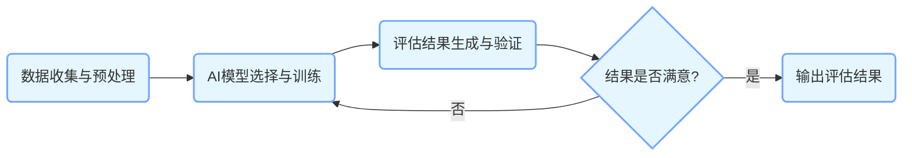

# AI辅助的企业无形资产价值评估

> 关键词：AI、企业无形资产、价值评估、机器学习、数据驱动

> 摘要：本文聚焦于AI辅助的企业无形资产价值评估这一前沿领域。首先介绍了该研究的背景、目的、预期读者、文档结构和相关术语。接着阐述了核心概念及联系，包括企业无形资产的定义、AI在评估中的作用等，并给出了相应的示意图和流程图。详细讲解了核心算法原理及具体操作步骤，用Python代码进行了示例。探讨了数学模型和公式，通过具体例子进行说明。以项目实战展示了代码的实际应用，包括开发环境搭建、源代码实现与解读。分析了实际应用场景，推荐了相关的学习资源、开发工具框架和论文著作。最后总结了未来发展趋势与挑战，提供了常见问题解答和扩展阅读参考资料，旨在为企业和研究人员在无形资产价值评估中利用AI技术提供全面的指导。

## 1. 背景介绍 
### 1.1 目的和范围
在当今知识经济时代，企业的无形资产如专利、商标、品牌、技术秘密等在企业价值创造中发挥着越来越重要的作用。准确评估企业无形资产的价值，对于企业的战略决策、融资、并购、知识产权交易等活动具有至关重要的意义。然而，传统的无形资产价值评估方法存在主观性强、数据处理能力有限等问题。AI技术的发展为解决这些问题提供了新的途径。本文的目的在于探讨如何利用AI技术辅助企业进行无形资产价值评估，提高评估的准确性和效率。范围涵盖了常见的无形资产类型，以及多种AI技术在评估过程中的应用。

### 1.2 预期读者
本文的预期读者包括企业的管理人员、财务人员、资产评估师、投资分析师、知识产权律师等对企业无形资产价值评估感兴趣的专业人士，以及从事AI技术和资产评估相关研究的学者和学生。

### 1.3 文档结构概述
本文首先介绍相关背景知识，包括目的、预期读者等。然后阐述核心概念与联系，让读者了解企业无形资产和AI评估的基本原理。接着详细讲解核心算法原理和具体操作步骤，通过Python代码进行示例。随后介绍数学模型和公式，并举例说明。以项目实战展示代码的实际应用，包括环境搭建、代码实现与解读。分析实际应用场景，推荐相关的学习资源、开发工具框架和论文著作。最后总结未来发展趋势与挑战，提供常见问题解答和扩展阅读参考资料。

### 1.4 术语表
#### 1.4.1 核心术语定义
- **企业无形资产**：指企业拥有或者控制的没有实物形态的可辨认非货币性资产，包括专利权、商标权、著作权、土地使用权、非专利技术、商誉等。
- **AI（人工智能）**：是一门研究如何使计算机能够模拟人类智能的学科和技术，包括机器学习、深度学习、自然语言处理等多种技术手段。
- **无形资产价值评估**：是指专业评估机构和人员，依据相关法律、法规和资产评估准则，对企业无形资产的价值进行评定和估算的过程。

#### 1.4.2 相关概念解释
- **机器学习**：是AI的一个重要分支，它通过让计算机从数据中学习模式和规律，从而实现对未知数据的预测和分类。在无形资产价值评估中，机器学习可以用于分析大量的历史数据，建立评估模型。
- **深度学习**：是一种基于人工神经网络的机器学习技术，它能够自动从大量数据中提取复杂的特征和模式。在无形资产评估中，深度学习可以用于处理图像、文本等非结构化数据，提高评估的准确性。

#### 1.4.3 缩略词列表
- **AI**：Artificial Intelligence（人工智能）
- **ML**：Machine Learning（机器学习）
- **DL**：Deep Learning（深度学习）

## 2. 核心概念与联系 
### 企业无形资产的分类与特点
企业无形资产可以分为知识产权类（如专利、商标、著作权）、技术秘密类、品牌类、客户关系类等。不同类型的无形资产具有不同的特点，例如，专利具有独占性和时效性，商标具有识别性和品牌价值，技术秘密具有保密性和创新性等。

### AI在无形资产价值评估中的作用
AI技术可以帮助评估人员更高效地处理大量的数据，挖掘数据中的潜在信息，提高评估的准确性和客观性。具体来说，AI可以用于数据收集与整理、特征提取与选择、模型建立与训练、评估结果预测与验证等环节。

### 核心概念原理和架构的文本示意图
```plaintext
企业无形资产价值评估
|-- 数据收集与预处理
|   |-- 财务数据
|   |-- 市场数据
|   |-- 技术数据
|   |-- 文本数据
|-- AI模型选择与训练
|   |-- 机器学习模型
|   |   |-- 线性回归
|   |   |-- 决策树
|   |   |-- 随机森林
|   |-- 深度学习模型
|   |   |-- 神经网络
|   |   |-- 卷积神经网络
|   |   |-- 循环神经网络
|-- 评估结果生成与验证
|   |-- 价值预测
|   |-- 误差分析
|   |-- 结果调整
```

### Mermaid流程图


## 3. 核心算法原理 & 具体操作步骤 
### 线性回归算法原理
线性回归是一种简单而常用的机器学习算法，它通过建立自变量和因变量之间的线性关系来进行预测。假设我们有一组自变量 $x_1, x_2, \cdots, x_n$ 和一个因变量 $y$，线性回归模型可以表示为：
$$y = \theta_0 + \theta_1x_1 + \theta_2x_2 + \cdots + \theta_nx_n + \epsilon$$
其中，$\theta_0, \theta_1, \cdots, \theta_n$ 是模型的参数，$\epsilon$ 是误差项。

### 线性回归算法的具体操作步骤
1. **数据收集与预处理**：收集与无形资产价值相关的数据，如企业的财务数据、市场数据等，并进行清洗、归一化等预处理操作。
2. **特征选择**：从收集的数据中选择与无形资产价值相关性较高的特征。
3. **模型训练**：使用训练数据对线性回归模型进行训练，求解模型的参数 $\theta_0, \theta_1, \cdots, \theta_n$。
4. **模型评估**：使用测试数据对训练好的模型进行评估，计算模型的误差指标，如均方误差（MSE）、决定系数（$R^2$）等。
5. **预测**：使用训练好的模型对未知数据进行预测，得到无形资产的价值评估结果。

### Python代码实现
```python
import numpy as np
from sklearn.linear_model import LinearRegression
from sklearn.model_selection import train_test_split
from sklearn.metrics import mean_squared_error, r2_score

# 生成示例数据
np.random.seed(0)
X = np.random.rand(100, 5)  # 自变量
y = 2 * X[:, 0] + 3 * X[:, 1] + 0.5 * X[:, 2] + np.random.randn(100)  # 因变量

# 划分训练集和测试集
X_train, X_test, y_train, y_test = train_test_split(X, y, test_size=0.2, random_state=42)

# 创建线性回归模型
model = LinearRegression()

# 模型训练
model.fit(X_train, y_train)

# 模型预测
y_pred = model.predict(X_test)

# 模型评估
mse = mean_squared_error(y_test, y_pred)
r2 = r2_score(y_test, y_pred)

print(f"均方误差 (MSE): {mse}")
print(f"决定系数 (R^2): {r2}")
```

### 代码解释
1. **数据生成**：使用 `np.random.rand` 生成自变量 $X$，并根据线性关系生成因变量 $y$。
2. **数据划分**：使用 `train_test_split` 函数将数据划分为训练集和测试集。
3. **模型创建**：使用 `LinearRegression` 类创建线性回归模型。
4. **模型训练**：使用 `fit` 方法对模型进行训练。
5. **模型预测**：使用 `predict` 方法对测试集进行预测。
6. **模型评估**：使用 `mean_squared_error` 和 `r2_score` 函数计算模型的均方误差和决定系数。

## 4. 数学模型和公式 & 详细讲解 & 举例说明 
### 线性回归模型的数学推导
线性回归模型的目标是找到一组参数 $\theta_0, \theta_1, \cdots, \theta_n$，使得模型的预测值 $\hat{y}$ 与真实值 $y$ 之间的误差最小。通常使用最小二乘法来求解模型的参数，即最小化误差平方和：
$$J(\theta) = \frac{1}{2m}\sum_{i=1}^{m}(y^{(i)} - \hat{y}^{(i)})^2$$
其中，$m$ 是样本数量，$y^{(i)}$ 是第 $i$ 个样本的真实值，$\hat{y}^{(i)}$ 是第 $i$ 个样本的预测值。

为了求解最小化问题，我们对 $J(\theta)$ 求偏导数，并令其等于零：
$$\frac{\partial J(\theta)}{\partial \theta_j} = \frac{1}{m}\sum_{i=1}^{m}(y^{(i)} - \hat{y}^{(i)})x_j^{(i)} = 0$$
通过求解上述方程组，可以得到模型的参数 $\theta_0, \theta_1, \cdots, \theta_n$。

### 举例说明
假设我们要评估某企业的专利价值，我们收集了该企业过去 10 年的研发投入、专利申请数量、市场份额等数据，以及对应的专利价值数据。我们选择研发投入和专利申请数量作为自变量 $x_1$ 和 $x_2$，专利价值作为因变量 $y$。使用线性回归模型进行评估，得到模型的参数 $\theta_0 = 100$，$\theta_1 = 2$，$\theta_2 = 3$。则该企业的专利价值预测公式为：
$$\hat{y} = 100 + 2x_1 + 3x_2$$
如果该企业今年的研发投入为 50 万元，专利申请数量为 10 件，则预测该企业今年的专利价值为：
$$\hat{y} = 100 + 2\times50 + 3\times10 = 230$$（万元）

## 5. 项目实战：代码实际案例和详细解释说明 
### 5.1  开发环境搭建
#### 操作系统
推荐使用 Windows 10、macOS 或 Linux 系统。

#### 编程语言和环境
使用 Python 3.7 及以上版本，建议使用 Anaconda 进行 Python 环境的管理。

#### 安装必要的库
使用以下命令安装必要的 Python 库：
```sh
pip install numpy pandas scikit-learn matplotlib
```

### 5.2  源代码详细实现和代码解读
```python
import numpy as np
import pandas as pd
from sklearn.model_selection import train_test_split
from sklearn.ensemble import RandomForestRegressor
from sklearn.metrics import mean_squared_error, r2_score
import matplotlib.pyplot as plt

# 加载数据
data = pd.read_csv('intangible_assets_data.csv')

# 数据预处理
X = data.drop('value', axis=1)  # 自变量
y = data['value']  # 因变量

# 划分训练集和测试集
X_train, X_test, y_train, y_test = train_test_split(X, y, test_size=0.2, random_state=42)

# 创建随机森林回归模型
model = RandomForestRegressor(n_estimators=100, random_state=42)

# 模型训练
model.fit(X_train, y_train)

# 模型预测
y_pred = model.predict(X_test)

# 模型评估
mse = mean_squared_error(y_test, y_pred)
r2 = r2_score(y_test, y_pred)

print(f"均方误差 (MSE): {mse}")
print(f"决定系数 (R^2): {r2}")

# 特征重要性分析
feature_importances = model.feature_importances_
feature_names = X.columns

plt.figure(figsize=(10, 6))
plt.bar(feature_names, feature_importances)
plt.xlabel('特征')
plt.ylabel('重要性')
plt.title('特征重要性分析')
plt.xticks(rotation=45)
plt.show()
```

### 5.3  代码解读与分析
1. **数据加载**：使用 `pandas` 库的 `read_csv` 函数加载包含无形资产数据的 CSV 文件。
2. **数据预处理**：将数据分为自变量 $X$ 和因变量 $y$。
3. **数据划分**：使用 `train_test_split` 函数将数据划分为训练集和测试集。
4. **模型创建**：使用 `RandomForestRegressor` 类创建随机森林回归模型。
5. **模型训练**：使用 `fit` 方法对模型进行训练。
6. **模型预测**：使用 `predict` 方法对测试集进行预测。
7. **模型评估**：使用 `mean_squared_error` 和 `r2_score` 函数计算模型的均方误差和决定系数。
8. **特征重要性分析**：使用 `feature_importances_` 属性获取每个特征的重要性，并使用 `matplotlib` 库绘制特征重要性柱状图。

## 6. 实际应用场景 
### 企业并购与重组
在企业并购与重组过程中，准确评估目标企业的无形资产价值对于确定交易价格、制定交易策略具有重要意义。AI技术可以帮助评估人员更全面地分析目标企业的无形资产，提高评估的准确性和效率。

### 知识产权交易
在知识产权交易中，如专利转让、商标许可等，AI技术可以帮助买卖双方评估知识产权的价值，确定合理的交易价格。同时，AI技术还可以帮助监管部门对知识产权交易进行监管，防范交易风险。

### 企业融资
企业在进行融资时，如股权融资、债权融资等，无形资产的价值评估可以作为企业信用评级的重要依据。AI技术可以帮助金融机构更准确地评估企业的无形资产价值，降低融资风险。

### 企业战略决策
企业在制定战略决策时，如新产品研发、市场拓展等，需要考虑无形资产的价值和作用。AI技术可以帮助企业分析无形资产的潜在价值和发展趋势，为企业战略决策提供支持。

## 7. 工具和资源推荐
### 7.1 学习资源推荐
#### 7.1.1 书籍推荐
- 《机器学习》（周志华著）：介绍了机器学习的基本概念、算法和应用，是机器学习领域的经典教材。
- 《深度学习》（Ian Goodfellow、Yoshua Bengio和Aaron Courville著）：全面介绍了深度学习的理论和实践，是深度学习领域的权威著作。
- 《人工智能：一种现代的方法》（Stuart Russell和Peter Norvig著）：涵盖了人工智能的各个方面，是人工智能领域的经典教材。

#### 7.1.2 在线课程
- Coursera上的“机器学习”课程（Andrew Ng教授主讲）：是机器学习领域最受欢迎的在线课程之一，内容丰富，讲解详细。
- edX上的“深度学习”课程（由麻省理工学院、哈佛大学等知名高校的教授主讲）：提供了深度学习的深入学习资源。
- 中国大学MOOC上的“人工智能基础”课程：适合初学者了解人工智能的基本概念和方法。

#### 7.1.3 技术博客和网站
- Medium：是一个技术博客平台，有很多关于AI和机器学习的优质文章。
- Towards Data Science：专注于数据科学和机器学习领域的技术博客，提供了很多实用的教程和案例。
- Kaggle：是一个数据科学竞赛平台，上面有很多关于AI和机器学习的数据集和开源代码。

### 7.2 开发工具框架推荐
#### 7.2.1 IDE和编辑器
- PyCharm：是一款专业的Python集成开发环境，提供了丰富的代码编辑、调试和部署功能。
- Jupyter Notebook：是一个交互式的编程环境，适合进行数据探索和模型实验。
- Visual Studio Code：是一款轻量级的代码编辑器，支持多种编程语言和插件扩展。

#### 7.2.2 调试和性能分析工具
- TensorBoard：是TensorFlow提供的可视化工具，可以帮助用户监控模型的训练过程和性能指标。
- Py-Spy：是一个Python性能分析工具，可以帮助用户找出代码中的性能瓶颈。
- cProfile：是Python标准库中的性能分析工具，可以帮助用户分析代码的执行时间和函数调用关系。

#### 7.2.3 相关框架和库
- TensorFlow：是Google开发的开源深度学习框架，提供了丰富的深度学习模型和工具。
- PyTorch：是Facebook开发的开源深度学习框架，具有简洁易用、灵活性高的特点。
- Scikit-learn：是一个常用的机器学习库，提供了多种机器学习算法和工具。

### 7.3 相关论文著作推荐
#### 7.3.1 经典论文
- “Gradient-Based Learning Applied to Document Recognition”（Yann LeCun、Léon Bottou、Yoshua Bengio和Patrick Haffner著）：介绍了卷积神经网络在手写数字识别中的应用，是深度学习领域的经典论文。
- “Deep Residual Learning for Image Recognition”（Kaiming He、Xiangyu Zhang、Shaoqing Ren和Jian Sun著）：提出了残差网络（ResNet），解决了深度学习中的梯度消失问题。
- “Attention Is All You Need”（Ashish Vaswani、Noam Shazeer、Niki Parmar等著）：提出了Transformer模型，在自然语言处理领域取得了巨大成功。

#### 7.3.2 最新研究成果
- 在顶级学术会议如NeurIPS、ICML、CVPR等上发表的关于AI在资产评估领域应用的最新研究论文。
- 在知名学术期刊如Journal of Artificial Intelligence Research、Artificial Intelligence等上发表的相关研究成果。

#### 7.3.3 应用案例分析
- 一些大型企业如谷歌、微软、亚马逊等在AI辅助资产评估方面的应用案例分析报告。
- 专业咨询机构发布的关于AI在企业无形资产价值评估中的应用案例研究。

## 8. 总结：未来发展趋势与挑战
### 未来发展趋势
- **多模态数据融合**：未来的AI辅助无形资产价值评估将不仅仅依赖于结构化数据，还将融合图像、文本、音频等多模态数据，以更全面地评估无形资产的价值。
- **深度强化学习的应用**：深度强化学习可以在动态环境中进行决策优化，未来有望应用于无形资产价值评估中的策略制定和风险控制。
- **与区块链技术的结合**：区块链技术可以保证数据的真实性和不可篡改，与AI技术结合可以提高无形资产价值评估的可信度和透明度。

### 挑战
- **数据质量和隐私问题**：AI技术依赖于大量的数据，但数据的质量和隐私问题可能会影响评估结果的准确性和可靠性。如何保证数据的质量和隐私是一个亟待解决的问题。
- **模型可解释性**：深度学习模型通常是黑盒模型，难以解释其决策过程和结果。在无形资产价值评估中，模型的可解释性非常重要，如何提高模型的可解释性是一个挑战。
- **专业人才短缺**：AI辅助无形资产价值评估需要既懂AI技术又懂资产评估的专业人才，目前这类人才短缺，制约了该领域的发展。

## 9. 附录：常见问题与解答
### 问题1：AI技术能否完全替代人工进行无形资产价值评估？
答：目前AI技术还不能完全替代人工进行无形资产价值评估。虽然AI技术可以处理大量的数据和复杂的模型，但在一些关键环节，如无形资产的定性分析、评估方法的选择等，还需要人工的专业判断和经验。AI技术更多的是作为一种辅助工具，帮助评估人员提高评估的准确性和效率。

### 问题2：如何选择合适的AI模型进行无形资产价值评估？
答：选择合适的AI模型需要考虑多个因素，如数据的类型和规模、问题的复杂度、评估的精度要求等。一般来说，如果数据量较小且问题相对简单，可以选择线性回归、决策树等简单的机器学习模型；如果数据量较大且问题复杂，可以选择深度学习模型，如神经网络、卷积神经网络等。此外，还可以通过交叉验证等方法对不同的模型进行评估和比较，选择性能最优的模型。

### 问题3：AI辅助无形资产价值评估的成本高吗？
答：AI辅助无形资产价值评估的成本主要包括数据收集和处理成本、模型开发和训练成本、计算资源成本等。具体成本取决于评估的规模和复杂度。对于一些大型企业或复杂的无形资产评估项目，成本可能相对较高；但对于一些小型企业或简单的评估项目，成本可以通过使用开源的AI工具和云计算资源来降低。

## 10. 扩展阅读 & 参考资料
### 扩展阅读
- 《资产评估学》（姜楠主编）：系统介绍了资产评估的基本理论、方法和应用，是资产评估领域的经典教材。
- 《知识产权价值评估》（朱雪忠、黄玉烨主编）：专门介绍了知识产权价值评估的方法和实践，对于理解无形资产价值评估具有重要参考价值。
- 《AI未来进行式》（李开复、王咏刚著）：探讨了AI技术的发展趋势和应用前景，对于了解AI在各个领域的应用具有启发意义。

### 参考资料
- 相关的资产评估准则和规范，如《资产评估基本准则》《知识产权资产评估指南》等。
- 行业报告和研究机构发布的关于企业无形资产价值评估的研究报告。
- 互联网上的相关技术文档和开源代码库。

作者：AI天才研究院/AI Genius Institute & 禅与计算机程序设计艺术 /Zen And The Art of Computer Programming