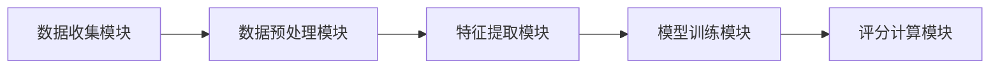

# AI辅助的公司治理评分系统

> 关键词：AI辅助、公司治理评分系统、机器学习、数据分析、公司治理评估

> 摘要：本文围绕AI辅助的公司治理评分系统展开深入探讨。首先介绍了该系统产生的背景，包括目的、预期读者、文档结构等内容。接着阐述了核心概念及其联系，详细说明了系统的原理和架构，并给出相应的文本示意图和Mermaid流程图。深入分析了核心算法原理，用Python代码进行详细阐述，同时介绍了相关的数学模型和公式。通过项目实战，展示了系统的开发环境搭建、源代码实现及代码解读。还探讨了系统的实际应用场景，推荐了学习、开发相关的工具和资源，包括书籍、在线课程、开发工具等。最后总结了系统的未来发展趋势与挑战，提供了常见问题解答及扩展阅读和参考资料，旨在为读者全面介绍AI辅助的公司治理评分系统。

## 1. 背景介绍 
### 1.1 目的和范围
公司治理是公司发展的核心要素之一，有效的公司治理能够保障公司的稳定运营、提升公司的竞争力和价值。传统的公司治理评分方法往往依赖于人工评估，存在评估效率低、主观性强、难以处理大量复杂数据等问题。AI辅助的公司治理评分系统的目的在于利用人工智能技术，尤其是机器学习和数据分析算法，实现对公司治理水平的客观、准确、高效评估。

本系统的范围涵盖了对公司治理多个维度的评估，包括但不限于董事会结构、股东权益保护、信息披露质量、内部控制等方面。通过收集和分析公司的各种数据，如财务报表、公告信息、股权结构等，系统能够生成综合的公司治理评分，为投资者、监管机构、公司管理层等提供决策依据。

### 1.2 预期读者
本文的预期读者包括以下几类人群：
1. **投资者**：希望通过了解公司治理水平来评估投资风险和潜在回报，从而做出更明智的投资决策。
2. **监管机构**：需要对公司的治理情况进行监管，以维护市场秩序和保护投资者利益。
3. **公司管理层**：可以借助系统的评分结果，发现公司治理中存在的问题，及时采取改进措施，提升公司的治理水平。
4. **研究人员**：对公司治理和人工智能技术的结合感兴趣，希望深入了解相关理论和实践。
5. **软件开发人员**：有兴趣开发或优化公司治理评分系统，需要了解系统的技术原理和实现方法。

### 1.3 文档结构概述
本文将按照以下结构进行组织：
1. **核心概念与联系**：介绍公司治理评分系统的核心概念，包括系统的原理和架构，并给出相应的文本示意图和Mermaid流程图。
2. **核心算法原理 & 具体操作步骤**：详细阐述系统所使用的核心算法原理，并用Python代码进行详细说明。
3. **数学模型和公式 & 详细讲解 & 举例说明**：介绍系统涉及的数学模型和公式，并通过具体例子进行讲解。
4. **项目实战：代码实际案例和详细解释说明**：展示系统的开发环境搭建、源代码实现及代码解读。
5. **实际应用场景**：探讨系统在实际中的应用场景和价值。
6. **工具和资源推荐**：推荐学习和开发相关的工具和资源，包括书籍、在线课程、开发工具等。
7. **总结：未来发展趋势与挑战**：总结系统的未来发展趋势和面临的挑战。
8. **附录：常见问题与解答**：解答读者可能遇到的常见问题。
9. **扩展阅读 & 参考资料**：提供相关的扩展阅读材料和参考资料。

### 1.4 术语表
#### 1.4.1 核心术语定义
- **公司治理**：指通过一套包括正式或非正式的、内部或外部的制度或机制来协调公司与所有利益相关者之间的利益关系，以保证公司决策的科学性，从而最终维护公司各方面的利益。
- **公司治理评分系统**：用于评估公司治理水平的系统，通过收集和分析相关数据，生成公司治理的综合评分。
- **AI辅助**：利用人工智能技术，如机器学习、深度学习等，为公司治理评分系统提供支持，提高评估的准确性和效率。
- **机器学习**：一门多领域交叉学科，涉及概率论、统计学、逼近论、凸分析、算法复杂度理论等多门学科。它专门研究计算机怎样模拟或实现人类的学习行为，以获取新的知识或技能，重新组织已有的知识结构使之不断改善自身的性能。
- **数据分析**：指用适当的统计分析方法对收集来的大量数据进行分析，提取有用信息和形成结论而对数据加以详细研究和概括总结的过程。

#### 1.4.2 相关概念解释
- **董事会结构**：包括董事会的规模、独立董事的比例、董事会的专业委员会设置等方面，合理的董事会结构有助于提高公司决策的科学性和独立性。
- **股东权益保护**：指通过法律法规、公司章程等制度安排，保障股东的合法权益，如知情权、表决权、分红权等。
- **信息披露质量**：公司按照规定向投资者和社会公众披露信息的真实性、准确性、完整性和及时性，高质量的信息披露有助于提高市场透明度和投资者信心。
- **内部控制**：企业为实现经营目标，保护资产安全完整，保证会计信息资料真实可靠，确保经营方针的贯彻执行，保证经营活动的经济性、效率性和效果性而在企业内部采取的自我调整、约束、规划、评价和控制的一系列方法、手续与措施的总称。

#### 1.4.3 缩略词列表
- **AI**：Artificial Intelligence，人工智能
- **ML**：Machine Learning，机器学习
- **DL**：Deep Learning，深度学习
- **PCA**：Principal Component Analysis，主成分分析
- **SVM**：Support Vector Machine，支持向量机

## 2. 核心概念与联系 
### 核心概念原理
AI辅助的公司治理评分系统的核心原理是利用人工智能技术对公司治理相关的数据进行收集、处理和分析，从而得出公司治理的综合评分。具体来说，系统主要包括以下几个步骤：
1. **数据收集**：从各种渠道收集公司治理相关的数据，如公司财务报表、公告信息、股权结构等。
2. **数据预处理**：对收集到的数据进行清洗、转换和归一化等处理，以提高数据的质量和可用性。
3. **特征提取**：从预处理后的数据中提取能够反映公司治理水平的特征，如董事会独立性、股东权益集中度等。
4. **模型训练**：使用机器学习或深度学习算法对提取的特征进行训练，建立公司治理评分模型。
5. **评分计算**：将待评估公司的数据输入到训练好的模型中，计算出公司的治理评分。

### 架构的文本示意图
```plaintext
+-------------------+
|   数据收集模块    |
|  (财务报表、公告  |
|   信息、股权结构) |
+-------------------+
          |
          v
+-------------------+
|  数据预处理模块   |
| (清洗、转换、归一化)|
+-------------------+
          |
          v
+-------------------+
|  特征提取模块     |
| (董事会独立性、    |
|  股东权益集中度等)|
+-------------------+
          |
          v
+-------------------+
|  模型训练模块     |
| (机器学习、深度学习)|
+-------------------+
          |
          v
+-------------------+
|  评分计算模块     |
| (输出公司治理评分)|
+-------------------+
```

### Mermaid流程图


## 3. 核心算法原理 & 具体操作步骤 
### 核心算法原理
在AI辅助的公司治理评分系统中，常用的机器学习算法包括决策树、支持向量机、神经网络等。这里以支持向量机（SVM）为例，介绍核心算法原理。

支持向量机是一种二分类模型，其基本思想是在特征空间中找到一个最优的超平面，使得不同类别的样本能够被最大程度地分开。对于线性可分的情况，SVM的目标是找到一个超平面 $w^T x + b = 0$，使得所有正类样本满足 $w^T x + b \geq 1$，所有负类样本满足 $w^T x + b \leq -1$，并且两类样本到超平面的最小距离（间隔）最大。

对于线性不可分的情况，SVM通过引入松弛变量 $\xi_i$ 和惩罚参数 $C$，将问题转化为一个凸二次规划问题：

$$
\begin{aligned}
\min_{w,b,\xi} &\quad \frac{1}{2} w^T w + C \sum_{i=1}^{n} \xi_i \\
\text{s.t.} &\quad y_i (w^T x_i + b) \geq 1 - \xi_i, \quad i = 1, \cdots, n \\
&\quad \xi_i \geq 0, \quad i = 1, \cdots, n
\end{aligned}
$$

其中，$w$ 是超平面的法向量，$b$ 是偏置，$x_i$ 是第 $i$ 个样本，$y_i \in \{-1, 1\}$ 是第 $i$ 个样本的标签，$C$ 是惩罚参数，用于平衡间隔最大化和分类误差最小化。

### 具体操作步骤
以下是使用Python实现基于支持向量机的公司治理评分系统的具体操作步骤：

```python
import numpy as np
from sklearn import svm
from sklearn.model_selection import train_test_split
from sklearn.preprocessing import StandardScaler

# 步骤1：数据准备
# 假设我们有一个包含公司治理特征和对应评分标签的数据集
# 特征矩阵 X，每行代表一个样本，每列代表一个特征
# 标签向量 y，每个元素代表一个样本的评分标签
X = np.array([[1, 2, 3], [4, 5, 6], [7, 8, 9], [10, 11, 12]])
y = np.array([1, 2, 1, 2])

# 步骤2：数据划分
# 将数据集划分为训练集和测试集
X_train, X_test, y_train, y_test = train_test_split(X, y, test_size=0.2, random_state=42)

# 步骤3：数据预处理
# 对特征数据进行标准化处理
scaler = StandardScaler()
X_train = scaler.fit_transform(X_train)
X_test = scaler.transform(X_test)

# 步骤4：模型训练
# 创建支持向量机分类器
clf = svm.SVC(kernel='linear')
# 训练模型
clf.fit(X_train, y_train)

# 步骤5：模型评估
# 在测试集上进行预测
y_pred = clf.predict(X_test)
# 计算模型的准确率
accuracy = np.mean(y_pred == y_test)
print("模型准确率:", accuracy)

# 步骤6：评分计算
# 对于新的公司治理数据，进行评分预测
new_data = np.array([[13, 14, 15]])
new_data = scaler.transform(new_data)
new_score = clf.predict(new_data)
print("新公司的治理评分预测:", new_score)
```

## 4. 数学模型和公式 & 详细讲解 & 举例说明 
### 支持向量机的数学模型和公式
支持向量机的核心数学模型是凸二次规划问题，具体如下：

#### 线性可分情况
对于线性可分的数据集 $\{(x_1, y_1), (x_2, y_2), \cdots, (x_n, y_n)\}$，其中 $x_i \in \mathbb{R}^d$ 是第 $i$ 个样本的特征向量，$y_i \in \{-1, 1\}$ 是第 $i$ 个样本的标签，我们的目标是找到一个超平面 $w^T x + b = 0$，使得所有正类样本满足 $w^T x + b \geq 1$，所有负类样本满足 $w^T x + b \leq -1$，并且两类样本到超平面的最小距离（间隔）最大。

间隔的计算公式为：$\gamma = \frac{2}{\|w\|}$，我们的目标是最大化间隔，即最小化 $\frac{1}{2} w^T w$。因此，线性可分情况下的支持向量机问题可以表示为以下约束优化问题：

$$
\begin{aligned}
\min_{w,b} &\quad \frac{1}{2} w^T w \\
\text{s.t.} &\quad y_i (w^T x_i + b) \geq 1, \quad i = 1, \cdots, n
\end{aligned}
$$

#### 线性不可分情况
对于线性不可分的数据集，我们引入松弛变量 $\xi_i \geq 0$，允许一些样本违反间隔约束。同时，为了平衡间隔最大化和分类误差最小化，我们引入惩罚参数 $C$。线性不可分情况下的支持向量机问题可以表示为以下凸二次规划问题：

$$
\begin{aligned}
\min_{w,b,\xi} &\quad \frac{1}{2} w^T w + C \sum_{i=1}^{n} \xi_i \\
\text{s.t.} &\quad y_i (w^T x_i + b) \geq 1 - \xi_i, \quad i = 1, \cdots, n \\
&\quad \xi_i \geq 0, \quad i = 1, \cdots, n
\end{aligned}
$$

### 详细讲解
在上述公式中，$w$ 是超平面的法向量，$b$ 是偏置，它们共同确定了一个超平面。$\xi_i$ 是松弛变量，用于衡量第 $i$ 个样本违反间隔约束的程度。$C$ 是惩罚参数，$C$ 越大，对分类误差的惩罚越严重，模型越倾向于减少分类误差；$C$ 越小，对间隔最大化的重视程度越高，模型越倾向于找到一个较大的间隔。

### 举例说明
假设我们有一个二维数据集，包含两个类别的样本：正类样本 $(1, 2)$ 和 $(2, 3)$，负类样本 $(3, 1)$ 和 $(4, 2)$。我们希望使用支持向量机找到一个最优的超平面来划分这两个类别。

首先，我们将数据集表示为矩阵形式：

$$
X = \begin{bmatrix}
1 & 2 \\
2 & 3 \\
3 & 1 \\
4 & 2
\end{bmatrix}, \quad
y = \begin{bmatrix}
1 \\
1 \\
-1 \\
-1
\end{bmatrix}
$$

然后，我们将这个问题转化为凸二次规划问题，并使用优化算法求解 $w$ 和 $b$。假设我们得到的最优解为 $w = [1, -1]^T$，$b = 0$，那么最优超平面的方程为 $x_1 - x_2 = 0$。

对于一个新的样本 $(5, 4)$，我们可以将其代入超平面方程：$5 - 4 = 1 > 0$，因此该样本被分类为正类。

## 5. 项目实战：代码实际案例和详细解释说明 
### 5.1  开发环境搭建
为了实现AI辅助的公司治理评分系统，我们需要搭建以下开发环境：
1. **Python环境**：建议使用Python 3.7及以上版本，可以从Python官方网站（https://www.python.org/downloads/）下载并安装。
2. **开发工具**：可以使用Jupyter Notebook、PyCharm等开发工具，这里推荐使用Jupyter Notebook，它可以方便地进行代码编写、调试和可视化。
3. **相关库**：需要安装以下Python库：
    - `numpy`：用于数值计算和数组操作。
    - `pandas`：用于数据处理和分析。
    - `scikit-learn`：用于机器学习算法的实现。
    - `matplotlib`：用于数据可视化。

可以使用以下命令安装这些库：
```sh
pip install numpy pandas scikit-learn matplotlib
```

### 5.2  源代码详细实现和代码解读
以下是一个完整的AI辅助的公司治理评分系统的源代码实现，并对代码进行详细解读：

```python
import numpy as np
import pandas as pd
from sklearn.model_selection import train_test_split
from sklearn.preprocessing import StandardScaler
from sklearn.svm import SVC
from sklearn.metrics import accuracy_score
import matplotlib.pyplot as plt

# 步骤1：数据加载和预处理
# 假设我们有一个包含公司治理特征和对应评分标签的CSV文件
data = pd.read_csv('company_governance_data.csv')

# 分离特征和标签
X = data.drop('score', axis=1).values
y = data['score'].values

# 数据划分
X_train, X_test, y_train, y_test = train_test_split(X, y, test_size=0.2, random_state=42)

# 数据标准化
scaler = StandardScaler()
X_train = scaler.fit_transform(X_train)
X_test = scaler.transform(X_test)

# 步骤2：模型训练
# 创建支持向量机分类器
clf = SVC(kernel='linear', C=1.0)

# 训练模型
clf.fit(X_train, y_train)

# 步骤3：模型评估
# 在测试集上进行预测
y_pred = clf.predict(X_test)

# 计算模型的准确率
accuracy = accuracy_score(y_test, y_pred)
print("模型准确率:", accuracy)

# 步骤4：可视化结果
# 绘制混淆矩阵
from sklearn.metrics import confusion_matrix
import seaborn as sns

cm = confusion_matrix(y_test, y_pred)
sns.heatmap(cm, annot=True, fmt='d', cmap='Blues')
plt.xlabel('Predicted Labels')
plt.ylabel('True Labels')
plt.title('Confusion Matrix')
plt.show()

# 步骤5：新数据预测
# 假设我们有一个新的公司治理数据
new_data = np.array([[1, 2, 3, 4, 5]])
new_data = scaler.transform(new_data)
new_score = clf.predict(new_data)
print("新公司的治理评分预测:", new_score)
```

### 代码解读与分析
1. **数据加载和预处理**：
    - 使用 `pandas` 库的 `read_csv` 函数加载包含公司治理特征和对应评分标签的CSV文件。
    - 使用 `drop` 方法分离特征和标签。
    - 使用 `train_test_split` 函数将数据集划分为训练集和测试集。
    - 使用 `StandardScaler` 对特征数据进行标准化处理，以确保不同特征具有相同的尺度。

2. **模型训练**：
    - 创建一个支持向量机分类器 `SVC`，使用线性核函数和惩罚参数 $C = 1.0$。
    - 使用 `fit` 方法对训练数据进行训练。

3. **模型评估**：
    - 使用 `predict` 方法在测试集上进行预测。
    - 使用 `accuracy_score` 函数计算模型的准确率。

4. **可视化结果**：
    - 使用 `confusion_matrix` 函数计算混淆矩阵，用于评估模型的分类性能。
    - 使用 `seaborn` 库的 `heatmap` 函数绘制混淆矩阵的热力图，直观展示模型的分类结果。

5. **新数据预测**：
    - 定义一个新的公司治理数据，并进行标准化处理。
    - 使用训练好的模型对新数据进行预测，输出预测的治理评分。

## 6. 实际应用场景 
### 投资者决策
投资者在进行投资决策时，需要评估公司的治理水平。AI辅助的公司治理评分系统可以为投资者提供客观、准确的公司治理评分，帮助投资者更好地了解公司的风险和潜在回报。投资者可以根据评分结果，筛选出治理水平较高的公司进行投资，降低投资风险。

### 监管机构监管
监管机构需要对公司的治理情况进行监管，以维护市场秩序和保护投资者利益。该系统可以帮助监管机构快速、全面地评估公司的治理水平，发现潜在的问题和风险。监管机构可以根据评分结果，对治理水平较低的公司进行重点监管，采取相应的监管措施，促进公司改善治理。

### 公司管理层自我评估
公司管理层可以利用系统的评分结果，对公司的治理情况进行自我评估。通过分析评分结果，管理层可以发现公司治理中存在的问题和不足之处，及时采取改进措施，提升公司的治理水平。同时，公司治理评分也可以作为管理层绩效评估的一个重要指标。

### 学术研究
在学术研究领域，AI辅助的公司治理评分系统可以为研究人员提供大量的公司治理数据和评估结果，有助于研究人员深入研究公司治理的影响因素和作用机制。研究人员可以利用这些数据和结果，开展实证研究，提出新的理论和观点。

## 7. 工具和资源推荐
### 7.1 学习资源推荐
#### 7.1.1 书籍推荐
- 《机器学习》（周志华）：这本书是机器学习领域的经典教材，全面介绍了机器学习的基本概念、算法和应用，适合初学者和有一定基础的读者。
- 《Python机器学习实战》（Sebastian Raschka）：本书通过实际案例，详细介绍了如何使用Python实现机器学习算法，包括数据预处理、模型训练、评估和优化等方面。
- 《公司治理》（李维安）：系统阐述了公司治理的基本理论、模式和实践，对理解公司治理的概念和方法有很大帮助。

#### 7.1.2 在线课程
- Coursera上的“Machine Learning”（Andrew Ng）：这是一门非常经典的机器学习课程，由斯坦福大学的Andrew Ng教授授课，内容涵盖了机器学习的基本概念、算法和应用。
- edX上的“Data Science MicroMasters Program”：该课程提供了数据科学的全面学习路径，包括机器学习、数据分析、数据可视化等方面的内容。
- 中国大学MOOC上的“公司治理理论与实务”：由国内知名高校的教授授课，系统介绍了公司治理的理论和实践。

#### 7.1.3 技术博客和网站
- Towards Data Science：这是一个专注于数据科学和机器学习的技术博客，提供了大量的优质文章和教程。
- Kaggle：一个数据科学竞赛平台，上面有很多关于机器学习和数据分析的案例和代码，可以学习到很多实用的技巧和方法。
- 中国知网：可以搜索到大量关于公司治理和人工智能的学术论文，有助于深入了解相关领域的研究动态。

### 7.2 开发工具框架推荐
#### 7.2.1 IDE和编辑器
- Jupyter Notebook：一个交互式的开发环境，适合进行数据探索、模型训练和可视化等工作。
- PyCharm：一款专业的Python集成开发环境，提供了丰富的功能和插件，适合开发大型的Python项目。
- Visual Studio Code：一款轻量级的代码编辑器，支持多种编程语言和插件，具有良好的扩展性和易用性。

#### 7.2.2 调试和性能分析工具
- IPython：一个交互式的Python shell，提供了强大的调试和分析功能，如代码补全、变量查看、性能分析等。
- cProfile：Python标准库中的性能分析工具，可以帮助我们找出代码中的性能瓶颈。
- TensorBoard：一个用于可视化深度学习模型训练过程的工具，可以帮助我们监控模型的训练进度和性能。

#### 7.2.3 相关框架和库
- scikit-learn：一个常用的机器学习库，提供了丰富的机器学习算法和工具，如分类、回归、聚类等。
- TensorFlow：一个开源的深度学习框架，广泛应用于图像识别、自然语言处理等领域。
- PyTorch：另一个流行的深度学习框架，具有动态图和易于使用的特点，适合快速开发和实验。

### 7.3 相关论文著作推荐
#### 7.3.1 经典论文
- Jensen, M. C., & Meckling, W. H. (1976). Theory of the firm: managerial behavior, agency costs and ownership structure. Journal of financial economics, 3(4), 305-360. 这篇论文提出了代理理论，对公司治理的研究产生了深远影响。
- Fama, E. F., & Jensen, M. C. (1983). Separation of ownership and control. Journal of law and economics, 26(2), 301-325. 探讨了所有权和控制权分离的问题，是公司治理领域的经典文献之一。

#### 7.3.2 最新研究成果
可以通过学术数据库（如IEEE Xplore、ACM Digital Library等）搜索关于AI辅助公司治理评分系统的最新研究论文，了解该领域的前沿动态和研究方向。

#### 7.3.3 应用案例分析
一些专业的商业期刊和研究报告中会有关于AI辅助公司治理评分系统的应用案例分析，可以从中学习到实际应用中的经验和教训。

## 8. 总结：未来发展趋势与挑战
### 未来发展趋势
1. **智能化程度不断提高**：随着人工智能技术的不断发展，AI辅助的公司治理评分系统将变得更加智能化。系统将能够自动识别和处理更多类型的数据，如非结构化数据（文本、图像等），并利用深度学习等技术进行更深入的分析和挖掘。
2. **与其他技术融合**：该系统将与区块链、物联网等技术进行深度融合。例如，利用区块链技术保证数据的真实性和不可篡改，通过物联网设备实时收集公司的运营数据，提高评分的实时性和准确性。
3. **个性化服务**：系统将根据不同用户的需求和偏好，提供个性化的公司治理评分和分析报告。例如，为投资者提供定制化的投资建议，为监管机构提供针对性的监管方案。
4. **国际化发展**：随着全球经济一体化的发展，AI辅助的公司治理评分系统将逐渐走向国际化。系统将能够处理不同国家和地区的公司治理数据，为全球投资者和监管机构提供服务。

### 挑战
1. **数据质量和安全问题**：系统的准确性和可靠性依赖于高质量的数据。然而，公司治理数据的收集和整理面临着数据不完整、不准确、不一致等问题。同时，数据安全也是一个重要的挑战，需要采取有效的措施保护公司和投资者的隐私和数据安全。
2. **算法可解释性**：人工智能算法，尤其是深度学习算法，往往具有较高的复杂度和黑箱性，其决策过程难以解释。在公司治理评分系统中，算法的可解释性至关重要，因为投资者和监管机构需要了解评分的依据和决策过程。
3. **法律法规和伦理问题**：AI辅助的公司治理评分系统的应用涉及到一系列法律法规和伦理问题。例如，如何确保系统的公平性和公正性，避免歧视和偏见；如何规范系统的使用和管理，防止数据滥用和泄露等。
4. **专业人才短缺**：开发和应用AI辅助的公司治理评分系统需要具备人工智能、公司治理、数据分析等多方面知识的专业人才。目前，这类人才相对短缺，制约了系统的发展和推广。

## 9. 附录：常见问题与解答
### 问题1：系统的评分结果是否准确可靠？
解答：系统的评分结果的准确性和可靠性取决于多个因素，包括数据质量、算法选择和模型训练等。我们在开发系统时，会采取一系列措施来提高评分的准确性，如数据预处理、特征选择、模型评估和优化等。然而，由于公司治理是一个复杂的概念，受到多种因素的影响，评分结果可能存在一定的误差。因此，评分结果仅供参考，投资者和监管机构在使用时应结合其他信息进行综合判断。

### 问题2：系统可以处理哪些类型的数据？
解答：系统可以处理多种类型的数据，包括结构化数据（如财务报表、股权结构等）和非结构化数据（如公告信息、新闻报道等）。对于结构化数据，我们可以直接进行数据清洗和分析；对于非结构化数据，我们需要使用自然语言处理等技术进行文本挖掘和信息提取。

### 问题3：如何选择合适的机器学习算法？
解答：选择合适的机器学习算法需要考虑多个因素，如数据类型、数据规模、问题类型等。在公司治理评分系统中，常用的机器学习算法包括决策树、支持向量机、神经网络等。对于小规模数据集和简单问题，可以选择决策树等算法；对于大规模数据集和复杂问题，可以选择支持向量机或神经网络等算法。同时，我们还可以使用交叉验证等方法对不同的算法进行评估和比较，选择最优的算法。

### 问题4：系统是否可以实时更新评分？
解答：系统可以实现实时更新评分，但需要具备实时数据采集和处理的能力。如果能够实时获取公司的相关数据，如财务数据、公告信息等，并及时进行数据处理和分析，就可以实现评分的实时更新。然而，实时数据采集和处理需要投入更多的资源和技术，目前在实际应用中还存在一定的挑战。

## 10. 扩展阅读 & 参考资料
### 扩展阅读
- 《人工智能时代的公司治理变革》：探讨了人工智能技术对公司治理的影响和挑战，以及公司治理的变革方向。
- 《数据驱动的公司治理决策》：介绍了如何利用数据分析和人工智能技术进行公司治理决策，提高决策的科学性和有效性。

### 参考资料
- 周志华. 机器学习. 清华大学出版社, 2016.
- Sebastian Raschka. Python机器学习实战. 人民邮电出版社, 2018.
- 李维安. 公司治理. 高等教育出版社, 2015.
- Jensen, M. C., & Meckling, W. H. (1976). Theory of the firm: managerial behavior, agency costs and ownership structure. Journal of financial economics, 3(4), 305-360.
- Fama, E. F., & Jensen, M. C. (1983). Separation of ownership and control. Journal of law and economics, 26(2), 301-325.

作者：AI天才研究院/AI Genius Institute & 禅与计算机程序设计艺术 /Zen And The Art of Computer Programming