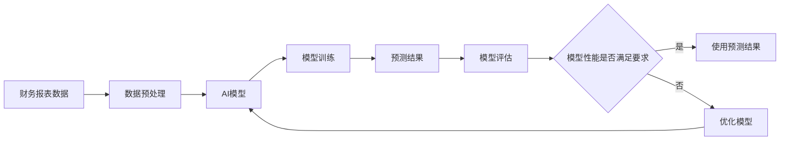

# AI辅助的公司财务报表预测

> 关键词：AI、公司财务报表预测、机器学习、数据分析、预测模型

> 摘要：本文聚焦于AI辅助的公司财务报表预测这一前沿领域。详细阐述了利用AI技术进行财务报表预测的背景、核心概念、算法原理、数学模型等内容。通过实际案例展示了如何搭建开发环境、实现源代码并进行解读。同时探讨了该技术在实际中的应用场景，推荐了相关的学习资源、开发工具和论文著作。最后总结了未来发展趋势与挑战，并对常见问题进行解答，为相关领域的研究者和从业者提供全面而深入的参考。

## 1. 背景介绍 
### 1.1 目的和范围
公司财务报表是反映企业财务状况和经营成果的重要文件，准确的财务报表预测对于企业的战略规划、投资决策、风险管理等方面都具有至关重要的意义。传统的财务报表预测方法往往依赖于人工经验和简单的统计模型，难以应对复杂多变的市场环境和企业经营情况。随着人工智能技术的飞速发展，利用AI辅助进行公司财务报表预测成为了一种新的趋势。

本文的目的在于深入探讨AI辅助的公司财务报表预测的相关技术和方法，介绍其核心概念、算法原理、数学模型等内容，并通过实际案例展示如何应用这些技术进行财务报表预测。本文的范围涵盖了常见的AI算法在财务报表预测中的应用，包括机器学习和深度学习算法，同时也涉及到数据预处理、特征工程、模型评估等方面的内容。

### 1.2 预期读者
本文的预期读者包括但不限于以下几类人群：
- 企业财务管理人员：希望了解如何利用AI技术提高财务报表预测的准确性和效率，为企业的决策提供更有力的支持。
- 金融分析师和投资者：对公司的财务状况和未来发展趋势感兴趣，希望借助AI辅助的预测方法更好地评估投资风险和收益。
- 数据科学家和AI研究者：关注AI技术在金融领域的应用，希望深入了解相关算法和模型在财务报表预测中的具体实现。
- 高校师生：学习财务管理、金融工程、人工智能等相关专业，希望通过本文了解前沿的研究成果和应用案例。

### 1.3 文档结构概述
本文将按照以下结构进行组织：
- 核心概念与联系：介绍AI辅助的公司财务报表预测的核心概念，包括财务报表的基本内容、AI技术的分类和应用，以及它们之间的联系。
- 核心算法原理 & 具体操作步骤：详细讲解常见的AI算法在财务报表预测中的原理，包括线性回归、决策树、神经网络等，并给出具体的操作步骤和Python代码示例。
- 数学模型和公式 & 详细讲解 & 举例说明：介绍财务报表预测中常用的数学模型和公式，如时间序列模型、回归模型等，并通过具体的例子进行详细讲解。
- 项目实战：代码实际案例和详细解释说明：通过一个实际的项目案例，展示如何利用AI技术进行公司财务报表预测，包括开发环境搭建、源代码实现和代码解读。
- 实际应用场景：探讨AI辅助的公司财务报表预测在企业战略规划、投资决策、风险管理等方面的实际应用场景。
- 工具和资源推荐：推荐相关的学习资源、开发工具和论文著作，帮助读者进一步深入学习和研究。
- 总结：未来发展趋势与挑战：总结AI辅助的公司财务报表预测的未来发展趋势，并分析可能面临的挑战。
- 附录：常见问题与解答：对读者可能关心的常见问题进行解答。
- 扩展阅读 & 参考资料：提供相关的扩展阅读材料和参考资料，方便读者进一步查阅。

### 1.4 术语表
#### 1.4.1 核心术语定义
- **财务报表**：是企业对外提供的反映企业某一特定日期的财务状况和某一会计期间的经营成果、现金流量等会计信息的文件，主要包括资产负债表、利润表和现金流量表。
- **AI（人工智能）**：是研究、开发用于模拟、延伸和扩展人的智能的理论、方法、技术及应用系统的一门新的技术科学，在财务报表预测中主要应用机器学习和深度学习等技术。
- **机器学习**：是一门多领域交叉学科，涉及概率论、统计学、逼近论、凸分析、算法复杂度理论等多门学科。它专门研究计算机怎样模拟或实现人类的学习行为，以获取新的知识或技能，重新组织已有的知识结构使之不断改善自身的性能。
- **深度学习**：是机器学习的一个分支领域，它是一种基于对数据进行表征学习的方法。深度学习通过构建具有很多层的神经网络模型，自动从大量数据中学习复杂的模式和特征。

#### 1.4.2 相关概念解释
- **特征工程**：是指从原始数据中提取特征，并将其转换为适合机器学习算法处理的格式的过程。在财务报表预测中，特征工程包括选择合适的财务指标、对数据进行预处理等操作。
- **模型评估**：是指使用一定的评估指标和方法对训练好的模型进行评估，以衡量模型的性能和预测能力。常见的评估指标包括均方误差（MSE）、均方根误差（RMSE）、平均绝对误差（MAE）等。
- **过拟合**：是指模型在训练数据上表现良好，但在测试数据上表现不佳的现象。过拟合通常是由于模型过于复杂，学习到了训练数据中的噪声和异常值导致的。
- **欠拟合**：是指模型在训练数据和测试数据上的表现都不佳的现象。欠拟合通常是由于模型过于简单，无法学习到数据中的复杂模式和特征导致的。

#### 1.4.3 缩略词列表
- **MSE（Mean Squared Error）**：均方误差
- **RMSE（Root Mean Squared Error）**：均方根误差
- **MAE（Mean Absolute Error）**：平均绝对误差
- **LSTM（Long Short-Term Memory）**：长短期记忆网络
- **RNN（Recurrent Neural Network）**：循环神经网络

## 2. 核心概念与联系 

### 核心概念原理

#### 财务报表概述
财务报表是企业财务信息的重要载体，主要包括资产负债表、利润表和现金流量表。
- **资产负债表**：反映企业在某一特定日期的财务状况，展示了企业的资产、负债和所有者权益的情况。资产是企业拥有或控制的经济资源，负债是企业所承担的债务，所有者权益是企业资产扣除负债后由所有者享有的剩余权益。
- **利润表**：反映企业在一定会计期间的经营成果，展示了企业的收入、成本、费用和利润的情况。收入是企业在日常活动中形成的、会导致所有者权益增加的、与所有者投入资本无关的经济利益的总流入，成本和费用是企业为了获取收入而发生的各种耗费，利润是企业在一定会计期间的经营成果。
- **现金流量表**：反映企业在一定会计期间的现金和现金等价物流入和流出的情况，展示了企业的经营活动、投资活动和筹资活动的现金流量。现金流量是企业生存和发展的重要保障，通过分析现金流量表可以了解企业的现金来源和使用情况，评估企业的资金流动性和偿债能力。

#### AI技术在财务报表预测中的应用
AI技术在财务报表预测中主要应用机器学习和深度学习算法。
- **机器学习算法**：如线性回归、决策树、随机森林等，这些算法可以通过对历史财务数据的学习，建立预测模型，对未来的财务指标进行预测。线性回归是一种简单而常用的机器学习算法，它通过建立自变量和因变量之间的线性关系来进行预测。决策树是一种基于树结构进行决策的机器学习算法，它可以对数据进行分类和回归分析。随机森林是一种集成学习算法，它通过组合多个决策树来提高模型的预测性能。
- **深度学习算法**：如神经网络、LSTM等，这些算法可以处理复杂的非线性关系，对财务数据进行更深入的分析和预测。神经网络是一种模仿人类神经系统的计算模型，它可以自动从数据中学习复杂的模式和特征。LSTM是一种特殊的神经网络，它可以处理序列数据，在时间序列预测中具有很好的效果。

### 架构的文本示意图

```plaintext
财务报表数据（资产负债表、利润表、现金流量表）
    |
    | 数据预处理（清洗、归一化、特征选择等）
    v
AI模型（机器学习或深度学习模型）
    |
    | 模型训练（使用历史数据进行训练）
    v
预测结果（未来财务指标的预测值）
    |
    | 模型评估（使用评估指标评估模型性能）
    v
优化模型（调整模型参数或更换模型）
```

### Mermaid流程图



## 3. 核心算法原理 & 具体操作步骤 

### 线性回归算法原理
线性回归是一种最简单的机器学习算法，它的基本思想是通过建立自变量和因变量之间的线性关系来进行预测。假设我们有一个包含 $n$ 个样本的数据集 $\{(x_1, y_1), (x_2, y_2), \cdots, (x_n, y_n)\}$，其中 $x_i$ 是自变量，$y_i$ 是因变量。线性回归模型可以表示为：

$$y = \theta_0 + \theta_1x_1 + \theta_2x_2 + \cdots + \theta_mx_m + \epsilon$$

其中，$\theta_0, \theta_1, \cdots, \theta_m$ 是模型的参数，$\epsilon$ 是误差项。线性回归的目标是找到一组最优的参数 $\theta$，使得模型的预测值与真实值之间的误差最小。通常使用最小二乘法来求解最优参数，即最小化误差平方和：

$$J(\theta) = \frac{1}{2n}\sum_{i=1}^{n}(y_i - \hat{y}_i)^2$$

其中，$\hat{y}_i$ 是模型的预测值。

### 线性回归算法的具体操作步骤

#### 步骤1：数据准备
首先，需要收集和整理财务报表数据，将其转换为适合线性回归模型处理的格式。通常需要对数据进行清洗、归一化等预处理操作。

#### 步骤2：模型训练
使用训练数据对线性回归模型进行训练，求解最优参数 $\theta$。可以使用梯度下降法等优化算法来求解最小化误差平方和的问题。

#### 步骤3：模型预测
使用训练好的模型对测试数据进行预测，得到未来财务指标的预测值。

#### 步骤4：模型评估
使用评估指标对模型的性能进行评估，如均方误差（MSE）、均方根误差（RMSE）、平均绝对误差（MAE）等。

### Python代码示例

```python
import numpy as np
from sklearn.linear_model import LinearRegression
from sklearn.metrics import mean_squared_error, mean_absolute_error

# 生成示例数据
X_train = np.array([[1], [2], [3], [4], [5]])
y_train = np.array([2, 4, 6, 8, 10])
X_test = np.array([[6], [7], [8]])
y_test = np.array([12, 14, 16])

# 创建线性回归模型
model = LinearRegression()

# 模型训练
model.fit(X_train, y_train)

# 模型预测
y_pred = model.predict(X_test)

# 模型评估
mse = mean_squared_error(y_test, y_pred)
mae = mean_absolute_error(y_test, y_pred)
rmse = np.sqrt(mse)

print("均方误差 (MSE):", mse)
print("平均绝对误差 (MAE):", mae)
print("均方根误差 (RMSE):", rmse)
```

### 决策树算法原理
决策树是一种基于树结构进行决策的机器学习算法，它可以对数据进行分类和回归分析。决策树的基本思想是通过递归地划分数据集，构建一个树状结构的模型。每个内部节点表示一个特征上的测试，每个分支表示一个测试输出，每个叶节点表示一个类别或一个值。

决策树的构建过程通常包括以下几个步骤：
- **特征选择**：选择一个最优的特征作为当前节点的划分特征。
- **数据集划分**：根据划分特征的取值，将数据集划分为多个子集。
- **递归构建**：对每个子集递归地构建决策树，直到满足停止条件。

### 决策树算法的具体操作步骤

#### 步骤1：数据准备
同样需要收集和整理财务报表数据，进行预处理操作。

#### 步骤2：模型训练
使用训练数据对决策树模型进行训练，构建决策树。可以使用信息增益、基尼指数等指标来选择最优的划分特征。

#### 步骤3：模型预测
使用训练好的模型对测试数据进行预测，得到未来财务指标的预测值。

#### 步骤4：模型评估
使用评估指标对模型的性能进行评估。

### Python代码示例

```python
from sklearn.tree import DecisionTreeRegressor
from sklearn.metrics import mean_squared_error, mean_absolute_error

# 生成示例数据
X_train = np.array([[1], [2], [3], [4], [5]])
y_train = np.array([2, 4, 6, 8, 10])
X_test = np.array([[6], [7], [8]])
y_test = np.array([12, 14, 16])

# 创建决策树回归模型
model = DecisionTreeRegressor()

# 模型训练
model.fit(X_train, y_train)

# 模型预测
y_pred = model.predict(X_test)

# 模型评估
mse = mean_squared_error(y_test, y_pred)
mae = mean_absolute_error(y_test, y_pred)
rmse = np.sqrt(mse)

print("均方误差 (MSE):", mse)
print("平均绝对误差 (MAE):", mae)
print("均方根误差 (RMSE):", rmse)
```

## 4. 数学模型和公式 & 详细讲解 & 举例说明 

### 时间序列模型

#### 原理
时间序列模型是一种用于分析和预测时间序列数据的统计模型。时间序列数据是指按照时间顺序排列的一系列观测值。常见的时间序列模型包括自回归模型（AR）、移动平均模型（MA）、自回归移动平均模型（ARMA）和自回归积分移动平均模型（ARIMA）等。

#### 自回归模型（AR）
自回归模型是一种基于历史观测值进行预测的时间序列模型。AR(p) 模型可以表示为：

$$y_t = c + \phi_1y_{t-1} + \phi_2y_{t-2} + \cdots + \phi_py_{t-p} + \epsilon_t$$

其中，$y_t$ 是时间序列在时刻 $t$ 的观测值，$c$ 是常数项，$\phi_1, \phi_2, \cdots, \phi_p$ 是自回归系数，$\epsilon_t$ 是白噪声。

#### 移动平均模型（MA）
移动平均模型是一种基于历史误差项进行预测的时间序列模型。MA(q) 模型可以表示为：

$$y_t = \mu + \epsilon_t + \theta_1\epsilon_{t-1} + \theta_2\epsilon_{t-2} + \cdots + \theta_q\epsilon_{t-q}$$

其中，$\mu$ 是均值，$\theta_1, \theta_2, \cdots, \theta_q$ 是移动平均系数。

#### 自回归移动平均模型（ARMA）
自回归移动平均模型是自回归模型和移动平均模型的结合。ARMA(p, q) 模型可以表示为：

$$y_t = c + \phi_1y_{t-1} + \phi_2y_{t-2} + \cdots + \phi_py_{t-p} + \epsilon_t + \theta_1\epsilon_{t-1} + \theta_2\epsilon_{t-2} + \cdots + \theta_q\epsilon_{t-q}$$

#### 自回归积分移动平均模型（ARIMA）
自回归积分移动平均模型是在 ARMA 模型的基础上，对时间序列进行差分处理，以使其具有平稳性。ARIMA(p, d, q) 模型可以表示为：

$$\phi(B)(1 - B)^dy_t = c + \theta(B)\epsilon_t$$

其中，$\phi(B)$ 和 $\theta(B)$ 分别是自回归和移动平均的滞后算子多项式，$(1 - B)^d$ 是差分算子，$d$ 是差分阶数。

#### 举例说明
假设我们有一个时间序列数据 $\{y_1, y_2, \cdots, y_n\}$，我们可以使用 ARIMA 模型对其进行预测。首先，需要对数据进行平稳性检验，如使用 ADF 检验。如果数据不平稳，则需要进行差分处理，直到数据平稳为止。然后，确定 ARIMA 模型的参数 $p, d, q$，可以使用信息准则（如 AIC、BIC）来选择最优的参数。最后，使用训练好的模型对未来的观测值进行预测。

### 回归模型

#### 原理
回归模型是一种用于建立自变量和因变量之间关系的统计模型。在财务报表预测中，我们可以使用回归模型来预测财务指标与其他因素之间的关系。常见的回归模型包括线性回归、多项式回归、逻辑回归等。

#### 线性回归
线性回归模型的原理在前面已经介绍过，其数学公式为：

$$y = \theta_0 + \theta_1x_1 + \theta_2x_2 + \cdots + \theta_mx_m + \epsilon$$

#### 多项式回归
多项式回归是在线性回归的基础上，将自变量进行多项式变换，以拟合更复杂的非线性关系。多项式回归模型可以表示为：

$$y = \theta_0 + \theta_1x + \theta_2x^2 + \cdots + \theta_nx^n + \epsilon$$

#### 逻辑回归
逻辑回归是一种用于分类问题的回归模型，它通过逻辑函数将线性回归的输出映射到 $[0, 1]$ 区间，用于表示概率。逻辑回归模型可以表示为：

$$P(y = 1|x) = \frac{1}{1 + e^{-(\theta_0 + \theta_1x_1 + \theta_2x_2 + \cdots + \theta_mx_m)}}$$

#### 举例说明
假设我们要预测公司的净利润与营业收入、成本等因素之间的关系，可以使用线性回归模型。收集历史数据，将营业收入、成本等作为自变量，净利润作为因变量，建立线性回归模型。通过最小二乘法求解模型的参数，得到预测方程。然后，使用该方程对未来的净利润进行预测。

## 5. 项目实战：代码实际案例和详细解释说明 

### 5.1  开发环境搭建
#### 操作系统
可以选择 Windows、Linux 或 macOS 操作系统。建议使用 Linux 系统，因为它在数据处理和机器学习方面具有更好的性能和稳定性。

#### Python 环境
安装 Python 3.6 或以上版本。可以使用 Anaconda 来管理 Python 环境，Anaconda 包含了许多常用的科学计算和机器学习库，方便我们进行开发。

#### 安装必要的库
使用以下命令安装必要的库：

```sh
pip install pandas numpy scikit-learn matplotlib
```

### 5.2  源代码详细实现和代码解读

#### 数据加载和预处理
```python
import pandas as pd
import numpy as np

# 加载财务报表数据
data = pd.read_csv('financial_statements.csv')

# 数据清洗，去除缺失值
data = data.dropna()

# 选择特征和目标变量
features = data[['revenue', 'cost', 'assets']]
target = data['net_income']

# 数据归一化
from sklearn.preprocessing import StandardScaler
scaler = StandardScaler()
features_scaled = scaler.fit_transform(features)
```
**代码解读**：首先，使用 `pandas` 库加载财务报表数据。然后，使用 `dropna()` 方法去除数据中的缺失值。接着，选择需要的特征和目标变量。最后，使用 `StandardScaler` 对特征数据进行归一化处理，以提高模型的训练效果。

#### 模型训练和预测
```python
from sklearn.model_selection import train_test_split
from sklearn.linear_model import LinearRegression
from sklearn.metrics import mean_squared_error, mean_absolute_error

# 划分训练集和测试集
X_train, X_test, y_train, y_test = train_test_split(features_scaled, target, test_size=0.2, random_state=42)

# 创建线性回归模型
model = LinearRegression()

# 模型训练
model.fit(X_train, y_train)

# 模型预测
y_pred = model.predict(X_test)
```
**代码解读**：使用 `train_test_split` 方法将数据集划分为训练集和测试集，其中测试集占比为 20%。然后，创建线性回归模型，并使用训练集数据对模型进行训练。最后，使用训练好的模型对测试集数据进行预测。

#### 模型评估
```python
# 模型评估
mse = mean_squared_error(y_test, y_pred)
mae = mean_absolute_error(y_test, y_pred)
rmse = np.sqrt(mse)

print("均方误差 (MSE):", mse)
print("平均绝对误差 (MAE):", mae)
print("均方根误差 (RMSE):", rmse)
```
**代码解读**：使用 `mean_squared_error`、`mean_absolute_error` 等函数计算模型的评估指标，包括均方误差、平均绝对误差和均方根误差，并打印输出。

### 5.3  代码解读与分析
- **数据预处理的重要性**：数据预处理是机器学习项目中非常重要的一步，它可以提高数据的质量和模型的训练效果。在本案例中，我们进行了数据清洗和归一化处理，去除了缺失值并将特征数据进行了标准化，使得模型能够更好地学习数据中的模式和特征。
- **模型选择和训练**：选择合适的模型对于项目的成功至关重要。在本案例中，我们选择了线性回归模型，它是一种简单而有效的模型，适用于处理线性关系的数据。通过使用训练集数据对模型进行训练，我们得到了一个能够预测公司净利润的模型。
- **模型评估的意义**：模型评估是衡量模型性能的重要手段，通过计算评估指标，我们可以了解模型的预测能力和准确性。在本案例中，我们使用了均方误差、平均绝对误差和均方根误差等指标来评估模型的性能，这些指标可以帮助我们判断模型是否满足需求，并进行进一步的优化。

## 6. 实际应用场景 
### 企业战略规划
企业在制定战略规划时，需要对未来的财务状况进行预测。AI辅助的公司财务报表预测可以帮助企业更准确地预测未来的收入、成本、利润等财务指标，从而为企业的战略决策提供有力的支持。例如，企业可以根据预测结果来确定未来的投资方向、生产规模和市场拓展计划等。

### 投资决策
投资者在进行投资决策时，需要对公司的财务状况和未来发展趋势进行评估。AI辅助的财务报表预测可以帮助投资者更准确地评估公司的价值和投资风险，从而做出更明智的投资决策。例如，投资者可以根据预测结果来选择具有潜力的投资标的，或者调整投资组合的配置。

### 风险管理
企业在经营过程中面临着各种风险，如市场风险、信用风险、流动性风险等。AI辅助的财务报表预测可以帮助企业及时发现潜在的风险，并采取相应的措施进行风险管理。例如，企业可以根据预测结果来调整资金的配置，降低流动性风险；或者加强对客户的信用评估，降低信用风险。

### 财务预算管理
企业在进行财务预算管理时，需要对未来的收入、成本、费用等进行预测。AI辅助的财务报表预测可以帮助企业更准确地制定财务预算，提高预算的科学性和合理性。例如，企业可以根据预测结果来调整预算指标，确保预算的可行性和有效性。

## 7. 工具和资源推荐
### 7.1 学习资源推荐
#### 7.1.1 书籍推荐
- 《Python 数据分析实战》：本书介绍了使用 Python 进行数据分析的方法和技巧，包括数据清洗、数据可视化、机器学习等内容，适合初学者入门。
- 《机器学习》：周志华著，这本书是机器学习领域的经典教材，系统地介绍了机器学习的基本概念、算法和应用，适合深入学习机器学习的读者。
- 《深度学习》：Ian Goodfellow、Yoshua Bengio 和 Aaron Courville 著，这本书是深度学习领域的权威著作，全面介绍了深度学习的理论和实践，适合有一定机器学习基础的读者。

#### 7.1.2 在线课程
- Coursera 上的《机器学习》课程：由 Andrew Ng 教授主讲，是一门非常经典的机器学习课程，涵盖了机器学习的基本概念、算法和应用。
- edX 上的《深度学习》课程：由 DeepLearning.AI 提供，包括多个深度学习的专项课程，适合深入学习深度学习的读者。
- 中国大学 MOOC 上的《Python 数据分析与应用》课程：由北京工业大学的教师主讲，介绍了使用 Python 进行数据分析的方法和技巧，适合初学者入门。

#### 7.1.3 技术博客和网站
- Medium：是一个技术博客平台，上面有很多关于 AI、机器学习和数据分析的文章，涵盖了最新的研究成果和应用案例。
- Kaggle：是一个数据科学竞赛平台，上面有很多公开的数据集和竞赛项目，可以帮助读者提高数据分析和机器学习的能力。
- 博客园：是一个国内的技术博客平台，上面有很多关于 Python、机器学习和数据分析的文章，适合国内读者学习。

### 7.2 开发工具框架推荐
#### 7.2.1 IDE和编辑器
- PyCharm：是一款专业的 Python IDE，具有代码编辑、调试、版本控制等功能，适合开发大型的 Python 项目。
- Jupyter Notebook：是一个交互式的开发环境，适合进行数据分析和模型训练，支持代码、文本、图表等多种形式的展示。
- Visual Studio Code：是一款轻量级的代码编辑器，支持多种编程语言，具有丰富的插件和扩展功能，适合快速开发和调试代码。

#### 7.2.2 调试和性能分析工具
- PDB：是 Python 自带的调试工具，可以帮助开发者在代码中设置断点、单步执行等，方便调试代码。
- cProfile：是 Python 自带的性能分析工具，可以分析代码的运行时间和函数调用情况，帮助开发者优化代码性能。
- TensorBoard：是 TensorFlow 提供的可视化工具，可以帮助开发者可视化模型的训练过程和性能指标，方便调试和优化模型。

#### 7.2.3 相关框架和库
- Scikit-learn：是一个常用的机器学习库，提供了丰富的机器学习算法和工具，如分类、回归、聚类等。
- TensorFlow：是一个开源的深度学习框架，由 Google 开发，提供了丰富的深度学习模型和工具，如神经网络、卷积神经网络等。
- PyTorch：是一个开源的深度学习框架，由 Facebook 开发，具有动态图和易于使用的特点，适合快速开发和实验深度学习模型。

### 7.3 相关论文著作推荐
#### 7.3.1 经典论文
- 《Gradient-Based Learning Applied to Document Recognition》：Yann LeCun、Léon Bottou、Yoshua Bengio 和 Patrick Haffner 著，这篇论文介绍了卷积神经网络（CNN）在手写数字识别中的应用，是深度学习领域的经典论文之一。
- 《Long Short-Term Memory》：Sepp Hochreiter 和 Jürgen Schmidhuber 著，这篇论文介绍了长短期记忆网络（LSTM）的原理和应用，是循环神经网络领域的经典论文之一。
- 《Random Forests》：Leo Breiman 著，这篇论文介绍了随机森林算法的原理和应用，是集成学习领域的经典论文之一。

#### 7.3.2 最新研究成果
- 可以关注顶级学术会议和期刊，如 NeurIPS、ICML、KDD 等，上面有很多关于 AI、机器学习和数据分析的最新研究成果。
- 也可以关注知名的研究机构和学者的个人主页，如 Google AI、OpenAI 等，了解他们的最新研究动态。

#### 7.3.3 应用案例分析
- 《AI in Finance: The New Wave of Financial Innovation》：这本书介绍了 AI 在金融领域的应用案例，包括风险管理、投资决策、财务报表预测等方面，适合了解 AI 在金融领域的实际应用。
- 可以关注一些金融科技公司的官方网站和博客，了解他们在 AI 辅助财务报表预测等方面的应用案例和实践经验。

## 8. 总结：未来发展趋势与挑战
### 未来发展趋势
- **多模态数据融合**：未来的财务报表预测可能会融合更多的多模态数据，如文本数据、图像数据等。例如，通过分析企业的新闻报道、社交媒体评论等文本数据，以及企业的生产车间、办公场所等图像数据，来更全面地了解企业的经营状况和发展趋势，提高财务报表预测的准确性。
- **深度学习模型的优化**：随着深度学习技术的不断发展，未来可能会出现更加优化的深度学习模型，用于财务报表预测。例如，结合强化学习和深度学习的方法，让模型能够根据不同的市场环境和企业情况自动调整预测策略，提高模型的适应性和预测性能。
- **实时预测**：随着信息技术的飞速发展，企业的财务数据可以实时更新。未来的财务报表预测系统可能会实现实时预测，及时反映企业的财务状况和经营成果的变化，为企业的决策提供更及时的支持。
- **与区块链技术的结合**：区块链技术具有去中心化、不可篡改、安全可靠等特点。未来，AI辅助的财务报表预测可能会与区块链技术相结合，确保财务数据的真实性和完整性，提高预测结果的可信度。

### 挑战
- **数据质量问题**：财务报表预测依赖于大量的历史数据，数据的质量直接影响模型的预测性能。然而，实际中的财务数据可能存在缺失值、异常值、错误数据等问题，需要进行复杂的数据清洗和预处理工作。此外，数据的一致性和准确性也需要得到保证，否则会导致模型的偏差和错误。
- **模型解释性问题**：深度学习模型等复杂的AI模型通常具有较高的预测性能，但它们往往是黑盒模型，难以解释模型的决策过程和预测结果。在财务领域，模型的解释性非常重要，因为决策者需要了解模型是如何得出预测结果的，以便做出合理的决策。因此，如何提高模型的解释性是一个亟待解决的问题。
- **法律法规和伦理问题**：AI辅助的财务报表预测涉及到企业的敏感财务信息，需要遵守相关的法律法规和伦理准则。例如，数据的隐私保护、模型的公平性和透明度等问题都需要得到重视。此外，AI模型的应用也可能会对就业市场产生影响，需要考虑如何应对这些社会问题。
- **技术更新换代快**：AI技术发展迅速，新的算法和模型不断涌现。企业和从业者需要不断学习和掌握新的技术，以跟上技术发展的步伐。同时，如何选择合适的技术和模型，以及如何将其应用到实际的财务报表预测中，也是一个挑战。

## 9. 附录：常见问题与解答
### 问题1：AI辅助的财务报表预测是否可以完全替代人工分析？
答：目前还不能完全替代人工分析。虽然AI技术在处理大量数据和复杂模式方面具有优势，但财务报表预测不仅仅是数据的分析和处理，还需要考虑企业的战略、市场环境、行业动态等多方面的因素。人工分析可以结合专业知识和经验，对AI预测结果进行评估和调整，提供更全面和深入的见解。因此，AI辅助的财务报表预测和人工分析应该相互补充，共同为企业的决策提供支持。

### 问题2：如何选择合适的AI算法进行财务报表预测？
答：选择合适的AI算法需要考虑多个因素，包括数据的特点、问题的类型、模型的复杂度和可解释性等。如果数据具有线性关系，可以选择线性回归等简单的算法；如果数据具有复杂的非线性关系，可以选择决策树、神经网络等复杂的算法。此外，还需要考虑模型的可解释性，对于一些对解释性要求较高的场景，如财务审计，应该选择可解释性较强的算法。同时，可以通过实验和比较不同算法的性能，选择最优的算法。

### 问题3：AI辅助的财务报表预测的准确性如何保证？
答：保证AI辅助的财务报表预测的准确性需要从多个方面入手。首先，要确保数据的质量，进行充分的数据清洗和预处理，去除缺失值、异常值等。其次，要选择合适的模型和算法，并进行合理的参数调整。可以使用交叉验证等方法来评估模型的性能，选择最优的模型和参数。此外，还可以结合多种模型和算法进行集成学习，提高预测的准确性。最后，要对模型进行持续的监控和评估，及时发现模型的偏差和错误，并进行调整和优化。

### 问题4：AI辅助的财务报表预测需要具备哪些技术和知识？
答：需要具备以下技术和知识：
- **数据分析**：掌握数据清洗、数据可视化、特征工程等数据分析技术，能够对财务数据进行有效的处理和分析。
- **机器学习和深度学习**：了解常见的机器学习和深度学习算法，如线性回归、决策树、神经网络等，能够使用相关的库和框架进行模型的训练和预测。
- **财务知识**：熟悉财务报表的基本内容和分析方法，了解企业的财务状况和经营成果的评估指标。
- **编程技能**：掌握Python等编程语言，能够使用相关的库和工具进行数据处理、模型训练和预测。

## 10. 扩展阅读 & 参考资料
### 扩展阅读
- 《智能金融：科技重塑金融未来》：这本书介绍了智能金融的概念、技术和应用，包括AI在金融领域的多个方面的应用，如风险管理、投资决策、财务报表预测等。
- 《数据驱动的金融：智能时代的金融变革与创新》：探讨了数据驱动在金融领域的重要性和应用，包括如何利用数据和AI技术进行金融决策和创新。

### 参考资料
- 相关的学术论文和研究报告，可以通过学术数据库如 IEEE Xplore、ACM Digital Library、中国知网等进行查找。
- 金融机构和企业的官方网站，可能会发布一些关于财务报表预测和AI应用的案例和研究成果。

作者：AI天才研究院/AI Genius Institute & 禅与计算机程序设计艺术 /Zen And The Art of Computer Programming