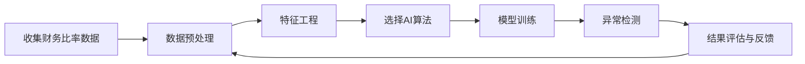

# AI辅助的公司财务比率异常检测

> 关键词：AI、公司财务比率、异常检测、机器学习、数据挖掘

> 摘要：本文聚焦于AI辅助的公司财务比率异常检测这一重要课题。随着企业财务数据的日益复杂和庞大，传统的异常检测方法面临诸多挑战。AI技术的引入为解决这些问题提供了新的途径。文章首先介绍了研究的背景、目的和预期读者等内容，接着阐述了核心概念及联系，详细讲解了核心算法原理与操作步骤，给出了相关的数学模型和公式，并结合实例进行说明。通过项目实战展示了代码实现和解读，探讨了实际应用场景。同时推荐了学习、开发工具和相关论文著作等资源。最后总结了未来发展趋势与挑战，并对常见问题进行了解答，还提供了扩展阅读和参考资料，旨在为读者全面深入地了解AI辅助的公司财务比率异常检测提供有价值的信息。

## 1. 背景介绍 
### 1.1 目的和范围
在当今复杂多变的商业环境中，公司的财务状况是投资者、监管机构和企业管理层关注的核心。财务比率作为评估公司财务健康状况的重要指标，能够反映公司的盈利能力、偿债能力、运营效率等多个方面。然而，财务数据可能会受到各种因素的影响，如会计政策变更、市场波动、欺诈行为等，导致财务比率出现异常。及时准确地检测出这些异常，对于防范财务风险、保障投资者利益、维护市场秩序具有重要意义。

本研究的目的是探讨如何利用AI技术辅助进行公司财务比率异常检测，提高检测的准确性和效率。研究范围涵盖了常见的财务比率，如流动比率、资产负债率、毛利率等，以及多种AI算法在异常检测中的应用。

### 1.2 预期读者
本文的预期读者包括金融分析师、投资者、企业财务管理人员、监管机构工作人员以及对AI技术在金融领域应用感兴趣的研究人员和学生。对于金融从业者，本文可以提供一种新的工具和方法来监测公司财务状况；对于研究人员和学生，本文可以作为学习和研究AI在财务领域应用的参考资料。

### 1.3 文档结构概述
本文将按照以下结构进行组织：
1. 背景介绍：阐述研究的目的、范围、预期读者和文档结构。
2. 核心概念与联系：介绍公司财务比率和AI异常检测的核心概念，以及它们之间的联系。
3. 核心算法原理 & 具体操作步骤：详细讲解几种常用的AI算法在财务比率异常检测中的原理和操作步骤，并给出Python代码示例。
4. 数学模型和公式 & 详细讲解 & 举例说明：介绍相关的数学模型和公式，并结合实际例子进行说明。
5. 项目实战：代码实际案例和详细解释说明：通过一个实际的项目案例，展示如何使用AI技术进行财务比率异常检测。
6. 实际应用场景：探讨AI辅助的公司财务比率异常检测在实际中的应用场景。
7. 工具和资源推荐：推荐一些学习和开发相关技术的工具和资源。
8. 总结：未来发展趋势与挑战：总结研究成果，展望未来发展趋势，并分析可能面临的挑战。
9. 附录：常见问题与解答：对常见问题进行解答。
10. 扩展阅读 & 参考资料：提供相关的扩展阅读材料和参考资料。

### 1.4 术语表
#### 1.4.1 核心术语定义
- **财务比率**：是指企业财务报表中的相关项目之间的比值，用于评估企业的财务状况和经营绩效。常见的财务比率包括偿债能力比率、盈利能力比率、运营能力比率等。
- **异常检测**：是指从数据中识别出与正常模式不同的异常数据点或模式的过程。在公司财务比率异常检测中，异常数据点可能表示财务数据存在问题或潜在的风险。
- **AI（人工智能）**：是指计算机系统能够执行通常需要人类智能才能完成的任务，如学习、推理、解决问题等。在本文中，主要涉及机器学习和深度学习等AI技术在财务比率异常检测中的应用。
- **机器学习**：是一门多领域交叉学科，涉及概率论、统计学、逼近论、凸分析、算法复杂度理论等多门学科。它专门研究计算机怎样模拟或实现人类的学习行为，以获取新的知识或技能，重新组织已有的知识结构使之不断改善自身的性能。
- **深度学习**：是机器学习的一个分支领域，它是一种基于对数据进行表征学习的方法。深度学习通过构建具有很多层的神经网络模型，自动从大量数据中学习到复杂的特征和模式。

#### 1.4.2 相关概念解释
- **监督学习**：是机器学习的一种类型，在监督学习中，训练数据包含输入特征和对应的标签。模型通过学习输入特征和标签之间的关系，来对新的数据进行预测。在财务比率异常检测中，如果有已知的异常和正常样本作为标签，可以使用监督学习算法进行训练。
- **无监督学习**：与监督学习不同，无监督学习的训练数据不包含标签。模型通过对数据的内在结构和模式进行学习，来发现数据中的异常。在财务比率异常检测中，由于很难获取大量准确的异常标签，无监督学习算法更为常用。
- **特征工程**：是指从原始数据中提取和选择有用的特征，以提高模型的性能。在财务比率异常检测中，特征工程包括对财务比率进行标准化、归一化、特征选择等操作。

#### 1.4.3 缩略词列表
- **PCA**：主成分分析（Principal Component Analysis），是一种常用的数据降维技术。
- **KNN**：K近邻算法（K-Nearest Neighbors），是一种基于邻居的分类和回归算法。
- **SVM**：支持向量机（Support Vector Machine），是一种常用的监督学习算法，可用于分类和回归问题。
- **Autoencoder**：自编码器，是一种无监督学习的神经网络模型，可用于数据的特征提取和异常检测。

## 2. 核心概念与联系 

### 2.1 公司财务比率
公司财务比率是评估公司财务状况和经营绩效的重要工具。常见的财务比率可以分为以下几类：
- **偿债能力比率**：用于评估公司偿还债务的能力，如流动比率、速动比率、资产负债率等。
    - **流动比率**：计算公式为 $流动比率 = \frac{流动资产}{流动负债}$，反映了公司短期偿债能力。一般来说，流动比率越高，公司的短期偿债能力越强。
    - **资产负债率**：计算公式为 $资产负债率 = \frac{负债总额}{资产总额} \times 100\%$，反映了公司长期偿债能力。资产负债率越高，公司的财务风险越大。
- **盈利能力比率**：用于评估公司的盈利水平，如毛利率、净利率、净资产收益率等。
    - **毛利率**：计算公式为 $毛利率 = \frac{营业收入 - 营业成本}{营业收入} \times 100\%$，反映了公司产品或服务的盈利能力。
    - **净资产收益率**：计算公式为 $净资产收益率 = \frac{净利润}{平均净资产} \times 100\%$，反映了公司运用自有资本的效率。
- **运营能力比率**：用于评估公司的运营效率，如存货周转率、应收账款周转率、总资产周转率等。
    - **存货周转率**：计算公式为 $存货周转率 = \frac{营业成本}{平均存货余额}$，反映了公司存货的管理效率。存货周转率越高，说明公司存货周转速度越快，存货占用资金越少。

### 2.2 AI异常检测
AI异常检测是指利用人工智能技术从数据中识别出与正常模式不同的异常数据点或模式。常见的AI异常检测方法可以分为以下几类：
- **基于统计的方法**：如基于均值和标准差的方法、基于分位数的方法等。这些方法假设数据服从某种统计分布，通过计算数据的统计特征来判断数据是否异常。
- **基于机器学习的方法**：如K近邻算法、支持向量机、决策树等。这些方法通过学习正常数据的模式，来判断新的数据是否异常。
- **基于深度学习的方法**：如自编码器、生成对抗网络等。这些方法通过构建神经网络模型，自动学习数据的复杂特征和模式，从而实现异常检测。

### 2.3 核心概念的联系
公司财务比率和AI异常检测之间存在着密切的联系。财务比率可以作为AI异常检测的输入数据，通过对财务比率的分析和建模，AI技术可以帮助我们发现财务数据中的异常情况。例如，我们可以使用机器学习算法对历史财务比率数据进行训练，建立正常模式的模型，然后将新的财务比率数据输入到模型中，判断是否存在异常。

下面是一个简单的Mermaid流程图，展示了AI辅助的公司财务比率异常检测的基本流程：


在这个流程中，首先收集公司的财务比率数据，然后对数据进行预处理和特征工程，选择合适的AI算法进行模型训练，使用训练好的模型进行异常检测，最后对检测结果进行评估和反馈，根据反馈结果调整数据预处理和模型训练的过程。

## 3. 核心算法原理 & 具体操作步骤 

### 3.1 基于统计的异常检测方法
#### 3.1.1 原理
基于统计的异常检测方法假设数据服从某种统计分布，如正态分布。通过计算数据的均值和标准差，我们可以确定数据的正常范围。如果某个数据点超出了正常范围，则认为该数据点是异常的。

#### 3.1.2 具体操作步骤
1. 计算数据的均值 $\mu$ 和标准差 $\sigma$。
2. 确定正常范围，通常使用 $\mu \pm k\sigma$ 作为正常范围，其中 $k$ 是一个常数，一般取2或3。
3. 对于新的数据点 $x$，判断 $x$ 是否在正常范围内，如果不在，则认为 $x$ 是异常的。

#### 3.1.3 Python代码示例
```python
import numpy as np

# 生成一些示例数据
data = np.array([1, 2, 3, 4, 5, 100])

# 计算均值和标准差
mean = np.mean(data)
std = np.std(data)

# 确定正常范围
k = 2
lower_bound = mean - k * std
upper_bound = mean + k * std

# 检测异常
anomalies = []
for x in data:
    if x < lower_bound or x > upper_bound:
        anomalies.append(x)

print("异常数据点:", anomalies)
```

### 3.2 基于K近邻算法的异常检测方法
#### 3.2.1 原理
K近邻算法是一种基于邻居的分类和回归算法。在异常检测中，我们可以计算每个数据点到其 $K$ 个最近邻居的距离，如果某个数据点到其 $K$ 个最近邻居的距离超过了一定的阈值，则认为该数据点是异常的。

#### 3.2.2 具体操作步骤
1. 选择合适的 $K$ 值。
2. 对于每个数据点，计算其到其他所有数据点的距离。
3. 找出每个数据点的 $K$ 个最近邻居。
4. 计算每个数据点到其 $K$ 个最近邻居的平均距离。
5. 确定异常阈值，例如可以使用所有数据点到其 $K$ 个最近邻居的平均距离的均值加上一定倍数的标准差作为异常阈值。
6. 对于新的数据点，计算其到其 $K$ 个最近邻居的平均距离，如果该距离超过了异常阈值，则认为该数据点是异常的。

#### 3.2.3 Python代码示例
```python
from sklearn.neighbors import NearestNeighbors
import numpy as np

# 生成一些示例数据
data = np.array([[1], [2], [3], [4], [5], [100]])

# 选择K值
k = 3

# 创建K近邻模型
nbrs = NearestNeighbors(n_neighbors=k).fit(data)

# 计算每个数据点到其K个最近邻居的距离
distances, indices = nbrs.kneighbors(data)

# 计算每个数据点到其K个最近邻居的平均距离
avg_distances = np.mean(distances, axis=1)

# 确定异常阈值
threshold = np.mean(avg_distances) + 2 * np.std(avg_distances)

# 检测异常
anomalies = []
for i, dist in enumerate(avg_distances):
    if dist > threshold:
        anomalies.append(data[i])

print("异常数据点:", anomalies)
```

### 3.3 基于自编码器的异常检测方法
#### 3.3.1 原理
自编码器是一种无监督学习的神经网络模型，它由编码器和解码器两部分组成。编码器将输入数据压缩成低维的表示，解码器将低维表示重构为原始数据。在正常情况下，自编码器能够很好地重构输入数据，而在异常情况下，重构误差会增大。因此，我们可以通过计算重构误差来判断数据是否异常。

#### 3.3.2 具体操作步骤
1. 构建自编码器模型，包括编码器和解码器。
2. 使用正常数据对自编码器进行训练。
3. 对于新的数据点，将其输入到训练好的自编码器中，计算重构误差。
4. 确定异常阈值，例如可以使用训练数据的重构误差的均值加上一定倍数的标准差作为异常阈值。
5. 如果新数据点的重构误差超过了异常阈值，则认为该数据点是异常的。

#### 3.3.3 Python代码示例
```python
import numpy as np
import tensorflow as tf
from tensorflow.keras.layers import Input, Dense
from tensorflow.keras.models import Model

# 生成一些示例数据
data = np.array([[1], [2], [3], [4], [5], [100]])

# 数据标准化
data = (data - np.mean(data)) / np.std(data)

# 构建自编码器模型
input_layer = Input(shape=(1,))
encoded = Dense(1, activation='relu')(input_layer)
decoded = Dense(1, activation='linear')(encoded)
autoencoder = Model(input_layer, decoded)

# 编译模型
autoencoder.compile(optimizer='adam', loss='mse')

# 训练模型
autoencoder.fit(data[:-1], data[:-1], epochs=100, batch_size=1, verbose=0)

# 计算重构误差
reconstructions = autoencoder.predict(data)
mse = np.mean(np.power(data - reconstructions, 2), axis=1)

# 确定异常阈值
threshold = np.mean(mse[:-1]) + 2 * np.std(mse[:-1])

# 检测异常
anomalies = []
for i, err in enumerate(mse):
    if err > threshold:
        anomalies.append(data[i])

print("异常数据点:", anomalies)
```

## 4. 数学模型和公式 & 详细讲解 & 举例说明 

### 4.1 基于统计的异常检测方法的数学模型和公式
#### 4.1.1 均值和标准差的计算
对于一组数据 $x_1, x_2, \cdots, x_n$，其均值 $\mu$ 和标准差 $\sigma$ 的计算公式分别为：
$$\mu = \frac{1}{n} \sum_{i=1}^{n} x_i$$
$$\sigma = \sqrt{\frac{1}{n} \sum_{i=1}^{n} (x_i - \mu)^2}$$

#### 4.1.2 正常范围的确定
正常范围通常使用 $\mu \pm k\sigma$ 来表示，其中 $k$ 是一个常数，一般取2或3。当 $k = 2$ 时，正常范围覆盖了约95%的数据；当 $k = 3$ 时，正常范围覆盖了约99.7%的数据。

#### 4.1.3 举例说明
假设有一组数据 $[1, 2, 3, 4, 5, 100]$，我们可以计算其均值和标准差：
$$\mu = \frac{1 + 2 + 3 + 4 + 5 + 100}{6} = \frac{115}{6} \approx 19.17$$
$$\sigma = \sqrt{\frac{(1 - 19.17)^2 + (2 - 19.17)^2 + (3 - 19.17)^2 + (4 - 19.17)^2 + (5 - 19.17)^2 + (100 - 19.17)^2}{6}} \approx 37.37$$

如果取 $k = 2$，则正常范围为 $[19.17 - 2 \times 37.37, 19.17 + 2 \times 37.37] = [-55.57, 93.91]$。可以看出，数据点100超出了正常范围，因此可以认为100是异常数据点。

### 4.2 基于K近邻算法的异常检测方法的数学模型和公式
#### 4.2.1 距离计算
在K近邻算法中，常用的距离度量方法是欧氏距离。对于两个数据点 $x = (x_1, x_2, \cdots, x_d)$ 和 $y = (y_1, y_2, \cdots, y_d)$，它们之间的欧氏距离 $d(x, y)$ 的计算公式为：
$$d(x, y) = \sqrt{\sum_{i=1}^{d} (x_i - y_i)^2}$$

#### 4.2.2 平均距离的计算
对于每个数据点 $x$，其到其 $K$ 个最近邻居的平均距离 $\bar{d}(x)$ 的计算公式为：
$$\bar{d}(x) = \frac{1}{K} \sum_{i=1}^{K} d(x, n_i)$$
其中 $n_i$ 是 $x$ 的第 $i$ 个最近邻居。

#### 4.2.3 异常阈值的确定
异常阈值可以使用所有数据点到其 $K$ 个最近邻居的平均距离的均值 $\mu_{\bar{d}}$ 加上一定倍数的标准差 $\sigma_{\bar{d}}$ 来表示，即：
$$threshold = \mu_{\bar{d}} + k \sigma_{\bar{d}}$$
其中 $k$ 是一个常数，一般取2或3。

#### 4.2.4 举例说明
假设有一组二维数据 $[(1, 1), (2, 2), (3, 3), (4, 4), (5, 5), (100, 100)]$，我们选择 $K = 3$。对于数据点 $(1, 1)$，我们可以计算其到其他数据点的欧氏距离，找出其3个最近邻居，然后计算平均距离。假设计算得到的平均距离为 $d_1$。同理，我们可以计算其他数据点的平均距离 $d_2, d_3, \cdots, d_6$。然后计算这些平均距离的均值 $\mu_{\bar{d}}$ 和标准差 $\sigma_{\bar{d}}$，取 $k = 2$，得到异常阈值 $threshold$。如果某个数据点的平均距离超过了 $threshold$，则认为该数据点是异常的。

### 4.3 基于自编码器的异常检测方法的数学模型和公式
#### 4.3.1 自编码器的重构误差
自编码器的重构误差通常使用均方误差（MSE）来度量。对于输入数据 $x$ 和重构数据 $\hat{x}$，它们之间的均方误差 $MSE(x, \hat{x})$ 的计算公式为：
$$MSE(x, \hat{x}) = \frac{1}{n} \sum_{i=1}^{n} (x_i - \hat{x}_i)^2$$
其中 $n$ 是数据的维度。

#### 4.3.2 异常阈值的确定
异常阈值可以使用训练数据的重构误差的均值 $\mu_{MSE}$ 加上一定倍数的标准差 $\sigma_{MSE}$ 来表示，即：
$$threshold = \mu_{MSE} + k \sigma_{MSE}$$
其中 $k$ 是一个常数，一般取2或3。

#### 4.3.3 举例说明
假设有一组一维数据 $[1, 2, 3, 4, 5, 100]$，我们使用自编码器对前5个数据点进行训练。训练完成后，将所有数据点输入到自编码器中，计算重构误差。假设前5个数据点的重构误差分别为 $e_1, e_2, e_3, e_4, e_5$，计算它们的均值 $\mu_{MSE}$ 和标准差 $\sigma_{MSE}$，取 $k = 2$，得到异常阈值 $threshold$。对于数据点100，计算其重构误差 $e_6$，如果 $e_6 > threshold$，则认为100是异常数据点。

## 5. 项目实战：代码实际案例和详细解释说明 

### 5.1  开发环境搭建
#### 5.1.1 安装Python
首先，需要安装Python。建议使用Python 3.6及以上版本。可以从Python官方网站（https://www.python.org/downloads/）下载并安装Python。

#### 5.1.2 安装必要的库
在项目中，我们需要使用一些Python库，如NumPy、Pandas、Scikit-learn、TensorFlow等。可以使用以下命令来安装这些库：
```bash
pip install numpy pandas scikit-learn tensorflow
```

### 5.2  源代码详细实现和代码解读
#### 5.2.1 数据加载和预处理
```python
import pandas as pd
import numpy as np

# 加载数据
data = pd.read_csv('financial_ratios.csv')

# 提取财务比率列
financial_ratios = data[['current_ratio', 'debt_ratio', 'gross_margin']]

# 数据标准化
from sklearn.preprocessing import StandardScaler
scaler = StandardScaler()
scaled_data = scaler.fit_transform(financial_ratios)
```
代码解读：
- 首先，使用Pandas库的 `read_csv` 函数加载包含财务比率数据的CSV文件。
- 然后，提取需要分析的财务比率列，如流动比率、资产负债率、毛利率等。
- 最后，使用Scikit-learn库的 `StandardScaler` 对数据进行标准化处理，使得数据的均值为0，标准差为1。

#### 5.2.2 使用K近邻算法进行异常检测
```python
from sklearn.neighbors import NearestNeighbors

# 选择K值
k = 5

# 创建K近邻模型
nbrs = NearestNeighbors(n_neighbors=k).fit(scaled_data)

# 计算每个数据点到其K个最近邻居的距离
distances, indices = nbrs.kneighbors(scaled_data)

# 计算每个数据点到其K个最近邻居的平均距离
avg_distances = np.mean(distances, axis=1)

# 确定异常阈值
threshold = np.mean(avg_distances) + 2 * np.std(avg_distances)

# 检测异常
anomalies = []
for i, dist in enumerate(avg_distances):
    if dist > threshold:
        anomalies.append(data.iloc[i])

# 输出异常数据点
print("异常数据点:", anomalies)
```
代码解读：
- 首先，选择K值为5，并创建K近邻模型。
- 然后，使用 `kneighbors` 方法计算每个数据点到其K个最近邻居的距离。
- 接着，计算每个数据点到其K个最近邻居的平均距离。
- 再确定异常阈值，使用平均距离的均值加上2倍的标准差。
- 最后，遍历每个数据点的平均距离，如果超过阈值，则将该数据点标记为异常，并添加到异常列表中。

#### 5.2.3 使用自编码器进行异常检测
```python
import tensorflow as tf
from tensorflow.keras.layers import Input, Dense
from tensorflow.keras.models import Model

# 构建自编码器模型
input_layer = Input(shape=(scaled_data.shape[1],))
encoded = Dense(2, activation='relu')(input_layer)
decoded = Dense(scaled_data.shape[1], activation='linear')(encoded)
autoencoder = Model(input_layer, decoded)

# 编译模型
autoencoder.compile(optimizer='adam', loss='mse')

# 训练模型
autoencoder.fit(scaled_data, scaled_data, epochs=100, batch_size=32, verbose=0)

# 计算重构误差
reconstructions = autoencoder.predict(scaled_data)
mse = np.mean(np.power(scaled_data - reconstructions, 2), axis=1)

# 确定异常阈值
threshold = np.mean(mse) + 2 * np.std(mse)

# 检测异常
anomalies = []
for i, err in enumerate(mse):
    if err > threshold:
        anomalies.append(data.iloc[i])

# 输出异常数据点
print("异常数据点:", anomalies)
```
代码解读：
- 首先，构建自编码器模型，包括编码器和解码器。编码器将输入数据压缩成2维的表示，解码器将2维表示重构为原始数据。
- 然后，编译模型，使用Adam优化器和均方误差损失函数。
- 接着，使用训练数据对自编码器进行训练，训练100个epoch，批量大小为32。
- 再计算每个数据点的重构误差。
- 确定异常阈值，使用重构误差的均值加上2倍的标准差。
- 最后，遍历每个数据点的重构误差，如果超过阈值，则将该数据点标记为异常，并添加到异常列表中。

### 5.3  代码解读与分析
#### 5.3.1 数据预处理的重要性
数据预处理是异常检测的重要步骤。通过标准化处理，可以消除不同财务比率之间的量纲差异，使得模型能够更好地学习数据的特征。此外，还可以进行缺失值处理、异常值处理等操作，提高数据的质量。

#### 5.3.2 K近邻算法和自编码器的比较
- **K近邻算法**：是一种基于邻居的算法，简单直观，易于理解和实现。但是，它的计算复杂度较高，尤其是在数据量较大时。此外，K值的选择对结果影响较大，需要进行调优。
- **自编码器**：是一种基于神经网络的算法，能够自动学习数据的复杂特征和模式。它不需要手动选择特征，适用于高维数据。但是，自编码器的训练过程相对复杂，需要调整的参数较多。

#### 5.3.3 异常阈值的确定
异常阈值的确定是异常检测的关键步骤。在本案例中，我们使用均值加上一定倍数的标准差作为异常阈值。这种方法简单易行，但是对于不同的数据分布和应用场景，可能需要采用其他方法，如基于分位数的方法、基于密度的方法等。

## 6. 实际应用场景 
### 6.1 投资者决策
投资者在进行投资决策时，需要评估公司的财务状况。通过AI辅助的公司财务比率异常检测，投资者可以及时发现公司财务数据中的异常情况，从而避免投资风险。例如，如果发现某公司的资产负债率突然大幅上升，可能意味着该公司的财务风险增加，投资者可以谨慎考虑是否投资该公司。

### 6.2 监管机构监管
监管机构需要对上市公司的财务报告进行监管，以确保市场的公平、公正和透明。AI辅助的公司财务比率异常检测可以帮助监管机构快速发现潜在的财务欺诈行为。例如，如果某公司的毛利率与同行业相比异常高，可能存在虚增收入或隐瞒成本的情况，监管机构可以进一步调查。

### 6.3 企业内部风险管理
企业内部的财务管理人员可以使用AI辅助的公司财务比率异常检测来监测公司的财务状况，及时发现潜在的风险。例如，如果发现公司的存货周转率下降，可能意味着公司的存货管理出现问题，需要采取措施加快存货周转。

### 6.4 审计工作
审计人员在进行审计工作时，可以利用AI技术对公司的财务比率进行异常检测，提高审计效率和准确性。通过分析财务比率的异常情况，审计人员可以确定审计重点，发现可能存在的财务问题。

## 7. 工具和资源推荐
### 7.1 学习资源推荐
#### 7.1.1 书籍推荐
- 《Python数据分析实战》：本书介绍了如何使用Python进行数据分析，包括数据清洗、数据可视化、机器学习等内容，适合初学者入门。
- 《机器学习实战》：通过大量的实例，详细介绍了机器学习的各种算法，如决策树、支持向量机、神经网络等，是学习机器学习的经典书籍。
- 《深度学习》：由深度学习领域的三位顶尖专家Ian Goodfellow、Yoshua Bengio和Aaron Courville撰写，全面介绍了深度学习的理论和实践，适合有一定基础的读者深入学习。

#### 7.1.2 在线课程
- Coursera上的“机器学习”课程：由斯坦福大学教授Andrew Ng主讲，是学习机器学习的经典课程，涵盖了机器学习的基本概念、算法和应用。
- edX上的“深度学习”课程：由伯克利大学教授Ruslan Salakhutdinov主讲，深入介绍了深度学习的原理和实践，包括神经网络、卷积神经网络、循环神经网络等。
- 中国大学MOOC上的“Python数据分析与应用”课程：由西南石油大学教授李军主讲，介绍了如何使用Python进行数据分析，包括数据处理、数据可视化、机器学习等内容。

#### 7.1.3 技术博客和网站
- Towards Data Science：是一个专注于数据科学和机器学习的博客平台，上面有很多优秀的技术文章和案例分享。
- Kaggle：是一个数据科学竞赛平台，上面有很多公开的数据集和优秀的解决方案，可以学习到很多实际应用中的技巧和方法。
- 博客园：是一个国内的技术博客平台，上面有很多关于Python、机器学习、数据分析等方面的文章，可以帮助我们学习和交流。

### 7.2 开发工具框架推荐
#### 7.2.1 IDE和编辑器
- PyCharm：是一款专门为Python开发设计的集成开发环境，具有代码自动补全、调试、版本控制等功能，适合专业开发者使用。
- Jupyter Notebook：是一个基于网页的交互式开发环境，可以方便地进行代码编写、数据可视化和文档撰写，适合数据科学家和研究人员使用。
- Visual Studio Code：是一款轻量级的代码编辑器，支持多种编程语言和插件扩展，具有丰富的功能和良好的用户体验。

#### 7.2.2 调试和性能分析工具
- PDB：是Python自带的调试工具，可以在代码中设置断点，逐步执行代码，查看变量的值和程序的执行流程。
- TensorBoard：是TensorFlow提供的可视化工具，可以帮助我们可视化模型的训练过程、网络结构、损失函数等信息，方便我们进行模型调优。
- cProfile：是Python自带的性能分析工具，可以帮助我们分析代码的运行时间和内存使用情况，找出代码中的性能瓶颈。

#### 7.2.3 相关框架和库
- NumPy：是Python中用于科学计算的基础库，提供了高效的多维数组对象和各种数学函数。
- Pandas：是Python中用于数据处理和分析的库，提供了DataFrame和Series等数据结构，方便我们进行数据清洗、数据转换和数据分析。
- Scikit-learn：是Python中用于机器学习的库，提供了各种机器学习算法和工具，如分类、回归、聚类、降维等。
- TensorFlow：是Google开发的深度学习框架，提供了丰富的深度学习模型和工具，如神经网络、卷积神经网络、循环神经网络等。

### 7.3 相关论文著作推荐
#### 7.3.1 经典论文
- “Anomaly Detection: A Survey”：这篇论文对异常检测的各种方法进行了全面的综述，包括基于统计的方法、基于机器学习的方法、基于深度学习的方法等，是异常检测领域的经典论文。
- “Isolation Forest”：提出了一种基于隔离森林的异常检测算法，该算法具有高效、准确的特点，在实际应用中得到了广泛的应用。
- “Autoencoder-Based Anomaly Detection for Unsupervised Anomaly Detection”：介绍了如何使用自编码器进行无监督异常检测，通过学习数据的正常模式，来判断新的数据是否异常。

#### 7.3.2 最新研究成果
- 近年来，随着深度学习技术的发展，越来越多的研究将深度学习应用于公司财务比率异常检测中。例如，一些研究使用卷积神经网络（CNN）和循环神经网络（RNN）来提取财务数据的特征，提高异常检测的准确性。
- 另一些研究则结合了多种异常检测方法，如将基于统计的方法和基于机器学习的方法相结合，以提高异常检测的性能。

#### 7.3.3 应用案例分析
- 一些金融机构和企业已经开始应用AI技术进行公司财务比率异常检测。例如，某银行使用机器学习算法对客户的财务数据进行分析，及时发现潜在的风险客户，提高了风险管理的效率。
- 某上市公司使用自编码器对自身的财务比率进行监测，发现了一些财务数据的异常波动，及时采取了措施进行调整，保障了公司的财务稳定。

## 8. 总结：未来发展趋势与挑战
### 8.1 未来发展趋势
#### 8.1.1 多模态数据融合
未来的异常检测将不仅仅局限于财务比率数据，还将融合更多的多模态数据，如文本数据、图像数据、传感器数据等。例如，结合新闻报道、社交媒体信息等文本数据，可以更全面地了解公司的经营状况和市场环境，提高异常检测的准确性。

#### 8.1.2 深度学习的进一步应用
深度学习技术在异常检测中的应用将越来越广泛。随着神经网络架构的不断创新和优化，如生成对抗网络（GAN）、变分自编码器（VAE）等，将能够更好地学习数据的复杂分布和模式，提高异常检测的性能。

#### 8.1.3 实时异常检测
在金融市场快速变化的背景下，实时异常检测将变得越来越重要。未来的异常检测系统将具备实时处理大量数据的能力，能够及时发现和预警异常情况，为投资者和监管机构提供及时的决策支持。

#### 8.1.4 可解释性AI
随着AI技术在金融领域的广泛应用，可解释性AI将成为一个重要的研究方向。在异常检测中，不仅需要准确地检测出异常，还需要能够解释异常产生的原因。可解释性AI可以帮助我们更好地理解模型的决策过程，提高模型的可信度和可靠性。

### 8.2 挑战
#### 8.2.1 数据质量问题
财务数据的质量对异常检测的结果影响很大。数据可能存在缺失值、错误值、异常值等问题，需要进行有效的数据预处理。此外，财务数据的真实性和准确性也需要得到保证，否则可能会导致错误的异常检测结果。

#### 8.2.2 模型选择和调优
在异常检测中，选择合适的模型和调优参数是一个挑战。不同的模型适用于不同的数据分布和应用场景，需要根据具体情况进行选择。此外，模型的参数调优也需要大量的实验和经验，以达到最佳的性能。

#### 8.2.3 计算资源和时间成本
深度学习模型通常需要大量的计算资源和时间来进行训练和推理。在处理大规模的财务数据时，计算资源和时间成本将成为一个重要的问题。需要采用高效的算法和技术，如分布式计算、模型压缩等，来降低计算资源和时间成本。

#### 8.2.4 法律法规和伦理问题
AI技术在金融领域的应用需要遵守相关的法律法规和伦理准则。例如，在异常检测中，需要保护用户的隐私和数据安全，避免滥用AI技术进行歧视性决策。此外，还需要建立健全的监管机制，确保AI技术的合法、合规和安全应用。

## 9. 附录：常见问题与解答
### 9.1 如何选择合适的异常检测算法？
选择合适的异常检测算法需要考虑以下几个因素：
- **数据类型和分布**：不同的算法适用于不同的数据类型和分布。例如，基于统计的方法适用于数据服从正态分布的情况，而基于机器学习的方法适用于数据分布复杂的情况。
- **数据量和维度**：如果数据量较大或维度较高，需要选择计算效率较高的算法。例如，自编码器适用于高维数据的异常检测。
- **异常的定义和特点**：不同的算法对异常的定义和检测方式不同。例如，K近邻算法通过计算数据点之间的距离来检测异常，而自编码器通过计算重构误差来检测异常。

### 9.2 如何确定异常阈值？
异常阈值的确定是异常检测的关键步骤。常见的方法包括：
- **基于统计的方法**：使用均值加上一定倍数的标准差作为异常阈值，如 $\mu \pm k\sigma$。
- **基于分位数的方法**：根据数据的分位数来确定异常阈值，如95%分位数、99%分位数等。
- **基于密度的方法**：根据数据的密度分布来确定异常阈值，如局部离群因子（LOF）算法。

### 9.3 如何评估异常检测模型的性能？
评估异常检测模型的性能可以使用以下指标：
- **准确率（Accuracy）**：预测正确的样本数占总样本数的比例。
- **召回率（Recall）**：预测为异常的样本中实际为异常的样本数占实际异常样本数的比例。
- **F1值（F1-score）**：准确率和召回率的调和平均数，综合考虑了准确率和召回率。
- **ROC曲线和AUC值**：ROC曲线是真阳性率（TPR）和假阳性率（FPR）的曲线，AUC值是ROC曲线下的面积，AUC值越接近1，模型的性能越好。

### 9.4 异常检测结果如何解释？
异常检测结果的解释需要结合具体的业务背景和数据特点。对于检测出的异常数据点，需要进一步分析其产生的原因。例如，异常的财务比率可能是由于会计政策变更、市场波动、欺诈行为等原因导致的。可以通过查阅相关的财务报表、新闻报道、行业研究等资料，来深入了解异常的原因。

## 10. 扩展阅读 & 参考资料
### 10.1 扩展阅读
- 《金融科技前沿：人工智能与机器学习》：介绍了人工智能和机器学习在金融领域的应用，包括风险评估、投资决策、交易策略等方面。
- 《数据挖掘：概念与技术》：全面介绍了数据挖掘的基本概念、算法和应用，适合对数据挖掘感兴趣的读者深入学习。
- 《Python金融大数据分析》：介绍了如何使用Python进行金融大数据分析，包括数据获取、数据处理、数据分析和可视化等内容。

### 10.2 参考资料
- 相关的学术论文和研究报告，可以通过学术数据库如IEEE Xplore、ACM Digital Library、中国知网等进行查找。
- 金融机构和企业的官方网站，如证监会、银保监会、各大银行和证券公司的网站，可能会发布一些关于财务比率异常检测的研究成果和应用案例。
- 开源代码库如GitHub，上面有很多关于异常检测的开源项目和代码实现，可以参考学习。

作者：AI天才研究院/AI Genius Institute & 禅与计算机程序设计艺术 /Zen And The Art of Computer Programming