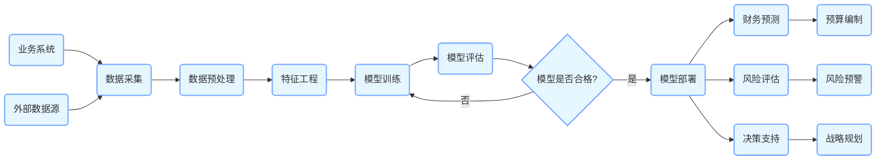

# AI辅助的公司财务规划

> 关键词：AI、公司财务规划、财务数据分析、预测模型、智能决策

> 摘要：本文聚焦于AI辅助的公司财务规划，详细阐述了利用人工智能技术提升财务规划效率与准确性的相关内容。首先介绍了AI辅助财务规划的背景，包括目的、预期读者和文档结构等。接着讲解了核心概念，展示了相关架构示意图和流程图。通过Python代码详细说明了核心算法原理及操作步骤，并给出了数学模型和公式。结合实际案例，对开发环境搭建、源代码实现和解读进行了分析。还探讨了AI辅助财务规划的实际应用场景，推荐了学习资源、开发工具框架和相关论文著作。最后总结了未来发展趋势与挑战，并提供常见问题解答和扩展阅读参考资料。

## 1. 背景介绍 
### 1.1 目的和范围
公司财务规划是企业管理的重要组成部分，它涉及到预算编制、资金分配、成本控制、利润预测等多个方面。传统的财务规划方法往往依赖于人工经验和简单的统计分析，存在效率低下、准确性不高的问题。随着人工智能技术的快速发展，其在数据处理、模型构建和预测分析等方面展现出强大的能力。本文章的目的在于探讨如何利用AI技术辅助公司进行财务规划，提高财务规划的科学性和有效性。范围涵盖了AI在财务数据分析、预算预测、风险评估等关键环节的应用。

### 1.2 预期读者
本文预期读者包括公司财务管理人员、财务分析师、企业决策者、人工智能领域的研究者和开发者等。对于财务管理人员和分析师，本文可以提供新的技术思路和方法，帮助他们提升财务规划的水平；企业决策者可以从中了解AI在财务规划中的价值，为企业的信息化建设和战略决策提供参考；人工智能领域的研究者和开发者则可以从财务规划的实际需求出发，探索AI技术的应用场景和创新点。

### 1.3 文档结构概述
本文将按照以下结构进行阐述：首先介绍核心概念与联系，包括相关原理和架构；接着讲解核心算法原理和具体操作步骤，并结合Python代码进行说明；然后给出数学模型和公式，并举例说明；通过实际案例展示AI辅助财务规划的代码实现和解读；探讨AI在公司财务规划中的实际应用场景；推荐学习资源、开发工具框架和相关论文著作；最后总结未来发展趋势与挑战，提供常见问题解答和扩展阅读参考资料。

### 1.4 术语表
#### 1.4.1 核心术语定义
- **AI（Artificial Intelligence）**：人工智能，是研究、开发用于模拟、延伸和扩展人的智能的理论、方法、技术及应用系统的一门新的技术科学。
- **公司财务规划**：指企业根据自身的战略目标和经营计划，对未来一定时期内的财务活动进行全面、系统的规划和安排，包括资金筹集、资金运用、成本控制、利润分配等方面。
- **财务数据分析**：对企业财务数据进行收集、整理、分析和解释的过程，以发现财务状况和经营成果的变化趋势，为决策提供依据。
- **预测模型**：利用历史数据和统计方法或机器学习算法构建的模型，用于预测未来的财务指标，如销售额、成本、利润等。
- **智能决策**：借助人工智能技术，对大量数据进行分析和处理，为决策者提供科学、合理的决策建议。

#### 1.4.2 相关概念解释
- **机器学习**：是人工智能的一个重要分支，它致力于研究如何让计算机从数据中自动学习模式和规律，并利用这些模式和规律进行预测和决策。常见的机器学习算法包括线性回归、逻辑回归、决策树、支持向量机、神经网络等。
- **深度学习**：是机器学习的一个子领域，它基于人工神经网络，通过构建多层神经网络模型，自动学习数据的深层次特征和表示。深度学习在图像识别、语音识别、自然语言处理等领域取得了显著的成果。
- **大数据**：指无法在一定时间范围内用常规软件工具进行捕捉、管理和处理的数据集合，具有海量性、高增长率和多样化的特点。大数据技术为AI提供了丰富的数据资源，促进了AI的发展。

#### 1.4.3 缩略词列表
- **AI**：Artificial Intelligence
- **ML**：Machine Learning
- **DL**：Deep Learning
- **KPI**：Key Performance Indicator

## 2. 核心概念与联系 
### 核心概念原理
AI辅助的公司财务规划主要基于以下几个核心概念原理：

#### 数据驱动
AI系统通过收集、整合和分析企业的财务数据、业务数据以及外部市场数据等多源数据，从数据中挖掘有价值的信息和模式。例如，通过分析历史销售数据、市场趋势数据和客户行为数据，预测未来的销售额和市场需求。

#### 模型构建
利用机器学习和深度学习算法构建各种预测模型和决策模型。例如，使用线性回归模型预测成本和利润，使用神经网络模型进行风险评估和信用评级。这些模型可以根据数据的变化自动调整和优化，提高预测和决策的准确性。

#### 智能决策
AI系统根据模型的输出结果，结合企业的战略目标和约束条件，为决策者提供智能决策建议。例如，在资金分配方面，AI可以根据不同项目的预期收益和风险，为企业提供最优的资金分配方案。

### 架构示意图
以下是AI辅助的公司财务规划的架构示意图：



### 架构说明
1. **数据采集**：从企业的业务系统（如ERP、CRM等）和外部数据源（如金融市场数据、行业报告等）收集各种财务和业务数据。
2. **数据预处理**：对采集到的数据进行清洗、转换和集成，去除噪声和缺失值，统一数据格式。
3. **特征工程**：从预处理后的数据中提取有代表性的特征，用于模型训练。
4. **模型训练**：选择合适的机器学习或深度学习算法，利用特征数据进行模型训练。
5. **模型评估**：使用测试数据对训练好的模型进行评估，检查模型的准确性和性能。
6. **模型部署**：将评估合格的模型部署到生产环境中，用于实际的财务预测、风险评估和决策支持。
7. **财务预测**：根据模型预测未来的财务指标，如销售额、成本、利润等。
8. **风险评估**：评估企业面临的各种风险，如市场风险、信用风险、流动性风险等。
9. **决策支持**：为企业的决策者提供智能决策建议，如资金分配、投资决策、成本控制等。
10. **预算编制**：根据财务预测结果，编制企业的预算计划。
11. **风险预警**：当企业面临潜在风险时，及时发出预警信号。
12. **战略规划**：为企业的战略规划提供数据支持和决策建议。

## 3. 核心算法原理 & 具体操作步骤 
### 线性回归算法原理
线性回归是一种基本的机器学习算法，用于建立自变量和因变量之间的线性关系。在公司财务规划中，线性回归可以用于预测财务指标，如销售额与广告投入之间的关系。

线性回归的数学模型可以表示为：

$$y = \beta_0 + \beta_1x_1 + \beta_2x_2 + \cdots + \beta_nx_n + \epsilon$$

其中，$y$ 是因变量，$x_1, x_2, \cdots, x_n$ 是自变量，$\beta_0, \beta_1, \cdots, \beta_n$ 是回归系数，$\epsilon$ 是误差项。

线性回归的目标是找到一组最优的回归系数 $\beta_0, \beta_1, \cdots, \beta_n$，使得预测值与实际值之间的误差平方和最小。误差平方和可以表示为：

$$SSE = \sum_{i=1}^{m}(y_i - \hat{y}_i)^2$$

其中，$m$ 是样本数量，$y_i$ 是第 $i$ 个样本的实际值，$\hat{y}_i$ 是第 $i$ 个样本的预测值。

### Python代码实现线性回归
```python
import numpy as np
from sklearn.linear_model import LinearRegression
import matplotlib.pyplot as plt

# 生成示例数据
np.random.seed(0)
X = np.array([1, 2, 3, 4, 5]).reshape(-1, 1)
y = 2 * X + 1 + np.random.randn(5, 1)

# 创建线性回归模型
model = LinearRegression()

# 训练模型
model.fit(X, y)

# 进行预测
new_X = np.array([6]).reshape(-1, 1)
prediction = model.predict(new_X)

# 输出回归系数和预测结果
print("回归系数：", model.coef_)
print("截距：", model.intercept_)
print("预测结果：", prediction)

# 绘制数据点和回归直线
plt.scatter(X, y, color='blue', label='Data Points')
plt.plot(X, model.predict(X), color='red', label='Regression Line')
plt.scatter(new_X, prediction, color='green', label='Prediction')
plt.xlabel('X')
plt.ylabel('y')
plt.title('Linear Regression')
plt.legend()
plt.show()
```

### 代码解释
1. **数据生成**：使用 `numpy` 生成示例数据，其中 $X$ 是自变量，$y$ 是因变量。
2. **模型创建**：使用 `sklearn` 库中的 `LinearRegression` 类创建线性回归模型。
3. **模型训练**：使用 `fit` 方法对模型进行训练，将 $X$ 和 $y$ 作为输入。
4. **预测**：使用 `predict` 方法对新的自变量进行预测。
5. **输出结果**：输出回归系数、截距和预测结果。
6. **可视化**：使用 `matplotlib` 库绘制数据点和回归直线，直观展示线性回归的结果。

### 具体操作步骤
1. **数据准备**：收集和整理与财务规划相关的数据，如历史销售额、成本、市场份额等。
2. **特征选择**：从数据中选择与预测目标相关的特征作为自变量。
3. **模型选择**：根据数据的特点和预测目标，选择合适的机器学习算法，如线性回归、决策树、神经网络等。
4. **模型训练**：使用训练数据对模型进行训练，调整模型的参数，使其能够准确地拟合数据。
5. **模型评估**：使用测试数据对训练好的模型进行评估，检查模型的准确性和性能。
6. **模型部署**：将评估合格的模型部署到生产环境中，用于实际的财务预测和决策支持。

## 4. 数学模型和公式 & 详细讲解 & 举例说明 
### 线性回归数学模型
线性回归的数学模型为：

$$y = \beta_0 + \beta_1x_1 + \beta_2x_2 + \cdots + \beta_nx_n + \epsilon$$

其中，$y$ 是因变量，$x_1, x_2, \cdots, x_n$ 是自变量，$\beta_0, \beta_1, \cdots, \beta_n$ 是回归系数，$\epsilon$ 是误差项。

### 最小二乘法求解回归系数
线性回归的目标是找到一组最优的回归系数 $\beta_0, \beta_1, \cdots, \beta_n$，使得误差平方和最小。误差平方和可以表示为：

$$SSE = \sum_{i=1}^{m}(y_i - \hat{y}_i)^2 = \sum_{i=1}^{m}(y_i - (\beta_0 + \beta_1x_{i1} + \beta_2x_{i2} + \cdots + \beta_nx_{in}))^2$$

为了求解最优的回归系数，可以对 $SSE$ 分别关于 $\beta_0, \beta_1, \cdots, \beta_n$ 求偏导数，并令偏导数等于 0，得到一组方程组：

$$\frac{\partial SSE}{\partial \beta_0} = -2\sum_{i=1}^{m}(y_i - (\beta_0 + \beta_1x_{i1} + \beta_2x_{i2} + \cdots + \beta_nx_{in})) = 0$$

$$\frac{\partial SSE}{\partial \beta_1} = -2\sum_{i=1}^{m}x_{i1}(y_i - (\beta_0 + \beta_1x_{i1} + \beta_2x_{i2} + \cdots + \beta_nx_{in})) = 0$$

$$\cdots$$

$$\frac{\partial SSE}{\partial \beta_n} = -2\sum_{i=1}^{m}x_{in}(y_i - (\beta_0 + \beta_1x_{i1} + \beta_2x_{i2} + \cdots + \beta_nx_{in})) = 0$$

解这个方程组可以得到最优的回归系数 $\beta_0, \beta_1, \cdots, \beta_n$。

### 举例说明
假设我们要预测某公司的销售额 $y$ 与广告投入 $x$ 之间的关系。我们收集了过去 5 个月的广告投入和销售额数据，如下表所示：

| 广告投入（万元） | 销售额（万元） |
| --- | --- |
| 1 | 3 |
| 2 | 5 |
| 3 | 7 |
| 4 | 9 |
| 5 | 11 |

我们可以使用线性回归模型来预测销售额与广告投入之间的关系。首先，将数据表示为矩阵形式：

$$X = \begin{bmatrix}
1 & 1 \\
1 & 2 \\
1 & 3 \\
1 & 4 \\
1 & 5
\end{bmatrix}$$

$$y = \begin{bmatrix}
3 \\
5 \\
7 \\
9 \\
11
\end{bmatrix}$$

然后，根据最小二乘法的公式求解回归系数 $\beta$：

$$\beta = (X^TX)^{-1}X^Ty$$

```python
import numpy as np

# 定义矩阵 X 和 y
X = np.array([[1, 1], [1, 2], [1, 3], [1, 4], [1, 5]])
y = np.array([[3], [5], [7], [9], [11]])

# 求解回归系数
beta = np.linalg.inv(X.T.dot(X)).dot(X.T).dot(y)

print("回归系数：", beta)
```

运行上述代码，我们可以得到回归系数 $\beta_0 = 1$，$\beta_1 = 2$。因此，线性回归模型为：

$$y = 1 + 2x$$

这意味着广告投入每增加 1 万元，销售额预计增加 2 万元。

## 5. 项目实战：代码实际案例和详细解释说明 
### 5.1  开发环境搭建
#### 安装Python
首先，需要安装Python编程语言。可以从Python官方网站（https://www.python.org/downloads/）下载适合自己操作系统的Python版本，并按照安装向导进行安装。

#### 安装必要的库
在Python环境中，需要安装一些必要的库，如 `numpy`、`pandas`、`scikit-learn`、`matplotlib` 等。可以使用 `pip` 命令进行安装：

```bash
pip install numpy pandas scikit-learn matplotlib
```

### 5.2  源代码详细实现和代码解读
#### 数据准备
假设我们有一个包含公司历史销售额和广告投入的数据文件 `sales_data.csv`，我们可以使用 `pandas` 库读取数据：

```python
import pandas as pd

# 读取数据
data = pd.read_csv('sales_data.csv')

# 分离自变量和因变量
X = data[['Advertising']]
y = data['Sales']
```

#### 数据划分
将数据划分为训练集和测试集，使用 `train_test_split` 函数：

```python
from sklearn.model_selection import train_test_split

# 划分训练集和测试集
X_train, X_test, y_train, y_test = train_test_split(X, y, test_size=0.2, random_state=42)
```

#### 模型训练
使用线性回归模型进行训练：

```python
from sklearn.linear_model import LinearRegression

# 创建线性回归模型
model = LinearRegression()

# 训练模型
model.fit(X_train, y_train)
```

#### 模型评估
使用测试集对模型进行评估，计算均方误差（MSE）和决定系数（$R^2$）：

```python
from sklearn.metrics import mean_squared_error, r2_score

# 进行预测
y_pred = model.predict(X_test)

# 计算均方误差
mse = mean_squared_error(y_test, y_pred)

# 计算决定系数
r2 = r2_score(y_test, y_pred)

print("均方误差：", mse)
print("决定系数：", r2)
```

#### 可视化结果
使用 `matplotlib` 库绘制数据点和回归直线：

```python
import matplotlib.pyplot as plt

# 绘制数据点
plt.scatter(X_test, y_test, color='blue', label='Data Points')

# 绘制回归直线
plt.plot(X_test, y_pred, color='red', label='Regression Line')

plt.xlabel('Advertising')
plt.ylabel('Sales')
plt.title('Linear Regression')
plt.legend()
plt.show()
```

### 5.3  代码解读与分析
- **数据准备**：使用 `pandas` 库读取数据文件，并将自变量和因变量分离。
- **数据划分**：使用 `train_test_split` 函数将数据划分为训练集和测试集，其中测试集占比为 20%。
- **模型训练**：使用 `LinearRegression` 类创建线性回归模型，并使用训练集对模型进行训练。
- **模型评估**：使用 `mean_squared_error` 和 `r2_score` 函数计算均方误差和决定系数，评估模型的性能。
- **可视化结果**：使用 `matplotlib` 库绘制数据点和回归直线，直观展示线性回归的结果。

## 6. 实际应用场景 
### 预算编制
AI可以根据历史财务数据和市场趋势，预测未来的销售额、成本和利润，为企业的预算编制提供科学依据。例如，通过分析过去几年的销售数据和市场增长率，预测下一年度的销售额，并根据销售额预测合理安排成本和费用预算。

### 资金分配
AI可以评估不同项目的预期收益和风险，为企业的资金分配提供决策支持。例如，使用机器学习算法对多个投资项目进行风险评估和收益预测，根据评估结果为企业推荐最优的资金分配方案，提高资金的使用效率。

### 成本控制
AI可以实时监测企业的成本数据，发现成本异常波动，并及时发出预警。例如，通过分析生产过程中的各项成本数据，找出成本高的环节，并提出优化建议，帮助企业降低成本。

### 风险评估
AI可以对企业面临的各种风险进行评估和预警，如市场风险、信用风险、流动性风险等。例如，使用深度学习算法对金融市场数据进行分析，预测市场波动的可能性和幅度，为企业的风险管理提供决策支持。

### 财务报表分析
AI可以自动分析企业的财务报表，发现潜在的财务问题和风险。例如，使用自然语言处理技术对财务报表进行文本分析，提取关键信息，如财务指标、经营状况等，并生成分析报告，为企业的管理层提供决策依据。

## 7. 工具和资源推荐
### 7.1 学习资源推荐
#### 7.1.1 书籍推荐
- 《Python机器学习》：本书全面介绍了Python在机器学习领域的应用，包括数据预处理、模型选择、算法实现等方面的内容。
- 《深度学习》：由深度学习领域的三位顶尖专家所著，系统介绍了深度学习的基本原理、算法和应用。
- 《财务分析与决策》：本书从财务报表分析、财务预测、资本预算等方面，介绍了企业财务决策的方法和技巧。

#### 7.1.2 在线课程
- Coursera上的“机器学习”课程：由斯坦福大学教授Andrew Ng主讲，是机器学习领域的经典课程。
- edX上的“深度学习”课程：由多家知名高校联合开设，系统介绍了深度学习的理论和实践。
- 网易云课堂上的“财务分析实战”课程：结合实际案例，介绍了财务分析的方法和技巧。

#### 7.1.3 技术博客和网站
- 博客园：提供了大量的技术文章和博客，涵盖了机器学习、深度学习、财务分析等多个领域。
- 开源中国：是国内最大的开源技术社区，提供了丰富的开源项目和技术资源。
- Kaggle：是一个数据科学竞赛平台，提供了大量的数据集和竞赛项目，可以帮助学习者提高数据分析和机器学习的能力。

### 7.2 开发工具框架推荐
#### 7.2.1 IDE和编辑器
- PyCharm：是一款专门为Python开发设计的集成开发环境，提供了丰富的功能和插件，方便开发者进行代码编写、调试和管理。
- Jupyter Notebook：是一个基于Web的交互式计算环境，支持Python、R等多种编程语言，适合进行数据分析和模型开发。
- Visual Studio Code：是一款轻量级的代码编辑器，支持多种编程语言和插件，具有良好的扩展性和易用性。

#### 7.2.2 调试和性能分析工具
- pdb：是Python自带的调试工具，可以帮助开发者定位和解决代码中的问题。
- cProfile：是Python的性能分析工具，可以分析代码的运行时间和函数调用情况，帮助开发者优化代码性能。
- TensorBoard：是TensorFlow的可视化工具，可以帮助开发者可视化模型的训练过程和性能指标。

#### 7.2.3 相关框架和库
- scikit-learn：是Python中常用的机器学习库，提供了丰富的机器学习算法和工具，如分类、回归、聚类等。
- TensorFlow：是Google开发的深度学习框架，支持多种深度学习模型和算法，如神经网络、卷积神经网络等。
- PyTorch：是Facebook开发的深度学习框架，具有动态图机制和良好的易用性，受到了广大研究者和开发者的喜爱。

### 7.3 相关论文著作推荐
#### 7.3.1 经典论文
- “Gradient-based learning applied to document recognition”：这篇论文介绍了卷积神经网络在手写字符识别中的应用，是深度学习领域的经典论文之一。
- “Long Short-Term Memory”：这篇论文提出了长短期记忆网络（LSTM），解决了传统循环神经网络中的梯度消失和梯度爆炸问题。
- “Deep Residual Learning for Image Recognition”：这篇论文提出了残差网络（ResNet），在图像识别领域取得了显著的成果。

#### 7.3.2 最新研究成果
- 关注顶级学术会议和期刊，如NeurIPS、ICML、CVPR、JMLR等，及时了解AI在财务规划领域的最新研究成果。
- 查阅知名研究机构和学者的研究报告和论文，如斯坦福大学、麻省理工学院、谷歌研究院等。

#### 7.3.3 应用案例分析
- 参考一些知名企业的AI应用案例，如亚马逊、谷歌、阿里巴巴等，了解他们在财务规划、风险管理等方面的实践经验和技术应用。
- 关注行业报告和分析文章，了解AI在不同行业的应用现状和发展趋势。

## 8. 总结：未来发展趋势与挑战
### 未来发展趋势
#### 智能化程度不断提高
随着AI技术的不断发展，AI辅助的公司财务规划将变得更加智能化。未来的系统将能够自动识别和处理复杂的财务数据，自动调整预测模型和决策策略，提供更加精准和个性化的财务规划建议。

#### 与其他技术深度融合
AI将与区块链、物联网、大数据等技术深度融合，为公司财务规划带来更多的创新和变革。例如，区块链技术可以提高财务数据的安全性和可信度，物联网技术可以实时收集企业的生产和运营数据，为财务规划提供更丰富的数据源。

#### 应用场景不断拓展
AI辅助的公司财务规划将不仅仅局限于传统的预算编制、资金分配和风险评估等领域，还将拓展到更多的应用场景，如供应链金融、税务筹划、财务审计等。

### 挑战
#### 数据质量和安全问题
AI系统的性能和准确性高度依赖于数据的质量和数量。企业需要确保财务数据的准确性、完整性和及时性，同时要加强数据安全保护，防止数据泄露和滥用。

#### 技术人才短缺
AI技术的应用需要具备专业知识和技能的技术人才。目前，市场上缺乏既懂AI技术又懂财务业务的复合型人才，这给企业的AI应用带来了一定的困难。

#### 法律法规和伦理问题
AI技术的应用涉及到一系列的法律法规和伦理问题，如数据隐私保护、算法透明度、公平性等。企业需要遵守相关的法律法规和伦理准则，确保AI系统的合法合规运行。

## 9. 附录：常见问题与解答
### 1. AI辅助的公司财务规划是否会完全取代财务人员？
不会。虽然AI可以提高财务规划的效率和准确性，但它不能完全取代财务人员。财务人员具有丰富的业务经验和专业知识，能够对AI系统的输出结果进行分析和判断，做出合理的决策。AI只是财务人员的辅助工具，帮助他们更好地完成工作。

### 2. AI技术在财务规划中的应用是否存在风险？
存在一定的风险。例如，AI模型可能存在偏差和误差，导致预测结果不准确；数据质量和安全问题可能影响AI系统的性能和可靠性；法律法规和伦理问题可能给企业带来法律风险和声誉损失。企业需要采取相应的措施来降低这些风险，如加强模型评估和验证、提高数据质量和安全保护、遵守相关法律法规和伦理准则等。

### 3. 企业如何选择适合自己的AI技术和工具？
企业在选择适合自己的AI技术和工具时，需要考虑以下几个因素：
- **业务需求**：根据企业的财务规划需求，选择能够满足需求的AI技术和工具。
- **数据情况**：考虑企业的数据质量、数量和类型，选择适合的数据处理和分析工具。
- **技术能力**：评估企业的技术团队和技术能力，选择易于使用和集成的AI技术和工具。
- **成本效益**：综合考虑AI技术和工具的采购成本、使用成本和效益，选择性价比高的方案。

### 4. 如何提高AI模型在财务规划中的准确性？
可以从以下几个方面提高AI模型在财务规划中的准确性：
- **数据质量**：确保财务数据的准确性、完整性和及时性，对数据进行清洗、转换和预处理。
- **特征工程**：选择合适的特征，提取有代表性的信息，提高模型的学习能力。
- **模型选择**：根据数据的特点和预测目标，选择合适的AI模型，如线性回归、决策树、神经网络等。
- **模型训练和优化**：使用足够的训练数据对模型进行训练，调整模型的参数，优化模型的性能。
- **模型评估和验证**：使用测试数据对模型进行评估和验证，检查模型的准确性和性能，及时发现和解决问题。

## 10. 扩展阅读 & 参考资料
### 扩展阅读
- 《人工智能时代的财务管理变革》
- 《大数据与财务决策》
- 《智能财务：新技术驱动的财务管理转型》

### 参考资料
- 相关学术论文和研究报告
- 行业标准和规范
- 企业的财务报表和相关数据

作者：AI天才研究院/AI Genius Institute & 禅与计算机程序设计艺术 /Zen And The Art of Computer Programming