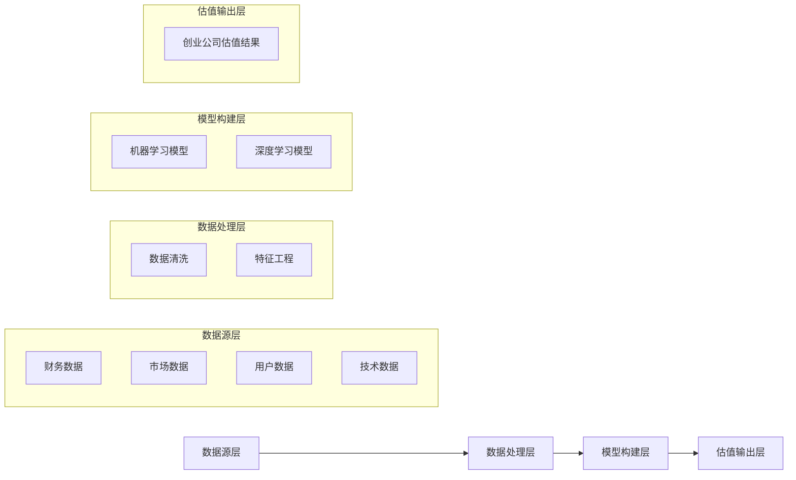

# AI辅助的创业公司估值模型

> 关键词：AI辅助、创业公司估值、估值模型、机器学习、数据分析

> 摘要：本文聚焦于AI辅助的创业公司估值模型，旨在深入探讨如何利用人工智能技术提升创业公司估值的准确性和效率。首先介绍了创业公司估值的背景信息，包括目的、预期读者、文档结构和相关术语。接着阐述了核心概念与联系，给出了原理和架构的示意图及流程图。详细讲解了核心算法原理，通过Python代码进行示例。对涉及的数学模型和公式进行了推导和举例说明。通过项目实战展示了代码实现和解读。分析了该模型的实际应用场景，推荐了相关的学习资源、开发工具框架和论文著作。最后总结了未来发展趋势与挑战，并提供了常见问题解答和扩展阅读参考资料。

## 1. 背景介绍 
### 1.1 目的和范围
创业公司的估值是投资决策、股权分配、融资等众多商业活动中的关键环节。然而，由于创业公司通常处于早期阶段，具有高度的不确定性和创新性，传统的估值方法往往难以准确反映其真实价值。本文章的目的在于探讨如何借助AI技术构建更精准、更高效的创业公司估值模型。范围涵盖了从核心概念的阐述、算法原理的讲解、数学模型的推导，到实际项目的应用和未来趋势的展望等多个方面。

### 1.2 预期读者
本文的预期读者包括创业公司的创始人、投资者、金融分析师、人工智能研究人员以及对创业公司估值和AI技术应用感兴趣的专业人士。这些读者希望通过了解AI辅助的创业公司估值模型，提升在创业投资领域的决策能力和技术应用水平。

### 1.3 文档结构概述
本文将按照以下结构进行组织：首先介绍背景信息，让读者了解文章的目的和适用范围；接着阐述核心概念与联系，帮助读者建立起对AI辅助估值模型的整体认知；详细讲解核心算法原理和具体操作步骤，通过Python代码进行示例；推导数学模型和公式，并举例说明；通过项目实战展示模型的实际应用；分析该模型在不同场景下的应用；推荐相关的学习资源、开发工具框架和论文著作；总结未来发展趋势与挑战；提供常见问题解答和扩展阅读参考资料。

### 1.4 术语表
#### 1.4.1 核心术语定义
- **创业公司估值**：对创业公司的经济价值进行评估，以确定其在市场中的合理价格。
- **AI辅助**：利用人工智能技术，如机器学习、深度学习等，为创业公司估值提供数据处理、模型构建和预测等支持。
- **估值模型**：用于计算创业公司价值的数学公式或算法，基于一定的假设和数据进行构建。

#### 1.4.2 相关概念解释
- **机器学习**：一门多领域交叉学科，涉及概率论、统计学、逼近论、凸分析、算法复杂度理论等多门学科。它专门研究计算机怎样模拟或实现人类的学习行为，以获取新的知识或技能，重新组织已有的知识结构使之不断改善自身的性能。
- **深度学习**：机器学习的一个分支领域，它是一种基于对数据进行表征学习的方法。深度学习通过构建具有很多层的神经网络模型，自动从大量数据中学习特征和模式。

#### 1.4.3 缩略词列表
- **ML**：Machine Learning，机器学习
- **DL**：Deep Learning，深度学习
- **AI**：Artificial Intelligence，人工智能

## 2. 核心概念与联系 

### 核心概念原理
AI辅助的创业公司估值模型的核心原理是利用人工智能技术对创业公司的多维度数据进行分析和挖掘，以识别影响公司价值的关键因素，并构建相应的估值模型。传统的估值方法主要基于财务数据和行业经验，而AI辅助的模型可以整合更多类型的数据，如市场趋势、用户行为、技术创新等，从而更全面地评估创业公司的价值。

### 架构的文本示意图
```plaintext
数据源层
|-- 财务数据（收入、利润、资产等）
|-- 市场数据（行业增长率、市场份额等）
|-- 用户数据（用户数量、活跃度、留存率等）
|-- 技术数据（专利数量、技术先进性等）

数据处理层
|-- 数据清洗（去除噪声、缺失值处理等）
|-- 特征工程（特征提取、特征选择等）

模型构建层
|-- 机器学习模型（线性回归、决策树、随机森林等）
|-- 深度学习模型（神经网络、循环神经网络等）

估值输出层
|-- 创业公司估值结果
```

### Mermaid 流程图


## 3. 核心算法原理 & 具体操作步骤 

### 线性回归模型原理
线性回归是一种基本的机器学习算法，用于建立自变量和因变量之间的线性关系。在创业公司估值中，我们可以将公司的各种特征（如收入、用户数量等）作为自变量，将公司的价值作为因变量。线性回归模型的数学表达式为：

$$y = \beta_0 + \beta_1x_1 + \beta_2x_2 + \cdots + \beta_nx_n + \epsilon$$

其中，$y$ 是因变量（创业公司价值），$x_1, x_2, \cdots, x_n$ 是自变量（各种特征），$\beta_0, \beta_1, \cdots, \beta_n$ 是待估计的系数，$\epsilon$ 是误差项。

### Python代码实现线性回归模型
```python
import numpy as np
from sklearn.linear_model import LinearRegression

# 示例数据
X = np.array([[1, 2], [2, 4], [3, 6], [4, 8]])  # 特征矩阵
y = np.array([3, 6, 9, 12])  # 目标值

# 创建线性回归模型
model = LinearRegression()

# 拟合模型
model.fit(X, y)

# 预测新数据
new_X = np.array([[5, 10]])
prediction = model.predict(new_X)

print("预测结果:", prediction)
```

### 具体操作步骤
1. **数据收集**：收集创业公司的各种数据，包括财务数据、市场数据、用户数据等。
2. **数据预处理**：对收集到的数据进行清洗，去除噪声和缺失值；进行特征工程，提取和选择有价值的特征。
3. **模型选择**：根据数据的特点和问题的需求，选择合适的机器学习或深度学习模型，如线性回归、决策树、神经网络等。
4. **模型训练**：使用预处理后的数据对模型进行训练，调整模型的参数以最小化预测误差。
5. **模型评估**：使用测试数据对训练好的模型进行评估，计算评估指标（如均方误差、决定系数等），评估模型的性能。
6. **估值预测**：使用训练好的模型对创业公司的价值进行预测。

## 4. 数学模型和公式 & 详细讲解 & 举例说明 

### 均方误差（MSE）
均方误差是衡量模型预测误差的常用指标，它表示预测值与真实值之间误差的平方的平均值。数学公式为：

$$MSE = \frac{1}{n}\sum_{i=1}^{n}(y_i - \hat{y}_i)^2$$

其中，$n$ 是样本数量，$y_i$ 是真实值，$\hat{y}_i$ 是预测值。

### 决定系数（$R^2$）
决定系数用于衡量模型对数据的拟合程度，它表示模型能够解释的因变量的方差比例。数学公式为：

$$R^2 = 1 - \frac{\sum_{i=1}^{n}(y_i - \hat{y}_i)^2}{\sum_{i=1}^{n}(y_i - \bar{y})^2}$$

其中，$\bar{y}$ 是真实值的平均值。

### 举例说明
假设我们有一个简单的线性回归模型，使用两个特征 $x_1$ 和 $x_2$ 来预测创业公司的价值 $y$。我们有以下样本数据：

| $x_1$ | $x_2$ | $y$ | $\hat{y}$ |
|-------|-------|-----|-----------|
| 1     | 2     | 3   | 3.1       |
| 2     | 4     | 6   | 5.9       |
| 3     | 6     | 9   | 9.2       |
| 4     | 8     | 12  | 11.8      |

首先计算均方误差：

$$MSE = \frac{1}{4}[(3 - 3.1)^2 + (6 - 5.9)^2 + (9 - 9.2)^2 + (12 - 11.8)^2] = \frac{1}{4}[0.01 + 0.01 + 0.04 + 0.04] = 0.025$$

然后计算决定系数：

$\bar{y} = \frac{3 + 6 + 9 + 12}{4} = 7.5$

$$\sum_{i=1}^{4}(y_i - \hat{y}_i)^2 = 0.01 + 0.01 + 0.04 + 0.04 = 0.1$$

$$\sum_{i=1}^{4}(y_i - \bar{y})^2 = (3 - 7.5)^2 + (6 - 7.5)^2 + (9 - 7.5)^2 + (12 - 7.5)^2 = 20.25 + 2.25 + 2.25 + 20.25 = 45$$

$$R^2 = 1 - \frac{0.1}{45} \approx 0.9978$$

这表明模型对数据的拟合程度非常高。

## 5. 项目实战：代码实际案例和详细解释说明 

### 5.1  开发环境搭建
1. **安装Python**：建议使用Python 3.7及以上版本，可以从Python官方网站（https://www.python.org/downloads/）下载并安装。
2. **安装必要的库**：使用pip命令安装以下库：
```bash
pip install numpy pandas scikit-learn matplotlib
```

### 5.2  源代码详细实现和代码解读
```python
import numpy as np
import pandas as pd
from sklearn.model_selection import train_test_split
from sklearn.linear_model import LinearRegression
from sklearn.metrics import mean_squared_error, r2_score
import matplotlib.pyplot as plt

# 生成示例数据
np.random.seed(0)
n_samples = 100
X = np.random.randn(n_samples, 2)  # 特征矩阵
y = 2 * X[:, 0] + 3 * X[:, 1] + np.random.randn(n_samples)  # 目标值

# 划分训练集和测试集
X_train, X_test, y_train, y_test = train_test_split(X, y, test_size=0.2, random_state=42)

# 创建线性回归模型
model = LinearRegression()

# 拟合模型
model.fit(X_train, y_train)

# 预测测试集
y_pred = model.predict(X_test)

# 计算评估指标
mse = mean_squared_error(y_test, y_pred)
r2 = r2_score(y_test, y_pred)

print("均方误差:", mse)
print("决定系数:", r2)

# 可视化预测结果
plt.scatter(y_test, y_pred)
plt.xlabel('真实值')
plt.ylabel('预测值')
plt.title('真实值 vs 预测值')
plt.show()
```

### 5.3  代码解读与分析
1. **数据生成**：使用`np.random.randn`函数生成随机的特征矩阵`X`和目标值`y`。
2. **数据划分**：使用`train_test_split`函数将数据划分为训练集和测试集，测试集占比为20%。
3. **模型创建和训练**：创建线性回归模型`LinearRegression`，并使用训练集数据进行拟合。
4. **模型预测**：使用训练好的模型对测试集进行预测，得到预测值`y_pred`。
5. **评估指标计算**：使用`mean_squared_error`和`r2_score`函数计算均方误差和决定系数。
6. **可视化**：使用`matplotlib`库绘制真实值和预测值的散点图，直观展示模型的预测效果。

## 6. 实际应用场景 
### 投资决策
投资者在决定是否对创业公司进行投资时，需要准确评估公司的价值。AI辅助的创业公司估值模型可以提供更客观、更准确的估值结果，帮助投资者做出更明智的投资决策。

### 股权分配
在创业公司的发展过程中，股权分配是一个关键问题。准确的估值可以为股权分配提供合理的依据，确保各方的利益得到平衡。

### 融资谈判
创业公司在进行融资时，需要与投资者进行谈判。AI辅助的估值模型可以帮助创业公司确定合理的融资价格，提高谈判的成功率。

### 战略规划
创业公司的管理层可以根据估值结果制定战略规划，如确定发展方向、制定市场策略等。

## 7. 工具和资源推荐
### 7.1 学习资源推荐
#### 7.1.1 书籍推荐
- 《机器学习》（周志华）：全面介绍了机器学习的基本概念、算法和应用，是机器学习领域的经典教材。
- 《深度学习》（Ian Goodfellow、Yoshua Bengio和Aaron Courville）：深入讲解了深度学习的理论和实践，是深度学习领域的权威著作。
- 《Python机器学习实战》（Sebastian Raschka）：通过实际案例介绍了如何使用Python进行机器学习开发，适合初学者。

#### 7.1.2 在线课程
- Coursera上的“机器学习”课程（Andrew Ng教授授课）：是机器学习领域最受欢迎的在线课程之一，内容全面，讲解详细。
- edX上的“深度学习微硕士项目”：提供了深度学习的系统学习路径，包括多个课程和实践项目。
- 阿里云天池平台的AI实战课程：提供了丰富的AI实战案例和教程，适合有一定基础的学习者。

#### 7.1.3 技术博客和网站
- Medium：上面有很多AI领域的优秀博客文章，涵盖了最新的研究成果和实践经验。
- Towards Data Science：专注于数据科学和机器学习领域，提供了大量的技术文章和案例分析。
- Kaggle：是一个数据科学竞赛平台，上面有很多优秀的开源代码和数据资源，可以学习到其他数据科学家的经验和技巧。

### 7.2 开发工具框架推荐
#### 7.2.1 IDE和编辑器
- PyCharm：是一款专业的Python集成开发环境，提供了丰富的功能和插件，适合大型项目的开发。
- Jupyter Notebook：是一个交互式的开发环境，适合数据探索和模型实验。
- Visual Studio Code：是一款轻量级的代码编辑器，支持多种编程语言和插件，具有良好的扩展性。

#### 7.2.2 调试和性能分析工具
- TensorBoard：是TensorFlow的可视化工具，可以帮助用户监控模型的训练过程、分析模型的性能。
- Py-Spy：是一个Python性能分析工具，可以实时监测Python程序的性能瓶颈。
- cProfile：是Python内置的性能分析模块，可以对Python代码进行详细的性能分析。

#### 7.2.3 相关框架和库
- Scikit-learn：是一个常用的机器学习库，提供了丰富的机器学习算法和工具，如分类、回归、聚类等。
- TensorFlow：是一个开源的深度学习框架，由Google开发，广泛应用于图像识别、自然语言处理等领域。
- PyTorch：是另一个流行的深度学习框架，具有动态图的优势，适合快速开发和研究。

### 7.3 相关论文著作推荐
#### 7.3.1 经典论文
- “Pattern Recognition and Machine Learning”（Christopher Bishop）：是机器学习领域的经典著作，对模式识别和机器学习的理论和方法进行了系统的阐述。
- “Deep Learning”（Yoshua Bengio、Ian Goodfellow和Aaron Courville）：是深度学习领域的权威综述论文，介绍了深度学习的基本概念、模型和应用。
- “Gradient-Based Learning Applied to Document Recognition”（Yann LeCun、Léon Bottou、Yoshua Bengio和Patrick Haffner）：提出了卷积神经网络（CNN），是计算机视觉领域的经典论文。

#### 7.3.2 最新研究成果
- 在arXiv.org上可以找到很多关于AI辅助估值模型的最新研究论文，关注这些论文可以了解该领域的最新发展动态。
- 顶级学术会议（如NeurIPS、ICML、CVPR等）上的相关论文也反映了该领域的前沿研究成果。

#### 7.3.3 应用案例分析
- 一些知名的投资机构和研究机构会发布关于创业公司估值的案例分析报告，可以从中学习到实际应用中的经验和方法。

## 8. 总结：未来发展趋势与挑战
### 未来发展趋势
- **多模态数据融合**：未来的AI辅助估值模型将不仅仅依赖于传统的财务数据，还会融合更多类型的数据，如图像、文本、语音等，以更全面地评估创业公司的价值。
- **深度学习模型的应用**：深度学习模型在处理复杂数据和挖掘潜在模式方面具有优势，未来将在创业公司估值中得到更广泛的应用。
- **实时估值**：随着数据采集和处理技术的不断发展，未来的估值模型可以实现实时更新，为投资者和创业者提供更及时的决策支持。

### 挑战
- **数据质量和隐私问题**：AI辅助估值模型依赖于大量的数据，但数据的质量和隐私问题是一个挑战。如何确保数据的准确性、完整性和安全性是需要解决的问题。
- **模型解释性**：深度学习模型通常被认为是“黑盒”模型，难以解释其决策过程。在创业公司估值中，模型的解释性非常重要，如何提高模型的解释性是一个挑战。
- **行业差异**：不同行业的创业公司具有不同的特点和发展规律，如何针对不同行业构建合适的估值模型是一个挑战。

## 9. 附录：常见问题与解答
### 问题1：AI辅助的估值模型是否可以完全替代传统的估值方法？
答：目前来看，AI辅助的估值模型不能完全替代传统的估值方法。虽然AI模型可以处理大量的数据和复杂的关系，但传统的估值方法仍然具有一定的优势，如基于财务指标的估值方法可以提供基本的价值参考。在实际应用中，通常会结合使用AI辅助模型和传统方法，以提高估值的准确性。

### 问题2：如何选择合适的机器学习模型用于创业公司估值？
答：选择合适的机器学习模型需要考虑多个因素，如数据的特点、问题的复杂度、模型的可解释性等。对于简单的线性关系，可以选择线性回归模型；对于复杂的非线性关系，可以选择决策树、随机森林、神经网络等模型。同时，还需要通过实验和评估来比较不同模型的性能，选择最优的模型。

### 问题3：AI辅助的估值模型需要多少数据才能得到准确的结果？
答：所需的数据量取决于多个因素，如模型的复杂度、数据的质量和多样性等。一般来说，数据量越大，模型的性能越好。但在实际应用中，需要根据具体情况进行权衡，因为过多的数据可能会导致过拟合问题。可以通过交叉验证等方法来评估模型在不同数据量下的性能，确定合适的数据量。

## 10. 扩展阅读 & 参考资料
- 《人工智能时代的投资决策》
- 《创业公司融资与估值》
- “A Machine Learning Approach to Startup Valuation”（学术论文）

作者：AI天才研究院/AI Genius Institute & 禅与计算机程序设计艺术 /Zen And The Art of Computer Programming