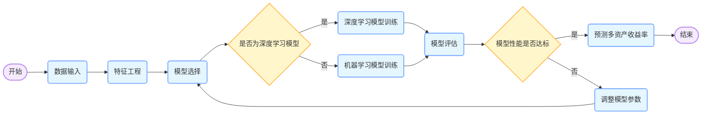

# AI辅助的多资产类别收益率预测

> 关键词：AI辅助、多资产类别、收益率预测、机器学习、深度学习

> 摘要：本文聚焦于AI辅助的多资产类别收益率预测这一前沿领域。首先介绍了该研究的背景，包括目的、预期读者、文档结构和相关术语。接着阐述了核心概念，如多资产类别和收益率预测的原理及联系，并通过示意图和流程图展示。详细讲解了核心算法原理，使用Python代码进行示例。同时给出了数学模型和公式，并举例说明。通过项目实战，从开发环境搭建到源代码实现和解读，深入剖析实际应用。探讨了该技术在金融等领域的实际应用场景，推荐了学习资源、开发工具框架和相关论文著作。最后总结了未来发展趋势与挑战，并提供常见问题解答和扩展阅读参考资料，旨在为读者全面呈现AI辅助多资产类别收益率预测的技术全貌。

## 1. 背景介绍 
### 1.1 目的和范围
在金融市场中，准确预测多资产类别的收益率对于投资者和金融机构至关重要。传统的收益率预测方法往往基于简单的统计模型和线性假设，难以捕捉资产价格波动的复杂非线性特征和多资产之间的相互关系。而AI技术的发展为解决这一问题提供了新的思路和方法。本文的目的是探讨如何利用AI技术辅助进行多资产类别收益率的预测，包括介绍相关的核心概念、算法原理、数学模型，通过实际案例展示其应用，并分析其在实际金融市场中的应用场景、面临的挑战和未来发展趋势。范围涵盖了常见的多资产类别，如股票、债券、期货、外汇等，以及主流的AI技术，如机器学习和深度学习算法。

### 1.2 预期读者
本文预期读者包括金融领域的从业者，如投资经理、分析师、交易员等，他们希望借助AI技术提升多资产投资决策的准确性和效率；计算机科学和人工智能领域的研究人员和开发者，对将AI技术应用于金融市场感兴趣；以及对金融科技和量化投资有学习需求的学生和爱好者。

### 1.3 文档结构概述
本文将按照以下结构展开：首先介绍核心概念与联系，清晰界定多资产类别和收益率预测的概念，并说明它们之间的关联；接着详细阐述核心算法原理，结合Python代码展示算法的具体实现步骤；给出用于收益率预测的数学模型和公式，并通过实际例子进行说明；进行项目实战，从开发环境搭建到代码实现和解读，让读者了解如何在实际中应用这些技术；探讨该技术在金融市场等领域的实际应用场景；推荐相关的学习资源、开发工具框架和论文著作；最后总结未来发展趋势与挑战，提供常见问题解答和扩展阅读参考资料。

### 1.4 术语表
#### 1.4.1 核心术语定义
- **多资产类别**：指金融市场中不同类型的资产，包括但不限于股票、债券、期货、外汇、大宗商品等。这些资产具有不同的风险收益特征和市场表现。
- **收益率预测**：对资产在未来一段时间内的收益情况进行预估，通常以百分比形式表示。收益率可以是简单收益率、对数收益率等不同计算方式。
- **AI辅助**：利用人工智能技术，如机器学习、深度学习等，来辅助进行多资产类别收益率的预测。通过AI算法可以处理大量的数据，挖掘数据中的潜在模式和规律，提高预测的准确性。

#### 1.4.2 相关概念解释
- **机器学习**：是一门多领域交叉学科，涉及概率论、统计学、逼近论、凸分析、算法复杂度理论等多门学科。它专门研究计算机怎样模拟或实现人类的学习行为，以获取新的知识或技能，重新组织已有的知识结构使之不断改善自身的性能。在收益率预测中，常用的机器学习算法包括线性回归、决策树、随机森林、支持向量机等。
- **深度学习**：是机器学习的一个分支领域，它是一种基于对数据进行表征学习的方法。深度学习通过构建具有很多层的神经网络模型，自动从大量数据中学习到复杂的特征和模式。在多资产收益率预测中，常用的深度学习模型包括多层感知机（MLP）、长短期记忆网络（LSTM）、卷积神经网络（CNN）等。

#### 1.4.3 缩略词列表
- **MLP**：Multi-Layer Perceptron，多层感知机
- **LSTM**：Long Short-Term Memory，长短期记忆网络
- **CNN**：Convolutional Neural Network，卷积神经网络
- **SVM**：Support Vector Machine，支持向量机
- **RF**：Random Forest，随机森林

## 2. 核心概念与联系 
### 核心概念原理
#### 多资产类别
多资产类别是金融市场的重要组成部分，不同资产类别具有不同的风险收益特征和市场驱动因素。股票通常具有较高的预期收益率，但同时也伴随着较高的风险；债券相对较为稳定，收益相对较低，但具有一定的保值功能；期货和外汇市场则具有较高的杠杆性和波动性。投资者通过投资多种资产类别，可以实现资产的分散化配置，降低投资组合的整体风险。

#### 收益率预测
收益率预测是金融投资决策的核心环节之一。准确的收益率预测可以帮助投资者制定合理的投资策略，选择合适的投资标的，优化投资组合。收益率预测的方法有很多种，传统方法主要基于基本面分析和技术分析，而现代方法则越来越多地借助AI技术。基本面分析主要考虑资产的内在价值，如公司的财务状况、行业前景等；技术分析则主要通过分析资产价格的历史走势和成交量等信息来预测未来价格走势。

### 架构的文本示意图
```plaintext
                AI辅助的多资产类别收益率预测系统
                ┌──────────────────────────────────────┐
                │                                      │
                │           数据输入层                 │
                │ ┌─────────────┬─────────────┐        │
                │ │  多资产数据 │  市场数据    │        │
                │ │ (价格、交易量等) (宏观经济指标等) │        │
                │ └─────────────┴─────────────┘        │
                │                                      │
                │           特征工程层                 │
                │ ┌─────────────────────────────┐      │
                │ │ 数据清洗、特征提取、特征选择 │      │
                │ └─────────────────────────────┘      │
                │                                      │
                │           模型训练层                 │
                │ ┌─────────────────────┐              │
                │ │ 机器学习/深度学习模型 │              │
                │ │ (MLP、LSTM、RF等)    │              │
                │ └─────────────────────┘              │
                │                                      │
                │           预测输出层                 │
                │ ┌─────────────────────┐              │
                │ │ 多资产类别收益率预测结果 │              │
                │ └─────────────────────┘              │
                └──────────────────────────────────────┘
```

### Mermaid流程图


## 3. 核心算法原理 & 具体操作步骤 
### 线性回归算法原理
线性回归是一种简单而常用的机器学习算法，用于建立自变量和因变量之间的线性关系。在多资产类别收益率预测中，我们可以将多个资产的历史数据作为自变量，资产的未来收益率作为因变量，建立线性回归模型。

线性回归模型的一般形式为：
$$y = \beta_0 + \beta_1x_1 + \beta_2x_2 + \cdots + \beta_nx_n + \epsilon$$
其中，$y$ 是因变量（资产收益率），$x_1, x_2, \cdots, x_n$ 是自变量（资产的历史数据），$\beta_0, \beta_1, \beta_2, \cdots, \beta_n$ 是模型的参数，$\epsilon$ 是误差项。

### Python代码实现
```python
import numpy as np
from sklearn.linear_model import LinearRegression
from sklearn.model_selection import train_test_split

# 生成示例数据
np.random.seed(0)
X = np.random.rand(100, 5)  # 100个样本，每个样本有5个特征
y = 2 * X[:, 0] + 3 * X[:, 1] + 0.5 * X[:, 2] + np.random.randn(100)  # 生成目标值

# 划分训练集和测试集
X_train, X_test, y_train, y_test = train_test_split(X, y, test_size=0.2, random_state=42)

# 创建线性回归模型
model = LinearRegression()

# 训练模型
model.fit(X_train, y_train)

# 预测
y_pred = model.predict(X_test)

# 输出模型参数
print("模型系数:", model.coef_)
print("模型截距:", model.intercept_)
```

### 具体操作步骤
1. **数据准备**：收集多资产类别的历史数据，包括资产价格、交易量、宏观经济指标等，并进行数据清洗和预处理，确保数据的质量和一致性。
2. **特征工程**：从原始数据中提取有用的特征，如收益率、波动率、相关性等，并进行特征选择，去除冗余和无关的特征。
3. **模型选择**：根据数据的特点和预测任务的要求，选择合适的机器学习或深度学习模型，如线性回归、决策树、随机森林、LSTM等。
4. **模型训练**：将准备好的数据划分为训练集和测试集，使用训练集对模型进行训练，调整模型的参数，使模型能够学习到数据中的模式和规律。
5. **模型评估**：使用测试集对训练好的模型进行评估，计算模型的预测误差和性能指标，如均方误差（MSE）、均方根误差（RMSE）、平均绝对误差（MAE）等。
6. **模型优化**：根据模型评估的结果，对模型进行优化，如调整模型的参数、更换模型结构、增加数据等，以提高模型的预测性能。
7. **预测应用**：使用优化后的模型对多资产类别的未来收益率进行预测，并将预测结果应用于投资决策中。

## 4. 数学模型和公式 & 详细讲解 & 举例说明 
### 均方误差（MSE）
均方误差是衡量模型预测值与真实值之间差异的常用指标，其计算公式为：
$$MSE = \frac{1}{n}\sum_{i=1}^{n}(y_i - \hat{y}_i)^2$$
其中，$n$ 是样本数量，$y_i$ 是真实值，$\hat{y}_i$ 是预测值。

### 详细讲解
均方误差的计算过程是先计算每个样本的预测值与真实值之间的差值的平方，然后将这些平方值求和并除以样本数量。均方误差的值越小，说明模型的预测性能越好。

### 举例说明
假设我们有以下真实值和预测值：
真实值 $y = [1, 2, 3, 4, 5]$
预测值 $\hat{y} = [1.2, 1.8, 3.1, 3.9, 5.2]$

则均方误差的计算过程如下：
1. 计算每个样本的差值的平方：
$(1 - 1.2)^2 = 0.04$
$(2 - 1.8)^2 = 0.04$
$(3 - 3.1)^2 = 0.01$
$(4 - 3.9)^2 = 0.01$
$(5 - 5.2)^2 = 0.04$

2. 求和：
$0.04 + 0.04 + 0.01 + 0.01 + 0.04 = 0.14$

3. 除以样本数量：
$MSE = \frac{0.14}{5} = 0.028$

### 夏普比率（Sharpe Ratio）
夏普比率是衡量投资组合风险调整后收益的指标，其计算公式为：
$$Sharpe Ratio = \frac{R_p - R_f}{\sigma_p}$$
其中，$R_p$ 是投资组合的预期收益率，$R_f$ 是无风险收益率，$\sigma_p$ 是投资组合的收益率标准差。

### 详细讲解
夏普比率的分子表示投资组合的超额收益率，即投资组合的预期收益率减去无风险收益率；分母表示投资组合的风险，即收益率的标准差。夏普比率的值越大，说明投资组合在承担相同风险的情况下获得的收益越高，投资组合的绩效越好。

### 举例说明
假设投资组合的预期收益率为 $15\%$，无风险收益率为 $3\%$，投资组合的收益率标准差为 $20\%$。

则夏普比率的计算过程如下：
$Sharpe Ratio = \frac{0.15 - 0.03}{0.2} = 0.6$

## 5. 项目实战：代码实际案例和详细解释说明 
### 5.1  开发环境搭建
#### 操作系统
推荐使用Windows、Linux或macOS操作系统。

#### Python环境
安装Python 3.7及以上版本，可以从Python官方网站（https://www.python.org/downloads/）下载安装包进行安装。

#### 依赖库安装
使用pip命令安装以下必要的Python库：
```bash
pip install numpy pandas scikit-learn tensorflow keras yfinance matplotlib
```
- `numpy`：用于数值计算和数组操作。
- `pandas`：用于数据处理和分析。
- `scikit-learn`：提供了丰富的机器学习算法和工具。
- `tensorflow` 和 `keras`：用于深度学习模型的构建和训练。
- `yfinance`：用于从雅虎财经获取金融数据。
- `matplotlib`：用于数据可视化。

### 5.2  源代码详细实现和代码解读
```python
import yfinance as yf
import pandas as pd
import numpy as np
from sklearn.model_selection import train_test_split
from sklearn.linear_model import LinearRegression
import matplotlib.pyplot as plt

# 1. 数据获取
# 定义要获取的资产代码
tickers = ['AAPL', 'MSFT', 'GOOG']
start_date = '2010-01-01'
end_date = '2023-01-01'

# 从雅虎财经获取数据
data = yf.download(tickers, start=start_date, end=end_date)['Adj Close']

# 2. 数据预处理
# 计算对数收益率
returns = np.log(data / data.shift(1)).dropna()

# 准备特征和目标变量
X = returns.drop(columns=['AAPL'])  # 特征：除苹果外的其他资产收益率
y = returns['AAPL']  # 目标：苹果的收益率

# 划分训练集和测试集
X_train, X_test, y_train, y_test = train_test_split(X, y, test_size=0.2, random_state=42)

# 3. 模型训练
# 创建线性回归模型
model = LinearRegression()

# 训练模型
model.fit(X_train, y_train)

# 4. 模型预测
y_pred = model.predict(X_test)

# 5. 模型评估
from sklearn.metrics import mean_squared_error

mse = mean_squared_error(y_test, y_pred)
print(f"均方误差 (MSE): {mse}")

# 6. 可视化结果
plt.figure(figsize=(10, 6))
plt.plot(y_test.index, y_test, label='实际收益率')
plt.plot(y_test.index, y_pred, label='预测收益率')
plt.title('苹果股票收益率预测')
plt.xlabel('日期')
plt.ylabel('收益率')
plt.legend()
plt.show()
```

### 5.3  代码解读与分析
#### 数据获取
使用 `yfinance` 库从雅虎财经获取苹果（AAPL）、微软（MSFT）和谷歌（GOOG）三只股票的调整后收盘价数据。

#### 数据预处理
计算对数收益率，对数收益率具有更好的统计性质，便于后续分析。将除苹果外的其他资产收益率作为特征，苹果的收益率作为目标变量。使用 `train_test_split` 函数将数据划分为训练集和测试集，测试集占比为 $20\%$。

#### 模型训练
创建线性回归模型，并使用训练集数据对模型进行训练。

#### 模型预测
使用训练好的模型对测试集数据进行预测，得到预测的苹果股票收益率。

#### 模型评估
使用均方误差（MSE）评估模型的预测性能，均方误差越小，说明模型的预测越准确。

#### 可视化结果
使用 `matplotlib` 库将实际收益率和预测收益率进行可视化，直观地展示模型的预测效果。

## 6. 实际应用场景 
### 投资组合管理
在投资组合管理中，AI辅助的多资产类别收益率预测可以帮助投资者优化投资组合的配置。通过预测不同资产类别的收益率，投资者可以根据自己的风险偏好和投资目标，选择合适的资产进行组合，以实现投资组合的风险收益最大化。例如，投资者可以根据预测结果增加预期收益率较高的资产的权重，减少预期收益率较低的资产的权重。

### 风险管理
金融机构和投资者可以利用收益率预测结果进行风险管理。通过对不同资产类别的收益率进行预测，评估投资组合的风险水平，及时调整投资策略，降低潜在的损失。例如，当预测到某类资产的收益率将大幅下降时，投资者可以提前卖出该资产，避免损失。

### 量化交易
量化交易策略通常基于对资产价格和收益率的预测。AI辅助的多资产类别收益率预测可以为量化交易提供更准确的信号，帮助交易员制定更有效的交易策略。例如，根据预测的收益率信号，交易员可以决定何时买入或卖出资产，实现自动化交易。

### 金融产品设计
金融机构可以利用收益率预测结果设计更符合客户需求的金融产品。例如，根据不同资产类别的收益率预测，设计出具有不同风险收益特征的基金产品、理财产品等，满足不同客户的投资需求。

## 7. 工具和资源推荐
### 7.1 学习资源推荐
#### 7.1.1 书籍推荐
- 《Python机器学习》：这本书详细介绍了Python在机器学习领域的应用，包括各种机器学习算法的原理和实现，适合初学者入门。
- 《深度学习》：由深度学习领域的三位顶尖专家Ian Goodfellow、Yoshua Bengio和Aaron Courville撰写，全面介绍了深度学习的理论和实践，是深度学习领域的经典教材。
- 《金融机器学习入门》：结合金融领域的实际应用，介绍了如何使用机器学习技术进行金融数据分析和预测，适合金融和机器学习交叉领域的学习者。

#### 7.1.2 在线课程
- Coursera上的“机器学习”课程：由斯坦福大学教授Andrew Ng讲授，是机器学习领域最受欢迎的在线课程之一，涵盖了机器学习的基本概念、算法和应用。
- edX上的“深度学习基础”课程：由微软提供，介绍了深度学习的基本原理和常用模型，通过实际案例帮助学习者掌握深度学习的应用。
- 中国大学MOOC上的“金融科技概论”课程：介绍了金融科技的基本概念、技术和应用，包括AI在金融领域的应用，适合对金融科技感兴趣的学习者。

#### 7.1.3 技术博客和网站
- Towards Data Science：是一个专注于数据科学和机器学习的博客平台，上面有很多关于AI技术和金融应用的优秀文章。
- Medium：是一个综合性的博客平台，有很多数据科学家和金融从业者分享他们的经验和见解。
- Kaggle：是一个数据科学竞赛平台，上面有很多关于金融数据的竞赛和数据集，学习者可以通过参与竞赛提高自己的实践能力。

### 7.2 开发工具框架推荐
#### 7.2.1 IDE和编辑器
- PyCharm：是一款专业的Python集成开发环境，提供了丰富的代码编辑、调试、测试等功能，适合Python开发。
- Jupyter Notebook：是一个交互式的笔记本环境，支持Python、R等多种编程语言，适合数据探索、模型开发和可视化。
- Visual Studio Code：是一款轻量级的代码编辑器，支持多种编程语言和插件扩展，具有强大的代码编辑和调试功能。

#### 7.2.2 调试和性能分析工具
- TensorBoard：是TensorFlow提供的可视化工具，可以帮助开发者监控模型的训练过程、分析模型的性能和可视化模型的结构。
- Py-Spy：是一个轻量级的Python性能分析工具，可以实时监控Python程序的CPU使用率和函数调用情况，帮助开发者找出性能瓶颈。
- Scikit-learn的交叉验证工具：可以帮助开发者评估模型的性能和选择最优的模型参数。

#### 7.2.3 相关框架和库
- TensorFlow：是一个开源的深度学习框架，由Google开发，提供了丰富的深度学习模型和工具，支持分布式训练和移动端部署。
- PyTorch：是另一个流行的深度学习框架，由Facebook开发，具有动态计算图的特点，易于使用和调试。
- Scikit-learn：是一个简单而高效的机器学习工具库，提供了各种机器学习算法和工具，适合初学者和快速开发。

### 7.3 相关论文著作推荐
#### 7.3.1 经典论文
- “A Random Walk Down Wall Street”：作者是Burton Malkiel，这本书提出了有效市场假说，对金融市场的研究和投资决策产生了深远的影响。
- “Capital Asset Pricing Model: Theory and Evidence”：作者是Eugene F. Fama和Kenneth R. French，这篇论文介绍了资本资产定价模型（CAPM）的理论和实证研究，是金融经济学领域的经典论文之一。
- “Machine Learning for Asset Managers”：作者是Marcos Lopez de Prado，这本书结合了机器学习和金融市场的实际应用，介绍了如何使用机器学习技术进行资产定价、风险管理和投资组合优化。

#### 7.3.2 最新研究成果
- 关注顶级金融和机器学习学术期刊，如Journal of Finance、Journal of Financial Economics、Neural Information Processing Systems (NeurIPS)、International Conference on Machine Learning (ICML)等，了解最新的研究成果和技术趋势。
- 参加相关的学术会议和研讨会，与国内外的专家学者交流，获取最新的研究动态。

#### 7.3.3 应用案例分析
- 可以参考一些金融机构和量化投资公司的研究报告和案例分析，了解他们如何应用AI技术进行多资产类别收益率预测和投资决策。例如，桥水基金、文艺复兴科技等公司在量化投资领域具有丰富的经验和优秀的业绩。

## 8. 总结：未来发展趋势与挑战
### 未来发展趋势
#### 融合更多数据源
未来，AI辅助的多资产类别收益率预测将融合更多类型的数据源，如社交媒体数据、新闻舆情数据、卫星图像数据等。这些非传统数据源可以提供更多的信息和洞察，帮助提高收益率预测的准确性。

#### 强化学习的应用
强化学习是一种通过智能体与环境进行交互来学习最优策略的机器学习方法。在多资产类别收益率预测中，强化学习可以用于动态调整投资组合的配置，以实现长期的收益最大化。未来，强化学习在该领域的应用将越来越广泛。

#### 跨学科融合
AI辅助的多资产类别收益率预测是一个跨学科的领域，涉及金融、计算机科学、数学等多个学科。未来，不同学科之间的融合将更加深入，产生更多创新的方法和技术。

### 挑战
#### 数据质量和隐私问题
数据质量是影响收益率预测准确性的关键因素之一。金融数据往往存在噪声、缺失值和异常值等问题，需要进行有效的数据清洗和预处理。同时，随着数据的大量收集和使用，数据隐私问题也日益突出，如何在保护数据隐私的前提下进行有效的数据分析和预测是一个挑战。

#### 模型解释性
深度学习模型通常具有较高的预测性能，但它们往往是黑盒模型，难以解释模型的决策过程和结果。在金融领域，模型的解释性非常重要，投资者和监管机构需要了解模型的预测依据和风险。因此，如何提高模型的解释性是一个亟待解决的问题。

#### 市场不确定性
金融市场具有高度的不确定性和复杂性，资产价格的波动受到多种因素的影响，如宏观经济环境、政策变化、突发事件等。这些因素难以准确预测，给收益率预测带来了很大的挑战。

## 9. 附录：常见问题与解答
### 问题1：AI辅助的多资产类别收益率预测的准确性如何？
答：AI辅助的多资产类别收益率预测的准确性受到多种因素的影响，如数据质量、模型选择、市场环境等。一般来说，通过合理的数据预处理、特征工程和模型优化，可以提高预测的准确性。但由于金融市场的不确定性，完全准确的预测是非常困难的。

### 问题2：如何选择合适的AI模型进行收益率预测？
答：选择合适的AI模型需要考虑数据的特点、预测任务的要求和模型的性能。对于线性关系较强的数据，可以选择线性回归等简单模型；对于复杂的非线性关系，可以选择深度学习模型，如LSTM、CNN等。同时，可以通过交叉验证等方法比较不同模型的性能，选择最优的模型。

### 问题3：AI辅助的多资产类别收益率预测在实际投资中的应用有哪些限制？
答：在实际投资中，AI辅助的多资产类别收益率预测存在一些限制。首先，模型的预测结果是基于历史数据的，未来市场情况可能与历史情况不同，导致预测结果不准确。其次，金融市场受到多种因素的影响，包括政治、经济、社会等，这些因素难以完全纳入模型考虑。此外，模型的解释性问题也可能影响投资者对预测结果的信任和应用。

### 问题4：如何评估AI模型在多资产类别收益率预测中的性能？
答：可以使用多种指标来评估AI模型在多资产类别收益率预测中的性能，如均方误差（MSE）、均方根误差（RMSE）、平均绝对误差（MAE）、夏普比率等。这些指标可以从不同的角度衡量模型的预测准确性和风险调整后收益。同时，还可以通过可视化方法直观地展示模型的预测结果和实际值之间的差异。

## 10. 扩展阅读 & 参考资料
### 扩展阅读
- 《金融炼金术》：作者是乔治·索罗斯，这本书介绍了索罗斯的投资哲学和交易策略，对理解金融市场的运行机制和投资者的心理有很大的帮助。
- 《聪明的投资者》：作者是本杰明·格雷厄姆，是价值投资领域的经典著作，为投资者提供了实用的投资建议和方法。
- 《黑天鹅：如何应对不可预知的未来》：作者是纳西姆·尼古拉斯·塔勒布，探讨了极端事件对金融市场和社会的影响，提醒投资者要关注不确定性和风险。

### 参考资料
- 相关学术论文和研究报告，可以通过学术数据库，如IEEE Xplore、ACM Digital Library、ScienceDirect等进行查找。
- 金融数据提供商，如雅虎财经、彭博、万得等，提供了丰富的金融数据和分析工具。
- 开源代码库，如GitHub上有很多关于AI辅助金融分析和预测的开源项目，可以参考学习。

作者：AI天才研究院/AI Genius Institute & 禅与计算机程序设计艺术 /Zen And The Art of Computer Programming