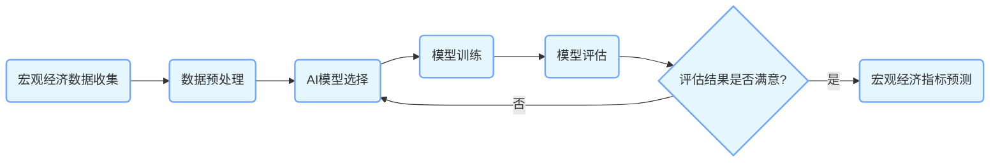

# AI辅助的宏观经济指标预测模型

> 关键词：AI辅助、宏观经济指标、预测模型、机器学习、深度学习

> 摘要：本文聚焦于AI辅助的宏观经济指标预测模型。首先介绍了该主题的背景，包括目的、预期读者等内容。详细阐述了核心概念，如宏观经济指标、AI技术等及其联系，并给出相关示意图和流程图。深入讲解了核心算法原理，通过Python代码进行具体实现。探讨了数学模型和公式，并举例说明其应用。进行了项目实战，包括开发环境搭建、源代码实现与解读。分析了该模型在实际中的应用场景，推荐了学习资源、开发工具框架以及相关论文著作。最后总结了未来发展趋势与挑战，解答常见问题并提供扩展阅读和参考资料，旨在为读者全面呈现AI辅助宏观经济指标预测模型的相关知识和技术。

## 1. 背景介绍 
### 1.1 目的和范围
宏观经济指标如GDP增长率、通货膨胀率、失业率等，对于政府制定经济政策、企业规划战略以及投资者做出决策都具有至关重要的意义。传统的宏观经济预测方法往往基于线性模型和历史数据的简单统计分析，难以捕捉经济系统中的复杂非线性关系和动态变化。随着人工智能技术的快速发展，利用AI辅助进行宏观经济指标预测成为了一个新兴且具有潜力的研究方向。

本文的目的在于深入探讨AI辅助的宏观经济指标预测模型，详细介绍其核心概念、算法原理、数学模型，并通过项目实战展示如何构建和应用这样的模型。范围涵盖了常见的AI技术，如机器学习和深度学习算法在宏观经济预测中的应用，以及相关的开发环境搭建、代码实现和实际应用场景分析。

### 1.2 预期读者
本文预期读者包括对宏观经济预测和人工智能技术感兴趣的研究人员、学生、金融从业者以及相关政策制定者。对于研究人员，本文可以提供新的研究思路和方法；对于学生，有助于他们了解前沿的学术和技术知识；对于金融从业者，能为其投资决策和风险评估提供参考；对于政策制定者，可辅助其制定更加科学合理的经济政策。

### 1.3 文档结构概述
本文将按照以下结构进行阐述：首先介绍核心概念与联系，包括宏观经济指标和AI技术的基本原理以及它们之间的关联，并通过示意图和流程图进行直观展示；接着讲解核心算法原理，结合Python代码详细说明如何实现这些算法；然后介绍数学模型和公式，并举例说明其在宏观经济预测中的应用；进行项目实战，包括开发环境搭建、源代码详细实现和代码解读；分析实际应用场景；推荐学习资源、开发工具框架以及相关论文著作；最后总结未来发展趋势与挑战，解答常见问题并提供扩展阅读和参考资料。

### 1.4 术语表
#### 1.4.1 核心术语定义
- **宏观经济指标**：是反映宏观经济运行状况的统计数据，如国内生产总值（GDP）、消费者物价指数（CPI）、失业率等，用于衡量一个国家或地区的经济总体表现。
- **AI（人工智能）**：是一门研究如何使计算机能够模拟人类智能的学科，包括机器学习、深度学习、自然语言处理等技术。
- **机器学习**：是AI的一个分支，致力于让计算机通过数据学习模式和规律，从而进行预测和决策，常见的算法有线性回归、决策树、支持向量机等。
- **深度学习**：是机器学习的一个子领域，基于人工神经网络，特别是深度神经网络，能够自动从大量数据中学习复杂的特征表示，常用于图像识别、语音识别和预测等任务。

#### 1.4.2 相关概念解释
- **时间序列数据**：宏观经济指标通常以时间序列的形式呈现，即按照时间顺序排列的数据。时间序列分析是研究如何对这种数据进行建模和预测的方法。
- **特征工程**：在构建预测模型时，需要从原始数据中提取有价值的特征。特征工程包括特征选择、特征提取和特征变换等操作，目的是提高模型的性能。
- **模型评估**：为了评估预测模型的准确性和可靠性，需要使用一些评估指标，如均方误差（MSE）、平均绝对误差（MAE）、决定系数（R²）等。

#### 1.4.3 缩略词列表
- **GDP**：国内生产总值（Gross Domestic Product）
- **CPI**：消费者物价指数（Consumer Price Index）
- **MSE**：均方误差（Mean Squared Error）
- **MAE**：平均绝对误差（Mean Absolute Error）
- **R²**：决定系数（Coefficient of Determination）

## 2. 核心概念与联系 

### 核心概念原理
#### 宏观经济指标
宏观经济指标是对一个国家或地区经济总体状况的量化描述。不同的宏观经济指标反映了经济的不同方面：
- **GDP**：是一个国家或地区在一定时期内生产的所有最终产品和服务的市场价值总和，是衡量经济增长的重要指标。
- **CPI**：衡量了消费者购买一篮子商品和服务的价格变化情况，反映了通货膨胀或通货紧缩的程度。
- **失业率**：指失业人口占劳动力人口的比例，反映了劳动力市场的状况。

这些指标之间相互关联，例如，GDP增长通常会带动就业增加，从而降低失业率；而通货膨胀可能会影响消费者的购买力，进而影响GDP增长。

#### AI技术
AI技术在宏观经济指标预测中主要涉及机器学习和深度学习。
- **机器学习**：通过对历史数据的学习，建立输入特征（如过去的宏观经济指标值）和输出目标（如未来的宏观经济指标值）之间的映射关系。常见的机器学习算法包括线性回归、逻辑回归、决策树、随机森林、支持向量机等。
- **深度学习**：利用深度神经网络，如多层感知机（MLP）、长短期记忆网络（LSTM）、门控循环单元（GRU）等，自动从大量数据中学习复杂的非线性关系。深度学习模型在处理时间序列数据和具有复杂模式的数据时表现出较好的性能。

### 架构的文本示意图
```plaintext
宏观经济数据收集 -> 数据预处理（清洗、特征工程） -> AI模型选择（机器学习/深度学习） -> 模型训练 -> 模型评估 -> 宏观经济指标预测
```

### Mermaid流程图


## 3. 核心算法原理 & 具体操作步骤 

### 线性回归算法原理
线性回归是一种简单而常用的机器学习算法，用于建立自变量和因变量之间的线性关系。假设我们有一组输入特征 $X = [x_1, x_2,..., x_n]$ 和对应的目标值 $y$，线性回归模型的表达式为：

$$y = \theta_0 + \theta_1x_1 + \theta_2x_2 +... + \theta_nx_n + \epsilon$$

其中，$\theta_0, \theta_1,..., \theta_n$ 是模型的参数，$\epsilon$ 是误差项。线性回归的目标是通过最小化误差平方和来估计这些参数：

$$\min_{\theta} \sum_{i=1}^{m} (y_i - (\theta_0 + \theta_1x_{i1} + \theta_2x_{i2} +... + \theta_nx_{in}))^2$$

### Python代码实现线性回归
```python
import numpy as np
from sklearn.linear_model import LinearRegression
from sklearn.model_selection import train_test_split
from sklearn.metrics import mean_squared_error

# 生成示例数据
np.random.seed(0)
X = np.random.rand(100, 1)
y = 2 * X + 1 + 0.5 * np.random.randn(100, 1)

# 划分训练集和测试集
X_train, X_test, y_train, y_test = train_test_split(X, y, test_size=0.2, random_state=42)

# 创建线性回归模型
model = LinearRegression()

# 训练模型
model.fit(X_train, y_train)

# 预测
y_pred = model.predict(X_test)

# 评估模型
mse = mean_squared_error(y_test, y_pred)
print(f"均方误差: {mse}")
```

### 长短期记忆网络（LSTM）算法原理
LSTM是一种特殊的循环神经网络（RNN），能够有效处理时间序列数据中的长期依赖问题。LSTM单元包含输入门、遗忘门和输出门，通过这些门控机制来控制信息的流动。

输入门决定了当前输入信息的哪些部分将被添加到单元状态中；遗忘门决定了上一时刻的单元状态中哪些信息将被遗忘；输出门决定了当前单元状态的哪些部分将作为输出。

### Python代码实现LSTM
```python
import numpy as np
import pandas as pd
from sklearn.preprocessing import MinMaxScaler
from tensorflow.keras.models import Sequential
from tensorflow.keras.layers import LSTM, Dense

# 生成示例时间序列数据
data = np.array([i for i in range(100)])
data = data.reshape(-1, 1)

# 数据归一化
scaler = MinMaxScaler()
data = scaler.fit_transform(data)

# 准备训练数据
X, y = [], []
for i in range(len(data) - 10):
    X.append(data[i:i+10])
    y.append(data[i+10])
X, y = np.array(X), np.array(y)

# 划分训练集和测试集
train_size = int(len(X) * 0.8)
X_train, X_test = X[:train_size], X[train_size:]
y_train, y_test = y[:train_size], y[train_size:]

# 创建LSTM模型
model = Sequential()
model.add(LSTM(50, input_shape=(10, 1)))
model.add(Dense(1))
model.compile(optimizer='adam', loss='mse')

# 训练模型
model.fit(X_train, y_train, epochs=100, batch_size=32)

# 预测
y_pred = model.predict(X_test)

# 反归一化
y_test = scaler.inverse_transform(y_test)
y_pred = scaler.inverse_transform(y_pred)

# 评估模型
mse = np.mean((y_test - y_pred) ** 2)
print(f"均方误差: {mse}")
```

## 4. 数学模型和公式 & 详细讲解 & 举例说明 

### 线性回归数学模型
线性回归的数学模型可以用矩阵形式表示：

$$Y = X\theta + \epsilon$$

其中，$Y$ 是 $m \times 1$ 的目标值向量，$X$ 是 $m \times (n + 1)$ 的输入特征矩阵（第一列全为1，对应截距项），$\theta$ 是 $(n + 1) \times 1$ 的参数向量，$\epsilon$ 是 $m \times 1$ 的误差向量。

最小化误差平方和的正规方程为：

$$\hat{\theta} = (X^T X)^{-1} X^T Y$$

其中，$\hat{\theta}$ 是参数的估计值。

#### 举例说明
假设我们有以下数据：

| $x_1$ | $x_2$ | $y$ |
|-------|-------|-----|
| 1     | 2     | 3   |
| 2     | 3     | 5   |
| 3     | 4     | 7   |

则 $X = \begin{bmatrix} 1 & 1 & 2 \\ 1 & 2 & 3 \\ 1 & 3 & 4 \end{bmatrix}$，$Y = \begin{bmatrix} 3 \\ 5 \\ 7 \end{bmatrix}$。

首先计算 $X^T X$：

$$X^T X = \begin{bmatrix} 1 & 1 & 1 \\ 1 & 2 & 3 \\ 2 & 3 & 4 \end{bmatrix} \begin{bmatrix} 1 & 1 & 2 \\ 1 & 2 & 3 \\ 1 & 3 & 4 \end{bmatrix} = \begin{bmatrix} 3 & 6 & 9 \\ 6 & 14 & 20 \\ 9 & 20 & 29 \end{bmatrix}$$

然后计算 $(X^T X)^{-1}$：

$$(X^T X)^{-1} = \begin{bmatrix} 2.333 & -1 & 0.333 \\ -1 & 0.6 & -0.2 \\ 0.333 & -0.2 & 0.067 \end{bmatrix}$$

接着计算 $X^T Y$：

$$X^T Y = \begin{bmatrix} 1 & 1 & 1 \\ 1 & 2 & 3 \\ 2 & 3 & 4 \end{bmatrix} \begin{bmatrix} 3 \\ 5 \\ 7 \end{bmatrix} = \begin{bmatrix} 15 \\ 34 \\ 49 \end{bmatrix}$$

最后计算 $\hat{\theta}$：

$$\hat{\theta} = (X^T X)^{-1} X^T Y = \begin{bmatrix} 2.333 & -1 & 0.333 \\ -1 & 0.6 & -0.2 \\ 0.333 & -0.2 & 0.067 \end{bmatrix} \begin{bmatrix} 15 \\ 34 \\ 49 \end{bmatrix} = \begin{bmatrix} 1 \\ 1 \\ 1 \end{bmatrix}$$

所以线性回归模型为 $y = 1 + x_1 + x_2$。

### LSTM数学模型
LSTM单元的数学表达式如下：

- 遗忘门：

$$f_t = \sigma(W_f[h_{t-1}, x_t] + b_f)$$

- 输入门：

$$i_t = \sigma(W_i[h_{t-1}, x_t] + b_i)$$

$$\tilde{C}_t = \tanh(W_C[h_{t-1}, x_t] + b_C)$$

- 单元状态更新：

$$C_t = f_t \odot C_{t-1} + i_t \odot \tilde{C}_t$$

- 输出门：

$$o_t = \sigma(W_o[h_{t-1}, x_t] + b_o)$$

$$h_t = o_t \odot \tanh(C_t)$$

其中，$\sigma$ 是 sigmoid 函数，$\tanh$ 是双曲正切函数，$\odot$ 表示逐元素相乘，$W$ 是权重矩阵，$b$ 是偏置向量，$h_t$ 是时刻 $t$ 的隐藏状态，$C_t$ 是时刻 $t$ 的单元状态，$x_t$ 是时刻 $t$ 的输入。

#### 举例说明
假设我们有一个简单的LSTM单元，输入维度为2，隐藏维度为3。在某个时刻 $t$，输入 $x_t = \begin{bmatrix} 0.1 \\ 0.2 \end{bmatrix}$，上一时刻的隐藏状态 $h_{t-1} = \begin{bmatrix} 0.3 \\ 0.4 \\ 0.5 \end{bmatrix}$。

首先计算遗忘门：

$$f_t = \sigma(W_f[h_{t-1}, x_t] + b_f)$$

假设 $W_f = \begin{bmatrix} 0.1 & 0.2 & 0.3 & 0.4 & 0.5 \\ 0.6 & 0.7 & 0.8 & 0.9 & 1.0 \\ 1.1 & 1.2 & 1.3 & 1.4 & 1.5 \end{bmatrix}$，$b_f = \begin{bmatrix} 0.1 \\ 0.2 \\ 0.3 \end{bmatrix}$。

$$[h_{t-1}, x_t] = \begin{bmatrix} 0.3 \\ 0.4 \\ 0.5 \\ 0.1 \\ 0.2 \end{bmatrix}$$

$$W_f[h_{t-1}, x_t] + b_f = \begin{bmatrix} 0.1 & 0.2 & 0.3 & 0.4 & 0.5 \\ 0.6 & 0.7 & 0.8 & 0.9 & 1.0 \\ 1.1 & 1.2 & 1.3 & 1.4 & 1.5 \end{bmatrix} \begin{bmatrix} 0.3 \\ 0.4 \\ 0.5 \\ 0.1 \\ 0.2 \end{bmatrix} + \begin{bmatrix} 0.1 \\ 0.2 \\ 0.3 \end{bmatrix} = \begin{bmatrix} 0.4 \\ 0.9 \\ 1.4 \end{bmatrix}$$

$$f_t = \sigma(\begin{bmatrix} 0.4 \\ 0.9 \\ 1.4 \end{bmatrix}) = \begin{bmatrix} 0.599 \\ 0.710 \\ 0.802 \end{bmatrix}$$

同理，可以计算输入门、单元状态更新和输出门，从而得到当前时刻的隐藏状态 $h_t$。

## 5. 项目实战：代码实际案例和详细解释说明 

### 5.1  开发环境搭建
#### 安装Python
首先需要安装Python，建议使用Python 3.7及以上版本。可以从Python官方网站（https://www.python.org/downloads/）下载并安装。

#### 安装必要的库
使用pip命令安装以下必要的库：
```sh
pip install numpy pandas scikit-learn tensorflow matplotlib
```

### 5.2  源代码详细实现和代码解读
#### 数据收集和预处理
```python
import pandas as pd
from sklearn.preprocessing import MinMaxScaler

# 读取数据
data = pd.read_csv('macro_economic_data.csv')

# 提取需要的特征和目标变量
features = data[['GDP_growth_rate', 'CPI', 'Unemployment_rate']]
target = data['Next_quarter_GDP_growth_rate']

# 数据归一化
scaler_features = MinMaxScaler()
scaler_target = MinMaxScaler()
features_scaled = scaler_features.fit_transform(features)
target_scaled = scaler_target.fit_transform(target.values.reshape(-1, 1))
```
**代码解读**：首先使用 `pandas` 库读取宏观经济数据文件。然后提取需要的特征和目标变量。使用 `MinMaxScaler` 对特征和目标变量进行归一化处理，将数据缩放到 [0, 1] 范围内，有助于提高模型的训练效果。

#### 划分训练集和测试集
```python
from sklearn.model_selection import train_test_split

X_train, X_test, y_train, y_test = train_test_split(features_scaled, target_scaled, test_size=0.2, random_state=42)
```
**代码解读**：使用 `train_test_split` 函数将数据集划分为训练集和测试集，测试集占总数据的 20%。设置 `random_state` 为 42 以保证结果的可重复性。

#### 构建和训练线性回归模型
```python
from sklearn.linear_model import LinearRegression
from sklearn.metrics import mean_squared_error

# 创建线性回归模型
model = LinearRegression()

# 训练模型
model.fit(X_train, y_train)

# 预测
y_pred = model.predict(X_test)

# 反归一化
y_test_original = scaler_target.inverse_transform(y_test)
y_pred_original = scaler_target.inverse_transform(y_pred)

# 评估模型
mse = mean_squared_error(y_test_original, y_pred_original)
print(f"线性回归模型均方误差: {mse}")
```
**代码解读**：创建线性回归模型并使用训练集进行训练。使用训练好的模型对测试集进行预测。将预测结果和真实结果进行反归一化处理，恢复到原始数据的尺度。使用均方误差（MSE）评估模型的性能。

#### 构建和训练LSTM模型
```python
import numpy as np
from tensorflow.keras.models import Sequential
from tensorflow.keras.layers import LSTM, Dense

# 调整数据形状以适应LSTM输入
X_train_lstm = np.reshape(X_train, (X_train.shape[0], 1, X_train.shape[1]))
X_test_lstm = np.reshape(X_test, (X_test.shape[0], 1, X_test.shape[1]))

# 创建LSTM模型
model_lstm = Sequential()
model_lstm.add(LSTM(50, input_shape=(1, X_train.shape[1])))
model_lstm.add(Dense(1))
model_lstm.compile(optimizer='adam', loss='mse')

# 训练模型
model_lstm.fit(X_train_lstm, y_train, epochs=100, batch_size=32)

# 预测
y_pred_lstm = model_lstm.predict(X_test_lstm)

# 反归一化
y_pred_lstm_original = scaler_target.inverse_transform(y_pred_lstm)

# 评估模型
mse_lstm = mean_squared_error(y_test_original, y_pred_lstm_original)
print(f"LSTM模型均方误差: {mse_lstm}")
```
**代码解读**：将训练集和测试集的数据形状调整为适合LSTM输入的三维形状（样本数，时间步长，特征数）。创建LSTM模型，包含一个LSTM层和一个全连接层。使用 `adam` 优化器和均方误差损失函数进行模型编译。训练模型并进行预测。将预测结果反归一化后，使用均方误差评估模型性能。

### 5.3  代码解读与分析
#### 线性回归模型
线性回归模型简单易懂，计算效率高。通过最小化误差平方和来估计模型参数，适用于线性关系较强的数据集。在本项目中，如果宏观经济指标之间存在较强的线性关系，线性回归模型可能会取得较好的预测效果。

#### LSTM模型
LSTM模型能够处理时间序列数据中的长期依赖问题，适用于具有复杂动态变化的宏观经济数据。通过门控机制，LSTM可以选择性地记忆和遗忘信息，从而更好地捕捉数据中的模式。然而，LSTM模型的训练时间较长，需要更多的计算资源，并且需要调整较多的超参数，如隐藏单元数量、训练轮数等。

## 6. 实际应用场景 
### 政府政策制定
政府可以利用AI辅助的宏观经济指标预测模型来制定经济政策。例如，通过预测GDP增长率、通货膨胀率和失业率等指标，政府可以提前采取相应的财政政策和货币政策来稳定经济增长、控制通货膨胀和促进就业。如果预测到未来经济增长放缓，政府可以采取减税、增加政府支出等扩张性财政政策；如果预测到通货膨胀加剧，政府可以采取加息、减少货币供应量等紧缩性货币政策。

### 企业战略规划
企业可以根据宏观经济指标的预测结果来制定战略规划。例如，制造业企业可以根据GDP增长率和消费者物价指数的预测来调整生产计划和库存管理。如果预测到经济增长加速，消费者需求增加，企业可以增加生产和库存；如果预测到通货膨胀上升，企业可以提前调整产品价格以应对成本上升。金融企业可以利用宏观经济预测模型来评估投资风险和制定投资策略，例如预测利率走势来调整债券投资组合。

### 投资者决策
投资者可以利用宏观经济指标预测模型来做出投资决策。例如，股票投资者可以根据GDP增长率、企业盈利预期等指标来选择投资的行业和股票。如果预测到某个行业的发展前景良好，投资者可以增加对该行业股票的投资。债券投资者可以根据利率预测来选择债券的期限和品种。此外，宏观经济预测还可以帮助投资者评估市场风险，合理配置资产。

## 7. 工具和资源推荐
### 7.1 学习资源推荐
#### 7.1.1 书籍推荐
- 《Python机器学习》（Sebastian Raschka 著）：这本书详细介绍了Python在机器学习中的应用，包括各种机器学习算法的原理和实现，适合初学者入门。
- 《深度学习》（Ian Goodfellow、Yoshua Bengio 和 Aaron Courville 著）：深度学习领域的经典著作，全面介绍了深度学习的理论和实践，适合有一定基础的读者深入学习。
- 《宏观经济学》（N. Gregory Mankiw 著）：宏观经济学的经典教材，系统介绍了宏观经济的基本理论和政策，有助于理解宏观经济指标的含义和相互关系。

#### 7.1.2 在线课程
- Coursera上的“机器学习”课程（Andrew Ng 教授）：这是一门非常经典的机器学习入门课程，通过视频讲解、编程作业和测验等方式，让学员掌握机器学习的基本概念和算法。
- edX上的“深度学习”课程（由多家知名高校联合开设）：该课程涵盖了深度学习的各个方面，包括神经网络、卷积神经网络、循环神经网络等，适合深入学习深度学习的学员。
- 中国大学MOOC上的“宏观经济学”课程：国内高校开设的宏观经济学课程，结合中国实际情况讲解宏观经济理论和政策，有助于学员理解宏观经济现象。

#### 7.1.3 技术博客和网站
- Medium：上面有很多关于人工智能和宏观经济的技术博客文章，作者来自世界各地的专业人士和研究者，可以获取最新的技术动态和研究成果。
- arXiv：一个预印本平台，提供了大量的学术论文，包括人工智能和宏观经济预测领域的最新研究。
- 国家统计局网站：可以获取官方发布的宏观经济数据，为研究和实践提供数据支持。

### 7.2 开发工具框架推荐
#### 7.2.1 IDE和编辑器
- PyCharm：一款专业的Python集成开发环境，提供了代码编辑、调试、版本控制等功能，适合开发Python项目。
- Jupyter Notebook：一个交互式的开发环境，可以将代码、文本、图表等内容整合在一起，方便进行数据分析和模型开发。

#### 7.2.2 调试和性能分析工具
- TensorBoard：TensorFlow提供的可视化工具，可以用于监控模型训练过程中的各种指标，如损失函数、准确率等，还可以查看模型的结构和参数分布。
- Py-Spy：一个轻量级的Python性能分析工具，可以实时监测Python程序的CPU使用情况，找出性能瓶颈。

#### 7.2.3 相关框架和库
- Scikit-learn：一个简单易用的机器学习库，提供了各种机器学习算法的实现，如线性回归、决策树、支持向量机等，适合快速开发和实验。
- TensorFlow：一个开源的深度学习框架，提供了丰富的深度学习模型和工具，支持GPU加速，适合开发大规模的深度学习项目。
- Keras：一个高级神经网络API，基于TensorFlow、Theano等后端，简单易用，适合快速搭建和训练深度学习模型。

### 7.3 相关论文著作推荐
#### 7.3.1 经典论文
- “Long Short-Term Memory”（Sepp Hochreiter 和 Jürgen Schmidhuber 著）：LSTM的经典论文，详细介绍了LSTM的原理和结构。
- “Gradient-based learning applied to document recognition”（Yann LeCun 等著）：卷积神经网络（CNN）的经典论文，为深度学习在图像识别领域的应用奠定了基础。

#### 7.3.2 最新研究成果
- 在arXiv和各大顶级学术会议（如NeurIPS、ICML、AAAI等）上可以找到关于AI辅助宏观经济指标预测的最新研究成果。这些研究可能涉及新的算法、模型架构和应用场景。

#### 7.3.3 应用案例分析
- 一些金融机构和研究机构会发布关于宏观经济预测模型的应用案例分析报告，通过实际案例展示模型的性能和应用效果。可以关注这些报告，学习如何将理论模型应用到实际场景中。

## 8. 总结：未来发展趋势与挑战
### 未来发展趋势
#### 多模态数据融合
未来的AI辅助宏观经济指标预测模型将不仅仅依赖于传统的经济数据，还会融合更多的多模态数据，如社交媒体数据、卫星图像数据、物联网数据等。这些数据可以提供更丰富的信息，帮助模型更准确地捕捉经济活动的变化。

#### 深度学习模型的进一步优化
随着深度学习技术的不断发展，未来可能会出现更先进的深度学习模型结构，如基于Transformer架构的模型，能够更好地处理时间序列数据和长距离依赖问题。同时，模型的训练方法和优化算法也会不断改进，提高模型的性能和效率。

#### 与其他领域的交叉融合
AI辅助宏观经济指标预测模型将与其他领域进行更深入的交叉融合，如与区块链技术结合，实现经济数据的安全共享和可信计算；与量子计算技术结合，提高模型的计算能力和处理速度。

### 挑战
#### 数据质量和隐私问题
宏观经济数据的质量直接影响模型的预测效果。数据可能存在缺失值、噪声和异常值等问题，需要进行有效的数据清洗和预处理。同时，随着数据的大量收集和使用，数据隐私问题也日益突出，如何在保护数据隐私的前提下进行有效的数据挖掘和分析是一个亟待解决的问题。

#### 模型解释性问题
深度学习模型通常被认为是“黑匣子”，难以解释其决策过程和预测结果。在宏观经济预测中，模型的解释性非常重要，政策制定者和决策者需要了解模型是如何做出预测的，以便做出合理的决策。因此，如何提高模型的解释性是一个重要的挑战。

#### 经济系统的复杂性和不确定性
宏观经济系统是一个复杂的动态系统，受到多种因素的影响，如政策变化、国际形势、自然灾害等。这些因素具有不确定性，使得宏观经济指标的预测变得更加困难。如何在复杂和不确定的环境中提高模型的预测准确性和稳定性是一个长期的挑战。

## 9. 附录：常见问题与解答
### 问题1：如何选择合适的AI算法进行宏观经济指标预测？
解答：选择合适的AI算法需要考虑多个因素。如果数据之间存在较强的线性关系，线性回归等简单的机器学习算法可能是一个不错的选择；如果数据具有复杂的非线性关系和时间序列特征，深度学习算法如LSTM、GRU等可能更合适。此外，还可以通过交叉验证等方法比较不同算法的性能，选择性能最优的算法。

### 问题2：数据归一化的作用是什么？
解答：数据归一化的作用主要有两个方面。一方面，不同的宏观经济指标可能具有不同的量纲和取值范围，归一化可以将数据缩放到相同的尺度，避免某些特征对模型的影响过大。另一方面，归一化可以加快模型的训练速度，提高模型的稳定性和收敛性。

### 问题3：如何评估宏观经济指标预测模型的性能？
解答：可以使用多种评估指标来评估模型的性能，如均方误差（MSE）、平均绝对误差（MAE）、决定系数（R²）等。MSE和MAE衡量了预测值与真实值之间的误差大小，值越小表示模型的预测精度越高；R²表示模型对数据的拟合程度，取值范围为 [0, 1]，值越接近1表示模型的拟合效果越好。此外，还可以通过可视化方法，如绘制预测值和真实值的对比曲线，直观地观察模型的预测效果。

## 10. 扩展阅读 & 参考资料
### 扩展阅读
- 《人工智能时代的经济与政策》：探讨了人工智能对宏观经济和政策制定的影响，以及如何应对人工智能带来的挑战和机遇。
- 《时间序列分析：预测与控制》：深入介绍了时间序列分析的理论和方法，对于理解和应用时间序列数据进行宏观经济预测有很大帮助。

### 参考资料
- 国家统计局发布的宏观经济数据报告。
- 相关学术期刊，如《经济研究》、《管理世界》、《Journal of Economic Dynamics and Control》等。
- 各大高校和研究机构的学术论文和研究报告。

作者：AI天才研究院/AI Genius Institute & 禅与计算机程序设计艺术 /Zen And The Art of Computer Programming