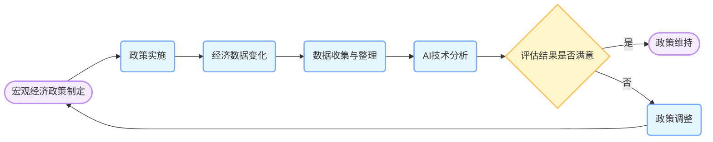

# AI辅助的宏观经济政策效果评估

> 关键词：AI、宏观经济政策、效果评估、机器学习、数据分析

> 摘要：本文聚焦于AI辅助的宏观经济政策效果评估这一重要议题。首先介绍了研究的背景，包括目的、预期读者、文档结构和相关术语。接着阐述了核心概念，如宏观经济政策、AI技术及其联系，并给出了相应的文本示意图和Mermaid流程图。详细讲解了核心算法原理，用Python代码展示具体操作步骤。探讨了相关的数学模型和公式，并举例说明。通过项目实战，给出了开发环境搭建、源代码实现和代码解读。分析了实际应用场景，推荐了学习资源、开发工具框架和相关论文著作。最后总结了未来发展趋势与挑战，解答了常见问题并提供扩展阅读和参考资料，旨在全面深入地剖析AI在宏观经济政策效果评估中的应用。

## 1. 背景介绍 
### 1.1 目的和范围
宏观经济政策对于一个国家或地区的经济稳定和发展起着至关重要的作用。然而，如何准确、客观地评估这些政策的效果一直是经济学领域的一大挑战。传统的评估方法往往依赖于有限的数据和较为简单的统计模型，难以全面、深入地反映政策实施后的复杂经济变化。随着人工智能技术的飞速发展，其强大的数据处理能力、模式识别能力和预测能力为宏观经济政策效果评估提供了新的思路和方法。

本文的目的在于探讨如何利用AI技术辅助进行宏观经济政策效果评估，深入分析AI在这一领域的应用原理、方法和实际效果。范围涵盖了常见的AI算法在宏观经济数据处理、模型构建和政策效果预测等方面的应用，同时结合实际案例进行详细说明。

### 1.2 预期读者
本文预期读者包括经济学研究人员、政策制定者、金融分析师、AI技术开发者以及对宏观经济和AI技术交叉领域感兴趣的人士。对于经济学研究人员，本文可以提供新的研究视角和方法；政策制定者可以从中了解如何利用AI技术更科学地评估政策效果，为后续政策调整提供依据；金融分析师可以借助AI辅助评估结果进行投资决策；AI技术开发者则可以探索在宏观经济领域的新应用场景。

### 1.3 文档结构概述
本文将按照以下结构进行阐述：首先介绍核心概念与联系，包括宏观经济政策和AI技术的基本概念以及它们之间的关联，并给出相应的示意图和流程图；接着详细讲解核心算法原理和具体操作步骤，使用Python代码进行说明；然后介绍相关的数学模型和公式，并举例说明其在宏观经济政策效果评估中的应用；通过项目实战，展示如何搭建开发环境、实现源代码并进行代码解读；分析实际应用场景；推荐学习资源、开发工具框架和相关论文著作；最后总结未来发展趋势与挑战，解答常见问题并提供扩展阅读和参考资料。

### 1.4 术语表
#### 1.4.1 核心术语定义
- **宏观经济政策**：政府或货币当局为了实现一定的经济目标，如经济增长、稳定物价、充分就业和国际收支平衡等，而采取的一系列政策措施，包括财政政策、货币政策、产业政策等。
- **AI（人工智能）**：计算机科学的一个分支，旨在使计算机系统能够模拟人类的智能行为，如学习、推理、决策等。在本文中，主要涉及机器学习、深度学习等技术在宏观经济政策效果评估中的应用。
- **政策效果评估**：对宏观经济政策实施后所产生的经济、社会等方面的影响进行全面、系统的分析和评价，以判断政策是否达到预期目标以及其有效性和合理性。

#### 1.4.2 相关概念解释
- **机器学习**：AI的一个重要分支，通过让计算机从数据中自动学习模式和规律，从而进行预测和决策。常见的机器学习算法包括线性回归、决策树、支持向量机等。
- **深度学习**：一种基于人工神经网络的机器学习技术，具有强大的特征提取和模式识别能力，在图像识别、自然语言处理等领域取得了显著成果。在宏观经济政策效果评估中，深度学习可以用于处理复杂的经济数据和挖掘潜在的经济规律。
- **时间序列分析**：一种用于分析随时间变化的数据的统计方法，在宏观经济领域中，许多经济指标都是按时间顺序记录的，如GDP、通货膨胀率等。时间序列分析可以帮助我们预测经济指标的未来走势，评估政策对经济指标的长期影响。

#### 1.4.3 缩略词列表
- **GDP**：国内生产总值（Gross Domestic Product）
- **CPI**：消费者物价指数（Consumer Price Index）
- **ML**：机器学习（Machine Learning）
- **DL**：深度学习（Deep Learning）

## 2. 核心概念与联系 

### 核心概念原理
宏观经济政策是政府调节经济运行的重要手段，其通过影响总需求和总供给来实现经济目标。财政政策主要通过政府的支出和税收来调节经济，例如增加政府支出可以刺激总需求，促进经济增长；货币政策则通过调节货币供应量和利率来影响经济，如降低利率可以鼓励企业投资和居民消费。

AI技术在宏观经济政策效果评估中的应用主要基于其数据处理和分析能力。通过收集大量的宏观经济数据，包括GDP、CPI、失业率等，利用机器学习和深度学习算法对这些数据进行挖掘和分析，提取出与政策效果相关的信息和模式。例如，使用回归分析可以建立政策变量与经济指标之间的定量关系，预测政策实施后的经济变化；使用聚类分析可以将不同的经济状态进行分类，评估政策在不同经济状态下的效果。

### 文本示意图
宏观经济政策、经济数据和AI技术之间的关系可以用以下示意图表示：

宏观经济政策制定后，会对经济系统产生影响，导致各种经济数据的变化。这些经济数据被收集和整理后，作为AI技术的输入。AI技术通过对这些数据的分析和处理，提取出政策效果的相关信息，并将评估结果反馈给政策制定者，为政策的调整和优化提供依据。

### Mermaid流程图


该流程图展示了宏观经济政策制定、实施、数据收集分析以及政策调整的循环过程。AI技术在数据收集与整理后发挥作用，对政策效果进行评估，并根据评估结果决定是否需要对政策进行调整。

## 3. 核心算法原理 & 具体操作步骤 

### 线性回归算法原理
线性回归是一种常用的机器学习算法，用于建立自变量和因变量之间的线性关系。在宏观经济政策效果评估中，我们可以将政策变量作为自变量，经济指标作为因变量，通过线性回归模型来预测政策实施后经济指标的变化。

线性回归模型的一般形式为：

$$y = \beta_0 + \beta_1x_1 + \beta_2x_2 + \cdots + \beta_nx_n + \epsilon$$

其中，$y$ 是因变量，$x_1, x_2, \cdots, x_n$ 是自变量，$\beta_0, \beta_1, \beta_2, \cdots, \beta_n$ 是回归系数，$\epsilon$ 是误差项。

### Python代码实现线性回归
```python
import numpy as np
from sklearn.linear_model import LinearRegression

# 生成示例数据
np.random.seed(0)
X = np.random.rand(100, 2)  # 自变量
y = 3 * X[:, 0] + 2 * X[:, 1] + np.random.randn(100)  # 因变量

# 创建线性回归模型
model = LinearRegression()

# 拟合模型
model.fit(X, y)

# 输出回归系数
print("回归系数:", model.coef_)
print("截距:", model.intercept_)

# 预测新数据
new_X = np.array([[0.5, 0.6]])
prediction = model.predict(new_X)
print("预测值:", prediction)
```

### 代码解释
1. **数据生成**：使用 `numpy` 生成随机的自变量 `X` 和因变量 `y`，模拟宏观经济数据。
2. **模型创建**：使用 `sklearn` 库中的 `LinearRegression` 类创建线性回归模型。
3. **模型拟合**：调用 `fit` 方法对模型进行拟合，即根据输入数据计算回归系数。
4. **输出结果**：打印回归系数和截距，以及对新数据的预测值。

### 决策树算法原理
决策树是一种基于树结构进行决策的机器学习算法。在宏观经济政策效果评估中，决策树可以用于分类和预测，例如将不同的经济状态分为繁荣、衰退、复苏等类别，或者预测政策实施后经济指标的变化趋势。

决策树的构建过程是通过递归地选择最优特征进行节点划分，使得划分后的子节点尽可能地“纯”。常用的划分准则有信息增益、基尼指数等。

### Python代码实现决策树分类
```python
from sklearn.datasets import load_iris
from sklearn.model_selection import train_test_split
from sklearn.tree import DecisionTreeClassifier
from sklearn.metrics import accuracy_score

# 加载鸢尾花数据集
iris = load_iris()
X = iris.data
y = iris.target

# 划分训练集和测试集
X_train, X_test, y_train, y_test = train_test_split(X, y, test_size=0.2, random_state=42)

# 创建决策树分类器
clf = DecisionTreeClassifier()

# 拟合模型
clf.fit(X_train, y_train)

# 预测测试集
y_pred = clf.predict(X_test)

# 计算准确率
accuracy = accuracy_score(y_test, y_pred)
print("准确率:", accuracy)
```

### 代码解释
1. **数据加载**：使用 `sklearn` 库中的 `load_iris` 函数加载鸢尾花数据集，作为示例数据。
2. **数据划分**：使用 `train_test_split` 函数将数据集划分为训练集和测试集。
3. **模型创建**：使用 `DecisionTreeClassifier` 类创建决策树分类器。
4. **模型拟合**：调用 `fit` 方法对模型进行拟合。
5. **预测和评估**：使用训练好的模型对测试集进行预测，并计算预测准确率。

## 4. 数学模型和公式 & 详细讲解 & 举例说明 

### 线性回归模型
线性回归模型的目标是找到一组回归系数 $\beta_0, \beta_1, \cdots, \beta_n$，使得模型的预测值与实际值之间的误差最小。常用的误差度量方法是均方误差（MSE）：

$$MSE = \frac{1}{m} \sum_{i=1}^{m} (y_i - \hat{y}_i)^2$$

其中，$m$ 是样本数量，$y_i$ 是第 $i$ 个样本的实际值，$\hat{y}_i$ 是第 $i$ 个样本的预测值。

通过最小化均方误差，可以得到回归系数的最优解。在简单线性回归（只有一个自变量）中，回归系数的计算公式为：

$$\beta_1 = \frac{\sum_{i=1}^{m} (x_i - \bar{x})(y_i - \bar{y})}{\sum_{i=1}^{m} (x_i - \bar{x})^2}$$

$$\beta_0 = \bar{y} - \beta_1\bar{x}$$

其中，$\bar{x}$ 和 $\bar{y}$ 分别是自变量和因变量的均值。

### 举例说明
假设我们要研究财政支出（自变量 $x$）对GDP（因变量 $y$）的影响。我们收集了过去10年的财政支出和GDP数据，如下表所示：

| 年份 | 财政支出（亿元） | GDP（万亿元） |
| ---- | ---- | ---- |
| 2010 | 10 | 50 |
| 2011 | 12 | 55 |
| 2012 | 13 | 60 |
| 2013 | 15 | 65 |
| 2014 | 16 | 70 |
| 2015 | 18 | 75 |
| 2016 | 20 | 80 |
| 2017 | 22 | 85 |
| 2018 | 23 | 90 |
| 2019 | 25 | 95 |

首先，计算自变量和因变量的均值：

$$\bar{x} = \frac{10 + 12 + 13 + 15 + 16 + 18 + 20 + 22 + 23 + 25}{10} = 17.4$$

$$\bar{y} = \frac{50 + 55 + 60 + 65 + 70 + 75 + 80 + 85 + 90 + 95}{10} = 72.5$$

然后，计算 $\beta_1$ 和 $\beta_0$：

$$\beta_1 = \frac{\sum_{i=1}^{10} (x_i - 17.4)(y_i - 72.5)}{\sum_{i=1}^{10} (x_i - 17.4)^2} \approx 2.5$$

$$\beta_0 = 72.5 - 2.5 \times 17.4 = 29$$

得到线性回归模型为：$y = 29 + 2.5x$。

这意味着财政支出每增加1亿元，GDP大约增加2.5万亿元。

### 逻辑回归模型
逻辑回归是一种用于分类问题的机器学习算法，虽然名称中包含“回归”，但实际上是一种分类算法。在宏观经济政策效果评估中，逻辑回归可以用于预测政策实施后经济是否会陷入衰退等分类问题。

逻辑回归模型的输出是一个概率值，表示样本属于某个类别的概率。逻辑回归模型的公式为：

$$P(y = 1|x) = \frac{1}{1 + e^{-(\beta_0 + \beta_1x_1 + \cdots + \beta_nx_n)}}$$

其中，$P(y = 1|x)$ 表示在给定自变量 $x$ 的情况下，样本属于类别1的概率。

### 举例说明
假设我们要根据通货膨胀率（$x_1$）和失业率（$x_2$）来预测经济是否会陷入衰退（$y$，$y = 1$ 表示衰退，$y = 0$ 表示非衰退）。我们收集了一些历史数据，通过逻辑回归模型得到回归系数 $\beta_0 = -5$，$\beta_1 = 0.5$，$\beta_2 = 0.8$。

当通货膨胀率为 $3\%$，失业率为 $5\%$ 时，计算经济陷入衰退的概率：

$$P(y = 1|x) = \frac{1}{1 + e^{-(-5 + 0.5 \times 3 + 0.8 \times 5)}} \approx 0.7$$

这意味着在当前通货膨胀率和失业率的情况下，经济陷入衰退的概率约为 $70\%$。

## 5. 项目实战：代码实际案例和详细解释说明 

### 5.1  开发环境搭建
#### 安装Python
首先，需要安装Python编程语言。建议使用Python 3.7及以上版本，可以从Python官方网站（https://www.python.org/downloads/）下载并安装。

#### 安装必要的库
使用 `pip` 包管理器安装以下必要的库：
```sh
pip install numpy pandas scikit-learn matplotlib
```
- `numpy`：用于数值计算。
- `pandas`：用于数据处理和分析。
- `scikit-learn`：提供了丰富的机器学习算法和工具。
- `matplotlib`：用于数据可视化。

### 5.2  源代码详细实现和代码解读
#### 数据加载和预处理
```python
import pandas as pd

# 加载数据
data = pd.read_csv('macro_economic_data.csv')

# 查看数据基本信息
print(data.info())

# 处理缺失值
data = data.dropna()

# 划分自变量和因变量
X = data.drop('GDP_growth_rate', axis=1)
y = data['GDP_growth_rate']
```

### 代码解读
1. **数据加载**：使用 `pandas` 的 `read_csv` 函数加载包含宏观经济数据的CSV文件。
2. **数据信息查看**：调用 `info` 方法查看数据的基本信息，包括列名、数据类型和缺失值情况。
3. **缺失值处理**：使用 `dropna` 方法删除包含缺失值的行。
4. **自变量和因变量划分**：将除了GDP增长率之外的列作为自变量，GDP增长率作为因变量。

#### 模型训练和评估
```python
from sklearn.model_selection import train_test_split
from sklearn.linear_model import LinearRegression
from sklearn.metrics import mean_squared_error

# 划分训练集和测试集
X_train, X_test, y_train, y_test = train_test_split(X, y, test_size=0.2, random_state=42)

# 创建线性回归模型
model = LinearRegression()

# 拟合模型
model.fit(X_train, y_train)

# 预测测试集
y_pred = model.predict(X_test)

# 计算均方误差
mse = mean_squared_error(y_test, y_pred)
print("均方误差:", mse)
```

### 代码解读
1. **数据划分**：使用 `train_test_split` 函数将数据集划分为训练集和测试集，测试集占比为 $20\%$。
2. **模型创建**：使用 `LinearRegression` 类创建线性回归模型。
3. **模型拟合**：调用 `fit` 方法对模型进行拟合。
4. **预测和评估**：使用训练好的模型对测试集进行预测，并计算预测值与实际值之间的均方误差。

### 5.3  代码解读与分析
通过上述代码，我们完成了一个简单的宏观经济政策效果评估项目。首先，对数据进行了加载和预处理，确保数据的质量。然后，使用线性回归模型对GDP增长率进行预测，并计算了预测误差。

均方误差是衡量模型预测性能的一个重要指标，均方误差越小，说明模型的预测效果越好。在实际应用中，我们可以根据均方误差的大小来调整模型的参数或者选择其他更合适的模型。

## 6. 实际应用场景 
### 政策制定阶段的效果预测
在宏观经济政策制定之前，政策制定者可以利用AI技术对不同政策方案的效果进行预测。通过收集历史经济数据和政策数据，构建机器学习模型，模拟不同政策实施后的经济变化。例如，预测不同财政支出规模和税收政策对GDP增长、就业和通货膨胀的影响，从而选择最优的政策方案。

### 政策实施过程中的实时监测
在政策实施过程中，利用AI技术实时收集和分析经济数据，监测政策的实施效果。通过建立实时数据监测系统，对关键经济指标进行实时跟踪和预警。例如，当通货膨胀率超出预期范围时，及时调整货币政策；当失业率上升时，评估财政政策的刺激效果是否足够。

### 政策实施后的综合评估
政策实施一段时间后，对政策的整体效果进行综合评估。利用AI技术分析政策实施前后经济数据的变化，评估政策对经济增长、就业、物价稳定等方面的影响。同时，分析政策的长期和短期效果，以及政策的副作用和潜在风险。例如，评估一项产业政策对产业结构升级和企业创新能力的影响，以及是否带来了产能过剩等问题。

### 国际经济政策比较分析
在全球化背景下，不同国家的宏观经济政策相互影响。利用AI技术对不同国家的经济政策和经济数据进行比较分析，借鉴其他国家的成功经验和失败教训。例如，分析美国的货币政策调整对全球经济的溢出效应，以及中国可以采取的应对措施。

## 7. 工具和资源推荐
### 7.1 学习资源推荐
#### 7.1.1 书籍推荐
- 《机器学习》（周志华著）：这是一本全面介绍机器学习算法和理论的经典教材，涵盖了线性回归、决策树、神经网络等多种算法，适合初学者和有一定基础的读者。
- 《深度学习》（Ian Goodfellow、Yoshua Bengio和Aaron Courville著）：深度学习领域的权威著作，详细介绍了深度学习的基本原理、模型结构和应用案例。
- 《宏观经济学》（N. Gregory Mankiw著）：经典的宏观经济学教材，系统介绍了宏观经济理论和政策，为理解宏观经济政策效果评估提供了理论基础。

#### 7.1.2 在线课程
- Coursera上的“机器学习”课程（Andrew Ng教授主讲）：该课程是机器学习领域的经典在线课程，通过视频讲解、编程作业和测验等方式，帮助学员掌握机器学习的基本概念和算法。
- edX上的“深度学习”课程（由多家知名高校联合推出）：提供了深度学习的深入学习内容，包括卷积神经网络、循环神经网络等高级模型。
- 中国大学MOOC上的“宏观经济学”课程：国内高校教师主讲，结合中国经济实际，讲解宏观经济理论和政策。

#### 7.1.3 技术博客和网站
- Medium：一个技术博客平台，有许多关于AI和宏观经济的优秀文章。
- Towards Data Science：专注于数据科学和机器学习领域的博客网站，提供了大量的技术教程和案例分析。
- 国家统计局网站：提供了丰富的宏观经济数据，是进行宏观经济政策效果评估的重要数据来源。

### 7.2 开发工具框架推荐
#### 7.2.1 IDE和编辑器
- PyCharm：一款专业的Python集成开发环境，提供了代码编辑、调试、版本控制等功能，适合Python开发。
- Jupyter Notebook：一种交互式的开发环境，支持代码、文本和可视化的混合编辑，方便进行数据探索和模型实验。

#### 7.2.2 调试和性能分析工具
- `pdb`：Python自带的调试工具，可以在代码中设置断点，逐步执行代码，查看变量的值。
- `cProfile`：用于分析Python代码的性能，找出代码中的瓶颈。

#### 7.2.3 相关框架和库
- `scikit-learn`：一个简单易用的机器学习库，提供了丰富的机器学习算法和工具，如线性回归、决策树、支持向量机等。
- `TensorFlow`：Google开发的深度学习框架，支持大规模分布式计算，广泛应用于图像识别、自然语言处理等领域。
- `PyTorch`：一个动态图深度学习框架，具有简洁易用的特点，受到学术界和工业界的广泛关注。

### 7.3 相关论文著作推荐
#### 7.3.1 经典论文
- “A Contribution to the Theory of Economic Growth”（Robert M. Solow著）：提出了索洛增长模型，是宏观经济增长理论的经典论文。
- “The General Theory of Employment, Interest and Money”（John Maynard Keynes著）：凯恩斯主义经济学的代表作，对宏观经济政策的制定产生了深远影响。

#### 7.3.2 最新研究成果
- 关注《American Economic Review》《Journal of Political Economy》等顶级经济学学术期刊，以及《Journal of Machine Learning Research》《Neural Computation》等机器学习领域的期刊，获取最新的研究成果。

#### 7.3.3 应用案例分析
- 可以参考国际货币基金组织（IMF）、世界银行等国际组织发布的经济报告和政策评估报告，了解AI在宏观经济政策效果评估中的实际应用案例。

## 8. 总结：未来发展趋势与挑战
### 未来发展趋势
#### 多学科融合
未来，AI辅助的宏观经济政策效果评估将更加注重多学科融合。不仅需要结合经济学、统计学和计算机科学等学科知识，还需要引入心理学、社会学等学科的理论和方法，以更全面地理解经济现象和政策效果。例如，考虑人们的心理预期对经济行为的影响，以及社会文化因素对政策实施的制约。

#### 实时动态评估
随着数据采集技术和计算能力的不断提升，宏观经济政策效果评估将从传统的事后评估向实时动态评估转变。可以实时收集和分析海量的经济数据，及时发现政策实施过程中的问题和变化，为政策调整提供更及时、准确的依据。

#### 智能决策支持系统
利用AI技术构建智能决策支持系统，为政策制定者提供更加科学、智能的决策建议。系统可以根据不同的政策目标和约束条件，自动生成多种政策方案，并对这些方案的效果进行评估和比较，帮助政策制定者做出最优决策。

#### 国际合作与交流
在全球化背景下，宏观经济政策的国际协调和合作越来越重要。未来，各国将加强在AI辅助的宏观经济政策效果评估方面的合作与交流，共享数据和研究成果，共同应对全球性的经济挑战。

### 挑战
#### 数据质量和隐私问题
宏观经济数据的质量和隐私保护是AI辅助评估面临的重要挑战。数据的准确性、完整性和一致性直接影响模型的性能和评估结果的可靠性。同时，在数据收集和使用过程中，需要保护个人和企业的隐私，遵守相关法律法规。

#### 模型可解释性
许多AI模型，特别是深度学习模型，具有较高的复杂度和黑箱性，难以解释模型的决策过程和结果。在宏观经济政策效果评估中，政策制定者需要了解模型的推理逻辑和依据，以便做出合理的决策。因此，提高模型的可解释性是一个亟待解决的问题。

#### 经济理论与AI技术的结合
虽然AI技术在数据处理和模式识别方面具有强大的能力，但宏观经济现象具有复杂的内在规律和因果关系。如何将经济理论与AI技术有机结合，构建更加符合经济现实的模型，是当前面临的挑战之一。

#### 技术人才短缺
AI辅助的宏观经济政策效果评估需要既懂经济学又懂AI技术的复合型人才。目前，这类人才相对短缺，制约了该领域的发展。需要加强相关专业的教育和培训，培养更多的复合型人才。

## 9. 附录：常见问题与解答
### 问题1：AI技术能否完全替代传统的宏观经济政策效果评估方法？
答：不能。虽然AI技术具有强大的数据处理和分析能力，但传统的宏观经济政策效果评估方法基于经济学理论和统计分析，具有深厚的理论基础和实践经验。AI技术可以作为传统方法的补充和扩展，提供更全面、深入的分析视角和更准确的预测结果，但不能完全替代传统方法。

### 问题2：如何选择合适的AI算法进行宏观经济政策效果评估？
答：选择合适的AI算法需要考虑多个因素，包括数据的特点、问题的类型和评估的目标。如果数据具有线性关系，线性回归算法可能是一个不错的选择；如果问题是分类问题，如预测经济是否会陷入衰退，可以考虑使用逻辑回归、决策树等分类算法；如果数据具有复杂的非线性关系，深度学习算法可能更适合。此外，还可以通过交叉验证等方法比较不同算法的性能，选择最优的算法。

### 问题3：AI辅助评估的结果是否可靠？
答：AI辅助评估的结果的可靠性取决于多个因素，包括数据的质量、模型的选择和训练、算法的合理性等。为了提高结果的可靠性，需要确保数据的准确性和完整性，选择合适的模型和算法，并进行充分的模型评估和验证。同时，还需要结合经济学理论和专家经验对评估结果进行分析和判断。

### 问题4：在使用AI技术进行宏观经济政策效果评估时，需要注意哪些法律和伦理问题？
答：需要注意数据隐私保护、数据安全和算法公平性等法律和伦理问题。在数据收集和使用过程中，要遵守相关的法律法规，保护个人和企业的隐私。确保数据的存储和传输安全，防止数据泄露和滥用。此外，要避免算法的偏见和歧视，确保评估结果的公平性和客观性。

## 10. 扩展阅读 & 参考资料
### 扩展阅读
- 《大数据时代》（维克托·迈尔 - 舍恩伯格、肯尼斯·库克耶著）：介绍了大数据的概念、特点和应用，为理解AI在宏观经济领域的应用提供了背景知识。
- 《算法之美：指导工作与生活的算法》（布莱恩·克里斯汀、汤姆·格里菲思著）：从算法的角度探讨了如何优化决策和解决问题，对宏观经济政策制定有一定的启示作用。

### 参考资料
- 国家统计局官方网站（https://data.stats.gov.cn/）：提供了丰富的宏观经济数据。
- 国际货币基金组织（IMF）官方网站（https://www.imf.org/）：发布了全球经济形势和政策评估报告。
- 《Python数据分析实战》（李金洪著）：详细介绍了Python在数据分析中的应用，包括数据处理、可视化和机器学习等方面。

作者：AI天才研究院/AI Genius Institute & 禅与计算机程序设计艺术 /Zen And The Art of Computer Programming