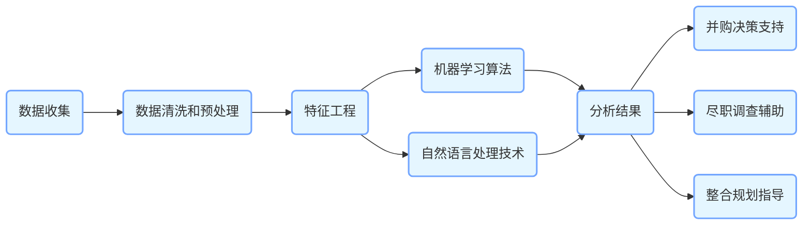

# AI辅助的并购交易分析

> 关键词：AI、并购交易分析、机器学习、数据分析、自然语言处理、预测模型、风险评估

> 摘要：本文围绕AI辅助的并购交易分析展开，详细阐述了在并购交易领域引入AI技术的背景和重要性。首先介绍了相关背景知识，包括目的、预期读者和文档结构等。接着深入讲解了核心概念，如机器学习、自然语言处理等与并购交易分析的联系，并给出了相应的文本示意图和Mermaid流程图。详细阐述了核心算法原理，通过Python代码进行具体操作步骤的演示。对涉及的数学模型和公式进行了详细讲解和举例说明。通过项目实战展示了AI辅助并购交易分析的代码实现和解读。探讨了其实际应用场景，推荐了相关的学习资源、开发工具框架以及论文著作。最后总结了未来发展趋势与挑战，并提供了常见问题解答和扩展阅读参考资料，旨在为读者全面深入地了解AI在并购交易分析中的应用提供有价值的参考。

## 1. 背景介绍 
### 1.1 目的和范围
并购交易在商业活动中具有重要意义，它能够帮助企业实现规模扩张、资源整合、多元化发展等战略目标。然而，并购交易过程复杂，涉及大量的数据和信息分析，包括财务数据、市场动态、行业趋势、法律法规等。传统的并购交易分析方法往往依赖于人工经验和简单的数据分析工具，效率低下且容易出现主观偏差。

本文章的目的是探讨如何利用AI技术辅助并购交易分析，提高分析的准确性、效率和全面性。范围涵盖了AI技术在并购交易前的目标企业筛选、尽职调查，交易中的估值分析、风险评估，以及交易后的整合规划等各个环节的应用。

### 1.2 预期读者
本文预期读者包括企业的战略规划人员、并购交易团队成员、投资银行家、财务分析师、风险管理人员等从事并购交易相关工作的专业人士。同时，对AI技术在金融领域应用感兴趣的研究人员、学生也可以从本文中获取有价值的信息。

### 1.3 文档结构概述
本文将按照以下结构进行阐述：首先介绍背景知识，包括目的、预期读者和文档结构等；接着讲解核心概念，分析AI技术与并购交易分析的联系；然后详细阐述核心算法原理和具体操作步骤，通过Python代码进行演示；对涉及的数学模型和公式进行详细讲解和举例说明；通过项目实战展示AI辅助并购交易分析的代码实现和解读；探讨其实际应用场景；推荐相关的学习资源、开发工具框架以及论文著作；最后总结未来发展趋势与挑战，提供常见问题解答和扩展阅读参考资料。

### 1.4 术语表
#### 1.4.1 核心术语定义
- **并购交易（Mergers and Acquisitions，M&A）**：指企业之间通过合并、收购等方式实现股权或资产转移，从而达到企业控制权变更或业务整合的商业行为。
- **AI（Artificial Intelligence，人工智能）**：指计算机系统能够执行通常需要人类智能才能完成的任务，如学习、推理、解决问题等。
- **机器学习（Machine Learning）**：AI的一个分支，让计算机通过数据学习模式和规律，从而做出预测和决策，而无需明确编程。
- **自然语言处理（Natural Language Processing，NLP）**：AI的一个领域，研究如何让计算机理解、处理和生成人类语言。
- **尽职调查（Due Diligence）**：在并购交易前，对目标企业的财务、法律、运营等方面进行全面调查和评估，以发现潜在风险和价值。

#### 1.4.2 相关概念解释
- **数据挖掘（Data Mining）**：从大量数据中发现有价值的信息和知识的过程，常用于并购交易分析中的数据探索和模式识别。
- **预测模型（Prediction Model）**：基于历史数据和机器学习算法构建的模型，用于预测未来事件或结果，如目标企业的财务表现、市场价值等。
- **风险评估（Risk Assessment）**：对并购交易中可能面临的各种风险进行识别、分析和评估，以便采取相应的风险应对措施。

#### 1.4.3 缩略词列表
- **M&A：Mergers and Acquisitions（并购交易）**
- **AI：Artificial Intelligence（人工智能）**
- **ML：Machine Learning（机器学习）**
- **NLP：Natural Language Processing（自然语言处理）**
- **DD：Due Diligence（尽职调查）**

## 2. 核心概念与联系 

### 核心概念原理
#### 机器学习在并购交易分析中的应用
机器学习是AI的核心技术之一，它通过对大量历史数据的学习，发现数据中的模式和规律，并利用这些模式和规律对新的数据进行预测和分类。在并购交易分析中，机器学习可以应用于多个方面：
- **目标企业筛选**：通过对历史并购案例和企业数据的学习，构建分类模型，预测哪些企业更有可能成为合适的并购目标。
- **财务预测**：利用时间序列分析和回归分析等机器学习算法，对目标企业的未来财务指标进行预测，如收入、利润、现金流等。
- **风险评估**：通过对各种风险因素的分析和建模，预测并购交易中可能面临的风险，如市场风险、财务风险、法律风险等。

#### 自然语言处理在并购交易分析中的应用
自然语言处理技术可以帮助计算机理解和处理人类语言，在并购交易分析中，它主要用于以下方面：
- **新闻舆情分析**：通过对新闻报道、社交媒体等文本数据的分析，了解目标企业的市场声誉、行业评价和潜在风险。
- **合同文本分析**：对并购合同、公司章程等法律文本进行分析，提取关键信息，识别潜在的法律风险和条款漏洞。
- **管理层陈述分析**：对目标企业管理层的发言、报告等文本进行分析，了解其战略规划、经营理念和管理能力。

### 架构的文本示意图
```plaintext
AI辅助的并购交易分析架构
|-- 数据层
|   |-- 财务数据（目标企业、行业）
|   |-- 市场数据（股票价格、行业指数）
|   |-- 文本数据（新闻报道、合同文本）
|-- 处理层
|   |-- 数据清洗和预处理
|   |-- 特征工程
|   |-- 机器学习算法（分类、回归、聚类）
|   |-- 自然语言处理技术（文本分类、命名实体识别、情感分析）
|-- 分析层
|   |-- 目标企业筛选
|   |-- 财务预测
|   |-- 风险评估
|   |-- 估值分析
|-- 应用层
|   |-- 并购决策支持
|   |-- 尽职调查辅助
|   |-- 整合规划指导
```

### Mermaid流程图


## 3. 核心算法原理 & 具体操作步骤 

### 目标企业筛选的机器学习算法原理及Python实现
#### 算法原理
目标企业筛选可以使用逻辑回归算法，逻辑回归是一种广泛应用于分类问题的机器学习算法。它通过对输入特征进行线性组合，然后通过逻辑函数将线性组合的结果映射到[0, 1]区间，从而得到样本属于某个类别的概率。

#### 具体操作步骤
1. **数据收集**：收集历史并购案例和企业的相关数据，包括财务指标、市场指标等。
2. **数据清洗和预处理**：处理缺失值、异常值，对数据进行标准化处理。
3. **特征工程**：选择合适的特征，如营业收入、净利润、资产负债率等。
4. **模型训练**：使用逻辑回归算法对训练数据进行训练。
5. **模型评估**：使用测试数据对训练好的模型进行评估，计算准确率、召回率等指标。
6. **目标企业筛选**：使用训练好的模型对潜在的目标企业进行预测，筛选出可能性较高的目标企业。

#### Python代码实现
```python
import pandas as pd
from sklearn.model_selection import train_test_split
from sklearn.linear_model import LogisticRegression
from sklearn.preprocessing import StandardScaler
from sklearn.metrics import accuracy_score, recall_score

# 1. 数据收集
data = pd.read_csv('merger_data.csv')

# 2. 数据清洗和预处理
data = data.dropna()  # 处理缺失值
X = data.drop('target', axis=1)  # 特征
y = data['target']  # 标签

# 3. 特征工程
scaler = StandardScaler()
X_scaled = scaler.fit_transform(X)

# 4. 模型训练
X_train, X_test, y_train, y_test = train_test_split(X_scaled, y, test_size=0.2, random_state=42)
model = LogisticRegression()
model.fit(X_train, y_train)

# 5. 模型评估
y_pred = model.predict(X_test)
accuracy = accuracy_score(y_test, y_pred)
recall = recall_score(y_test, y_pred)
print(f"Accuracy: {accuracy}")
print(f"Recall: {recall}")

# 6. 目标企业筛选
new_data = pd.read_csv('new_enterprises.csv')
new_data = new_data.dropna()
new_X = scaler.transform(new_data)
predictions = model.predict_proba(new_X)[:, 1]
potential_targets = new_data[predictions > 0.5]
print(potential_targets)
```

### 新闻舆情分析的自然语言处理算法原理及Python实现
#### 算法原理
新闻舆情分析可以使用情感分析算法，情感分析是自然语言处理中的一个重要任务，它的目的是判断文本的情感倾向，如积极、消极或中性。常用的情感分析方法有基于词典的方法和基于机器学习的方法，这里我们使用基于机器学习的方法，具体是使用朴素贝叶斯分类器。

#### 具体操作步骤
1. **数据收集**：收集新闻报道的文本数据，并标注情感标签。
2. **数据清洗和预处理**：去除停用词、标点符号，对文本进行分词处理。
3. **特征提取**：使用词袋模型或TF-IDF方法将文本转换为向量表示。
4. **模型训练**：使用朴素贝叶斯分类器对训练数据进行训练。
5. **模型评估**：使用测试数据对训练好的模型进行评估，计算准确率、召回率等指标。
6. **新闻舆情分析**：使用训练好的模型对新的新闻报道进行情感分析。

#### Python代码实现
```python
import pandas as pd
from sklearn.model_selection import train_test_split
from sklearn.feature_extraction.text import TfidfVectorizer
from sklearn.naive_bayes import MultinomialNB
from sklearn.metrics import accuracy_score, recall_score
import re
import nltk
from nltk.corpus import stopwords
from nltk.tokenize import word_tokenize

nltk.download('stopwords')
nltk.download('punkt')

# 1. 数据收集
data = pd.read_csv('news_data.csv')

# 2. 数据清洗和预处理
stop_words = set(stopwords.words('english'))

def preprocess_text(text):
    text = re.sub(r'[^\w\s]', '', text)  # 去除标点符号
    tokens = word_tokenize(text.lower())  # 分词并转换为小写
    filtered_tokens = [token for token in tokens if token not in stop_words]  # 去除停用词
    return ' '.join(filtered_tokens)

data['text'] = data['text'].apply(preprocess_text)

# 3. 特征提取
vectorizer = TfidfVectorizer()
X = vectorizer.fit_transform(data['text'])
y = data['sentiment']

# 4. 模型训练
X_train, X_test, y_train, y_test = train_test_split(X, y, test_size=0.2, random_state=42)
model = MultinomialNB()
model.fit(X_train, y_train)

# 5. 模型评估
y_pred = model.predict(X_test)
accuracy = accuracy_score(y_test, y_pred)
recall = recall_score(y_test, y_pred, average='weighted')
print(f"Accuracy: {accuracy}")
print(f"Recall: {recall}")

# 6. 新闻舆情分析
new_news = ["The company's performance is excellent this quarter.", "The new product launch failed."]
new_news_preprocessed = [preprocess_text(news) for news in new_news]
new_X = vectorizer.transform(new_news_preprocessed)
sentiments = model.predict(new_X)
print(sentiments)
```

## 4. 数学模型和公式 & 详细讲解 & 举例说明 

### 逻辑回归数学模型和公式
#### 数学模型
逻辑回归的数学模型可以表示为：
$$P(Y = 1|X) = \frac{1}{1 + e^{-(w_0 + w_1x_1 + w_2x_2 + \cdots + w_nx_n)}}$$
其中，$P(Y = 1|X)$ 表示在给定特征 $X = (x_1, x_2, \cdots, x_n)$ 的情况下，样本属于正类（$Y = 1$）的概率；$w_0, w_1, w_2, \cdots, w_n$ 是模型的参数；$e$ 是自然常数。

#### 详细讲解
逻辑回归通过对输入特征进行线性组合 $z = w_0 + w_1x_1 + w_2x_2 + \cdots + w_nx_n$，然后将 $z$ 输入到逻辑函数 $\sigma(z) = \frac{1}{1 + e^{-z}}$ 中，得到样本属于正类的概率。逻辑函数的取值范围是 $(0, 1)$，当 $z$ 趋近于正无穷时，$\sigma(z)$ 趋近于 1；当 $z$ 趋近于负无穷时，$\sigma(z)$ 趋近于 0。

#### 举例说明
假设我们有一个简单的逻辑回归模型，用于预测一个人是否会购买某产品，特征只有一个：年龄。模型的参数为 $w_0 = -2$，$w_1 = 0.1$。如果一个人的年龄是 30 岁，那么 $z = -2 + 0.1 \times 30 = 1$，$P(Y = 1|X) = \frac{1}{1 + e^{-1}} \approx 0.73$，这意味着这个人购买该产品的概率约为 0.73。

### 朴素贝叶斯分类器数学模型和公式
#### 数学模型
朴素贝叶斯分类器基于贝叶斯定理，对于文本分类问题，假设文本的特征（词）之间是相互独立的。贝叶斯定理的公式为：
$$P(C|D) = \frac{P(D|C)P(C)}{P(D)}$$
其中，$P(C|D)$ 表示在给定文档 $D$ 的情况下，文档属于类别 $C$ 的概率；$P(D|C)$ 表示在类别 $C$ 下出现文档 $D$ 的概率；$P(C)$ 表示类别 $C$ 的先验概率；$P(D)$ 表示文档 $D$ 的先验概率。

在实际应用中，由于 $P(D)$ 对于所有类别都是相同的，因此可以忽略，只需要比较 $P(D|C)P(C)$ 的大小来确定文档的类别。

#### 详细讲解
朴素贝叶斯分类器通过计算每个类别的后验概率 $P(C|D)$，选择后验概率最大的类别作为文档的分类结果。为了计算 $P(D|C)$，假设文本的特征（词）之间是相互独立的，即 $P(D|C) = \prod_{i=1}^{n}P(t_i|C)$，其中 $t_i$ 是文档 $D$ 中的第 $i$ 个词。

#### 举例说明
假设我们有一个简单的文本分类任务，将新闻分为体育、科技两类。我们有以下训练数据：
| 文档 | 类别 |
| ---- | ---- |
| 篮球比赛很精彩 | 体育 |
| 新手机发布 | 科技 |

先验概率：$P(体育) = 0.5$，$P(科技) = 0.5$。

对于一个新的文档“足球比赛很激烈”，计算在体育类别下的概率：
$P(足球比赛很激烈|体育) = P(足球|体育)P(比赛|体育)P(很|体育)P(激烈|体育)$
假设通过训练数据统计得到：$P(足球|体育) = 0.2$，$P(比赛|体育) = 0.3$，$P(很|体育) = 0.1$，$P(激烈|体育) = 0.2$，则 $P(足球比赛很激烈|体育) = 0.2 \times 0.3 \times 0.1 \times 0.2 = 0.0012$。

同理，计算在科技类别下的概率，假设 $P(足球比赛很激烈|科技) = 0.0001$。

$P(体育)P(足球比赛很激烈|体育) = 0.5 \times 0.0012 = 0.0006$
$P(科技)P(足球比赛很激烈|科技) = 0.5 \times 0.0001 = 0.00005$

由于 $P(体育)P(足球比赛很激烈|体育) > P(科技)P(足球比赛很激烈|科技)$，因此将该文档分类为体育类别。

## 5. 项目实战：代码实际案例和详细解释说明 

### 5.1  开发环境搭建
#### 操作系统
可以选择Windows、Linux（如Ubuntu）或macOS等主流操作系统。

#### Python环境
建议使用Python 3.7及以上版本。可以通过Anaconda或Python官方网站下载安装Python。

#### 第三方库安装
使用以下命令安装所需的第三方库：
```bash
pip install pandas numpy scikit-learn nltk
```
安装完成后，还需要下载NLTK的相关数据：
```python
import nltk
nltk.download('stopwords')
nltk.download('punkt')
```

### 5.2  源代码详细实现和代码解读
#### 目标企业筛选项目
```python
import pandas as pd
from sklearn.model_selection import train_test_split
from sklearn.linear_model import LogisticRegression
from sklearn.preprocessing import StandardScaler
from sklearn.metrics import accuracy_score, recall_score

# 1. 数据收集
data = pd.read_csv('merger_data.csv')

# 代码解读：使用pandas库的read_csv函数读取存储在merger_data.csv文件中的历史并购数据。

# 2. 数据清洗和预处理
data = data.dropna()  # 处理缺失值
X = data.drop('target', axis=1)  # 特征
y = data['target']  # 标签

# 代码解读：使用dropna函数去除包含缺失值的行。将数据集中除了'target'列以外的其他列作为特征，'target'列作为标签。

# 3. 特征工程
scaler = StandardScaler()
X_scaled = scaler.fit_transform(X)

# 代码解读：使用StandardScaler类对特征数据进行标准化处理，使特征数据具有零均值和单位方差，有助于提高模型的训练效果。

# 4. 模型训练
X_train, X_test, y_train, y_test = train_test_split(X_scaled, y, test_size=0.2, random_state=42)
model = LogisticRegression()
model.fit(X_train, y_train)

# 代码解读：使用train_test_split函数将标准化后的特征数据和标签数据划分为训练集和测试集，测试集占比为20%。使用LogisticRegression类创建逻辑回归模型，并使用训练集数据对模型进行训练。

# 5. 模型评估
y_pred = model.predict(X_test)
accuracy = accuracy_score(y_test, y_pred)
recall = recall_score(y_test, y_pred)
print(f"Accuracy: {accuracy}")
print(f"Recall: {recall}")

# 代码解读：使用训练好的模型对测试集数据进行预测，得到预测结果y_pred。使用accuracy_score和recall_score函数分别计算模型的准确率和召回率，并将结果打印输出。

# 6. 目标企业筛选
new_data = pd.read_csv('new_enterprises.csv')
new_data = new_data.dropna()
new_X = scaler.transform(new_data)
predictions = model.predict_proba(new_X)[:, 1]
potential_targets = new_data[predictions > 0.5]
print(potential_targets)

# 代码解读：读取存储在new_enterprises.csv文件中的新企业数据，去除缺失值。使用之前训练好的标准化器对新企业数据进行标准化处理。使用模型的predict_proba方法预测新企业成为并购目标的概率，取正类的概率。筛选出概率大于0.5的企业作为潜在的并购目标，并将结果打印输出。
```

#### 新闻舆情分析项目
```python
import pandas as pd
from sklearn.model_selection import train_test_split
from sklearn.feature_extraction.text import TfidfVectorizer
from sklearn.naive_bayes import MultinomialNB
from sklearn.metrics import accuracy_score, recall_score
import re
import nltk
from nltk.corpus import stopwords
from nltk.tokenize import word_tokenize

nltk.download('stopwords')
nltk.download('punkt')

# 1. 数据收集
data = pd.read_csv('news_data.csv')

# 代码解读：使用pandas库的read_csv函数读取存储在news_data.csv文件中的新闻数据。

# 2. 数据清洗和预处理
stop_words = set(stopwords.words('english'))

def preprocess_text(text):
    text = re.sub(r'[^\w\s]', '', text)  # 去除标点符号
    tokens = word_tokenize(text.lower())  # 分词并转换为小写
    filtered_tokens = [token for token in tokens if token not in stop_words]  # 去除停用词
    return ' '.join(filtered_tokens)

data['text'] = data['text'].apply(preprocess_text)

# 代码解读：定义preprocess_text函数，该函数用于对文本进行清洗和预处理，包括去除标点符号、分词、转换为小写和去除停用词。使用apply方法将该函数应用到数据集中的每个文本样本上。

# 3. 特征提取
vectorizer = TfidfVectorizer()
X = vectorizer.fit_transform(data['text'])
y = data['sentiment']

# 代码解读：使用TfidfVectorizer类将文本数据转换为TF-IDF向量表示，TF-IDF是一种常用的文本特征提取方法，能够反映每个词在文本中的重要性。将转换后的向量作为特征，数据集中的'sentiment'列作为标签。

# 4. 模型训练
X_train, X_test, y_train, y_test = train_test_split(X, y, test_size=0.2, random_state=42)
model = MultinomialNB()
model.fit(X_train, y_train)

# 代码解读：使用train_test_split函数将特征数据和标签数据划分为训练集和测试集，测试集占比为20%。使用MultinomialNB类创建朴素贝叶斯分类器，并使用训练集数据对模型进行训练。

# 5. 模型评估
y_pred = model.predict(X_test)
accuracy = accuracy_score(y_test, y_pred)
recall = recall_score(y_test, y_pred, average='weighted')
print(f"Accuracy: {accuracy}")
print(f"Recall: {recall}")

# 代码解读：使用训练好的模型对测试集数据进行预测，得到预测结果y_pred。使用accuracy_score和recall_score函数分别计算模型的准确率和召回率，并将结果打印输出。

# 6. 新闻舆情分析
new_news = ["The company's performance is excellent this quarter.", "The new product launch failed."]
new_news_preprocessed = [preprocess_text(news) for news in new_news]
new_X = vectorizer.transform(new_news_preprocessed)
sentiments = model.predict(new_X)
print(sentiments)

# 代码解读：定义两个新的新闻文本样本，对其进行预处理。使用之前训练好的向量器将预处理后的新闻文本转换为TF-IDF向量。使用训练好的模型对新的新闻文本进行情感分析，得到情感预测结果，并将结果打印输出。
```

### 5.3  代码解读与分析
#### 目标企业筛选项目
- **数据处理方面**：数据清洗和预处理是非常重要的步骤，去除缺失值可以避免模型训练时出现错误。标准化处理可以使不同特征具有相同的尺度，有助于模型更快地收敛和提高性能。
- **模型选择方面**：逻辑回归是一种简单而有效的分类算法，适用于二分类问题，如目标企业筛选。它的优点是解释性强，能够输出每个特征的系数，反映特征对分类结果的影响。
- **模型评估方面**：准确率和召回率是评估分类模型性能的常用指标。准确率表示模型预测正确的样本占总样本的比例，召回率表示模型正确预测为正类的样本占实际正类样本的比例。在目标企业筛选中，需要综合考虑这两个指标，以确保筛选出的目标企业既准确又全面。

#### 新闻舆情分析项目
- **数据处理方面**：文本数据的清洗和预处理包括去除标点符号、分词、去除停用词等步骤，这些步骤可以减少噪声，提高特征提取的效果。
- **特征提取方面**：TF-IDF向量表示是一种常用的文本特征提取方法，它能够反映每个词在文本中的重要性，避免了一些常见词对模型的影响。
- **模型选择方面**：朴素贝叶斯分类器是一种基于概率的分类算法，它的优点是计算简单、训练速度快，适用于文本分类问题。在新闻舆情分析中，它可以快速对新闻文本的情感倾向进行分类。
- **模型评估方面**：同样使用准确率和召回率来评估模型的性能。在新闻舆情分析中，召回率可能更为重要，因为我们希望尽可能多地识别出负面新闻，以便及时采取措施。

## 6. 实际应用场景 
### 并购前的目标企业筛选
在并购交易前，企业需要从众多潜在的目标企业中筛选出最适合的并购对象。AI技术可以通过对大量企业数据的分析，包括财务数据、市场数据、行业数据等，构建预测模型，预测哪些企业更有可能成为合适的并购目标。例如，通过分析企业的营业收入、净利润、资产负债率等财务指标，以及市场份额、品牌影响力等市场指标，筛选出具有良好发展前景和协同效应的企业。

### 尽职调查辅助
尽职调查是并购交易中的重要环节，它需要对目标企业的财务、法律、运营等方面进行全面调查和评估。AI技术可以辅助尽职调查，提高调查的效率和准确性。例如，使用自然语言处理技术对目标企业的合同文本、财务报表、新闻报道等文本数据进行分析，提取关键信息，识别潜在的风险和问题。使用机器学习算法对目标企业的财务数据进行分析，预测其未来的财务表现，评估其财务风险。

### 估值分析
估值分析是确定并购交易价格的重要依据。AI技术可以通过对历史并购案例和市场数据的分析，构建估值模型，对目标企业进行更准确的估值。例如，使用机器学习算法对目标企业的财务指标、市场指标、行业指标等进行分析，预测其未来的现金流和市场价值。使用自然语言处理技术对行业研究报告、新闻报道等文本数据进行分析，了解行业的发展趋势和市场预期，为估值提供参考。

### 风险评估
并购交易中存在各种风险，如市场风险、财务风险、法律风险等。AI技术可以通过对各种风险因素的分析和建模，预测并购交易中可能面临的风险，并提供相应的风险应对建议。例如，使用机器学习算法对市场数据、财务数据、宏观经济数据等进行分析，预测市场风险和财务风险。使用自然语言处理技术对法律文本、新闻报道等文本数据进行分析，识别潜在的法律风险。

### 并购后的整合规划
并购完成后，需要对目标企业进行整合，实现协同效应。AI技术可以通过对并购双方的业务数据、财务数据、人力资源数据等进行分析，制定合理的整合规划。例如，使用机器学习算法对业务流程数据进行分析，优化业务流程，提高运营效率。使用自然语言处理技术对员工反馈、客户评价等文本数据进行分析，了解员工和客户的需求，制定相应的人力资源管理和市场营销策略。

## 7. 工具和资源推荐
### 7.1 学习资源推荐
#### 7.1.1 书籍推荐
- 《机器学习》（周志华）：这本书是机器学习领域的经典教材，全面介绍了机器学习的基本概念、算法和应用。
- 《Python机器学习》（Sebastian Raschka）：本书以Python为工具，详细介绍了机器学习的算法和实践，适合初学者。
- 《自然语言处理入门》（何晗）：这本书系统地介绍了自然语言处理的基本概念、算法和应用，是学习自然语言处理的入门佳作。

#### 7.1.2 在线课程
- Coursera上的“机器学习”课程（Andrew Ng教授）：这是一门非常经典的机器学习在线课程，由斯坦福大学的Andrew Ng教授授课，内容全面，讲解深入浅出。
- edX上的“人工智能基础”课程：该课程介绍了人工智能的基本概念、算法和应用，适合对人工智能感兴趣的初学者。
- 网易云课堂上的“自然语言处理实战”课程：课程结合实际案例，介绍了自然语言处理的常用技术和工具，具有很强的实践性。

#### 7.1.3 技术博客和网站
- Medium：这是一个技术博客平台，上面有很多关于AI、机器学习、自然语言处理等领域的优秀文章。
- Kaggle：Kaggle是一个数据科学竞赛平台，上面有很多关于机器学习和数据分析的案例和教程，同时也可以参与竞赛，提高自己的实践能力。
- Towards Data Science：这是一个专注于数据科学和机器学习的博客网站，上面有很多高质量的技术文章和教程。

### 7.2 开发工具框架推荐
#### 7.2.1 IDE和编辑器
- PyCharm：这是一款专门为Python开发设计的集成开发环境（IDE），具有强大的代码编辑、调试、自动补全、代码分析等功能。
- Jupyter Notebook：Jupyter Notebook是一个交互式的开发环境，适合进行数据分析和机器学习实验。它支持多种编程语言，并且可以将代码、文本、图表等内容整合在一个文档中。
- Visual Studio Code：Visual Studio Code是一款轻量级的代码编辑器，支持多种编程语言，具有丰富的插件扩展功能，可以方便地进行Python开发。

#### 7.2.2 调试和性能分析工具
- Py-Spy：Py-Spy是一个用于Python代码性能分析的工具，它可以实时监测Python程序的运行状态，找出性能瓶颈。
- PDB：PDB是Python自带的调试器，可以帮助开发者在代码中设置断点，逐步执行代码，查看变量的值，从而找出代码中的错误。
- cProfile：cProfile是Python标准库中的一个性能分析模块，它可以统计Python程序中各个函数的调用次数、执行时间等信息，帮助开发者优化代码性能。

#### 7.2.3 相关框架和库
- Scikit-learn：Scikit-learn是一个简单而高效的机器学习库，提供了各种机器学习算法和工具，如分类、回归、聚类、特征提取等。
- TensorFlow：TensorFlow是一个开源的深度学习框架，由Google开发，广泛应用于图像识别、自然语言处理、语音识别等领域。
- PyTorch：PyTorch是另一个流行的深度学习框架，具有动态图、易于使用等特点，受到很多研究者和开发者的喜爱。
- NLTK：NLTK是一个自然语言处理工具包，提供了丰富的语料库和工具，如分词、词性标注、命名实体识别、情感分析等。

### 7.3 相关论文著作推荐
#### 7.3.1 经典论文
- 《A Logical Calculus of the Ideas Immanent in Nervous Activity》（Warren S. McCulloch和Walter Pitts）：这篇论文提出了人工神经网络的第一个数学模型，为神经网络的发展奠定了基础。
- 《Learning Representations by Back-propagating Errors》（David E. Rumelhart、Geoffrey E. Hinton和Ronald J. Williams）：这篇论文介绍了反向传播算法，使得神经网络的训练变得可行，推动了神经网络的发展。
- 《Natural Language Processing (Almost) from Scratch》（Ronan Collobert、Jason Weston、Léon Bottou等）：这篇论文提出了一种基于深度学习的自然语言处理方法，在多个自然语言处理任务上取得了很好的效果。

#### 7.3.2 最新研究成果
- 《Attention Is All You Need》（Ashish Vaswani、Noam Shazeer等）：这篇论文提出了Transformer模型，在自然语言处理领域取得了巨大的成功，成为了当前自然语言处理的主流模型。
- 《BERT: Pre-training of Deep Bidirectional Transformers for Language Understanding》（Jacob Devlin、Ming-Wei Chang等）：这篇论文提出了BERT模型，通过预训练和微调的方式，在多个自然语言处理任务上取得了最先进的结果。
- 《Generative Adversarial Networks》（Ian J. Goodfellow、Jean Pouget-Abadie等）：这篇论文提出了生成对抗网络（GAN），在图像生成、数据增强等领域得到了广泛的应用。

#### 7.3.3 应用案例分析
- 《AI in Finance: Transforming the Financial Industry》（Antony Bugg-Levine、Hugh MacArthur等）：这本书介绍了AI技术在金融领域的应用案例，包括风险管理、投资决策、客户服务等方面。
- 《Mergers, Acquisitions, and Other Restructuring Activities: An Integrated Approach to Process, Tools, Cases, and Solutions》（Donald M. DePamphilis）：这本书详细介绍了并购交易的流程、工具和案例分析，对理解并购交易和应用AI技术进行并购交易分析具有重要的参考价值。

## 8. 总结：未来发展趋势与挑战
### 未来发展趋势
#### 更强大的模型和算法
随着AI技术的不断发展，未来将会出现更强大的模型和算法，能够处理更复杂的并购交易分析任务。例如，深度学习模型的不断改进和创新，将提高对非结构化数据（如文本、图像、视频等）的处理能力，从而更全面地分析目标企业的情况。

#### 与其他技术的融合
AI技术将与区块链、物联网、大数据等其他技术进行更深入的融合，为并购交易分析提供更丰富的数据来源和更强大的分析工具。例如，区块链技术可以提供更安全、可靠的交易数据，物联网技术可以实时监测目标企业的运营情况，大数据技术可以存储和管理海量的交易数据。

#### 智能化决策支持系统
未来将开发出智能化的决策支持系统，能够根据AI分析的结果，自动生成并购交易的决策建议。这些系统将结合企业的战略目标、风险偏好等因素，为企业提供更科学、合理的决策方案。

#### 行业应用的深化
AI技术在并购交易分析中的应用将不断深化，不仅应用于大型企业的并购交易，也将逐渐普及到中小企业。同时，不同行业的并购交易分析将根据行业特点进行定制化的应用，提高分析的针对性和有效性。

### 挑战
#### 数据质量和隐私问题
AI技术的应用依赖于大量高质量的数据，但在并购交易分析中，数据的质量和隐私问题是一个挑战。数据可能存在缺失、错误、不一致等问题，影响分析结果的准确性。同时，企业的敏感数据（如财务数据、商业机密等）需要得到妥善的保护，防止数据泄露。

#### 模型解释性和可信赖性
深度学习等复杂模型虽然在性能上表现出色，但往往缺乏解释性，难以理解模型的决策过程和依据。在并购交易分析中，企业需要对模型的结果进行解释和验证，确保决策的可信赖性。因此，提高模型的解释性和可信赖性是一个重要的挑战。

#### 技术人才短缺
AI技术的应用需要具备专业知识和技能的技术人才，但目前市场上AI技术人才短缺。企业需要加强对员工的培训和引进，提高员工的AI技术水平，以满足并购交易分析的需求。

#### 法律法规和伦理问题
AI技术的应用涉及到法律法规和伦理问题，如数据保护法、算法歧视等。在并购交易分析中，企业需要遵守相关的法律法规，确保AI技术的应用符合伦理道德标准。

## 9. 附录：常见问题与解答
### 问题1：AI技术在并购交易分析中的准确率如何保证？
解答：为了保证AI技术在并购交易分析中的准确率，需要从以下几个方面入手：
- **数据质量**：确保收集到的数据准确、完整、一致，对数据进行清洗和预处理，去除噪声和异常值。
- **特征工程**：选择合适的特征，对特征进行合理的处理和转换，提高特征的质量和有效性。
- **模型选择和调优**：根据具体的分析任务选择合适的模型，并对模型的参数进行调优，以提高模型的性能。
- **模型评估和验证**：使用测试数据对模型进行评估和验证，计算准确率、召回率等指标，根据评估结果对模型进行改进。

### 问题2：AI技术是否可以完全替代人工进行并购交易分析？
解答：虽然AI技术在并购交易分析中具有很多优势，如高效、准确、全面等，但目前还不能完全替代人工进行并购交易分析。AI技术可以处理大量的数据和信息，提供分析结果和决策建议，但最终的决策还需要人类的判断和经验。例如，在评估目标企业的文化、团队等软因素时，AI技术还存在一定的局限性，需要人工进行深入的了解和评估。

### 问题3：使用AI技术进行并购交易分析需要具备哪些技术基础？
解答：使用AI技术进行并购交易分析需要具备以下技术基础：
- **编程语言**：掌握Python等编程语言，Python是AI领域最常用的编程语言，具有丰富的库和工具。
- **机器学习和深度学习**：了解机器学习和深度学习的基本概念、算法和模型，如逻辑回归、决策树、神经网络等。
- **自然语言处理**：了解自然语言处理的基本技术和方法，如分词、词性标注、命名实体识别、情感分析等。
- **数据分析和处理**：掌握数据分析和处理的基本方法和工具，如数据清洗、特征工程、数据可视化等。

### 问题4：如何选择适合并购交易分析的AI模型？
解答：选择适合并购交易分析的AI模型需要考虑以下几个因素：
- **分析任务**：根据具体的分析任务选择合适的模型，如分类任务可以选择逻辑回归、决策树等模型，回归任务可以选择线性回归、神经网络等模型。
- **数据类型和规模**：根据数据的类型（如结构化数据、非结构化数据）和规模选择合适的模型，对于大规模数据可以选择深度学习模型，对于小规模数据可以选择传统的机器学习模型。
- **模型性能和解释性**：综合考虑模型的性能和解释性，选择性能较好且具有一定解释性的模型，以便对分析结果进行解释和验证。

## 10. 扩展阅读 & 参考资料
### 扩展阅读
- 《人工智能时代与人类未来》（李开复、王咏刚）：这本书探讨了人工智能对人类社会的影响和未来发展趋势，有助于读者从更宏观的角度理解AI技术。
- 《智能时代》（吴军）：本书介绍了大数据和人工智能的发展现状和应用，以及它们对各个行业的变革和影响。
- 《数据驱动的企业》（托马斯·H·达文波特）：这本书强调了数据在企业决策中的重要性，介绍了如何通过数据驱动的方法提高企业的竞争力。

### 参考资料
- 《机器学习实战》（Peter Harrington）：这本书通过实际案例介绍了机器学习的算法和应用，是一本很好的实践指南。
- 《Python自然语言处理》（Steven Bird、Ewan Klein等）：这本书系统地介绍了自然语言处理的基本概念、算法和Python实现，适合学习自然语言处理的读者。
- 《并购估值》（王少豪）：这本书详细介绍了并购交易中的估值方法和技巧，对并购交易分析具有重要的参考价值。

作者：AI天才研究院/AI Genius Institute & 禅与计算机程序设计艺术 /Zen And The Art of Computer Programming