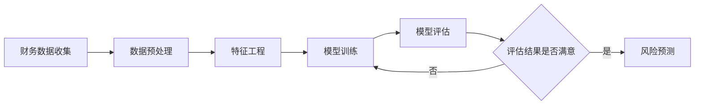

# AI辅助识别隐藏的财务风险

> 关键词：AI、财务风险识别、机器学习、数据分析、风险预测、深度学习、金融科技

> 摘要：本文围绕AI辅助识别隐藏的财务风险展开，深入探讨了其核心概念、算法原理、数学模型等关键内容。详细介绍了如何利用AI技术从海量财务数据中挖掘潜在风险，通过Python代码阐述了具体实现过程，并结合实际项目案例进行详细解释。同时，分析了该技术在不同场景下的应用，推荐了相关的学习资源、开发工具和论文著作。最后，对AI辅助识别财务风险的未来发展趋势与挑战进行了总结，为读者全面了解这一领域提供了系统而深入的参考。

## 1. 背景介绍 
### 1.1 目的和范围
在当今复杂多变的经济环境中，企业面临着各种各样的财务风险，这些风险可能隐藏在大量的财务数据之中，传统的财务风险识别方法往往难以全面、及时地发现这些隐藏的风险。AI辅助识别隐藏的财务风险的目的在于利用先进的人工智能技术，从海量的财务数据中挖掘出潜在的风险因素，为企业的财务决策提供更准确、更及时的支持。

本文章的范围涵盖了AI辅助识别财务风险的核心概念、算法原理、数学模型、实际应用场景等方面，旨在为读者全面介绍这一领域的相关知识和技术。

### 1.2 预期读者
本文预期读者包括金融行业从业者，如财务分析师、风险管理人员、投资经理等，他们可以通过本文了解如何利用AI技术提升财务风险识别的能力；计算机科学领域的专业人员，如数据科学家、人工智能工程师等，他们可以从中获取关于将AI技术应用于财务领域的思路和方法；以及对金融科技感兴趣的研究人员和学生，帮助他们深入了解这一新兴领域的发展动态。

### 1.3 文档结构概述
本文将按照以下结构进行阐述：首先介绍AI辅助识别隐藏的财务风险的背景信息，包括目的、预期读者和文档结构概述等；接着阐述核心概念与联系，包括相关概念的原理和架构，并通过文本示意图和Mermaid流程图进行展示；然后详细讲解核心算法原理和具体操作步骤，同时使用Python源代码进行说明；再介绍数学模型和公式，并通过举例进行详细讲解；之后通过项目实战案例，介绍开发环境搭建、源代码实现和代码解读；随后分析实际应用场景；推荐相关的工具和资源；最后总结未来发展趋势与挑战，并提供常见问题与解答以及扩展阅读和参考资料。

### 1.4 术语表
#### 1.4.1 核心术语定义
- **AI（Artificial Intelligence）**：即人工智能，是研究、开发用于模拟、延伸和扩展人的智能的理论、方法、技术及应用系统的一门新的技术科学。
- **财务风险**：指企业在各项财务活动中由于各种难以预料和无法控制的因素，使企业在一定时期、一定范围内所获取的最终财务成果与预期的经营目标发生偏差，从而使企业蒙受经济损失或更大收益的可能性。
- **机器学习（Machine Learning）**：是一门多领域交叉学科，涉及概率论、统计学、逼近论、凸分析、算法复杂度理论等多门学科。它专门研究计算机怎样模拟或实现人类的学习行为，以获取新的知识或技能，重新组织已有的知识结构使之不断改善自身的性能。
- **深度学习（Deep Learning）**：是机器学习的一个分支领域，它是一种基于对数据进行表征学习的方法。深度学习通过构建具有很多层的神经网络模型，自动从大量数据中学习复杂的模式和特征。

#### 1.4.2 相关概念解释
- **数据挖掘**：从大量的数据中通过算法搜索隐藏于其中信息的过程。在财务风险识别中，数据挖掘可以帮助发现潜在的风险模式和规律。
- **特征工程**：是指对原始数据进行预处理、转换和选择，以提取出对模型有意义的特征的过程。在AI辅助识别财务风险中，特征工程对于提高模型的准确性和性能至关重要。
- **模型评估**：是指使用一定的评估指标和方法，对训练好的模型进行评估，以确定模型的性能和准确性。常见的评估指标包括准确率、召回率、F1值等。

#### 1.4.3 缩略词列表
- **AI**：Artificial Intelligence（人工智能）
- **ML**：Machine Learning（机器学习）
- **DL**：Deep Learning（深度学习）
- **ROC**：Receiver Operating Characteristic（受试者工作特征曲线）
- **AUC**：Area Under the Curve（曲线下面积）

## 2. 核心概念与联系 
### 核心概念原理
AI辅助识别隐藏的财务风险主要基于机器学习和深度学习技术。其基本原理是通过收集大量的财务数据，包括企业的财务报表、交易记录、市场数据等，对这些数据进行预处理和特征工程，提取出有价值的特征。然后使用机器学习或深度学习算法对这些特征进行建模，训练出能够识别财务风险的模型。最后，使用训练好的模型对新的财务数据进行预测，判断是否存在隐藏的财务风险。

### 架构的文本示意图
```plaintext
财务数据收集 -> 数据预处理 -> 特征工程 -> 模型训练 -> 模型评估 -> 风险预测
```

### Mermaid流程图


## 3. 核心算法原理 & 具体操作步骤 （算法原理讲解必须使用Python源代码来详细阐述）
### 核心算法原理
在AI辅助识别隐藏的财务风险中，常用的算法包括逻辑回归、决策树、随机森林、支持向量机和深度学习中的神经网络等。下面以逻辑回归算法为例进行详细讲解。

逻辑回归是一种广义线性模型，用于处理二分类问题。在财务风险识别中，我们可以将财务风险分为有风险和无风险两类，使用逻辑回归模型对财务数据进行分类预测。逻辑回归的基本原理是通过一个逻辑函数（也称为Sigmoid函数）将线性回归的结果映射到[0, 1]区间，从而得到一个概率值。

逻辑回归的数学模型可以表示为：

$$P(y = 1|x) = \frac{1}{1 + e^{-(w^T x + b)}}$$

其中，$P(y = 1|x)$ 表示在输入特征 $x$ 的条件下，样本属于正类（有风险）的概率；$w$ 是权重向量，$b$ 是偏置项。

### 具体操作步骤
#### 1. 数据收集
首先，我们需要收集相关的财务数据，包括企业的财务报表、交易记录等。假设我们已经收集到了一个包含多个特征和标签的数据集，存储在一个CSV文件中。

#### 2. 数据预处理
对收集到的数据进行预处理，包括数据清洗、缺失值处理、数据标准化等操作。

```python
import pandas as pd
from sklearn.preprocessing import StandardScaler
from sklearn.model_selection import train_test_split

# 读取数据
data = pd.read_csv('financial_data.csv')

# 分离特征和标签
X = data.drop('risk_label', axis=1)
y = data['risk_label']

# 处理缺失值
X = X.fillna(X.mean())

# 数据标准化
scaler = StandardScaler()
X_scaled = scaler.fit_transform(X)

# 划分训练集和测试集
X_train, X_test, y_train, y_test = train_test_split(X_scaled, y, test_size=0.2, random_state=42)
```

#### 3. 模型训练
使用逻辑回归模型对训练数据进行训练。

```python
from sklearn.linear_model import LogisticRegression

# 创建逻辑回归模型
model = LogisticRegression()

# 训练模型
model.fit(X_train, y_train)
```

#### 4. 模型评估
使用测试数据对训练好的模型进行评估，计算评估指标。

```python
from sklearn.metrics import accuracy_score, recall_score, f1_score

# 预测测试集
y_pred = model.predict(X_test)

# 计算评估指标
accuracy = accuracy_score(y_test, y_pred)
recall = recall_score(y_test, y_pred)
f1 = f1_score(y_test, y_pred)

print(f'Accuracy: {accuracy}')
print(f'Recall: {recall}')
print(f'F1 Score: {f1}')
```

#### 5. 风险预测
使用训练好的模型对新的财务数据进行风险预测。

```python
# 假设我们有一个新的财务数据样本
new_data = pd.DataFrame({
    'feature1': [1.2],
    'feature2': [2.3],
    # 其他特征...
})

# 数据预处理
new_data_scaled = scaler.transform(new_data)

# 预测风险
risk_prediction = model.predict(new_data_scaled)

print(f'Risk prediction: {risk_prediction}')
```

## 4. 数学模型和公式 & 详细讲解 & 举例说明 
### 逻辑回归的数学模型
逻辑回归的数学模型基于逻辑函数（Sigmoid函数），其表达式为：

$$\sigma(z) = \frac{1}{1 + e^{-z}}$$

其中，$z = w^T x + b$ 是线性组合，$w$ 是权重向量，$b$ 是偏置项，$x$ 是输入特征向量。

Sigmoid函数的图像是一个S形曲线，其取值范围在[0, 1]之间。当 $z$ 趋近于正无穷时，$\sigma(z)$ 趋近于1；当 $z$ 趋近于负无穷时，$\sigma(z)$ 趋近于0。

在逻辑回归中，我们将线性组合 $z$ 输入到Sigmoid函数中，得到一个概率值 $P(y = 1|x)$，表示在输入特征 $x$ 的条件下，样本属于正类（有风险）的概率。

### 损失函数
逻辑回归使用对数损失函数（也称为交叉熵损失函数）来衡量模型的预测结果与真实标签之间的差异。对数损失函数的表达式为：

$$L(w, b) = -\frac{1}{N} \sum_{i=1}^{N} [y_i \log(P(y_i = 1|x_i)) + (1 - y_i) \log(1 - P(y_i = 1|x_i))]$$

其中，$N$ 是样本数量，$y_i$ 是第 $i$ 个样本的真实标签，$P(y_i = 1|x_i)$ 是第 $i$ 个样本属于正类的预测概率。

### 优化算法
为了最小化损失函数 $L(w, b)$，我们需要使用优化算法来更新权重向量 $w$ 和偏置项 $b$。常用的优化算法包括梯度下降法、随机梯度下降法等。

梯度下降法的更新公式为：

$$w = w - \alpha \frac{\partial L(w, b)}{\partial w}$$

$$b = b - \alpha \frac{\partial L(w, b)}{\partial b}$$

其中，$\alpha$ 是学习率，控制每次更新的步长。

### 举例说明
假设我们有一个简单的二分类问题，只有一个特征 $x$，真实标签 $y$ 为0或1。我们的逻辑回归模型可以表示为：

$$P(y = 1|x) = \frac{1}{1 + e^{-(w x + b)}}$$

假设我们的训练数据如下：

| $x$ | $y$ |
| --- | --- |
| 1   | 1   |
| 2   | 1   |
| 3   | 0   |
| 4   | 0   |

我们可以使用上述的步骤进行模型训练和预测。首先，我们初始化权重 $w$ 和偏置 $b$，然后使用梯度下降法不断更新 $w$ 和 $b$，直到损失函数收敛。最后，我们可以使用训练好的模型对新的样本进行预测。

## 5. 项目实战：代码实际案例和详细解释说明 
### 5.1  开发环境搭建
#### 安装Python
首先，我们需要安装Python环境。可以从Python官方网站（https://www.python.org/downloads/） 下载适合自己操作系统的Python版本，并按照安装向导进行安装。

#### 安装必要的库
在项目中，我们需要使用一些Python库，如Pandas、NumPy、Scikit-learn等。可以使用以下命令进行安装：

```bash
pip install pandas numpy scikit-learn
```

### 5.2  源代码详细实现和代码解读
```python
import pandas as pd
import numpy as np
from sklearn.preprocessing import StandardScaler
from sklearn.model_selection import train_test_split
from sklearn.linear_model import LogisticRegression
from sklearn.metrics import accuracy_score, recall_score, f1_score

# 读取数据
data = pd.read_csv('financial_data.csv')

# 分离特征和标签
X = data.drop('risk_label', axis=1)
y = data['risk_label']

# 处理缺失值
X = X.fillna(X.mean())

# 数据标准化
scaler = StandardScaler()
X_scaled = scaler.fit_transform(X)

# 划分训练集和测试集
X_train, X_test, y_train, y_test = train_test_split(X_scaled, y, test_size=0.2, random_state=42)

# 创建逻辑回归模型
model = LogisticRegression()

# 训练模型
model.fit(X_train, y_train)

# 预测测试集
y_pred = model.predict(X_test)

# 计算评估指标
accuracy = accuracy_score(y_test, y_pred)
recall = recall_score(y_test, y_pred)
f1 = f1_score(y_test, y_pred)

print(f'Accuracy: {accuracy}')
print(f'Recall: {recall}')
print(f'F1 Score: {f1}')

# 假设我们有一个新的财务数据样本
new_data = pd.DataFrame({
    'feature1': [1.2],
    'feature2': [2.3],
    # 其他特征...
})

# 数据预处理
new_data_scaled = scaler.transform(new_data)

# 预测风险
risk_prediction = model.predict(new_data_scaled)

print(f'Risk prediction: {risk_prediction}')
```

### 代码解读与分析
1. **数据读取**：使用 `pandas` 库的 `read_csv` 函数读取存储在CSV文件中的财务数据。
2. **特征和标签分离**：使用 `drop` 方法将标签列从数据集中分离出来，得到特征矩阵 $X$ 和标签向量 $y$。
3. **缺失值处理**：使用 `fillna` 方法将缺失值填充为该列的均值。
4. **数据标准化**：使用 `StandardScaler` 类对特征矩阵进行标准化处理，使得每个特征的均值为0，标准差为1。
5. **划分训练集和测试集**：使用 `train_test_split` 函数将数据集划分为训练集和测试集，其中测试集占比为20%。
6. **模型创建和训练**：使用 `LogisticRegression` 类创建逻辑回归模型，并使用 `fit` 方法对训练集进行训练。
7. **模型评估**：使用 `predict` 方法对测试集进行预测，然后使用 `accuracy_score`、`recall_score` 和 `f1_score` 函数计算评估指标。
8. **风险预测**：对新的财务数据样本进行预处理，然后使用训练好的模型进行风险预测。

## 6. 实际应用场景 
### 企业内部财务风险管理
企业可以利用AI辅助识别隐藏的财务风险，对自身的财务状况进行实时监控和预警。通过分析财务报表、现金流数据、成本数据等，及时发现潜在的财务风险，如资金链断裂、盈利能力下降等，并采取相应的措施进行防范和应对。

### 金融机构信贷风险评估
金融机构在进行信贷业务时，可以使用AI技术对借款人的财务状况进行评估，识别潜在的信贷风险。通过分析借款人的财务报表、信用记录、经营数据等，预测借款人的还款能力和违约概率，从而做出更准确的信贷决策。

### 投资决策支持
投资者在进行投资决策时，可以借助AI辅助识别隐藏的财务风险，对投资对象的财务状况进行深入分析。通过分析投资对象的财务报表、行业数据、市场趋势等，评估投资对象的投资价值和风险水平，从而做出更明智的投资决策。

### 监管机构风险监测
监管机构可以利用AI技术对金融市场和企业的财务风险进行监测，及时发现潜在的系统性风险。通过分析大量的金融数据和企业财务数据，建立风险预警模型，对市场和企业的风险状况进行实时监控和预警，保障金融市场的稳定运行。

## 7. 工具和资源推荐
### 7.1 学习资源推荐
#### 7.1.1 书籍推荐
- 《Python机器学习》：这本书详细介绍了Python在机器学习中的应用，包括数据预处理、特征工程、模型选择、模型评估等方面的内容，适合初学者入门。
- 《深度学习》：由深度学习领域的三位先驱Ian Goodfellow、Yoshua Bengio和Aaron Courville撰写，是深度学习领域的经典著作，全面介绍了深度学习的理论和实践。
- 《数据挖掘：概念与技术》：这本书系统地介绍了数据挖掘的基本概念、算法和应用，对于理解数据挖掘在财务风险识别中的应用有很大的帮助。

#### 7.1.2 在线课程
- Coursera上的《机器学习》课程：由斯坦福大学的Andrew Ng教授授课，是机器学习领域的经典课程，涵盖了机器学习的基本概念、算法和应用。
- edX上