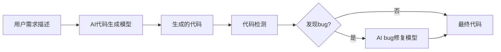

# AI辅助软件开发：代码生成与bug修复

> 关键词：AI辅助软件开发、代码生成、bug修复、人工智能、软件开发效率

> 摘要：本文围绕AI辅助软件开发中的代码生成与bug修复展开深入探讨。详细介绍了相关的核心概念、算法原理、数学模型，通过实际案例展示了其在项目中的应用，同时列举了可用于学习和开发的工具与资源。最后，对AI辅助软件开发的未来发展趋势和面临的挑战进行了总结，旨在为软件开发人员和相关研究者提供全面且深入的技术参考，以推动该领域的进一步发展。

## 1. 背景介绍 
### 1.1 目的和范围
随着软件开发的规模和复杂度不断增加，传统的开发方式面临着效率低下、容易出错等问题。AI辅助软件开发作为一种新兴的技术手段，为解决这些问题提供了新的思路和方法。本文的目的在于全面介绍AI辅助软件开发中代码生成与bug修复的相关技术，包括其核心概念、算法原理、实际应用等方面。范围涵盖了从理论基础到实际项目中的具体操作，旨在帮助读者深入理解并掌握这一领域的关键技术。

### 1.2 预期读者
本文预期读者包括软件开发人员、软件工程师、软件架构师、人工智能研究者以及对AI辅助软件开发感兴趣的技术爱好者。无论你是初学者想要了解该领域的基础知识，还是有一定经验的专业人士希望深入研究相关技术，本文都将为你提供有价值的信息。

### 1.3 文档结构概述
本文将按照以下结构进行组织：首先介绍相关的核心概念和它们之间的联系，通过文本示意图和Mermaid流程图进行直观展示；接着详细阐述核心算法原理，并使用Python源代码进行具体操作步骤的说明；然后介绍相关的数学模型和公式，并结合实际例子进行讲解；之后通过项目实战展示代码生成与bug修复在实际中的应用，包括开发环境搭建、源代码实现和代码解读；再介绍AI辅助软件开发在实际中的应用场景；随后推荐一些学习和开发过程中可用的工具和资源；最后对未来发展趋势和面临的挑战进行总结，并提供常见问题的解答和扩展阅读参考资料。

### 1.4 术语表
#### 1.4.1 核心术语定义
- **AI辅助软件开发**：利用人工智能技术为软件开发过程提供支持和帮助，包括代码生成、bug修复、代码优化等方面。
- **代码生成**：通过人工智能算法自动生成符合特定需求的代码。
- **bug修复**：利用人工智能技术检测和修复软件代码中的错误和缺陷。
- **深度学习**：一种基于人工神经网络的机器学习方法，在AI辅助软件开发中被广泛应用。
- **自然语言处理（NLP）**：使计算机能够理解和处理人类语言的技术，在代码生成中可用于将自然语言描述转换为代码。

#### 1.4.2 相关概念解释
- **机器学习**：让计算机通过数据和经验自动学习模式和规律的技术，是AI辅助软件开发的基础。
- **神经网络**：一种模仿人类神经系统的计算模型，在深度学习中用于处理复杂的数据和模式。
- **训练数据**：用于训练机器学习模型的数据集合，其质量和规模对模型的性能有重要影响。

#### 1.4.3 缩略词列表
- **AI**：Artificial Intelligence（人工智能）
- **NLP**：Natural Language Processing（自然语言处理）
- **API**：Application Programming Interface（应用程序编程接口）

## 2. 核心概念与联系 
### 核心概念原理
#### 代码生成
代码生成是AI辅助软件开发的重要功能之一。其基本原理是利用机器学习模型，特别是深度学习模型，学习大量的代码数据，从而掌握代码的语法、结构和语义信息。当接收到用户输入的需求描述（可以是自然语言或特定的代码模板）时，模型根据学习到的知识生成符合需求的代码。例如，一个基于Transformer架构的模型可以学习不同编程语言的代码模式，当用户输入“生成一个Python函数，用于计算两个数的和”，模型就可以生成相应的Python代码。

#### bug修复
bug修复则是利用AI技术检测和定位代码中的错误，并尝试自动修复。通常的做法是训练一个模型，使其能够识别常见的代码错误模式。当输入一段有错误的代码时，模型会分析代码的结构和语义，找出可能存在的错误，并根据预先学习的修复策略进行修复。例如，对于语法错误，模型可以根据编程语言的语法规则进行修正；对于逻辑错误，模型可以通过分析代码的执行流程和预期结果来尝试修复。

### 架构的文本示意图
```plaintext
用户需求描述（自然语言或代码模板）
        |
        v
AI代码生成模型
        |
        v
生成的代码
        |
        v
代码检测（bug检测模型）
        |
        v
发现bug
        |
        v
AI bug修复模型
        |
        v
修复后的代码
```

### Mermaid流程图


## 3. 核心算法原理 & 具体操作步骤 
### 代码生成算法原理
在代码生成中，常用的算法是基于Transformer架构的模型，如GPT（Generative Pretrained Transformer）系列。Transformer模型通过多头自注意力机制（Multi-Head Self-Attention）能够捕捉代码中的长距离依赖关系，从而更好地理解代码的语义。以下是一个简化的Python代码示例，展示如何使用Hugging Face的transformers库进行代码生成：

```python
from transformers import AutoTokenizer, AutoModelForCausalLM

# 加载预训练的代码生成模型和分词器
tokenizer = AutoTokenizer.from_pretrained("Salesforce/codegen-350M-mono")
model = AutoModelForCausalLM.from_pretrained("Salesforce/codegen-350M-mono")

# 定义用户需求描述
input_text = "生成一个Python函数，用于计算两个数的和"

# 对输入文本进行分词
input_ids = tokenizer(input_text, return_tensors="pt").input_ids

# 生成代码
output = model.generate(input_ids, max_length=100, num_beams=5, no_repeat_ngram_size=2, early_stopping=True)

# 解码生成的代码
generated_code = tokenizer.decode(output[0], skip_special_tokens=True)

print(generated_code)
```

### 代码解释
1. **加载模型和分词器**：使用`AutoTokenizer`和`AutoModelForCausalLM`从Hugging Face的模型库中加载预训练的代码生成模型和对应的分词器。
2. **定义输入文本**：将用户的需求描述作为输入文本。
3. **分词**：使用分词器将输入文本转换为模型可以处理的输入ID。
4. **代码生成**：调用模型的`generate`方法生成代码，通过设置一些参数（如`max_length`、`num_beams`等）来控制生成的代码长度和质量。
5. **解码**：使用分词器将生成的ID序列解码为可读的代码文本。

### bug修复算法原理
对于bug修复，一种常见的方法是使用基于机器学习的分类器来检测代码中的错误类型，然后根据错误类型应用相应的修复策略。以下是一个简单的示例，用于检测Python代码中的语法错误并尝试修复：

```python
import ast

def detect_and_fix_syntax_error(code):
    try:
        # 尝试解析代码
        ast.parse(code)
        return code  # 代码没有语法错误
    except SyntaxError as e:
        # 简单的修复策略：移除最后一个字符
        fixed_code = code.rstrip()[:-1]
        try:
            ast.parse(fixed_code)
            return fixed_code  # 修复成功
        except SyntaxError:
            return code  # 修复失败，返回原始代码

# 示例代码
buggy_code = "print('Hello, World!' "
fixed_code = detect_and_fix_syntax_error(buggy_code)
print(f"原始代码: {buggy_code}")
print(f"修复后的代码: {fixed_code}")
```

### 代码解释
1. **检测语法错误**：使用`ast.parse`函数尝试解析代码，如果解析失败则抛出`SyntaxError`异常。
2. **简单修复策略**：当检测到语法错误时，尝试移除代码的最后一个字符，然后再次尝试解析。
3. **返回结果**：如果修复成功，则返回修复后的代码；否则返回原始代码。

## 4. 数学模型和公式 & 详细讲解 & 举例说明 
### 代码生成中的数学模型
在基于Transformer的代码生成模型中，核心的数学模型是多头自注意力机制。多头自注意力机制可以表示为：

$$
\text{MultiHead}(Q, K, V) = \text{Concat}(\text{head}_1, \cdots, \text{head}_h)W^O
$$

其中，每个头 $\text{head}_i$ 可以表示为：

$$
\text{head}_i = \text{Attention}(QW_i^Q, KW_i^K, VW_i^V)
$$

而注意力函数 $\text{Attention}$ 定义为：

$$
\text{Attention}(Q, K, V) = \text{softmax}\left(\frac{QK^T}{\sqrt{d_k}}\right)V
$$

这里，$Q$、$K$、$V$ 分别是查询（Query）、键（Key）和值（Value）矩阵，$W_i^Q$、$W_i^K$、$W_i^V$ 是可学习的投影矩阵，$d_k$ 是键向量的维度，$W^O$ 是用于将多头输出拼接后的结果进行线性变换的矩阵。

### 详细讲解
多头自注意力机制通过多个头并行地计算注意力，使得模型能够捕捉不同位置之间的多种依赖关系。具体来说，查询矩阵 $Q$ 用于衡量每个位置与其他位置的相关性，键矩阵 $K$ 用于提供每个位置的特征表示，值矩阵 $V$ 则用于根据相关性加权求和得到输出。通过将输入的序列分别投影到不同的子空间中进行注意力计算，然后将结果拼接并进行线性变换，模型可以学习到更丰富的语义信息。

### 举例说明
假设我们有一个长度为 $n$ 的输入序列，每个位置的特征向量维度为 $d$。查询矩阵 $Q$、键矩阵 $K$ 和值矩阵 $V$ 的形状分别为 $(n, d)$。在计算注意力时，首先计算 $QK^T$，得到一个 $(n, n)$ 的矩阵，表示每个位置与其他位置的相关性得分。然后将得分除以 $\sqrt{d_k}$ 进行缩放，以避免梯度消失或爆炸。接着使用 $\text{softmax}$ 函数将得分转换为概率分布，最后根据这个概率分布对值矩阵 $V$ 进行加权求和，得到每个位置的输出。

### bug修复中的数学模型
在bug修复中，常用的数学模型是分类器，如支持向量机（SVM）或决策树。以支持向量机为例，其目标是找到一个超平面，将不同类别的样本（如错误代码和正确代码）分隔开来。对于线性可分的情况，支持向量机的优化问题可以表示为：

$$
\min_{w, b} \frac{1}{2}||w||^2
$$

约束条件为：

$$
y_i(w^T x_i + b) \geq 1, \quad i = 1, \cdots, N
$$

其中，$w$ 是超平面的法向量，$b$ 是偏置项，$x_i$ 是样本特征向量，$y_i$ 是样本的类别标签（$+1$ 或 $-1$），$N$ 是样本数量。

### 详细讲解
支持向量机的目标是找到一个具有最大间隔的超平面，使得不同类别的样本能够被正确分隔。通过最小化 $||w||^2$，可以使得超平面的间隔最大，从而提高模型的泛化能力。约束条件确保了所有样本都被正确分类，并且距离超平面的距离不小于 1。

### 举例说明
假设我们有一个二维的样本数据集，其中一些样本属于正类，一些样本属于负类。支持向量机的任务就是找到一条直线（二维情况下的超平面），将这两类样本分隔开来。通过求解上述优化问题，可以得到最优的直线参数 $w$ 和 $b$，从而实现样本的分类。在bug修复中，可以将代码的特征向量作为输入，将代码是否存在错误作为类别标签，使用支持向量机进行训练和分类。

## 5. 项目实战：代码实际案例和详细解释说明 
### 5.1  开发环境搭建
#### 安装Python
首先需要安装Python，建议使用Python 3.7及以上版本。可以从Python官方网站（https://www.python.org/downloads/）下载并安装适合你操作系统的Python版本。

#### 创建虚拟环境
为了避免不同项目之间的依赖冲突，建议使用虚拟环境。可以使用`venv`模块创建虚拟环境：

```bash
python -m venv myenv
```

激活虚拟环境：
- 在Windows上：
```bash
myenv\Scripts\activate
```
- 在Linux和Mac上：
```bash
source myenv/bin/activate
```

#### 安装必要的库
安装Hugging Face的`transformers`库、`torch`库以及其他可能需要的库：

```bash
pip install transformers torch
```

### 5.2  源代码详细实现和代码解读
#### 代码生成项目
以下是一个完整的代码生成项目示例，用于生成Python函数：

```python
from transformers import AutoTokenizer, AutoModelForCausalLM

# 加载预训练的代码生成模型和分词器
tokenizer = AutoTokenizer.from_pretrained("Salesforce/codegen-350M-mono")
model = AutoModelForCausalLM.from_pretrained("Salesforce/codegen-350M-mono")

def generate_python_function(description):
    # 对输入描述进行分词
    input_ids = tokenizer(description, return_tensors="pt").input_ids
    
    # 生成代码
    output = model.generate(input_ids, max_length=200, num_beams=5, no_repeat_ngram_size=2, early_stopping=True)
    
    # 解码生成的代码
    generated_code = tokenizer.decode(output[0], skip_special_tokens=True)
    
    return generated_code

# 示例需求描述
description = "生成一个Python函数，用于计算两个数的乘积"
generated_function = generate_python_function(description)
print(generated_function)
```

#### 代码解读
1. **加载模型和分词器**：从Hugging Face的模型库中加载预训练的代码生成模型和对应的分词器。
2. **定义生成函数**：`generate_python_function`函数接受一个需求描述作为输入，对其进行分词，然后调用模型的`generate`方法生成代码，最后将生成的ID序列解码为可读的代码文本。
3. **示例调用**：定义一个示例需求描述，调用`generate_python_function`函数生成代码并打印输出。

#### bug修复项目
以下是一个简单的bug修复项目示例，用于检测和修复Python代码中的语法错误：

```python
import ast

def detect_and_fix_syntax_error(code):
    try:
        # 尝试解析代码
        ast.parse(code)
        return code  # 代码没有语法错误
    except SyntaxError as e:
        # 简单的修复策略：移除最后一个字符
        fixed_code = code.rstrip()[:-1]
        try:
            ast.parse(fixed_code)
            return fixed_code  # 修复成功
        except SyntaxError:
            return code  # 修复失败，返回原始代码

# 示例代码
buggy_code = "print('Hello, World!' "
fixed_code = detect_and_fix_syntax_error(buggy_code)
print(f"原始代码: {buggy_code}")
print(f"修复后的代码: {fixed_code}")
```

#### 代码解读
1. **检测语法错误**：使用`ast.parse`函数尝试解析代码，如果解析失败则抛出`SyntaxError`异常。
2. **简单修复策略**：当检测到语法错误时，尝试移除代码的最后一个字符，然后再次尝试解析。
3. **返回结果**：如果修复成功，则返回修复后的代码；否则返回原始代码。

### 5.3  代码解读与分析
#### 代码生成项目分析
- **优点**：使用预训练的模型可以快速生成符合需求的代码，减少了开发人员的手动编码工作量。通过调整生成参数（如`max_length`、`num_beams`等）可以控制生成代码的长度和质量。
- **缺点**：生成的代码可能存在逻辑错误或不符合特定的编码规范，需要开发人员进行进一步的检查和修改。此外，模型的性能受到训练数据的影响，如果训练数据不全面，可能无法生成高质量的代码。

#### bug修复项目分析
- **优点**：简单的修复策略可以快速修复一些常见的语法错误，提高代码的质量和可维护性。使用`ast`模块可以方便地检测代码中的语法错误。
- **缺点**：简单的修复策略可能无法处理复杂的逻辑错误，对于一些深层次的错误可能无法修复。此外，修复策略的有效性依赖于对错误类型的准确识别，如果识别不准确，可能会导致修复失败。

## 6. 实际应用场景 
### 快速原型开发
在软件开发的早期阶段，需要快速验证想法和概念。AI辅助代码生成可以帮助开发人员快速生成初始代码，搭建起软件的基本框架，从而节省时间和精力。例如，在开发一个Web应用时，可以使用AI生成前端页面的基本布局和后端接口的代码，然后在此基础上进行进一步的开发和优化。

### 代码补全和建议
在编写代码的过程中，AI可以根据上下文和已有的代码片段提供代码补全和建议。例如，当开发人员输入一个函数名时，AI可以自动补全函数的参数列表和代码块，或者提供一些可能的实现思路。这可以提高开发效率，减少代码错误。

### bug修复和代码优化
在软件测试和维护阶段，AI可以帮助检测和修复代码中的错误。通过分析代码的结构和执行结果，AI可以定位到可能存在的bug，并提供修复建议。此外，AI还可以对代码进行优化，提高代码的性能和可读性。例如，将一些复杂的嵌套循环优化为更简洁的代码形式。

### 跨语言开发
对于需要在不同编程语言之间进行开发的项目，AI可以帮助开发人员快速生成不同语言的代码。例如，将一个Python脚本转换为Java代码，或者将一个JavaScript函数转换为C#代码。这可以降低开发人员的学习成本，提高开发效率。

## 7. 工具和资源推荐
### 7.1 学习资源推荐
#### 7.1.1 书籍推荐
- 《深度学习》（Deep Learning）：由Ian Goodfellow、Yoshua Bengio和Aaron Courville所著，是深度学习领域的经典教材，介绍了深度学习的基本原理、算法和应用。
- 《Python机器学习》（Python Machine Learning）：由Sebastian Raschka所著，详细介绍了使用Python进行机器学习的方法和技术，包括数据预处理、模型选择、评估等方面。
- 《自然语言处理入门》（Natural Language Processing with Python）：由Steven Bird、Ewan Klein和Edward Loper所著，适合初学者学习自然语言处理的基本概念和技术。

#### 7.1.2 在线课程
- Coursera上的“深度学习专项课程”（Deep Learning Specialization）：由Andrew Ng教授讲授，涵盖了深度学习的各个方面，包括神经网络、卷积神经网络、循环神经网络等。
- edX上的“人工智能基础”（Introduction to Artificial Intelligence）：由麻省理工学院（MIT）提供，介绍了人工智能的基本概念、算法和应用。
- Udemy上的“Python深度学习实战”（Deep Learning with Python）：通过实际项目介绍了如何使用Python和深度学习框架进行开发。

#### 7.1.3 技术博客和网站
- Medium：有许多关于AI和软件开发的技术博客，如Towards Data Science、The Startup等，提供了最新的技术文章和案例分析。
- Hacker News：是一个技术社区，汇聚了大量的技术新闻和讨论，对于了解行业动态和最新技术趋势很有帮助。
- GitHub：是全球最大的开源代码托管平台，可以找到许多与AI辅助软件开发相关的开源项目和代码示例。

### 7.2 开发工具框架推荐
#### 7.2.1 IDE和编辑器
- PyCharm：是一款专业的Python集成开发环境（IDE），提供了代码编辑、调试、版本控制等功能，支持多种Python库和框架。
- Visual Studio Code：是一款轻量级的代码编辑器，具有丰富的插件生态系统，可以通过安装插件支持各种编程语言和开发场景。
- Jupyter Notebook：是一个交互式的开发环境，适合进行数据探索、模型训练和代码演示，支持Python、R等多种编程语言。

#### 7.2.2 调试和性能分析工具
- PDB：是Python自带的调试器，可以帮助开发人员定位代码中的错误和问题。
- cProfile：是Python的性能分析工具，可以分析代码的运行时间和函数调用情况，帮助开发人员优化代码性能。
- TensorBoard：是TensorFlow的可视化工具，可以用于可视化模型的训练过程、损失函数变化等信息。

#### 7.2.3 相关框架和库
- Transformers：是Hugging Face开发的一个用于自然语言处理的库，提供了多种预训练的模型和工具，方便进行代码生成、文本分类等任务。
- PyTorch：是一个开源的深度学习框架，具有动态计算图的特点，易于使用和调试，广泛应用于AI辅助软件开发中。
- scikit-learn：是一个用于机器学习的Python库，提供了多种机器学习算法和工具，如分类、回归、聚类等。

### 7.3 相关论文著作推荐
#### 7.3.1 经典论文
- “Attention Is All You Need”：提出了Transformer架构，是自然语言处理领域的重要突破，为后续的代码生成和语言模型研究奠定了基础。
- “Generative Adversarial Nets”：介绍了生成对抗网络（GAN）的概念，GAN在代码生成和图像生成等领域有广泛的应用。
- “A Neural Algorithm of Artistic Style”：提出了一种基于神经网络的艺术风格迁移算法，展示了深度学习在艺术创作和图像处理中的应用。

#### 7.3.2 最新研究成果
- 在arXiv上可以找到许多关于AI辅助软件开发的最新研究论文，如关于代码生成模型的改进、bug修复算法的优化等方面的研究。
- 每年的顶级学术会议（如NeurIPS、ICML、ACL等）上也会有相关的研究成果发表，可以关注这些会议的论文集。

#### 7.3.3 应用案例分析
- 一些知名科技公司（如Google、Microsoft、Facebook等）会在其技术博客上分享AI辅助软件开发的应用案例和经验，这些案例可以为实际项目提供参考。
- 一些开源项目的文档和README文件中也会包含项目的应用场景和实现细节，可以通过研究这些项目来学习如何将AI技术应用到软件开发中。

## 8. 总结：未来发展趋势与挑战
### 未来发展趋势
#### 更强大的代码生成能力
随着深度学习技术的不断发展，未来的AI代码生成模型将能够生成更加复杂、高质量的代码。模型将能够更好地理解用户的需求，生成符合特定业务逻辑和编码规范的代码，甚至可以自动生成整个软件系统的代码框架。

#### 智能化的bug修复
未来的AI bug修复系统将变得更加智能化。不仅能够检测和修复常见的语法错误和逻辑错误，还能够处理更复杂的错误类型，如并发问题、性能瓶颈等。通过结合静态代码分析、动态调试和机器学习技术，bug修复系统将能够更准确地定位和修复错误。

#### 与软件开发流程的深度融合
AI辅助软件开发将与现有的软件开发流程（如敏捷开发、DevOps等）深度融合。在需求分析、设计、编码、测试、部署等各个阶段，AI都将发挥重要作用，提高软件开发的效率和质量。例如，在需求分析阶段，AI可以帮助将自然语言需求转换为形式化的需求规格；在测试阶段，AI可以自动生成测试用例，提高测试覆盖率。

#### 跨领域的应用拓展
AI辅助软件开发将不仅仅局限于传统的软件开发领域，还将拓展到其他领域，如物联网、医疗、金融等。在这些领域中，AI可以帮助开发人员快速开发出适应特定场景的软件系统，提高行业的数字化水平。

### 面临的挑战
#### 数据质量和隐私问题
AI模型的性能很大程度上依赖于训练数据的质量和规模。在代码生成和bug修复中，需要大量的高质量代码数据进行训练。然而，获取和标注这些数据面临着版权、隐私等问题。此外，如何保证训练数据的多样性和代表性也是一个挑战。

#### 模型可解释性
深度学习模型通常是黑盒模型，难以解释其决策过程和结果。在AI辅助软件开发中，模型的可解释性尤为重要。开发人员需要了解模型为什么生成这样的代码或提出这样的修复建议，以便进行进一步的检查和修改。因此，如何提高模型的可解释性是一个亟待解决的问题。

#### 技术门槛和人才短缺
AI辅助软件开发需要开发人员具备一定的人工智能和机器学习知识。然而，目前这方面的专业人才相对短缺，许多开发人员对AI技术的了解还不够深入。如何降低技术门槛，让更多的开发人员能够使用AI辅助软件开发工具，是推动该领域发展的关键。

#### 安全和可靠性问题
在软件开发中，安全和可靠性是至关重要的。AI生成的代码和修复建议可能存在安全漏洞和可靠性问题。例如，生成的代码可能存在逻辑错误或安全隐患，修复建议可能会引入新的问题。因此，如何确保AI辅助软件开发的安全性和可靠性是一个需要重视的问题。

## 9. 附录：常见问题与解答
### 1. AI生成的代码质量如何保证？
AI生成的代码质量受到多种因素的影响，如训练数据的质量、模型的性能、生成参数的设置等。为了保证代码质量，可以采取以下措施：
- 使用高质量的训练数据，确保数据的多样性和代表性。
- 选择性能较好的模型，并根据具体任务进行微调。
- 对生成的代码进行人工检查和测试，发现并修正其中的错误和问题。
- 结合代码审查和静态代码分析工具，对生成的代码进行质量评估。

### 2. AI能否完全替代开发人员进行软件开发？
目前来看，AI还不能完全替代开发人员进行软件开发。虽然AI在代码生成和bug修复方面可以提供很大的帮助，但软件开发不仅仅是代码编写，还涉及到需求分析、设计、测试、维护等多个环节。开发人员需要具备丰富的业务知识、设计能力和问题解决能力，这些是AI目前还无法具备的。AI更像是开发人员的辅助工具，可以提高开发效率和质量，但不能替代开发人员的创造性思维和决策能力。

### 3. 如何选择适合的AI模型进行代码生成和bug修复？
选择适合的AI模型需要考虑以下因素：
- 任务类型：不同的任务可能需要不同类型的模型。例如，对于代码生成任务，可以选择基于Transformer架构的模型；对于bug修复任务，可以选择分类器或基于规则的模型。
- 数据规模和质量：如果有大量的高质量数据，可以选择复杂的深度学习模型；如果数据规模较小，可以选择简单的机器学习模型。
- 模型性能和可解释性：需要在模型性能和可解释性之间进行权衡。一些复杂的深度学习模型性能较好，但可解释性较差；而一些简单的机器学习模型可解释性较强，但性能可能相对较低。

### 4. AI辅助软件开发是否会导致开发人员失业？
AI辅助软件开发不会导致开发人员失业，反而会为开发人员带来更多的机会和挑战。AI可以帮助开发人员完成一些重复性、繁琐的工作，让开发人员有更多的时间和精力投入到更有创造性和挑战性的工作中，如系统设计、架构优化、业务创新等。此外，随着AI技术的发展，也会催生一些新的职业和岗位，如AI算法工程师、AI软件开发工程师等。因此，开发人员需要不断学习和提升自己的技能，适应技术的发展变化。

## 10. 扩展阅读 & 参考资料
### 扩展阅读
- 《人工智能：现代方法》（Artificial Intelligence: A Modern Approach）：全面介绍了人工智能的基本概念、算法和应用，是人工智能领域的经典教材。
- 《代码大全》（Code Complete）：介绍了软件开发的最佳实践和方法，对于提高代码质量和开发效率有很大的帮助。
- 《敏捷软件开发：原则、模式与实践》（Agile Software Development: Principles, Patterns, and Practices）：介绍了敏捷开发的原则和方法，对于理解软件开发流程和团队协作有重要的指导意义。

### 参考资料
- Hugging Face官方文档：https://huggingface.co/docs
- PyTorch官方文档：https://pytorch.org/docs/stable/index.html
- scikit-learn官方文档：https://scikit-learn.org/stable/documentation.html

作者：AI天才研究院/AI Genius Institute & 禅与计算机程序设计艺术 /Zen And The Art of Computer Programming