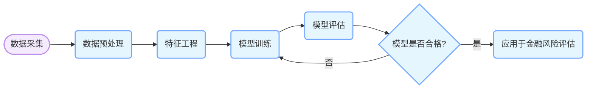

# AI辅助金融风险评估：从信用评分到市场预测

> 关键词：AI、金融风险评估、信用评分、市场预测、机器学习

> 摘要：本文围绕AI辅助金融风险评估展开，深入探讨了从信用评分到市场预测的全过程。首先介绍了相关背景知识，包括目的、预期读者等内容。接着详细阐述了核心概念、算法原理、数学模型等关键要素，并结合Python代码进行了具体说明。通过项目实战案例，展示了如何运用AI技术进行金融风险评估。同时分析了实际应用场景，推荐了学习所需的工具和资源。最后对未来发展趋势与挑战进行了总结，还给出了常见问题解答和扩展阅读参考资料，旨在为读者全面呈现AI在金融风险评估领域的应用与发展。

## 1. 背景介绍 
### 1.1 目的和范围
金融行业一直面临着各种风险，准确评估这些风险对于金融机构的稳定运营和投资者的决策至关重要。传统的金融风险评估方法在处理海量数据和复杂关系时存在一定的局限性。随着人工智能技术的快速发展，其在金融风险评估领域展现出了巨大的潜力。本文的目的在于深入探讨AI如何辅助金融风险评估，从信用评分这一基础环节入手，逐步拓展到市场预测，全面介绍相关的技术原理、实际应用和未来发展趋势。范围涵盖了信用评分模型的构建、市场预测算法的选择以及AI在金融风险评估中的各种应用场景。

### 1.2 预期读者
本文预期读者包括金融行业从业者，如银行信贷员、金融分析师、风险管理人员等，他们可以从中了解如何运用AI技术提升金融风险评估的准确性和效率；计算机专业人员，特别是对人工智能和机器学习在金融领域应用感兴趣的开发者和研究人员，能获取相关的技术实现细节和应用案例；高校相关专业的学生，为他们提供了一个将理论知识与实际金融应用相结合的学习参考。

### 1.3 文档结构概述
本文将按照以下结构展开：首先介绍背景知识，让读者对AI辅助金融风险评估有一个初步的认识；接着阐述核心概念与联系，包括相关概念的原理和架构，并通过示意图和流程图进行直观展示；然后详细讲解核心算法原理和具体操作步骤，结合Python代码进行说明；之后介绍数学模型和公式，并举例说明其应用；通过项目实战，给出实际案例和代码详细解释；分析实际应用场景，展示AI在金融风险评估中的具体应用；推荐学习所需的工具和资源；最后总结未来发展趋势与挑战，给出常见问题解答和扩展阅读参考资料。

### 1.4 术语表
#### 1.4.1 核心术语定义
- **金融风险评估**：指对金融活动中可能面临的各种风险进行识别、衡量和评价的过程，目的是为了采取相应的措施来降低风险损失。
- **信用评分**：是一种基于借款人的信用历史、财务状况等因素，对其信用风险进行量化评估的方法，通常用一个分数来表示借款人的信用程度。
- **市场预测**：运用各种分析方法和技术，对金融市场的未来走势、价格波动等进行预测，为投资者和金融机构提供决策依据。
- **人工智能（AI）**：是一门研究如何使计算机系统能够模拟人类智能的学科，包括机器学习、深度学习、自然语言处理等多个领域。
- **机器学习**：是人工智能的一个分支，它通过让计算机从数据中学习模式和规律，从而实现对未知数据的预测和分类等任务。

#### 1.4.2 相关概念解释
- **特征工程**：在机器学习中，特征工程是指从原始数据中提取和选择有价值的特征，以提高模型的性能。在金融风险评估中，特征工程包括对客户的基本信息、交易记录等数据进行处理和转换，提取出与风险相关的特征。
- **模型评估**：是指使用一组评估指标来衡量模型的性能，常见的评估指标包括准确率、召回率、F1值、均方误差等。在金融风险评估中，模型评估用于判断模型对风险的预测能力和准确性。
- **过拟合**：是指模型在训练数据上表现良好，但在测试数据上表现不佳的现象。过拟合通常是由于模型过于复杂，学习了训练数据中的噪声和随机波动，而没有学习到数据的真实规律。

#### 1.4.3 缩略词列表
- **AI**：Artificial Intelligence，人工智能
- **ML**：Machine Learning，机器学习
- **DL**：Deep Learning，深度学习
- **ROC**：Receiver Operating Characteristic，受试者工作特征曲线
- **AUC**：Area Under the Curve，曲线下面积

## 2. 核心概念与联系 

### 核心概念原理
#### 信用评分
信用评分的基本原理是基于借款人的历史信用数据和其他相关信息，构建一个数学模型来预测其未来违约的可能性。常用的信用评分模型包括逻辑回归模型、决策树模型、随机森林模型等。这些模型通过对大量的历史数据进行训练，学习到借款人的特征与违约风险之间的关系，从而对新的借款人进行信用评分。

#### 市场预测
市场预测是基于金融市场的历史数据和相关的宏观经济信息，运用各种分析方法和技术来预测市场的未来走势。常见的市场预测方法包括时间序列分析、机器学习算法、深度学习算法等。时间序列分析通过对市场数据的时间序列进行建模，预测未来的市场趋势；机器学习和深度学习算法则通过对大量的市场数据进行学习，挖掘数据中的模式和规律，从而实现对市场的预测。

### 架构的文本示意图
```plaintext
金融风险评估系统
|-- 数据采集层
|   |-- 信用数据（个人信息、信用历史等）
|   |-- 市场数据（股票价格、利率等）
|   |-- 宏观经济数据（GDP、通货膨胀率等）
|-- 数据预处理层
|   |-- 数据清洗（去除噪声、缺失值处理等）
|   |-- 特征工程（特征提取、特征选择等）
|-- 模型训练层
|   |-- 信用评分模型（逻辑回归、随机森林等）
|   |-- 市场预测模型（时间序列分析、深度学习等）
|-- 模型评估层
|   |-- 评估指标（准确率、召回率、均方误差等）
|-- 应用层
|   |-- 信贷决策
|   |-- 投资决策
```

### Mermaid 流程图


## 3. 核心算法原理 & 具体操作步骤 

### 逻辑回归算法原理
逻辑回归是一种常用的分类算法，在信用评分中广泛应用。它的基本原理是通过对输入特征进行线性组合，然后将线性组合的结果通过一个逻辑函数（也称为Sigmoid函数）映射到[0, 1]区间，得到一个概率值。这个概率值表示样本属于正类（如违约）的概率。

逻辑回归的数学表达式为：
$$P(y = 1|x) = \frac{1}{1 + e^{-(w_0 + w_1x_1 + w_2x_2 + \cdots + w_nx_n)}}$$
其中，$P(y = 1|x)$ 表示样本 $x$ 属于正类的概率，$w_0, w_1, w_2, \cdots, w_n$ 是模型的参数，$x_1, x_2, \cdots, x_n$ 是样本的特征。

### 具体操作步骤
#### 数据准备
首先需要收集和整理信用评分所需的数据，包括借款人的基本信息、信用历史、财务状况等。然后对数据进行清洗和预处理，去除噪声和缺失值，将数据转换为适合模型输入的格式。

#### 特征工程
从原始数据中提取和选择有价值的特征，例如借款人的年龄、收入、负债情况等。可以使用统计方法、机器学习算法等进行特征选择，以提高模型的性能。

#### 模型训练
使用训练数据对逻辑回归模型进行训练，通过最小化损失函数来估计模型的参数。常用的损失函数是对数损失函数，其表达式为：
$$L(w) = -\frac{1}{N}\sum_{i = 1}^{N}[y_i\log(P(y_i = 1|x_i)) + (1 - y_i)\log(1 - P(y_i = 1|x_i))]$$
其中，$N$ 是样本数量，$y_i$ 是样本 $i$ 的真实标签，$P(y_i = 1|x_i)$ 是样本 $i$ 属于正类的预测概率。

#### 模型评估
使用测试数据对训练好的模型进行评估，计算评估指标，如准确率、召回率、F1值等。根据评估结果对模型进行调整和优化。

### Python源代码实现
```python
import numpy as np
from sklearn.linear_model import LogisticRegression
from sklearn.model_selection import train_test_split
from sklearn.metrics import accuracy_score

# 生成示例数据
X = np.random.randn(100, 5)  # 特征矩阵
y = np.random.randint(0, 2, 100)  # 标签向量

# 划分训练集和测试集
X_train, X_test, y_train, y_test = train_test_split(X, y, test_size=0.2, random_state=42)

# 创建逻辑回归模型
model = LogisticRegression()

# 训练模型
model.fit(X_train, y_train)

# 预测
y_pred = model.predict(X_test)

# 评估模型
accuracy = accuracy_score(y_test, y_pred)
print(f"模型准确率: {accuracy}")
```

## 4. 数学模型和公式 & 详细讲解 & 举例说明 

### 逻辑回归模型的数学推导
逻辑回归模型的目标是找到一组参数 $w$，使得模型对训练数据的似然函数最大。似然函数表示在给定参数 $w$ 的情况下，训练数据出现的概率。对于二分类问题，似然函数可以表示为：
$$L(w) = \prod_{i = 1}^{N}[P(y_i = 1|x_i)^{y_i}(1 - P(y_i = 1|x_i))^{1 - y_i}]$$
为了方便计算，通常对似然函数取对数，得到对数似然函数：
$$\log L(w) = \sum_{i = 1}^{N}[y_i\log(P(y_i = 1|x_i)) + (1 - y_i)\log(1 - P(y_i = 1|x_i))]$$
逻辑回归模型通过最大化对数似然函数来估计参数 $w$。通常使用梯度下降法来求解这个优化问题，梯度下降法的更新公式为：
$$w_{j} = w_{j} + \alpha\frac{\partial\log L(w)}{\partial w_{j}}$$
其中，$\alpha$ 是学习率，$\frac{\partial\log L(w)}{\partial w_{j}}$ 是对数似然函数关于参数 $w_j$ 的偏导数。

### 举例说明
假设我们有一个简单的信用评分问题，特征包括借款人的年龄 $x_1$ 和收入 $x_2$，我们要预测借款人是否会违约（违约为1，不违约为0）。逻辑回归模型的表达式为：
$$P(y = 1|x) = \frac{1}{1 + e^{-(w_0 + w_1x_1 + w_2x_2)}}$$
假设我们通过训练得到模型的参数 $w_0 = -0.5$，$w_1 = 0.1$，$w_2 = 0.2$。现在有一个借款人，年龄为30岁，收入为5000元，我们可以计算他违约的概率：
$$P(y = 1|x) = \frac{1}{1 + e^{-(-0.5 + 0.1\times30 + 0.2\times5000)}}$$
通过计算得到 $P(y = 1|x)$ 的值，根据这个概率值我们可以做出信贷决策。

## 5. 项目实战：代码实际案例和详细解释说明 

### 5.1  开发环境搭建
#### 操作系统
可以选择Windows、Linux或Mac OS等操作系统。建议使用Linux系统，因为它在数据处理和机器学习开发方面具有良好的稳定性和性能。

#### Python环境
安装Python 3.x版本，可以使用Anaconda来管理Python环境。Anaconda是一个开源的Python发行版本，包含了许多常用的科学计算和机器学习库。

#### 安装必要的库
使用以下命令安装必要的Python库：
```bash
pip install numpy pandas scikit-learn matplotlib seaborn
```

### 5.2  源代码详细实现和代码解读
#### 数据加载和预处理
```python
import pandas as pd
from sklearn.preprocessing import StandardScaler
from sklearn.model_selection import train_test_split

# 加载数据
data = pd.read_csv('credit_data.csv')

# 分离特征和标签
X = data.drop('default', axis=1)
y = data['default']

# 数据标准化
scaler = StandardScaler()
X_scaled = scaler.fit_transform(X)

# 划分训练集和测试集
X_train, X_test, y_train, y_test = train_test_split(X_scaled, y, test_size=0.2, random_state=42)
```
代码解读：
- 首先使用 `pandas` 库加载信用评分数据。
- 然后将特征和标签分离，`X` 表示特征矩阵，`y` 表示标签向量。
- 使用 `StandardScaler` 对特征数据进行标准化处理，使特征数据具有零均值和单位方差。
- 最后使用 `train_test_split` 函数将数据划分为训练集和测试集，测试集占总数据的20%。

#### 模型训练和评估
```python
from sklearn.linear_model import LogisticRegression
from sklearn.metrics import accuracy_score, confusion_matrix, classification_report

# 创建逻辑回归模型
model = LogisticRegression()

# 训练模型
model.fit(X_train, y_train)

# 预测
y_pred = model.predict(X_test)

# 评估模型
accuracy = accuracy_score(y_test, y_pred)
conf_matrix = confusion_matrix(y_test, y_pred)
class_report = classification_report(y_test, y_pred)

print(f"模型准确率: {accuracy}")
print("混淆矩阵:")
print(conf_matrix)
print("分类报告:")
print(class_report)
```
代码解读：
- 使用 `LogisticRegression` 创建逻辑回归模型。
- 使用训练集数据对模型进行训练。
- 使用训练好的模型对测试集数据进行预测。
- 计算模型的准确率、混淆矩阵和分类报告，以评估模型的性能。

### 5.3  代码解读与分析
#### 准确率
准确率是指模型预测正确的样本数占总样本数的比例。在上述代码中，`accuracy_score` 函数计算了模型的准确率。准确率是一个简单直观的评估指标，但在处理不平衡数据集时可能会产生误导。

#### 混淆矩阵
混淆矩阵是一个二维矩阵，用于展示模型的预测结果与真实标签之间的关系。混淆矩阵的四个元素分别表示真阳性（TP）、假阳性（FP）、真阴性（TN）和假阴性（FN）。通过混淆矩阵可以计算出其他评估指标，如精确率、召回率等。

#### 分类报告
分类报告包含了精确率、召回率、F1值等评估指标，这些指标可以更全面地评估模型的性能。精确率表示预测为正类的样本中实际为正类的比例，召回率表示实际为正类的样本中被预测为正类的比例，F1值是精确率和召回率的调和平均数。

## 6. 实际应用场景 
### 信用评分
金融机构在进行信贷决策时，需要对借款人的信用风险进行评估。AI辅助的信用评分模型可以综合考虑借款人的多个特征，如年龄、收入、信用历史等，更准确地预测借款人的违约概率。通过信用评分，金融机构可以决定是否给予借款人贷款，以及贷款的额度和利率。

### 市场预测
投资者和金融机构需要对金融市场的未来走势进行预测，以便做出投资决策。AI技术可以处理大量的市场数据和宏观经济信息，挖掘数据中的模式和规律，从而实现对市场的准确预测。例如，预测股票价格的走势、汇率的变化等。

### 风险预警
金融机构可以利用AI技术建立风险预警系统，实时监测金融市场和客户的风险状况。当风险指标超过一定阈值时，系统会及时发出预警信号，提醒金融机构采取相应的措施来降低风险。例如，监测企业的财务状况，当企业的财务指标出现异常时，及时发出预警。

### 投资组合优化
投资者在进行投资时，需要构建一个合理的投资组合，以实现风险和收益的平衡。AI技术可以通过分析不同资产的风险和收益特征，结合投资者的风险偏好，为投资者提供最优的投资组合建议。

## 7. 工具和资源推荐
### 7.1 学习资源推荐
#### 7.1.1 书籍推荐
- 《Python机器学习》：本书详细介绍了Python在机器学习领域的应用，包括各种机器学习算法的原理和实现，适合初学者入门。
- 《深度学习》：由深度学习领域的三位先驱Ian Goodfellow、Yoshua Bengio和Aaron Courville撰写，是深度学习领域的经典教材，全面介绍了深度学习的理论和实践。
- 《金融数据分析与挖掘》：结合金融领域的实际案例，介绍了数据分析和挖掘技术在金融领域的应用，包括信用评分、市场预测等方面。

#### 7.1.2 在线课程
- Coursera上的“机器学习”课程：由斯坦福大学的Andrew Ng教授授课，是机器学习领域的经典课程，介绍了机器学习的基本概念和算法。
- edX上的“深度学习微硕士项目”：提供了深度学习的系统学习路径，包括多个课程和实践项目，适合有一定基础的学习者深入学习。
- 网易云课堂上的“金融科技实战营”：结合金融领域的实际需求，介绍了AI技术在金融风险评估、投资决策等方面的应用。

#### 7.1.3 技术博客和网站
- Medium：是一个技术博客平台，上面有很多关于AI和金融科技的文章，涵盖了最新的技术进展和应用案例。
- Towards Data Science：专注于数据科学和机器学习领域，提供了丰富的技术文章和教程。
- Kaggle：是一个数据科学竞赛平台，上面有很多金融领域的数据集和竞赛项目，可以通过参与竞赛来提高自己的实践能力。

### 7.2 开发工具框架推荐
#### 7.2.1 IDE和编辑器
- PyCharm：是一款专业的Python集成开发环境，提供了丰富的功能，如代码编辑、调试、版本控制等，适合开发大型的Python项目。
- Jupyter Notebook：是一个交互式的开发环境，可以在浏览器中编写和运行Python代码，同时可以插入文本、图片等元素，方便进行数据分析和模型开发。
- Visual Studio Code：是一款轻量级的代码编辑器，支持多种编程语言和插件扩展，适合快速开发和调试代码。

#### 7.2.2 调试和性能分析工具
- PDB：是Python自带的调试工具，可以在代码中设置断点，逐步执行代码，查看变量的值和程序的执行流程。
- cProfile：是Python的性能分析工具，可以统计代码中各个函数的执行时间和调用次数，帮助开发者找出性能瓶颈。
- TensorBoard：是TensorFlow的可视化工具，可以可视化模型的训练过程、损失函数的变化等，方便开发者进行模型调优。

#### 7.2.3 相关框架和库
- Scikit-learn：是一个简单易用的机器学习库，提供了各种机器学习算法的实现，如分类、回归、聚类等，适合初学者和快速开发。
- TensorFlow：是一个开源的深度学习框架，由Google开发，提供了高效的计算能力和丰富的工具，适合开发大规模的深度学习模型。
- PyTorch：是另一个流行的深度学习框架，具有动态图的特点，易于使用和调试，受到了很多研究者和开发者的喜爱。

### 7.3 相关论文著作推荐
#### 7.3.1 经典论文
- 《信用评分中的统计方法综述》：全面介绍了信用评分中常用的统计方法，包括逻辑回归、判别分析等，对理解信用评分模型的原理有很大帮助。
- 《基于深度学习的金融时间序列预测》：探讨了深度学习技术在金融时间序列预测中的应用，提出了一些新的模型和方法。
- 《金融风险管理中的机器学习方法》：介绍了机器学习方法在金融风险管理中的应用，包括风险评估、风险预警等方面。

#### 7.3.2 最新研究成果
- 关注顶级学术会议和期刊，如NeurIPS、ICML、Journal of Financial Economics等，这些会议和期刊上发表了很多关于AI和金融科技的最新研究成果。
- 可以通过学术搜索引擎，如Google Scholar、Semantic Scholar等，搜索相关的研究论文。

#### 7.3.3 应用案例分析
- 《AI在金融行业的应用案例集》：收集了AI在金融行业的各种应用案例，包括信用评分、市场预测、风险预警等方面，通过实际案例可以更好地理解AI技术在金融领域的应用。
- 各大金融机构和科技公司的官方网站上也会发布一些关于AI应用的案例和报告，可以关注这些信息。

## 8. 总结：未来发展趋势与挑战
### 未来发展趋势
#### 多模态数据融合
未来的金融风险评估将不仅仅依赖于传统的结构化数据，还会融合更多的非结构化数据，如文本、图像、音频等。例如，通过分析新闻文本、社交媒体数据等，获取更多的市场信息和客户情绪，提高风险评估的准确性。

#### 深度学习的广泛应用
深度学习技术在处理复杂数据和非线性关系方面具有强大的能力，未来将在金融风险评估中得到更广泛的应用。例如，使用深度学习模型对金融时间序列数据进行预测，构建更复杂的信用评分模型等。

#### 可解释性AI
随着AI技术在金融领域的应用越来越广泛，模型的可解释性变得越来越重要。未来的研究将致力于开发可解释性强的AI模型，使金融机构和监管部门能够理解模型的决策过程，提高模型的可信度和可靠性。

#### 实时风险评估
金融市场是动态变化的，实时风险评估对于金融机构的决策至关重要。未来的AI系统将具备实时处理和分析数据的能力，能够及时发现和预警潜在的风险。

### 挑战
#### 数据质量和隐私问题
金融数据通常包含大量的敏感信息，数据的质量和隐私保护是一个重要的挑战。在收集和使用数据时，需要遵守相关的法律法规，确保数据的安全性和隐私性。同时，数据中可能存在噪声和缺失值，需要进行有效的数据清洗和预处理。

#### 模型的可解释性和可靠性
如前所述，AI模型的可解释性和可靠性是一个关键问题。一些复杂的深度学习模型往往是黑盒模型，难以解释其决策过程。在金融领域，模型的决策直接关系到资金的安全和投资者的利益，因此需要开发可解释性强、可靠性高的模型。

#### 技术人才短缺
AI技术在金融领域的应用需要既懂金融又懂技术的复合型人才。目前，这类人才相对短缺，金融机构和企业需要加强人才培养和引进，提高自身的技术水平。

#### 监管和合规问题
随着AI技术在金融领域的应用不断深入，监管和合规问题也日益突出。监管部门需要制定相应的政策和法规，规范AI技术的应用，确保金融市场的稳定和安全。

## 9. 附录：常见问题与解答
### 1. AI模型在金融风险评估中的准确率能达到多高？
AI模型的准确率受到多种因素的影响，如数据质量、特征选择、模型算法等。在实际应用中，不同的模型和数据集可能会有不同的准确率。一般来说，通过合理的数据预处理、特征工程和模型调优，可以获得较高的准确率。但需要注意的是，准确率并不是评估模型性能的唯一指标，还需要考虑其他指标，如召回率、F1值等。

### 2. 如何选择适合的AI模型进行金融风险评估？
选择适合的AI模型需要考虑多个因素，包括数据类型、问题复杂度、模型可解释性等。如果数据是线性可分的，逻辑回归等简单模型可能就足够了；如果数据是非线性的，深度学习模型可能会更合适。同时，如果需要模型具有较好的可解释性，决策树、逻辑回归等模型可能更适合；如果对模型的预测性能要求较高，深度学习模型可能更有优势。

### 3. AI模型在金融风险评估中会出现过拟合的问题吗？
会的，AI模型在金融风险评估中也可能会出现过拟合的问题。过拟合通常是由于模型过于复杂，学习了训练数据中的噪声和随机波动，而没有学习到数据的真实规律。为了避免过拟合，可以采用正则化、交叉验证、早停等方法。

### 4. 如何评估AI模型在金融风险评估中的性能？
可以使用多种评估指标来评估AI模型在金融风险评估中的性能，常见的评估指标包括准确率、召回率、F1值、均方误差等。此外，还可以使用ROC曲线和AUC值来评估模型的性能，ROC曲线可以直观地展示模型的分类性能，AUC值表示ROC曲线下的面积，取值范围在0到1之间，AUC值越接近1，说明模型的性能越好。

### 5. AI技术在金融风险评估中的应用会取代人类分析师吗？
不会，AI技术在金融风险评估中的应用可以提高评估的效率和准确性，但不能完全取代人类分析师。人类分析师具有丰富的经验和专业知识，能够对复杂的金融情况进行综合判断和分析。AI技术可以作为人类分析师的辅助工具，帮助他们更好地处理和分析数据，做出更准确的决策。

## 10. 扩展阅读 & 参考资料
### 扩展阅读
- 《人工智能时代的金融科技》：探讨了人工智能技术在金融科技领域的应用和发展趋势，包括支付、信贷、投资等多个方面。
- 《大数据与金融风险管理》：介绍了大数据技术在金融风险管理中的应用，包括数据采集、存储、分析等环节。
- 《金融科技前沿》：关注金融科技领域的最新研究成果和应用案例，涵盖了区块链、人工智能、云计算等多个技术领域。

### 参考资料
- 《Python数据科学手册》：提供了Python在数据科学领域的详细使用指南，包括数据处理、数据分析、机器学习等方面。
- 《机器学习实战》：通过实际案例介绍了机器学习算法的实现和应用，适合初学者快速上手。
- 《深度学习实战》：结合实际项目，介绍了深度学习框架的使用和深度学习模型的开发，适合有一定基础的学习者深入学习。

作者：AI天才研究院/AI Genius Institute & 禅与计算机程序设计艺术 /Zen And The Art of Computer Programming