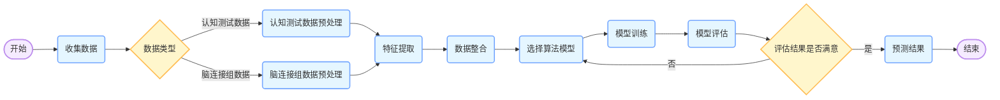

# AI辅助阿尔茨海默病早期预测：从认知测试到脑连接组分析

> 关键词：AI、阿尔茨海默病、早期预测、认知测试、脑连接组分析

> 摘要：本文聚焦于AI在阿尔茨海默病早期预测中的应用，详细探讨了从认知测试到脑连接组分析的全过程。首先介绍了阿尔茨海默病早期预测的背景和意义，阐述了相关核心概念及其联系，深入剖析了核心算法原理与具体操作步骤，并给出了相应的数学模型和公式。通过项目实战展示了代码实现和详细解读，分析了实际应用场景。同时推荐了学习资源、开发工具框架以及相关论文著作。最后总结了未来发展趋势与挑战，并对常见问题进行了解答。旨在为AI辅助阿尔茨海默病早期预测提供全面、深入的技术参考和指导。

## 1. 背景介绍 
### 1.1 目的和范围
阿尔茨海默病（Alzheimer's disease，AD）是一种进行性神经退行性疾病，是老年痴呆最常见的类型。随着全球人口老龄化的加剧，AD的发病率逐年上升，给患者家庭和社会带来了沉重的负担。目前，AD尚无治愈方法，但早期诊断和干预可以延缓疾病的进展，提高患者的生活质量。因此，开发有效的AD早期预测方法具有重要的临床和社会意义。

本文的目的是探讨AI在AD早期预测中的应用，从认知测试到脑连接组分析，全面介绍相关的技术和方法。范围涵盖了AD早期预测的基本概念、核心算法、数学模型、项目实战、实际应用场景以及相关的工具和资源推荐等方面。

### 1.2 预期读者
本文的预期读者包括医学领域的研究人员、临床医生、AI领域的研究人员和工程师、对AD早期预测感兴趣的学生和爱好者等。希望通过本文的介绍，能够帮助读者了解AI在AD早期预测中的应用原理和方法，为相关领域的研究和实践提供参考。

### 1.3 文档结构概述
本文共分为10个部分，具体结构如下：
1. 背景介绍：介绍AD早期预测的目的和范围、预期读者、文档结构概述以及相关术语表。
2. 核心概念与联系：阐述AD、认知测试、脑连接组分析等核心概念及其联系，并给出相应的文本示意图和Mermaid流程图。
3. 核心算法原理 & 具体操作步骤：详细介绍AI在AD早期预测中常用的核心算法原理，并给出具体的操作步骤和Python源代码。
4. 数学模型和公式 & 详细讲解 & 举例说明：介绍相关的数学模型和公式，并进行详细讲解和举例说明。
5. 项目实战：代码实际案例和详细解释说明：通过项目实战展示AI在AD早期预测中的代码实现和详细解读。
6. 实际应用场景：分析AI在AD早期预测中的实际应用场景。
7. 工具和资源推荐：推荐学习资源、开发工具框架以及相关论文著作。
8. 总结：未来发展趋势与挑战：总结AI在AD早期预测中的未来发展趋势与挑战。
9. 附录：常见问题与解答：对常见问题进行解答。
10. 扩展阅读 & 参考资料：提供扩展阅读和参考资料。

### 1.4 术语表
#### 1.4.1 核心术语定义
- **阿尔茨海默病（Alzheimer's disease，AD）**：一种进行性神经退行性疾病，主要表现为记忆力减退、认知功能障碍、行为和人格改变等。
- **认知测试（Cognitive test）**：通过一系列的测试题目来评估个体的认知功能，包括记忆力、注意力、语言能力、执行功能等。
- **脑连接组（Brain connectome）**：指大脑中神经元之间的连接网络，反映了大脑不同区域之间的功能和结构联系。
- **脑连接组分析（Brain connectome analysis）**：对脑连接组进行研究和分析的方法，旨在揭示大脑的功能和结构特征。
- **人工智能（Artificial intelligence，AI）**：研究如何使计算机系统能够模拟人类智能的学科和技术。

#### 1.4.2 相关概念解释
- **神经影像学（Neuroimaging）**：利用各种成像技术（如磁共振成像、正电子发射断层扫描等）来观察大脑的结构和功能。
- **机器学习（Machine learning）**：人工智能的一个分支，研究如何让计算机从数据中自动学习模式和规律，并进行预测和决策。
- **深度学习（Deep learning）**：机器学习的一个子领域，基于人工神经网络，通过多层神经元的学习来提取数据的特征和模式。
- **生物标志物（Biomarker）**：可以反映生物系统状态的可测量指标，在AD早期预测中，生物标志物可以帮助检测疾病的早期变化。

#### 1.4.3 缩略词列表
- **AD**：阿尔茨海默病（Alzheimer's disease）
- **MCI**：轻度认知障碍（Mild cognitive impairment）
- **MRI**：磁共振成像（Magnetic resonance imaging）
- **PET**：正电子发射断层扫描（Positron emission tomography）
- **FC**：功能连接（Functional connectivity）
- **SC**：结构连接（Structural connectivity）
- **ML**：机器学习（Machine learning）
- **DL**：深度学习（Deep learning）

## 2. 核心概念与联系 
### 核心概念原理
#### 阿尔茨海默病（AD）
AD是一种复杂的神经退行性疾病，其病因尚未完全明确。目前认为，AD的发生与多种因素有关，包括遗传因素、环境因素、生活方式等。AD的病理特征主要包括大脑中β-淀粉样蛋白（Aβ）的沉积、神经原纤维缠结（NFT）的形成以及神经元的丢失和突触功能障碍等。这些病理变化会导致大脑结构和功能的改变，从而影响患者的认知功能。

#### 认知测试
认知测试是评估个体认知功能的重要手段。通过一系列标准化的测试题目，可以测量个体在不同认知领域的表现，如记忆力、注意力、语言能力、执行功能等。常见的认知测试包括简易精神状态检查表（MMSE）、蒙特利尔认知评估量表（MoCA）等。认知测试可以帮助医生早期发现认知功能障碍，为AD的早期诊断提供重要线索。

#### 脑连接组分析
脑连接组分析是研究大脑功能和结构的重要方法。大脑是一个高度复杂的网络，不同区域之间通过神经纤维相互连接。脑连接组分析可以通过神经影像学技术（如MRI、PET等）获取大脑的结构和功能信息，构建脑连接组网络，并分析网络的拓扑结构和功能特征。在AD早期，脑连接组网络会发生一系列的变化，如连接强度的改变、网络拓扑结构的异常等。通过脑连接组分析，可以发现这些早期变化，为AD的早期预测提供依据。

### 架构的文本示意图
```plaintext
阿尔茨海默病（AD）
├── 病理特征：Aβ沉积、NFT形成、神经元丢失等
├── 临床表现：认知功能障碍、行为和人格改变等

认知测试
├── 测试题目：记忆力、注意力、语言能力、执行功能等
├── 评估工具：MMSE、MoCA等

脑连接组分析
├── 数据获取：MRI、PET等神经影像学技术
├── 网络构建：功能连接、结构连接等
├── 特征分析：拓扑结构、功能特征等

AI辅助AD早期预测
├── 数据整合：认知测试数据、脑连接组数据等
├── 算法模型：机器学习、深度学习等
├── 预测结果：早期诊断、疾病进展预测等
```

### Mermaid流程图


## 3. 核心算法原理 & 具体操作步骤 
### 核心算法原理
在AI辅助AD早期预测中，常用的算法包括机器学习和深度学习算法。以下是几种常见算法的原理介绍：

#### 逻辑回归（Logistic Regression）
逻辑回归是一种常用的分类算法，用于预测二分类或多分类问题。其基本原理是通过逻辑函数将线性回归的输出映射到概率值，从而进行分类预测。逻辑回归的数学表达式为：
$$P(y = 1|x) = \frac{1}{1 + e^{-(w^T x + b)}}$$
其中，$P(y = 1|x)$ 表示给定输入 $x$ 时，输出为1的概率；$w$ 是权重向量；$b$ 是偏置项。

#### 支持向量机（Support Vector Machine，SVM）
支持向量机是一种强大的分类和回归算法，其基本思想是在特征空间中找到一个最优的超平面，使得不同类别的样本能够被最大程度地分开。SVM通过引入核函数，可以处理非线性分类问题。

#### 随机森林（Random Forest）
随机森林是一种集成学习算法，由多个决策树组成。每个决策树在训练时使用不同的样本子集和特征子集，最后通过投票或平均的方式得到最终的预测结果。随机森林具有较好的泛化能力和抗过拟合能力。

#### 卷积神经网络（Convolutional Neural Network，CNN）
卷积神经网络是一种深度学习算法，主要用于处理图像和序列数据。CNN通过卷积层、池化层和全连接层等结构，自动提取数据的特征，并进行分类或回归预测。

#### 循环神经网络（Recurrent Neural Network，RNN）
循环神经网络是一种用于处理序列数据的深度学习算法。RNN通过引入循环结构，能够捕捉序列数据中的时间依赖关系。长短期记忆网络（LSTM）和门控循环单元（GRU）是RNN的变体，它们能够有效地解决RNN中的梯度消失和梯度爆炸问题。

### 具体操作步骤
以下是使用Python实现逻辑回归算法进行AD早期预测的具体操作步骤：

#### 步骤1：数据加载和预处理
```python
import pandas as pd
from sklearn.model_selection import train_test_split
from sklearn.preprocessing import StandardScaler

# 加载数据
data = pd.read_csv('ad_data.csv')

# 分离特征和标签
X = data.drop('label', axis=1)
y = data['label']

# 数据划分
X_train, X_test, y_train, y_test = train_test_split(X, y, test_size=0.2, random_state=42)

# 数据标准化
scaler = StandardScaler()
X_train = scaler.fit_transform(X_train)
X_test = scaler.transform(X_test)
```

#### 步骤2：模型训练
```python
from sklearn.linear_model import LogisticRegression

# 创建逻辑回归模型
model = LogisticRegression()

# 模型训练
model.fit(X_train, y_train)
```

#### 步骤3：模型评估
```python
from sklearn.metrics import accuracy_score, confusion_matrix

# 模型预测
y_pred = model.predict(X_test)

# 计算准确率
accuracy = accuracy_score(y_test, y_pred)
print(f"Accuracy: {accuracy}")

# 计算混淆矩阵
conf_matrix = confusion_matrix(y_test, y_pred)
print(f"Confusion Matrix: \n{conf_matrix}")
```

## 4. 数学模型和公式 & 详细讲解 & 举例说明 
### 逻辑回归的数学模型和公式
逻辑回归的目标是找到一组参数 $w$ 和 $b$，使得模型的预测结果与真实标签之间的误差最小。常用的损失函数是对数损失函数（Log Loss），也称为交叉熵损失函数（Cross-Entropy Loss）。对数损失函数的数学表达式为：
$$L(w, b) = -\frac{1}{N} \sum_{i=1}^{N} [y_i \log(P(y_i = 1|x_i)) + (1 - y_i) \log(1 - P(y_i = 1|x_i))]$$
其中，$N$ 是样本数量；$y_i$ 是第 $i$ 个样本的真实标签；$P(y_i = 1|x_i)$ 是模型对第 $i$ 个样本的预测概率。

为了最小化损失函数 $L(w, b)$，可以使用梯度下降法（Gradient Descent）来更新参数 $w$ 和 $b$。梯度下降法的更新公式为：
$$w = w - \alpha \frac{\partial L(w, b)}{\partial w}$$
$$b = b - \alpha \frac{\partial L(w, b)}{\partial b}$$
其中，$\alpha$ 是学习率，控制参数更新的步长。

### 详细讲解
对数损失函数的原理是通过计算模型预测概率与真实标签之间的差异来衡量模型的性能。当预测概率与真实标签越接近时，对数损失函数的值越小；反之，当预测概率与真实标签越远时，对数损失函数的值越大。

梯度下降法是一种迭代优化算法，通过不断地更新参数 $w$ 和 $b$，使得损失函数 $L(w, b)$ 逐渐减小。在每次迭代中，根据损失函数的梯度方向更新参数，直到损失函数收敛或达到最大迭代次数。

### 举例说明
假设我们有一个简单的二分类问题，样本特征 $x$ 是一个一维向量，真实标签 $y$ 取值为0或1。模型的预测概率为 $P(y = 1|x) = \frac{1}{1 + e^{-(w x + b)}}$。

我们的目标是找到合适的参数 $w$ 和 $b$，使得对数损失函数 $L(w, b)$ 最小。假设我们有以下样本数据：
| $x$ | $y$ |
|---|---|
| 1 | 1 |
| 2 | 1 |
| 3 | 0 |
| 4 | 0 |

我们可以使用Python代码来实现逻辑回归模型的训练和预测：
```python
import numpy as np

# 样本数据
X = np.array([[1], [2], [3], [4]])
y = np.array([1, 1, 0, 0])

# 初始化参数
w = 0
b = 0
learning_rate = 0.1
epochs = 1000

# 梯度下降法训练模型
for epoch in range(epochs):
    # 计算预测概率
    z = np.dot(X, w) + b
    y_pred = 1 / (1 + np.exp(-z))
    
    # 计算损失函数
    loss = -np.mean(y * np.log(y_pred) + (1 - y) * np.log(1 - y_pred))
    
    # 计算梯度
    dw = np.mean((y_pred - y) * X)
    db = np.mean(y_pred - y)
    
    # 更新参数
    w = w - learning_rate * dw
    b = b - learning_rate * db
    
    # 打印损失函数值
    if epoch % 100 == 0:
        print(f"Epoch {epoch}: Loss = {loss}")

# 模型预测
z_test = np.dot(X, w) + b
y_pred_test = 1 / (1 + np.exp(-z_test))
y_pred_test = np.round(y_pred_test)

print(f"Predicted labels: {y_pred_test}")
```

## 5. 项目实战：代码实际案例和详细解释说明 
### 5.1  开发环境搭建
#### 安装Python
首先，需要安装Python开发环境。可以从Python官方网站（https://www.python.org/downloads/） 下载适合自己操作系统的Python安装包，并按照安装向导进行安装。

#### 安装必要的库
在项目中，需要使用一些Python库，如`pandas`、`numpy`、`scikit-learn`、`tensorflow`等。可以使用以下命令来安装这些库：
```sh
pip install pandas numpy scikit-learn tensorflow
```

### 5.2  源代码详细实现和代码解读
以下是一个使用深度学习模型（CNN）进行AD早期预测的完整代码示例：

```python
import pandas as pd
import numpy as np
from sklearn.model_selection import train_test_split
from sklearn.preprocessing import StandardScaler
from tensorflow.keras.models import Sequential
from tensorflow.keras.layers import Conv1D, MaxPooling1D, Flatten, Dense
from tensorflow.keras.utils import to_categorical

# 加载数据
data = pd.read_csv('ad_data.csv')

# 分离特征和标签
X = data.drop('label', axis=1).values
y = data['label'].values

# 数据划分
X_train, X_test, y_train, y_test = train_test_split(X, y, test_size=0.2, random_state=42)

# 数据标准化
scaler = StandardScaler()
X_train = scaler.fit_transform(X_train)
X_test = scaler.transform(X_test)

# 调整数据形状以适应CNN输入
X_train = np.expand_dims(X_train, axis=2)
X_test = np.expand_dims(X_test, axis=2)

# 标签编码
y