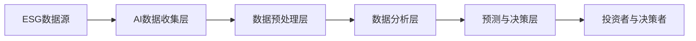

# AI驱动的ESG投资分析

> 关键词：AI、ESG投资、数据分析、机器学习、投资决策、可持续发展、金融科技

> 摘要：本文聚焦于AI驱动的ESG投资分析，深入探讨了ESG投资的背景、AI在其中的核心作用与原理。详细阐述了相关的核心算法、数学模型，并通过实际案例展示了AI如何助力ESG投资决策。同时介绍了实际应用场景、推荐了相关工具和资源，最后对未来发展趋势与挑战进行了总结，旨在为投资者和相关从业者提供全面深入的ESG投资分析指导。

## 1. 背景介绍 
### 1.1 目的和范围
ESG（环境、社会和公司治理）投资作为一种可持续的投资理念，近年来在全球范围内受到越来越多的关注。传统的ESG投资分析方法往往面临数据处理效率低、信息挖掘不深入等问题。而AI技术的发展为ESG投资分析带来了新的机遇和方法。本文的目的在于深入探讨AI如何驱动ESG投资分析，从技术原理、算法实现到实际应用案例进行全面剖析，范围涵盖AI在ESG数据处理、风险评估、投资决策等方面的应用。

### 1.2 预期读者
本文预期读者包括金融投资者，希望通过AI技术提升ESG投资决策的准确性和效率；金融科技从业者，关注AI在金融领域的创新应用；研究机构和学者，对ESG投资和AI技术的交叉领域进行学术研究；以及相关监管部门人员，了解AI驱动的ESG投资分析对金融市场监管的影响。

### 1.3 文档结构概述
本文首先介绍了ESG投资和AI技术的背景知识，包括相关术语和概念。接着阐述了AI与ESG投资分析的核心概念及联系，通过文本示意图和Mermaid流程图展示其架构。然后详细讲解了核心算法原理和具体操作步骤，结合Python源代码进行说明。之后介绍了相关的数学模型和公式，并举例说明。通过项目实战展示了代码的实际应用和详细解释。接着探讨了AI驱动的ESG投资分析的实际应用场景。推荐了相关的工具和资源，包括学习资源、开发工具框架和相关论文著作。最后总结了未来发展趋势与挑战，提供了常见问题与解答和扩展阅读及参考资料。

### 1.4 术语表
#### 1.4.1 核心术语定义
- **ESG**：环境（Environment）、社会（Social）和公司治理（Governance）的缩写，是一种关注企业可持续发展和社会责任的投资理念和评估标准。
- **AI（人工智能）**：计算机科学的一个分支，旨在使计算机系统能够模拟人类的智能行为，如学习、推理、决策等。
- **机器学习**：AI的一个重要领域，通过让计算机系统从数据中自动学习模式和规律，从而进行预测和决策。
- **自然语言处理（NLP）**：AI的一个分支，专注于计算机与人类语言之间的交互，包括文本分析、情感分析等。
- **ESG评级**：对企业在环境、社会和公司治理方面表现的综合评估和打分。

#### 1.4.2 相关概念解释
- **可持续投资**：一种考虑环境、社会和治理因素的投资策略，旨在实现长期的财务回报和社会价值。
- **数据挖掘**：从大量数据中发现有价值信息和模式的过程，常用于ESG数据的分析和处理。
- **深度学习**：机器学习的一个子领域，通过构建多层神经网络来学习数据的复杂特征和模式。

#### 1.4.3 缩略词列表
- **AI**：Artificial Intelligence（人工智能）
- **ESG**：Environment, Social and Governance（环境、社会和公司治理）
- **NLP**：Natural Language Processing（自然语言处理）
- **ML**：Machine Learning（机器学习）
- **DL**：Deep Learning（深度学习）

## 2. 核心概念与联系 
### 核心概念原理
ESG投资分析的核心在于评估企业在环境、社会和公司治理方面的表现，以确定其投资价值和可持续性。传统的ESG投资分析主要依赖于人工收集和分析数据，效率低下且容易受到主观因素的影响。而AI技术可以通过自动化的数据处理、机器学习算法和自然语言处理技术，更高效、准确地分析ESG数据。

AI在ESG投资分析中的应用原理主要包括以下几个方面：
- **数据收集与整合**：AI可以通过网络爬虫、数据接口等技术，自动收集来自不同来源的ESG数据，包括企业报告、新闻资讯、社交媒体等，并将这些数据进行整合和清洗。
- **数据挖掘与分析**：利用机器学习算法，如分类算法、聚类算法、回归算法等，对ESG数据进行挖掘和分析，发现其中的模式和规律。例如，通过分类算法可以将企业的ESG表现分为不同的等级；通过聚类算法可以将具有相似ESG特征的企业进行分组。
- **自然语言处理**：通过自然语言处理技术，对企业的文本信息，如年报、社会责任报告等进行分析，提取其中的ESG相关信息，并进行情感分析和语义理解。例如，通过情感分析可以了解市场对企业ESG表现的评价；通过语义理解可以提取企业在环境、社会和公司治理方面的具体措施和成果。
- **预测与决策**：基于数据分析的结果，利用机器学习算法进行预测和决策。例如，通过预测企业的ESG表现趋势，为投资者提供投资建议；通过评估企业的ESG风险，帮助投资者制定风险管理策略。

### 架构的文本示意图
```plaintext
                +-----------------+
                |   ESG数据源     |
                | (企业报告、新闻等)|
                +-----------------+
                         |
                         v
                +-----------------+
                |   AI数据收集层   |
                | (网络爬虫、接口调用)|
                +-----------------+
                         |
                         v
                +-----------------+
                |   数据预处理层   |
                | (清洗、整合、标注)|
                +-----------------+
                         |
                         v
                +-----------------+
                |   数据分析层     |
                | (机器学习、NLP算法)|
                +-----------------+
                         |
                         v
                +-----------------+
                |   预测与决策层   |
                | (投资建议、风险评估)|
                +-----------------+
                         |
                         v
                +-----------------+
                |   投资者与决策者 |
                +-----------------+
```

### Mermaid流程图


## 3. 核心算法原理 & 具体操作步骤 
### 核心算法原理
在AI驱动的ESG投资分析中，常用的核心算法包括机器学习算法和自然语言处理算法。

#### 机器学习算法
- **逻辑回归**：逻辑回归是一种广泛应用的分类算法，用于预测二分类或多分类问题。在ESG投资分析中，可以用于预测企业的ESG评级，例如将企业的ESG表现分为高、中、低三个等级。逻辑回归的基本原理是通过逻辑函数将线性回归的输出映射到概率值，从而进行分类。逻辑函数的公式为：
$$
\sigma(z)=\frac{1}{1 + e^{-z}}
$$
其中，$z$ 是线性回归的输出，$\sigma(z)$ 是逻辑函数的输出，表示事件发生的概率。

- **决策树**：决策树是一种基于树结构进行决策的算法，通过对数据的特征进行划分，构建决策树模型。在ESG投资分析中，可以用于分析企业的ESG特征与投资绩效之间的关系。决策树的构建过程是递归地选择最优的特征进行划分，直到满足停止条件。

- **随机森林**：随机森林是一种集成学习算法，通过组合多个决策树模型来提高预测的准确性和稳定性。在ESG投资分析中，随机森林可以用于综合考虑多个ESG因素，进行投资风险评估和预测。

#### 自然语言处理算法
- **文本分类**：文本分类是将文本数据分为不同类别的任务，在ESG投资分析中，可以用于对企业的新闻资讯、社会责任报告等文本进行分类，例如分为环境相关、社会相关和公司治理相关等类别。常用的文本分类算法包括朴素贝叶斯、支持向量机等。
- **情感分析**：情感分析是分析文本中表达的情感倾向，在ESG投资分析中，可以用于了解市场对企业ESG表现的评价，例如积极、消极或中性。常用的情感分析算法包括基于词典的方法和基于机器学习的方法。

### 具体操作步骤
#### 数据收集
使用Python的`requests`库和`BeautifulSoup`库进行网络爬虫，收集企业的ESG相关数据。以下是一个简单的示例代码：
```python
import requests
from bs4 import BeautifulSoup

def get_esg_data(url):
    try:
        response = requests.get(url)
        if response.status_code == 200:
            soup = BeautifulSoup(response.text, 'html.parser')
            # 这里可以根据网页结构提取具体的ESG数据
            esg_data = soup.get_text()
            return esg_data
        else:
            print(f"请求失败，状态码：{response.status_code}")
            return None
    except Exception as e:
        print(f"发生错误：{e}")
        return None

# 示例URL
url = "https://example.com/esg_report"
esg_data = get_esg_data(url)
if esg_data:
    print(esg_data)
```

#### 数据预处理
对收集到的ESG数据进行清洗、整合和标注。以下是一个简单的数据清洗示例代码：
```python
import re

def clean_esg_data(data):
    # 去除HTML标签
    data = re.sub(r'<[^>]+>', '', data)
    # 去除多余的空白字符
    data = re.sub(r'\s+', ' ', data).strip()
    return data

if esg_data:
    cleaned_data = clean_esg_data(esg_data)
    print(cleaned_data)
```

#### 数据分析
使用`scikit-learn`库进行机器学习算法的实现。以下是一个简单的逻辑回归分类示例代码：
```python
from sklearn.linear_model import LogisticRegression
from sklearn.model_selection import train_test_split
from sklearn.metrics import accuracy_score
import numpy as np

# 示例数据
X = np.array([[1, 2], [2, 3], [3, 4], [4, 5]])
y = np.array([0, 0, 1, 1])

# 划分训练集和测试集
X_train, X_test, y_train, y_test = train_test_split(X, y, test_size=0.2, random_state=42)

# 创建逻辑回归模型
model = LogisticRegression()

# 训练模型
model.fit(X_train, y_train)

# 预测
y_pred = model.predict(X_test)

# 计算准确率
accuracy = accuracy_score(y_test, y_pred)
print(f"准确率：{accuracy}")
```

#### 预测与决策
根据数据分析的结果，为投资者提供投资建议和风险评估。例如，根据企业的ESG评级预测其未来的投资绩效，为投资者提供买入、持有或卖出的建议。

## 4. 数学模型和公式 & 详细讲解 & 举例说明 
### 逻辑回归数学模型和公式
逻辑回归的数学模型可以表示为：
$$
P(Y = 1|X)=\frac{1}{1 + e^{-(w_0 + w_1x_1 + w_2x_2 + \cdots + w_nx_n)}}
$$
其中，$P(Y = 1|X)$ 表示在给定特征 $X=(x_1, x_2, \cdots, x_n)$ 的情况下，事件 $Y = 1$ 发生的概率；$w_0, w_1, w_2, \cdots, w_n$ 是模型的参数。

逻辑回归的目标是通过最大化似然函数来估计模型的参数。似然函数可以表示为：
$$
L(w)=\prod_{i=1}^{m}[P(Y_i = 1|X_i)]^{y_i}[1 - P(Y_i = 1|X_i)]^{1 - y_i}
$$
其中，$m$ 是样本数量，$y_i$ 是第 $i$ 个样本的真实标签。

为了方便计算，通常对似然函数取对数，得到对数似然函数：
$$
\ell(w)=\sum_{i=1}^{m}[y_i\log(P(Y_i = 1|X_i))+(1 - y_i)\log(1 - P(Y_i = 1|X_i))]
$$
通过最大化对数似然函数，可以使用梯度下降等优化算法来估计模型的参数。

### 举例说明
假设我们有一个简单的ESG投资分析问题，根据企业的环境绩效得分 $x_1$ 和社会绩效得分 $x_2$ 来预测企业的ESG评级（高评级为1，低评级为0）。我们有以下样本数据：

| 环境绩效得分 $x_1$ | 社会绩效得分 $x_2$ | ESG评级 $y$ |
|---|---|---|
| 80 | 70 | 1 |
| 60 | 50 | 0 |
| 70 | 60 | 1 |
| 50 | 40 | 0 |

我们可以使用逻辑回归模型来进行预测。首先，我们需要将数据进行整理：
```python
import numpy as np

X = np.array([[80, 70], [60, 50], [70, 60], [50, 40]])
y = np.array([1, 0, 1, 0])
```

然后，使用`scikit-learn`库中的`LogisticRegression`类来训练模型：
```python
from sklearn.linear_model import LogisticRegression

model = LogisticRegression()
model.fit(X, y)
```

最后，我们可以使用训练好的模型来进行预测。例如，对于一个新的企业，其环境绩效得分 $x_1 = 75$，社会绩效得分 $x_2 = 65$，我们可以预测其ESG评级：
```python
new_sample = np.array([[75, 65]])
prediction = model.predict(new_sample)
print(f"预测的ESG评级：{prediction[0]}")
```

### 决策树数学模型和公式
决策树的数学模型是一个树结构，每个内部节点表示一个特征的划分，每个分支表示一个划分的结果，每个叶节点表示一个类别或值。决策树的构建过程是基于信息增益、基尼指数等准则来选择最优的特征进行划分。

信息增益的计算公式为：
$$
IG(D, A)=H(D)-H(D|A)
$$
其中，$IG(D, A)$ 表示特征 $A$ 对数据集 $D$ 的信息增益，$H(D)$ 表示数据集 $D$ 的信息熵，$H(D|A)$ 表示在特征 $A$ 给定的情况下，数据集 $D$ 的条件熵。

信息熵的计算公式为：
$$
H(D)=-\sum_{k=1}^{K}p_k\log_2p_k
$$
其中，$K$ 是数据集 $D$ 中类别的数量，$p_k$ 是第 $k$ 个类别的概率。

条件熵的计算公式为：
$$
H(D|A)=\sum_{v=1}^{V}\frac{|D^v|}{|D|}H(D^v)
$$
其中，$V$ 是特征 $A$ 的取值数量，$D^v$ 是特征 $A$ 取值为 $v$ 的子集。

### 举例说明
假设我们有一个ESG投资分析问题，根据企业的环境绩效得分、社会绩效得分和公司治理得分来预测企业的ESG评级。我们有以下样本数据：

| 环境绩效得分 | 社会绩效得分 | 公司治理得分 | ESG评级 |
|---|---|---|---|
| 80 | 70 | 75 | 高 |
| 60 | 50 | 65 | 低 |
| 70 | 60 | 70 | 高 |
| 50 | 40 | 60 | 低 |

我们可以使用决策树模型来进行预测。首先，我们需要将数据进行整理：
```python
import pandas as pd
from sklearn.tree import DecisionTreeClassifier

data = {
    '环境绩效得分': [80, 60, 70, 50],
    '社会绩效得分': [70, 50, 60, 40],
    '公司治理得分': [75, 65, 70, 60],
    'ESG评级': ['高', '低', '高', '低']
}

df = pd.DataFrame(data)
X = df[['环境绩效得分', '社会绩效得分', '公司治理得分']]
y = df['ESG评级']

model = DecisionTreeClassifier()
model.fit(X, y)
```

最后，我们可以使用训练好的模型来进行预测。例如，对于一个新的企业，其环境绩效得分 $x_1 = 75$，社会绩效得分 $x_2 = 65$，公司治理得分 $x_3 = 72$，我们可以预测其ESG评级：
```python
new_sample = pd.DataFrame([[75, 65, 72]], columns=['环境绩效得分', '社会绩效得分', '公司治理得分'])
prediction = model.predict(new_sample)
print(f"预测的ESG评级：{prediction[0]}")
```

## 5. 项目实战：代码实际案例和详细解释说明 
### 5.1  开发环境搭建
#### 安装Python
首先，需要安装Python开发环境。可以从Python官方网站（https://www.python.org/downloads/） 下载适合自己操作系统的Python版本，并进行安装。

#### 安装必要的库
使用`pip`命令安装项目所需的库，包括`requests`、`BeautifulSoup`、`scikit-learn`、`pandas`等。以下是安装命令：
```sh
pip install requests beautifulsoup4 scikit-learn pandas
```

### 5.2  源代码详细实现和代码解读
#### 数据收集模块
```python
import requests
from bs4 import BeautifulSoup

def get_esg_data(url):
    try:
        response = requests.get(url)
        if response.status_code == 200:
            soup = BeautifulSoup(response.text, 'html.parser')
            # 这里可以根据网页结构提取具体的ESG数据
            esg_data = soup.get_text()
            return esg_data
        else:
            print(f"请求失败，状态码：{response.status_code}")
            return None
    except Exception as e:
        print(f"发生错误：{e}")
        return None
```
代码解读：
- `requests.get(url)`：发送HTTP请求，获取网页内容。
- `BeautifulSoup(response.text, 'html.parser')`：使用`BeautifulSoup`库解析网页内容。
- `soup.get_text()`：提取网页中的文本信息。

#### 数据预处理模块
```python
import re

def clean_esg_data(data):
    # 去除HTML标签
    data = re.sub(r'<[^>]+>', '', data)
    # 去除多余的空白字符
    data = re.sub(r'\s+', ' ', data).strip()
    return data
```
代码解读：
- `re.sub(r'<[^>]+>', '', data)`：使用正则表达式去除HTML标签。
- `re.sub(r'\s+', ' ', data).strip()`：使用正则表达式去除多余的空白字符，并去除字符串两端的空白。

#### 数据分析模块
```python
from sklearn.linear_model import LogisticRegression
from sklearn.model_selection import train_test_split
from sklearn.metrics import accuracy_score
import numpy as np

# 示例数据
X = np.array([[1, 2], [2, 3], [3, 4], [4, 5]])
y = np.array([0, 0, 1, 1])

# 划分训练集和测试集
X_train, X_test, y_train, y_test = train_test_split(X, y, test_size=0.2, random_state=42)

# 创建逻辑回归模型
model = LogisticRegression()

# 训练模型
model.fit(X_train, y_train)

# 预测
y_pred = model.predict(X_test)

# 计算准确率
accuracy = accuracy_score(y_test, y_pred)
print(f"准确率：{accuracy}")
```
代码解读：
- `train_test_split(X, y, test_size=0.2, random_state=42)`：将数据集划分为训练集和测试集，测试集占比为20%。
- `LogisticRegression()`：创建逻辑回归模型。
- `model.fit(X_train, y_train)`：使用训练集数据训练模型。
- `model.predict(X_test)`：使用训练好的模型对测试集数据进行预测。
- `accuracy_score(y_test, y_pred)`：计算预测结果的准确率。

### 5.3  代码解读与分析
通过以上代码，我们实现了一个简单的AI驱动的ESG投资分析项目。首先，使用网络爬虫收集ESG相关数据；然后，对数据进行预处理，去除噪声和无用信息；接着，使用逻辑回归模型对数据进行分析和预测；最后，计算预测结果的准确率。

在实际应用中，我们可以根据具体需求对代码进行扩展和优化。例如，使用更复杂的机器学习算法，如随机森林、深度学习等；收集更多的ESG数据，提高模型的准确性和泛化能力；使用自然语言处理技术对文本数据进行更深入的分析。

## 6. 实际应用场景 
### 投资决策支持
AI驱动的ESG投资分析可以为投资者提供更全面、准确的信息，帮助他们做出更明智的投资决策。通过对企业的ESG表现进行评估和预测，投资者可以了解企业的可持续发展能力和潜在风险，从而选择更具投资价值的企业。例如，投资者可以根据企业的ESG评级，选择高评级的企业进行投资，以降低投资风险，提高投资回报率。

### 风险管理
AI可以帮助金融机构和投资者识别和评估ESG风险。通过对企业的环境、社会和公司治理数据进行分析，AI可以发现潜在的风险因素，如环境污染、劳动纠纷、治理不善等，并及时预警。金融机构可以根据风险评估结果，调整投资组合，降低风险暴露。例如，银行可以对高ESG风险的企业减少贷款额度或提高贷款利率。

### 企业可持续发展评估
企业可以利用AI技术对自身的ESG表现进行评估和监测，发现存在的问题和不足，制定相应的改进措施，提高企业的可持续发展能力。例如，企业可以通过分析自身的环境数据，优化生产流程，降低能源消耗和环境污染；通过分析员工满意度数据，改善员工福利和工作环境，提高员工的忠诚度和工作效率。

### 政策制定与监管
政府和监管部门可以利用AI技术对企业的ESG表现进行监管和评估，制定相应的政策和法规，引导企业加强ESG管理。例如，政府可以根据企业的ESG评级，对高评级的企业给予税收优惠、财政补贴等支持；对低评级的企业进行处罚和整改要求。

## 7. 工具和资源推荐
### 7.1 学习资源推荐
#### 7.1.1 书籍推荐
- 《机器学习》（周志华著）：全面介绍了机器学习的基本概念、算法和应用，是机器学习领域的经典教材。
- 《Python数据分析实战》（韦斯·麦金尼著）：详细介绍了Python在数据分析中的应用，包括数据处理、数据分析和数据可视化等方面。
- 《ESG投资：从理念到实践》（相关作者）：深入探讨了ESG投资的理念、方法和实践案例，对ESG投资分析有很好的指导作用。

#### 7.1.2 在线课程
- Coursera上的“机器学习”课程（Andrew Ng教授）：全球知名的机器学习课程，内容全面，讲解详细。
- edX上的“数据科学与机器学习微硕士”课程：提供了系统的数据科学和机器学习知识体系。
- 中国大学MOOC上的“ESG与可持续金融”课程：介绍了ESG投资的相关理论和实践。

#### 7.1.3 技术博客和网站
- 机器学习算法全栈工程师（https://www.ai-start.com/）：提供了丰富的机器学习技术文章和教程。
- ESG Investor（https://www.esginvestor.net/）：专注于ESG投资领域的新闻、分析和研究。
- 36氪（https://36kr.com/）：关注科技创新和金融领域的动态，有很多关于AI和ESG投资的报道和分析。

### 7.2 开发工具框架推荐
#### 7.2.1 IDE和编辑器
- PyCharm：功能强大的Python集成开发环境，提供了代码编辑、调试、版本控制等功能。
- Jupyter Notebook：交互式的开发环境，适合数据探索和模型实验。
- Visual Studio Code：轻量级的代码编辑器，支持多种编程语言和插件扩展。

#### 7.2.2 调试和性能分析工具
- Py-Spy：用于分析Python代码的性能瓶颈，找出耗时的函数和代码段。
- cProfile：Python内置的性能分析工具，可以统计函数的调用次数和执行时间。
- TensorBoard：用于可视化深度学习模型的训练过程和性能指标。

#### 7.2.3 相关框架和库
- Scikit-learn：简单易用的机器学习库，提供了丰富的机器学习算法和工具。
- TensorFlow：谷歌开发的深度学习框架，广泛应用于图像识别、自然语言处理等领域。
- PyTorch：Facebook开发的深度学习框架，具有动态图和易于使用的特点。
- NLTK：自然语言处理工具包，提供了文本处理、分类、情感分析等功能。

### 7.3 相关论文著作推荐
#### 7.3.1 经典论文
- “Machine Learning: A Probabilistic Perspective”（Kevin P. Murphy著）：从概率的角度介绍了机器学习的基本理论和算法。
- “Deep Learning”（Ian Goodfellow、Yoshua Bengio和Aaron Courville著）：深度学习领域的经典著作，系统介绍了深度学习的原理和应用。
- “ESG and Financial Performance: Aggregated Evidence from More than 2000 Empirical Studies”（相关作者）：对ESG与财务绩效之间的关系进行了综合研究。

#### 7.3.2 最新研究成果
- 关注顶级学术期刊，如《Journal of Financial Economics》、《Review of Financial Studies》、《Management Science》等，这些期刊经常发表关于ESG投资和AI应用的最新研究成果。
- 参加学术会议，如ACM SIGKDD（知识发现与数据挖掘会议）、NeurIPS（神经信息处理系统大会）等，了解最新的技术和研究动态。

#### 7.3.3 应用案例分析
- 各大金融机构和咨询公司的研究报告，如麦肯锡、波士顿咨询集团等，会发布关于ESG投资和AI应用的案例分析和实践经验。
- 行业协会和组织的研究成果，如可持续投资论坛、全球报告倡议组织等，提供了大量的ESG投资案例和最佳实践。

## 8. 总结：未来发展趋势与挑战
### 未来发展趋势
- **数据整合与共享**：未来，ESG数据将更加整合和共享，不同来源的数据将被更好地整合和利用，提高数据的质量和可用性。同时，数据共享平台的建设将促进数据的流通和交流，为AI驱动的ESG投资分析提供更丰富的数据资源。
- **深度学习和强化学习的应用**：深度学习和强化学习等先进的AI技术将在ESG投资分析中得到更广泛的应用。这些技术可以处理更复杂的数据和问题，提高模型的准确性和预测能力。例如，深度学习可以用于对企业的文本数据进行更深入的语义理解和情感分析；强化学习可以用于优化投资组合和决策策略。
- **跨领域融合**：AI驱动的ESG投资分析将与其他领域进行更深入的融合，如区块链、物联网等。区块链技术可以保证ESG数据的真实性和不可篡改，物联网技术可以实时收集企业的环境数据和运营数据，为ESG投资分析提供更准确和及时的信息。
- **个性化服务**：随着投资者对ESG投资的需求越来越多样化，未来的ESG投资分析服务将更加个性化。根据投资者的风险偏好、投资目标和价值观，提供定制化的投资建议和解决方案。

### 挑战
- **数据质量和标准问题**：ESG数据的质量和标准存在较大差异，不同来源的数据可能存在不一致性和不完整性。缺乏统一的数据标准和规范，给数据的整合和分析带来了困难。解决数据质量和标准问题是AI驱动的ESG投资分析面临的重要挑战之一。
- **算法解释性和透明度**：AI算法，尤其是深度学习算法，往往被视为“黑盒”模型，其决策过程和结果难以解释和理解。在ESG投资分析中，投资者和监管部门需要了解模型的决策依据和风险，因此算法的解释性和透明度是一个重要的问题。
- **伦理和法律问题**：AI技术的应用涉及到伦理和法律问题，如数据隐私、算法歧视等。在ESG投资分析中，需要确保数据的合法使用和保护投资者的权益，避免算法歧视和不公平的决策。
- **人才短缺**：AI驱动的ESG投资分析需要既懂AI技术又懂金融和ESG领域知识的复合型人才。目前，这类人才相对短缺，制约了该领域的发展。培养和吸引复合型人才是解决人才短缺问题的关键。

## 9. 附录：常见问题与解答
### 1. AI在ESG投资分析中的应用是否可靠？
AI在ESG投资分析中的应用具有一定的可靠性，但也存在一定的局限性。AI技术可以通过大量的数据和复杂的算法进行分析和预测，提高分析的效率和准确性。然而，AI模型的性能取决于数据的质量和算法的选择，同时也受到数据噪声、模型偏差等因素的影响。因此，在应用AI技术进行ESG投资分析时，需要对模型的结果进行评估和验证，结合专家的经验和判断，以提高投资决策的可靠性。

### 2. 如何获取高质量的ESG数据？
获取高质量的ESG数据可以通过以下途径：
- 企业官方报告：企业的年报、社会责任报告等是重要的ESG数据来源，可以从中获取企业在环境、社会和公司治理方面的详细信息。
- 专业数据提供商：一些专业的数据提供商，如MSCI、Sustainalytics等，提供了全面、准确的ESG数据和评级服务。
- 政府和监管部门：政府和监管部门发布的相关政策、法规和统计数据也可以作为ESG数据的补充。
- 社交媒体和新闻资讯：社交媒体和新闻资讯可以反映市场对企业ESG表现的评价和关注，从中可以获取一些有价值的信息。

### 3. 如何解决AI算法的解释性问题？
解决AI算法的解释性问题可以采用以下方法：
- 选择可解释的算法：如决策树、逻辑回归等，这些算法的决策过程相对简单，容易解释。
- 模型解释技术：如特征重要性分析、局部解释方法等，可以帮助解释模型的决策依据。
- 可视化工具：通过可视化工具将模型的决策过程和结果直观地展示出来，帮助用户理解。

### 4. AI驱动的ESG投资分析是否会取代人类的投资决策？
AI驱动的ESG投资分析不会取代人类的投资决策，而是作为一种辅助工具，帮助投资者做出更明智的决策。AI技术可以处理大量的数据和复杂的问题，提供客观的分析和预测结果。然而，投资决策不仅仅取决于数据和模型，还受到投资者的风险偏好、价值观、市场情绪等因素的影响。人类投资者的经验、判断力和创造力在投资决策中仍然起着重要的作用。因此，AI驱动的ESG投资分析应该与人类的投资决策相结合，实现优势互补。

## 10. 扩展阅读 & 参考资料
### 扩展阅读
- 《智能时代》（吴军著）：介绍了AI技术的发展历程和应用前景，对理解AI在金融领域的应用有一定的帮助。
- 《ESG投资实战手册》（相关作者）：提供了ESG投资的具体操作方法和案例分析。
- 《金融科技前沿：AI与区块链在金融领域的应用》（相关作者）：探讨了AI和区块链等新兴技术在金融领域的应用和发展趋势。

### 参考资料
- 相关学术论文和研究报告，如《Journal of Financial Economics》、《Review of Financial Studies》等期刊上发表的论文。
- 金融机构和咨询公司的研究成果，如麦肯锡、波士顿咨询集团等发布的报告。
- 行业协会和组织的官方网站，如可持续投资论坛、全球报告倡议组织等。

作者：AI天才研究院/AI Genius Institute & 禅与计算机程序设计艺术 /Zen And The Art of Computer Programming