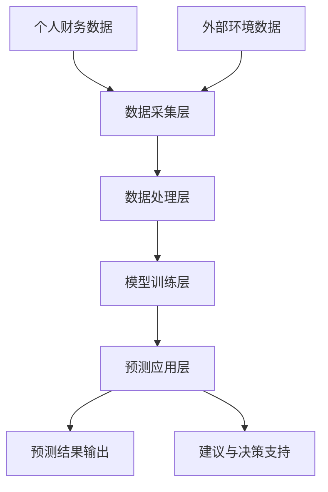

# AI驱动的个人财富积累速度预测器

> 关键词：AI、个人财富积累速度、预测器、机器学习、数据分析、金融模型、经济趋势

> 摘要：本文围绕AI驱动的个人财富积累速度预测器展开，旨在探讨如何利用先进的人工智能技术对个人财富的积累速度进行精准预测。首先介绍了该预测器的背景，包括其目的、预期读者、文档结构和相关术语。接着阐述了核心概念与联系，分析了其架构和原理。详细讲解了核心算法原理及具体操作步骤，通过Python代码进行了演示。深入探讨了相关的数学模型和公式，并举例说明。通过项目实战给出了代码实际案例和详细解释。介绍了该预测器的实际应用场景，推荐了相关的工具和资源。最后总结了未来发展趋势与挑战，提供了常见问题解答和扩展阅读参考资料，为读者全面了解和应用AI驱动的个人财富积累速度预测器提供了系统的知识体系。

## 1. 背景介绍 
### 1.1 目的和范围
个人财富的积累是每个人关注的重要问题，而准确预测个人财富积累速度对于合理规划财务、制定投资策略具有重要意义。AI驱动的个人财富积累速度预测器的目的在于利用人工智能技术，综合考虑多种因素，如收入、支出、投资、经济环境等，对个人财富的未来积累速度进行科学预测。其范围涵盖了不同收入层次、不同职业、不同生活阶段的个人，旨在为广大人群提供有价值的财富规划参考。

### 1.2 预期读者
本文的预期读者包括对个人财富管理感兴趣的普通大众，希望通过预测来合理规划自己的财务生活；金融从业者，如理财顾问、投资分析师等，他们可以借助该预测器为客户提供更精准的理财建议；以及从事人工智能和金融领域研究的学者和科研人员，他们可以从技术和理论层面深入探讨该预测器的原理和应用。

### 1.3 文档结构概述
本文首先介绍背景信息，让读者了解该预测器的目的和适用范围。接着阐述核心概念与联系，包括其架构和原理，使读者对预测器有一个整体的认识。然后详细讲解核心算法原理和具体操作步骤，通过Python代码进行演示，让读者了解其实现细节。再深入探讨相关的数学模型和公式，并举例说明，增强读者对理论基础的理解。通过项目实战给出代码实际案例和详细解释，帮助读者掌握实际应用方法。介绍该预测器的实际应用场景，展示其在不同领域的价值。推荐相关的工具和资源，方便读者进一步学习和研究。最后总结未来发展趋势与挑战，提供常见问题解答和扩展阅读参考资料，为读者提供全面的知识体系。

### 1.4 术语表
#### 1.4.1 核心术语定义
- **个人财富积累速度**：指个人在一定时间内财富增长的速率，通常用单位时间内财富的增加量与初始财富的比值来表示。
- **AI（人工智能）**：是研究、开发用于模拟、延伸和扩展人的智能的理论、方法、技术及应用系统的一门新的技术科学。
- **机器学习**：是一门多领域交叉学科，涉及概率论、统计学、逼近论、凸分析、算法复杂度理论等多门学科。它专门研究计算机怎样模拟或实现人类的学习行为，以获取新的知识或技能，重新组织已有的知识结构使之不断改善自身的性能。
- **特征工程**：是指对原始数据进行预处理和转换，提取出对模型有意义的特征的过程。

#### 1.4.2 相关概念解释
- **数据挖掘**：是指从大量的数据中通过算法搜索隐藏于其中信息的过程。在个人财富积累速度预测中，数据挖掘可以帮助发现影响财富积累的潜在因素。
- **时间序列分析**：是一种统计分析方法，用于处理按时间顺序排列的数据。在预测个人财富积累速度时，时间序列分析可以分析财富随时间的变化趋势。
- **回归分析**：是确定两种或两种以上变量间相互依赖的定量关系的一种统计分析方法。在预测器中，回归分析可以用于建立财富积累速度与各种影响因素之间的数学模型。

#### 1.4.3 缩略词列表
- **AI**：Artificial Intelligence（人工智能）
- **ML**：Machine Learning（机器学习）
- **RNN**：Recurrent Neural Network（循环神经网络）
- **LSTM**：Long Short-Term Memory（长短期记忆网络）

## 2. 核心概念与联系 

### 核心概念原理
AI驱动的个人财富积累速度预测器的核心原理是利用机器学习和数据分析技术，对影响个人财富积累的各种因素进行建模和分析，从而预测未来的财富积累速度。具体来说，它通过收集个人的收入、支出、投资、资产等数据，以及宏观经济环境、市场趋势等外部数据，对这些数据进行预处理和特征提取，然后选择合适的机器学习算法进行训练和建模，最后利用训练好的模型对个人财富积累速度进行预测。

### 架构的文本示意图
个人财富积累速度预测器的架构主要包括数据采集层、数据处理层、模型训练层和预测应用层。
- **数据采集层**：负责收集个人的财务数据和外部环境数据，如银行账户信息、投资记录、经济指标等。
- **数据处理层**：对采集到的数据进行清洗、预处理和特征工程，提取出对模型有意义的特征。
- **模型训练层**：选择合适的机器学习算法，如线性回归、决策树、神经网络等，对处理后的数据进行训练，得到预测模型。
- **预测应用层**：将训练好的模型应用于实际的预测场景，根据输入的个人数据和环境数据，预测个人财富积累速度，并提供相应的建议和决策支持。

### Mermaid流程图


## 3. 核心算法原理 & 具体操作步骤 

### 核心算法原理
在个人财富积累速度预测中，常用的机器学习算法包括线性回归、决策树、随机森林、神经网络等。这里以线性回归为例进行讲解。

线性回归是一种用于建立自变量和因变量之间线性关系的统计模型。在个人财富积累速度预测中，我们可以将个人财富积累速度作为因变量，将收入、支出、投资等因素作为自变量，通过线性回归模型来建立它们之间的关系。

线性回归模型的一般形式为：

$$y = \beta_0 + \beta_1x_1 + \beta_2x_2 + \cdots + \beta_nx_n + \epsilon$$

其中，$y$ 是因变量（个人财富积累速度），$x_1, x_2, \cdots, x_n$ 是自变量（影响财富积累的因素），$\beta_0, \beta_1, \beta_2, \cdots, \beta_n$ 是模型的参数，$\epsilon$ 是误差项。

### 具体操作步骤
以下是使用Python实现线性回归模型进行个人财富积累速度预测的具体步骤：

#### 步骤1：数据准备
首先，我们需要准备好训练数据和测试数据。假设我们已经收集到了个人的收入、支出、投资等数据，以及对应的财富积累速度数据。我们可以使用Python的`pandas`库来读取和处理数据。

```python
import pandas as pd

# 读取数据
data = pd.read_csv('wealth_data.csv')

# 划分自变量和因变量
X = data[['income', 'expense', 'investment']]
y = data['wealth_growth_rate']

# 划分训练集和测试集
from sklearn.model_selection import train_test_split
X_train, X_test, y_train, y_test = train_test_split(X, y, test_size=0.2, random_state=42)
```

#### 步骤2：模型训练
接下来，我们使用`sklearn`库中的`LinearRegression`类来训练线性回归模型。

```python
from sklearn.linear_model import LinearRegression

# 创建线性回归模型
model = LinearRegression()

# 训练模型
model.fit(X_train, y_train)
```

#### 步骤3：模型评估
训练完成后，我们需要评估模型的性能。可以使用均方误差（MSE）和决定系数（$R^2$）等指标来评估模型的性能。

```python
from sklearn.metrics import mean_squared_error, r2_score

# 预测测试集
y_pred = model.predict(X_test)

# 计算均方误差
mse = mean_squared_error(y_test, y_pred)

# 计算决定系数
r2 = r2_score(y_test, y_pred)

print(f"均方误差: {mse}")
print(f"决定系数: {r2}")
```

#### 步骤4：模型预测
最后，我们可以使用训练好的模型对新的数据进行预测。

```python
# 新的数据
new_data = pd.DataFrame({'income': [5000], 'expense': [3000], 'investment': [1000]})

# 预测财富积累速度
predicted_growth_rate = model.predict(new_data)

print(f"预测的财富积累速度: {predicted_growth_rate[0]}")
```

## 4. 数学模型和公式 & 详细讲解 & 举例说明 

### 线性回归模型的数学公式
线性回归模型的数学公式为：

$$y = \beta_0 + \beta_1x_1 + \beta_2x_2 + \cdots + \beta_nx_n + \epsilon$$

其中，$y$ 是因变量（个人财富积累速度），$x_1, x_2, \cdots, x_n$ 是自变量（影响财富积累的因素），$\beta_0, \beta_1, \beta_2, \cdots, \beta_n$ 是模型的参数，$\epsilon$ 是误差项。

### 详细讲解
- **参数 $\beta_0$**：称为截距项，它表示当所有自变量都为0时，因变量的取值。在个人财富积累速度预测中，$\beta_0$ 可以理解为在没有任何收入、支出和投资的情况下，个人财富的基础增长速度。
- **参数 $\beta_1, \beta_2, \cdots, \beta_n$**：称为回归系数，它们表示自变量对因变量的影响程度。例如，$\beta_1$ 表示收入每增加一个单位，个人财富积累速度的变化量。
- **误差项 $\epsilon$**：表示模型无法解释的随机误差。它反映了实际观测值与模型预测值之间的差异。

### 举例说明
假设我们有以下数据：

| 收入（$x_1$） | 支出（$x_2$） | 投资（$x_3$） | 财富积累速度（$y$） |
| --- | --- | --- | --- |
| 5000 | 3000 | 1000 | 0.1 |
| 6000 | 3500 | 1200 | 0.12 |
| 7000 | 4000 | 1500 | 0.15 |

我们可以使用线性回归模型来建立收入、支出、投资与财富积累速度之间的关系。假设训练得到的模型参数为 $\beta_0 = 0.02$，$\beta_1 = 0.00002$，$\beta_2 = -0.00001$，$\beta_3 = 0.00003$，则模型的表达式为：

$$y = 0.02 + 0.00002x_1 - 0.00001x_2 + 0.00003x_3 + \epsilon$$

现在，我们要预测当收入为8000，支出为4500，投资为1800时的财富积累速度。将这些值代入模型中，得到：

$$y = 0.02 + 0.00002 \times 8000 - 0.00001 \times 4500 + 0.00003 \times 1800 + \epsilon$$

$$y = 0.02 + 0.16 - 0.045 + 0.054 + \epsilon$$

$$y = 0.189 + \epsilon$$

由于误差项 $\epsilon$ 是随机的，我们可以忽略它，得到预测的财富积累速度为0.189。

## 5. 项目实战：代码实际案例和详细解释说明 

### 5.1  开发环境搭建
在进行项目实战之前，我们需要搭建好开发环境。以下是具体的步骤：

#### 步骤1：安装Python
首先，我们需要安装Python。可以从Python官方网站（https://www.python.org/downloads/） 下载并安装Python 3.x版本。

#### 步骤2：安装必要的库
我们需要安装一些必要的Python库，如`pandas`、`numpy`、`scikit-learn`等。可以使用`pip`命令来安装这些库：

```sh
pip install pandas numpy scikit-learn
```

### 5.2  源代码详细实现和代码解读
以下是一个完整的Python代码示例，用于实现AI驱动的个人财富积累速度预测器：

```python
import pandas as pd
from sklearn.model_selection import train_test_split
from sklearn.linear_model import LinearRegression
from sklearn.metrics import mean_squared_error, r2_score

# 步骤1：数据准备
# 读取数据
data = pd.read_csv('wealth_data.csv')

# 划分自变量和因变量
X = data[['income', 'expense', 'investment']]
y = data['wealth_growth_rate']

# 划分训练集和测试集
X_train, X_test, y_train, y_test = train_test_split(X, y, test_size=0.2, random_state=42)

# 步骤2：模型训练
# 创建线性回归模型
model = LinearRegression()

# 训练模型
model.fit(X_train, y_train)

# 步骤3：模型评估
# 预测测试集
y_pred = model.predict(X_test)

# 计算均方误差
mse = mean_squared_error(y_test, y_pred)

# 计算决定系数
r2 = r2_score(y_test, y_pred)

print(f"均方误差: {mse}")
print(f"决定系数: {r2}")

# 步骤4：模型预测
# 新的数据
new_data = pd.DataFrame({'income': [5000], 'expense': [3000], 'investment': [1000]})

# 预测财富积累速度
predicted_growth_rate = model.predict(new_data)

print(f"预测的财富积累速度: {predicted_growth_rate[0]}")
```

### 5.3  代码解读与分析
- **数据准备部分**：使用`pandas`库读取数据文件，并将数据划分为自变量和因变量。然后使用`train_test_split`函数将数据划分为训练集和测试集。
- **模型训练部分**：创建`LinearRegression`模型，并使用训练集数据对模型进行训练。
- **模型评估部分**：使用训练好的模型对测试集数据进行预测，并计算均方误差和决定系数，以评估模型的性能。
- **模型预测部分**：创建新的数据，并使用训练好的模型对新的数据进行预测，得到预测的财富积累速度。

## 6. 实际应用场景 
AI驱动的个人财富积累速度预测器在以下实际应用场景中具有重要价值：

### 个人财务规划
个人可以使用该预测器来预测自己未来的财富积累速度，从而制定合理的财务规划。例如，根据预测结果，个人可以调整自己的收入、支出和投资策略，以实现财富的快速增长。

### 金融机构服务
金融机构可以利用该预测器为客户提供个性化的理财建议。例如，理财顾问可以根据客户的财富积累速度预测结果，为客户推荐适合的投资产品和理财方案。

### 经济研究与政策制定
经济学家和政策制定者可以使用该预测器来分析个人财富积累的趋势和影响因素，为经济研究和政策制定提供参考。例如，通过分析不同收入群体的财富积累速度，政策制定者可以制定更加公平合理的税收政策和社会保障政策。

## 7. 工具和资源推荐
### 7.1 学习资源推荐
#### 7.1.1 书籍推荐
- 《Python机器学习》：这本书详细介绍了Python在机器学习领域的应用，包括数据预处理、模型训练、模型评估等方面的内容，对于学习AI驱动的个人财富积累速度预测器非常有帮助。
- 《金融数学》：该书涵盖了金融领域的数学模型和方法，对于理解个人财富积累的数学原理和模型有很大的帮助。
- 《人工智能：一种现代的方法》：这是一本经典的人工智能教材，全面介绍了人工智能的基本概念、算法和应用，对于深入学习AI技术非常有价值。

#### 7.1.2 在线课程
- Coursera上的“机器学习”课程：由斯坦福大学教授Andrew Ng主讲，是一门非常经典的机器学习课程，适合初学者学习。
- edX上的“数据科学与人工智能”课程：该课程涵盖了数据科学和人工智能的多个方面，包括数据处理、机器学习、深度学习等，对于提升数据分析和AI技术能力有很大的帮助。
- 中国大学MOOC上的“金融数据分析”课程：该课程结合金融领域的实际案例，介绍了数据分析在金融领域的应用，对于学习个人财富积累速度预测器的应用场景有很大的帮助。

#### 7.1.3 技术博客