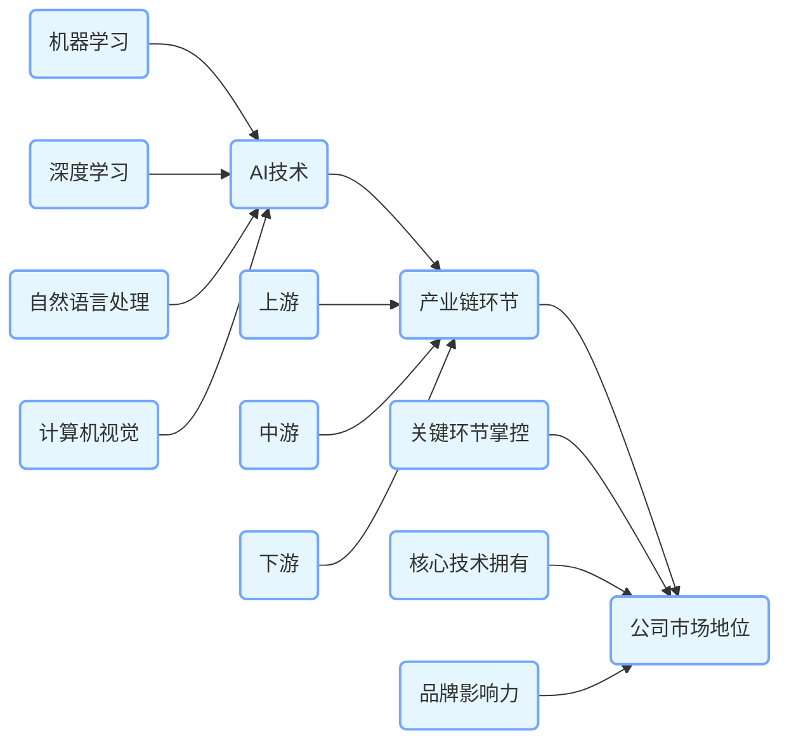

# AI驱动的产业链分析：全面把握公司的市场地位

> 关键词：AI驱动、产业链分析、公司市场地位、竞争优势、产业生态

> 摘要：本文聚焦于AI驱动的产业链分析，旨在帮助读者全面把握公司在市场中的地位。首先介绍了产业链分析的背景，包括目的、预期读者等内容。接着阐述了相关核心概念及其联系，通过示意图和流程图直观展示。详细讲解了核心算法原理和具体操作步骤，并给出Python代码示例。从数学模型和公式角度深入剖析产业链分析的原理，辅以实际例子说明。通过项目实战，搭建开发环境，给出源代码实现并进行解读。探讨了产业链分析在实际中的应用场景，推荐了学习资源、开发工具框架以及相关论文著作。最后总结了未来发展趋势与挑战，还设置了常见问题解答和扩展阅读参考资料，以帮助读者深入理解和应用AI驱动的产业链分析方法。

## 1. 背景介绍 
### 1.1 目的和范围
在当今数字化和智能化的时代，人工智能（AI）技术正以前所未有的速度渗透到各个行业，深刻地改变着产业格局和市场竞争态势。AI驱动的产业链分析的目的在于通过系统地研究产业链上各个环节的相互关系、价值流动以及技术应用情况，准确评估公司在市场中的地位。这不仅有助于公司明确自身的优势和劣势，制定合理的发展战略，还能为投资者、行业分析师等提供决策依据。

本分析的范围涵盖了多个行业中与AI相关的产业链，包括但不限于制造业、医疗保健、金融服务、交通运输等。重点关注产业链上的核心企业、关键技术环节以及新兴的市场参与者，通过对这些元素的研究来揭示产业链的整体结构和动态变化。

### 1.2 预期读者
本文的预期读者包括企业管理者、创业者、投资者、行业分析师以及对AI技术和产业链发展感兴趣的研究人员。企业管理者可以借助本文的分析方法来评估自身公司在产业链中的位置，制定战略规划以提升市场竞争力；创业者可以从中了解AI相关产业的机会和挑战，为创业项目的定位和发展提供参考；投资者可以根据产业链分析结果进行投资决策，寻找具有潜力的投资标的；行业分析师可以将本文作为研究工具，深入剖析行业发展趋势和竞争格局；研究人员则可以在此基础上开展更深入的学术研究。

### 1.3 文档结构概述
本文将按照以下结构展开：首先介绍产业链分析的背景信息，包括目的、预期读者和文档结构概述等；接着阐述AI驱动的产业链分析的核心概念和它们之间的联系，通过文本示意图和Mermaid流程图进行直观展示；然后详细讲解核心算法原理和具体操作步骤，并给出Python代码示例；从数学模型和公式的角度深入分析产业链分析的原理，并通过实际例子进行说明；通过项目实战，介绍开发环境的搭建、源代码的实现和解读；探讨产业链分析在实际中的应用场景；推荐学习资源、开发工具框架以及相关论文著作；最后总结未来发展趋势与挑战，设置常见问题解答和扩展阅读参考资料。

### 1.4 术语表
#### 1.4.1 核心术语定义
- **AI驱动的产业链**：指在产业链的各个环节中广泛应用人工智能技术，通过AI技术的赋能来提升产业链的效率、创新能力和竞争力的产业生态系统。
- **公司市场地位**：指公司在所处市场中的相对位置，包括市场份额、竞争优势、品牌影响力等方面的综合表现。
- **产业链分析**：对产业链上各个环节的企业、技术、市场等要素进行系统研究，以揭示产业链的结构、价值流动和发展趋势的分析方法。
- **竞争优势**：公司在市场竞争中相对于竞争对手所具有的独特优势，如技术优势、成本优势、品牌优势等。
- **产业生态**：由产业链上的企业、供应商、客户、合作伙伴等组成的相互依存、相互作用的生态系统。

#### 1.4.2 相关概念解释
- **价值流**：指产品或服务在产业链中从原材料采购到最终消费的过程中所创造的价值的流动。在AI驱动的产业链中，价值流不仅包括传统的物质产品价值，还包括数据、算法等数字资产所创造的价值。
- **技术壁垒**：指企业在技术研发和应用过程中形成的难以被竞争对手模仿和超越的障碍。在AI领域，技术壁垒通常表现为算法创新、数据资源、计算能力等方面的优势。
- **协同效应**：指产业链上的企业通过合作和协同，实现资源共享、优势互补，从而提高整个产业链的效率和竞争力的效应。

#### 1.4.3 缩略词列表
- **AI**：Artificial Intelligence，人工智能
- **ML**：Machine Learning，机器学习
- **DL**：Deep Learning，深度学习
- **NLP**：Natural Language Processing，自然语言处理
- **CV**：Computer Vision，计算机视觉

## 2. 核心概念与联系 
### 核心概念原理
在AI驱动的产业链分析中，涉及到几个核心概念，它们相互关联，共同构成了产业链分析的基础。

#### AI技术
AI技术是产业链的核心驱动力，主要包括机器学习、深度学习、自然语言处理、计算机视觉等领域。这些技术可以应用于产业链的各个环节，如生产制造、市场营销、客户服务等，以提高效率、降低成本、创新产品和服务。

#### 产业链环节
产业链通常包括上游、中游和下游三个环节。上游主要是原材料供应商、技术研发机构等，提供产业链所需的基础资源和技术支持；中游是核心生产企业，负责产品的制造和加工；下游是销售渠道和终端客户，将产品推向市场并实现价值。

#### 公司市场地位
公司的市场地位取决于其在产业链中的位置和竞争力。在产业链中占据关键环节、拥有核心技术和强大品牌影响力的公司通常具有较高的市场地位。

### 架构的文本示意图
```
AI技术
|
|-- 机器学习
|-- 深度学习
|-- 自然语言处理
|-- 计算机视觉
|
产业链环节
|
|-- 上游：原材料供应商、技术研发机构
|-- 中游：核心生产企业
|-- 下游：销售渠道、终端客户
|
公司市场地位
|
|-- 关键环节掌控
|-- 核心技术拥有
|-- 品牌影响力
```

### Mermaid流程图


这个流程图展示了AI技术、产业链环节和公司市场地位之间的关系。AI技术是产业链的驱动力，影响着产业链环节的发展和运作；产业链环节的状况又决定了公司在市场中的地位。同时，各个核心概念内部的细分元素也相互关联，共同构成了一个完整的产业链分析体系。

## 3. 核心算法原理 & 具体操作步骤 
### 核心算法原理
在AI驱动的产业链分析中，我们可以使用聚类分析算法来对产业链上的企业进行分类，以便更好地理解产业链的结构和企业之间的关系。聚类分析是一种无监督学习算法，它的基本思想是将数据集中的样本按照相似性程度划分为不同的类别，使得同一类别内的样本相似度较高，不同类别之间的样本相似度较低。

常用的聚类算法有K-Means算法，其原理如下：
- 首先，随机选择K个样本作为初始的聚类中心。
- 然后，将每个样本分配到距离最近的聚类中心所在的类别。
- 接着，重新计算每个类别的聚类中心。
- 重复上述步骤，直到聚类中心不再发生变化或达到最大迭代次数。

### 具体操作步骤
#### 步骤1：数据收集
收集产业链上企业的相关数据，如企业的规模、技术实力、市场份额、产品类型等。

#### 步骤2：数据预处理
对收集到的数据进行清洗、归一化等预处理操作，以提高数据的质量和可比性。

#### 步骤3：选择聚类算法和参数
选择K-Means算法，并确定聚类的数量K。

#### 步骤4：进行聚类分析
使用选择的算法对预处理后的数据进行聚类分析。

#### 步骤5：结果分析
分析聚类结果，了解不同类别企业的特征和在产业链中的位置。

### Python源代码实现
```python
import numpy as np
from sklearn.cluster import KMeans
import matplotlib.pyplot as plt

# 步骤1：数据收集
# 假设我们收集到了产业链上10家企业的两个特征数据（规模和技术实力）
data = np.array([
    [10, 8],
    [12, 9],
    [2, 3],
    [3, 2],
    [8, 7],
    [9, 8],
    [1, 1],
    [11, 10],
    [4, 5],
    [5, 4]
])

# 步骤2：数据预处理
# 这里简单地进行归一化处理
from sklearn.preprocessing import MinMaxScaler
scaler = MinMaxScaler()
scaled_data = scaler.fit_transform(data)

# 步骤3：选择聚类算法和参数
# 假设我们选择聚类数量K为3
k = 3
kmeans = KMeans(n_clusters=k)

# 步骤4：进行聚类分析
kmeans.fit(scaled_data)
labels = kmeans.labels_
centroids = kmeans.cluster_centers_

# 步骤5：结果分析
# 可视化聚类结果
plt.scatter(scaled_data[:, 0], scaled_data[:, 1], c=labels, cmap='viridis')
plt.scatter(centroids[:, 0], centroids[:, 1], marker='X', s=200, c='red')
plt.xlabel('Scaled Size')
plt.ylabel('Scaled Technical Strength')
plt.title('K-Means Clustering of Enterprises in the Industry Chain')
plt.show()
```

在上述代码中，我们首先模拟了产业链上企业的特征数据，然后进行了归一化处理。接着使用K-Means算法对数据进行聚类分析，并将聚类结果可视化展示。通过观察聚类结果，我们可以了解不同企业在产业链中的相对位置和相似性，从而更好地分析产业链的结构和企业的市场地位。

## 4. 数学模型和公式 & 详细讲解 & 举例说明 
### 数学模型和公式
#### K-Means算法的目标函数
K-Means算法的目标是最小化所有样本到其所属聚类中心的距离之和，其数学表达式如下：
$$
J = \sum_{i=1}^{n} \sum_{j=1}^{k} r_{ij} \left\lVert x_i - \mu_j \right\rVert^2
$$
其中，$n$ 是样本的数量，$k$ 是聚类的数量，$x_i$ 是第 $i$ 个样本，$\mu_j$ 是第 $j$ 个聚类中心，$r_{ij}$ 是一个指示变量，如果样本 $x_i$ 属于第 $j$ 个聚类，则 $r_{ij} = 1$，否则 $r_{ij} = 0$。

#### 欧氏距离公式
在K-Means算法中，通常使用欧氏距离来计算样本到聚类中心的距离，其公式如下：
$$
d(x, y) = \sqrt{\sum_{i=1}^{m} (x_i - y_i)^2}
$$
其中，$x$ 和 $y$ 是两个 $m$ 维向量，$x_i$ 和 $y_i$ 分别是向量 $x$ 和 $y$ 的第 $i$ 个分量。

### 详细讲解
#### 目标函数的解释
K-Means算法的目标函数 $J$ 衡量了所有样本到其所属聚类中心的距离的平方和。算法的目标是通过不断调整聚类中心的位置，使得 $J$ 的值最小化。当 $J$ 的值不再变化或变化小于某个阈值时，算法收敛，聚类结果确定。

#### 欧氏距离的解释
欧氏距离是最常用的距离度量方法之一，它计算的是两个向量之间的直线距离。在K-Means算法中，使用欧氏距离可以直观地衡量样本和聚类中心之间的相似性，距离越小表示样本和聚类中心越相似。

### 举例说明
假设我们有三个样本 $x_1 = [1, 2]$，$x_2 = [3, 4]$，$x_3 = [5, 6]$，以及两个聚类中心 $\mu_1 = [2, 3]$，$\mu_2 = [4, 5]$。我们来计算样本 $x_1$ 到两个聚类中心的欧氏距离。

对于 $\mu_1$：
$$
d(x_1, \mu_1) = \sqrt{(1 - 2)^2 + (2 - 3)^2} = \sqrt{(-1)^2 + (-1)^2} = \sqrt{2}
$$

对于 $\mu_2$：
$$
d(x_1, \mu_2) = \sqrt{(1 - 4)^2 + (2 - 5)^2} = \sqrt{(-3)^2 + (-3)^2} = \sqrt{18}
$$

由于 $d(x_1, \mu_1) < d(x_1, \mu_2)$，所以样本 $x_1$ 更有可能被分配到以 $\mu_1$ 为中心的聚类中。

在K-Means算法的迭代过程中，会不断地重新计算聚类中心和样本的分配，直到目标函数 $J$ 收敛。通过这种方式，算法可以将样本划分为不同的聚类，从而实现对产业链上企业的分类分析。

## 5. 项目实战：代码实际案例和详细解释说明 
### 5.1  开发环境搭建
#### 操作系统
本项目可以在多种操作系统上进行开发，如Windows、Linux（Ubuntu、CentOS等）、macOS。这里以Windows 10为例进行说明。

#### Python环境安装
首先，需要安装Python 3.x版本。可以从Python官方网站（https://www.python.org/downloads/）下载适合Windows系统的安装包，按照安装向导进行安装。在安装过程中，记得勾选“Add Python to PATH”选项，以便在命令行中可以直接使用Python命令。

#### 依赖库安装
使用pip（Python包管理工具）安装项目所需的依赖库，主要包括NumPy、pandas、scikit-learn、matplotlib等。在命令行中执行以下命令：
```sh
pip install numpy pandas scikit-learn matplotlib
```

### 5.2  源代码详细实现和代码解读
#### 数据收集和预处理
```python
import pandas as pd
from sklearn.preprocessing import StandardScaler

# 假设我们从CSV文件中读取产业链上企业的数据
data = pd.read_csv('industry_chain_data.csv')

# 选择需要分析的特征列
features = data[['size', 'tech_strength', 'market_share']]

# 数据预处理：标准化处理
scaler = StandardScaler()
scaled_features = scaler.fit_transform(features)
```
代码解读：
- 首先使用`pandas`库读取CSV文件中的数据。
- 选择需要分析的特征列，这里假设选择了企业的规模、技术实力和市场份额。
- 使用`StandardScaler`对特征数据进行标准化处理，使得数据的均值为0，标准差为1，以消除不同特征之间的量纲影响。

#### 聚类分析
```python
from sklearn.cluster import KMeans

# 选择聚类数量K
k = 4

# 创建K-Means模型
kmeans = KMeans(n_clusters=k, random_state=42)

# 进行聚类分析
kmeans.fit(scaled_features)

# 获取聚类标签
labels = kmeans.labels_

# 将聚类标签添加到原始数据中
data['cluster'] = labels
```
代码解读：
- 选择聚类数量 $K$ 为4，这里可以根据实际情况进行调整。
- 创建K-Means模型，并指定随机种子`random_state`以保证结果的可重复性。
- 使用`fit`方法对标准化后的特征数据进行聚类分析。
- 获取聚类标签，并将其添加到原始数据中，方便后续分析。

#### 结果可视化
```python
import matplotlib.pyplot as plt
from mpl_toolkits.mplot3d import Axes3D

# 创建3D图形
fig = plt.figure(figsize=(10, 8))
ax = fig.add_subplot(111, projection='3d')

# 根据聚类标签绘制不同颜色的点
ax.scatter(scaled_features[:, 0], scaled_features[:, 1], scaled_features[:, 2], c=labels, cmap='viridis')

# 设置坐标轴标签
ax.set_xlabel('Scaled Size')
ax.set_ylabel('Scaled Tech Strength')
ax.set_zlabel('Scaled Market Share')
ax.set_title('K-Means Clustering of Enterprises in the Industry Chain')

plt.show()
```
代码解读：
- 使用`matplotlib`库创建一个3D图形。
- 根据聚类标签绘制不同颜色的点，直观地展示聚类结果。
- 设置坐标轴标签和图形标题，使图形更具可读性。

### 5.3  代码解读与分析
通过上述代码，我们完成了一个完整的AI驱动的产业链分析项目。首先，我们收集并预处理了产业链上企业的数据，使得数据适合进行聚类分析。然后，使用K-Means算法对企业进行分类，将相似的企业划分到同一个聚类中。最后，通过可视化的方式展示聚类结果，帮助我们直观地理解产业链的结构和企业之间的关系。

从聚类结果中，我们可以分析出不同类别企业的特征。例如，某个聚类中的企业可能规模较大、技术实力较强且市场份额较高，这些企业可能在产业链中占据主导地位；而另一个聚类中的企业可能规模较小、技术实力较弱且市场份额较低，这些企业可能处于产业链的边缘位置。通过对不同聚类企业的深入分析，我们可以全面把握公司在市场中的地位，为企业制定发展战略提供依据。

## 6. 实际应用场景 
### 企业战略规划
企业可以通过AI驱动的产业链分析，了解自身在产业链中的位置和与其他企业的关系。如果企业发现自己处于产业链的上游，且拥有核心技术和资源优势，可以考虑加强与中游和下游企业的合作，扩大市场份额；如果企业处于产业链的下游，面临激烈的市场竞争，可以通过向上游延伸，掌握关键原材料或技术，提高自身的竞争力。

### 投资决策
投资者可以利用产业链分析结果来评估投资标的的潜力。对于在产业链中占据关键环节、具有核心技术和强大品牌影响力的企业，其投资价值通常较高；而对于处于产业链边缘、竞争力较弱的企业，投资风险相对较大。通过对产业链的全面分析，投资者可以做出更明智的投资决策。

### 行业监管
政府和行业监管部门可以通过产业链分析来了解行业的整体状况和发展趋势。对于存在垄断、不正当竞争等问题的环节，可以采取相应的监管措施，维护市场的公平竞争环境；对于新兴的、具有发展潜力的环节，可以出台扶持政策，促进其健康发展。

### 供应链管理
企业可以通过产业链分析优化供应链管理。了解供应商的技术实力、生产能力和市场地位，选择合适的供应商，建立稳定的合作关系；同时，分析下游客户的需求和市场趋势，及时调整生产计划和产品策略，提高供应链的效率和灵活性。

## 7. 工具和资源推荐
### 7.1 学习资源推荐
#### 7.1.1 书籍推荐
- 《人工智能：一种现代的方法》：这是一本经典的人工智能教材，全面介绍了人工智能的各个领域，包括机器学习、自然语言处理、计算机视觉等，适合初学者和有一定基础的读者。
- 《Python机器学习》：本书详细介绍了如何使用Python进行机器学习的开发，包括数据预处理、模型选择、评估和优化等方面的内容，对于想要使用Python进行产业链分析的读者非常有帮助。
- 《产业链经济学》：从经济学的角度深入探讨了产业链的结构、运行机制和发展规律，为产业链分析提供了理论基础。

#### 7.1.2 在线课程
- Coursera上的“机器学习”课程：由斯坦福大学教授Andrew Ng讲授，是全球最受欢迎的机器学习课程之一，内容深入浅出，适合初学者。
- edX上的“人工智能基础”课程：介绍了人工智能的基本概念、算法和应用，帮助学习者建立人工智能的知识体系。
- 中国大学MOOC上的“产业经济学”课程：系统讲解了产业经济学的基本理论和方法，对于理解产业链分析的经济原理有很大帮助。

#### 7.1.3 技术博客和网站
- Medium：上面有很多关于人工智能、机器学习和产业链分析的优质文章，作者来自世界各地的技术专家和研究人员。
- 机器之心：专注于人工智能领域的资讯和技术分享，提供最新的行业动态、技术解读和案例分析。
- 艾瑞网：提供大量的行业研究报告和分析文章，对于了解不同行业的产业链结构和发展趋势有很大帮助。

### 7.2 开发工具框架推荐
#### 7.2.1 IDE和编辑器
- PyCharm：是一款专门为Python开发设计的集成开发环境（IDE），具有代码编辑、调试、自动补全、版本控制等功能，非常适合Python项目的开发。
- Jupyter Notebook：是一个基于网页的交互式开发环境，支持Python、R等多种编程语言。它可以将代码、文本、图表等内容整合在一起，方便进行数据分析和可视化。
- Visual Studio Code：是一款轻量级的代码编辑器，支持多种编程语言和插件扩展。它具有丰富的代码编辑功能和调试功能，适合快速开发和调试Python代码。

#### 7.2.2 调试和性能分析工具
- Py-Spy：是一个用于Python代码性能分析的工具，可以实时监测Python程序的CPU使用率、函数调用时间等信息，帮助开发者找出性能瓶颈。
- PDB：是Python自带的调试器，可以在代码中设置断点，逐步执行代码，查看变量的值和程序的执行流程，方便调试代码。
- cProfile：是Python标准库中的一个性能分析模块，可以统计程序中各个函数的调用次数、执行时间等信息，帮助开发者优化代码性能。

#### 7.2.3 相关框架和库
- Scikit-learn：是一个开源的机器学习库，提供了丰富的机器学习算法和工具，如分类、回归、聚类等算法，以及数据预处理、模型选择和评估等功能。
- TensorFlow：是Google开发的一个开源深度学习框架，支持多种深度学习模型的构建和训练，如神经网络、卷积神经网络、循环神经网络等。
- Pandas：是一个用于数据处理和分析的Python库，提供了高效的数据结构和数据操作方法，如DataFrame和Series，方便进行数据清洗、转换和分析。

### 7.3 相关论文著作推荐
#### 7.3.1 经典论文
- “A Method for Solving General Constraint Satisfaction Problems”：介绍了约束满足问题的求解方法，对于理解和应用聚类分析等算法有重要意义。
- “ImageNet Classification with Deep Convolutional Neural Networks”：提出了AlexNet模型，开启了深度学习在计算机视觉领域的应用热潮，对于理解AI技术在产业链中的应用有参考价值。
- “Mastering the Game of Go with Deep Neural Networks and Tree Search”：介绍了AlphaGo的技术原理，展示了深度学习和强化学习在复杂决策问题中的应用，为产业链分析中的决策优化提供了思路。

#### 7.3.2 最新研究成果
- 关注顶级学术会议如NeurIPS（神经信息处理系统大会）、ICML（国际机器学习会议）、CVPR（计算机视觉与模式识别会议）等上的最新研究成果，了解AI技术的前沿发展动态。
- 查阅知名学术期刊如Journal of Artificial Intelligence Research（JAIR）、Artificial Intelligence等上的论文，获取关于AI驱动的产业链分析的最新理论和方法。

#### 7.3.3 应用案例分析
- 研究行业报告和商业案例，了解AI技术在不同行业产业链中的应用实践和效果。例如，麦肯锡、波士顿咨询等咨询公司发布的行业研究报告，提供了大量的实际案例和数据分析。
- 关注知名企业的技术博客和公开演讲，了解他们在AI驱动的产业链分析和应用方面的经验和成果。例如，谷歌、亚马逊、阿里巴巴等公司经常分享他们在人工智能和产业链优化方面的实践经验。

## 8. 总结：未来发展趋势与挑战
### 未来发展趋势
#### AI技术的深度融合
未来，AI技术将与产业链的各个环节实现更深度的融合。在生产制造环节，通过AI技术实现智能制造，提高生产效率和质量；在市场营销环节，利用AI技术进行精准营销，提高客户满意度和市场份额；在供应链管理环节，借助AI技术实现智能供应链，优化物流配送和库存管理。

#### 产业链的数字化转型
随着数字经济的发展，产业链将加速数字化转型。企业将更加注重数据的收集、分析和应用，通过数字化手段提升企业的管理水平和竞争力。同时，产业链上的企业之间将加强数字化合作，实现数据共享和业务协同，提高整个产业链的效率和创新能力。

#### 产业生态的开放与协同
未来的产业链将形成更加开放和协同的产业生态。企业将不再局限于自身的发展，而是与产业链上的其他企业、科研机构、高校等建立广泛的合作关系，共同开展技术研发、产品创新和市场拓展。通过产业生态的开放与协同，实现资源共享、优势互补，推动产业链的整体发展。

### 挑战
#### 数据隐私和安全问题
在AI驱动的产业链分析中，需要收集和处理大量的企业和客户数据。这些数据涉及到企业的商业机密和客户的个人隐私，一旦泄露将带来严重的后果。因此，如何保障数据的隐私和安全是一个亟待解决的问题。

#### 技术人才短缺
AI技术的发展需要大量的专业人才，包括算法工程师、数据科学家、机器学习专家等。然而，目前市场上这类人才相对短缺，企业难以招聘到足够的技术人才来推动AI技术在产业链中的应用。

#### 伦理和法律问题
AI技术的应用也带来了一系列伦理和法律问题，如算法歧视、人工智能的责任认定等。如何制定相应的伦理准则和法律法规，规范AI技术的应用，是未来需要面对的挑战。

## 9. 附录：常见问题与解答
### 问题1：如何确定聚类数量K？
答：确定聚类数量K是一个比较关键的问题，常见的方法有以下几种：
- 手肘法：通过绘制不同K值下的聚类误差（如目标函数 $J$ 的值）与K的关系曲线，找到曲线的“手肘”位置，该位置对应的K值通常是比较合适的聚类数量。
- 轮廓系数法：计算每个样本的轮廓系数，轮廓系数越接近1表示样本聚类效果越好。通过尝试不同的K值，选择轮廓系数最大的K值作为聚类数量。

### 问题2：如果数据中存在缺失值，应该如何处理？
答：处理数据中的缺失值可以采用以下方法：
- 删除含有缺失值的样本：如果缺失值的比例较小，可以直接删除含有缺失值的样本，但这种方法可能会导致数据量减少。
- 填充缺失值：可以使用均值、中位数、众数等统计量来填充缺失值；也可以使用机器学习算法（如决策树、随机森林等）来预测缺失值。

### 问题3：AI驱动的产业链分析对企业的技术要求高吗？
答：AI驱动的产业链分析对企业的技术要求有一定的门槛，但并不是非常高。企业可以根据自身的实际情况选择合适的分析方法和工具。对于一些简单的分析，可以使用开源的机器学习库（如Scikit-learn）和数据分析工具（如Pandas）；对于复杂的分析，可以与专业的科研机构或技术公司合作，借助他们的技术力量来完成。

## 10. 扩展阅读 & 参考资料
### 扩展阅读
- 《创新者的窘境》：探讨了企业在面对技术创新和市场变化时的困境和应对策略，对于理解产业链中的企业创新和竞争有一定的启示。
- 《智能时代》：介绍了人工智能技术对社会和经济的影响，以及未来智能时代的发展趋势，帮助读者拓宽视野，了解AI技术的广泛应用。

### 参考资料
- 李航. 《统计学习方法》. 清华大学出版社.
- 周志华. 《机器学习》. 清华大学出版社.
- 产业链相关的行业研究报告和统计数据，可以从政府部门、行业协会、咨询公司等渠道获取。

作者：AI天才研究院/AI Genius Institute & 禅与计算机程序设计艺术 /Zen And The Art of Computer Programming