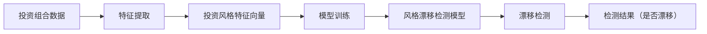

# AI驱动的价值投资策略风格漂移检测

> 关键词：AI、价值投资策略、风格漂移检测、机器学习、量化分析

> 摘要：本文聚焦于AI驱动的价值投资策略风格漂移检测。首先介绍了研究的背景、目的、预期读者和文档结构，对相关术语进行了清晰定义。详细阐述了核心概念及它们之间的联系，通过文本示意图和Mermaid流程图进行直观展示。深入讲解了核心算法原理，并给出Python源代码示例。介绍了相关数学模型和公式，结合具体例子进行说明。通过项目实战，从开发环境搭建到源代码实现与解读，全面展示了如何运用AI技术进行风格漂移检测。探讨了该技术在实际投资中的应用场景，推荐了学习资源、开发工具框架和相关论文著作。最后总结了未来发展趋势与挑战，提供了常见问题解答和扩展阅读参考资料，旨在为投资者和研究人员提供全面深入的技术指导。

## 1. 背景介绍 
### 1.1 目的和范围
在价值投资领域，投资策略的风格稳定性至关重要。然而，由于市场环境的动态变化、基金经理的决策调整等因素，投资策略可能会发生风格漂移。这种漂移可能导致投资组合的风险特征和预期收益与投资者的最初预期不一致。本研究的目的在于利用AI技术构建一套有效的价值投资策略风格漂移检测系统，帮助投资者及时发现策略风格的变化，以便做出合理的投资决策。

本研究的范围涵盖了多种常见的价值投资策略，包括但不限于基于基本面分析的策略、成长价值策略等。同时，考虑了不同市场环境下的风格漂移情况，旨在提供具有广泛适用性的检测方法。

### 1.2 预期读者
本文的预期读者主要包括金融投资领域的从业者，如基金经理、投资顾问等，他们可以利用该检测方法监控投资策略的稳定性，优化投资组合。同时，也适合对量化投资和AI技术感兴趣的研究人员，为他们在相关领域的研究提供参考。此外，有一定投资知识的个人投资者也可以通过本文了解如何运用AI技术评估投资策略的风格变化。

### 1.3 文档结构概述
本文共分为十个部分。第一部分为背景介绍，阐述了研究的目的、范围、预期读者和文档结构。第二部分介绍核心概念与联系，通过文本示意图和Mermaid流程图展示关键概念的原理和架构。第三部分详细讲解核心算法原理，并给出Python源代码示例。第四部分介绍相关数学模型和公式，结合具体例子进行说明。第五部分通过项目实战，从开发环境搭建到源代码实现与解读，全面展示如何运用AI技术进行风格漂移检测。第六部分探讨该技术在实际投资中的应用场景。第七部分推荐学习资源、开发工具框架和相关论文著作。第八部分总结未来发展趋势与挑战。第九部分为附录，提供常见问题解答。第十部分列出扩展阅读和参考资料。

### 1.4 术语表
#### 1.4.1 核心术语定义
- **价值投资策略**：一种基于对股票内在价值评估的投资方法，投资者通过分析公司的基本面，如财务报表、行业前景等，寻找被低估的股票进行投资。
- **风格漂移**：指投资组合的实际投资风格与最初设定的投资风格发生偏离的现象。例如，原本设定为价值型投资的组合，由于投资决策的变化，逐渐偏向成长型投资。
- **AI驱动**：利用人工智能技术，如机器学习、深度学习等，对数据进行分析和处理，以实现特定的目标，如风格漂移检测。
- **量化分析**：运用数学和统计学方法对金融数据进行分析，以评估投资策略的绩效和风险。

#### 1.4.2 相关概念解释
- **机器学习**：是一门多领域交叉学科，涉及概率论、统计学、逼近论、凸分析、算法复杂度理论等多门学科。它专门研究计算机怎样模拟或实现人类的学习行为，以获取新的知识或技能，重新组织已有的知识结构使之不断改善自身的性能。在风格漂移检测中，机器学习算法可以通过对历史数据的学习，建立模型来预测和检测风格漂移。
- **特征工程**：是将原始数据转化为更适合机器学习模型的特征的过程。在价值投资策略风格漂移检测中，特征工程包括选择合适的金融指标，如市盈率、市净率、营收增长率等，并对这些指标进行预处理，如标准化、归一化等。

#### 1.4.3 缩略词列表
- **ML**：Machine Learning，机器学习
- **DL**：Deep Learning，深度学习
- **PE**：Price-to-Earnings Ratio，市盈率
- **PB**：Price-to-Book Ratio，市净率

## 2. 核心概念与联系 
### 核心概念原理
价值投资策略风格漂移检测的核心在于通过对投资组合的特征进行分析，判断其是否偏离了最初设定的投资风格。主要涉及以下几个核心概念：

- **投资风格特征**：投资风格可以通过一系列金融指标来刻画，如市盈率（PE）、市净率（PB）、股息率等。不同的投资风格在这些指标上表现出不同的特征。例如，价值型投资通常偏好低PE、低PB的股票，而成长型投资则更关注高营收增长率的股票。
- **特征提取**：从投资组合的历史数据中提取与投资风格相关的特征。这些特征可以是单个金融指标，也可以是多个指标的组合。特征提取的目的是将复杂的投资组合数据转化为可以用于分析的特征向量。
- **模型训练**：利用机器学习算法对提取的特征进行训练，建立风格漂移检测模型。常见的机器学习算法包括支持向量机（SVM）、决策树、神经网络等。模型训练的过程是让算法学习正常投资风格下的特征模式，以便在出现风格漂移时能够识别出来。
- **漂移检测**：将实时的投资组合特征输入到训练好的模型中，判断是否发生风格漂移。如果模型输出的结果表明当前的特征模式与正常投资风格下的特征模式差异较大，则认为发生了风格漂移。

### 文本示意图
```plaintext
投资组合数据
    |
    |-- 特征提取
    |       |
    |       |-- 投资风格特征向量
    |               |
    |               |-- 模型训练
    |               |       |
    |               |       |-- 风格漂移检测模型
    |               |               |
    |               |               |-- 漂移检测
    |               |                       |
    |               |                       |-- 检测结果（是否漂移）
```

### Mermaid流程图


## 3. 核心算法原理 & 具体操作步骤 
### 核心算法原理
本研究采用支持向量机（SVM）作为核心算法进行风格漂移检测。支持向量机是一种二分类模型，其基本思想是在特征空间中找到一个最优的超平面，将不同类别的样本分开。在风格漂移检测中，我们将正常投资风格的样本标记为一类，发生风格漂移的样本标记为另一类，通过SVM模型学习这两类样本的特征模式，从而实现漂移检测。

### 具体操作步骤
#### 步骤1：数据收集与预处理
收集投资组合的历史数据，包括股票代码、交易日期、持仓数量、金融指标等。对数据进行清洗，去除缺失值和异常值，并进行标准化处理，使不同金融指标具有相同的尺度。

#### 步骤2：特征提取
从预处理后的数据中提取与投资风格相关的特征，如PE、PB、股息率等。可以将这些特征组合成一个特征向量，作为模型的输入。

#### 步骤3：模型训练
将特征向量和对应的标签（正常或漂移）作为训练数据，使用SVM算法进行模型训练。在训练过程中，需要选择合适的核函数和参数，以提高模型的性能。

#### 步骤4：漂移检测
将实时的投资组合特征向量输入到训练好的SVM模型中，模型输出分类结果，判断是否发生风格漂移。

### Python源代码示例
```python
import numpy as np
from sklearn.svm import SVC
from sklearn.preprocessing import StandardScaler
from sklearn.model_selection import train_test_split

# 步骤1：数据收集与预处理
# 假设我们已经有了特征矩阵X和标签向量y
X = np.random.rand(100, 5)  # 100个样本，每个样本有5个特征
y = np.random.randint(0, 2, 100)  # 标签：0表示正常，1表示漂移

# 数据标准化
scaler = StandardScaler()
X_scaled = scaler.fit_transform(X)

# 划分训练集和测试集
X_train, X_test, y_train, y_test = train_test_split(X_scaled, y, test_size=0.2, random_state=42)

# 步骤2：模型训练
# 创建SVM模型
svm_model = SVC(kernel='rbf', C=1.0, gamma='scale')

# 训练模型
svm_model.fit(X_train, y_train)

# 步骤3：漂移检测
# 预测测试集
y_pred = svm_model.predict(X_test)

# 输出预测结果
print("预测结果：", y_pred)
```

## 4. 数学模型和公式 & 详细讲解 & 举例说明 
### 支持向量机数学模型
支持向量机的目标是在特征空间中找到一个最优的超平面，使得不同类别的样本能够被最大程度地分开。对于二分类问题，假设训练数据集为 $\{(x_1, y_1), (x_2, y_2), \cdots, (x_n, y_n)\}$，其中 $x_i \in \mathbb{R}^d$ 是特征向量，$y_i \in \{-1, +1\}$ 是对应的标签。

超平面的方程可以表示为：
$$
w^T x + b = 0
$$
其中 $w \in \mathbb{R}^d$ 是超平面的法向量，$b \in \mathbb{R}$ 是偏置项。

支持向量机的优化目标是最大化分类间隔，即：
$$
\begin{aligned}
\max_{w, b} &\quad \frac{2}{\|w\|} \\
\text{s.t.} &\quad y_i(w^T x_i + b) \geq 1, \quad i = 1, 2, \cdots, n
\end{aligned}
$$
为了方便求解，通常将上述问题转化为其对偶问题：
$$
\begin{aligned}
\max_{\alpha} &\quad \sum_{i=1}^{n} \alpha_i - \frac{1}{2} \sum_{i=1}^{n} \sum_{j=1}^{n} \alpha_i \alpha_j y_i y_j x_i^T x_j \\
\text{s.t.} &\quad \sum_{i=1}^{n} \alpha_i y_i = 0 \\
&\quad \alpha_i \geq 0, \quad i = 1, 2, \cdots, n
\end{aligned}
$$
其中 $\alpha = (\alpha_1, \alpha_2, \cdots, \alpha_n)^T$ 是拉格朗日乘子。

### 核函数
在实际应用中，为了处理非线性可分的问题，通常会引入核函数。核函数的作用是将低维特征空间映射到高维特征空间，使得样本在高维空间中变得线性可分。常见的核函数包括线性核、多项式核、径向基核（RBF）等。

径向基核函数的定义为：
$$
K(x_i, x_j) = \exp\left(-\frac{\|x_i - x_j\|^2}{2\sigma^2}\right)
$$
其中 $\sigma$ 是核函数的带宽参数。

### 举例说明
假设我们有一个二维特征空间中的数据集，包含两个类别：正类和负类。我们可以使用支持向量机来找到一个最优的超平面将这两个类别分开。

```python
import numpy as np
import matplotlib.pyplot as plt
from sklearn import svm

# 生成数据集
np.random.seed(0)
X = np.r_[np.random.randn(20, 2) - [2, 2], np.random.randn(20, 2) + [2, 2]]
Y = [0] * 20 + [1] * 20

# 创建SVM模型
clf = svm.SVC(kernel='linear')
clf.fit(X, Y)

# 绘制决策边界
plt.scatter(X[:, 0], X[:, 1], c=Y, cmap=plt.cm.Paired)
ax = plt.gca()
xlim = ax.get_xlim()
ylim = ax.get_ylim()

# 创建网格点
xx = np.linspace(xlim[0], xlim[1], 30)
yy = np.linspace(ylim[0], ylim[1], 30)
YY, XX = np.meshgrid(yy, xx)
xy = np.vstack([XX.ravel(), YY.ravel()]).T
Z = clf.decision_function(xy).reshape(XX.shape)

# 绘制决策边界和间隔边界
ax.contour(XX, YY, Z, colors='k', levels=[-1, 0, 1], alpha=0.5, linestyles=['--', '-', '--'])

# 绘制支持向量
ax.scatter(clf.support_vectors_[:, 0], clf.support_vectors_[:, 1], s=100, linewidth=1, facecolors='none', edgecolors='k')
plt.show()
```

在上述代码中，我们生成了一个二维数据集，并使用线性核的支持向量机对其进行分类。最后，我们绘制了决策边界和支持向量，直观地展示了支持向量机的工作原理。

## 5. 项目实战：代码实际案例和详细解释说明 
### 5.1  开发环境搭建
#### 操作系统
本项目可以在Windows、Linux或Mac OS等主流操作系统上进行开发。建议使用Linux系统，因为它在数据处理和机器学习开发方面具有较好的性能和稳定性。

#### 编程语言和环境
- **Python**：Python是一种广泛应用于数据科学和机器学习领域的编程语言，具有丰富的库和工具。建议使用Python 3.7及以上版本。
- **Anaconda**：Anaconda是一个开源的Python发行版，包含了Python解释器、常用的科学计算库和开发工具。可以从Anaconda官方网站下载并安装。

#### 安装必要的库
在安装好Anaconda后，可以使用以下命令安装项目所需的库：
```bash
pip install numpy pandas scikit-learn matplotlib
```

### 5.2  源代码详细实现和代码解读
#### 数据收集与预处理
```python
import pandas as pd
import numpy as np
from sklearn.preprocessing import StandardScaler

# 读取数据
data = pd.read_csv('portfolio_data.csv')

# 提取特征和标签
X = data.drop('label', axis=1).values
y = data['label'].values

# 数据标准化
scaler = StandardScaler()
X_scaled = scaler.fit_transform(X)
```
**代码解读**：首先，我们使用`pandas`库读取投资组合数据文件`portfolio_data.csv`。然后，将特征和标签分别提取出来，存储在`X`和`y`中。最后，使用`StandardScaler`对特征数据进行标准化处理，使得不同特征具有相同的尺度。

#### 模型训练
```python
from sklearn.svm import SVC
from sklearn.model_selection import train_test_split

# 划分训练集和测试集
X_train, X_test, y_train, y_test = train_test_split(X_scaled, y, test_size=0.2, random_state=42)

# 创建SVM模型
svm_model = SVC(kernel='rbf', C=1.0, gamma='scale')

# 训练模型
svm_model.fit(X_train, y_train)
```
**代码解读**：使用`train_test_split`函数将标准化后的特征数据和标签数据划分为训练集和测试集，其中测试集占比为20%。然后，创建一个径向基核的支持向量机模型`SVC`，并使用训练集数据对模型进行训练。

#### 漂移检测
```python
# 预测测试集
y_pred = svm_model.predict(X_test)

# 输出预测结果
print("预测结果：", y_pred)
```
**代码解读**：使用训练好的SVM模型对测试集数据进行预测，得到预测结果`y_pred`，并将其输出。

### 5.3  代码解读与分析
#### 数据预处理的重要性
数据预处理是机器学习项目中非常重要的一步。在本项目中，我们对特征数据进行了标准化处理，这是因为不同的金融指标可能具有不同的尺度和范围，如果不进行标准化处理，可能会导致某些特征在模型训练中占据主导地位，从而影响模型的性能。

#### 模型选择和参数调优
支持向量机是一种强大的分类模型，但不同的核函数和参数设置会对模型的性能产生影响。在本项目中，我们选择了径向基核（RBF）作为核函数，并使用默认的参数设置。在实际应用中，可以通过交叉验证等方法对模型的参数进行调优，以提高模型的性能。

#### 模型评估
在完成模型训练和预测后，需要对模型的性能进行评估。常见的评估指标包括准确率、精确率、召回率、F1值等。可以使用`scikit-learn`库中的相关函数对模型的性能进行评估。
```python
from sklearn.metrics import accuracy_score, precision_score, recall_score, f1_score

# 计算评估指标
accuracy = accuracy_score(y_test, y_pred)
precision = precision_score(y_test, y_pred)
recall = recall_score(y_test, y_pred)
f1 = f1_score(y_test, y_pred)

print("准确率：", accuracy)
print("精确率：", precision)
print("召回率：", recall)
print("F1值：", f1)
```

## 6. 实际应用场景 
### 基金管理公司
基金管理公司可以使用AI驱动的价值投资策略风格漂移检测系统来监控旗下基金的投资风格稳定性。及时发现风格漂移情况，有助于基金经理调整投资组合，确保基金的投资风格与产品定位一致，提高基金的业绩和投资者满意度。

### 投资顾问
投资顾问可以利用该检测系统为客户提供更专业的投资建议。通过监测客户投资组合的风格变化，及时提醒客户调整投资策略，降低投资风险。

### 个人投资者
个人投资者可以使用该系统对自己的投资组合进行风格漂移检测，了解自己的投资风格是否发生变化，以便做出合理的投资决策。例如，如果发现自己的投资组合逐渐偏离了价值投资风格，可以考虑调整持仓，回归到自己的投资目标。

## 7. 工具和资源推荐
### 7.1 学习资源推荐
#### 7.1.1 书籍推荐
- 《机器学习》（周志华）：全面介绍了机器学习的基本概念、算法和应用，是机器学习领域的经典教材。
- 《Python数据分析实战》（Sebastian Raschka）：详细介绍了使用Python进行数据分析和机器学习的方法和技巧，适合初学者入门。
- 《金融数据分析与挖掘》（Ruppert D.）：结合金融领域的实际案例，介绍了数据分析和挖掘技术在金融领域的应用，对金融量化分析有很好的指导作用。

#### 7.1.2 在线课程
- Coursera上的“机器学习”课程（Andrew Ng）：由斯坦福大学教授Andrew Ng主讲，是机器学习领域最受欢迎的在线课程之一。
- edX上的“Python for Data Science”课程：介绍了使用Python进行数据分析的基本方法和工具。
- 网易云课堂上的“量化投资实战”课程：结合实际案例，介绍了量化投资的基本原理和方法。

#### 7.1.3 技术博客和网站
- Medium：一个开放的技术博客平台，上面有很多关于机器学习、数据分析和金融科技的优秀文章。
- Kaggle：一个数据科学竞赛平台，上面有很多公开的数据集和优秀的解决方案，可以学习到很多实际应用中的技巧和方法。
- Towards Data Science：专注于数据科学和机器学习领域的技术博客，提供了很多有深度的技术文章和案例分析。

### 7.2 开发工具框架推荐
#### 7.2.1 IDE和编辑器
- PyCharm：一款专业的Python集成开发环境，具有强大的代码编辑、调试和项目管理功能。
- Jupyter Notebook：一个交互式的开发环境，适合进行数据探索和模型实验。
- Visual Studio Code：一款轻量级的代码编辑器，支持多种编程语言和插件扩展，在数据科学和机器学习领域也有广泛的应用。

#### 7.2.2 调试和性能分析工具
- Py-Spy：一个用于Python程序性能分析的工具，可以帮助开发者找出程序中的性能瓶颈。
- Scikit-learn中的交叉验证工具：可以用于模型的参数调优和性能评估，帮助开发者选择最优的模型和参数。
- TensorBoard：一个用于深度学习模型可视化和调试的工具，可以帮助开发者直观地了解模型的训练过程和性能。

#### 7.2.3 相关框架和库
- Scikit-learn：一个开源的机器学习库，提供了丰富的机器学习算法和工具，包括分类、回归、聚类等。
- TensorFlow：一个开源的深度学习框架，广泛应用于图像识别、自然语言处理等领域。
- PyTorch：另一个开源的深度学习框架，具有简洁易用的特点，受到很多研究人员和开发者的喜爱。

### 7.3 相关论文著作推荐
#### 7.3.1 经典论文
- “Support-Vector Networks”（Cortes C., Vapnik V.）：支持向量机领域的经典论文，详细介绍了支持向量机的基本原理和算法。
- “Gradient-Based Learning Applied to Document Recognition”（LeCun Y., Bottou L., Bengio Y., Haffner P.）：卷积神经网络领域的经典论文，为图像识别和深度学习的发展奠定了基础。

#### 7.3.2 最新研究成果
- 可以关注顶级学术会议如NeurIPS、ICML、KDD等上的相关研究论文，了解AI驱动的价值投资策略风格漂移检测领域的最新研究进展。
- 一些知名学术期刊如《Journal of Financial Economics》《Review of Financial Studies》等也会发表相关的研究成果。

#### 7.3.3 应用案例分析
- 可以参考一些金融科技公司的研究报告和案例分析，了解他们在实际应用中如何使用AI技术进行投资策略风格漂移检测。例如，一些量化投资公司会分享他们的投资策略和技术实现细节。

## 8. 总结：未来发展趋势与挑战
### 未来发展趋势
- **多模态数据融合**：未来的风格漂移检测系统可能会融合更多类型的数据，如文本数据（新闻、研报等）、图像数据（公司财报图表等），以更全面地评估投资策略的风格变化。
- **深度学习的应用**：随着深度学习技术的不断发展，深度神经网络可能会在风格漂移检测中得到更广泛的应用。深度学习模型可以自动提取更复杂的特征，提高检测的准确性。
- **实时监测和预警**：为了满足投资者的实时需求，未来的检测系统可能会实现实时监测和预警功能，及时发现风格漂移情况并发出警报。

### 挑战
- **数据质量和获取**：高质量的数据是AI驱动的风格漂移检测系统的基础。然而，金融数据往往存在噪声、缺失值等问题，并且获取某些数据可能需要支付高昂的费用。如何提高数据质量和获取效率是一个挑战。
- **模型解释性**：一些复杂的AI模型，如深度学习模型，往往缺乏良好的解释性。在金融领域，投资者和监管机构通常需要了解模型的决策过程和依据。如何提高模型的解释性是一个亟待解决的问题。
- **市场环境变化**：金融市场环境是动态变化的，投资策略的风格也可能随着市场环境的变化而发生合理的调整。如何区分正常的风格调整和风格漂移是一个挑战。

## 9. 附录：常见问题与解答
### 问题1：支持向量机模型的参数如何选择？
答：支持向量机模型的参数主要包括核函数、惩罚因子 $C$ 和核函数的参数（如RBF核的 $\gamma$）。可以使用交叉验证的方法对这些参数进行调优。例如，在`scikit-learn`库中，可以使用`GridSearchCV`函数对参数进行网格搜索，找到最优的参数组合。

### 问题2：如何处理数据中的缺失值？
答：处理数据中的缺失值有多种方法，常见的方法包括删除含有缺失值的样本、使用均值或中位数填充缺失值、使用机器学习模型预测缺失值等。具体选择哪种方法需要根据数据的特点和问题的需求来决定。

### 问题3：如何评估风格漂移检测模型的性能？
答：可以使用多种评估指标来评估风格漂移检测模型的性能，如准确率、精确率、召回率、F1值等。此外，还可以绘制ROC曲线和混淆矩阵，直观地展示模型的性能。

## 10. 扩展阅读 & 参考资料
### 扩展阅读
- 《人工智能时代的投资策略》：探讨了人工智能技术在投资领域的应用和发展趋势。
- 《量化投资：策略与技术》：详细介绍了量化投资的基本原理、策略和技术实现。

### 参考资料
- 《机器学习实战》（Peter Harrington）
- 《Python机器学习》（Sebastian Raschka）
- 《金融机器学习入门》（Marcos Lopez de Prado）

作者：AI天才研究院/AI Genius Institute & 禅与计算机程序设计艺术 /Zen And The Art of Computer Programming