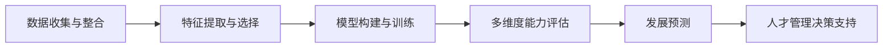

# AI驱动的企业人才画像系统：多维度能力评估与发展预测

> 关键词：AI、企业人才画像系统、多维度能力评估、发展预测、人力资源管理

> 摘要：本文深入探讨了AI驱动的企业人才画像系统，该系统旨在通过多维度能力评估实现对企业人才的精准刻画，并对其职业发展进行有效预测。文章首先介绍了该系统的背景，包括目的、预期读者、文档结构和相关术语。接着阐述了核心概念与联系，通过文本示意图和Mermaid流程图展示其架构原理。详细讲解了核心算法原理及具体操作步骤，结合Python源代码进行说明。还给出了数学模型和公式，并举例分析。通过项目实战，包括开发环境搭建、源代码实现与解读，进一步说明系统的实际应用。探讨了该系统在企业中的实际应用场景，推荐了相关的学习资源、开发工具框架和论文著作。最后总结了系统的未来发展趋势与挑战，提供了常见问题解答和扩展阅读参考资料，为企业构建和应用人才画像系统提供全面的技术指导。

## 1. 背景介绍 
### 1.1 目的和范围
在当今竞争激烈的商业环境中，企业的成功越来越依赖于拥有高素质的人才。传统的人才评估和管理方式往往存在主观性强、效率低下等问题，难以满足企业对人才精准识别和有效发展的需求。AI驱动的企业人才画像系统的目的在于利用先进的人工智能技术，对企业人才进行全面、客观、精准的多维度能力评估，并基于评估结果对人才的职业发展进行科学预测。

本系统的范围涵盖了从数据收集、清洗、分析到模型构建、评估和应用的全流程，涉及企业内部多个部门的人才信息，包括但不限于员工的工作绩效、技能水平、学习能力、团队协作能力等多个维度。通过构建人才画像，企业可以更好地了解员工的优势和不足，为人才的招聘、培训、晋升等人力资源管理决策提供有力支持。

### 1.2 预期读者
本文的预期读者主要包括企业的人力资源管理人员、企业管理者、AI技术开发者以及对企业人才管理和人工智能应用感兴趣的研究人员。人力资源管理人员可以通过本文了解如何利用AI技术提升人才管理的效率和精准度；企业管理者可以从中获取关于人才战略规划和决策的有益信息；AI技术开发者可以借鉴文中的算法和实现思路，开发出更适合企业需求的人才画像系统；研究人员则可以将本文作为研究企业人才管理和人工智能交叉领域的参考资料。

### 1.3 文档结构概述
本文将按照以下结构进行阐述：首先介绍AI驱动的企业人才画像系统的背景信息，包括目的、预期读者、文档结构和相关术语；接着深入探讨系统的核心概念与联系，通过文本示意图和Mermaid流程图展示其架构原理；详细讲解核心算法原理及具体操作步骤，结合Python源代码进行说明；给出系统所涉及的数学模型和公式，并举例分析；通过项目实战，包括开发环境搭建、源代码实现与解读，进一步说明系统的实际应用；探讨该系统在企业中的实际应用场景；推荐相关的学习资源、开发工具框架和论文著作；最后总结系统的未来发展趋势与挑战，提供常见问题解答和扩展阅读参考资料。

### 1.4 术语表
#### 1.4.1 核心术语定义
- **AI（Artificial Intelligence）**：人工智能，是研究、开发用于模拟、延伸和扩展人的智能的理论、方法、技术及应用系统的一门新的技术科学。
- **企业人才画像系统**：利用大数据和人工智能技术，对企业人才的多维度信息进行收集、分析和整合，构建出具有代表性的人才特征模型，以实现对人才的精准识别和评估。
- **多维度能力评估**：从多个方面对人才的能力进行全面、客观的评价，包括但不限于专业技能、沟通能力、团队协作能力、学习能力等。
- **发展预测**：基于人才的历史数据和当前状态，运用机器学习等技术对其未来的职业发展路径、绩效表现等进行预测。

#### 1.4.2 相关概念解释
- **大数据**：指无法在一定时间范围内用常规软件工具进行捕捉、管理和处理的数据集合，是需要新处理模式才能具有更强的决策力、洞察发现力和流程优化能力的海量、高增长率和多样化的信息资产。在企业人才画像系统中，大数据主要来源于企业内部的人力资源管理系统、员工绩效评估系统、培训记录等，以及外部的行业数据、人才市场数据等。
- **机器学习**：是一门多领域交叉学科，涉及概率论、统计学、逼近论、凸分析、算法复杂度理论等多门学科。它专门研究计算机怎样模拟或实现人类的学习行为，以获取新的知识或技能，重新组织已有的知识结构使之不断改善自身的性能。在企业人才画像系统中，机器学习算法用于对人才数据进行分析和建模，以实现多维度能力评估和发展预测。

#### 1.4.3 缩略词列表
- **AI**：Artificial Intelligence（人工智能）
- **HR**：Human Resources（人力资源）
- **ML**：Machine Learning（机器学习）

## 2. 核心概念与联系 

### 核心概念原理
AI驱动的企业人才画像系统的核心原理是利用人工智能技术对企业人才的多维度数据进行分析和挖掘，构建出能够准确描述人才特征和能力的画像模型，并基于该模型对人才的未来发展进行预测。系统主要包括以下几个核心部分：

- **数据收集与整合**：从企业内部的多个数据源收集人才的相关信息，包括基本信息、工作绩效、技能水平、培训记录等，并将这些数据进行整合和清洗，以确保数据的准确性和一致性。
- **特征提取与选择**：从整合后的数据中提取能够反映人才能力和特征的关键特征，并通过特征选择算法筛选出最具代表性的特征，以减少数据维度和提高模型的准确性。
- **模型构建与训练**：选择合适的机器学习算法，如决策树、神经网络、支持向量机等，构建人才画像模型，并使用历史数据对模型进行训练和优化，以提高模型的预测性能。
- **多维度能力评估**：基于训练好的模型，对人才的多维度能力进行评估，包括专业技能、沟通能力、团队协作能力、学习能力等，并给出相应的评估分数和等级。
- **发展预测**：根据人才的当前状态和历史数据，运用模型对其未来的职业发展路径、绩效表现等进行预测，为企业的人才管理决策提供参考。

### 架构的文本示意图
```plaintext
+---------------------+
| 数据收集与整合      |
| （企业内部数据源）  |
+---------------------+
          |
          v
+---------------------+
| 特征提取与选择      |
+---------------------+
          |
          v
+---------------------+
| 模型构建与训练      |
| （机器学习算法）    |
+---------------------+
          |
          v
+---------------------+
| 多维度能力评估      |
+---------------------+
          |
          v
+---------------------+
| 发展预测            |
+---------------------+
          |
          v
+---------------------+
| 人才管理决策支持    |
+---------------------+
```

### Mermaid流程图


## 3. 核心算法原理 & 具体操作步骤 

### 核心算法原理
在AI驱动的企业人才画像系统中，常用的机器学习算法包括决策树、神经网络和支持向量机等。下面以决策树算法为例，详细介绍其原理和在系统中的应用。

决策树是一种基于树结构进行决策的机器学习算法，它通过对数据的特征进行划分，构建出一棵决策树，每个内部节点表示一个特征上的测试，每个分支表示一个测试输出，每个叶节点表示一个类别或值。决策树的构建过程主要包括特征选择、树的生成和树的剪枝三个步骤。

- **特征选择**：选择最具区分度的特征作为决策树的根节点，常用的特征选择指标包括信息增益、信息增益比和基尼指数等。
- **树的生成**：从根节点开始，递归地对每个节点进行特征划分，直到满足停止条件，如所有样本属于同一类别或没有更多的特征可供划分。
- **树的剪枝**：为了避免决策树过拟合，需要对生成的决策树进行剪枝，常用的剪枝方法包括预剪枝和后剪枝。

### 具体操作步骤及Python源代码

#### 步骤1：数据准备
首先，我们需要准备企业人才的相关数据，包括特征数据和标签数据。以下是一个简单的示例代码：
```python
import pandas as pd
from sklearn.model_selection import train_test_split

# 读取数据
data = pd.read_csv('talent_data.csv')

# 分离特征和标签
X = data.drop('performance', axis=1)
y = data['performance']

# 划分训练集和测试集
X_train, X_test, y_train, y_test = train_test_split(X, y, test_size=0.2, random_state=42)
```

#### 步骤2：模型构建与训练
使用`sklearn`库中的`DecisionTreeClassifier`类构建决策树模型，并使用训练数据对模型进行训练。
```python
from sklearn.tree import DecisionTreeClassifier

# 构建决策树模型
model = DecisionTreeClassifier()

# 训练模型
model.fit(X_train, y_train)
```

#### 步骤3：模型评估
使用测试数据对训练好的模型进行评估，常用的评估指标包括准确率、精确率、召回率和F1值等。
```python
from sklearn.metrics import accuracy_score, precision_score, recall_score, f1_score

# 预测测试集
y_pred = model.predict(X_test)

# 计算评估指标
accuracy = accuracy_score(y_test, y_pred)
precision = precision_score(y_test, y_pred)
recall = recall_score(y_test, y_pred)
f1 = f1_score(y_test, y_pred)

print(f'Accuracy: {accuracy}')
print(f'Precision: {precision}')
print(f'Recall: {recall}')
print(f'F1 Score: {f1}')
```

#### 步骤4：多维度能力评估和发展预测
根据训练好的模型，对新的人才数据进行多维度能力评估和发展预测。
```python
# 假设我们有一个新的人才数据
new_data = pd.DataFrame({
    'skill1': [80],
    'skill2': [70],
    'communication': [75],
    'teamwork': [85]
})

# 进行预测
prediction = model.predict(new_data)
print(f'Predicted performance: {prediction[0]}')
```

## 4. 数学模型和公式 & 详细讲解 & 举例说明 

### 信息增益
信息增益是决策树算法中常用的特征选择指标，它衡量了一个特征对数据集分类的贡献程度。信息增益的计算公式如下：

$$
IG(D, A) = H(D) - H(D|A)
$$

其中，$IG(D, A)$ 表示特征 $A$ 对数据集 $D$ 的信息增益，$H(D)$ 表示数据集 $D$ 的信息熵，$H(D|A)$ 表示在已知特征 $A$ 的条件下，数据集 $D$ 的条件熵。

#### 信息熵
信息熵是衡量数据集纯度的指标，其计算公式为：

$$
H(D) = -\sum_{i=1}^{n} p_i \log_2 p_i
$$

其中，$p_i$ 表示数据集 $D$ 中第 $i$ 个类别所占的比例，$n$ 表示数据集 $D$ 中类别的数量。

#### 条件熵
条件熵是在已知某个特征的条件下，数据集的熵，其计算公式为：

$$
H(D|A) = \sum_{j=1}^{m} \frac{|D_j|}{|D|} H(D_j)
$$

其中，$A$ 表示特征，$m$ 表示特征 $A$ 的取值个数，$D_j$ 表示特征 $A$ 取值为第 $j$ 个值时的子集，$|D_j|$ 表示子集 $D_j$ 的样本数量，$|D|$ 表示数据集 $D$ 的样本数量。

### 举例说明
假设我们有一个包含 10 个样本的数据集 $D$，其中 6 个样本属于类别 $C_1$，4 个样本属于类别 $C_2$。我们要计算该数据集的信息熵。

首先，计算类别 $C_1$ 和 $C_2$ 的比例：

$$
p_1 = \frac{6}{10} = 0.6
$$

$$
p_2 = \frac{4}{10} = 0.4
$$

然后，根据信息熵的计算公式计算 $H(D)$：

$$
H(D) = - (0.6 \log_2 0.6 + 0.4 \log_2 0.4) \approx 0.971
$$

假设我们有一个特征 $A$，它有两个取值 $A_1$ 和 $A_2$，其中 $A_1$ 对应的子集 $D_1$ 包含 4 个样本，其中 3 个属于类别 $C_1$，1 个属于类别 $C_2$；$A_2$ 对应的子集 $D_2$ 包含 6 个样本，其中 3 个属于类别 $C_1$，3 个属于类别 $C_2$。我们要计算在已知特征 $A$ 的条件下，数据集 $D$ 的条件熵 $H(D|A)$。

首先，计算子集 $D_1$ 和 $D_2$ 的信息熵：

对于 $D_1$：

$$
p_{11} = \frac{3}{4} = 0.75
$$

$$
p_{12} = \frac{1}{4} = 0.25
$$

$$
H(D_1) = - (0.75 \log_2 0.75 + 0.25 \log_2 0.25) \approx 0.811
$$

对于 $D_2$：

$$
p_{21} = \frac{3}{6} = 0.5
$$

$$
p_{22} = \frac{3}{6} = 0.5
$$

$$
H(D_2) = - (0.5 \log_2 0.5 + 0.5 \log_2 0.5) = 1
$$

然后，根据条件熵的计算公式计算 $H(D|A)$：

$$
H(D|A) = \frac{4}{10} H(D_1) + \frac{6}{10} H(D_2) = \frac{4}{10} \times 0.811 + \frac{6}{10} \times 1 \approx 0.924
$$

最后，计算特征 $A$ 对数据集 $D$ 的信息增益：

$$
IG(D, A) = H(D) - H(D|A) = 0.971 - 0.924 = 0.047
$$

## 5. 项目实战：代码实际案例和详细解释说明 

### 5.1  开发环境搭建
为了实现AI驱动的企业人才画像系统，我们需要搭建相应的开发环境。以下是具体的搭建步骤：

#### 安装Python
首先，我们需要安装Python编程语言。可以从Python官方网站（https://www.python.org/downloads/）下载适合自己操作系统的Python版本，并按照安装向导进行安装。

#### 安装必要的库
我们需要安装一些常用的Python库，如`pandas`、`numpy`、`scikit-learn`等。可以使用`pip`命令进行安装：
```sh
pip install pandas numpy scikit-learn
```

#### 准备开发工具
可以选择使用自己喜欢的开发工具，如PyCharm、Jupyter Notebook等。PyCharm是一款专业的Python集成开发环境，提供了丰富的功能和工具；Jupyter Notebook是一个交互式的开发环境，适合进行数据分析和模型开发。

### 5.2  源代码详细实现和代码解读
以下是一个完整的AI驱动的企业人才画像系统的源代码示例：
```python
import pandas as pd
from sklearn.model_selection import train_test_split
from sklearn.tree import DecisionTreeClassifier
from sklearn.metrics import accuracy_score, precision_score, recall_score, f1_score

# 步骤1：数据准备
# 读取数据
data = pd.read_csv('talent_data.csv')

# 分离特征和标签
X = data.drop('performance', axis=1)
y = data['performance']

# 划分训练集和测试集
X_train, X_test, y_train, y_test = train_test_split(X, y, test_size=0.2, random_state=42)

# 步骤2：模型构建与训练
# 构建决策树模型
model = DecisionTreeClassifier()

# 训练模型
model.fit(X_train, y_train)

# 步骤3：模型评估
# 预测测试集
y_pred = model.predict(X_test)

# 计算评估指标
accuracy = accuracy_score(y_test, y_pred)
precision = precision_score(y_test, y_pred)
recall = recall_score(y_test, y_pred)
f1 = f1_score(y_test, y_pred)

print(f'Accuracy: {accuracy}')
print(f'Precision: {precision}')
print(f'Recall: {recall}')
print(f'F1 Score: {f1}')

# 步骤4：多维度能力评估和发展预测
# 假设我们有一个新的人才数据
new_data = pd.DataFrame({
    'skill1': [80],
    'skill2': [70],
    'communication': [75],
    'teamwork': [85]
})

# 进行预测
prediction = model.predict(new_data)
print(f'Predicted performance: {prediction[0]}')
```

### 代码解读与分析
- **数据准备**：使用`pandas`库读取企业人才数据，并将其分为特征数据和标签数据。然后使用`train_test_split`函数将数据划分为训练集和测试集，以便后续的模型训练和评估。
- **模型构建与训练**：使用`DecisionTreeClassifier`类构建决策树模型，并使用训练集数据对模型进行训练。
- **模型评估**：使用训练好的模型对测试集数据进行预测，并计算准确率、精确率、召回率和F1值等评估指标，以评估模型的性能。
- **多维度能力评估和发展预测**：假设我们有一个新的人才数据，使用训练好的模型对其进行预测，得到预测结果。

## 6. 实际应用场景 
AI驱动的企业人才画像系统在企业的人力资源管理中具有广泛的应用场景，以下是一些常见的应用场景：

### 人才招聘
在人才招聘过程中，企业可以使用人才画像系统对候选人进行多维度能力评估，根据企业的岗位需求和人才画像，筛选出最适合的候选人。通过分析候选人的简历、面试表现等数据，系统可以自动生成候选人的能力评估报告和发展预测，为招聘决策提供科学依据。

### 员工培训与发展
企业可以根据员工的人才画像，为员工制定个性化的培训计划。通过分析员工的能力短板和发展潜力，系统可以推荐适合员工的培训课程和学习资源，帮助员工提升自己的能力和素质。同时，系统还可以对员工的培训效果进行跟踪和评估，为培训计划的调整提供参考。

### 绩效管理
在绩效管理过程中，企业可以使用人才画像系统对员工的绩效进行评估和分析。通过分析员工的工作表现、技能水平、团队协作能力等多维度数据，系统可以客观、准确地评估员工的绩效，并为绩效改进提供建议。同时，系统还可以对员工的未来绩效进行预测，为企业的绩效目标设定和绩效激励提供参考。

### 人才晋升与调配
企业可以根据员工的人才画像，进行人才晋升和调配决策。通过分析员工的能力、潜力和职业发展路径，系统可以推荐适合晋升的员工，并为员工的岗位调配提供建议。同时，系统还可以预测员工在新岗位上的表现，为企业的人才资源优化配置提供支持。

## 7. 工具和资源推荐
### 7.1 学习资源推荐
#### 7.1.1 书籍推荐
- 《机器学习》（周志华著）：这本书是机器学习领域的经典教材，系统地介绍了机器学习的基本概念、算法和应用，适合初学者和有一定基础的读者阅读。
- 《Python机器学习》（Sebastian Raschka著）：这本书以Python为工具，详细介绍了机器学习的各种算法和实践技巧，通过大量的代码示例帮助读者快速掌握机器学习的应用。
- 《人力资源数据分析》（郑伟著）：这本书结合人力资源管理的实际需求，介绍了数据分析在人力资源管理中的应用，包括人才招聘、绩效管理、培训与发展等方面，适合人力资源管理人员和数据分析爱好者阅读。

#### 7.1.2 在线课程
- Coursera平台上的“Machine Learning”课程（Andrew Ng教授授课）：这是一门非常经典的机器学习在线课程，由斯坦福大学的Andrew Ng教授授课，课程内容涵盖了机器学习的基本概念、算法和应用，通过大量的案例和实践项目帮助学生掌握机器学习的知识和技能。
- edX平台上的“Introduction to Artificial Intelligence”课程：这门课程介绍了人工智能的基本概念、算法和应用，包括机器学习、深度学习、自然语言处理等方面，适合对人工智能感兴趣的初学者学习。
- 中国大学MOOC平台上的“人力资源管理数据分析”课程：这门课程结合人力资源管理的实际案例，介绍了数据分析在人力资源管理中的应用，包括数据收集、清洗、分析和可视化等方面，适合人力资源管理人员和数据分析爱好者学习。

#### 7.1.3 技术博客和网站
- 机器学习算法全栈工程师（https://www.zhuanlan.zhihu.com/p/34876706）：这个知乎专栏介绍了机器学习的各种算法和实践技巧，包括决策树、神经网络、支持向量机等，通过大量的代码示例和案例分析帮助读者理解和应用机器学习算法。
- 机器之心（https://www.aliveai.com/）：这是一个专注于人工智能领域的科技媒体，提供了最新的人工智能技术、研究成果和应用案例，适合关注人工智能发展动态的读者阅读。
- Kaggle（https://www.kaggle.com/）：这是一个全球知名的数据科学竞赛平台，提供了大量的数据集和竞赛项目，通过参与竞赛可以锻炼自己的数据分析和机器学习能力。

### 7.2 开发工具框架推荐
#### 7.2.1 IDE和编辑器
- PyCharm：这是一款专业的Python集成开发环境，提供了丰富的功能和工具，如代码编辑、调试、版本控制等，适合Python开发者使用。
- Jupyter Notebook：这是一个交互式的开发环境，支持多种编程语言，如Python、R等，适合进行数据分析和模型开发。
- Visual Studio Code：这是一款轻量级的代码编辑器，支持多种编程语言和插件扩展，具有良好的用户体验和性能，适合初学者和有一定基础的开发者使用。

#### 7.2.2 调试和性能分析工具
- PDB：这是Python自带的调试工具，可以帮助开发者调试Python代码，定位和解决代码中的问题。
- cProfile：这是Python自带的性能分析工具，可以帮助开发者分析Python代码的性能瓶颈，优化代码性能。
- TensorBoard：这是TensorFlow提供的可视化工具，可以帮助开发者可视化神经网络的训练过程和结果，分析模型的性能和效果。

#### 7.2.3 相关框架和库
- Scikit-learn：这是一个常用的机器学习库，提供了丰富的机器学习算法和工具，如分类、回归、聚类等，适合初学者和有一定基础的开发者使用。
- TensorFlow：这是一个开源的深度学习框架，提供了丰富的深度学习算法和工具，如神经网络、卷积神经网络、循环神经网络等，适合进行深度学习模型的开发和训练。
- PyTorch：这是一个开源的深度学习框架，具有简洁易用、动态图等特点，适合进行深度学习模型的开发和研究。

### 7.3 相关论文著作推荐
#### 7.3.1 经典论文
- “A Decision-Theoretic Generalization of On-Line Learning and an Application to Boosting”（Yoav Freund和Robert E. Schapire著）：这篇论文提出了AdaBoost算法，是机器学习领域的经典论文之一，对提升算法的发展产生了重要影响。
- “Gradient-Based Learning Applied to Document Recognition”（Yann LeCun、Léon Bottou、Yoshua Bengio和Patrick Haffner著）：这篇论文介绍了卷积神经网络（CNN）在手写数字识别中的应用，是深度学习领域的经典论文之一，为CNN的发展奠定了基础。
- “Long Short-Term Memory”（Sepp Hochreiter和Jürgen Schmidhuber著）：这篇论文提出了长短期记忆网络（LSTM），是循环神经网络（RNN）的一种改进模型，解决了RNN中的梯度消失和梯度爆炸问题，在自然语言处理等领域得到了广泛应用。

#### 7.3.2 最新研究成果
- “Attention Is All You Need”（Ashish Vaswani等人著）：这篇论文提出了Transformer模型，是自然语言处理领域的一项重要突破，为后续的预训练语言模型（如BERT、GPT等）的发展奠定了基础。
- “DALL-E 2: Creating Images from Text”（OpenAI团队著）：这篇论文介绍了DALL-E 2模型，该模型可以根据文本描述生成高质量的图像，展示了人工智能在图像生成领域的强大能力。
- “Mastering Atari, Go, Chess and Shogi by Planning with a Learned Model”（Julian Schrittwieser等人著）：这篇论文介绍了AlphaZero算法的扩展版本，该算法可以在多个游戏中取得优异的成绩，展示了人工智能在游戏领域的强大能力。

#### 7.3.3 应用案例分析
- “Applying Machine Learning to Human Resources Analytics”（Josh Bersin著）：这篇文章介绍了机器学习在人力资源分析中的应用案例，包括人才招聘、绩效管理、培训与发展等方面，为企业应用人工智能技术提升人力资源管理效率提供了参考。
- “How AI Is Transforming Talent Management”（McKinsey & Company著）：这篇文章介绍了人工智能在人才管理中的应用趋势和案例，包括人才画像、职业发展规划、员工体验等方面，为企业制定人才战略提供了有益的启示。
- “The Future of Work: How AI and Automation Will Shape the Workplace”（World Economic Forum著）：这篇报告分析了人工智能和自动化技术对未来工作的影响，包括就业结构、技能需求、工作方式等方面，为企业和个人应对未来工作挑战提供了参考。

## 8. 总结：未来发展趋势与挑战
### 未来发展趋势
- **更加智能化**：随着人工智能技术的不断发展，企业人才画像系统将更加智能化，能够自动识别和分析人才的潜在能力和发展趋势，为企业提供更加精准的人才管理决策支持。
- **与其他系统集成**：企业人才画像系统将与企业的其他信息系统，如人力资源管理系统、企业资源规划系统等进行深度集成，实现数据的共享和交互，提高企业的管理效率和决策水平。
- **多模态数据融合**：未来的企业人才画像系统将不仅依赖于结构化数据，还将融合文本、图像、音频等多模态数据，更加全面地刻画人才的特征和能力。
- **个性化服务**：系统将为企业和员工提供更加个性化的服务，根据企业的不同需求和员工的不同特点，提供定制化的人才评估和发展建议。

### 挑战
- **数据质量和安全问题**：企业人才画像系统的准确性和可靠性依赖于高质量的数据，但数据的收集、清洗和管理过程中可能存在数据质量问题。同时，人才数据涉及员工的隐私和敏感信息，数据安全也是一个重要的挑战。
- **算法可解释性问题**：一些复杂的机器学习算法，如神经网络，往往具有较高的预测性能，但缺乏可解释性。在企业人才管理决策中，需要算法能够提供可解释的结果，以便管理者理解和接受。
- **人才观念转变问题**：引入AI驱动的企业人才画像系统需要企业和员工转变传统的人才观念，接受新的人才评估和管理方式。这可能需要一定的时间和培训成本。
- **技术更新换代问题**：人工智能技术发展迅速，企业需要不断更新和升级人才画像系统，以跟上技术的发展步伐，确保系统的先进性和有效性。

## 9. 附录：常见问题与解答
### 问题1：企业人才画像系统的数据来源有哪些？
企业人才画像系统的数据来源主要包括企业内部的人力资源管理系统、员工绩效评估系统、培训记录、考勤记录等，以及外部的行业数据、人才市场数据等。

### 问题2：如何确保企业人才画像系统的准确性？
为了确保企业人才画像系统的准确性，需要注意以下几点：
- 保证数据的质量，对数据进行清洗和预处理，去除噪声和错误数据。
- 选择合适的特征和算法，根据企业的实际需求和数据特点，选择最具代表性的特征和最适合的算法。
- 对模型进行评估和优化，使用交叉验证、网格搜索等方法对模型进行评估和优化，提高模型的性能。

### 问题3：企业人才画像系统是否会取代人力资源管理人员？
企业人才画像系统不会取代人力资源管理人员，而是为人力资源管理人员提供有力的工具和支持。系统可以帮助人力资源管理人员更高效地处理大量的人才数据，提供科学的决策依据，但最终的决策还需要人力资源管理人员根据企业的实际情况和战略目标进行综合考虑。

### 问题4：如何解决企业人才画像系统的算法可解释性问题？
可以采用以下方法解决企业人才画像系统的算法可解释性问题：
- 选择具有可解释性的算法，如决策树、线性回归等。
- 对复杂的算法进行解释和可视化，如使用特征重要性分析、决策树可视化等方法，帮助管理者理解算法的决策过程。
- 结合专家知识和经验，对算法的结果进行解释和验证。

## 10. 扩展阅读 & 参考资料
- 《人工智能时代的人力资源管理》（彭剑锋著）
- 《数据挖掘：概念与技术》（Jiawei Han、Jian Pei和Jianwen Yin著）
- 《深度学习》（Ian Goodfellow、Yoshua Bengio和Aaron Courville著）
- https://www.hrtechnologist.com/articles/talent-management/how-ai-is-transforming-talent-management/
- https://www.mckinsey.com/business-functions/organization/our-insights/how-ai-is-transforming-talent-management

作者：AI天才研究院/AI Genius Institute & 禅与计算机程序设计艺术 /Zen And The Art of Computer Programming