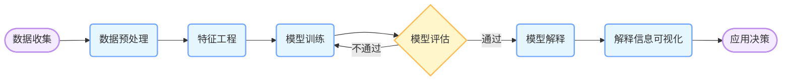

# AI驱动的企业信用评级模型解释系统

> 关键词：AI、企业信用评级、模型解释系统、可解释性人工智能、信用评估

> 摘要：本文聚焦于AI驱动的企业信用评级模型解释系统，旨在解决传统企业信用评级模型可解释性不足的问题。首先介绍了该系统提出的背景，包括目的、预期读者、文档结构和相关术语。接着阐述了核心概念及其联系，给出了原理和架构的文本示意图与Mermaid流程图。详细讲解了核心算法原理，并用Python源代码进行阐述，同时给出了数学模型和公式。通过项目实战，展示了系统的开发环境搭建、源代码实现和代码解读。探讨了系统在实际中的应用场景，推荐了相关的学习资源、开发工具框架和论文著作。最后总结了未来发展趋势与挑战，提供了常见问题解答和扩展阅读参考资料，为企业信用评级模型的可解释性研究和应用提供了全面的指导。

## 1. 背景介绍 
### 1.1 目的和范围
在当今复杂多变的商业环境中，企业信用评级对于金融机构、投资者和监管部门等众多利益相关者至关重要。传统的企业信用评级方法往往依赖于统计模型和专家经验，这些方法虽然在一定程度上能够评估企业的信用风险，但存在可解释性差、难以适应复杂数据和动态环境等问题。随着人工智能技术的飞速发展，特别是深度学习模型在信用评级中的应用，虽然提高了评级的准确性，但模型的黑盒性质使得其决策过程难以理解，增加了使用者的信任成本，也给监管带来了挑战。

本文的目的是介绍一种AI驱动的企业信用评级模型解释系统，旨在提高企业信用评级模型的可解释性，让使用者能够理解模型的决策依据，增强对模型的信任。系统的范围涵盖了从数据预处理、模型构建到解释生成的整个流程，涉及多种AI技术和解释方法。

### 1.2 预期读者
本文的预期读者包括金融领域的从业者，如银行信贷人员、投资经理、信用评级分析师等，他们需要借助企业信用评级模型进行决策，对模型的可解释性有较高的需求；人工智能领域的研究人员和开发者，他们对如何将AI技术应用于信用评级以及提高模型的可解释性感兴趣；监管部门的工作人员，他们需要对企业信用评级模型进行监管，确保其公平、透明和合规。

### 1.3 文档结构概述
本文将按照以下结构进行组织：首先介绍核心概念与联系，包括企业信用评级、AI模型和模型解释系统的基本原理和它们之间的关系；接着详细讲解核心算法原理和具体操作步骤，并用Python代码进行实现；然后给出数学模型和公式，进一步阐述系统的理论基础；通过项目实战，展示系统的开发环境搭建、源代码实现和代码解读；探讨系统在实际中的应用场景；推荐相关的学习资源、开发工具框架和论文著作；最后总结未来发展趋势与挑战，提供常见问题解答和扩展阅读参考资料。

### 1.4 术语表
#### 1.4.1 核心术语定义
- **企业信用评级**：是指信用评级机构对企业的信用状况进行评估和分级的过程，主要基于企业的财务状况、经营能力、市场竞争力等多方面因素，以确定企业按时偿还债务的能力和意愿。
- **AI驱动的企业信用评级模型**：利用人工智能技术，如机器学习、深度学习等，构建的用于企业信用评级的模型。这些模型可以处理复杂的非线性关系，提高评级的准确性。
- **模型解释系统**：是一种用于解释AI模型决策过程和结果的系统，通过各种解释方法，如特征重要性分析、局部解释、全局解释等，让使用者能够理解模型是如何做出决策的。
- **可解释性人工智能（XAI）**：是人工智能领域的一个研究方向，旨在开发能够提供可理解解释的AI模型和系统，以提高模型的透明度和可信度。

#### 1.4.2 相关概念解释
- **特征重要性**：指的是在模型中各个特征对预测结果的影响程度。通过计算特征重要性，可以了解哪些特征对企业信用评级的影响最大。
- **局部解释**：是对模型在某个特定样本上的决策进行解释，说明模型为什么对该样本做出了这样的评级。
- **全局解释**：是对模型整体的决策逻辑进行解释，描述模型在整个数据集上的行为和规律。

#### 1.4.3 缩略词列表
- **XAI**：可解释性人工智能（Explainable Artificial Intelligence）
- **ML**：机器学习（Machine Learning）
- **DL**：深度学习（Deep Learning）
- **SHAP**：SHapley Additive exPlanations（一种模型解释方法）
- **LIME**：Local Interpretable Model-agnostic Explanations（一种局部解释方法）

## 2. 核心概念与联系 

### 核心概念原理
#### 企业信用评级
企业信用评级的基本原理是综合考虑企业的多个方面因素，如财务指标（资产负债率、利润率等）、经营指标（市场份额、客户满意度等）、行业环境等，通过一定的评估方法对企业的信用状况进行量化评估。传统的评级方法通常采用专家打分法或统计模型，如Logistic回归、判别分析等。而AI驱动的企业信用评级模型则利用机器学习和深度学习算法，自动从大量数据中学习企业信用与各种因素之间的复杂关系。

#### AI模型
在企业信用评级中，常用的AI模型包括决策树、随机森林、支持向量机、神经网络等。这些模型具有强大的非线性拟合能力，能够处理高维、复杂的数据。例如，神经网络模型可以通过多层神经元的非线性变换，学习到数据中的深层次特征和模式，从而提高信用评级的准确性。

#### 模型解释系统
模型解释系统的核心原理是通过各种解释方法，将AI模型的决策过程和结果转化为人类可理解的形式。这些解释方法可以分为局部解释和全局解释两类。局部解释方法如LIME，通过在样本附近构建一个可解释的局部模型，来解释模型对该样本的决策；全局解释方法如SHAP，通过计算每个特征对模型输出的贡献，来解释模型在整个数据集上的行为。

### 架构的文本示意图
AI驱动的企业信用评级模型解释系统主要包括以下几个部分：
1. **数据层**：负责收集和存储企业的相关数据，包括财务数据、经营数据、行业数据等。
2. **模型层**：利用AI技术构建企业信用评级模型，对企业的信用状况进行评估。
3. **解释层**：采用各种解释方法对模型的决策过程和结果进行解释，生成可理解的解释信息。
4. **应用层**：将解释信息提供给用户，支持用户进行决策，如信贷审批、投资决策等。

### Mermaid流程图


## 3. 核心算法原理 & 具体操作步骤 

### 核心算法原理
#### SHAP算法原理
SHAP（SHapley Additive exPlanations）是一种基于博弈论的模型解释方法，它通过计算每个特征对模型输出的贡献，来解释模型的决策。SHAP值的基本思想是将模型的预测值分解为每个特征的贡献之和，每个特征的SHAP值表示该特征对模型预测值相对于基线值的影响。

#### LIME算法原理
LIME（Local Interpretable Model-agnostic Explanations）是一种局部解释方法，它的核心思想是在待解释的样本附近构建一个简单的、可解释的局部模型，通过这个局部模型来解释原模型对该样本的决策。具体来说，LIME通过对样本进行扰动，生成一组新的样本，并根据原模型对这些新样本的预测结果，训练一个线性回归模型，用这个线性回归模型的系数来解释原模型的决策。

### 具体操作步骤
#### 数据预处理
1. 数据清洗：去除数据中的缺失值、异常值等。
2. 数据标准化：对数值型特征进行标准化处理，使不同特征具有相同的尺度。
3. 数据编码：对分类特征进行编码，将其转换为数值型特征。

#### 模型训练
选择合适的AI模型，如随机森林、神经网络等，使用预处理后的数据进行训练。

#### 模型解释
1. 使用SHAP算法计算每个特征的SHAP值，得到全局解释信息。
2. 使用LIME算法在特定样本上构建局部解释模型，得到局部解释信息。

#### 解释信息可视化
将SHAP值和LIME解释结果进行可视化，如绘制特征重要性柱状图、局部解释图等，方便用户理解。

### Python源代码实现
```python
import pandas as pd
import numpy as np
from sklearn.ensemble import RandomForestClassifier
from sklearn.model_selection import train_test_split
from sklearn.preprocessing import StandardScaler
import shap
import lime
import lime.lime_tabular

# 数据加载
data = pd.read_csv('credit_data.csv')
X = data.drop('credit_rating', axis=1)
y = data['credit_rating']

# 数据预处理
scaler = StandardScaler()
X_scaled = scaler.fit_transform(X)

# 数据集划分
X_train, X_test, y_train, y_test = train_test_split(X_scaled, y, test_size=0.2, random_state=42)

# 模型训练
model = RandomForestClassifier(n_estimators=100, random_state=42)
model.fit(X_train, y_train)

# SHAP解释
explainer = shap.Explainer(model)
shap_values = explainer(X_test)

# 打印第一个样本的SHAP值
print("第一个样本的SHAP值：", shap_values[0].values)

# LIME解释
lime_explainer = lime.lime_tabular.LimeTabularExplainer(X_train, feature_names=X.columns, class_names=['Low', 'High'], discretize_continuous=True)
idx = 0
exp = lime_explainer.explain_instance(X_test[idx], model.predict_proba, num_features=5)
print("LIME解释结果：", exp.as_list())
```

## 4. 数学模型和公式 & 详细讲解 & 举例说明 

### SHAP值的数学模型和公式
#### 定义
SHAP值是基于博弈论中的Shapley值定义的。对于一个特征子集 $S$，模型 $f$ 在特征子集 $S$ 上的预测值为 $f(S)$，基线值为 $f(\varnothing)$。特征 $i$ 的SHAP值 $\phi_i$ 定义为：

$$\phi_i = \sum_{S \subseteq N \setminus \{i\}} \frac{|S|!(|N| - |S| - 1)!}{|N|!} [f(S \cup \{i\}) - f(S)]$$

其中，$N$ 是所有特征的集合，$|S|$ 是特征子集 $S$ 的大小。

#### 详细讲解
SHAP值的计算公式可以理解为：对于每个可能的特征子集 $S$，计算加入特征 $i$ 后模型预测值的变化 $f(S \cup \{i\}) - f(S)$，并根据特征子集 $S$ 的大小进行加权平均。权重 $\frac{|S|!(|N| - |S| - 1)!}{|N|!}$ 表示特征子集 $S$ 出现的概率。

#### 举例说明
假设我们有一个简单的信用评级模型，有三个特征：资产负债率、利润率和市场份额。对于一个特定的样本，我们要计算资产负债率这个特征的SHAP值。首先，我们需要考虑所有可能的特征子集，如 $\varnothing$、{利润率}、{市场份额}、{利润率，市场份额}。然后，计算加入资产负债率特征后模型预测值的变化，并根据上述公式进行加权平均，得到资产负债率的SHAP值。

### LIME的数学模型和公式
#### 定义
LIME的目标是在待解释的样本 $x$ 附近构建一个线性回归模型 $g(z)$，使得 $g(z)$ 尽可能地逼近原模型 $f(z)$ 在样本 $z$ 附近的行为。线性回归模型的形式为：

$$g(z) = \omega_0 + \sum_{i=1}^{d} \omega_i z_i$$

其中，$\omega_i$ 是特征 $i$ 的系数，$d$ 是特征的数量。

#### 详细讲解
LIME通过对样本 $x$ 进行扰动，生成一组新的样本 $Z$，并根据原模型 $f$ 对这些新样本的预测结果 $f(Z)$，训练线性回归模型 $g$。训练的目标是最小化以下损失函数：

$$\xi(f, g, \pi_x) = \sum_{z \in Z} \pi_x(z) [f(z) - g(z)]^2$$

其中，$\pi_x(z)$ 是样本 $z$ 与待解释样本 $x$ 的相似度权重，通常使用核函数来计算。

#### 举例说明
假设我们要解释一个样本的信用评级，该样本有四个特征：年龄、收入、负债和信用历史。LIME会在该样本附近生成一组新的样本，如改变年龄、收入等特征的值。然后，根据原模型对这些新样本的预测结果，训练一个线性回归模型。线性回归模型的系数 $\omega_i$ 就表示每个特征对原模型决策的影响，从而实现对原模型决策的解释。

## 5. 项目实战：代码实际案例和详细解释说明 

### 5.1  开发环境搭建
#### 操作系统
推荐使用Windows、Linux或macOS操作系统。

#### Python环境
安装Python 3.7及以上版本，可以使用Anaconda或Miniconda来管理Python环境。

#### 依赖库安装
在命令行中使用以下命令安装所需的依赖库：
```sh
pip install pandas numpy scikit-learn shap lime matplotlib
```

### 5.2  源代码详细实现和代码解读
```python
import pandas as pd
import numpy as np
from sklearn.ensemble import RandomForestClassifier
from sklearn.model_selection import train_test_split
from sklearn.preprocessing import StandardScaler
import shap
import lime
import lime.lime_tabular
import matplotlib.pyplot as plt

# 数据加载
data = pd.read_csv('credit_data.csv')
X = data.drop('credit_rating', axis=1)
y = data['credit_rating']

# 代码解读：使用pandas库读取CSV文件，将特征数据存储在X中，目标变量存储在y中。

# 数据预处理
scaler = StandardScaler()
X_scaled = scaler.fit_transform(X)

# 代码解读：使用StandardScaler对特征数据进行标准化处理，使不同特征具有相同的尺度，有利于模型的训练。

# 数据集划分
X_train, X_test, y_train, y_test = train_test_split(X_scaled, y, test_size=0.2, random_state=42)

# 代码解读：使用train_test_split函数将数据集划分为训练集和测试集，测试集占比为20%。

# 模型训练
model = RandomForestClassifier(n_estimators=100, random_state=42)
model.fit(X_train, y_train)

# 代码解读：使用RandomForestClassifier构建随机森林分类器，设置树的数量为100，然后使用训练集数据进行训练。

# SHAP解释
explainer = shap.Explainer(model)
shap_values = explainer(X_test)

# 代码解读：使用SHAP库的Explainer类创建一个解释器，计算测试集样本的SHAP值。

# 绘制SHAP特征重要性图
shap.summary_plot(shap_values, X_test, feature_names=X.columns)
plt.show()

# 代码解读：使用SHAP库的summary_plot函数绘制特征重要性图，直观展示每个特征的重要性。

# LIME解释
lime_explainer = lime.lime_tabular.LimeTabularExplainer(X_train, feature_names=X.columns, class_names=['Low', 'High'], discretize_continuous=True)
idx = 0
exp = lime_explainer.explain_instance(X_test[idx], model.predict_proba, num_features=5)
exp.show_in_notebook(show_table=True, show_all=False)

# 代码解读：使用LIME库的LimeTabularExplainer类创建一个局部解释器，选择第一个测试集样本进行解释，只显示最重要的5个特征的解释结果，并在Jupyter Notebook中显示。
```

### 5.3  代码解读与分析
#### 数据处理部分
数据加载和预处理是整个项目的基础。通过读取CSV文件获取企业信用数据，然后使用标准化处理使得不同特征具有可比性，避免特征尺度差异对模型训练的影响。

#### 模型训练部分
选择随机森林分类器作为信用评级模型，随机森林具有较好的泛化能力和抗过拟合能力。通过设置合适的参数，如树的数量，提高模型的性能。

#### 解释部分
SHAP解释提供了全局的特征重要性信息，通过绘制特征重要性图，可以直观地看到每个特征对模型决策的影响程度。LIME解释则针对特定样本进行局部解释，帮助我们理解模型对该样本的决策依据。

## 6. 实际应用场景 
### 金融机构信贷审批
在金融机构的信贷审批过程中，AI驱动的企业信用评级模型解释系统可以帮助信贷人员理解模型的评级结果。例如，当模型给出一个企业低信用评级时，解释系统可以通过SHAP值和LIME解释，说明是哪些特征（如高资产负债率、低利润率等）导致了这个评级结果，信贷人员可以根据这些解释信息进一步评估企业的信用风险，做出更合理的信贷决策。

### 投资者投资决策
投资者在进行投资决策时，需要评估企业的信用状况。通过使用企业信用评级模型解释系统，投资者可以了解模型对企业信用评级的依据，判断企业的投资价值。例如，如果解释系统显示某企业的高信用评级主要得益于其强大的市场竞争力和良好的财务状况，投资者可以更有信心地对该企业进行投资。

### 监管部门监管
监管部门需要对企业信用评级机构进行监管，确保其评级结果的公平、透明和合规。AI驱动的企业信用评级模型解释系统可以为监管部门提供模型决策的详细解释信息，帮助监管部门审查模型的合理性和公正性。例如，监管部门可以通过检查特征重要性和解释结果，判断模型是否存在歧视性或不合理的因素。

## 7. 工具和资源推荐
### 7.1 学习资源推荐
#### 7.1.1 书籍推荐
- 《Python机器学习》：这本书详细介绍了Python在机器学习中的应用，包括数据预处理、模型选择、评估和解释等方面的内容，适合初学者入门。
- 《可解释的机器学习》：专门介绍了可解释性人工智能的理论和方法，包括SHAP、LIME等解释方法的原理和应用，是学习模型解释的重要参考书籍。

#### 7.1.2 在线课程
- Coursera上的“机器学习”课程：由斯坦福大学的Andrew Ng教授授课，是机器学习领域的经典课程，涵盖了机器学习的基本概念、算法和应用。
- edX上的“可解释人工智能”课程：深入介绍了可解释性人工智能的最新研究成果和技术，适合有一定机器学习基础的学习者。

#### 7.1.3 技术博客和网站
- Towards Data Science：是一个数据科学领域的知名博客平台，上面有很多关于机器学习、可解释性人工智能的文章和教程。
- Medium：是一个综合性的博客平台，有许多数据科学家和技术专家分享他们的研究成果和实践经验。

### 7.2 开发工具框架推荐
#### 7.2.1 IDE和编辑器
- PyCharm：是一款专业的Python集成开发环境，具有代码编辑、调试、版本控制等功能，适合大规模项目的开发。
- Jupyter Notebook：是一个交互式的开发环境，支持代码、文本、图表等多种形式的展示，适合数据探索和模型实验。

#### 7.2.2 调试和性能分析工具
- TensorBoard：是TensorFlow的可视化工具，可以用于可视化模型的训练过程、性能指标等，帮助开发者调试和优化模型。
- Scikit-learn的GridSearchCV：可以用于模型的超参数调优，通过网格搜索的方式找到最优的超参数组合，提高模型的性能。

#### 7.2.3 相关框架和库
- SHAP：是一个用于模型解释的Python库，支持多种机器学习模型的解释，提供了丰富的解释方法和可视化工具。
- LIME：是另一个常用的模型解释库，主要用于局部解释，简单易用，适合初学者。

### 7.3 相关论文著作推荐
#### 7.3.1 经典论文
- “A Unified Approach to Interpreting Model Predictions”：介绍了SHAP方法的理论基础和实现细节，是SHAP方法的经典论文。
- “Why Should I Trust You?”：提出了LIME方法，开创了局部解释的研究方向。

#### 7.3.2 最新研究成果
- 关注顶级学术会议如NeurIPS、ICML、KDD等上关于可解释性人工智能的研究论文，了解该领域的最新研究动态。

#### 7.3.3 应用案例分析
- 一些金融科技公司和研究机构会发布关于企业信用评级模型解释系统的应用案例分析报告，可以从中学习实际应用中的经验和方法。

## 8. 总结：未来发展趋势与挑战
### 未来发展趋势
#### 多模态数据融合
未来的企业信用评级模型将不仅仅依赖于财务数据和经营数据，还会融合更多的多模态数据，如文本数据（新闻报道、社交媒体评论等）、图像数据（企业厂房、设备等照片）等。模型解释系统也需要能够处理和解释这些多模态数据的影响，提高评级的准确性和可解释性。

#### 实时解释
随着商业环境的快速变化，企业的信用状况也在不断变化。未来的模型解释系统需要具备实时解释的能力，能够及时更新解释信息，为用户提供最新的决策依据。

#### 与业务知识的深度融合
模型解释系统将与行业业务知识进行更深度的融合，不仅提供技术层面的解释，还能结合业务逻辑，给出更具针对性和实用性的解释建议，帮助用户更好地理解和应用评级结果。

### 挑战
#### 解释的准确性和可靠性
虽然现有的解释方法在一定程度上能够解释模型的决策，但解释的准确性和可靠性仍然是一个挑战。例如，SHAP值的计算在某些情况下可能会受到数据分布和模型复杂度的影响，导致解释结果不准确。未来需要进一步研究和改进解释方法，提高解释的质量。

#### 大规模数据处理
随着数据量的不断增加，模型解释系统需要处理大规模的数据，这对系统的性能和效率提出了更高的要求。如何在保证解释质量的前提下，快速处理大规模数据是一个亟待解决的问题。

#### 隐私保护
在企业信用评级中，涉及到大量的企业敏感信息。模型解释系统需要在提供解释信息的同时，保护企业的隐私。如何在解释过程中平衡可解释性和隐私保护是一个重要的挑战。

## 9. 附录：常见问题与解答
### 问题1：为什么需要模型解释系统？
答：传统的AI模型往往是黑盒模型，其决策过程难以理解。模型解释系统可以将模型的决策过程和结果转化为人类可理解的形式，提高模型的透明度和可信度，帮助用户更好地理解和应用模型的评级结果。

### 问题2：SHAP和LIME有什么区别？
答：SHAP是一种全局解释方法，它通过计算每个特征对模型输出的贡献，提供模型在整个数据集上的解释信息；而LIME是一种局部解释方法，它在特定样本附近构建一个可解释的局部模型，解释模型对该样本的决策。

### 问题3：模型解释系统会影响模型的性能吗？
答：一般情况下，模型解释系统不会直接影响模型的性能。解释系统主要是在模型训练完成后，对模型的决策进行解释，不会改变模型的结构和参数。但在某些情况下，为了提高解释的准确性，可能需要对模型进行一些调整，这可能会对模型的性能产生一定的影响。

### 问题4：如何选择合适的解释方法？
答：选择合适的解释方法需要考虑多个因素，如模型类型、数据特点、解释的目的等。如果需要全局解释信息，可以选择SHAP方法；如果需要对特定样本进行局部解释，可以选择LIME方法。同时，也可以结合多种解释方法，从不同角度对模型进行解释。

## 10. 扩展阅读 & 参考资料
### 扩展阅读
- 《人工智能时代的金融科技》：探讨了人工智能在金融领域的应用，包括企业信用评级等方面的内容。
- 《数据挖掘：概念与技术》：介绍了数据挖掘的基本概念、算法和应用，对于理解企业信用评级模型的数据处理和特征工程有帮助。

### 参考资料
- 相关的学术论文和研究报告，如NeurIPS、ICML、KDD等会议上的论文。
- 金融机构和信用评级机构发布的行业报告和研究成果。

作者：AI天才研究院/AI Genius Institute & 禅与计算机程序设计艺术 /Zen And The Art of Computer Programming