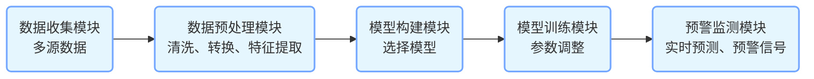

# AI驱动的企业信用风险早期预警系统

> 关键词：AI、企业信用风险、早期预警系统、机器学习、数据挖掘

> 摘要：本文围绕AI驱动的企业信用风险早期预警系统展开深入探讨。首先介绍了该系统开发的背景，包括目的、预期读者、文档结构和相关术语。接着阐述了核心概念及其联系，给出了原理和架构的文本示意图与Mermaid流程图。详细讲解了核心算法原理及具体操作步骤，并结合Python源代码进行说明。对系统涉及的数学模型和公式进行了推导与举例。通过项目实战展示了开发环境搭建、源代码实现与解读。分析了系统的实际应用场景，推荐了相关的学习资源、开发工具框架和论文著作。最后总结了系统的未来发展趋势与挑战，还提供了常见问题解答和扩展阅读参考资料。旨在为企业信用风险预警提供全面、深入的技术分析和实践指导。

## 1. 背景介绍 
### 1.1 目的和范围
企业信用风险是金融机构、供应商等在商业活动中面临的重要问题。传统的企业信用风险评估方法往往依赖于有限的财务指标和人工经验，难以准确、及时地发现潜在的信用风险。AI驱动的企业信用风险早期预警系统的目的在于利用人工智能技术，整合多源数据，建立更为精准、高效的信用风险预警模型，提前发现企业可能面临的信用危机，为决策提供有力支持。

本系统的范围涵盖了从数据收集、预处理、模型构建、训练到预警结果输出的全流程。不仅考虑了企业的财务数据，还纳入了市场环境、行业动态、社交媒体等多方面的信息，以更全面地评估企业的信用状况。

### 1.2 预期读者
本文的预期读者包括金融机构的风险管理人员、信贷审批人员，企业的财务管理人员、战略规划人员，以及对人工智能在金融领域应用感兴趣的研究人员和技术开发者。对于金融从业者，本文可以为他们的信用风险管理工作提供新的思路和方法；对于技术人员，本文详细的技术讲解和代码示例可以帮助他们开发和优化相关的预警系统。

### 1.3 文档结构概述
本文将按照以下结构进行阐述：首先介绍系统开发的背景信息，包括目的、读者和文档结构等；接着深入探讨核心概念及其联系，给出系统的原理和架构；然后详细讲解核心算法原理和具体操作步骤，并结合Python代码进行说明；对系统涉及的数学模型和公式进行推导和举例；通过项目实战展示系统的开发过程，包括环境搭建、代码实现和解读；分析系统的实际应用场景；推荐相关的学习资源、开发工具框架和论文著作；最后总结系统的未来发展趋势与挑战，提供常见问题解答和扩展阅读参考资料。

### 1.4 术语表
#### 1.4.1 核心术语定义
- **企业信用风险**：指企业在经营过程中因各种因素导致无法按时履行债务或其他商业承诺的可能性。
- **早期预警系统**：通过对相关数据的监测和分析，提前发现潜在风险并发出警报的系统。
- **人工智能（AI）**：研究如何使计算机系统能够模拟人类智能的技术和方法，包括机器学习、深度学习等。
- **机器学习**：人工智能的一个分支，通过让计算机从数据中学习模式和规律，从而进行预测和决策。
- **信用评分**：对企业信用状况的量化评估，通常用一个数值来表示。

#### 1.4.2 相关概念解释
- **数据挖掘**：从大量数据中发现有价值信息和知识的过程，常用于提取与企业信用风险相关的特征。
- **特征工程**：对原始数据进行处理和转换，提取出对模型训练有帮助的特征的过程。
- **模型训练**：使用训练数据对机器学习模型进行参数调整，使其能够准确地进行预测的过程。
- **模型评估**：使用测试数据对训练好的模型进行评估，衡量其性能和准确性的过程。

#### 1.4.3 缩略词列表
- **AI**：Artificial Intelligence（人工智能）
- **ML**：Machine Learning（机器学习）
- **DL**：Deep Learning（深度学习）
- **ROC**：Receiver Operating Characteristic（受试者工作特征曲线）
- **AUC**：Area Under the Curve（曲线下面积）

## 2. 核心概念与联系 
### 核心概念原理
AI驱动的企业信用风险早期预警系统的核心原理是利用人工智能技术对企业的多源数据进行分析和建模，以预测企业未来发生信用风险的可能性。系统主要包括以下几个关键部分：

- **数据收集**：收集企业的各种相关数据，包括财务报表、经营数据、市场数据、社交媒体数据等。这些数据可以从企业自身、金融机构、政府部门、第三方数据提供商等多个渠道获取。
- **数据预处理**：对收集到的数据进行清洗、转换和特征提取等操作，以提高数据的质量和可用性。例如，处理缺失值、异常值，进行数据标准化和归一化等。
- **模型构建**：选择合适的机器学习或深度学习模型，如逻辑回归、决策树、随机森林、神经网络等，对预处理后的数据进行建模。模型的选择应根据数据的特点和问题的需求来确定。
- **模型训练**：使用历史数据对构建好的模型进行训练，调整模型的参数，使其能够准确地预测企业的信用风险。训练过程中通常采用交叉验证等方法来评估模型的性能，避免过拟合和欠拟合。
- **预警监测**：将实时数据输入到训练好的模型中，进行实时预测和监测。当模型预测企业发生信用风险的可能性超过设定的阈值时，系统发出预警信号。

### 架构的文本示意图
```plaintext
+-----------------+
| 数据收集模块    |
| （多源数据）    |
+-----------------+
        |
        v
+-----------------+
| 数据预处理模块  |
| （清洗、转换、  |
|  特征提取）     |
+-----------------+
        |
        v
+-----------------+
| 模型构建模块    |
| （选择模型）    |
+-----------------+
        |
        v
+-----------------+
| 模型训练模块    |
| （参数调整）    |
+-----------------+
        |
        v
+-----------------+
| 预警监测模块    |
| （实时预测、    |
|  预警信号）     |
+-----------------+
```

### Mermaid流程图


## 3. 核心算法原理 & 具体操作步骤 
### 逻辑回归算法原理
逻辑回归是一种常用的二分类算法，用于预测企业是否会发生信用风险（0表示无风险，1表示有风险）。其基本原理是通过一个逻辑函数（也称为Sigmoid函数）将线性回归的输出映射到[0, 1]区间，得到企业发生信用风险的概率。

逻辑函数的表达式为：
$$\sigma(z)=\frac{1}{1 + e^{-z}}$$
其中，$z$ 是线性回归的输出，计算公式为：
$$z = \theta_0 + \theta_1x_1 + \theta_2x_2 + \cdots + \theta_nx_n$$
这里，$\theta_0, \theta_1, \cdots, \theta_n$ 是模型的参数，$x_1, x_2, \cdots, x_n$ 是输入的特征。

逻辑回归的目标是找到一组最优的参数 $\theta$，使得模型对训练数据的预测结果与实际结果之间的误差最小。通常使用对数损失函数（也称为交叉熵损失函数）来衡量误差：
$$J(\theta)=-\frac{1}{m}\sum_{i = 1}^{m}[y^{(i)}\log(\sigma(z^{(i)}))+(1 - y^{(i)})\log(1 - \sigma(z^{(i)}))]$$
其中，$m$ 是训练样本的数量，$y^{(i)}$ 是第 $i$ 个样本的真实标签，$\sigma(z^{(i)})$ 是模型对第 $i$ 个样本的预测概率。

为了找到最优的参数 $\theta$，可以使用梯度下降法等优化算法。梯度下降法的基本思想是沿着损失函数的负梯度方向不断更新参数，直到损失函数收敛到最小值。

### Python代码实现
```python
import numpy as np
from sklearn.linear_model import LogisticRegression
from sklearn.model_selection import train_test_split
from sklearn.metrics import accuracy_score

# 生成示例数据
np.random.seed(0)
X = np.random.randn(100, 5)  # 100个样本，每个样本有5个特征
y = np.random.randint(0, 2, 100)  # 随机生成0或1的标签

# 划分训练集和测试集
X_train, X_test, y_train, y_test = train_test_split(X, y, test_size=0.2, random_state=42)

# 创建逻辑回归模型
model = LogisticRegression()

# 训练模型
model.fit(X_train, y_train)

# 预测
y_pred = model.predict(X_test)

# 评估模型
accuracy = accuracy_score(y_test, y_pred)
print(f"模型准确率: {accuracy}")
```
### 具体操作步骤
1. **数据准备**：收集和整理企业的相关数据，并将其转换为适合模型输入的格式。
2. **数据划分**：将数据集划分为训练集和测试集，通常按照80:20或70:30的比例进行划分。
3. **模型创建**：选择合适的机器学习模型，如逻辑回归，并创建模型对象。
4. **模型训练**：使用训练集对模型进行训练，调整模型的参数。
5. **模型预测**：使用训练好的模型对测试集进行预测，得到预测结果。
6. **模型评估**：使用评估指标（如准确率、召回率、F1值等）对模型的性能进行评估。

## 4. 数学模型和公式 & 详细讲解 & 举例说明 
### 逻辑回归的数学模型
逻辑回归的数学模型可以表示为：
$$P(y = 1|x)=\sigma(\theta^Tx)=\frac{1}{1 + e^{-\theta^Tx}}$$
其中，$P(y = 1|x)$ 表示在给定特征 $x$ 的情况下，企业发生信用风险的概率，$\theta$ 是模型的参数向量，$\theta^T$ 是 $\theta$ 的转置。

### 损失函数的详细讲解
对数损失函数（交叉熵损失函数）的目的是衡量模型预测结果与实际结果之间的差异。当 $y = 1$ 时，损失函数的表达式为：
$$-y\log(\sigma(z))=-\log(\sigma(z))$$
当 $y = 0$ 时，损失函数的表达式为：
$$-(1 - y)\log(1 - \sigma(z))=-\log(1 - \sigma(z))$$

对数损失函数的优点是对于预测概率接近真实标签的样本，损失值较小；对于预测概率远离真实标签的样本，损失值较大。这样可以促使模型更加关注预测错误的样本，提高模型的准确性。

### 梯度下降法的公式推导
梯度下降法的更新公式为：
$$\theta_j:=\theta_j-\alpha\frac{\partial J(\theta)}{\partial\theta_j}$$
其中，$\alpha$ 是学习率，控制参数更新的步长。

对对数损失函数 $J(\theta)$ 求偏导数，得到：
$$\frac{\partial J(\theta)}{\partial\theta_j}=\frac{1}{m}\sum_{i = 1}^{m}(\sigma(z^{(i)})-y^{(i)})x_j^{(i)}$$

### 举例说明
假设我们有一个简单的数据集，包含两个特征 $x_1$ 和 $x_2$，以及对应的标签 $y$：

| $x_1$ | $x_2$ | $y$ |
|-------|-------|-----|
| 1     | 2     | 0   |
| 2     | 3     | 1   |
| 3     | 4     | 1   |
| 4     | 5     | 0   |

我们使用逻辑回归模型对这个数据集进行训练。首先，初始化参数 $\theta = [0, 0, 0]$（包括截距项）。然后，根据梯度下降法的更新公式，不断更新参数，直到损失函数收敛。

假设学习率 $\alpha = 0.1$，经过多次迭代后，我们得到了最优的参数 $\theta$。最后，使用训练好的模型对新的样本进行预测，得到企业发生信用风险的概率。

## 5. 项目实战：代码实际案例和详细解释说明 
### 5.1  开发环境搭建
#### 操作系统
推荐使用Linux或Windows操作系统，建议使用64位版本。

#### Python环境
安装Python 3.7及以上版本。可以从Python官方网站（https://www.python.org/downloads/）下载安装包进行安装。

#### 依赖库安装
使用pip工具安装以下必要的Python库：
```bash
pip install numpy pandas scikit-learn matplotlib seaborn
```
- **numpy**：用于数值计算和数组操作。
- **pandas**：用于数据处理和分析。
- **scikit-learn**：提供了丰富的机器学习算法和工具。
- **matplotlib**：用于数据可视化。
- **seaborn**：基于matplotlib的高级数据可视化库。

### 5.2  源代码详细实现和代码解读
```python
import numpy as np
import pandas as pd
from sklearn.model_selection import train_test_split
from sklearn.linear_model import LogisticRegression
from sklearn.metrics import accuracy_score, confusion_matrix, classification_report
import matplotlib.pyplot as plt
import seaborn as sns

# 读取数据
data = pd.read_csv('credit_risk_data.csv')

# 数据预处理
# 处理缺失值
data = data.dropna()

# 分离特征和标签
X = data.drop('credit_risk', axis=1)
y = data['credit_risk']

# 划分训练集和测试集
X_train, X_test, y_train, y_test = train_test_split(X, y, test_size=0.2, random_state=42)

# 创建逻辑回归模型
model = LogisticRegression()

# 训练模型
model.fit(X_train, y_train)

# 预测
y_pred = model.predict(X_test)

# 评估模型
accuracy = accuracy_score(y_test, y_pred)
print(f"模型准确率: {accuracy}")

# 绘制混淆矩阵
conf_matrix = confusion_matrix(y_test, y_pred)
sns.heatmap(conf_matrix, annot=True, fmt='d', cmap='Blues')
plt.xlabel('预测标签')
plt.ylabel('真实标签')
plt.title('混淆矩阵')
plt.show()

# 打印分类报告
print(classification_report(y_test, y_pred))
```
### 代码解读与分析
1. **数据读取**：使用 `pandas` 库的 `read_csv` 函数读取存储在CSV文件中的企业信用风险数据。
2. **数据预处理**：使用 `dropna` 函数处理数据中的缺失值，确保数据的完整性。
3. **特征和标签分离**：将数据集中的特征和标签分别存储在 `X` 和 `y` 中。
4. **数据集划分**：使用 `train_test_split` 函数将数据集划分为训练集和测试集，测试集占总数据的20%。
5. **模型创建和训练**：创建逻辑回归模型对象，并使用训练集对模型进行训练。
6. **模型预测**：使用训练好的模型对测试集进行预测，得到预测结果。
7. **模型评估**：使用 `accuracy_score` 函数计算模型的准确率，使用 `confusion_matrix` 函数绘制混淆矩阵，使用 `classification_report` 函数打印分类报告，包括准确率、召回率、F1值等指标。

## 6. 实际应用场景 
### 金融机构信贷审批
金融机构在进行信贷审批时，可以使用AI驱动的企业信用风险早期预警系统对企业的信用状况进行评估。系统可以根据企业的财务数据、经营数据、市场数据等多源信息，预测企业未来发生违约的可能性。如果预测结果显示企业存在较高的信用风险，金融机构可以拒绝贷款申请或提高贷款利率；如果信用风险较低，则可以批准贷款申请并给予较为优惠的利率。

### 供应商信用管理
供应商在与企业进行商业合作时，也面临着企业信用风险。通过使用该预警系统，供应商可以提前了解企业的信用状况，合理安排供货计划和收款策略。例如，如果系统预警某企业可能出现信用风险，供应商可以减少供货量、缩短账期或要求企业提供担保，以降低自身的风险。

### 投资决策参考
投资者在进行投资决策时，需要评估企业的信用风险。AI驱动的企业信用风险早期预警系统可以为投资者提供有价值的参考信息。投资者可以根据系统的预警结果，调整投资组合，避免投资于信用风险较高的企业，从而提高投资的安全性和回报率。

### 监管部门风险监测
监管部门可以使用该系统对企业的信用风险进行实时监测，及时发现潜在的系统性风险。当系统发出预警信号时，监管部门可以采取相应的监管措施，如加强对企业的监管力度、要求企业整改等，以维护金融市场的稳定和安全。

## 7. 工具和资源推荐
### 7.1 学习资源推荐
#### 7.1.1 书籍推荐
- 《机器学习》（周志华）：全面介绍了机器学习的基本概念、算法和应用，是机器学习领域的经典教材。
- 《Python机器学习》（Sebastian Raschka）：以Python为工具，详细介绍了机器学习的各种算法和实践技巧。
- 《深度学习》（Ian Goodfellow、Yoshua Bengio和Aaron Courville）：深度学习领域的权威著作，涵盖了深度学习的理论、算法和应用。

#### 7.1.2 在线课程
- Coursera上的“机器学习”课程（Andrew Ng教授授课）：经典的机器学习入门课程，深入浅出地介绍了机器学习的基本概念和算法。
- edX上的“深度学习专项课程”：由深度学习领域的知名学者授课，系统地介绍了深度学习的理论和实践。
- 中国大学MOOC上的“人工智能基础”课程：国内优秀的人工智能入门课程，适合初学者学习。

#### 7.1.3 技术博客和网站
- 机器之心（https://www.alldatasheet.com/）：专注于人工智能领域的资讯和技术分享，提供了大量的行业动态、技术文章和研究报告。
- 深度学习技术前沿（https://www.deeplearning.ai/）：深度学习领域的专业博客，分享了深度学习的最新研究成果和应用案例。
- Kaggle（https://www.kaggle.com/）：全球知名的数据科学竞赛平台，提供了丰富的数据集和代码示例，是学习和实践机器学习的好地方。

### 7.2 开发工具框架推荐
#### 7.2.1 IDE和编辑器
- PyCharm：功能强大的Python集成开发环境，提供了代码编辑、调试、版本控制等一系列功能，适合专业的Python开发者使用。
- Jupyter Notebook：交互式的编程环境，支持Python、R等多种编程语言，方便进行数据探索、模型实验和结果展示。
- Visual Studio Code：轻量级的代码编辑器，支持多种编程语言和插件扩展，具有良好的用户体验。

#### 7.2.2 调试和性能分析工具
- Py-Spy：用于分析Python程序的性能瓶颈，可以实时监测函数调用的时间和频率。
- TensorBoard：TensorFlow提供的可视化工具，用于监控模型的训练过程、查看模型的结构和参数等。
- Scikit-learn中的交叉验证工具：可以帮助开发者评估模型的性能和稳定性，避免过拟合和欠拟合。

#### 7.2.3 相关框架和库
- Scikit-learn：Python中最常用的机器学习库，提供了丰富的机器学习算法和工具，如分类、回归、聚类等。
- TensorFlow：Google开发的深度学习框架，支持多种深度学习模型的构建和训练，具有高效、灵活的特点。
- PyTorch：Facebook开发的深度学习框架，以其简洁易用的API和动态计算图而受到广泛关注。

### 7.3 相关论文著作推荐
#### 7.3.1 经典论文
- “A Decision-Theoretic Generalization of On-Line Learning and an Application to Boosting”（Yoav Freund和Robert E. Schapire）：提出了AdaBoost算法，是机器学习领域的经典论文之一。
- “Gradient-Based Learning Applied to Document Recognition”（Yann LeCun、Léon Bottou、Yoshua Bengio和Patrick Haffner）：介绍了卷积神经网络（CNN）在图像识别中的应用，奠定了深度学习在计算机视觉领域的基础。
- “Long Short-Term Memory”（Sepp Hochreiter和Jürgen Schmidhuber）：提出了长短期记忆网络（LSTM），解决了循环神经网络（RNN）中的梯度消失问题，在自然语言处理等领域取得了广泛应用。

#### 7.3.2 最新研究成果
- 关注顶级学术会议如NeurIPS（神经信息处理系统大会）、ICML（国际机器学习会议）、CVPR（计算机视觉与模式识别会议）等的最新论文，了解人工智能领域的最新研究动态和技术进展。
- 查阅知名学术期刊如Journal of Machine Learning Research（JMLR）、Artificial Intelligence等的相关文章，获取高质量的研究成果。

#### 7.3.3 应用案例分析
- 《AI in Finance: From Theory to Practice》：介绍了人工智能在金融领域的应用案例和实践经验，包括信用风险评估、投资决策、风险管理等方面。
- 《Applied Predictive Modeling》：通过实际案例展示了如何使用机器学习和统计方法进行预测建模，具有很强的实用性和指导性。

## 8. 总结：未来发展趋势与挑战
### 未来发展趋势
- **多源数据融合**：未来的企业信用风险早期预警系统将更加注重多源数据的融合，除了传统的财务数据和经营数据外，还将纳入更多的非结构化数据，如社交媒体数据、物联网数据等，以更全面地了解企业的信用状况。
- **深度学习应用**：深度学习技术在图像识别、自然语言处理等领域取得了巨大成功，未来将在企业信用风险预警中得到更广泛的应用。例如，使用卷积神经网络（CNN）处理企业的财务报表图像，使用循环神经网络（RNN）分析企业的文本数据。
- **实时监测与预警**：随着数据采集和处理技术的不断发展，系统将实现对企业信用风险的实时监测和预警。一旦发现企业的信用状况发生变化，系统能够及时发出警报，为决策提供更及时的支持。
- **可解释性模型**：为了满足监管要求和用户需求，未来的预警系统将更加注重模型的可解释性。除了提供预测结果外，系统还将解释模型做出决策的依据，让用户更好地理解和信任模型。

### 挑战
- **数据质量问题**：多源数据的收集和整合过程中，可能会存在数据缺失、错误、不一致等问题，影响模型的准确性和可靠性。因此，如何提高数据质量是一个亟待解决的问题。
- **模型复杂度与可解释性的平衡**：深度学习模型通常具有较高的复杂度，能够取得较好的预测效果，但往往缺乏可解释性。如何在保证模型性能的前提下，提高模型的可解释性，是一个挑战。
- **隐私和安全问题**：企业的信用数据涉及到大量的敏感信息，如财务状况、商业机密等。在数据收集、存储和处理过程中，如何保护数据的隐私和安全，防止数据泄露和滥用，是一个重要的问题。
- **模型更新与适应性**：企业的经营环境和信用状况是不断变化的，因此预警系统需要不断更新模型以适应新的情况。如何实现模型的自动更新和自适应调整，是一个需要研究的问题。

## 9. 附录：常见问题与解答
### 如何选择合适的机器学习模型？
选择合适的机器学习模型需要考虑多个因素，如数据的特点、问题的类型、模型的复杂度和可解释性等。对于简单的二分类问题，逻辑回归、决策树等模型通常是不错的选择；对于复杂的非线性问题，深度学习模型如神经网络可能更适合。同时，还可以使用交叉验证等方法对不同的模型进行评估和比较，选择性能最优的模型。

### 如何处理数据中的缺失值和异常值？
处理缺失值的方法有很多种，如删除包含缺失值的样本、使用均值、中位数或众数填充缺失值、使用机器学习模型预测缺失值等。处理异常值的方法包括删除异常值、对异常值进行变换（如对数变换）、使用鲁棒性模型等。具体选择哪种方法需要根据数据的特点和问题的需求来确定。

### 如何评估模型的性能？
评估模型的性能可以使用多种指标，如准确率、召回率、F1值、ROC曲线和AUC值等。对于分类问题，准确率是最常用的指标之一，但在数据不平衡的情况下，准确率可能不能很好地反映模型的性能，此时可以使用召回率、F1值等指标。ROC曲线和AUC值可以综合考虑模型的分类阈值和性能，是评估模型性能的重要指标。

### 如何防止模型过拟合？
防止模型过拟合的方法有很多种，如增加训练数据、使用正则化方法（如L1和L2正则化）、使用早停策略、进行特征选择等。增加训练数据可以让模型学习到更广泛的特征和规律，减少过拟合的风险；正则化方法可以通过对模型的参数进行约束，防止模型过于复杂；早停策略可以在模型的性能不再提升时停止训练，避免模型过拟合；特征选择可以选择对模型有重要影响的特征，减少不必要的特征对模型的干扰。

## 10. 扩展阅读 & 参考资料
### 扩展阅读
- 《人工智能：现代方法》（Stuart Russell和Peter Norvig）：全面介绍了人工智能的基本概念、算法和应用，是人工智能领域的经典著作。
- 《大数据时代》（维克托·迈尔 - 舍恩伯格和肯尼斯·库克耶）：探讨了大数据对社会、经济和生活的影响，为理解数据驱动的决策提供了有益的启示。
- 《创新者的窘境》（克莱顿·克里斯坦森）：分析了创新对企业和行业的影响，对于思考AI技术在企业信用风险预警领域的应用和发展具有一定的参考价值。

### 参考资料
- 相关学术论文和研究报告，如IEEE Transactions on Neural Networks and Learning Systems、ACM SIGKDD Conference on Knowledge Discovery and Data Mining等会议和期刊上的文章。
- 行业标准和规范，如金融行业的信用评级标准、监管部门的相关政策文件等。
- 开源项目和代码库，如GitHub上的相关机器学习和深度学习项目，为系统的开发和实现提供了参考和借鉴。

作者：AI天才研究院/AI Genius Institute & 禅与计算机程序设计艺术 /Zen And The Art of Computer Programming