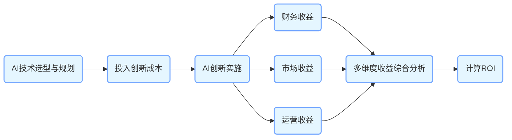

# AI驱动的企业创新ROI评估：量化创新投资回报的多维度模型

> 关键词：AI驱动、企业创新、ROI评估、多维度模型、量化投资回报

> 摘要：本文聚焦于AI驱动的企业创新ROI评估，深入探讨如何构建量化创新投资回报的多维度模型。首先介绍了该研究的背景、目的、预期读者等内容，接着阐述了核心概念与联系，包括AI驱动企业创新及ROI评估的原理和架构，并给出相应的示意图和流程图。详细讲解了核心算法原理和具体操作步骤，运用Python代码进行示例。通过数学模型和公式对投资回报进行量化分析，并举例说明。结合项目实战，给出开发环境搭建、源代码实现及解读。探讨了实际应用场景，推荐了学习资源、开发工具框架以及相关论文著作。最后总结了未来发展趋势与挑战，提供常见问题解答和扩展阅读参考资料，旨在为企业在AI驱动创新投资决策中提供科学、全面的评估方法。

## 1. 背景介绍 
### 1.1 目的和范围
在当今数字化时代，人工智能（AI）正以前所未有的速度重塑着企业的运营模式和创新方式。企业纷纷加大在AI领域的投资，期望通过AI驱动的创新来提升竞争力、开拓新市场、提高运营效率等。然而，如何准确评估这些投资的回报成为了企业面临的重要挑战。本研究的目的在于构建一个多维度模型，用于量化AI驱动的企业创新投资回报（ROI），帮助企业更加科学、准确地评估创新投资的效益，从而做出更明智的决策。

本研究的范围涵盖了不同行业、不同规模的企业在AI驱动创新方面的投资，包括但不限于AI技术研发、AI应用部署、AI人才培养等方面的投资。同时，考虑了多种可能影响投资回报的因素，如市场份额变化、成本节约、客户满意度提升等。

### 1.2 预期读者
本文的预期读者主要包括企业高层管理人员、投资决策人员、企业战略规划人员等，他们需要在AI驱动的企业创新投资中做出决策，需要科学的评估方法来衡量投资回报。此外，也适合从事AI研究、咨询的专业人士，以及对企业创新和投资评估感兴趣的学者和学生阅读。

### 1.3 文档结构概述
本文将按照以下结构展开：首先介绍背景信息，包括研究目的、预期读者和文档结构概述等。接着阐述核心概念与联系，包括AI驱动企业创新和ROI评估的相关原理和架构。然后详细讲解核心算法原理和具体操作步骤，并使用Python代码进行示例。通过数学模型和公式对投资回报进行量化分析，并举例说明。结合项目实战，介绍开发环境搭建、源代码实现及解读。探讨实际应用场景，推荐学习资源、开发工具框架以及相关论文著作。最后总结未来发展趋势与挑战，提供常见问题解答和扩展阅读参考资料。

### 1.4 术语表
#### 1.4.1 核心术语定义
- **AI驱动的企业创新**：指企业利用人工智能技术，如机器学习、深度学习、自然语言处理等，对业务流程、产品或服务进行创新，以提升企业的竞争力和价值。
- **ROI（Return on Investment）**：即投资回报率，是指通过投资而应返回的价值，它涵盖了企业的获利目标。在本文中，指企业在AI驱动创新方面的投资所获得的回报与投资成本的比率。
- **多维度模型**：一种综合考虑多个因素的评估模型，在本文中，用于从多个维度评估AI驱动的企业创新投资回报，如财务维度、市场维度、运营维度等。

#### 1.4.2 相关概念解释
- **机器学习**：是一门多领域交叉学科，涉及概率论、统计学、逼近论、凸分析、算法复杂度理论等多门学科。它专门研究计算机怎样模拟或实现人类的学习行为，以获取新的知识或技能，重新组织已有的知识结构使之不断改善自身的性能。
- **深度学习**：是机器学习的一个分支领域，它是一种基于对数据进行表征学习的方法。深度学习通过构建具有很多层的神经网络模型，自动从大量数据中学习到复杂的模式和特征。
- **自然语言处理**：是计算机科学领域与人工智能领域中的一个重要方向。它研究能实现人与计算机之间用自然语言进行有效通信的各种理论和方法，包括文本分类、情感分析、机器翻译等。

#### 1.4.3 缩略词列表
- **AI**：Artificial Intelligence，人工智能
- **ROI**：Return on Investment，投资回报率
- **NLP**：Natural Language Processing，自然语言处理
- **ML**：Machine Learning，机器学习
- **DL**：Deep Learning，深度学习

## 2. 核心概念与联系 

### 核心概念原理
#### AI驱动的企业创新原理
AI驱动的企业创新基于人工智能技术的特性和优势。人工智能技术可以处理和分析大量的数据，从中发现潜在的模式和规律。例如，机器学习算法可以通过对历史销售数据的分析，预测未来的市场需求，帮助企业优化生产计划和库存管理。深度学习模型可以对图像、语音等非结构化数据进行处理，为企业开发新的产品和服务提供支持，如智能图像识别系统、智能语音助手等。

#### ROI评估原理
ROI评估的基本原理是比较投资的收益和成本。在AI驱动的企业创新中，投资成本包括AI技术研发费用、硬件设备采购费用、人员培训费用等。投资收益则可以从多个方面来衡量，如销售收入的增加、成本的节约、市场份额的扩大等。通过计算投资收益与投资成本的比率，可以得到投资回报率，从而评估投资的效益。

### 核心概念架构
#### 文本示意图
AI驱动的企业创新与ROI评估的核心概念架构可以用以下文本描述：企业在AI驱动的创新过程中，首先进行AI技术的选型和应用规划，投入相应的成本进行研发和部署。在创新实施过程中，AI技术对企业的业务流程、产品或服务产生影响，从而带来各种收益。这些收益通过多维度的指标进行衡量，如财务指标（销售收入、利润等）、市场指标（市场份额、客户满意度等）、运营指标（生产效率、质量控制等）。最后，将这些多维度的收益进行综合分析，计算出投资回报率，以评估创新投资的效益。

#### Mermaid流程图


## 3. 核心算法原理 & 具体操作步骤 

### 核心算法原理
在量化AI驱动的企业创新投资回报时，我们可以采用加权平均的方法来综合考虑多个维度的收益。假设我们将收益分为 $n$ 个维度，每个维度的收益为 $R_i$，对应的权重为 $w_i$，投资成本为 $C$，则投资回报率 $ROI$ 的计算公式为：

$$ROI = \frac{\sum_{i=1}^{n} w_i R_i}{C}$$

其中，$\sum_{i=1}^{n} w_i = 1$，表示权重之和为1。

### 具体操作步骤
#### 步骤1：确定收益维度和权重
首先，需要确定评估投资回报的收益维度，如财务维度、市场维度、运营维度等。然后，根据企业的战略目标和重点，为每个维度分配相应的权重。例如，对于以市场扩张为主要目标的企业，市场维度的权重可以设置得较高。

#### 步骤2：计算每个维度的收益
对于每个收益维度，需要定义相应的指标，并计算其收益。例如，在财务维度，可以计算销售收入的增加、成本的节约等；在市场维度，可以计算市场份额的扩大、客户满意度的提升等；在运营维度，可以计算生产效率的提高、质量控制的改善等。

#### 步骤3：计算加权平均收益
根据每个维度的收益和权重，计算加权平均收益：

$$\sum_{i=1}^{n} w_i R_i$$

#### 步骤4：计算投资回报率
将加权平均收益除以投资成本，得到投资回报率：

$$ROI = \frac{\sum_{i=1}^{n} w_i R_i}{C}$$

### Python代码示例
```python
# 定义收益维度和权重
dimensions = ['财务维度', '市场维度', '运营维度']
weights = [0.5, 0.3, 0.2]

# 假设每个维度的收益
revenues = [100000, 50000, 30000]

# 投资成本
cost = 150000

# 计算加权平均收益
weighted_revenue = sum([weights[i] * revenues[i] for i in range(len(dimensions))])

# 计算投资回报率
roi = weighted_revenue / cost

print(f"投资回报率: {roi * 100:.2f}%")
```

## 4. 数学模型和公式 & 详细讲解 & 举例说明 

### 数学模型和公式
在上述核心算法原理中，我们已经给出了投资回报率的计算公式：

$$ROI = \frac{\sum_{i=1}^{n} w_i R_i}{C}$$

其中，$ROI$ 表示投资回报率，$R_i$ 表示第 $i$ 个维度的收益，$w_i$ 表示第 $i$ 个维度的权重，$C$ 表示投资成本。

### 详细讲解
- **收益维度 $R_i$**：不同的收益维度反映了企业在不同方面的表现。财务维度的收益主要与企业的经济利益相关，如销售收入的增加、利润的提升等；市场维度的收益体现了企业在市场中的竞争力和影响力，如市场份额的扩大、客户满意度的提高等；运营维度的收益则关注企业内部的运营效率和质量，如生产效率的提高、质量控制的改善等。
- **权重 $w_i$**：权重反映了每个收益维度在评估投资回报中的重要程度。企业可以根据自身的战略目标和重点，灵活调整各个维度的权重。例如，对于处于成长期的企业，可能更注重市场份额的扩大，因此市场维度的权重可以设置得较高；对于追求成本控制和效率提升的企业，运营维度的权重可能会相对较高。
- **投资成本 $C$**：投资成本包括直接成本和间接成本。直接成本如AI技术研发费用、硬件设备采购费用等；间接成本如人员培训费用、管理费用等。

### 举例说明
假设一家企业在AI驱动的创新项目中投入了100万元的成本。该企业将收益分为三个维度：财务维度、市场维度和运营维度，对应的权重分别为0.6、0.2和0.2。经过一段时间的运营，各维度的收益如下：
- 财务维度：销售收入增加了80万元，成本节约了20万元，总收益为100万元。
- 市场维度：市场份额扩大了10%，带来了30万元的额外收益。
- 运营维度：生产效率提高了20%，节约了15万元的运营成本。

根据上述数据，我们可以计算投资回报率：

首先，计算每个维度的加权收益：
- 财务维度加权收益：$0.6 \times 100 = 60$（万元）
- 市场维度加权收益：$0.2 \times 30 = 6$（万元）
- 运营维度加权收益：$0.2 \times 15 = 3$（万元）

然后，计算加权平均收益：

$$\sum_{i=1}^{3} w_i R_i = 60 + 6 + 3 = 69$$（万元）

最后，计算投资回报率：

$$ROI = \frac{69}{100} = 0.69 = 69\%$$

这表明该企业在AI驱动的创新项目中获得了69%的投资回报率，投资效益较好。

## 5. 项目实战：代码实际案例和详细解释说明 

### 5.1  开发环境搭建
#### 操作系统
本项目可以在Windows、Linux或macOS等操作系统上进行开发。建议使用Linux系统，如Ubuntu 18.04及以上版本，因为Linux系统在开发和部署方面具有更好的稳定性和兼容性。

#### Python环境
本项目使用Python语言进行开发，建议使用Python 3.7及以上版本。可以通过以下步骤安装Python：
- 在Python官方网站（https://www.python.org/downloads/）下载对应操作系统的Python安装包。
- 按照安装向导的提示进行安装，安装过程中注意勾选“Add Python to PATH”选项，以便在命令行中可以直接使用Python。

#### 第三方库安装
本项目需要使用一些第三方库，如`numpy`、`pandas`等。可以使用`pip`命令进行安装：
```sh
pip install numpy pandas
```

### 5.2  源代码详细实现和代码解读
```python
import numpy as np
import pandas as pd

# 定义收益维度和权重
dimensions = ['财务维度', '市场维度', '运营维度']
weights = np.array([0.5, 0.3, 0.2])

# 模拟不同时间段的收益数据
data = {
    '时间': ['2023-01', '2023-02', '2023-03', '2023-04', '2023-05'],
    '财务维度收益': [80000, 90000, 100000, 110000, 120000],
    '市场维度收益': [30000, 32000, 35000, 38000, 40000],
    '运营维度收益': [15000, 16000, 18000, 20000, 22000]
}

# 将数据转换为DataFrame
df = pd.DataFrame(data)

# 提取收益数据
revenues = df[['财务维度收益', '市场维度收益', '运营维度收益']].values

# 假设投资成本
cost = 500000

# 计算每个时间段的加权平均收益
weighted_revenues = np.dot(revenues, weights)

# 计算每个时间段的投资回报率
rois = weighted_revenues / cost

# 将投资回报率添加到DataFrame中
df['投资回报率'] = rois

# 输出结果
print(df)
```

### 5.3  代码解读与分析
- **导入必要的库**：导入`numpy`和`pandas`库，`numpy`用于数值计算，`pandas`用于数据处理和分析。
- **定义收益维度和权重**：定义了三个收益维度，并使用`numpy`数组存储对应的权重。
- **模拟收益数据**：使用字典模拟不同时间段的收益数据，并将其转换为`pandas`的`DataFrame`对象。
- **提取收益数据**：从`DataFrame`中提取收益数据，并转换为`numpy`数组。
- **计算加权平均收益**：使用`numpy`的`dot`函数计算每个时间段的加权平均收益。
- **计算投资回报率**：将加权平均收益除以投资成本，得到每个时间段的投资回报率。
- **输出结果**：将投资回报率添加到`DataFrame`中，并打印输出。

通过这个代码示例，我们可以清晰地看到如何使用Python实现AI驱动的企业创新ROI评估的多维度模型，并对不同时间段的投资回报率进行计算和分析。

## 6. 实际应用场景 
### 新产品研发决策
企业在考虑是否投入资源进行基于AI的新产品研发时，可以使用多维度模型评估投资回报。例如，一家电子产品制造商计划开发一款具有智能语音交互功能的新产品。通过该模型，可以从财务维度预测产品的销售利润，从市场维度评估产品对市场份额的影响，从运营维度分析生产过程中的效率提升和成本节约。根据评估结果，企业可以决定是否继续推进该项目。

### 业务流程优化
企业在进行业务流程优化时，如引入AI技术实现自动化客服、智能供应链管理等，可以使用该模型评估投资回报。以自动化客服为例，通过该模型可以计算出客服成本的节约、客户满意度的提升等收益，与投入的技术研发和系统部署成本进行对比，从而判断业务流程优化的效益。

### 市场拓展战略
企业在制定市场拓展战略时，如利用AI进行精准营销、开拓新市场等，可以使用多维度模型评估投资回报。例如，一家电商企业计划通过AI算法进行个性化推荐，提高用户购买转化率。通过该模型，可以评估销售收入的增加、客户忠诚度的提升等收益，与AI技术研发和营销推广成本进行对比，为市场拓展战略提供决策依据。

## 7. 工具和资源推荐
### 7.1 学习资源推荐
#### 7.1.1 书籍推荐
- 《人工智能：现代方法》（Artificial Intelligence: A Modern Approach）：这是一本经典的人工智能教材，全面介绍了人工智能的各个领域，包括搜索算法、机器学习、自然语言处理等，适合初学者和有一定基础的读者阅读。
- 《Python机器学习》（Python Machine Learning）：本书详细介绍了如何使用Python进行机器学习的开发，包括数据预处理、模型选择、算法实现等内容，对于想通过Python实现AI驱动创新的读者非常有帮助。
- 《创新者的窘境》（The Innovator's Dilemma）：虽然不是专门关于AI的书籍，但它探讨了企业在创新过程中面临的挑战和机遇，对于理解企业创新的本质和投资决策有很大的启发。

#### 7.1.2 在线课程
- Coursera上的“人工智能基础”（Foundations of Artificial Intelligence）课程：由知名高校的教授授课，系统地介绍了人工智能的基本概念、算法和应用。
- edX上的“机器学习”（Machine Learning）课程：由斯坦福大学的教授授课，是一门非常经典的机器学习课程，内容丰富，讲解深入。
- 阿里云大学的“人工智能实战营”：提供了大量的AI实战案例和项目，通过实际操作帮助学员掌握AI技术的应用。

#### 7.1.3 技术博客和网站
- 机器之心（https://www.alldatasheet.com/）：专注于人工智能领域的前沿技术和研究成果，提供了大量的技术文章、案例分析和行业动态。
- 开源中国（https://www.oschina.net/）：涵盖了软件开发、开源项目、技术博客等多个方面的内容，对于了解AI技术的开源实现和应用有很大的帮助。
- 知乎（https://www.zhihu.com/）：有很多关于AI和企业创新的讨论和分享，可以从中获取不同的观点和经验。

### 7.2 开发工具框架推荐
#### 7.2.1 IDE和编辑器
- PyCharm：是一款专门为Python开发设计的集成开发环境（IDE），具有代码自动补全、调试、版本控制等功能，非常适合Python开发。
- Jupyter Notebook：是一个基于Web的交互式计算环境，可以方便地进行代码编写、数据可视化和文档编写，对于AI算法的实验和验证非常有用。
- Visual Studio Code：是一款轻量级的代码编辑器，支持多种编程语言，具有丰富的插件生态系统，可以通过安装插件来支持Python开发和AI相关的功能。

#### 7.2.2 调试和性能分析工具
- PDB：是Python自带的调试器，可以在代码中设置断点，逐步执行代码，查看变量的值和程序的执行流程。
- cProfile：是Python的性能分析工具，可以分析代码的执行时间和函数调用情况，帮助找出代码中的性能瓶颈。
- TensorBoard：是TensorFlow的可视化工具，可以用于可视化模型的训练过程、损失函数的变化、模型的结构等，对于调试和优化深度学习模型非常有帮助。

#### 7.2.3 相关框架和库
- TensorFlow：是一个开源的机器学习框架，由Google开发，广泛应用于深度学习领域，提供了丰富的工具和接口，方便开发者构建和训练深度学习模型。
- PyTorch：是另一个流行的深度学习框架，由Facebook开发，具有动态图的特点，易于使用和调试，在学术界和工业界都有广泛的应用。
- Scikit-learn：是一个简单而高效的机器学习工具库，提供了多种机器学习算法和工具，如分类、回归、聚类等，适合初学者和快速开发。

### 7.3 相关论文著作推荐
#### 7.3.1 经典论文
- “Learning Representations by Back-propagating Errors”（通过反向传播误差学习表示）：这篇论文是神经网络领域的经典之作，介绍了反向传播算法，为深度学习的发展奠定了基础。
- “ImageNet Classification with Deep Convolutional Neural Networks”（使用深度卷积神经网络进行ImageNet分类）：这篇论文提出了AlexNet模型，在ImageNet图像分类竞赛中取得了显著的成绩，开启了深度学习在计算机视觉领域的热潮。
- “Attention Is All You Need”（注意力就是你所需要的一切）：这篇论文提出了Transformer模型，在自然语言处理领域取得了巨大的成功，成为了当前很多自然语言处理任务的基础模型。

#### 7.3.2 最新研究成果
- 关注顶级学术会议如NeurIPS（神经信息处理系统大会）、ICML（国际机器学习会议）、CVPR（计算机视觉与模式识别会议）等的最新研究成果，这些会议汇集了人工智能领域的最新研究动态和创新成果。
- 查阅顶级学术期刊如Journal of Artificial Intelligence Research（JAIR）、Artificial Intelligence等的最新论文，这些期刊发表了很多高质量的人工智能研究论文。

#### 7.3.3 应用案例分析
- 《AI应用案例集》：收集了不同行业、不同领域的AI应用案例，详细介绍了企业如何利用AI技术进行创新和提升竞争力，对于理解AI在实际应用中的投资回报评估有很大的帮助。
- 各大咨询公司发布的行业报告，如麦肯锡、波士顿咨询等，会对AI在企业中的应用和投资回报进行分析和研究，提供了很多实际案例和数据支持。

## 8. 总结：未来发展趋势与挑战
### 未来发展趋势
- **模型的智能化和自动化**：随着人工智能技术的不断发展，ROI评估模型将越来越智能化和自动化。模型可以自动收集和分析数据，根据企业的实时情况调整评估指标和权重，提供更加准确和及时的投资回报评估。
- **多维度数据的融合**：未来的评估模型将不仅仅局限于财务、市场和运营等传统维度的数据，还将融合更多的外部数据，如社交媒体数据、行业动态数据等，以更全面地评估AI驱动的企业创新投资回报。
- **与区块链技术的结合**：区块链技术具有去中心化、不可篡改等特点，可以为ROI评估提供更加可靠的数据来源和安全的评估环境。通过与区块链技术的结合，评估结果的可信度将得到进一步提高。

### 挑战
- **数据质量和隐私问题**：准确的ROI评估依赖于高质量的数据，但企业在收集和处理数据时可能会面临数据质量不高、数据缺失等问题。此外，数据隐私也是一个重要的问题，企业需要在保护用户隐私的前提下进行数据的收集和分析。
- **模型的可解释性**：虽然人工智能模型在预测和评估方面具有很高的准确性，但很多模型是黑盒模型，难以解释其决策过程和结果。在企业的投资决策中，需要模型具有较好的可解释性，以便决策者能够理解评估结果的依据。
- **技术更新换代快**：人工智能技术发展迅速，新的算法和模型不断涌现。企业需要不断学习和更新技术，以保证评估模型的有效性和准确性。同时，技术的更新换代也可能导致企业的投资在短时间内过时，增加了投资回报评估的难度。

## 9. 附录：常见问题与解答
### 问题1：如何确定收益维度的权重？
答：收益维度的权重可以根据企业的战略目标和重点来确定。例如，如果企业的主要目标是市场扩张，那么市场维度的权重可以设置得较高；如果企业更注重成本控制和效率提升，那么运营维度的权重可以相对较高。此外，也可以参考行业标准和经验，结合企业的实际情况进行调整。

### 问题2：投资成本包括哪些方面？
答：投资成本包括直接成本和间接成本。直接成本如AI技术研发费用、硬件设备采购费用、软件授权费用等；间接成本如人员培训费用、管理费用、维护费用等。在计算投资成本时，需要全面考虑各种可能的费用。

### 问题3：模型的准确性如何保证？
答：为了保证模型的准确性，需要注意以下几点：一是保证数据的质量，收集和整理准确、完整的数据；二是选择合适的评估指标和算法，根据企业的实际情况进行调整；三是对模型进行验证和优化，通过历史数据进行回测，不断改进模型的性能。

### 问题4：如何处理数据缺失的情况？
答：当遇到数据缺失的情况时，可以采用以下方法进行处理：一是删除缺失数据，但这种方法可能会导致数据量减少，影响模型的准确性；二是使用插补方法，如均值插补、中位数插补、线性回归插补等，根据已有数据来估计缺失值；三是使用机器学习算法进行缺失值预测，如决策树、随机森林等。

## 10. 扩展阅读 & 参考资料
### 扩展阅读
- 《智能商业》：探讨了人工智能在商业领域的应用和发展趋势，对于理解AI驱动的企业创新有很大的帮助。
- 《数据驱动营销》：介绍了如何利用数据进行营销决策，与AI驱动的企业创新和ROI评估密切相关。
- 《工业4.0：即将来袭的第四次工业革命》：阐述了工业4.0时代的特点和发展趋势，对于制造业企业在AI驱动创新方面的投资决策有一定的参考价值。

### 参考资料
- 各企业的年度报告和财务报表，提供了企业实际的财务数据和业务信息。
- 行业协会发布的统计数据和研究报告，有助于了解行业的发展趋势和市场情况。
- 相关的学术论文和研究成果，为模型的构建和算法的选择提供了理论支持。

作者：AI天才研究院/AI Genius Institute & 禅与计算机程序设计艺术 /Zen And The Art of Computer Programming