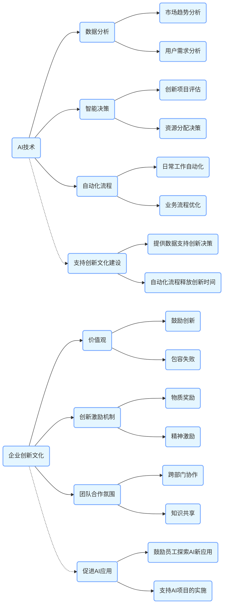

# AI驱动的企业创新文化培养与管理

> 关键词：AI、企业创新文化、培养、管理、数字化转型

> 摘要：本文聚焦于AI驱动下企业创新文化的培养与管理。在当今数字化时代，AI技术迅猛发展，对企业的运营和发展产生了深远影响。企业要想在激烈的市场竞争中脱颖而出，就需要积极培养和管理基于AI的创新文化。文章深入探讨了AI驱动企业创新文化的核心概念、算法原理、数学模型，通过项目实战案例展示了如何将理论应用于实际，分析了其实际应用场景，推荐了相关的工具和资源，并对未来发展趋势与挑战进行了总结，同时提供了常见问题解答和扩展阅读资料，旨在为企业提供全面的指导，助力企业构建适应AI时代的创新文化。

## 1. 背景介绍 
### 1.1 目的和范围
在科技飞速发展的今天，AI已经成为推动企业变革的关键力量。本文章的目的在于深入探讨如何利用AI来培养和管理企业的创新文化。范围涵盖了从AI与企业创新文化的基本概念出发，分析其核心算法原理、数学模型，通过实际项目案例展示具体应用，探讨实际应用场景，推荐相关工具和资源，以及对未来发展趋势和挑战的展望。旨在为企业管理者、技术人员和相关研究人员提供全面的理论和实践指导，帮助企业在AI时代构建具有竞争力的创新文化。

### 1.2 预期读者
本文的预期读者包括企业的高层管理人员，他们需要了解如何利用AI来推动企业创新文化的建设，制定相关的战略决策；企业的技术人员，如数据科学家、AI工程师等，他们可以从本文中获取AI技术在企业创新文化培养与管理中的具体应用方法；研究企业管理和创新的学者，他们可以从本文中获取新的研究视角和思路；以及对企业创新和AI技术感兴趣的广大读者，帮助他们了解AI与企业创新文化之间的关系和应用。

### 1.3 文档结构概述
本文将按照以下结构进行阐述：首先介绍AI驱动企业创新文化的背景信息，包括目的、预期读者和文档结构概述等；接着阐述核心概念与联系，通过文本示意图和Mermaid流程图展示AI与企业创新文化的关系；然后详细讲解核心算法原理和具体操作步骤，结合Python源代码进行说明；再介绍相关的数学模型和公式，并举例说明；之后通过项目实战案例展示代码的实际应用和详细解释；分析AI驱动企业创新文化的实际应用场景；推荐相关的工具和资源，包括学习资源、开发工具框架和相关论文著作；总结未来发展趋势与挑战；提供常见问题与解答；最后列出扩展阅读和参考资料。

### 1.4 术语表
#### 1.4.1 核心术语定义
- **AI（Artificial Intelligence）**：即人工智能，是指计算机系统能够执行通常需要人类智能才能完成的任务，如学习、推理、解决问题等。
- **企业创新文化**：是指企业在长期的发展过程中形成的一种鼓励创新、支持变革的价值观、行为准则和工作氛围，它能够激发员工的创新意识和创造力，推动企业不断创新和发展。
- **数字化转型**：是指企业利用数字技术对业务流程、组织架构、商业模式等进行全面的变革和升级，以提高企业的竞争力和适应市场变化的能力。

#### 1.4.2 相关概念解释
- **机器学习**：是AI的一个重要分支，它让计算机通过数据学习模式和规律，从而进行预测和决策。例如，通过对历史销售数据的学习，预测未来的销售趋势。
- **深度学习**：是一种基于神经网络的机器学习技术，它能够处理复杂的非线性关系，在图像识别、语音识别等领域取得了显著的成果。
- **知识图谱**：是一种用于表示实体之间关系的图结构，它可以帮助企业更好地管理和利用知识，促进创新。

#### 1.4.3 缩略词列表
- **AI**：Artificial Intelligence
- **ML**：Machine Learning
- **DL**：Deep Learning

## 2. 核心概念与联系 

### 核心概念原理
AI驱动企业创新文化的核心原理在于利用AI技术的特性，如数据分析、智能决策、自动化流程等，来打破传统企业的思维定式和工作模式，激发员工的创新意识和创造力。AI可以通过对大量数据的分析，发现潜在的市场机会和创新点，为企业的创新决策提供支持。同时，AI还可以自动化一些繁琐的工作流程，让员工有更多的时间和精力投入到创新活动中。

企业创新文化则是企业创新的土壤，它包括企业的价值观、创新激励机制、团队合作氛围等方面。一个具有创新文化的企业能够吸引和留住创新人才，鼓励员工勇于尝试新的想法和方法，容忍失败，从而推动企业不断创新。

### 架构的文本示意图
```plaintext
AI技术
|-- 数据分析
|   |-- 市场趋势分析
|   |-- 用户需求分析
|-- 智能决策
|   |-- 创新项目评估
|   |-- 资源分配决策
|-- 自动化流程
|   |-- 日常工作自动化
|   |-- 业务流程优化

企业创新文化
|-- 价值观
|   |-- 鼓励创新
|   |-- 包容失败
|-- 创新激励机制
|   |-- 物质奖励
|   |-- 精神激励
|-- 团队合作氛围
|   |-- 跨部门协作
|   |-- 知识共享

AI与企业创新文化的联系
|-- AI支持创新文化建设
|   |-- 提供数据支持创新决策
|   |-- 自动化流程释放创新时间
|-- 创新文化促进AI应用
|   |-- 鼓励员工探索AI新应用
|   |-- 支持AI项目的实施
```

### Mermaid流程图


## 3. 核心算法原理 & 具体操作步骤 

### 核心算法原理
在AI驱动企业创新文化的过程中，涉及到多种算法，其中机器学习算法是核心之一。以预测市场趋势为例，我们可以使用时间序列分析算法，如ARIMA（Autoregressive Integrated Moving Average）模型。

ARIMA模型是一种广泛应用于时间序列预测的统计模型，它结合了自回归（AR）、差分（I）和移动平均（MA）的思想。其基本原理是通过对历史数据的分析，建立一个数学模型来描述数据的变化规律，然后利用这个模型对未来的数据进行预测。

### Python源代码实现
```python
import pandas as pd
from statsmodels.tsa.arima.model import ARIMA
import matplotlib.pyplot as plt

# 生成示例数据
data = {
    'date': pd.date_range(start='2020-01-01', periods=36, freq='M'),
    'sales': [100, 110, 120, 130, 140, 150, 160, 170, 180, 190, 200, 210,
              220, 230, 240, 250, 260, 270, 280, 290, 300, 310, 320, 330,
              340, 350, 360, 370, 380, 390, 400, 410, 420, 430, 440, 450]
}
df = pd.DataFrame(data)
df.set_index('date', inplace=True)

# 拟合ARIMA模型
model = ARIMA(df['sales'], order=(1, 1, 1))
model_fit = model.fit()

# 进行预测
forecast_steps = 12
forecast = model_fit.get_forecast(steps=forecast_steps)
forecast_mean = forecast.predicted_mean

# 绘制结果
plt.figure(figsize=(12, 6))
plt.plot(df['sales'], label='Historical Sales')
plt.plot(pd.date_range(start=df.index[-1], periods=forecast_steps + 1, freq='M')[1:], forecast_mean, label='Forecasted Sales')
plt.title('Sales Forecast using ARIMA')
plt.xlabel('Date')
plt.ylabel('Sales')
plt.legend()
plt.show()
```

### 具体操作步骤
1. **数据收集与预处理**：收集与企业创新相关的数据，如市场数据、用户数据、业务数据等，并对数据进行清洗、转换和标准化处理，以提高数据质量。
2. **模型选择与训练**：根据数据的特点和预测目标，选择合适的机器学习模型，如ARIMA、神经网络等，并使用历史数据对模型进行训练。
3. **模型评估与优化**：使用评估指标（如均方误差、平均绝对误差等）对训练好的模型进行评估，根据评估结果对模型进行优化，如调整模型参数、增加数据等。
4. **预测与决策**：使用优化后的模型对未来的数据进行预测，并根据预测结果进行创新决策，如新产品研发、市场推广等。

## 4. 数学模型和公式 & 详细讲解 & 举例说明 

### ARIMA模型的数学公式
ARIMA模型的一般形式可以表示为：

$$
(1 - \sum_{i=1}^{p} \phi_i B^i)(1 - B)^d Y_t = (1 + \sum_{j=1}^{q} \theta_j B^j) \epsilon_t
$$

其中：
- $Y_t$ 是时间序列在时刻 $t$ 的值。
- $B$ 是后移算子，即 $B Y_t = Y_{t - 1}$。
- $p$ 是自回归阶数，表示模型中使用的过去值的数量。
- $d$ 是差分阶数，表示对时间序列进行差分的次数，以使其平稳。
- $q$ 是移动平均阶数，表示模型中使用的过去误差项的数量。
- $\phi_i$ 是自回归系数。
- $\theta_j$ 是移动平均系数。
- $\epsilon_t$ 是白噪声序列。

### 详细讲解
ARIMA模型的核心思想是通过自回归和移动平均来捕捉时间序列的线性依赖关系，通过差分来消除时间序列的非平稳性。自回归部分表示当前值与过去值之间的线性关系，移动平均部分表示当前值与过去误差项之间的线性关系。差分操作可以将非平稳的时间序列转换为平稳的时间序列，从而使模型能够更好地拟合数据。

### 举例说明
假设我们有一个销售数据的时间序列，我们想要预测未来12个月的销售额。我们可以使用ARIMA模型来进行预测。首先，我们需要确定 $p$、$d$ 和 $q$ 的值。可以通过观察时间序列的自相关函数（ACF）和偏自相关函数（PACF）来初步确定 $p$ 和 $q$ 的值，通过单位根检验来确定 $d$ 的值。然后，使用历史销售数据对ARIMA模型进行训练，得到模型的参数 $\phi_i$ 和 $\theta_j$。最后，使用训练好的模型对未来12个月的销售额进行预测。

## 5. 项目实战：代码实际案例和详细解释说明 

### 5.1  开发环境搭建
- **操作系统**：推荐使用Linux或Windows操作系统。
- **Python环境**：安装Python 3.7及以上版本。
- **依赖库安装**：使用以下命令安装所需的Python库：
```bash
pip install pandas statsmodels matplotlib
```

### 5.2  源代码详细实现和代码解读
```python
import pandas as pd
from statsmodels.tsa.arima.model import ARIMA
import matplotlib.pyplot as plt

# 生成示例数据
data = {
    'date': pd.date_range(start='2020-01-01', periods=36, freq='M'),
    'sales': [100, 110, 120, 130, 140, 150, 160, 170, 180, 190, 200, 210,
              220, 230, 240, 250, 260, 270, 280, 290, 300, 310, 320, 330,
              340, 350, 360, 370, 380, 390, 400, 410, 420, 430, 440, 450]
}
df = pd.DataFrame(data)
df.set_index('date', inplace=True)

# 拟合ARIMA模型
model = ARIMA(df['sales'], order=(1, 1, 1))
model_fit = model.fit()

# 进行预测
forecast_steps = 12
forecast = model_fit.get_forecast(steps=forecast_steps)
forecast_mean = forecast.predicted_mean

# 绘制结果
plt.figure(figsize=(12, 6))
plt.plot(df['sales'], label='Historical Sales')
plt.plot(pd.date_range(start=df.index[-1], periods=forecast_steps + 1, freq='M')[1:], forecast_mean, label='Forecasted Sales')
plt.title('Sales Forecast using ARIMA')
plt.xlabel('Date')
plt.ylabel('Sales')
plt.legend()
plt.show()
```

#### 代码解读
1. **导入必要的库**：导入 `pandas` 用于数据处理，`statsmodels.tsa.arima.model` 中的 `ARIMA` 类用于构建ARIMA模型，`matplotlib.pyplot` 用于绘制图表。
2. **生成示例数据**：创建一个包含日期和销售额的字典，将其转换为 `DataFrame` 并将日期列设置为索引。
3. **拟合ARIMA模型**：使用 `ARIMA` 类创建一个ARIMA模型对象，指定 `order=(1, 1, 1)` 表示 $p = 1$，$d = 1$，$q = 1$，然后使用 `fit()` 方法对模型进行训练。
4. **进行预测**：使用 `get_forecast()` 方法对未来12个月的销售额进行预测，得到预测结果的均值。
5. **绘制结果**：使用 `matplotlib` 绘制历史销售额和预测销售额的图表，直观展示预测结果。

### 5.3  代码解读与分析
通过上述代码，我们可以看到如何使用ARIMA模型对时间序列数据进行预测。在实际应用中，我们可以根据具体的业务需求和数据特点，调整 `order` 参数的值，以获得更好的预测效果。同时，我们还可以使用其他评估指标对模型的性能进行评估，如均方误差（MSE）、平均绝对误差（MAE）等，以确保模型的准确性和可靠性。

## 6. 实际应用场景 
### 新产品研发
AI可以通过对市场数据和用户需求的分析，帮助企业发现潜在的市场机会和创新点，为新产品研发提供方向。例如，通过对社交媒体数据的分析，了解用户对产品的需求和反馈，从而开发出更符合用户需求的新产品。

### 市场营销策略制定
AI可以根据用户的行为数据和偏好，制定个性化的市场营销策略。例如，通过对用户的购买历史、浏览记录等数据的分析，为用户推荐个性化的产品和服务，提高营销效果。

### 业务流程优化
AI可以自动化一些繁琐的业务流程，提高工作效率和质量。例如，使用自然语言处理技术实现客户服务的自动化，使用机器学习算法实现供应链管理的优化。

### 员工创新激励
AI可以通过建立创新激励机制，鼓励员工提出创新想法和建议。例如，使用AI技术对员工的创新提案进行评估和筛选，对优秀的提案给予奖励和支持。

## 7. 工具和资源推荐
### 7.1 学习资源推荐
#### 7.1.1 书籍推荐
- 《人工智能：一种现代的方法》：这是一本经典的人工智能教材，全面介绍了人工智能的基本概念、算法和应用。
- 《Python机器学习》：详细介绍了如何使用Python进行机器学习的开发，包括数据处理、模型选择、训练和评估等方面。
- 《创新的艺术》：探讨了企业创新的方法和策略，提供了许多实际案例和经验教训。

#### 7.1.2 在线课程
- Coursera上的“人工智能基础”课程：由知名高校的教授授课，系统介绍了人工智能的基础知识和应用。
- edX上的“机器学习”课程：深入讲解了机器学习的算法和原理，提供了丰富的实践项目。
- 网易云课堂上的“企业创新管理”课程：结合实际案例，介绍了企业创新管理的方法和技巧。

#### 7.1.3 技术博客和网站
- 机器之心：提供了最新的人工智能技术动态和研究成果，以及相关的技术文章和案例分析。
- 数据派THU：专注于数据科学和人工智能领域，分享了许多实用的技术和工具。
- 36氪：关注科技创业和创新领域，提供了大量的企业创新案例和行业分析。

### 7.2 开发工具框架推荐
#### 7.2.1 IDE和编辑器
- PyCharm：是一款专业的Python集成开发环境，提供了丰富的功能和插件，方便开发和调试Python代码。
- Jupyter Notebook：是一个交互式的开发环境，适合进行数据探索和模型实验，支持多种编程语言。
- Visual Studio Code：是一款轻量级的代码编辑器，支持多种编程语言和插件，具有良好的扩展性。

#### 7.2.2 调试和性能分析工具
- TensorBoard：是TensorFlow的可视化工具，可以帮助用户可视化模型的训练过程和性能指标。
- Py-Spy：是一个用于Python代码性能分析的工具，可以帮助用户找出代码中的性能瓶颈。
- Debugpy：是Python的调试器，可以帮助用户调试Python代码。

#### 7.2.3 相关框架和库
- TensorFlow：是一个开源的机器学习框架，广泛应用于深度学习领域，提供了丰富的工具和模型。
- PyTorch：是另一个流行的深度学习框架，具有简洁易用的特点，适合快速开发和实验。
- Scikit-learn：是一个用于机器学习的Python库，提供了多种机器学习算法和工具，方便用户进行数据处理和模型训练。

### 7.3 相关论文著作推荐
#### 7.3.1 经典论文
- “Artificial Intelligence: A Modern Approach”：介绍了人工智能的基本概念和方法，是人工智能领域的经典之作。
- “Deep Learning”：由深度学习领域的三位先驱撰写，系统介绍了深度学习的理论和应用。
- “Innovation and Entrepreneurship”：探讨了企业创新和创业的理论和实践，对企业创新文化的培养具有重要的指导意义。

#### 7.3.2 最新研究成果
- 可以关注顶级学术会议如NeurIPS、ICML、CVPR等的论文，了解AI领域的最新研究成果。
- 查阅相关的学术期刊如Journal of Artificial Intelligence Research、Artificial Intelligence等，获取最新的研究动态。

#### 7.3.3 应用案例分析
- 《AI在企业创新中的应用案例集》：收集了大量AI在企业创新中的实际应用案例，分析了不同行业和场景下的应用效果和经验教训。
- 各大咨询公司发布的关于AI和企业创新的研究报告，如麦肯锡、波士顿咨询等，提供了行业洞察和实践建议。

## 8. 总结：未来发展趋势与挑战
### 未来发展趋势
- **AI与企业创新的深度融合**：未来，AI将更加深入地融入企业的各个业务环节，成为企业创新的核心驱动力。例如，AI将与物联网、大数据等技术相结合，实现更加智能化的生产和管理。
- **创新文化的全球化**：随着全球化的发展，企业将面临更加激烈的国际竞争。企业需要培养具有全球视野和创新能力的人才，构建全球化的创新文化，以适应市场的变化。
- **可持续创新**：企业将更加注重可持续发展，将创新与环境保护、社会责任等相结合，推动经济、社会和环境的协调发展。

### 挑战
- **数据隐私和安全问题**：AI的应用需要大量的数据支持，但数据隐私和安全问题也日益突出。企业需要加强数据管理和安全保护，确保数据的合法使用和安全存储。
- **人才短缺**：AI技术的发展对人才的需求不断增加，但目前相关领域的人才短缺问题较为严重。企业需要加强人才培养和引进，提高员工的AI素养和创新能力。
- **伦理和法律问题**：AI的应用可能会带来一些伦理和法律问题，如算法偏见、自动化决策的责任归属等。企业需要制定相应的伦理和法律准则，规范AI的应用。

## 9. 附录：常见问题与解答
### 问题1：AI技术在企业创新文化培养中需要大量的数据支持，企业如何获取和管理这些数据？
答：企业可以通过多种途径获取数据，如内部业务系统、客户关系管理系统、社交媒体平台等。在数据管理方面，企业需要建立完善的数据治理体系，包括数据采集、存储、清洗、分析和安全保护等环节。同时，企业还需要遵守相关的数据隐私和安全法规，确保数据的合法使用。

### 问题2：如何衡量AI驱动的企业创新文化的效果？
答：可以从多个维度衡量AI驱动的企业创新文化的效果，如创新成果的数量和质量、员工的创新积极性和参与度、企业的市场竞争力和经济效益等。可以使用一些指标来进行量化评估，如新产品研发成功率、专利申请数量、员工创新提案数量等。

### 问题3：企业在应用AI技术时，如何避免算法偏见？
答：为了避免算法偏见，企业需要在数据采集、模型训练和评估等环节进行严格的控制。在数据采集方面，要确保数据的多样性和代表性；在模型训练方面，要使用公平的训练算法和评估指标；在评估环节，要对模型的输出进行人工审核和验证，及时发现和纠正算法偏见。

## 10. 扩展阅读 & 参考资料
### 扩展阅读
- 《工业4.0：即将来袭的第四次工业革命》：介绍了工业4.0的概念和发展趋势，探讨了AI在工业领域的应用。
- 《人类简史：从动物到上帝》：从人类历史的角度探讨了技术创新对人类社会的影响，为企业创新文化的培养提供了新的视角。
- 《指数型组织》：介绍了指数型组织的特点和发展模式，强调了创新和技术在企业发展中的重要性。

### 参考资料
- 相关的学术论文和研究报告，如IEEE Transactions on Artificial Intelligence、ACM SIGKDD等。
- 行业协会和研究机构发布的报告，如世界经济论坛、国际数据公司（IDC）等。
- 企业的官方网站和新闻稿，了解企业在AI驱动企业创新文化方面的实践和经验。

作者：AI天才研究院/AI Genius Institute & 禅与计算机程序设计艺术 /Zen And The Art of Computer Programming