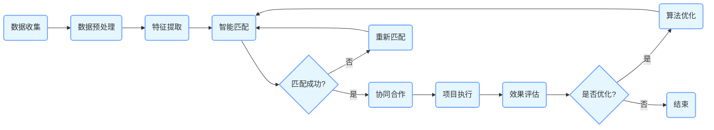

# AI驱动的企业创新生态系统构建：内外部资源智能匹配与协同

> 关键词：AI、企业创新生态系统、内外部资源、智能匹配、协同合作

> 摘要：本文聚焦于AI驱动下企业创新生态系统的构建，重点探讨内外部资源的智能匹配与协同问题。首先介绍了相关背景，包括研究目的、预期读者等内容。接着阐述核心概念与联系，呈现其原理和架构。详细讲解核心算法原理并给出Python代码示例，同时分析相关数学模型和公式。通过项目实战展示代码实现与解读。分析了实际应用场景，推荐了学习、开发工具和相关论文著作。最后总结未来发展趋势与挑战，解答常见问题并提供扩展阅读和参考资料，旨在为企业借助AI构建高效创新生态系统提供全面的理论和实践指导。

## 1. 背景介绍 
### 1.1 目的和范围
在当今数字化时代，企业面临着日益激烈的市场竞争，创新成为企业生存和发展的关键。AI技术的快速发展为企业创新带来了新的机遇。本研究的目的在于探索如何利用AI构建企业创新生态系统，实现内外部资源的智能匹配与协同，以提升企业的创新能力和竞争力。

研究范围涵盖了AI技术在企业创新生态系统中的应用，包括资源的识别、匹配算法、协同机制等方面。同时，通过实际案例分析，探讨了该系统在不同行业的应用效果和可行性。

### 1.2 预期读者
本文的预期读者主要包括企业管理人员、技术研发人员、创新领域的研究人员以及对AI和企业创新感兴趣的相关人士。企业管理人员可以从中获取构建创新生态系统的思路和方法，技术研发人员可以借鉴相关算法和代码实现，研究人员可以进一步深入探讨该领域的理论和实践问题。

### 1.3 文档结构概述
本文共分为十个部分。第一部分为背景介绍，阐述研究的目的、范围、预期读者和文档结构。第二部分介绍核心概念与联系，包括企业创新生态系统、内外部资源、智能匹配和协同等概念，并给出原理和架构示意图。第三部分详细讲解核心算法原理和具体操作步骤，提供Python源代码。第四部分分析数学模型和公式，并举例说明。第五部分通过项目实战展示代码的实际应用和详细解释。第六部分探讨实际应用场景。第七部分推荐学习资源、开发工具和相关论文著作。第八部分总结未来发展趋势与挑战。第九部分解答常见问题。第十部分提供扩展阅读和参考资料。

### 1.4 术语表
#### 1.4.1 核心术语定义
- **企业创新生态系统**：是指企业与其内外部利益相关者（如供应商、客户、合作伙伴等）相互作用、相互影响而形成的一个动态的、开放的创新网络。
- **内外部资源**：内部资源包括企业的人力、物力、财力等；外部资源包括供应商资源、技术资源、市场资源等。
- **智能匹配**：利用AI技术，根据资源的特征和需求，自动找到最适合的匹配对象。
- **协同合作**：内外部资源在匹配的基础上，通过有效的沟通和协调机制，共同完成创新项目。

#### 1.4.2 相关概念解释
- **AI技术**：包括机器学习、深度学习、自然语言处理等一系列技术，用于实现资源的智能识别、分析和匹配。
- **创新生态系统的开放性**：意味着企业可以与外部合作伙伴进行广泛的合作，共享资源和知识，促进创新的产生。
- **资源的互补性**：不同资源之间具有相互补充的特性，通过智能匹配和协同合作，可以实现资源的优化配置。

#### 1.4.3 缩略词列表
- **AI**：Artificial Intelligence（人工智能）
- **ML**：Machine Learning（机器学习）
- **DL**：Deep Learning（深度学习）
- **NLP**：Natural Language Processing（自然语言处理）

## 2. 核心概念与联系 
### 核心概念原理
企业创新生态系统的构建基于AI技术实现内外部资源的智能匹配与协同。其核心原理是通过对企业内外部资源的数字化表示和分析，利用AI算法找到资源之间的匹配关系，并建立协同合作机制。

内部资源可以通过企业的信息系统进行收集和整理，包括员工的技能、项目经验、设备的性能等。外部资源可以通过网络爬虫、数据接口等方式获取，如供应商的产品信息、技术服务提供商的能力等。

AI算法对这些资源进行特征提取和分析，根据资源的需求和特征进行匹配。例如，企业需要一项特定的技术服务，AI系统可以通过对外部技术服务提供商的信息进行分析，找到最符合需求的合作伙伴。

在匹配完成后，建立协同合作机制，确保内外部资源能够有效地合作。这包括沟通平台的搭建、项目管理工具的使用等，以实现创新项目的顺利进行。

### 架构的文本示意图
企业创新生态系统的架构可以分为四个层次：数据层、算法层、应用层和用户层。

数据层：负责收集、存储和管理企业内外部资源的数据。包括内部数据库、外部数据源（如供应商数据库、行业报告等）。

算法层：利用AI算法对数据层的数据进行处理和分析，实现资源的智能匹配和协同决策。主要算法包括机器学习算法（如聚类算法、推荐算法）、深度学习算法（如神经网络）等。

应用层：提供具体的应用功能，如资源匹配平台、协同工作平台等。用户可以通过这些平台进行资源的查询、匹配和协同合作。

用户层：包括企业内部的管理人员、员工，以及外部的合作伙伴、供应商等。不同用户角色可以根据权限访问和使用系统的功能。

### Mermaid流程图


## 3. 核心算法原理 & 具体操作步骤 
### 核心算法原理
在企业创新生态系统中，智能匹配的核心算法可以采用基于内容的推荐算法。该算法的基本思想是根据资源的特征向量，计算资源之间的相似度，从而找到最匹配的资源。

假设我们有一个资源集合 $R = \{r_1, r_2,..., r_n\}$，每个资源 $r_i$ 可以用一个特征向量 $\mathbf{x}_i$ 表示。对于一个给定的需求资源 $r_d$，其特征向量为 $\mathbf{x}_d$，我们可以通过计算 $\mathbf{x}_d$ 与 $\mathbf{x}_i$ 之间的相似度来找到最匹配的资源。

常用的相似度计算方法有余弦相似度、欧几里得距离等。这里我们采用余弦相似度，其计算公式为：

$$
\cos(\theta) = \frac{\mathbf{x}_d \cdot \mathbf{x}_i}{\|\mathbf{x}_d\| \|\mathbf{x}_i\|}
$$

其中，$\mathbf{x}_d \cdot \mathbf{x}_i$ 表示向量的点积，$\|\mathbf{x}_d\|$ 和 $\|\mathbf{x}_i\|$ 分别表示向量的模。

### 具体操作步骤
1. **数据收集**：收集企业内外部资源的数据，并进行整理和存储。
2. **特征提取**：对每个资源进行特征提取，将其表示为特征向量。例如，对于技术服务提供商，可以提取其技术领域、服务质量、价格等特征。
3. **相似度计算**：对于给定的需求资源，计算其与所有资源的余弦相似度。
4. **排序和选择**：根据相似度的大小对资源进行排序，选择相似度最高的资源作为匹配结果。

### Python源代码实现
```python
import numpy as np

def cosine_similarity(x1, x2):
    """
    计算两个向量的余弦相似度
    """
    dot_product = np.dot(x1, x2)
    norm_x1 = np.linalg.norm(x1)
    norm_x2 = np.linalg.norm(x2)
    return dot_product / (norm_x1 * norm_x2)

def resource_matching(resource_list, demand_resource):
    """
    资源匹配函数
    """
    similarities = []
    for resource in resource_list:
        similarity = cosine_similarity(demand_resource, resource)
        similarities.append(similarity)
    
    # 找到相似度最高的资源的索引
    best_match_index = np.argmax(similarities)
    return best_match_index

# 示例数据
resource_list = [
    np.array([1, 2, 3]),
    np.array([4, 5, 6]),
    np.array([7, 8, 9])
]
demand_resource = np.array([2, 3, 4])

# 进行资源匹配
best_match_index = resource_matching(resource_list, demand_resource)
print(f"最匹配的资源索引为: {best_match_index}")
```

## 4. 数学模型和公式 & 详细讲解 & 举例说明 
### 数学模型
在企业创新生态系统的智能匹配中，我们可以建立一个基于向量空间模型的数学模型。假设资源集合 $R = \{r_1, r_2,..., r_n\}$ 中的每个资源 $r_i$ 可以用一个 $m$ 维的特征向量 $\mathbf{x}_i = (x_{i1}, x_{i2},..., x_{im})$ 表示，需求资源 $r_d$ 用特征向量 $\mathbf{x}_d = (x_{d1}, x_{d2},..., x_{dm})$ 表示。

我们的目标是找到一个资源 $r_j \in R$，使得 $\mathbf{x}_d$ 与 $\mathbf{x}_j$ 之间的相似度最大。

### 公式详细讲解
#### 余弦相似度公式
$$
\cos(\theta) = \frac{\mathbf{x}_d \cdot \mathbf{x}_i}{\|\mathbf{x}_d\| \|\mathbf{x}_i\|}
$$

- **分子 $\mathbf{x}_d \cdot \mathbf{x}_i$**：表示向量 $\mathbf{x}_d$ 和 $\mathbf{x}_i$ 的点积，计算公式为 $\mathbf{x}_d \cdot \mathbf{x}_i = \sum_{k=1}^{m} x_{dk} x_{ik}$。点积反映了两个向量在方向上的相似程度，点积越大，说明两个向量在方向上越接近。
- **分母 $\|\mathbf{x}_d\| \|\mathbf{x}_i\|$**：$\|\mathbf{x}_d\|$ 和 $\|\mathbf{x}_i\|$ 分别表示向量 $\mathbf{x}_d$ 和 $\mathbf{x}_i$ 的模，计算公式为 $\|\mathbf{x}\| = \sqrt{\sum_{k=1}^{m} x_{k}^2}$。分母的作用是对向量的长度进行归一化，使得余弦相似度的值在 $[-1, 1]$ 之间。

#### 欧几里得距离公式
另一种常用的相似度度量方法是欧几里得距离，其计算公式为：

$$
d(\mathbf{x}_d, \mathbf{x}_i) = \sqrt{\sum_{k=1}^{m} (x_{dk} - x_{ik})^2}
$$

欧几里得距离反映了两个向量在空间中的距离，距离越小，说明两个向量越相似。

### 举例说明
假设我们有三个技术服务提供商，其特征向量分别为：

$\mathbf{x}_1 = (1, 2, 3)$，$\mathbf{x}_2 = (4, 5, 6)$，$\mathbf{x}_3 = (7, 8, 9)$

企业的需求资源特征向量为 $\mathbf{x}_d = (2, 3, 4)$

我们分别计算 $\mathbf{x}_d$ 与 $\mathbf{x}_1$、$\mathbf{x}_2$、$\mathbf{x}_3$ 的余弦相似度：

- $\cos(\theta_1) = \frac{\mathbf{x}_d \cdot \mathbf{x}_1}{\|\mathbf{x}_d\| \|\mathbf{x}_1\|} = \frac{2\times1 + 3\times2 + 4\times3}{\sqrt{2^2 + 3^2 + 4^2} \sqrt{1^2 + 2^2 + 3^2}} \approx 0.99$
- $\cos(\theta_2) = \frac{\mathbf{x}_d \cdot \mathbf{x}_2}{\|\mathbf{x}_d\| \|\mathbf{x}_2\|} = \frac{2\times4 + 3\times5 + 4\times6}{\sqrt{2^2 + 3^2 + 4^2} \sqrt{4^2 + 5^2 + 6^2}} \approx 0.98$
- $\cos(\theta_3) = \frac{\mathbf{x}_d \cdot \mathbf{x}_3}{\|\mathbf{x}_d\| \|\mathbf{x}_3\|} = \frac{2\times7 + 3\times8 + 4\times9}{\sqrt{2^2 + 3^2 + 4^2} \sqrt{7^2 + 8^2 + 9^2}} \approx 0.97$

通过比较余弦相似度的值，我们可以发现 $\mathbf{x}_d$ 与 $\mathbf{x}_1$ 的相似度最高，因此选择 $\mathbf{x}_1$ 对应的技术服务提供商作为匹配结果。

## 5. 项目实战：代码实际案例和详细解释说明 
### 5.1  开发环境搭建
在进行项目实战之前，我们需要搭建开发环境。以下是具体步骤：

1. **安装Python**：建议安装Python 3.7及以上版本。可以从Python官方网站（https://www.python.org/downloads/）下载安装包进行安装。
2. **安装必要的库**：我们需要安装NumPy、Pandas等库。可以使用以下命令进行安装：
```sh
pip install numpy pandas
```

### 5.2  源代码详细实现和代码解读
以下是一个完整的企业创新生态系统资源匹配项目的代码示例：

```python
import numpy as np
import pandas as pd

def cosine_similarity(x1, x2):
    """
    计算两个向量的余弦相似度
    """
    dot_product = np.dot(x1, x2)
    norm_x1 = np.linalg.norm(x1)
    norm_x2 = np.linalg.norm(x2)
    return dot_product / (norm_x1 * norm_x2)

def resource_matching(resource_df, demand_vector):
    """
    资源匹配函数
    """
    similarities = []
    for index, row in resource_df.iterrows():
        resource_vector = row.values
        similarity = cosine_similarity(demand_vector, resource_vector)
        similarities.append(similarity)
    
    # 找到相似度最高的资源的索引
    best_match_index = np.argmax(similarities)
    return best_match_index

# 读取资源数据
resource_data = {
    'feature1': [1, 4, 7],
    'feature2': [2, 5, 8],
    'feature3': [3, 6, 9]
}
resource_df = pd.DataFrame(resource_data)

# 定义需求资源向量
demand_vector = np.array([2, 3, 4])

# 进行资源匹配
best_match_index = resource_matching(resource_df, demand_vector)

# 输出匹配结果
best_match_resource = resource_df.iloc[best_match_index]
print("最匹配的资源信息:")
print(best_match_resource)
```

### 代码解读与分析
1. **导入必要的库**：导入NumPy和Pandas库，NumPy用于数值计算，Pandas用于数据处理。
2. **定义余弦相似度函数**：`cosine_similarity` 函数用于计算两个向量的余弦相似度。
3. **定义资源匹配函数**：`resource_matching` 函数接受一个包含资源数据的DataFrame和一个需求资源向量作为输入，计算需求向量与每个资源向量的余弦相似度，并返回相似度最高的资源的索引。
4. **读取资源数据**：使用Pandas创建一个DataFrame来存储资源数据。
5. **定义需求资源向量**：将需求资源表示为一个NumPy数组。
6. **进行资源匹配**：调用 `resource_matching` 函数进行资源匹配，得到最匹配的资源的索引。
7. **输出匹配结果**：根据索引从DataFrame中获取最匹配的资源信息并输出。

## 6. 实际应用场景 
### 供应链管理
在供应链管理中，企业可以利用AI驱动的创新生态系统实现内外部资源的智能匹配与协同。例如，企业可以通过系统自动匹配最合适的供应商，根据供应商的价格、质量、交货期等因素进行综合评估。同时，系统可以实现企业与供应商之间的协同合作，实时共享订单信息、库存信息等，提高供应链的效率和灵活性。

### 技术创新合作
企业在进行技术创新时，往往需要与外部的科研机构、高校等合作。通过AI系统，企业可以快速找到与自身技术需求相匹配的合作伙伴。系统可以根据企业的技术难题和科研机构的研究方向进行智能匹配，促进技术创新项目的顺利开展。

### 市场营销
在市场营销方面，企业可以利用AI系统实现内外部资源的协同。例如，企业可以将内部的市场调研数据与外部的市场趋势数据进行整合，通过智能算法分析消费者需求。同时，系统可以匹配最合适的营销渠道和合作伙伴，提高市场营销的效果。

### 人才招聘
企业在招聘人才时，可以利用AI驱动的创新生态系统实现智能匹配。系统可以根据企业的岗位需求和候选人的技能、经验等信息进行匹配，推荐最合适的候选人。同时，系统可以实现企业与候选人之间的协同沟通，提高招聘效率。

## 7. 工具和资源推荐
### 7.1 学习资源推荐
#### 7.1.1 书籍推荐
- 《人工智能：一种现代的方法》：这本书是人工智能领域的经典教材，全面介绍了人工智能的各个方面，包括搜索算法、机器学习、自然语言处理等。
- 《Python机器学习》：详细介绍了Python在机器学习中的应用，包括各种机器学习算法的原理和实现。
- 《创新生态系统：技术创新与企业战略》：探讨了创新生态系统的理论和实践，对企业构建创新生态系统具有重要的指导意义。

#### 7.1.2 在线课程
- Coursera上的“人工智能基础”课程：由知名高校的教授授课，系统介绍了人工智能的基本概念和方法。
- edX上的“Python数据分析”课程：帮助学习者掌握Python在数据分析中的应用，为企业创新生态系统的数据处理提供支持。
- 中国大学MOOC上的“创新管理”课程：介绍了创新管理的理论和方法，对企业创新生态系统的管理具有重要的参考价值。

#### 7.1.3 技术博客和网站
- Medium：上面有很多关于AI和企业创新的技术博客文章，涵盖了最新的研究成果和实践经验。
- Towards Data Science：专注于数据科学和机器学习领域，提供了大量的技术文章和案例分析。
- 开源中国：国内知名的技术社区，有很多关于企业创新和AI应用的讨论和分享。

### 7.2 开发工具框架推荐
#### 7.2.1 IDE和编辑器
- PyCharm：一款功能强大的Python集成开发环境，提供了代码编辑、调试、版本控制等功能，适合开发企业创新生态系统的Python代码。
- Jupyter Notebook：交互式的开发环境，适合进行数据探索和模型验证，方便团队成员之间的协作和交流。
- Visual Studio Code：轻量级的代码编辑器，支持多种编程语言和插件扩展，可用于开发和调试AI相关的代码。

#### 7.2.2 调试和性能分析工具
- PDB：Python自带的调试器，可以帮助开发者定位代码中的问题。
- cProfile：Python的性能分析工具，可以分析代码的运行时间和资源消耗，帮助优化代码性能。
- TensorBoard：用于可视化深度学习模型的训练过程和结果，方便开发者监控模型的性能。

#### 7.2.3 相关框架和库
- NumPy：用于数值计算和数组操作，是Python中进行科学计算的基础库。
- Pandas：用于数据处理和分析，提供了高效的数据结构和数据操作方法。
- Scikit-learn：机器学习库，包含了各种常用的机器学习算法和工具，方便开发者进行模型训练和评估。
- TensorFlow和PyTorch：深度学习框架，用于构建和训练深度学习模型，可应用于资源的智能匹配和预测。

### 7.3 相关论文著作推荐
#### 7.3.1 经典论文
- “The Ecology of Innovation Systems”：该论文首次提出了创新生态系统的概念，对后续的研究产生了深远的影响。
- “Machine Learning: A Probabilistic Perspective”：从概率的角度介绍了机器学习的基本原理和方法，为AI在企业创新生态系统中的应用提供了理论基础。
- “Resource-Based View of the Firm”：阐述了企业资源基础理论，对理解企业内外部资源的重要性和价值具有重要意义。

#### 7.3.2 最新研究成果
- “AI-Enabled Resource Allocation in Innovation Ecosystems”：研究了如何利用AI技术实现创新生态系统中资源的优化配置。
- “Collaborative Innovation in Digital Ecosystems: A Review and Future Research Directions”：对数字创新生态系统中的协同创新进行了综述和展望。
- “Smart Matching and Collaboration in Enterprise Ecosystems: An AI-Driven Approach”：探讨了AI驱动下企业生态系统中资源的智能匹配和协同合作问题。

#### 7.3.3 应用案例分析
- “Case Studies of AI-Enhanced Innovation Ecosystems in High-Tech Industries”：分析了高科技行业中AI增强型创新生态系统的应用案例，为企业提供了实践参考。
- “How Companies Leverage AI for Resource Coordination in Innovation Networks”：研究了企业如何利用AI进行创新网络中的资源协调。
- “AI-Powered Supply Chain Innovation: Real-World Examples”：介绍了AI在供应链创新中的实际应用案例，展示了AI驱动的创新生态系统在供应链管理中的效果。

## 8. 总结：未来发展趋势与挑战
### 未来发展趋势
- **智能化程度不断提高**：随着AI技术的不断发展，企业创新生态系统的智能化程度将不断提高。系统将能够更准确地识别资源需求，实现更高效的资源匹配和协同合作。
- **与区块链技术融合**：区块链技术具有去中心化、不可篡改等特点，可以为企业创新生态系统提供更安全、可信的合作环境。未来，AI与区块链技术的融合将成为企业创新生态系统发展的重要趋势。
- **跨行业合作加强**：企业将越来越多地与不同行业的合作伙伴进行合作，实现资源的互补和共享。AI驱动的创新生态系统将促进跨行业合作的发展，推动产业融合和创新。

### 挑战
- **数据隐私和安全问题**：企业创新生态系统涉及大量的内外部资源数据，数据隐私和安全问题是一个重要的挑战。企业需要采取有效的措施来保护数据的安全，防止数据泄露和滥用。
- **AI算法的可解释性**：AI算法在资源匹配和协同决策中起着关键作用，但很多算法具有较高的复杂性，其决策过程难以解释。这可能会影响企业对系统的信任和应用。
- **人才短缺**：构建和运营AI驱动的企业创新生态系统需要具备AI技术、创新管理等多方面知识的复合型人才。目前，这类人才相对短缺，是企业面临的一个挑战。

## 9. 附录：常见问题与解答
### 1. 如何确保AI算法在资源匹配中的准确性？
可以通过以下方法确保AI算法在资源匹配中的准确性：
- **数据质量**：确保收集的数据准确、完整、一致，对数据进行清洗和预处理，去除噪声和异常值。
- **特征工程**：选择合适的特征来表示资源，提高特征的区分度和相关性。
- **模型评估和优化**：使用合适的评估指标对模型进行评估，根据评估结果对模型进行优化和调整。

### 2. 企业如何与外部合作伙伴建立有效的协同合作机制？
企业可以通过以下方式与外部合作伙伴建立有效的协同合作机制：
- **沟通平台**：搭建专门的沟通平台，方便企业与合作伙伴之间的信息共享和沟通。
- **合作协议**：制定明确的合作协议，明确双方的权利和义务，规范合作流程。
- **激励机制**：建立合理的激励机制，鼓励合作伙伴积极参与创新项目，提高合作的积极性和效率。

### 3. AI驱动的企业创新生态系统对企业的组织架构有什么影响？
AI驱动的企业创新生态系统可能会对企业的组织架构产生以下影响：
- **扁平化**：系统的智能化和自动化将减少中间管理层的需求，使企业的组织架构更加扁平化。
- **跨部门合作**：促进企业内部不同部门之间的合作，打破部门壁垒，提高企业的创新能力。
- **外部合作增加**：企业将更多地与外部合作伙伴进行合作，需要建立相应的组织架构来管理外部合作关系。

## 10. 扩展阅读 & 参考资料
### 扩展阅读
- 《智能商业》：探讨了AI在商业领域的应用和发展趋势，对企业创新生态系统的构建具有重要的启示。
- 《第四次工业革命》：介绍了第四次工业革命的特点和影响，分析了AI等新兴技术在工业领域的应用前景。
- 《平台战略》：阐述了平台经济的理论和实践，对企业创新生态系统的平台建设具有参考价值。

### 参考资料
- 《企业创新生态系统研究综述》：对企业创新生态系统的相关研究进行了综述，为本文的研究提供了理论基础。
- 《AI技术在企业资源管理中的应用研究》：研究了AI技术在企业资源管理中的应用，为本文的资源匹配和协同提供了技术支持。
- 《创新生态系统案例分析报告》：分析了多个企业创新生态系统的案例，为本文的实际应用场景提供了参考。

作者：AI天才研究院/AI Genius Institute & 禅与计算机程序设计艺术 /Zen And The Art of Computer Programming