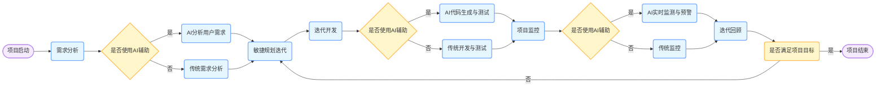

# AI驱动的企业创新项目管理：敏捷方法与AI的结合

> 关键词：AI、企业创新项目管理、敏捷方法、结合、项目效率

> 摘要：本文深入探讨了AI驱动的企业创新项目管理中敏捷方法与AI结合的相关内容。随着企业面临的竞争环境日益复杂，创新项目管理的重要性愈发凸显。敏捷方法以其灵活性和快速响应能力在项目管理领域得到广泛应用，而AI技术的发展为项目管理带来了新的机遇和变革。文章将详细分析两者的核心概念、结合原理、相关算法、数学模型，通过项目实战案例展示具体应用，探讨实际应用场景，推荐相关工具和资源，最后总结未来发展趋势与挑战，旨在为企业提供全面的理论和实践指导，帮助企业更好地利用AI与敏捷方法提升创新项目管理水平。

## 1. 背景介绍 
### 1.1 目的和范围
在当今快速发展的商业环境中，企业需要不断创新以保持竞争力。创新项目管理对于企业实现战略目标至关重要。本文章的目的在于探讨如何将AI技术与敏捷方法有效结合，应用于企业创新项目管理中，以提高项目的效率、质量和创新性。范围涵盖了核心概念的解释、结合原理的分析、相关算法和数学模型的介绍、项目实战案例的分享以及实际应用场景的探讨等方面。

### 1.2 预期读者
本文预期读者包括企业的项目管理人员、创新团队成员、技术研发人员以及对AI和项目管理感兴趣的研究人员。这些读者希望通过了解AI与敏捷方法的结合，为企业创新项目管理带来新的思路和方法，提升项目管理的水平和效果。

### 1.3 文档结构概述
本文首先介绍背景信息，包括目的、预期读者和文档结构概述等。接着阐述核心概念与联系，展示核心概念的原理和架构，并通过Mermaid流程图进行可视化呈现。然后详细讲解核心算法原理和具体操作步骤，结合Python源代码进行说明。之后介绍数学模型和公式，并举例说明。通过项目实战部分，展示代码实际案例和详细解释说明。再探讨实际应用场景，推荐相关工具和资源。最后总结未来发展趋势与挑战，提供常见问题与解答和扩展阅读及参考资料。

### 1.4 术语表
#### 1.4.1 核心术语定义
- **AI（Artificial Intelligence）**：人工智能，是指计算机系统能够执行通常需要人类智能才能完成的任务，如学习、推理、解决问题等。
- **敏捷方法（Agile Methodology）**：一种项目管理方法，强调快速响应变化、团队协作、客户参与和迭代开发。
- **企业创新项目管理**：对企业内部创新项目进行规划、组织、协调和控制，以实现项目目标和企业战略的过程。

#### 1.4.2 相关概念解释
- **迭代开发**：将项目划分为多个短周期的迭代，每个迭代都有明确的目标和可交付成果，通过不断迭代逐步完善项目。
- **用户故事**：从用户的角度描述项目的需求和功能，是敏捷方法中需求管理的重要工具。
- **机器学习**：AI的一个分支，通过让计算机从数据中学习模式和规律，从而实现预测和决策等功能。

#### 1.4.3 缩略词列表
- **AI**：Artificial Intelligence
- **PM**：Project Management

## 2. 核心概念与联系 
### 核心概念原理
#### AI原理
AI的核心原理在于模拟人类的智能行为。它主要基于机器学习、深度学习、自然语言处理等技术。机器学习通过算法让计算机从大量数据中学习模式和规律，例如决策树算法可以根据数据的特征进行分类和预测；深度学习则利用多层神经网络对数据进行深度特征提取和学习，在图像识别、语音识别等领域取得了巨大成功；自然语言处理使得计算机能够理解和处理人类语言，实现人机交互。

#### 敏捷方法原理
敏捷方法强调团队的自组织和协作，以用户为中心，通过快速迭代的方式进行项目开发。它采用短周期的迭代计划，每个迭代都有明确的目标和可交付成果，团队成员在迭代过程中紧密合作，及时响应变化。敏捷方法注重面对面的沟通和快速反馈，通过每日站会、迭代回顾等活动，不断改进项目流程和产品质量。

### 架构的文本示意图
AI与敏捷方法结合的架构可以描述为：在企业创新项目管理的框架下，敏捷方法作为项目的组织和管理模式，提供了项目的流程和节奏。AI技术则贯穿于项目的各个阶段，为项目提供数据支持、智能决策和自动化工具。具体来说，在需求分析阶段，AI可以通过自然语言处理技术对用户需求进行分析和分类；在项目规划阶段，AI可以根据历史数据和项目特征进行资源分配和进度预测；在开发阶段，AI可以实现代码的自动生成和测试；在项目监控阶段，AI可以实时监测项目的进度和质量，提供预警和决策建议。

### Mermaid流程图


## 3. 核心算法原理 & 具体操作步骤 
### 需求分析阶段的AI算法原理
在需求分析阶段，我们可以使用自然语言处理中的文本分类算法来对用户需求进行分类。以朴素贝叶斯算法为例，其原理基于贝叶斯定理，通过计算不同类别的先验概率和条件概率，来预测一个文本属于某个类别的概率。

#### Python源代码实现
```python
from sklearn.feature_extraction.text import CountVectorizer
from sklearn.naive_bayes import MultinomialNB
from sklearn.model_selection import train_test_split
from sklearn.metrics import accuracy_score

# 示例数据
documents = ["我想要一个能拍照的手机", "这个软件的界面太丑了", "我希望这个网站的加载速度能快点"]
labels = ["产品功能需求", "用户体验需求", "性能需求"]

# 特征提取
vectorizer = CountVectorizer()
X = vectorizer.fit_transform(documents)

# 划分训练集和测试集
X_train, X_test, y_train, y_test = train_test_split(X, labels, test_size=0.2, random_state=42)

# 训练模型
clf = MultinomialNB()
clf.fit(X_train, y_train)

# 预测
y_pred = clf.predict(X_test)

# 评估模型
accuracy = accuracy_score(y_test, y_pred)
print(f"模型准确率: {accuracy}")
```

### 操作步骤
1. **数据收集**：收集用户的需求文本和对应的类别标签。
2. **特征提取**：使用`CountVectorizer`将文本转换为向量表示。
3. **数据划分**：将数据集划分为训练集和测试集。
4. **模型训练**：使用`MultinomialNB`训练朴素贝叶斯分类器。
5. **模型预测**：对测试集进行预测。
6. **模型评估**：计算模型的准确率。

### 项目规划阶段的AI算法原理
在项目规划阶段，我们可以使用线性回归算法来预测项目的工期。线性回归的原理是通过找到一条最佳的直线来拟合数据，使得数据点到直线的误差平方和最小。

#### Python源代码实现
```python
import numpy as np
from sklearn.linear_model import LinearRegression
from sklearn.model_selection import train_test_split
from sklearn.metrics import mean_squared_error

# 示例数据
X = np.array([[10, 20, 30], [20, 30, 40], [30, 40, 50]])  # 项目特征，如工作量、资源数量等
y = np.array([50, 60, 70])  # 项目工期

# 划分训练集和测试集
X_train, X_test, y_train, y_test = train_test_split(X, y, test_size=0.2, random_state=42)

# 训练模型
model = LinearRegression()
model.fit(X_train, y_train)

# 预测
y_pred = model.predict(X_test)

# 评估模型
mse = mean_squared_error(y_test, y_pred)
print(f"均方误差: {mse}")
```

### 操作步骤
1. **数据收集**：收集项目的特征数据和对应的工期数据。
2. **数据划分**：将数据集划分为训练集和测试集。
3. **模型训练**：使用`LinearRegression`训练线性回归模型。
4. **模型预测**：对测试集进行预测。
5. **模型评估**：计算模型的均方误差。

## 4. 数学模型和公式 & 详细讲解 & 举例说明 
### 朴素贝叶斯算法的数学模型和公式
#### 贝叶斯定理
贝叶斯定理的公式为：
$$P(C|X)=\frac{P(X|C)P(C)}{P(X)}$$
其中，$P(C|X)$ 表示在给定特征 $X$ 的情况下，类别 $C$ 的后验概率；$P(X|C)$ 表示在类别 $C$ 的条件下，特征 $X$ 的似然概率；$P(C)$ 表示类别 $C$ 的先验概率；$P(X)$ 表示特征 $X$ 的概率。

#### 朴素贝叶斯分类器
在朴素贝叶斯分类器中，假设特征之间是相互独立的，因此可以将 $P(X|C)$ 分解为各个特征的条件概率的乘积：
$$P(X|C)=\prod_{i=1}^{n}P(x_i|C)$$
其中，$x_i$ 表示第 $i$ 个特征。

#### 举例说明
假设有一个文本分类问题，类别有“体育”和“科技”，特征是文本中的单词。我们有以下训练数据：
- 体育类文本：“篮球比赛很精彩”，“足球是世界第一运动”
- 科技类文本：“人工智能发展迅速”，“计算机技术不断进步”

现在有一个新的文本“篮球是一项有趣的运动”，我们要判断它属于哪个类别。首先，计算各个类别的先验概率：
- $P(体育)=\frac{2}{4}=0.5$
- $P(科技)=\frac{2}{4}=0.5$

然后，计算似然概率，例如对于“篮球”这个单词，在体育类文本中出现的概率：
$P(篮球|体育)=\frac{1}{2}$
$P(篮球|科技)=0$

以此类推，计算出所有单词的似然概率，再根据贝叶斯定理计算后验概率，比较不同类别的后验概率大小，将文本分类到后验概率最大的类别中。

### 线性回归算法的数学模型和公式
#### 线性回归模型
线性回归模型的公式为：
$$y = \theta_0 + \theta_1x_1 + \theta_2x_2 + \cdots + \theta_nx_n + \epsilon$$
其中，$y$ 是因变量，$x_1, x_2, \cdots, x_n$ 是自变量，$\theta_0, \theta_1, \cdots, \theta_n$ 是模型的参数，$\epsilon$ 是误差项。

#### 最小二乘法
线性回归模型的参数通常使用最小二乘法来估计，即找到一组参数 $\theta$ 使得误差平方和最小：
$$\min_{\theta} \sum_{i=1}^{m}(y^{(i)} - \theta_0 - \theta_1x_1^{(i)} - \cdots - \theta_nx_n^{(i)})^2$$
其中，$m$ 是样本数量，$y^{(i)}$ 是第 $i$ 个样本的因变量值，$x_j^{(i)}$ 是第 $i$ 个样本的第 $j$ 个自变量值。

#### 举例说明
假设有一个项目，自变量是工作量 $x_1$ 和资源数量 $x_2$，因变量是工期 $y$。我们有以下数据：
| 工作量 $x_1$ | 资源数量 $x_2$ | 工期 $y$ |
|---|---|---|
| 10 | 20 | 50 |
| 20 | 30 | 60 |
| 30 | 40 | 70 |

我们可以使用线性回归模型来预测工期。首先，将数据代入线性回归模型，然后使用最小二乘法求解参数 $\theta_0, \theta_1, \theta_2$。得到参数后，就可以根据新的工作量和资源数量来预测工期。

## 5. 项目实战：代码实际案例和详细解释说明 
### 5.1  开发环境搭建
#### 操作系统
可以选择Windows、Linux或macOS等操作系统。

#### 编程语言
使用Python作为开发语言，推荐使用Python 3.7及以上版本。

#### 开发工具
可以使用PyCharm、Jupyter Notebook等开发工具。

#### 安装依赖库
使用以下命令安装所需的依赖库：
```bash
pip install scikit-learn pandas numpy matplotlib
```

### 5.2  源代码详细实现和代码解读
#### 需求分析模块
```python
import pandas as pd
from sklearn.feature_extraction.text import TfidfVectorizer
from sklearn.naive_bayes import MultinomialNB
from sklearn.model_selection import train_test_split
from sklearn.metrics import classification_report

# 加载数据
data = pd.read_csv('user_requirements.csv')
X = data['requirement_text']
y = data['category']

# 特征提取
vectorizer = TfidfVectorizer()
X = vectorizer.fit_transform(X)

# 划分训练集和测试集
X_train, X_test, y_train, y_test = train_test_split(X, y, test_size=0.2, random_state=42)

# 训练模型
clf = MultinomialNB()
clf.fit(X_train, y_train)

# 预测
y_pred = clf.predict(X_test)

# 评估模型
print(classification_report(y_test, y_pred))
```
**代码解读**：
1. **数据加载**：使用`pandas`库加载用户需求数据，`X` 是需求文本，`y` 是对应的类别标签。
2. **特征提取**：使用`TfidfVectorizer`将文本转换为TF-IDF向量，TF-IDF可以反映单词在文本中的重要性。
3. **数据划分**：将数据集划分为训练集和测试集，比例为8:2。
4. **模型训练**：使用`MultinomialNB`训练朴素贝叶斯分类器。
5. **模型预测**：对测试集进行预测。
6. **模型评估**：使用`classification_report`输出分类报告，包括准确率、召回率、F1值等指标。

#### 项目规划模块
```python
import pandas as pd
from sklearn.linear_model import LinearRegression
from sklearn.model_selection import train_test_split
from sklearn.metrics import mean_squared_error

# 加载数据
data = pd.read_csv('project_data.csv')
X = data[['workload', 'resource']]
y = data['duration']

# 划分训练集和测试集
X_train, X_test, y_train, y_test = train_test_split(X, y, test_size=0.2, random_state=42)

# 训练模型
model = LinearRegression()
model.fit(X_train, y_train)

# 预测
y_pred = model.predict(X_test)

# 评估模型
mse = mean_squared_error(y_test, y_pred)
print(f"均方误差: {mse}")
```
**代码解读**：
1. **数据加载**：使用`pandas`库加载项目数据，`X` 是项目的特征（工作量和资源数量），`y` 是项目的工期。
2. **数据划分**：将数据集划分为训练集和测试集，比例为8:2。
3. **模型训练**：使用`LinearRegression`训练线性回归模型。
4. **模型预测**：对测试集进行预测。
5. **模型评估**：计算模型的均方误差。

### 5.3  代码解读与分析
#### 需求分析模块
- **优点**：使用TF-IDF特征提取可以更好地反映单词的重要性，提高分类的准确性。朴素贝叶斯算法简单高效，适合处理文本分类问题。
- **缺点**：朴素贝叶斯算法假设特征之间相互独立，在实际应用中可能不成立，导致分类效果受到影响。
- **改进方向**：可以尝试使用更复杂的深度学习模型，如卷积神经网络（CNN）或循环神经网络（RNN）来处理文本分类问题。

#### 项目规划模块
- **优点**：线性回归模型简单易懂，计算效率高，可以快速得到项目工期的预测结果。
- **缺点**：线性回归模型假设自变量和因变量之间存在线性关系，在实际应用中可能存在非线性关系，导致预测误差较大。
- **改进方向**：可以尝试使用非线性回归模型，如决策树回归、随机森林回归等，来提高预测的准确性。

## 6. 实际应用场景 
### 软件开发项目
在软件开发项目中，敏捷方法可以快速响应客户需求的变化，通过迭代开发不断完善软件功能。AI技术可以在需求分析阶段对用户需求进行分类和优先级排序，帮助团队更好地理解需求；在项目规划阶段，根据历史项目数据预测开发周期和资源需求；在开发阶段，实现代码的自动生成和测试，提高开发效率；在项目监控阶段，实时监测代码质量和项目进度，及时发现问题并提供预警。

### 新产品研发项目
对于新产品研发项目，敏捷方法可以促进跨部门团队的协作，快速将创意转化为实际产品。AI技术可以在市场调研阶段分析用户需求和市场趋势，为产品设计提供参考；在产品设计阶段，使用AI算法进行优化设计，提高产品性能；在生产制造阶段，通过AI技术实现质量控制和生产过程优化；在产品推广阶段，利用AI进行精准营销和客户反馈分析。

### 营销活动项目
在营销活动项目中，敏捷方法可以使团队快速调整营销策略，适应市场变化。AI技术可以在市场分析阶段对消费者行为和偏好进行分析，制定个性化的营销方案；在活动策划阶段，预测活动效果和参与人数；在活动执行阶段，实时监测活动数据，优化活动流程；在活动评估阶段，分析活动的投入产出比和用户反馈，为后续活动提供经验教训。

## 7. 工具和资源推荐
### 7.1 学习资源推荐
#### 7.1.1 书籍推荐
- 《人工智能：一种现代的方法》：全面介绍了人工智能的基本概念、算法和应用，是人工智能领域的经典教材。
- 《敏捷项目管理：创造创新产品》：详细讲解了敏捷方法的原理、实践和工具，是学习敏捷项目管理的优秀书籍。
- 《Python机器学习》：介绍了Python在机器学习中的应用，包括各种机器学习算法的原理和实现。

#### 7.1.2 在线课程
- Coursera上的“机器学习”课程：由斯坦福大学教授Andrew Ng主讲，是学习机器学习的经典课程。
- edX上的“人工智能基础”课程：系统介绍了人工智能的基本概念和技术。
- Udemy上的“敏捷项目管理实战”课程：通过实际案例讲解敏捷方法在项目管理中的应用。

#### 7.1.3 技术博客和网站
- Medium：上面有很多关于AI和项目管理的技术文章和经验分享。
- InfoQ：提供了丰富的IT技术资讯和实践案例，包括AI和敏捷方法的相关内容。
- 开源中国：有很多技术文章和开源项目，对学习AI和项目管理有很大帮助。

### 7.2 开发工具框架推荐
#### 7.2.1 IDE和编辑器
- PyCharm：是一款专业的Python集成开发环境，提供了丰富的功能和插件，方便开发Python项目。
- Jupyter Notebook：是一个交互式的开发环境，适合进行数据分析和机器学习实验。
- Visual Studio Code：是一款轻量级的代码编辑器，支持多种编程语言，有丰富的插件可以扩展功能。

#### 7.2.2 调试和性能分析工具
- PDB：Python自带的调试器，可以帮助开发者调试Python代码。
- Py-Spy：用于分析Python程序的性能，找出性能瓶颈。
- TensorBoard：是TensorFlow的可视化工具，可以帮助开发者可视化训练过程和模型性能。

#### 7.2.3 相关框架和库
- Scikit-learn：是一个简单高效的机器学习库，提供了各种机器学习算法和工具。
- TensorFlow：是一个开源的深度学习框架，广泛应用于图像识别、语音识别等领域。
- Keras：是一个高级神经网络API，基于TensorFlow、Theano等后端，方便快速搭建神经网络模型。

### 7.3 相关论文著作推荐
#### 7.3.1 经典论文
- “A Machine Learning Approach to Software Project Effort Estimation”：探讨了机器学习在软件项目工作量估计中的应用。
- “Agile Software Development: Principles, Patterns, and Practices”：介绍了敏捷软件开发的原则、模式和实践。
- “Artificial Intelligence: A General Survey”：对人工智能的发展历程、技术现状和应用领域进行了全面的综述。

#### 7.3.2 最新研究成果
- 关注顶级学术会议如NeurIPS、ICML、ACM SIGKDD等上的最新研究成果，了解AI和项目管理领域的前沿技术。
- 查阅相关学术期刊如《Artificial Intelligence》、《Journal of Systems and Software》等上的最新论文。

#### 7.3.3 应用案例分析
- 一些企业和研究机构会发布AI和敏捷方法在项目管理中的应用案例，可以通过企业官网、研究报告等渠道获取。

## 8. 总结：未来发展趋势与挑战
### 未来发展趋势
#### 更深度的融合
AI与敏捷方法将实现更深度的融合，AI技术将贯穿于敏捷项目管理的各个环节，从需求分析、项目规划、开发测试到项目监控和评估，都将得到AI的支持。例如，AI可以自动生成用户故事和任务，智能分配资源和制定迭代计划，实时监测项目风险并提供应对策略。

#### 智能化决策
随着AI技术的不断发展，项目管理中的决策将更加智能化。AI可以通过分析大量的历史数据和实时数据，为项目管理者提供准确的决策建议，帮助他们做出更科学、更合理的决策。例如，在项目资源分配、优先级排序、工期预测等方面，AI可以提供最优方案。

#### 人机协作
未来的项目管理将是人机协作的模式，人类和AI各自发挥优势，共同完成项目任务。人类可以发挥创造力、判断力和沟通能力，而AI可以提供数据支持、智能分析和自动化工具。例如，在需求分析阶段，人类可以与用户进行沟通，了解用户的真实需求，而AI可以对需求文本进行分析和分类；在开发阶段，人类程序员可以编写核心代码，而AI可以自动生成一些辅助代码和进行代码测试。

### 挑战
#### 数据质量和安全问题
AI的应用依赖于大量的数据，数据的质量和安全直接影响AI的性能和效果。在企业创新项目管理中，数据可能来自不同的部门和系统，数据的准确性、完整性和一致性难以保证。此外，数据的安全和隐私也是一个重要问题，如何保护企业的敏感数据不被泄露和滥用，是需要解决的挑战之一。

#### 技术人才短缺
AI和敏捷方法都是相对较新的技术和方法，需要具备相关知识和技能的专业人才。目前，市场上既懂AI又懂项目管理的复合型人才非常短缺，企业很难招聘到合适的人才来实施AI驱动的企业创新项目管理。因此，如何培养和吸引相关人才是企业面临的一个挑战。

#### 组织文化和管理模式的变革
将AI与敏捷方法结合应用于企业创新项目管理，需要企业进行组织文化和管理模式的变革。敏捷方法强调团队的自组织和协作，而AI的应用可能会改变传统的工作方式和流程，这需要企业员工和管理者适应新的工作模式和文化氛围。此外，企业的决策机制、绩效考核机制等也需要相应的调整，以适应AI驱动的项目管理需求。

## 9. 附录：常见问题与解答
### 问题1：AI与敏捷方法结合需要具备哪些条件？
解答：需要具备以下条件：一是企业要有一定的数据基础，AI的应用依赖于大量的数据，企业需要收集和整理相关的数据；二是企业要有相应的技术人才，能够掌握和应用AI技术和敏捷方法；三是企业要有适应变革的组织文化和管理模式，能够支持AI与敏捷方法的结合应用。

### 问题2：如何评估AI在项目管理中的效果？
解答：可以从多个方面进行评估，如项目的效率、质量、成本、创新性等。例如，通过比较使用AI前后项目的开发周期、缺陷率、资源利用率等指标，来评估AI对项目效率和质量的影响；通过分析项目的投入产出比，来评估AI对项目成本的影响；通过评估项目的创新性成果，来评估AI对项目创新性的促进作用。

### 问题3：AI会取代人类在项目管理中的角色吗？
解答：不会。虽然AI可以提供数据支持、智能分析和自动化工具，但人类在项目管理中仍然发挥着不可替代的作用。人类具有创造力、判断力、沟通能力和情感智能等，这些是AI无法替代的。未来的项目管理将是人机协作的模式，人类和AI各自发挥优势，共同完成项目任务。

## 10. 扩展阅读 & 参考资料
### 扩展阅读
- 《创新管理：赢得持续竞争优势》：介绍了企业创新管理的理论和实践，对理解企业创新项目管理有很大帮助。
- 《人工智能时代的管理革命》：探讨了人工智能对企业管理的影响和变革，为AI与项目管理的结合提供了新的思路。
- 《敏捷转型：打造VUCA时代的高效能组织》：详细讲解了企业如何进行敏捷转型，实现组织的高效运作。

### 参考资料
- 相关学术论文和研究报告
- 企业的项目管理实践案例
- 开源项目和技术文档

作者：AI天才研究院/AI Genius Institute & 禅与计算机程序设计艺术 /Zen And The Art of Computer Programming