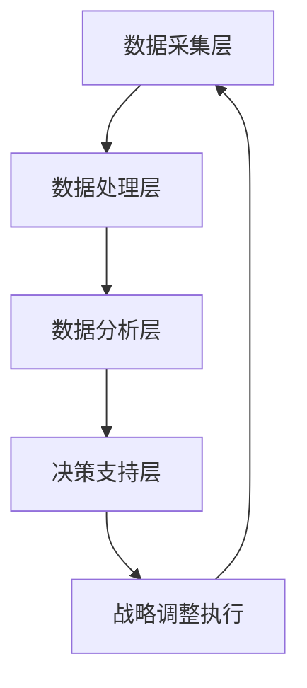

# AI驱动的企业战略执行监控与调整系统

> 关键词：AI、企业战略执行、监控系统、调整系统、数据分析、机器学习、决策支持

> 摘要：本文围绕AI驱动的企业战略执行监控与调整系统展开深入探讨。随着企业竞争环境日益复杂多变，传统的战略执行监控与调整方式已难以满足需求。AI技术的发展为企业提供了强大的工具，能够更高效、精准地对战略执行过程进行监控和及时调整。文章详细介绍了该系统的背景、核心概念、算法原理、数学模型、项目实战、实际应用场景等内容，同时推荐了相关的工具和资源，最后对其未来发展趋势与挑战进行了总结，并给出常见问题解答和参考资料，旨在为企业更好地运用AI技术提升战略执行能力提供全面的技术指导。

## 1. 背景介绍 
### 1.1 目的和范围
企业战略是企业发展的方向和指引，但在战略执行过程中，由于内外部环境的变化，往往会出现各种偏差。传统的战略执行监控与调整方式主要依赖人工经验和简单的数据统计，存在效率低、准确性差、难以应对复杂多变环境等问题。本文的目的在于介绍一种基于AI技术的企业战略执行监控与调整系统，该系统可以实时、全面地监控企业战略执行情况，并根据数据分析结果及时调整战略，以提高企业战略执行的成功率和效率。

本系统的范围涵盖了企业战略执行的各个环节，包括目标设定、任务分配、进度跟踪、绩效评估等，通过收集和分析相关数据，实现对战略执行的动态监控和智能调整。

### 1.2 预期读者
本文预期读者包括企业管理人员、战略规划师、IT技术人员、数据分析师等。对于企业管理人员和战略规划师来说，本文可以帮助他们了解如何利用AI技术提升企业战略执行的效果；对于IT技术人员和数据分析师而言，本文提供了系统实现的技术细节和算法原理，有助于他们进行系统的开发和优化。

### 1.3 文档结构概述
本文将按照以下结构进行阐述：首先介绍系统的背景信息，包括目的、预期读者和文档结构概述；接着阐述系统的核心概念与联系，包括相关原理和架构；然后详细讲解核心算法原理及具体操作步骤，并给出Python源代码示例；之后介绍系统的数学模型和公式，并举例说明；再通过项目实战展示系统的代码实现和详细解释；接着探讨系统的实际应用场景；推荐相关的工具和资源；总结系统的未来发展趋势与挑战；提供常见问题与解答；最后给出扩展阅读和参考资料。

### 1.4 术语表
#### 1.4.1 核心术语定义
- **AI（Artificial Intelligence）**：人工智能，是研究、开发用于模拟、延伸和扩展人的智能的理论、方法、技术及应用系统的一门新的技术科学。
- **企业战略执行**：企业将战略规划转化为实际行动和成果的过程，包括目标设定、任务分配、资源配置、进度跟踪等环节。
- **监控系统**：用于实时收集、分析和评估企业战略执行过程中的相关数据，以发现偏差和问题的系统。
- **调整系统**：根据监控系统的分析结果，对企业战略执行过程中的目标、任务、资源等进行调整和优化的系统。

#### 1.4.2 相关概念解释
- **数据分析**：对收集到的数据进行清洗、整理、分析和挖掘，以发现数据中的规律和价值的过程。
- **机器学习**：人工智能的一个分支，是一门多领域交叉学科，涉及概率论、统计学、逼近论、凸分析、算法复杂度理论等多门学科。它专门研究计算机怎样模拟或实现人类的学习行为，以获取新的知识或技能，重新组织已有的知识结构使之不断改善自身的性能。
- **决策支持**：为管理者提供信息和分析工具，帮助他们做出更明智、更科学的决策的过程。

#### 1.4.3 缩略词列表
- **AI**：Artificial Intelligence（人工智能）
- **ML**：Machine Learning（机器学习）
- **BI**：Business Intelligence（商业智能）

## 2. 核心概念与联系 
### 核心概念原理
AI驱动的企业战略执行监控与调整系统的核心原理是利用AI技术对企业战略执行过程中的各种数据进行收集、分析和处理，以实现对战略执行情况的实时监控和智能调整。

系统主要包括数据采集层、数据处理层、数据分析层和决策支持层。数据采集层负责收集企业战略执行过程中的各种数据，包括业务数据、财务数据、市场数据等；数据处理层对采集到的数据进行清洗、整理和转换，以提高数据的质量和可用性；数据分析层利用机器学习、深度学习等AI技术对处理后的数据进行分析和挖掘，以发现数据中的规律和价值；决策支持层根据数据分析结果，为企业管理者提供决策建议和调整方案，以优化企业战略执行过程。

### 架构的文本示意图
```plaintext
+-----------------------+
|  企业战略执行监控与调整系统  |
+-----------------------+
|      数据采集层       |
|  - 业务数据采集        |
|  - 财务数据采集        |
|  - 市场数据采集        |
+-----------------------+
|      数据处理层       |
|  - 数据清洗           |
|  - 数据整理           |
|  - 数据转换           |
+-----------------------+
|      数据分析层       |
|  - 机器学习算法应用    |
|  - 深度学习算法应用    |
|  - 数据分析模型构建    |
+-----------------------+
|      决策支持层       |
|  - 决策建议生成       |
|  - 调整方案制定       |
|  - 战略优化指导       |
+-----------------------+
```

### Mermaid流程图


该流程图展示了系统的整体工作流程，数据从采集层开始，经过处理层、分析层和决策支持层，最终实现战略调整执行，而调整后的执行情况又会反馈到数据采集层，形成一个闭环的监控与调整系统。

## 3. 核心算法原理 & 具体操作步骤 
### 核心算法原理
本系统主要涉及到的核心算法包括机器学习中的分类算法、回归算法和聚类算法，以及深度学习中的神经网络算法等。

#### 分类算法
分类算法用于将数据分为不同的类别，例如将企业的客户分为优质客户、普通客户和潜在客户等。常见的分类算法有决策树、支持向量机、逻辑回归等。

#### 回归算法
回归算法用于预测连续变量的值，例如预测企业的销售额、利润等。常见的回归算法有线性回归、岭回归、随机森林回归等。

#### 聚类算法
聚类算法用于将数据分为不同的簇，每个簇内的数据具有相似的特征。常见的聚类算法有K-Means算法、层次聚类算法等。

#### 神经网络算法
神经网络算法是一种模仿人类神经系统的算法，具有强大的非线性建模能力。常见的神经网络算法有多层感知机、卷积神经网络、循环神经网络等。

### 具体操作步骤及Python源代码示例
#### 数据采集
数据采集可以使用Python的`requests`库来获取网络数据，使用`pandas`库来读取本地文件数据。以下是一个简单的示例：
```python
import requests
import pandas as pd

# 获取网络数据
url = 'https://example.com/data.csv'
response = requests.get(url)
with open('data.csv', 'w') as file:
    file.write(response.text)

# 读取本地文件数据
data = pd.read_csv('data.csv')
```

#### 数据处理
数据处理主要包括数据清洗、数据整理和数据转换。以下是一个简单的数据清洗示例：
```python
# 处理缺失值
data = data.dropna()

# 处理重复值
data = data.drop_duplicates()

# 处理异常值
Q1 = data.quantile(0.25)
Q3 = data.quantile(0.75)
IQR = Q3 - Q1
data = data[~((data < (Q1 - 1.5 * IQR)) | (data > (Q3 + 1.5 * IQR))).any(axis=1)]
```

#### 数据分析
以线性回归算法为例，以下是一个简单的数据分析示例：
```python
from sklearn.model_selection import train_test_split
from sklearn.linear_model import LinearRegression
from sklearn.metrics import mean_squared_error

# 划分特征和目标变量
X = data.drop('target_variable', axis=1)
y = data['target_variable']

# 划分训练集和测试集
X_train, X_test, y_train, y_test = train_test_split(X, y, test_size=0.2, random_state=42)

# 训练线性回归模型
model = LinearRegression()
model.fit(X_train, y_train)

# 预测
y_pred = model.predict(X_test)

# 评估模型
mse = mean_squared_error(y_test, y_pred)
print(f'Mean Squared Error: {mse}')
```

#### 决策支持
根据数据分析结果，为企业管理者提供决策建议和调整方案。例如，如果预测销售额下降，可以建议企业采取促销活动、优化产品等措施。

## 4. 数学模型和公式 & 详细讲解 & 举例说明 
### 线性回归数学模型和公式
线性回归是一种用于预测连续变量的统计模型，其数学模型可以表示为：
$$y = \beta_0 + \beta_1x_1 + \beta_2x_2 + \cdots + \beta_nx_n + \epsilon$$
其中，$y$ 是目标变量，$x_1, x_2, \cdots, x_n$ 是特征变量，$\beta_0, \beta_1, \beta_2, \cdots, \beta_n$ 是模型的系数，$\epsilon$ 是误差项。

线性回归的目标是找到一组最优的系数 $\beta_0, \beta_1, \beta_2, \cdots, \beta_n$，使得预测值与真实值之间的误差最小。常用的误差度量方法是均方误差（Mean Squared Error，MSE），其公式为：
$$MSE = \frac{1}{m}\sum_{i=1}^{m}(y_i - \hat{y}_i)^2$$
其中，$m$ 是样本数量，$y_i$ 是真实值，$\hat{y}_i$ 是预测值。

### 详细讲解
线性回归的基本思想是通过最小化均方误差来估计模型的系数。在实际应用中，可以使用最小二乘法来求解模型的系数。最小二乘法的目标是找到一组系数，使得误差项的平方和最小。

### 举例说明
假设有一个数据集，包含两个特征变量 $x_1$ 和 $x_2$，以及一个目标变量 $y$。数据集如下：
| $x_1$ | $x_2$ | $y$ |
|---|---|---|
| 1 | 2 | 3 |
| 2 | 3 | 5 |
| 3 | 4 | 7 |

使用线性回归模型进行预测，首先需要估计模型的系数 $\beta_0, \beta_1, \beta_2$。通过最小二乘法求解得到 $\beta_0 = 1$，$\beta_1 = 1$，$\beta_2 = 1$。则线性回归模型为：
$$y = 1 + x_1 + x_2$$

当 $x_1 = 4$，$x_2 = 5$ 时，预测值为：
$$\hat{y} = 1 + 4 + 5 = 10$$

## 5. 项目实战：代码实际案例和详细解释说明 
### 5.1  开发环境搭建
#### 安装Python
首先需要安装Python，可以从Python官方网站（https://www.python.org/downloads/）下载适合自己操作系统的Python版本，并按照安装向导进行安装。

#### 安装必要的库
在命令行中使用以下命令安装必要的库：
```sh
pip install pandas numpy scikit-learn matplotlib
```

### 5.2  源代码详细实现和代码解读
以下是一个完整的项目实战示例，用于预测企业的销售额：

```python
import pandas as pd
import numpy as np
from sklearn.model_selection import train_test_split
from sklearn.linear_model import LinearRegression
from sklearn.metrics import mean_squared_error
import matplotlib.pyplot as plt

# 读取数据
data = pd.read_csv('sales_data.csv')

# 数据预处理
# 处理缺失值
data = data.dropna()

# 划分特征和目标变量
X = data.drop('sales', axis=1)
y = data['sales']

# 划分训练集和测试集
X_train, X_test, y_train, y_test = train_test_split(X, y, test_size=0.2, random_state=42)

# 训练线性回归模型
model = LinearRegression()
model.fit(X_train, y_train)

# 预测
y_pred = model.predict(X_test)

# 评估模型
mse = mean_squared_error(y_test, y_pred)
print(f'Mean Squared Error: {mse}')

# 可视化结果
plt.scatter(y_test, y_pred)
plt.xlabel('Actual Sales')
plt.ylabel('Predicted Sales')
plt.title('Actual vs Predicted Sales')
plt.show()
```

### 5.3  代码解读与分析
1. **数据读取**：使用`pandas`库的`read_csv`函数读取包含销售额数据的CSV文件。
2. **数据预处理**：使用`dropna`函数处理缺失值，确保数据的完整性。
3. **特征和目标变量划分**：将数据集中除了`sales`列之外的其他列作为特征变量，`sales`列作为目标变量。
4. **训练集和测试集划分**：使用`train_test_split`函数将数据集划分为训练集和测试集，测试集占比为20%。
5. **模型训练**：使用`LinearRegression`类创建线性回归模型，并使用训练集数据进行训练。
6. **预测**：使用训练好的模型对测试集数据进行预测。
7. **模型评估**：使用`mean_squared_error`函数计算预测值与真实值之间的均方误差，评估模型的性能。
8. **可视化结果**：使用`matplotlib`库绘制散点图，展示实际销售额与预测销售额之间的关系。

## 6. 实际应用场景 
### 市场营销策略调整
通过对市场数据、客户数据和销售数据的分析，系统可以实时监控企业市场营销策略的执行效果。如果发现某种营销活动的效果不佳，系统可以及时建议调整营销策略，例如改变广告投放渠道、优化促销方案等。

### 产品研发优化
在产品研发过程中，系统可以监控研发进度、成本和质量等指标。如果发现研发进度延迟或成本超支，系统可以分析原因并提供调整方案，例如增加研发资源、优化研发流程等。

### 供应链管理优化
系统可以对供应链中的采购、生产、物流等环节进行监控，及时发现供应链中的问题，如库存积压、交货延迟等。根据分析结果，系统可以建议调整供应链策略，例如优化供应商选择、调整生产计划等。

### 人力资源管理优化
通过对员工绩效数据、培训数据和离职数据的分析，系统可以监控企业人力资源管理的效果。如果发现员工绩效低下或离职率过高，系统可以提供相应的调整方案，如优化培训计划、改善员工福利等。

## 7. 工具和资源推荐
### 7.1 学习资源推荐
#### 7.1.1 书籍推荐
- 《Python数据分析实战》：这本书详细介绍了Python在数据分析领域的应用，包括数据采集、数据处理、数据分析和数据可视化等方面的内容。
- 《机器学习实战》：通过实际案例介绍了机器学习的基本算法和应用，帮助读者快速掌握机器学习的实践技能。
- 《深度学习》：由深度学习领域的三位权威专家Ian Goodfellow、Yoshua Bengio和Aaron Courville撰写，全面介绍了深度学习的理论和实践。

#### 7.1.2 在线课程
- Coursera上的“机器学习”课程：由斯坦福大学教授Andrew Ng主讲，是机器学习领域的经典课程，涵盖了机器学习的基本概念、算法和应用。
- edX上的“深度学习”课程：由麻省理工学院等知名高校提供，深入介绍了深度学习的理论和实践。
- 阿里云天池平台的“AI训练营”：提供了丰富的AI实践项目和课程，帮助学员快速掌握AI技术。

#### 7.1.3 技术博客和网站
- 机器之心：提供了丰富的AI技术资讯、论文解读和技术教程，是了解AI领域最新动态的重要渠道。
- 深度学习技术前沿：专注于深度学习领域的技术分享和交流，提供了大量的深度学习实践案例和代码。
- Kaggle：是一个数据科学竞赛平台，提供了丰富的数据集和竞赛项目，通过参与竞赛可以提高自己的数据分析和机器学习能力。

### 7.2 开发工具框架推荐
#### 7.2.1 IDE和编辑器
- PyCharm：是一款专门为Python开发设计的集成开发环境，具有代码编辑、调试、版本控制等功能，方便开发人员进行Python项目的开发。
- Jupyter Notebook：是一个交互式的开发环境，支持多种编程语言，适合进行数据探索、模型训练和结果展示等工作。
- Visual Studio Code：是一款轻量级的代码编辑器，支持多种编程语言和插件，具有丰富的扩展功能，适合快速开发和调试。

#### 7.2.2 调试和性能分析工具
- pdb：是Python自带的调试工具，可以在代码中设置断点，逐步执行代码，帮助开发人员查找和解决代码中的问题。
- cProfile：是Python的性能分析工具，可以分析