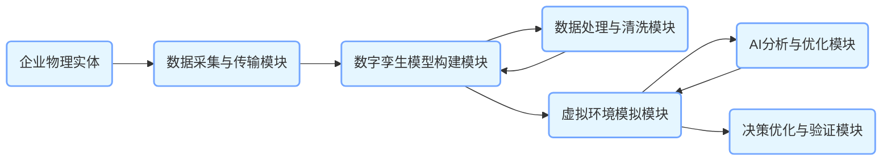

# AI驱动的企业数字孪生技术：虚拟环境中的决策优化与验证

> 关键词：AI驱动、企业数字孪生技术、虚拟环境、决策优化、决策验证

> 摘要：本文聚焦于AI驱动的企业数字孪生技术，深入探讨其在虚拟环境中实现决策优化与验证的原理、方法和应用。首先介绍了该技术的背景，包括目的、预期读者、文档结构和相关术语。接着阐述了核心概念及其联系，给出了原理和架构的文本示意图与Mermaid流程图。详细讲解了核心算法原理，并用Python代码进行了示例。同时给出了相关的数学模型和公式，并举例说明。通过项目实战展示了代码的实际案例和详细解释。分析了该技术的实际应用场景，推荐了学习资源、开发工具框架和相关论文著作。最后总结了未来发展趋势与挑战，还设置了附录解答常见问题，并提供了扩展阅读和参考资料。

## 1. 背景介绍 
### 1.1 目的和范围
在当今数字化时代，企业面临着日益复杂的市场环境和竞争压力。企业需要更高效、精准的决策来应对各种挑战。AI驱动的企业数字孪生技术应运而生，其目的在于通过创建企业的虚拟模型，模拟企业的运营过程，利用AI技术对各种决策进行优化和验证。本文的范围涵盖了该技术的核心概念、算法原理、数学模型、项目实战、应用场景等方面，旨在为读者全面介绍这一前沿技术。

### 1.2 预期读者
本文预期读者包括企业管理人员、技术研发人员、数据分析师、AI研究者以及对企业数字化转型和决策优化感兴趣的人士。企业管理人员可以从中了解如何利用该技术提升企业决策的质量和效率；技术研发人员可以获取技术实现的详细信息；数据分析师可以学习如何处理和分析相关数据；AI研究者可以关注技术中的算法创新；而对企业数字化转型感兴趣的人士可以获得该技术的整体认知。

### 1.3 文档结构概述
本文首先介绍背景知识，让读者了解技术的产生背景和适用人群。接着阐述核心概念与联系，帮助读者建立对该技术的基本认识。然后详细讲解核心算法原理和具体操作步骤，并用Python代码进行示例。随后给出数学模型和公式，并举例说明。通过项目实战展示代码的实际应用和详细解释。分析实际应用场景，让读者了解技术的应用价值。推荐学习资源、开发工具框架和相关论文著作，为读者提供进一步学习的途径。最后总结未来发展趋势与挑战，设置附录解答常见问题，并提供扩展阅读和参考资料。

### 1.4 术语表
#### 1.4.1 核心术语定义
- **AI驱动**：指利用人工智能技术，如机器学习、深度学习、自然语言处理等，为系统提供智能决策和分析能力。
- **企业数字孪生技术**：创建与企业物理实体相对应的虚拟数字模型，该模型能够实时反映企业的运营状态，并可以进行模拟和预测。
- **虚拟环境**：由计算机模拟生成的与企业实际运营环境相似的环境，用于进行决策模拟和验证。
- **决策优化**：通过分析和评估不同决策方案，找出最优决策以实现企业目标。
- **决策验证**：在虚拟环境中对决策方案进行模拟执行，验证其可行性和有效性。

#### 1.4.2 相关概念解释
- **数字孪生**：数字孪生是一种通过数字化手段创建物理实体的虚拟映射，实现物理实体与虚拟模型之间的数据交互和实时同步。在企业领域，数字孪生可以涵盖企业的各个方面，如生产流程、供应链、市场销售等。
- **人工智能**：是一门研究如何使计算机能够模拟人类智能的学科，包括机器学习、深度学习、知识表示与推理等多个领域。在企业数字孪生技术中，人工智能用于处理和分析大量的数据，挖掘潜在的规律和模式，为决策提供支持。

#### 1.4.3 缩略词列表
- **AI**：Artificial Intelligence（人工智能）
- **ML**：Machine Learning（机器学习）
- **DL**：Deep Learning（深度学习）

## 2. 核心概念与联系 
### 核心概念原理
AI驱动的企业数字孪生技术的核心原理是将企业的物理实体通过数据采集和建模技术映射到虚拟环境中，形成数字孪生模型。该模型不仅包含企业的静态结构信息，还能够实时反映企业的动态运营状态。同时，利用AI技术对数字孪生模型进行分析和优化，模拟不同决策方案在虚拟环境中的执行效果，从而实现决策的优化与验证。

### 架构的文本示意图
```plaintext
+-------------------+       +---------------------+
| 企业物理实体      | ----> | 数据采集与传输模块   |
+-------------------+       +---------------------+
                                      |
                                      v
+---------------------+       +---------------------+
| 数据处理与清洗模块 | <---- | 数字孪生模型构建模块 |
+---------------------+       +---------------------+
                                      |
                                      v
+---------------------+       +---------------------+
| AI分析与优化模块    | <---- | 虚拟环境模拟模块    |
+---------------------+       +---------------------+
                                      |
                                      v
+---------------------+
| 决策优化与验证模块  |
+---------------------+
```

### Mermaid流程图


在这个流程图中，首先从企业物理实体采集数据，经过数据采集与传输模块传输到数字孪生模型构建模块。数据处理与清洗模块对数据进行处理和清洗后反馈给数字孪生模型构建模块。数字孪生模型构建完成后，在虚拟环境模拟模块中进行模拟，AI分析与优化模块对模拟结果进行分析和优化，并将结果反馈给虚拟环境模拟模块。最后，决策优化与验证模块根据模拟和分析结果进行决策的优化与验证。

## 3. 核心算法原理 & 具体操作步骤 
### 核心算法原理
在AI驱动的企业数字孪生技术中，常用的核心算法包括机器学习算法和深度学习算法。以下以机器学习中的线性回归算法为例进行说明。

线性回归是一种用于建立自变量和因变量之间线性关系的算法。在企业数字孪生技术中，可以利用线性回归算法来预测企业的某些指标，如销售额、成本等。假设我们有一组自变量 $X = [x_1, x_2,..., x_n]$ 和对应的因变量 $y$，线性回归模型的目标是找到一组系数 $\theta = [\theta_0, \theta_1,..., \theta_n]$，使得预测值 $\hat{y}$ 与实际值 $y$ 之间的误差最小。预测值 $\hat{y}$ 的计算公式为：

$$\hat{y} = \theta_0 + \theta_1x_1 + \theta_2x_2 +... + \theta_nx_n$$

为了找到最优的系数 $\theta$，通常使用最小二乘法来最小化误差平方和。误差平方和的计算公式为：

$$J(\theta) = \frac{1}{2m} \sum_{i=1}^{m} (\hat{y}^{(i)} - y^{(i)})^2$$

其中，$m$ 是样本数量，$\hat{y}^{(i)}$ 是第 $i$ 个样本的预测值，$y^{(i)}$ 是第 $i$ 个样本的实际值。

### 具体操作步骤
1. **数据收集**：收集与企业运营相关的数据，如销售数据、生产数据、市场数据等。
2. **数据预处理**：对收集到的数据进行清洗、归一化等处理，以提高数据的质量和可用性。
3. **特征选择**：从预处理后的数据中选择与目标变量相关的特征。
4. **模型训练**：使用选择好的特征和目标变量对线性回归模型进行训练，得到最优的系数 $\theta$。
5. **模型评估**：使用测试数据对训练好的模型进行评估，计算误差指标，如均方误差（MSE）、均方根误差（RMSE）等。
6. **决策优化与验证**：利用训练好的模型对不同决策方案进行预测和评估，选择最优决策方案，并在虚拟环境中进行验证。

### Python源代码示例
```python
import numpy as np
from sklearn.linear_model import LinearRegression
from sklearn.model_selection import train_test_split
from sklearn.metrics import mean_squared_error

# 生成示例数据
np.random.seed(0)
X = np.random.rand(100, 1)
y = 2 * X + 1 + 0.5 * np.random.randn(100, 1)

# 划分训练集和测试集
X_train, X_test, y_train, y_test = train_test_split(X, y, test_size=0.2, random_state=42)

# 创建线性回归模型
model = LinearRegression()

# 训练模型
model.fit(X_train, y_train)

# 预测
y_pred = model.predict(X_test)

# 计算均方误差
mse = mean_squared_error(y_test, y_pred)
print(f"均方误差: {mse}")
```

在这个示例中，首先生成了一组示例数据，然后将数据划分为训练集和测试集。接着创建了一个线性回归模型，并使用训练集对模型进行训练。最后，使用测试集对模型进行预测，并计算均方误差。

## 4. 数学模型和公式 & 详细讲解 & 举例说明 
### 线性回归模型的数学公式
线性回归模型的一般形式为：

$$\hat{y} = \theta_0 + \theta_1x_1 + \theta_2x_2 +... + \theta_nx_n = \theta^T X$$

其中，$\theta = [\theta_0, \theta_1,..., \theta_n]^T$ 是系数向量，$X = [1, x_1, x_2,..., x_n]^T$ 是特征向量。

误差平方和的计算公式为：

$$J(\theta) = \frac{1}{2m} \sum_{i=1}^{m} (\hat{y}^{(i)} - y^{(i)})^2 = \frac{1}{2m} \sum_{i=1}^{m} (\theta^T X^{(i)} - y^{(i)})^2$$

### 详细讲解
线性回归模型的目标是找到一组系数 $\theta$，使得误差平方和 $J(\theta)$ 最小。为了实现这个目标，可以使用梯度下降法或正规方程法。

#### 梯度下降法
梯度下降法是一种迭代优化算法，通过不断更新系数 $\theta$ 来逐步减小误差平方和 $J(\theta)$。具体步骤如下：
1. 初始化系数 $\theta$ 为一组随机值。
2. 计算误差平方和 $J(\theta)$ 关于系数 $\theta$ 的梯度 $\nabla J(\theta)$。
3. 根据梯度 $\nabla J(\theta)$ 更新系数 $\theta$：

$$\theta := \theta - \alpha \nabla J(\theta)$$

其中，$\alpha$ 是学习率，控制每次更新的步长。
4. 重复步骤2和3，直到误差平方和 $J(\theta)$ 收敛或达到最大迭代次数。

#### 正规方程法
正规方程法是一种直接求解最优系数 $\theta$ 的方法。通过对误差平方和 $J(\theta)$ 求偏导数并令其等于零，可以得到正规方程：

$$\theta = (X^T X)^{-1} X^T y$$

其中，$X$ 是特征矩阵，$y$ 是目标向量。

### 举例说明
假设我们有以下数据集：

| $x$ | $y$ |
| --- | --- |
| 1 | 3 |
| 2 | 5 |
| 3 | 7 |
| 4 | 9 |

我们的目标是使用线性回归模型预测 $y$ 与 $x$ 之间的关系。

首先，我们将数据集转换为矩阵形式：

$$X = \begin{bmatrix} 1 & 1 \\ 1 & 2 \\ 1 & 3 \\ 1 & 4 \end{bmatrix}, y = \begin{bmatrix} 3 \\ 5 \\ 7 \\ 9 \end{bmatrix}$$

然后，使用正规方程法求解最优系数 $\theta$：

$$\theta = (X^T X)^{-1} X^T y = \begin{bmatrix} 1 \\ 2 \end{bmatrix}$$

因此，线性回归模型的方程为 $\hat{y} = 1 + 2x$。

## 5. 项目实战：代码实际案例和详细解释说明 
### 5.1  开发环境搭建
在进行项目实战之前，需要搭建相应的开发环境。以下是具体步骤：
1. **安装Python**：从Python官方网站（https://www.python.org/downloads/）下载并安装Python 3.x版本。
2. **安装必要的库**：使用pip命令安装以下必要的库：
```sh
pip install numpy pandas scikit-learn matplotlib
```
3. **选择开发工具**：可以选择使用Jupyter Notebook、PyCharm等开发工具进行代码编写和调试。

### 5.2  源代码详细实现和代码解读
以下是一个使用Python实现的企业销售预测的数字孪生项目示例：

```python
import numpy as np
import pandas as pd
from sklearn.linear_model import LinearRegression
from sklearn.model_selection import train_test_split
from sklearn.metrics import mean_squared_error
import matplotlib.pyplot as plt

# 读取数据
data = pd.read_csv('sales_data.csv')

# 提取特征和目标变量
X = data[['advertising_expense', 'price']].values
y = data['sales'].values

# 划分训练集和测试集
X_train, X_test, y_train, y_test = train_test_split(X, y, test_size=0.2, random_state=42)

# 创建线性回归模型
model = LinearRegression()

# 训练模型
model.fit(X_train, y_train)

# 预测
y_pred = model.predict(X_test)

# 计算均方误差
mse = mean_squared_error(y_test, y_pred)
print(f"均方误差: {mse}")

# 可视化预测结果
plt.scatter(y_test, y_pred)
plt.xlabel('实际销售额')
plt.ylabel('预测销售额')
plt.title('实际销售额 vs 预测销售额')
plt.show()
```

### 代码解读与分析
1. **数据读取**：使用`pandas`库的`read_csv`函数读取销售数据文件`sales_data.csv`。
2. **特征提取**：从数据中提取`advertising_expense`和`price`作为特征，`sales`作为目标变量。
3. **数据划分**：使用`sklearn`库的`train_test_split`函数将数据划分为训练集和测试集，测试集占比为20%。
4. **模型创建与训练**：创建一个线性回归模型，并使用训练集对模型进行训练。
5. **预测与评估**：使用训练好的模型对测试集进行预测，并计算均方误差。
6. **可视化**：使用`matplotlib`库绘制实际销售额与预测销售额的散点图，直观展示预测结果。

## 6. 实际应用场景 
### 生产制造领域
在生产制造企业中，AI驱动的企业数字孪生技术可以用于优化生产流程、提高生产效率和质量。通过创建生产设备和生产线的数字孪生模型，实时监测设备的运行状态和生产数据。利用AI算法对数据进行分析，预测设备故障和生产瓶颈，提前进行维护和调整。同时，可以在虚拟环境中模拟不同的生产方案，评估其对生产效率和质量的影响，选择最优方案进行实施。

### 供应链管理领域
在供应链管理中，数字孪生技术可以创建整个供应链的虚拟模型，包括供应商、生产商、物流商和零售商等环节。实时跟踪货物的运输状态、库存水平和需求变化。利用AI算法进行需求预测和库存优化，合理安排生产和配送计划，降低库存成本和缺货风险。同时，可以在虚拟环境中模拟供应链中断等异常情况，评估其对企业的影响，并制定相应的应对策略。

### 市场营销领域
在市场营销中，数字孪生技术可以创建客户的数字孪生模型，分析客户的行为和偏好。利用AI算法进行精准营销和个性化推荐，提高营销效果和客户满意度。同时，可以在虚拟环境中模拟不同的营销策略，评估其对市场份额和销售额的影响，选择最优策略进行实施。

## 7. 工具和资源推荐
### 7.1 学习资源推荐
#### 7.1.1 书籍推荐
- 《人工智能：一种现代的方法》：全面介绍了人工智能的基本概念、算法和应用，是人工智能领域的经典教材。
- 《Python机器学习》：详细介绍了使用Python进行机器学习的方法和技术，适合初学者入门。
- 《数字孪生：从概念到实践》：深入探讨了数字孪生技术的原理、应用和发展趋势。

#### 7.1.2 在线课程
- Coursera上的“机器学习”课程：由斯坦福大学教授Andrew Ng讲授，是机器学习领域的经典课程。
- edX上的“人工智能基础”课程：系统介绍了人工智能的基本概念和算法。
- Udemy上的“Python数据科学和机器学习实战”课程：通过实际案例讲解Python在数据科学和机器学习中的应用。

#### 7.1.3 技术博客和网站
- 机器之心：提供人工智能领域的最新技术和研究成果。
- 算法之道：分享算法和数据结构的知识和经验。
- 博客园：汇聚了大量的技术博客文章，涵盖了人工智能、机器学习等多个领域。

### 7.2 开发工具框架推荐
#### 7.2.1 IDE和编辑器
- PyCharm：是一款专业的Python集成开发环境，提供了丰富的功能和插件，适合大型项目的开发。
- Jupyter Notebook：是一个交互式的开发环境，适合进行数据探索和模型实验。
- Visual Studio Code：是一款轻量级的代码编辑器，支持多种编程语言和插件，使用方便。

#### 7.2.2 调试和性能分析工具
- PDB：Python自带的调试工具，可以帮助开发者定位和解决代码中的问题。
- cProfile：Python标准库中的性能分析工具，可以分析代码的运行时间和资源消耗。
- TensorBoard：是TensorFlow的可视化工具，可以用于可视化模型的训练过程和性能指标。

#### 7.2.3 相关框架和库
- TensorFlow：是一个开源的深度学习框架，提供了丰富的工具和接口，支持多种深度学习模型的开发和训练。
- PyTorch：是另一个流行的深度学习框架，具有简洁易用的特点，适合快速开发和实验。
- Scikit-learn：是一个用于机器学习的Python库，提供了多种机器学习算法和工具，方便开发者进行模型训练和评估。

### 7.3 相关论文著作推荐
#### 7.3.1 经典论文
- “Deep Residual Learning for Image Recognition”：提出了残差网络（ResNet），在图像识别领域取得了显著的成果。
- “Attention Is All You Need”：提出了Transformer模型，为自然语言处理领域带来了革命性的变化。
- “Digital Twin: Mitigating Unpredictable, Undesirable Emergent Behavior in Complex Systems”：首次提出了数字孪生的概念，并探讨了其在复杂系统中的应用。

#### 7.3.2 最新研究成果
- 关注顶级学术会议如NeurIPS、ICML、CVPR等的最新论文，了解AI和数字孪生技术的最新研究动态。
- 查阅相关学术期刊如Journal of Artificial Intelligence Research、Artificial Intelligence等的最新文章。

#### 7.3.3 应用案例分析
- 一些知名企业如西门子、GE等发布的关于数字孪生技术在工业领域应用的案例报告，可以从中学习实际应用经验。

## 8. 总结：未来发展趋势与挑战
### 未来发展趋势
- **与物联网深度融合**：随着物联网技术的不断发展，更多的企业设备和系统将实现互联互通，为数字孪生模型提供更丰富、实时的数据。AI驱动的企业数字孪生技术将与物联网深度融合，实现对企业运营的全面、精准监控和优化。
- **多领域协同应用**：数字孪生技术将不再局限于单个领域的应用，而是在多个领域之间实现协同。例如，在智能制造中，数字孪生技术可以与供应链管理、市场营销等领域相结合，实现企业全流程的优化和决策。
- **智能化程度不断提高**：AI技术的不断发展将使数字孪生模型的智能化程度不断提高。模型将能够自动学习和适应企业运营环境的变化，自主进行决策优化和验证，为企业提供更智能、高效的决策支持。

### 挑战
- **数据安全与隐私问题**：数字孪生模型需要大量的企业数据作为支撑，这些数据包含了企业的敏感信息。如何保障数据的安全和隐私，防止数据泄露和滥用，是数字孪生技术面临的重要挑战。
- **模型准确性和可靠性**：数字孪生模型的准确性和可靠性直接影响到决策的质量。由于企业运营环境的复杂性和不确定性，建立准确、可靠的数字孪生模型是一项具有挑战性的任务。需要不断改进建模方法和算法，提高模型的准确性和可靠性。
- **人才短缺**：AI驱动的企业数字孪生技术涉及到人工智能、数据分析、建模等多个领域的知识和技能。目前，相关领域的专业人才短缺，制约了该技术的推广和应用。需要加强人才培养和引进，提高企业的技术创新能力。

## 9. 附录：常见问题与解答
### 问题1：数字孪生模型与传统仿真模型有什么区别？
数字孪生模型与传统仿真模型的主要区别在于：数字孪生模型能够与物理实体进行实时数据交互，实时反映物理实体的状态和变化；而传统仿真模型通常是基于预先设定的参数和条件进行模拟，不能实时反映物理实体的实际情况。

### 问题2：如何确保数字孪生模型的准确性？
确保数字孪生模型的准确性需要从以下几个方面入手：
1. **数据质量**：确保采集到的数据准确、完整、可靠，对数据进行清洗和预处理，去除噪声和异常值。
2. **建模方法**：选择合适的建模方法和算法，根据企业的实际情况进行模型的构建和优化。
3. **模型验证**：使用实际数据对模型进行验证和校准，不断调整模型的参数，提高模型的准确性。
4. **实时更新**：及时更新模型的数据和参数，确保模型能够实时反映物理实体的状态和变化。

### 问题3：AI在数字孪生技术中的作用是什么？
AI在数字孪生技术中的作用主要体现在以下几个方面：
1. **数据处理和分析**：AI算法可以对大量的企业数据进行处理和分析，挖掘潜在的规律和模式，为决策提供支持。
2. **模型优化**：利用AI算法对数字孪生模型进行优化，提高模型的准确性和可靠性。
3. **决策支持**：AI可以根据数字孪生模型的模拟结果，为企业提供决策建议，实现决策的优化和验证。
4. **智能预测**：通过AI算法对企业的未来发展趋势进行预测，帮助企业提前做好规划和准备。

## 10. 扩展阅读 & 参考资料
### 扩展阅读
- 《工业4.0：即将来袭的第四次工业革命》：介绍了工业4.0的概念、技术和发展趋势，与数字孪生技术密切相关。
- 《大数据时代：生活、工作与思维的大变革》：探讨了大数据对社会和企业的影响，为理解数字孪生技术中的数据处理和分析提供了背景知识。

### 参考资料
- 相关学术论文和研究报告，如IEEE、ACM等学术组织发布的关于AI和数字孪生技术的论文。
- 企业官方网站和技术文档，如西门子、GE等企业关于数字孪生技术的应用案例和技术介绍。

作者：AI天才研究院/AI Genius Institute & 禅与计算机程序设计艺术 /Zen And The Art of Computer Programming