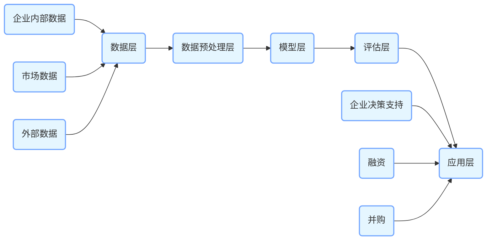

# AI驱动的企业无形资产价值评估系统

> 关键词：AI、企业无形资产、价值评估系统、机器学习、数据挖掘

> 摘要：本文聚焦于AI驱动的企业无形资产价值评估系统，详细阐述了该系统的背景、核心概念、算法原理、数学模型等内容。通过逐步分析推理，介绍了如何运用AI技术实现企业无形资产的精准评估。同时，结合实际案例展示了系统的开发与应用，推荐了相关的学习资源、开发工具和论文著作，最后对系统的未来发展趋势与挑战进行了总结，并提供了常见问题解答和参考资料。旨在为企业和相关领域从业者提供全面且深入的关于AI驱动的企业无形资产价值评估系统的知识和指导。

## 1. 背景介绍 
### 1.1 目的和范围
在当今数字化和知识经济时代，企业的无形资产，如品牌、专利、技术诀窍、客户关系等，在企业价值中所占的比重越来越大。准确评估企业无形资产的价值对于企业的战略决策、融资、并购、财务报告等方面都具有至关重要的意义。然而，传统的无形资产评估方法存在主观性强、数据处理能力有限、难以适应复杂多变的市场环境等问题。

本文章的目的是介绍一种基于AI技术的企业无形资产价值评估系统，旨在利用AI的强大数据处理和分析能力，提高无形资产评估的准确性、客观性和效率。该系统的范围涵盖了多种常见的无形资产类型，包括但不限于知识产权、品牌、商誉等，并适用于不同行业和规模的企业。

### 1.2 预期读者
本文的预期读者包括企业管理人员、财务分析师、资产评估师、投资者、研究人员以及对AI技术在企业评估领域应用感兴趣的人士。企业管理人员可以通过了解该系统，更好地掌握企业无形资产的价值，为企业的战略规划和决策提供依据；财务分析师和资产评估师可以借鉴系统的方法和思路，改进现有的评估流程和方法；投资者可以利用系统的评估结果，做出更明智的投资决策；研究人员可以将本文作为进一步研究的参考，推动相关领域的学术发展。

### 1.3 文档结构概述
本文将按照以下结构进行组织：
- 核心概念与联系：介绍企业无形资产、AI技术等核心概念，以及它们之间的联系，并通过文本示意图和Mermaid流程图进行可视化展示。
- 核心算法原理 & 具体操作步骤：详细阐述系统所采用的核心算法原理，并给出具体的操作步骤，同时使用Python源代码进行详细说明。
- 数学模型和公式 & 详细讲解 & 举例说明：介绍系统所涉及的数学模型和公式，并进行详细讲解，通过具体例子加深读者的理解。
- 项目实战：代码实际案例和详细解释说明：通过一个实际的项目案例，展示系统的开发过程，包括开发环境搭建、源代码详细实现和代码解读。
- 实际应用场景：介绍系统在不同场景下的实际应用，如企业融资、并购、财务报告等。
- 工具和资源推荐：推荐相关的学习资源、开发工具框架和论文著作，帮助读者进一步深入学习和研究。
- 总结：未来发展趋势与挑战：对系统的未来发展趋势进行展望，并分析可能面临的挑战。
- 附录：常见问题与解答：提供常见问题的解答，帮助读者解决在阅读和实践过程中遇到的问题。
- 扩展阅读 & 参考资料：列出相关的扩展阅读材料和参考资料，方便读者进一步查阅。

### 1.4 术语表
#### 1.4.1 核心术语定义
- **企业无形资产**：指企业拥有或者控制的没有实物形态的可辨认非货币性资产，包括知识产权（如专利、商标、著作权等）、品牌、商誉、客户关系、技术诀窍等。
- **AI（人工智能）**：是一门研究如何使计算机能够模拟人类智能的学科和技术，包括机器学习、深度学习、自然语言处理、计算机视觉等多个领域。
- **价值评估**：是指专业评估人员根据特定的目的，遵循适用的评估原则，选择适当的价值类型，按照法定的评估程序，运用科学的评估方法，对评估对象在特定时点的价值进行分析、估算和判断的过程。
- **机器学习**：是一门多领域交叉学科，涉及概率论、统计学、逼近论、凸分析、算法复杂度理论等多门学科。它专门研究计算机怎样模拟或实现人类的学习行为，以获取新的知识或技能，重新组织已有的知识结构使之不断改善自身的性能。

#### 1.4.2 相关概念解释
- **数据挖掘**：是指从大量的数据中通过算法搜索隐藏于其中信息的过程。数据挖掘通常与计算机科学有关，并通过统计、在线分析处理、情报检索、机器学习、专家系统（依靠过去的经验法则）和模式识别等诸多方法来实现上述目标。
- **深度学习**：是机器学习的一个分支领域，它是一种基于对数据进行表征学习的方法。深度学习通过构建具有很多层的神经网络模型，自动从大量数据中学习到复杂的特征和模式。

#### 1.4.3 缩略词列表
- **AI**：Artificial Intelligence（人工智能）
- **ML**：Machine Learning（机器学习）
- **DL**：Deep Learning（深度学习）
- **NLP**：Natural Language Processing（自然语言处理）
- **CV**：Computer Vision（计算机视觉）

## 2. 核心概念与联系 
### 核心概念原理
#### 企业无形资产
企业无形资产是企业在长期的经营过程中积累形成的，具有独特的经济价值。不同类型的无形资产具有不同的特点和价值驱动因素。例如，专利的价值主要取决于其技术创新性、市场需求、法律保护期限等因素；品牌的价值则与品牌知名度、美誉度、忠诚度等因素密切相关。

#### AI技术在无形资产评估中的应用原理
AI技术可以通过对大量的企业数据、市场数据、行业数据等进行分析和挖掘，发现无形资产价值的潜在驱动因素和规律。例如，机器学习算法可以通过对历史数据的学习，建立无形资产价值评估模型，预测无形资产的未来价值；自然语言处理技术可以对企业的文本数据，如新闻报道、年报、专利文档等进行分析，提取与无形资产价值相关的信息。

### 架构的文本示意图
```plaintext
AI驱动的企业无形资产价值评估系统
|-- 数据层
|   |-- 企业内部数据（财务数据、业务数据等）
|   |-- 市场数据（行业报告、竞争对手数据等）
|   |-- 外部数据（新闻报道、社交媒体数据等）
|-- 数据预处理层
|   |-- 数据清洗
|   |-- 数据集成
|   |-- 数据转换
|-- 模型层
|   |-- 机器学习模型（回归模型、分类模型等）
|   |-- 深度学习模型（神经网络模型等）
|-- 评估层
|   |-- 无形资产价值评估
|-- 应用层
|   |-- 企业决策支持
|   |-- 融资
|   |-- 并购
```

### Mermaid流程图


## 3. 核心算法原理 & 具体操作步骤 
### 核心算法原理
#### 线性回归算法
线性回归是一种基本的机器学习算法，用于建立自变量和因变量之间的线性关系。在企业无形资产价值评估中，可以将无形资产的价值作为因变量，将影响无形资产价值的因素作为自变量，建立线性回归模型。

线性回归模型的一般形式为：

$$y = \beta_0 + \beta_1x_1 + \beta_2x_2 + \cdots + \beta_nx_n + \epsilon$$

其中，$y$ 是因变量（无形资产价值），$x_1, x_2, \cdots, x_n$ 是自变量（影响无形资产价值的因素），$\beta_0, \beta_1, \beta_2, \cdots, \beta_n$ 是模型的参数，$\epsilon$ 是误差项。

#### 随机森林算法
随机森林是一种集成学习算法，由多个决策树组成。随机森林通过对多个决策树的结果进行综合，提高模型的准确性和稳定性。在无形资产价值评估中，随机森林可以处理高维数据和非线性关系，具有较好的泛化能力。

### 具体操作步骤
#### 数据收集
收集与企业无形资产相关的数据，包括企业内部数据（如财务报表、专利列表、品牌宣传资料等）、市场数据（如行业报告、竞争对手数据等）和外部数据（如新闻报道、社交媒体数据等）。

#### 数据预处理
- **数据清洗**：去除数据中的噪声、缺失值和异常值。
- **数据集成**：将不同来源的数据进行整合。
- **数据转换**：对数据进行标准化、归一化等处理，以便于模型的训练。

#### 特征选择
从收集到的数据中选择与无形资产价值相关的特征。可以使用相关性分析、方差分析等方法进行特征选择。

#### 模型训练
使用训练数据对线性回归模型和随机森林模型进行训练。在训练过程中，通过调整模型的参数，使模型的预测结果与实际值之间的误差最小。

#### 模型评估
使用测试数据对训练好的模型进行评估。常用的评估指标包括均方误差（MSE）、均方根误差（RMSE）、决定系数（$R^2$）等。

#### 价值评估
使用训练好的模型对企业的无形资产价值进行评估。将企业的相关数据输入到模型中，模型将输出无形资产的预测价值。

### Python源代码详细阐述
```python
import pandas as pd
from sklearn.model_selection import train_test_split
from sklearn.linear_model import LinearRegression
from sklearn.ensemble import RandomForestRegressor
from sklearn.metrics import mean_squared_error, r2_score

# 数据收集与加载
data = pd.read_csv('intangible_assets_data.csv')

# 数据预处理
# 假设数据中包含自变量 X 和因变量 y
X = data.drop('intangible_asset_value', axis=1)
y = data['intangible_asset_value']

# 数据划分
X_train, X_test, y_train, y_test = train_test_split(X, y, test_size=0.2, random_state=42)

# 线性回归模型训练
linear_model = LinearRegression()
linear_model.fit(X_train, y_train)

# 线性回归模型预测
linear_pred = linear_model.predict(X_test)

# 线性回归模型评估
linear_mse = mean_squared_error(y_test, linear_pred)
linear_r2 = r2_score(y_test, linear_pred)
print(f"线性回归模型均方误差: {linear_mse}")
print(f"线性回归模型决定系数: {linear_r2}")

# 随机森林模型训练
rf_model = RandomForestRegressor(n_estimators=100, random_state=42)
rf_model.fit(X_train, y_train)

# 随机森林模型预测
rf_pred = rf_model.predict(X_test)

# 随机森林模型评估
rf_mse = mean_squared_error(y_test, rf_pred)
rf_r2 = r2_score(y_test, rf_pred)
print(f"随机森林模型均方误差: {rf_mse}")
print(f"随机森林模型决定系数: {rf_r2}")
```

## 4. 数学模型和公式 & 详细讲解 & 举例说明 
### 线性回归模型
#### 数学公式
线性回归模型的目标是找到一组参数 $\beta_0, \beta_1, \beta_2, \cdots, \beta_n$，使得预测值 $\hat{y}$ 与实际值 $y$ 之间的误差最小。通常使用最小二乘法来估计模型的参数，即最小化误差平方和：

$$\min_{\beta_0, \beta_1, \cdots, \beta_n} \sum_{i=1}^{m} (y_i - \hat{y}_i)^2 = \min_{\beta_0, \beta_1, \cdots, \beta_n} \sum_{i=1}^{m} (y_i - (\beta_0 + \beta_1x_{i1} + \beta_2x_{i2} + \cdots + \beta_nx_{in}))^2$$

其中，$m$ 是样本数量，$y_i$ 是第 $i$ 个样本的实际值，$\hat{y}_i$ 是第 $i$ 个样本的预测值，$x_{i1}, x_{i2}, \cdots, x_{in}$ 是第 $i$ 个样本的自变量值。

#### 详细讲解
最小二乘法的原理是通过对误差平方和求偏导数，并令偏导数等于零，得到一组方程组，解这个方程组就可以得到模型的参数估计值。

对于简单线性回归（只有一个自变量），模型的参数估计值可以通过以下公式计算：

$$\beta_1 = \frac{\sum_{i=1}^{m} (x_i - \bar{x})(y_i - \bar{y})}{\sum_{i=1}^{m} (x_i - \bar{x})^2}$$

$$\beta_0 = \bar{y} - \beta_1\bar{x}$$

其中，$\bar{x}$ 和 $\bar{y}$ 分别是自变量和因变量的均值。

#### 举例说明
假设我们要评估企业的品牌价值，选择品牌知名度（$x$）作为自变量，品牌价值（$y$）作为因变量。我们收集了以下数据：

| 品牌知名度（$x$） | 品牌价值（$y$） |
| --- | --- |
| 20 | 100 |
| 30 | 150 |
| 40 | 200 |
| 50 | 250 |
| 60 | 300 |

首先，计算自变量和因变量的均值：

$$\bar{x} = \frac{20 + 30 + 40 + 50 + 60}{5} = 40$$

$$\bar{y} = \frac{100 + 150 + 200 + 250 + 300}{5} = 200$$

然后，计算 $\beta_1$：

$$\beta_1 = \frac{(20 - 40)(100 - 200) + (30 - 40)(150 - 200) + (40 - 40)(200 - 200) + (50 - 40)(250 - 200) + (60 - 40)(300 - 200)}{(20 - 40)^2 + (30 - 40)^2 + (40 - 40)^2 + (50 - 40)^2 + (60 - 40)^2} = 5$$

最后，计算 $\beta_0$：

$$\beta_0 = 200 - 5 \times 40 = 0$$

因此，线性回归模型为 $y = 5x$。当品牌知名度为 70 时，预测的品牌价值为 $y = 5 \times 70 = 350$。

### 随机森林模型
#### 数学公式
随机森林模型是由多个决策树组成的，每个决策树的输出是一个预测值。随机森林的最终预测值是所有决策树预测值的平均值：

$$\hat{y} = \frac{1}{N} \sum_{i=1}^{N} \hat{y}_i$$

其中，$N$ 是决策树的数量，$\hat{y}_i$ 是第 $i$ 个决策树的预测值。

#### 详细讲解
随机森林在构建决策树时，采用了随机抽样和随机特征选择的方法。随机抽样是指从原始数据集中有放回地抽取样本，形成多个不同的训练子集；随机特征选择是指在每个决策节点上，从所有特征中随机选择一部分特征，作为该节点的分裂特征。通过这种方式，随机森林可以降低模型的方差，提高模型的泛化能力。

#### 举例说明
假设我们使用随机森林模型评估企业的专利价值，选择专利的申请数量、引用次数、技术领域等作为特征。我们构建了一个包含 100 个决策树的随机森林模型。对于一个新的企业专利，每个决策树都给出了一个预测的专利价值，分别为 $\hat{y}_1, \hat{y}_2, \cdots, \hat{y}_{100}$。则随机森林的最终预测值为：

$$\hat{y} = \frac{1}{100} \sum_{i=1}^{100} \hat{y}_i$$

## 5. 项目实战：代码实际案例和详细解释说明 
### 5.1  开发环境搭建
#### 操作系统
可以选择 Windows、Linux 或 macOS 操作系统。建议使用 Linux 系统，因为它在数据处理和机器学习方面具有较好的性能和稳定性。

#### Python 环境
安装 Python 3.7 或以上版本。可以从 Python 官方网站（https://www.python.org/downloads/）下载安装包进行安装。

#### 依赖库安装
使用以下命令安装所需的依赖库：
```sh
pip install pandas numpy scikit-learn matplotlib
```

### 5.2  源代码详细实现和代码解读
```python
import pandas as pd
import numpy as np
from sklearn.model_selection import train_test_split
from sklearn.ensemble import RandomForestRegressor
from sklearn.metrics import mean_squared_error, r2_score
import matplotlib.pyplot as plt

# 数据加载
data = pd.read_csv('intangible_assets_data.csv')

# 数据探索
print('数据基本信息：')
data.info()

# 查看数据集行数和列数
rows, columns = data.shape

if rows < 100:
    # 小样本数据（行数少于100）查看全量数据信息
    print('数据全部内容信息：')
    print(data.to_csv(sep='\t', na_rep='nan'))
else:
    # 大样本数据查看数据前几行信息
    print('数据前几行内容信息：')
    print(data.head().to_csv(sep='\t', na_rep='nan'))

# 查看数据集行数和列数
rows, columns = data.shape

if rows < 100:
    # 小样本数据（行数少于100）查看全量数据信息
    print('数据全部内容信息：')
    print(data.to_csv(sep='\t', na_rep='nan'))
else:
    # 大样本数据查看数据前几行信息
    print('数据前几行内容信息：')
    print(data.head().to_csv(sep='\t', na_rep='nan'))

# 提取特征和标签
X = data.drop(['intangible_asset_value'], axis=1)
y = data['intangible_asset_value']

# 划分训练集和测试集
X_train, X_test, y_train, y_test = train_test_split(X, y, test_size=0.2, random_state=42)

# 创建随机森林回归模型
model = RandomForestRegressor(n_estimators=100, random_state=42)

# 拟合模型
model.fit(X_train, y_train)

# 在测试集上进行预测
y_pred = model.predict(X_test)

# 计算均方误差
mse = mean_squared_error(y_test, y_pred)
print(f"均方误差: {mse}")

# 计算决定系数
r2 = r2_score(y_test, y_pred)
print(f"决定系数: {r2}")

# 可视化预测结果
plt.scatter(y_test, y_pred)
plt.xlabel('实际值')
plt.ylabel('预测值')
plt.title('实际值 vs 预测值')
plt.show()
```

### 5.3  代码解读与分析
#### 数据加载与探索
```python
data = pd.read_csv('intangible_assets_data.csv')
print('数据基本信息：')
data.info()
```
这部分代码使用 `pandas` 库的 `read_csv` 函数加载数据集，并使用 `info` 方法查看数据的基本信息，包括列名、数据类型、缺失值等。

#### 数据查看
```python
rows, columns = data.shape
if rows < 100:
    print('数据全部内容信息：')
    print(data.to_csv(sep='\t', na_rep='nan'))
else:
    print('数据前几行内容信息：')
    print(data.head().to_csv(sep='\t', na_rep='nan'))
```
根据数据集的行数，决定是查看全量数据信息还是前几行数据信息。

#### 特征提取与数据划分
```python
X = data.drop(['intangible_asset_value'], axis=1)
y = data['intangible_asset_value']
X_train, X_test, y_train, y_test = train_test_split(X, y, test_size=0.2, random_state=42)
```
这部分代码将数据集划分为特征 `X` 和标签 `y`，并使用 `train_test_split` 函数将数据集划分为训练集和测试集，测试集占比为 20%。

#### 模型创建与训练
```python
model = RandomForestRegressor(n_estimators=100, random_state=42)
model.fit(X_train, y_train)
```
创建一个随机森林回归模型，并使用训练集对模型进行训练。

#### 模型预测与评估
```python
y_pred = model.predict(X_test)
mse = mean_squared_error(y_test, y_pred)
r2 = r2_score(y_test, y_pred)
print(f"均方误差: {mse}")
print(f"决定系数: {r2}")
```
使用训练好的模型对测试集进行预测，并计算均方误差和决定系数，评估模型的性能。

#### 可视化预测结果
```python
plt.scatter(y_test, y_pred)
plt.xlabel('实际值')
plt.ylabel('预测值')
plt.title('实际值 vs 预测值')
plt.show()
```
使用 `matplotlib` 库绘制散点图，可视化实际值和预测值之间的关系。

## 6. 实际应用场景 
### 企业融资
在企业进行融资时，准确评估无形资产的价值可以帮助企业获得更高的融资额度和更优惠的融资条件。金融机构在评估企业的信用风险和还款能力时，会考虑企业的无形资产价值。通过AI驱动的企业无形资产价值评估系统，企业可以向金融机构提供更准确、客观的无形资产价值评估报告，提高融资的成功率。

### 企业并购
在企业并购过程中，无形资产的价值评估至关重要。收购方需要了解被收购企业的无形资产价值，以便确定合理的收购价格。AI驱动的评估系统可以帮助收购方快速、准确地评估被收购企业的无形资产价值，避免因估值不准确而导致的收购风险。

### 财务报告
企业在编制财务报告时，需要对无形资产进行合理的计量和披露。AI驱动的评估系统可以提供更准确的无形资产价值评估结果，帮助企业提高财务报告的质量和透明度，满足投资者和监管机构的需求。

### 企业战略决策
企业在制定战略决策时，需要考虑自身的无形资产价值。通过了解无形资产的价值和潜力，企业可以更好地制定品牌战略、技术创新战略等，提高企业的核心竞争力。AI驱动的评估系统可以为企业的战略决策提供有力的支持。

## 7. 工具和资源推荐
### 7.1 学习资源推荐
#### 7.1.1 书籍推荐
- 《机器学习》（周志华）：这本书是机器学习领域的经典教材，系统地介绍了机器学习的基本概念、算法和应用。
- 《深度学习》（Ian Goodfellow、Yoshua Bengio 和 Aaron Courville）：这本书是深度学习领域的权威著作，深入讲解了深度学习的原理、模型和应用。
- 《Python 数据分析实战》（韦斯·麦金尼）：这本书介绍了如何使用 Python 进行数据分析，包括数据处理、可视化和机器学习等方面的内容。

#### 7.1.2 在线课程
- Coursera 上的《机器学习》课程（Andrew Ng 教授主讲）：这是一门非常经典的机器学习课程，适合初学者入门。
- edX 上的《深度学习》课程：由全球知名高校的教授授课，深入讲解深度学习的理论和实践。
- 阿里云天池平台上的《AI 实战营》：提供了丰富的 AI 实战项目和教程，帮助学习者提高实践能力。

#### 7.1.3 技术博客和网站
- Medium：这是一个技术博客平台，上面有很多关于 AI、机器学习、数据分析等领域的优秀文章。
- Kaggle：这是一个数据科学竞赛平台，上面有很多数据科学项目和代码分享，是学习和交流的好地方。
- 机器之心：专注于 AI 领域的资讯和技术分享，提供了很多前沿的技术文章和研究成果。

### 7.2 开发工具框架推荐
#### 7.2.1 IDE和编辑器
- PyCharm：这是一款专门为 Python 开发设计的集成开发环境，具有强大的代码编辑、调试和自动补全功能。
- Jupyter Notebook：这是一个交互式的开发环境，适合进行数据探索、模型训练和可视化等工作。
- Visual Studio Code：这是一款轻量级的代码编辑器，支持多种编程语言和插件扩展，非常适合快速开发。

#### 7.2.2 调试和性能分析工具
- TensorBoard：这是 TensorFlow 提供的一个可视化工具，可以帮助开发者监控模型的训练过程、分析模型的性能。
- Py-Spy：这是一个 Python 性能分析工具，可以帮助开发者找出代码中的性能瓶颈。
- Numba：这是一个用于加速 Python 代码的编译器，可以将 Python 代码转换为机器码，提高代码的执行速度。

#### 7.2.3 相关框架和库
- Scikit-learn：这是一个简单易用的机器学习库，提供了丰富的机器学习算法和工具，适合初学者入门。
- TensorFlow：这是一个开源的深度学习框架，由 Google 开发，具有强大的计算能力和广泛的应用场景。
- PyTorch：这是一个基于 Python 的深度学习框架，具有动态图和易于使用的特点，受到了很多研究者和开发者的喜爱。

### 7.3 相关论文著作推荐
#### 7.3.1 经典论文
- 《Gradient-Based Learning Applied to Document Recognition》（Yann LeCun、Léon Bottou、Yoshua Bengio 和 Patrick Haffner）：这篇论文介绍了卷积神经网络（CNN）在手写数字识别中的应用，是深度学习领域的经典之作。
- 《Long Short-Term Memory》（Sepp Hochreiter 和 Jürgen Schmidhuber）：这篇论文提出了长短期记忆网络（LSTM），解决了循环神经网络（RNN）中的梯度消失问题。
- 《Attention Is All You Need》（Ashish Vaswani 等）：这篇论文提出了注意力机制和 Transformer 模型，在自然语言处理领域取得了巨大的成功。

#### 7.3.2 最新研究成果
- 在 arXiv 网站上搜索“Enterprise intangible asset valuation using AI”等关键词，可以找到很多关于 AI 在企业无形资产价值评估领域的最新研究成果。
- 参加国际学术会议，如 NeurIPS、ICML、CVPR 等，可以了解到该领域的前沿研究动态。

#### 7.3.3 应用案例分析
- 《AI in Finance: Transforming the Financial Services Industry》：这本书介绍了 AI 在金融领域的应用案例，包括企业价值评估、风险管理等方面。
- 各大咨询公司的报告，如麦肯锡、波士顿咨询等，会发布一些关于 AI 在企业评估领域的应用案例和趋势分析。

## 8. 总结：未来发展趋势与挑战
### 未来发展趋势
#### 多模态数据融合
未来的 AI 驱动的企业无形资产价值评估系统将更加注重多模态数据的融合。除了传统的财务数据、文本数据外，还将融合图像、音频、视频等多模态数据，以更全面地评估企业的无形资产价值。例如，通过分析企业的品牌宣传视频、产品图片等，挖掘品牌的潜在价值。

#### 深度强化学习的应用
深度强化学习是一种将深度学习和强化学习相结合的技术，它可以在动态环境中进行自主决策。在企业无形资产价值评估中，深度强化学习可以用于优化评估模型的参数，提高评估的准确性和效率。例如，通过不断与市场环境进行交互，学习到最优的评估策略。

#### 与区块链技术的结合
区块链技术具有去中心化、不可篡改、可追溯等特点，可以为企业无形资产的评估提供更加可信的数据来源和评估过程。未来的评估系统可能会与区块链技术相结合，确保无形资产数据的真实性和完整性，提高评估结果的可信度。

### 挑战
#### 数据质量和隐私问题
AI 驱动的评估系统依赖于大量的数据进行训练和预测，数据的质量直接影响评估结果的准确性。然而，企业无形资产相关的数据往往存在质量不高、不完整、不准确等问题。此外，数据隐私也是一个重要的问题，企业的无形资产数据往往包含敏感信息，如何在保护数据隐私的前提下进行有效的数据挖掘和分析，是一个亟待解决的问题。

#### 模型解释性问题
深度学习模型通常是黑盒模型，其决策过程难以解释。在企业无形资产价值评估中，评估结果的解释性非常重要，企业和投资者需要了解评估结果是如何得出的。因此，如何提高模型的解释性，是未来研究的一个重要方向。

#### 法律法规和标准的不完善
目前，关于 AI 在企业无形资产价值评估领域的法律法规和标准还不完善。缺乏统一的评估标准和规范，可能会导致评估结果的不一致性和不可比性。因此，需要加快相关法律法规和标准的制定，为 AI 驱动的评估系统的应用提供保障。

## 9. 附录：常见问题与解答
### 问题 1：AI 驱动的企业无形资产价值评估系统与传统评估方法有什么区别？
解答：传统的无形资产评估方法主要依赖于评估人员的经验和主观判断，存在主观性强、数据处理能力有限、难以适应复杂多变的市场环境等问题。而 AI 驱动的评估系统可以利用机器学习、深度学习等技术，对大量的企业数据、市场数据、行业数据等进行分析和挖掘，发现无形资产价值的潜在驱动因素和规律，提高评估的准确性、客观性和效率。

### 问题 2：系统需要哪些数据来进行无形资产价值评估？
解答：系统需要的数据包括企业内部数据（如财务报表、专利列表、品牌宣传资料等）、市场数据（如行业报告、竞争对手数据等）和外部数据（如新闻报道、社交媒体数据等）。不同类型的无形资产可能需要不同类型的数据进行评估，例如，评估专利价值可能需要专利的申请数量、引用次数、技术领域等数据；评估品牌价值可能需要品牌知名度、美誉度、忠诚度等数据。

### 问题 3：如何保证系统评估结果的准确性？
解答：为了保证系统评估结果的准确性，可以采取以下措施：
- 收集高质量的数据：确保数据的准确性、完整性和一致性。
- 选择合适的模型和算法：根据数据的特点和评估的需求，选择合适的机器学习或深度学习模型。
- 进行模型评估和优化：使用测试数据对模型进行评估，根据评估结果对模型进行优化。
- 结合专家经验：在评估过程中，结合评估专家的经验和判断，对评估结果进行验证和调整。

### 问题 4：系统的开发和维护成本高吗？
解答：系统的开发和维护成本取决于多个因素，如系统的功能复杂度、数据规模、开发团队的技术水平等。一般来说，开发一个 AI 驱动的企业无形资产价值评估系统需要一定的技术和资金投入，包括数据收集和预处理、模型开发和训练、系统部署和维护等方面的成本。然而，随着 AI 技术的不断发展和普及，开发和维护成本也在逐渐降低。同时，系统的应用可以为企业带来显著的经济效益，如提高融资成功率、降低并购风险等，从长远来看，具有较高的投资回报率。

## 10. 扩展阅读 & 参考资料
### 扩展阅读
- 《人工智能时代的企业管理创新》：探讨了人工智能技术对企业管理的影响和创新应用。
- 《无形资产评估理论与实务》：详细介绍了无形资产评估的理论和方法。
- 《大数据与企业决策》：分析了大数据在企业决策中的应用和价值。

### 参考资料
- 《企业会计准则第 6 号——无形资产》
- 《资产评估执业准则——无形资产》
- 相关学术论文和研究报告

作者：AI天才研究院/AI Genius Institute & 禅与计算机程序设计艺术 /Zen And The Art of Computer Programming