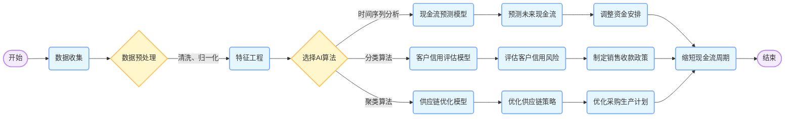

# AI驱动的企业现金流周期优化

> 关键词：AI、企业现金流周期、优化策略、数据分析、机器学习

> 摘要：本文聚焦于AI驱动下企业现金流周期的优化。首先介绍了企业现金流周期管理的背景知识，包括目的、预期读者和文档结构等。接着阐述了核心概念及它们之间的联系，详细讲解了相关算法原理和操作步骤，并给出了数学模型和公式。通过项目实战案例，展示了如何运用AI技术优化现金流周期，同时分析了实际应用场景。最后推荐了学习资源、开发工具和相关论文，总结了未来发展趋势与挑战，还给出了常见问题解答和参考资料，旨在为企业借助AI优化现金流周期提供全面的技术指导和理论支持。

## 1. 背景介绍 
### 1.1 目的和范围
企业的现金流周期是指从采购原材料支付现金开始，到销售产品收回现金为止的整个过程所经历的时间。优化现金流周期对于企业的生存和发展至关重要，它可以提高企业资金的使用效率，增强企业的财务稳定性和竞争力。本文的目的是探讨如何利用AI技术来优化企业的现金流周期。具体范围包括分析AI在现金流预测、供应链管理、客户信用评估等方面的应用，以及如何通过这些应用来缩短现金流周期、降低资金成本。

### 1.2 预期读者
本文的预期读者主要包括企业的财务管理人员、供应链管理人员、企业高层决策者以及对AI在企业财务管理中应用感兴趣的技术人员。对于财务管理人员来说，他们可以从本文中了解如何利用AI技术更好地管理企业的现金流；供应链管理人员可以学习到如何借助AI优化供应链流程，从而影响现金流周期；企业高层决策者可以通过本文了解AI在企业现金流管理中的战略意义；技术人员则可以深入研究相关的算法和技术实现。

### 1.3 文档结构概述
本文将按照以下结构进行阐述：首先介绍核心概念与联系，明确与企业现金流周期优化相关的AI概念及其相互关系；接着讲解核心算法原理和具体操作步骤，通过Python代码详细说明；然后给出数学模型和公式，并进行详细讲解和举例；之后通过项目实战案例展示代码的实际应用和详细解释；再分析实际应用场景；推荐相关的工具和资源；最后总结未来发展趋势与挑战，提供常见问题解答和参考资料。

### 1.4 术语表
#### 1.4.1 核心术语定义
- **现金流周期**：从企业支付现金购买原材料开始，到销售产品收回现金的整个过程所经历的时间，通常由存货周转天数、应收账款周转天数和应付账款周转天数构成。
- **AI（人工智能）**：研究、开发用于模拟、延伸和扩展人的智能的理论、方法、技术及应用系统的一门新的技术科学，本文主要涉及机器学习、深度学习等技术在现金流周期优化中的应用。
- **机器学习**：一门多领域交叉学科，涉及概率论、统计学、逼近论、凸分析、算法复杂度理论等多门学科。它专门研究计算机怎样模拟或实现人类的学习行为，以获取新的知识或技能，重新组织已有的知识结构使之不断改善自身的性能。
- **深度学习**：机器学习的一个分支领域，它是一种基于对数据进行表征学习的方法。深度学习通过构建具有很多层的神经网络模型，自动从大量数据中学习特征和模式。

#### 1.4.2 相关概念解释
- **现金流预测**：基于历史数据和相关因素，运用一定的方法对企业未来的现金流入和流出进行预测，以便企业提前做好资金安排。
- **供应链管理**：对供应链中的物流、信息流和资金流进行计划、组织、协调和控制，以提高供应链的效率和效益，从而影响企业的现金流周期。
- **客户信用评估**：通过对客户的信用状况进行评估，确定客户的信用等级和信用额度，以便企业合理安排销售策略和收款政策，减少坏账损失，缩短应收账款周转天数。

#### 1.4.3 缩略词列表
- **AI**：Artificial Intelligence（人工智能）
- **ML**：Machine Learning（机器学习）
- **DL**：Deep Learning（深度学习）

## 2. 核心概念与联系 
### 核心概念原理
在AI驱动的企业现金流周期优化中，涉及到多个核心概念，它们相互关联，共同作用于现金流周期的优化。

#### AI在现金流预测中的应用原理
AI技术可以通过分析企业的历史现金流数据、市场数据、宏观经济数据等多源数据，构建预测模型。例如，机器学习中的时间序列分析方法可以用于预测未来的现金流入和流出。时间序列分析假设数据在时间上存在一定的规律和趋势，通过对历史数据的学习，找到这些规律并用于预测未来值。

#### AI在供应链管理中的应用原理
在供应链管理中，AI可以优化采购、生产和销售等环节。例如，通过机器学习算法对供应商的交货时间、产品质量等数据进行分析，预测供应商的可靠性，从而优化采购策略，减少库存积压，缩短存货周转天数。同时，AI还可以根据市场需求预测，优化生产计划，提高生产效率，降低生产成本。

#### AI在客户信用评估中的应用原理
AI可以通过分析客户的历史交易数据、信用记录、财务状况等多维度数据，构建信用评估模型。深度学习模型可以自动从大量的数据中提取特征，更准确地评估客户的信用风险。通过合理评估客户的信用等级和信用额度，企业可以制定更有效的销售策略和收款政策，减少坏账损失，缩短应收账款周转天数。

### 架构的文本示意图
```plaintext
企业现金流周期优化架构
|-- AI技术
|   |-- 机器学习
|   |   |-- 时间序列分析（现金流预测）
|   |   |-- 分类算法（客户信用评估）
|   |   |-- 聚类算法（供应链优化）
|   |-- 深度学习
|   |   |-- 神经网络模型（现金流预测、客户信用评估）
|-- 数据来源
|   |-- 企业内部数据
|   |   |-- 财务数据（现金流记录、应收账款、应付账款等）
|   |   |-- 销售数据（销售订单、客户信息等）
|   |   |-- 采购数据（采购订单、供应商信息等）
|   |-- 企业外部数据
|   |   |-- 市场数据（行业趋势、竞争对手数据等）
|   |   |-- 宏观经济数据（GDP、利率等）
|-- 应用场景
|   |-- 现金流预测
|   |-- 供应链管理
|   |-- 客户信用评估
|-- 优化结果
|   |-- 缩短现金流周期
|   |-- 降低资金成本
|   |-- 提高企业财务稳定性
```

### Mermaid流程图


## 3. 核心算法原理 & 具体操作步骤 
### 时间序列分析算法（用于现金流预测）
时间序列分析是一种常用的预测方法，其中ARIMA（Autoregressive Integrated Moving Average）模型是一种经典的时间序列模型。

#### 算法原理
ARIMA模型由自回归（AR）、差分（I）和移动平均（MA）三个部分组成。自回归部分表示当前值与过去值之间的线性关系，移动平均部分表示当前值与过去误差项之间的线性关系，差分部分用于处理非平稳时间序列，使其变为平稳序列。

ARIMA(p, d, q)模型的数学表达式为：
$$
(1 - \sum_{i = 1}^{p} \phi_{i}B^{i})(1 - B)^{d}Y_{t} = c + (1 + \sum_{j = 1}^{q} \theta_{j}B^{j})\epsilon_{t}
$$
其中，$Y_{t}$ 是时间序列在时刻 $t$ 的值，$B$ 是滞后算子，$\phi_{i}$ 是自回归系数，$\theta_{j}$ 是移动平均系数，$d$ 是差分阶数，$\epsilon_{t}$ 是白噪声。

#### 具体操作步骤
1. **数据准备**：收集企业的历史现金流数据，并进行清洗和预处理，确保数据的质量。
2. **平稳性检验**：使用ADF（Augmented Dickey - Fuller）检验等方法检验时间序列的平稳性。如果序列不平稳，则进行差分处理，直到序列变为平稳序列。
3. **模型定阶**：通过自相关函数（ACF）和偏自相关函数（PACF）图，确定ARIMA模型的阶数 $p$ 和 $q$。
4. **模型训练**：使用确定好的阶数，对ARIMA模型进行训练，估计模型的参数。
5. **模型预测**：使用训练好的模型对未来的现金流进行预测。

#### Python代码实现
```python
import pandas as pd
import numpy as np
from statsmodels.tsa.stattools import adfuller
from statsmodels.graphics.tsaplots import plot_acf, plot_pacf
from statsmodels.tsa.arima.model import ARIMA
import matplotlib.pyplot as plt

# 生成示例数据
np.random.seed(0)
data = np.random.randn(100).cumsum()
index = pd.date_range(start='2020-01-01', periods=100, freq='D')
df = pd.DataFrame(data, index=index, columns=['cash_flow'])

# 平稳性检验
def test_stationarity(timeseries):
    # 执行Dickey-Fuller检验
    result = adfuller(timeseries)
    print('ADF Statistic: {}'.format(result[0]))
    print('p-value: {}'.format(result[1]))
    print('Critical Values:')
    for key, value in result[4].items():
        print('\t{}: {}'.format(key, value))
    if result[1] <= 0.05:
        print("数据平稳")
    else:
        print("数据不平稳，需要差分处理")

test_stationarity(df['cash_flow'])

# 差分处理
df['diff_1'] = df['cash_flow'].diff()
df = df.dropna()
test_stationarity(df['diff_1'])

# 绘制ACF和PACF图
fig, axes = plt.subplots(2, 1, figsize=(10, 8))
plot_acf(df['diff_1'], lags=20, ax=axes[0])
plot_pacf(df['diff_1'], lags=20, ax=axes[1])
plt.show()

# 根据ACF和PACF图确定p和q的值，这里假设p=1，q=1
p = 1
d = 1
q = 1

# 训练ARIMA模型
model = ARIMA(df['cash_flow'], order=(p, d, q))
model_fit = model.fit()

# 预测未来10天的现金流
forecast = model_fit.get_forecast(steps=10)
forecast_mean = forecast.predicted_mean

print("未来10天的现金流预测值：", forecast_mean)
```

### 逻辑回归算法（用于客户信用评估）
#### 算法原理
逻辑回归是一种常用的分类算法，用于处理二分类问题。它通过逻辑函数将线性回归的结果映射到 $[0, 1]$ 区间，从而得到样本属于某个类别的概率。逻辑回归的数学表达式为：
$$
P(Y = 1|X) = \frac{1}{1 + e^{-(w_{0} + w_{1}x_{1} + w_{2}x_{2} + \cdots + w_{n}x_{n})}}
$$
其中，$P(Y = 1|X)$ 是样本 $X$ 属于类别 1 的概率，$w_{i}$ 是模型的权重，$x_{i}$ 是样本的特征。

#### 具体操作步骤
1. **数据准备**：收集客户的历史交易数据、信用记录等特征数据，并进行清洗和预处理。
2. **特征选择**：选择与客户信用风险相关的特征，去除无关或冗余的特征。
3. **模型训练**：使用训练数据对逻辑回归模型进行训练，估计模型的权重。
4. **模型评估**：使用测试数据对训练好的模型进行评估，计算准确率、召回率等评估指标。
5. **信用评估**：使用训练好的模型对新客户进行信用评估，预测客户的信用风险。

#### Python代码实现
```python
from sklearn.linear_model import LogisticRegression
from sklearn.model_selection import train_test_split
from sklearn.metrics import accuracy_score, recall_score
import pandas as pd
import numpy as np

# 生成示例数据
np.random.seed(0)
n_samples = 100
X = np.random.randn(n_samples, 5)
y = np.random.randint(0, 2, n_samples)

# 划分训练集和测试集
X_train, X_test, y_train, y_test = train_test_split(X, y, test_size=0.2, random_state=42)

# 训练逻辑回归模型
model = LogisticRegression()
model.fit(X_train, y_train)

# 预测测试集
y_pred = model.predict(X_test)

# 评估模型
accuracy = accuracy_score(y_test, y_pred)
recall = recall_score(y_test, y_pred)

print("模型准确率：", accuracy)
print("模型召回率：", recall)
```

## 4. 数学模型和公式 & 详细讲解 & 举例说明 
### 现金流周期的数学模型
企业的现金流周期（Cash Conversion Cycle, CCC）可以用以下公式表示：
$$
CCC = DIO + DSO - DPO
$$
其中，$DIO$（Days Inventory Outstanding）是存货周转天数，$DSO$（Days Sales Outstanding）是应收账款周转天数，$DPO$（Days Payable Outstanding）是应付账款周转天数。

#### 存货周转天数（DIO）
存货周转天数表示企业将存货转化为销售所需的平均天数，计算公式为：
$$
DIO = \frac{Average Inventory}{Cost of Goods Sold per Day}
$$
其中，$Average Inventory$ 是平均存货，$Cost of Goods Sold per Day$ 是每日销货成本。

**举例说明**：假设某企业的平均存货为 100 万元，年销货成本为 365 万元，则每日销货成本为 $365 \div 365 = 1$ 万元。存货周转天数为 $100 \div 1 = 100$ 天。

#### 应收账款周转天数（DSO）
应收账款周转天数表示企业收回应收账款所需的平均天数，计算公式为：
$$
DSO = \frac{Average Accounts Receivable}{Credit Sales per Day}
$$
其中，$Average Accounts Receivable$ 是平均应收账款，$Credit Sales per Day$ 是每日赊销额。

**举例说明**：假设某企业的平均应收账款为 50 万元，年赊销额为 730 万元，则每日赊销额为 $730 \div 365 = 2$ 万元。应收账款周转天数为 $50 \div 2 = 25$ 天。

#### 应付账款周转天数（DPO）
应付账款周转天数表示企业支付应付账款所需的平均天数，计算公式为：
$$
DPO = \frac{Average Accounts Payable}{Cost of Goods Sold per Day}
$$
其中，$Average Accounts Payable$ 是平均应付账款，$Cost of Goods Sold per Day$ 是每日销货成本。

**举例说明**：假设某企业的平均应付账款为 30 万元，年销货成本为 365 万元，则每日销货成本为 $365 \div 365 = 1$ 万元。应付账款周转天数为 $30 \div 1 = 30$ 天。

#### 现金流周期计算
根据上述计算结果，该企业的现金流周期为：
$$
CCC = 100 + 25 - 30 = 95 \text{ 天}
$$

### AI模型的损失函数和优化目标
#### 时间序列分析（ARIMA模型）
ARIMA模型的训练目标是最小化预测值与实际值之间的误差。常用的损失函数是均方误差（Mean Squared Error, MSE），计算公式为：
$$
MSE = \frac{1}{n} \sum_{i = 1}^{n} (y_{i} - \hat{y}_{i})^{2}
$$
其中，$y_{i}$ 是实际值，$\hat{y}_{i}$ 是预测值，$n$ 是样本数量。

#### 逻辑回归模型
逻辑回归模型的训练目标是最大化对数似然函数，等价于最小化交叉熵损失函数。交叉熵损失函数的计算公式为：
$$
L(y, \hat{y}) = - \frac{1}{n} \sum_{i = 1}^{n} [y_{i} \log(\hat{y}_{i}) + (1 - y_{i}) \log(1 - \hat{y}_{i})]
$$
其中，$y_{i}$ 是真实标签，$\hat{y}_{i}$ 是预测概率，$n$ 是样本数量。

## 5. 项目实战：代码实际案例和详细解释说明 
### 5.1  开发环境搭建
#### 操作系统
可以选择Windows、Linux或macOS操作系统，建议使用Linux系统，因为它在数据处理和机器学习开发方面具有更好的稳定性和性能。

#### Python环境
安装Python 3.7及以上版本，可以使用Anaconda或Miniconda来管理Python环境。Anaconda是一个包含了众多科学计算库的Python发行版，安装后可以方便地使用各种机器学习和数据分析工具。

#### 安装必要的库
在命令行中使用以下命令安装必要的库：
```bash
pip install pandas numpy scikit-learn statsmodels matplotlib
```

### 5.2  源代码详细实现和代码解读
#### 项目需求
我们要实现一个基于AI的企业现金流周期优化系统，包括现金流预测和客户信用评估两个模块。

#### 代码实现

```python
import pandas as pd
import numpy as np
from statsmodels.tsa.arima.model import ARIMA
from sklearn.linear_model import LogisticRegression
from sklearn.model_selection import train_test_split
from sklearn.metrics import accuracy_score, recall_score

# 现金流预测模块
def cash_flow_forecast(data, p, d, q, steps):
    """
    现金流预测函数
    :param data: 历史现金流数据
    :param p: ARIMA模型的p值
    :param d: ARIMA模型的d值
    :param q: ARIMA模型的q值
    :param steps: 预测的步数
    :return: 预测的现金流值
    """
    model = ARIMA(data, order=(p, d, q))
    model_fit = model.fit()
    forecast = model_fit.get_forecast(steps=steps)
    forecast_mean = forecast.predicted_mean
    return forecast_mean

# 客户信用评估模块
def customer_credit_assessment(X, y, test_size=0.2):
    """
    客户信用评估函数
    :param X: 客户特征数据
    :param y: 客户信用标签
    :param test_size: 测试集比例
    :return: 模型准确率和召回率
    """
    X_train, X_test, y_train, y_test = train_test_split(X, y, test_size=test_size, random_state=42)
    model = LogisticRegression()
    model.fit(X_train, y_train)
    y_pred = model.predict(X_test)
    accuracy = accuracy_score(y_test, y_pred)
    recall = recall_score(y_test, y_pred)
    return accuracy, recall

# 示例数据
# 现金流数据
np.random.seed(0)
cash_flow_data = np.random.randn(100).cumsum()
# 客户特征数据
n_samples = 100
X = np.random.randn(n_samples, 5)
y = np.random.randint(0, 2, n_samples)

# 现金流预测
p = 1
d = 1
q = 1
steps = 10
forecast_result = cash_flow_forecast(cash_flow_data, p, d, q, steps)
print("未来10天的现金流预测值：", forecast_result)

# 客户信用评估
accuracy, recall = customer_credit_assessment(X, y)
print("模型准确率：", accuracy)
print("模型召回率：", recall)
```

#### 代码解读
1. **现金流预测模块**：`cash_flow_forecast` 函数接受历史现金流数据、ARIMA模型的阶数 `p`、`d`、`q` 和预测步数 `steps` 作为输入，使用ARIMA模型进行训练和预测，返回预测的现金流值。
2. **客户信用评估模块**：`customer_credit_assessment` 函数接受客户特征数据 `X` 和客户信用标签 `y` 作为输入，将数据划分为训练集和测试集，使用逻辑回归模型进行训练和预测，返回模型的准确率和召回率。
3. **示例数据**：生成了示例的现金流数据和客户特征数据，调用上述两个函数进行现金流预测和客户信用评估，并打印结果。

### 5.3  代码解读与分析
#### 现金流预测模块分析
- ARIMA模型的阶数 `p`、`d`、`q` 需要根据实际数据进行调整。可以通过观察自相关函数（ACF）和偏自相关函数（PACF）图来确定合适的阶数。
- 预测的步数 `steps` 可以根据企业的需求进行调整。步数越多，预测的不确定性越大。

#### 客户信用评估模块分析
- 逻辑回归模型是一个简单而有效的分类模型，但对于复杂的数据集，可能需要使用更复杂的模型，如神经网络模型。
- 特征选择和数据预处理对于模型的性能至关重要。可以使用特征选择算法选择与客户信用风险相关的特征，并对数据进行归一化、标准化等预处理操作。

## 6. 实际应用场景 
### 现金流预测在企业资金管理中的应用
企业可以根据现金流预测结果，合理安排资金的使用和筹集。例如，如果预测到未来一段时间内现金流入不足，企业可以提前安排贷款或减少不必要的支出；如果预测到现金流入充足，企业可以考虑进行投资或扩大生产。

### 供应链管理中的应用
通过AI技术优化供应链管理，可以减少库存积压，缩短存货周转天数。例如，根据市场需求预测，调整采购计划和生产计划，避免过度采购和生产。同时，通过对供应商的评估和管理，提高供应商的交货及时性和产品质量，降低采购成本。

### 客户信用评估在销售管理中的应用
企业可以根据客户的信用评估结果，制定不同的销售策略和收款政策。对于信用等级高的客户，可以给予更宽松的信用额度和付款期限，以促进销售；对于信用等级低的客户，可以要求预付款或缩短付款期限，以降低坏账风险。

## 7. 工具和资源推荐
### 7.1 学习资源推荐
#### 7.1.1 书籍推荐
- 《Python数据分析实战》：介绍了使用Python进行数据分析的基本方法和技巧，包括数据清洗、数据可视化、机器学习等内容。
- 《机器学习实战》：通过实际案例介绍了机器学习的基本算法和应用，包括分类、回归、聚类等算法。
- 《深度学习》：由深度学习领域的三位顶尖专家编写，系统地介绍了深度学习的基本原理、算法和应用。

#### 7.1.2 在线课程
- Coursera上的“机器学习”课程：由斯坦福大学教授Andrew Ng主讲，是机器学习领域的经典课程，涵盖了机器学习的基本概念、算法和应用。
- edX上的“深度学习基础”课程：介绍了深度学习的基本原理和算法，包括神经网络、卷积神经网络、循环神经网络等。
- 阿里云天池平台上的“AI训练营”：提供了丰富的AI实践课程和案例，适合初学者和有一定基础的开发者。

#### 7.1.3 技术博客和网站
- Medium：是一个技术博客平台，上面有很多关于AI、机器学习、数据分析等领域的优秀文章。
- Kaggle：是一个数据科学竞赛平台，上面有很多公开的数据集和优秀的数据分析代码，可以学习到很多实际应用的技巧。
- Towards Data Science：是一个专注于数据科学和机器学习的技术博客，上面有很多高质量的文章和教程。

### 7.2 开发工具框架推荐
#### 7.2.1 IDE和编辑器
- PyCharm：是一款专业的Python集成开发环境，具有代码自动补全、调试、版本控制等功能，适合开发大型Python项目。
- Jupyter Notebook：是一个交互式的开发环境，支持Python、R等多种编程语言，适合进行数据分析和模型实验。
- Visual Studio Code：是一款轻量级的代码编辑器，具有丰富的插件和扩展功能，支持多种编程语言，适合快速开发和调试代码。

#### 7.2.2 调试和性能分析工具
- PDB：是Python自带的调试工具，可以在代码中设置断点，逐步执行代码，查看变量的值和程序的执行流程。
- cProfile：是Python的性能分析工具，可以统计代码中各个函数的执行时间和调用次数，帮助开发者找出性能瓶颈。
- TensorBoard：是TensorFlow的可视化工具，可以可视化神经网络的训练过程、模型结构、数据分布等信息，帮助开发者更好地理解和优化模型。

#### 7.2.3 相关框架和库
- NumPy：是Python的数值计算库，提供了高效的多维数组对象和各种数学函数，是数据分析和机器学习的基础库。
- Pandas：是Python的数据分析库，提供了数据结构和数据处理工具，如DataFrame和Series，方便进行数据清洗、数据挖掘和数据分析。
- Scikit-learn：是Python的机器学习库，提供了各种机器学习算法和工具，如分类、回归、聚类等算法，以及模型选择、评估等工具。
- TensorFlow和PyTorch：是深度学习领域的两个主流框架，提供了构建和训练神经网络的工具和接口。

### 7.3 相关论文著作推荐
#### 7.3.1 经典论文
- “Gradient-Based Learning Applied to Document Recognition”：由Yann LeCun等人发表，介绍了卷积神经网络（CNN）在手写数字识别中的应用，是深度学习领域的经典论文之一。
- “Long Short-Term Memory”：由Sepp Hochreiter和Jürgen Schmidhuber发表，提出了长短期记忆网络（LSTM），解决了循环神经网络（RNN）中的梯度消失问题。
- “Attention Is All You Need”：由Google Brain团队发表，提出了Transformer模型，是自然语言处理领域的重要突破。

#### 7.3.2 最新研究成果
- 可以关注顶级学术会议和期刊，如NeurIPS（神经信息处理系统大会）、ICML（国际机器学习会议）、JMLR（机器学习研究杂志）等，了解AI和机器学习领域的最新研究成果。

#### 7.3.3 应用案例分析
- 可以关注一些知名企业的技术博客和研究报告，如Google、Microsoft、Amazon等，了解他们在AI应用方面的实践经验和案例分析。

## 8. 总结：未来发展趋势与挑战
### 未来发展趋势
- **更深度的融合**：AI技术将与企业的财务管理、供应链管理等业务深度融合，实现更加智能化的决策和管理。例如，通过AI技术实时监测企业的现金流状况，自动调整资金安排和供应链策略。
- **多模态数据的应用**：除了传统的财务数据和交易数据，企业将越来越多地利用多模态数据，如文本数据、图像数据、传感器数据等，来优化现金流周期。例如，通过分析社交媒体上的客户评价和市场趋势，预测产品的销售情况。
- **强化学习的应用**：强化学习可以在动态环境中进行决策优化，未来将在企业现金流周期优化中发挥重要作用。例如，通过强化学习算法自动调整企业的采购、生产和销售策略，以最大化企业的现金流收益。

### 挑战
- **数据质量和安全问题**：AI技术的应用依赖于大量的数据，数据的质量和安全直接影响模型的性能和企业的利益。企业需要加强数据管理，确保数据的准确性、完整性和安全性。
- **人才短缺**：AI技术的应用需要具备专业知识和技能的人才，目前市场上这类人才短缺。企业需要加强人才培养和引进，提高企业的技术水平和创新能力。
- **模型解释性问题**：一些复杂的AI模型，如深度学习模型，往往是黑盒模型，难以解释其决策过程和结果。在企业应用中，需要解决模型的解释性问题，以便企业管理者更好地理解和信任模型的决策。

## 9. 附录：常见问题与解答
### 1. 如何选择合适的AI算法？
选择合适的AI算法需要考虑多个因素，如数据类型、问题类型、模型复杂度等。对于时间序列预测问题，可以选择ARIMA、LSTM等算法；对于分类问题，可以选择逻辑回归、决策树、神经网络等算法。在选择算法时，可以先对数据进行探索性分析，了解数据的特征和规律，然后选择合适的算法进行实验和比较。

### 2. 如何评估AI模型的性能？
评估AI模型的性能需要根据问题的类型选择合适的评估指标。对于回归问题，常用的评估指标有均方误差（MSE）、均方根误差（RMSE）、平均绝对误差（MAE）等；对于分类问题，常用的评估指标有准确率、召回率、F1值等。在评估模型时，需要将数据划分为训练集和测试集，使用测试集来评估模型的泛化能力。

### 3. 如何处理数据中的缺失值和异常值？
处理数据中的缺失值和异常值可以采用以下方法：
- 缺失值处理：可以使用均值、中位数、众数等统计量来填充缺失值，也可以使用机器学习算法来预测缺失值。
- 异常值处理：可以使用统计方法（如Z-score方法）或机器学习方法（如孤立森林算法）来检测和处理异常值。

### 4. 如何提高AI模型的性能？
提高AI模型的性能可以从以下几个方面入手：
- 数据预处理：对数据进行清洗、归一化、标准化等预处理操作，提高数据的质量。
- 特征工程：选择与问题相关的特征，去除无关或冗余的特征，同时可以通过特征组合、特征变换等方法生成新的特征。
- 模型选择和调优：选择合适的模型，并通过交叉验证、网格搜索等方法对模型的参数进行调优。
- 集成学习：将多个模型的预测结果进行融合，提高模型的泛化能力。

## 10. 扩展阅读 & 参考资料
- 《人工智能：现代方法》，作者：Stuart Russell、Peter Norvig
- 《Python机器学习》，作者：Sebastian Raschka、Vahid Mirjalili
- Coursera上的“应用数据科学与Python”课程
- Kaggle上的相关数据集和代码
- Google AI Blog：https://ai.googleblog.com/
- Microsoft Research：https://www.microsoft.com/en-us/research/

作者：AI天才研究院/AI Genius Institute & 禅与计算机程序设计艺术 /Zen And The Art of Computer Programming