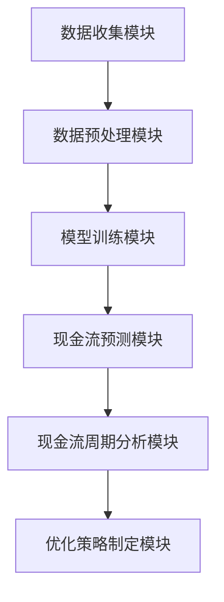

# AI驱动的企业现金流周期优化与预测系统

> 关键词：AI、企业现金流、周期优化、预测系统、财务管理、数据分析、机器学习

> 摘要：本文围绕AI驱动的企业现金流周期优化与预测系统展开深入探讨。首先介绍了该系统产生的背景，包括其目的、预期读者、文档结构及相关术语。接着阐述了核心概念与联系，通过文本示意图和Mermaid流程图清晰展示其架构原理。详细讲解了核心算法原理和具体操作步骤，结合Python源代码进行说明。对数学模型和公式进行了详细推导与举例。通过项目实战展示了系统的代码实现和解读。分析了系统在实际中的应用场景。推荐了相关的学习资源、开发工具框架以及论文著作。最后总结了系统未来的发展趋势与挑战，并提供了常见问题解答和扩展阅读参考资料。旨在帮助企业利用AI技术更好地管理现金流，实现现金流周期的优化和准确预测，提升企业的财务管理水平和竞争力。

## 1. 背景介绍 
### 1.1 目的和范围
企业的现金流管理是企业财务管理的核心内容之一，直接关系到企业的生存与发展。现金流周期的长短和稳定性对企业的运营效率、资金成本以及盈利能力有着重要影响。传统的现金流管理方法往往依赖于经验和简单的财务分析工具，难以应对复杂多变的市场环境和企业经营状况。

本系统的目的在于利用先进的人工智能技术，构建一个能够对企业现金流周期进行优化和预测的系统。通过对企业历史财务数据、市场数据、行业数据等多源数据的分析和挖掘，系统可以准确预测企业未来的现金流情况，并根据预测结果提供相应的优化策略，帮助企业合理安排资金，降低资金成本，提高资金使用效率，增强企业的财务稳定性和竞争力。

本系统的范围涵盖了企业现金流管理的各个环节，包括现金流入预测、现金流出预测、现金流周期分析、优化策略制定等。系统适用于各种规模和行业的企业，无论是制造业、服务业还是金融行业，都可以通过本系统实现现金流的有效管理。

### 1.2 预期读者
本系统的预期读者主要包括以下几类人员：
1. **企业财务管理人员**：他们负责企业的财务管理工作，需要准确掌握企业的现金流状况，制定合理的财务策略。本系统可以为他们提供准确的现金流预测和优化建议，帮助他们更好地管理企业的资金。
2. **企业高层管理人员**：他们需要对企业的整体运营和发展进行决策，现金流状况是他们决策的重要依据之一。本系统可以为他们提供全面的现金流信息和分析报告，帮助他们做出更加明智的决策。
3. **金融机构工作人员**：如银行信贷人员、投资分析师等，他们需要评估企业的财务状况和信用风险，本系统可以为他们提供更准确的企业现金流信息，帮助他们做出更加合理的信贷决策和投资分析。
4. **科研人员和技术爱好者**：他们对人工智能技术在财务管理领域的应用感兴趣，本系统的技术原理和实现方法可以为他们提供参考和借鉴。

### 1.3 文档结构概述
本文将按照以下结构进行组织：
1. **背景介绍**：介绍系统的目的、范围、预期读者、文档结构和相关术语。
2. **核心概念与联系**：阐述系统的核心概念和架构原理，通过文本示意图和Mermaid流程图进行展示。
3. **核心算法原理 & 具体操作步骤**：详细讲解系统所采用的核心算法原理，并结合Python源代码说明具体操作步骤。
4. **数学模型和公式 & 详细讲解 & 举例说明**：介绍系统所涉及的数学模型和公式，并进行详细推导和举例说明。
5. **项目实战：代码实际案例和详细解释说明**：通过一个具体的项目实例，展示系统的代码实现和详细解读。
6. **实际应用场景**：分析系统在不同行业和企业中的实际应用场景。
7. **工具和资源推荐**：推荐相关的学习资源、开发工具框架和论文著作。
8. **总结：未来发展趋势与挑战**：总结系统的未来发展趋势和面临的挑战。
9. **附录：常见问题与解答**：提供常见问题的解答。
10. **扩展阅读 & 参考资料**：提供扩展阅读的资料和参考来源。

### 1.4 术语表
#### 1.4.1 核心术语定义
1. **现金流**：指企业在一定会计期间按照现金收付实现制，通过一定经济活动（包括经营活动、投资活动、筹资活动和非经常性项目）而产生的现金流入、现金流出及其总量情况的总称。
2. **现金流周期**：指企业从购买原材料支付现金开始，到销售产品收回现金为止所经历的时间。它反映了企业资金的周转速度和运营效率。
3. **现金流预测**：指基于企业历史数据、市场趋势、行业信息等因素，运用一定的方法和模型，对企业未来一定时期内的现金流入和现金流出进行预测的过程。
4. **现金流优化**：指通过调整企业的经营策略、财务策略等，缩短现金流周期，提高资金使用效率，降低资金成本，实现企业现金流的最优配置。
5. **人工智能（AI）**：指研究、开发用于模拟、延伸和扩展人的智能的理论、方法、技术及应用系统的一门新的技术科学。在本系统中，主要利用机器学习、深度学习等AI技术进行数据挖掘和预测分析。

#### 1.4.2 相关概念解释
1. **机器学习**：是一门多领域交叉学科，涉及概率论、统计学、逼近论、凸分析、算法复杂度理论等多门学科。它专门研究计算机怎样模拟或实现人类的学习行为，以获取新的知识或技能，重新组织已有的知识结构使之不断改善自身的性能。在本系统中，机器学习算法用于对企业历史数据进行训练，构建预测模型。
2. **深度学习**：是机器学习的一个分支领域，它是一种基于对数据进行表征学习的方法。深度学习通过构建具有很多层的神经网络模型，自动从大量数据中学习特征和模式，从而实现对数据的分类、预测等任务。在本系统中，深度学习模型可以处理复杂的非线性关系，提高现金流预测的准确性。
3. **数据挖掘**：指从大量的、不完全的、有噪声的、模糊的、随机的数据中，提取隐含在其中的、人们事先不知道的、但又是潜在有用的信息和知识的过程。在本系统中，数据挖掘技术用于从企业多源数据中发现有价值的信息和规律，为现金流预测和优化提供依据。

#### 1.4.3 缩略词列表
1. **AI**：Artificial Intelligence，人工智能
2. **ML**：Machine Learning，机器学习
3. **DL**：Deep Learning，深度学习
4. **KPI**：Key Performance Indicator，关键绩效指标
5. **RNN**：Recurrent Neural Network，循环神经网络
6. **LSTM**：Long Short - Term Memory，长短期记忆网络

## 2. 核心概念与联系 
### 核心概念原理
本系统的核心概念主要围绕企业现金流的预测和优化展开。其基本原理是利用人工智能技术对企业的多源数据进行分析和挖掘，构建预测模型，预测企业未来的现金流情况，并根据预测结果制定相应的优化策略。

具体来说，系统首先收集企业的历史财务数据、市场数据、行业数据等多源数据，对数据进行预处理，包括数据清洗、特征提取、归一化等操作。然后，利用机器学习或深度学习算法对预处理后的数据进行训练，构建现金流预测模型。预测模型可以根据输入的当前数据，预测企业未来一定时期内的现金流入和现金流出情况。

在得到现金流预测结果后，系统会对现金流周期进行分析，计算相关的KPI指标，如现金周转天数、营运资金周转次数等。根据分析结果，系统会制定相应的优化策略，如调整采购策略、优化销售渠道、合理安排资金等，以缩短现金流周期，提高资金使用效率。

### 架构的文本示意图
```plaintext
+-----------------------+
| 数据收集模块          |
| - 财务数据           |
| - 市场数据           |
| - 行业数据           |
+-----------------------+
          |
          v
+-----------------------+
| 数据预处理模块        |
| - 数据清洗           |
| - 特征提取           |
| - 归一化             |
+-----------------------+
          |
          v
+-----------------------+
| 模型训练模块          |
| - 机器学习算法       |
| - 深度学习算法       |
+-----------------------+
          |
          v
+-----------------------+
| 现金流预测模块        |
| - 现金流入预测       |
| - 现金流出预测       |
+-----------------------+
          |
          v
+-----------------------+
| 现金流周期分析模块    |
| - KPI计算            |
| - 周期分析           |
+-----------------------+
          |
          v
+-----------------------+
| 优化策略制定模块      |
| - 采购策略调整       |
| - 销售渠道优化       |
| - 资金安排建议       |
+-----------------------+
```

### Mermaid流程图


## 3. 核心算法原理 & 具体操作步骤 
### 核心算法原理
本系统主要采用机器学习和深度学习算法进行现金流预测。以下以LSTM（长短期记忆网络）算法为例，介绍其原理。

LSTM是一种特殊的循环神经网络（RNN），它能够处理序列数据中的长期依赖关系。传统的RNN在处理长序列数据时，会出现梯度消失或梯度爆炸的问题，导致模型无法学习到长期的信息。而LSTM通过引入门控机制，有效地解决了这个问题。

LSTM单元主要由输入门（$i_t$）、遗忘门（$f_t$）、输出门（$o_t$）和细胞状态（$C_t$）组成。其计算公式如下：

1. 遗忘门：
   - $f_t=\sigma(W_f[h_{t - 1},x_t]+b_f)$
   其中，$\sigma$ 是sigmoid函数，$W_f$ 是遗忘门的权重矩阵，$h_{t - 1}$ 是上一时刻的隐藏状态，$x_t$ 是当前时刻的输入，$b_f$ 是遗忘门的偏置。遗忘门的作用是决定上一时刻的细胞状态 $C_{t - 1}$ 中有多少信息需要被遗忘。

2. 输入门：
   - $i_t=\sigma(W_i[h_{t - 1},x_t]+b_i)$
   - $\tilde{C}_t=\tanh(W_C[h_{t - 1},x_t]+b_C)$
   其中，$W_i$ 和 $W_C$ 分别是输入门和候选细胞状态的权重矩阵，$b_i$ 和 $b_C$ 分别是输入门和候选细胞状态的偏置。输入门决定了当前输入 $x_t$ 中有多少信息需要被添加到细胞状态中，$\tilde{C}_t$ 是候选细胞状态。

3. 更新细胞状态：
   - $C_t=f_t\odot C_{t - 1}+i_t\odot\tilde{C}_t$
   其中，$\odot$ 表示逐元素相乘。细胞状态 $C_t$ 是通过遗忘门和输入门的作用更新得到的。

4. 输出门：
   - $o_t=\sigma(W_o[h_{t - 1},x_t]+b_o)$
   - $h_t=o_t\odot\tanh(C_t)$
   其中，$W_o$ 是输出门的权重矩阵，$b_o$ 是输出门的偏置。输出门决定了细胞状态 $C_t$ 中有多少信息需要被输出到隐藏状态 $h_t$ 中。

### 具体操作步骤及Python源代码
以下是使用Python和PyTorch库实现一个简单的LSTM模型进行现金流预测的具体步骤和代码：

```python
import torch
import torch.nn as nn
import numpy as np
import pandas as pd
from sklearn.preprocessing import MinMaxScaler
import matplotlib.pyplot as plt

# 1. 数据准备
# 假设我们有一个包含现金流数据的CSV文件
data = pd.read_csv('cash_flow_data.csv')
cash_flow = data['cash_flow'].values.reshape(-1, 1)

# 数据归一化
scaler = MinMaxScaler(feature_range=(0, 1))
scaled_cash_flow = scaler.fit_transform(cash_flow)

# 划分训练集和测试集
train_size = int(len(scaled_cash_flow) * 0.8)
train_data = scaled_cash_flow[:train_size]
test_data = scaled_cash_flow[train_size:]

# 准备时间序列数据
def create_sequences(data, seq_length):
    xs = []
    ys = []
    for i in range(len(data) - seq_length):
        x = data[i:i + seq_length]
        y = data[i + seq_length]
        xs.append(x)
        ys.append(y)
    return np.array(xs), np.array(ys)

seq_length = 10
X_train, y_train = create_sequences(train_data, seq_length)
X_test, y_test = create_sequences(test_data, seq_length)

# 转换为PyTorch张量
X_train = torch.from_numpy(X_train).float()
y_train = torch.from_numpy(y_train).float()
X_test = torch.from_numpy(X_test).float()
y_test = torch.from_numpy(y_test).float()

# 2. 定义LSTM模型
class LSTMModel(nn.Module):
    def __init__(self, input_size, hidden_size, num_layers, output_size):
        super(LSTMModel, self).__init__()
        self.hidden_size = hidden_size
        self.num_layers = num_layers
        self.lstm = nn.LSTM(input_size, hidden_size, num_layers, batch_first=True)
        self.fc = nn.Linear(hidden_size, output_size)

    def forward(self, x):
        h0 = torch.zeros(self.num_layers, x.size(0), self.hidden_size).requires_grad_()
        c0 = torch.zeros(self.num_layers, x.size(0), self.hidden_size).requires_grad_()
        out, (hn, cn) = self.lstm(x, (h0.detach(), c0.detach()))
        out = self.fc(out[:, -1, :])
        return out

# 初始化模型
input_size = 1
hidden_size = 50
num_layers = 2
output_size = 1
model = LSTMModel(input_size, hidden_size, num_layers, output_size)

# 3. 定义损失函数和优化器
criterion = nn.MSELoss()
optimizer = torch.optim.Adam(model.parameters(), lr=0.001)

# 4. 训练模型
num_epochs = 100
for epoch in range(num_epochs):
    outputs = model(X_train)
    optimizer.zero_grad()
    loss = criterion(outputs, y_train)
    loss.backward()
    optimizer.step()
    if (epoch + 1) % 10 == 0:
        print(f'Epoch [{epoch + 1}/{num_epochs}], Loss: {loss.item():.4f}')

# 5. 预测
model.eval()
with torch.no_grad():
    train_predict = model(X_train)
    test_predict = model(X_test)

# 反归一化
train_predict = scaler.inverse_transform(train_predict.numpy())
test_predict = scaler.inverse_transform(test_predict.numpy())
y_train = scaler.inverse_transform(y_train.numpy())
y_test = scaler.inverse_transform(y_test.numpy())

# 6. 可视化结果
plt.plot(np.arange(len(cash_flow)), cash_flow, label='Original Data')
plt.plot(np.arange(seq_length, seq_length + len(train_predict)), train_predict, label='Train Predict')
plt.plot(np.arange(seq_length + len(train_predict), seq_length + len(train_predict) + len(test_predict)), test_predict, label='Test Predict')
plt.legend()
plt.show()
```

## 4. 数学模型和公式 & 详细讲解 & 举例说明 
### 现金流预测的数学模型
在本系统中，现金流预测可以看作是一个时间序列预测问题。我们可以使用自回归积分滑动平均模型（ARIMA）作为一种简单的数学模型进行预测。

ARIMA模型的一般形式为 $ARIMA(p, d, q)$，其中 $p$ 是自回归项的阶数，$d$ 是差分的阶数，$q$ 是移动平均项的阶数。

#### ARIMA模型的公式
ARIMA模型的公式可以表示为：

$\phi(B)(1 - B)^dY_t=\theta(B)\epsilon_t$

其中：
- $Y_t$ 是时间序列在时刻 $t$ 的值。
- $B$ 是后移算子，即 $BY_t = Y_{t - 1}$。
- $\phi(B)=1-\phi_1B-\phi_2B^2-\cdots-\phi_pB^p$ 是自回归多项式，$\phi_i$ 是自回归系数。
- $(1 - B)^d$ 是差分算子，$d$ 表示差分的阶数。
- $\theta(B)=1+\theta_1B+\theta_2B^2+\cdots+\theta_qB^q$ 是移动平均多项式，$\theta_i$ 是移动平均系数。
- $\epsilon_t$ 是白噪声序列。

#### 详细讲解
1. **自回归部分（AR）**：自回归部分表示当前时刻的时间序列值 $Y_t$ 与过去若干时刻的值 $Y_{t - 1}, Y_{t - 2},\cdots, Y_{t - p}$ 之间的线性关系。自回归系数 $\phi_i$ 反映了过去时刻的值对当前时刻值的影响程度。
2. **差分部分（I）**：差分的目的是使时间序列变得平稳。通过对时间序列进行 $d$ 阶差分，可以消除序列中的趋势和季节性成分，使其满足平稳性条件。
3. **移动平均部分（MA）**：移动平均部分表示当前时刻的时间序列值 $Y_t$ 与过去若干时刻的白噪声值 $\epsilon_{t - 1}, \epsilon_{t - 2},\cdots, \epsilon_{t - q}$ 之间的线性关系。移动平均系数 $\theta_i$ 反映了过去白噪声值对当前时刻值的影响程度。

#### 举例说明
假设我们有一个时间序列 $Y_t$，其值为 $[10, 12, 15, 13, 16, 18, 20, 22, 25, 23]$。我们可以使用ARIMA模型对其进行预测。

首先，我们需要确定 $p$、$d$、$q$ 的值。可以通过观察时间序列的自相关函数（ACF）和偏自相关函数（PACF）来初步确定。假设经过分析，我们得到 $p = 1$，$d = 1$，$q = 1$，即 $ARIMA(1, 1, 1)$ 模型。

然后，我们可以使用Python的 `statsmodels` 库来拟合和预测：

```python
import pandas as pd
from statsmodels.tsa.arima.model import ARIMA

# 定义时间序列
data = [10, 12, 15, 13, 16, 18, 20, 22, 25, 23]
series = pd.Series(data)

# 拟合ARIMA模型
model = ARIMA(series, order=(1, 1, 1))
model_fit = model.fit()

# 预测未来值
forecast = model_fit.get_forecast(steps=3)
forecast_mean = forecast.predicted_mean

print('预测值:', forecast_mean)
```

## 5. 项目实战：代码实际案例和详细解释说明 
### 5.1  开发环境搭建
#### 硬件环境
- **CPU**：建议使用多核处理器，如Intel Core i7或更高版本，以提高模型训练的速度。
- **内存**：至少8GB的内存，对于大规模数据和复杂模型，建议16GB或更多。
- **存储**：需要足够的磁盘空间来存储数据和模型文件，建议至少有500GB的可用空间。

#### 软件环境
- **操作系统**：可以选择Windows、Linux（如Ubuntu）或macOS。
- **Python环境**：建议使用Python 3.7及以上版本。可以通过Anaconda或Miniconda来管理Python环境。
- **相关库**：安装以下Python库：
  - `pandas`：用于数据处理和分析。
  - `numpy`：用于数值计算。
  - `torch`：用于深度学习模型的构建和训练。
  - `scikit-learn`：用于数据预处理和模型评估。
  - `matplotlib`：用于数据可视化。

可以使用以下命令来安装这些库：

```bash
pip install pandas numpy torch scikit-learn matplotlib
```

### 5.2  源代码详细实现和代码解读
以下是一个完整的项目实例，实现了企业现金流预测和优化系统的主要功能：

```python
import pandas as pd
import numpy as np
from sklearn.preprocessing import MinMaxScaler
import torch
import torch.nn as nn
import matplotlib.pyplot as plt

# 1. 数据加载和预处理
def load_data(file_path):
    data = pd.read_csv(file_path)
    cash_flow = data['cash_flow'].values.reshape(-1, 1)
    scaler = MinMaxScaler(feature_range=(0, 1))
    scaled_cash_flow = scaler.fit_transform(cash_flow)
    return scaled_cash_flow, scaler

# 2. 准备时间序列数据
def create_sequences(data, seq_length):
    xs = []
    ys = []
    for i in range(len(data) - seq_length):
        x = data[i:i + seq_length]
        y = data[i + seq_length]
        xs.append(x)
        ys.append(y)
    return np.array(xs), np.array(ys)

# 3. 定义LSTM模型
class LSTMModel(nn.Module):
    def __init__(self, input_size, hidden_size, num_layers, output_size):
        super(LSTMModel, self).__init__()
        self.hidden_size = hidden_size
        self.num_layers = num_layers
        self.lstm = nn.LSTM(input_size, hidden_size, num_layers, batch_first=True)
        self.fc = nn.Linear(hidden_size, output_size)

    def forward(self, x):
        h0 = torch.zeros(self.num_layers, x.size(0), self.hidden_size).requires_grad_()
        c0 = torch.zeros(self.num_layers, x.size(0), self.hidden_size).requires_grad_()
        out, (hn, cn) = self.lstm(x, (h0.detach(), c0.detach()))
        out = self.fc(out[:, -1, :])
        return out

# 4. 训练模型
def train_model(model, X_train, y_train, num_epochs, criterion, optimizer):
    for epoch in range(num_epochs):
        outputs = model(X_train)
        optimizer.zero_grad()
        loss = criterion(outputs, y_train)
        loss.backward()
        optimizer.step()
        if (epoch + 1) % 10 == 0:
            print(f'Epoch [{epoch + 1}/{num_epochs}], Loss: {loss.item():.4f}')
    return model

# 5. 预测
def predict(model, X_test, scaler):
    model.eval()
    with torch.no_grad():
        test_predict = model(X_test)
    test_predict = scaler.inverse_transform(test_predict.numpy())
    return test_predict

# 6. 主函数
def main():
    # 数据加载和预处理
    file_path = 'cash_flow_data.csv'
    scaled_cash_flow, scaler = load_data(file_path)

    # 划分训练集和测试集
    train_size = int(len(scaled_cash_flow) * 0.8)
    train_data = scaled_cash_flow[:train_size]
    test_data = scaled_cash_flow[train_size:]

    # 准备时间序列数据
    seq_length = 10
    X_train, y_train = create_sequences(train_data, seq_length)
    X_test, y_test = create_sequences(test_data, seq_length)

    # 转换为PyTorch张量
    X_train = torch.from_numpy(X_train).float()
    y_train = torch.from_numpy(y_train).float()
    X_test = torch.from_numpy(X_test).float()

    # 初始化模型
    input_size = 1
    hidden_size = 50
    num_layers = 2
    output_size = 1
    model = LSTMModel(input_size, hidden_size, num_layers, output_size)

    # 定义损失函数和优化器
    criterion = nn.MSELoss()
    optimizer = torch.optim.Adam(model.parameters(), lr=0.001)

    # 训练模型
    num_epochs = 100
    model = train_model(model, X_train, y_train, num_epochs, criterion, optimizer)

    # 预测
    test_predict = predict(model, X_test, scaler)

    # 可视化结果
    original_data = scaler.inverse_transform(scaled_cash_flow)
    plt.plot(np.arange(len(original_data)), original_data, label='Original Data')
    plt.plot(np.arange(train_size + seq_length, train_size + seq_length + len(test_predict)), test_predict, label='Test Predict')
    plt.legend()
    plt.show()

if __name__ == '__main__':
    main()
```

### 5.3  代码解读与分析
1. **数据加载和预处理**：`load_data` 函数用于加载CSV文件中的现金流数据，并使用 `MinMaxScaler` 对数据进行归一化处理，将数据缩放到0到1的范围内。
2. **准备时间序列数据**：`create_sequences` 函数将时间序列数据转换为适合LSTM模型输入的格式，即将数据划分为输入序列和对应的目标值。
3. **定义LSTM模型**：`LSTMModel` 类定义了一个LSTM模型，包含一个LSTM层和一个全连接层。
4. **训练模型**：`train_model` 函数使用训练数据对模型进行训练，通过反向传播算法更新模型的参数，最小化损失函数。
5. **预测**：`predict` 函数使用训练好的模型对测试数据进行预测，并将预测结果反归一化，得到实际的现金流值。
6. **主函数**：`main` 函数将上述步骤组合起来，完成数据加载、预处理、模型训练、预测和可视化的整个流程。

## 6. 实际应用场景 
### 制造业企业
在制造业企业中，现金流管理尤为重要。企业需要采购原材料、支付生产费用、销售产品并收回货款。通过本系统，企业可以准确预测原材料采购的现金流出和产品销售的现金流入，合理安排生产计划和库存管理。例如，如果预测到未来一段时间内现金流入减少，企业可以适当减少原材料采购量，避免库存积压，降低资金占用成本。同时，系统可以分析现金流周期，找出影响资金周转的关键环节，如应收账款回收周期过长等，并提供相应的优化策略，如加强客户信用管理、缩短账期等。

### 服务业企业
服务业企业的现金流特点与制造业有所不同。服务业企业通常以提供服务为主，其现金流入主要来自客户的服务费用支付，现金流出主要包括员工工资、场地租赁、设备采购等。本系统可以帮助服务业企业预测不同季节、不同业务类型的现金流入情况，合理安排人员和资源。例如，在旅游旺季，预测到服务需求增加，现金流入将增多，企业可以提前招聘临时员工，扩大服务规模，提高收入。同时，系统可以分析现金流周期，优化费用支出，如选择更合适的场地租赁时间和方式，降低运营成本。

### 金融行业企业
金融行业企业的现金流管理更加复杂，涉及到大量的资金交易和风险控制。本系统可以帮助金融机构预测客户的还款能力和违约风险，合理安排资金的投放和回收。例如，银行可以根据客户的现金流预测结果，评估其贷款申请的可行性，降低信贷风险。同时，系统可以分析金融机构自身的现金流状况，优化资金配置，提高资金的使用效率和盈利能力。

## 7. 工具和资源推荐
### 7.1 学习资源推荐
#### 7.1.1 书籍推荐
1. 《Python数据分析实战》：这本书详细介绍了使用Python进行数据分析的方法和技巧，包括数据处理、数据可视化、机器学习等内容，对于理解和实现本系统的数据预处理和分析部分非常有帮助。
2. 《深度学习》：由Ian Goodfellow、Yoshua Bengio和Aaron Courville所著，是深度学习领域的经典教材，全面介绍了深度学习的理论和实践，对于理解本系统中使用的深度学习算法和模型有很大的帮助。
3. 《Python机器学习》：这本书介绍了Python在机器学习中的应用，包括各种机器学习算法的原理和实现，对于掌握本系统中使用的机器学习算法有很好的指导作用。

#### 7.1.2 在线课程
1. Coursera上的“机器学习”课程：由Andrew Ng教授授课，是机器学习领域的经典课程，全面介绍了机器学习的基本概念、算法和应用，对于初学者来说是一个很好的入门课程。
2. edX上的“深度学习基础”课程：由deeplearning.ai提供，深入介绍了深度学习的基本原理和实践，包括神经网络、卷积神经网络、循环神经网络等内容，对于理解本系统中使用的深度学习模型有很大的帮助。
3. 中国大学MOOC上的“Python数据分析与应用”课程：该课程介绍了Python在数据分析中的应用，包括数据处理、数据可视化、机器学习等内容，对于掌握本系统的数据处理和分析部分有很好的帮助。

#### 7.1.3 技术博客和网站
1. Medium：是一个技术博客平台，上面有很多关于人工智能、机器学习、数据分析等领域的优秀文章，可以及时了解最新的技术动态和研究成果。
2. Kaggle：是一个数据科学竞赛平台，上面有很多关于数据分析、机器学习、深度学习等领域的数据集和代码示例，可以通过参与竞赛和学习他人的代码来提高自己的技术水平。
3. 博客园：是一个国内的技术博客平台，上面有很多关于Python、人工智能、数据分析等领域的优秀文章，可以学习到很多实用的技术和经验。

### 7.2 开发工具框架推荐
#### 7.2.1 IDE和编辑器
1. PyCharm：是一款专门为Python开发设计的集成开发环境（IDE），具有代码自动补全、调试、版本控制等功能，非常适合Python开发。
2. Visual Studio Code：是一款轻量级的代码编辑器，支持多种编程语言，通过安装相关的插件可以实现Python开发的各种功能，如代码高亮、调试、代码格式化等。
3. Jupyter Notebook：是一个交互式的开发环境，支持Python、R等多种编程语言，适合进行数据探索、模型训练和可视化等工作。

#### 7.2.2 调试和性能分析工具
1. Py-Spy：是一个轻量级的Python性能分析工具，可以实时分析Python程序的性能瓶颈，帮助开发者优化代码。
2. TensorBoard：是TensorFlow提供的一个可视化工具，可以用于可视化深度学习模型的训练过程、损失函数曲线、模型结构等，帮助开发者更好地理解和优化模型。
3. cProfile：是Python标准库中的一个性能分析工具，可以分析Python程序中各个函数的执行时间和调用次数，帮助开发者找出性能瓶颈。

#### 7.2.3 相关框架和库
1. PyTorch：是一个开源的深度学习框架，提供了丰富的深度学习模型和工具，支持GPU加速，适合进行深度学习模型的开发和训练。
2. scikit-learn：是一个开源的机器学习库，提供了各种机器学习算法和工具，如分类、回归、聚类等，适合进行机器学习模型的开发和训练。
3. pandas：是一个开源的数据处理和分析库，提供了丰富的数据结构和数据处理方法，适合进行数据清洗、特征提取、数据分析等工作。

### 7.3 相关论文著作推荐
#### 7.3.1 经典论文
1. “Long Short-Term Memory”：由Sepp Hochreiter和Jürgen Schmidhuber发表，首次提出了长短期记忆网络（LSTM）的概念，是深度学习领域的经典论文之一。
2. “Gradient-based learning applied to document recognition”：由Yann LeCun、Léon Bottou、Yoshua Bengio和Patrick Haffner发表，介绍了卷积神经网络（CNN）在文档识别中的应用，是深度学习领域的重要论文之一。
3. “Attention Is All You Need”：由Ashish Vaswani等人发表，提出了Transformer模型，是自然语言处理领域的重要突破，对深度学习的发展产生了深远影响。

#### 7.3.2 最新研究成果
1. 关注顶级学术会议，如NeurIPS（神经信息处理系统大会）、ICML（国际机器学习会议）、CVPR（计算机视觉与模式识别会议）等，这些会议上会发表很多关于人工智能、机器学习、深度学习等领域的最新研究成果。
2. 关注顶级学术期刊，如Journal of Artificial Intelligence Research（JAIR）、Artificial Intelligence、Machine Learning等，这些期刊上会发表很多高质量的学术论文。

#### 7.3.3 应用案例分析
1. 研究一些知名企业在现金流管理和预测方面的成功案例，如亚马逊、苹果等公司，了解他们如何利用数据分析和人工智能技术优化现金流管理，提高企业的竞争力。
2. 参考一些金融机构在风险管理和资金预测方面的应用案例，如银行、证券公司等，了解他们如何利用人工智能技术进行风险评估和资金配置，降低金融风险。

## 8. 总结：未来发展趋势与挑战
### 未来发展趋势
1. **多源数据融合**：未来的现金流预测和优化系统将不仅仅依赖于企业的财务数据，还会融合市场数据、行业数据、社交媒体数据等多源数据，以更全面地了解企业的经营环境和市场趋势，提高预测的准确性和优化策略的有效性。
2. **人工智能与区块链结合**：区块链技术具有去中心化、不可篡改、可追溯等特点，可以为现金流管理提供更加安全、可信的数据基础。将人工智能与区块链技术结合，可以实现更加智能、高效的现金流管理和预测。
3. **实时预测和动态优化**：随着信息技术的不断发展，企业可以实时获取和处理大量的数据。未来的系统将实现实时的现金流预测和动态的优化策略调整，帮助企业及时应对市场变化和突发情况，提高企业的应变能力和竞争力。
4. **智能化决策支持**：未来的系统将不仅仅提供预测结果和优化策略，还会利用人工智能技术进行智能化的决策支持。系统可以根据企业的目标和约束条件，自动生成最优的决策方案，并为企业管理者提供详细的决策依据和风险评估。

### 挑战
1. **数据质量和安全问题**：多源数据的融合会带来数据质量和安全问题。不同来源的数据可能存在格式不一致、数据缺失、数据错误等问题，需要进行有效的数据清洗和预处理。同时，企业的财务数据等敏感信息需要进行严格的安全保护，防止数据泄露和滥用。
2. **模型可解释性问题**：深度学习模型等人工智能模型通常具有较高的预测准确性，但模型的可解释性较差。在企业的现金流管理中，管理者需要了解模型的预测依据和优化策略的合理性，因此需要解决模型的可解释性问题，提高模型的可信度和实用性。
3. **技术人才短缺问题**：开发和应用AI驱动的企业现金流周期优化与预测系统需要具备人工智能、数据分析、财务管理等多领域知识的复合型人才。目前，这类人才相对短缺，企业需要加大人才培养和引进的力度。
4. **法律法规和伦理问题**：随着人工智能技术的广泛应用，相关的法律法规和伦理问题也日益凸显。在现金流管理和预测中，需要遵守相关的法律法规，保护用户的隐私和权益，同时需要考虑人工智能技术的伦理问题，确保技术的正确应用。

## 9. 附录：常见问题与解答
### 1. 系统的预测准确性如何保证？
系统的预测准确性主要通过以下几个方面来保证：
- **数据质量**：对收集到的多源数据进行严格的清洗和预处理，确保数据的准确性和完整性。
- **模型选择和优化**：根据数据的特点和问题的需求，选择合适的预测模型，并对模型进行优化和调参，提高模型的性能。
- **多模型融合**：可以采用多个不同的模型进行预测，然后将多个模型的预测结果进行融合，以提高预测的准确性和稳定性。
- **持续更新和改进**：随着新数据的不断产生和市场环境的变化，对模型进行持续更新和改进，以适应新的情况。

### 2. 系统如何处理异常数据？
在数据预处理阶段，会对异常数据进行识别和处理。常见的方法包括：
- **阈值法**：设定一个合理的阈值范围，将超出阈值范围的数据视为异常数据，然后进行删除或修正。
- **统计分析法**：通过计算数据的均值、标准差等统计量，识别出偏离均值较大的数据作为异常数据，然后进行处理。
- **机器学习方法**：可以使用聚类算法、孤立森林等机器学习方法来识别异常数据，然后进行相应的处理。

### 3. 系统是否可以应用于不同规模和行业的企业？
是的，系统具有较强的通用性，可以应用于不同规模和行业的企业。在实际应用中，会根据企业的特点和需求，对数据进行针对性的处理和分析，选择合适的模型和算法，以确保系统能够为不同企业提供有效的现金流预测和优化服务。

### 4. 系统的优化策略是如何制定的？
系统的优化策略是根据现金流预测结果和现金流周期分析结果制定的。具体来说，系统会分析影响现金流周期的关键因素，如应收账款回收周期、存货周转天数等，然后针对这些因素制定相应的优化策略。例如，如果发现应收账款回收周期过长，系统会建议企业加强客户信用管理、缩短账期等；如果发现存货周转天数过长，系统会建议企业优化库存管理、调整采购策略等。

## 10. 扩展阅读 & 参考资料
### 扩展阅读
1. 《智能时代》：作者吴军，介绍了人工智能技术对各个行业的影响和变革，帮助读者了解人工智能在企业管理中的应用前景。
2. 《大数据时代》：作者维克托·迈尔 - 舍恩伯格，探讨了大数据的发展趋势和应用价值，对于理解本系统中多源数据的融合和应用有一定的帮助。
3. 《财务风险管理》：介绍了企业财务风险管理的理论和方法，对于理解企业现金流管理的重要性和风险控制有很大的帮助。

### 参考资料
1. Goodfellow, I., Bengio, Y., & Courville, A. (2016). Deep Learning. MIT Press.
2. Géron, A. (2019). Hands - On Machine Learning with Scikit - Learn, Keras, and TensorFlow: Concepts, Tools, and Techniques to Build Intelligent Systems. O'Reilly Media.
3. McKinney, W. (2017). Python for Data Analysis: Data Wrangling with Pandas, NumPy, and IPython. O'Reilly Media.

作者：AI天才研究院/AI Genius Institute & 禅与计算机程序设计艺术 /Zen And The Art of Computer Programming