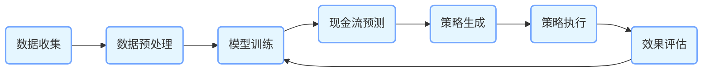

# AI驱动的企业现金流周期优化系统

> 关键词：AI、企业现金流周期、优化系统、预测分析、风险管理

> 摘要：本文围绕AI驱动的企业现金流周期优化系统展开，详细阐述了该系统的核心概念、算法原理、数学模型等内容。通过Python代码给出了具体的实现案例，并介绍了其在实际企业中的应用场景。同时，推荐了相关的学习资源、开发工具和论文著作。最后，对该系统的未来发展趋势与挑战进行了总结，还提供了常见问题解答和扩展阅读参考资料，旨在为企业利用AI技术优化现金流周期提供全面的技术指导和实践建议。

## 1. 背景介绍 
### 1.1 目的和范围
企业的现金流周期是指从购买原材料支付现金到销售产品收回现金的整个过程所经历的时间。优化现金流周期对于企业的生存和发展至关重要，它可以提高企业的资金使用效率、降低财务风险、增强企业的竞争力。本文章的目的是介绍如何利用人工智能技术构建一个企业现金流周期优化系统，以帮助企业更好地管理现金流。范围涵盖了该系统的核心概念、算法原理、数学模型、实际应用案例以及相关的工具和资源推荐等方面。

### 1.2 预期读者
本文预期读者包括企业财务管理人员、企业决策者、人工智能技术开发者、金融分析师以及对企业现金流管理和人工智能应用感兴趣的研究人员。

### 1.3 文档结构概述
本文首先介绍了AI驱动的企业现金流周期优化系统的背景信息，包括目的、预期读者和文档结构。接着阐述了该系统的核心概念与联系，包括其原理和架构。然后详细讲解了核心算法原理和具体操作步骤，并给出了Python源代码。之后介绍了相关的数学模型和公式，并举例说明。再通过项目实战展示了代码实际案例和详细解释。随后讨论了该系统的实际应用场景。接着推荐了学习资源、开发工具框架和相关论文著作。最后对系统的未来发展趋势与挑战进行了总结，还提供了常见问题解答和扩展阅读参考资料。

### 1.4 术语表
#### 1.4.1 核心术语定义
- **企业现金流周期**：企业从购买原材料支付现金开始，到销售产品收回现金为止所经历的时间周期。
- **人工智能（AI）**：研究、开发用于模拟、延伸和扩展人的智能的理论、方法、技术及应用系统的一门新的技术科学。
- **预测分析**：利用历史数据和统计算法来预测未来事件或趋势的过程。
- **风险管理**：识别、评估和应对可能影响企业目标实现的风险的过程。

#### 1.4.2 相关概念解释
- **现金流预测**：通过对企业历史现金流数据和相关业务数据的分析，预测未来一段时间内企业的现金流入和流出情况。
- **优化算法**：用于寻找最优解决方案的算法，在现金流周期优化中，用于确定最佳的采购、生产和销售策略，以缩短现金流周期。

#### 1.4.3 缩略词列表
- **AI**：Artificial Intelligence（人工智能）
- **ML**：Machine Learning（机器学习）
- **DL**：Deep Learning（深度学习）

## 2. 核心概念与联系 

### 核心概念原理
AI驱动的企业现金流周期优化系统的核心原理是利用人工智能技术对企业的现金流数据进行分析和预测，从而帮助企业优化现金流周期。具体来说，系统通过收集企业的历史现金流数据、财务数据、市场数据等多源数据，利用机器学习和深度学习算法建立预测模型，预测未来的现金流入和流出情况。然后，根据预测结果，结合企业的业务目标和约束条件，利用优化算法生成最优的现金流管理策略，如调整采购计划、优化生产流程、加快应收账款回收等，以缩短现金流周期，提高企业的资金使用效率。

### 架构示意图


### 架构解释
1. **数据收集**：收集企业的历史现金流数据、财务数据、市场数据、销售数据、采购数据等多源数据，为后续的分析和建模提供基础。
2. **数据预处理**：对收集到的数据进行清洗、转换、归一化等处理，以提高数据的质量和可用性。
3. **模型训练**：利用预处理后的数据，选择合适的机器学习或深度学习算法，如神经网络、决策树、支持向量机等，建立现金流预测模型和优化模型。
4. **现金流预测**：使用训练好的预测模型，对未来一段时间内的现金流入和流出情况进行预测。
5. **策略生成**：根据现金流预测结果，结合企业的业务目标和约束条件，利用优化算法生成最优的现金流管理策略。
6. **策略执行**：将生成的策略应用到企业的实际业务中，如调整采购计划、优化生产流程、加快应收账款回收等。
7. **效果评估**：对策略执行的效果进行评估，比较实际现金流情况与预测结果的差异，分析策略的有效性。根据评估结果，对模型进行更新和优化，以提高系统的性能和准确性。

## 3. 核心算法原理 & 具体操作步骤 

### 核心算法原理
在AI驱动的企业现金流周期优化系统中，主要涉及到两个核心算法：现金流预测算法和优化算法。

#### 现金流预测算法
我们可以使用长短期记忆网络（LSTM）来进行现金流预测。LSTM是一种特殊的循环神经网络（RNN），能够处理序列数据中的长期依赖关系，非常适合用于时间序列预测问题。

#### 优化算法
对于现金流管理策略的优化，我们可以使用线性规划算法。线性规划是一种在一组线性约束条件下，寻找线性目标函数最优解的数学方法。在现金流管理中，我们可以将目标函数设定为最大化现金流周期的缩短程度，约束条件包括企业的生产能力、库存水平、销售计划等。

### 具体操作步骤及Python代码实现

#### 步骤1：数据收集和预处理
```python
import pandas as pd
import numpy as np

# 假设我们已经有了一个包含现金流数据的CSV文件
data = pd.read_csv('cash_flow_data.csv')

# 数据清洗：处理缺失值
data = data.dropna()

# 数据归一化
from sklearn.preprocessing import MinMaxScaler
scaler = MinMaxScaler()
scaled_data = scaler.fit_transform(data[['cash_in', 'cash_out']])

# 划分训练集和测试集
train_size = int(len(scaled_data) * 0.8)
train_data = scaled_data[:train_size]
test_data = scaled_data[train_size:]
```

#### 步骤2：构建LSTM模型进行现金流预测
```python
from tensorflow.keras.models import Sequential
from tensorflow.keras.layers import LSTM, Dense

# 准备训练数据
def create_sequences(data, seq_length):
    xs, ys = [], []
    for i in range(len(data) - seq_length):
        x = data[i:i+seq_length]
        y = data[i+seq_length, 0]  # 预测现金流入
        xs.append(x)
        ys.append(y)
    return np.array(xs), np.array(ys)

seq_length = 10
X_train, y_train = create_sequences(train_data, seq_length)
X_test, y_test = create_sequences(test_data, seq_length)

# 构建LSTM模型
model = Sequential()
model.add(LSTM(50, return_sequences=True, input_shape=(seq_length, 2)))
model.add(LSTM(50, return_sequences=False))
model.add(Dense(25))
model.add(Dense(1))

model.compile(optimizer='adam', loss='mean_squared_error')

# 训练模型
model.fit(X_train, y_train, batch_size=32, epochs=50)

# 进行预测
predictions = model.predict(X_test)

# 反归一化
predictions = scaler.inverse_transform(np.hstack((predictions, np.zeros((len(predictions), 1)))))[:, 0]
y_test = scaler.inverse_transform(np.hstack((y_test.reshape(-1, 1), np.zeros((len(y_test), 1)))))[:, 0]
```

#### 步骤3：使用线性规划进行策略优化
```python
from scipy.optimize import linprog

# 假设我们有以下约束条件和目标函数
# 目标函数：最大化现金流周期缩短程度
# 约束条件：生产能力、库存水平、销售计划等

# 目标函数系数（这里只是示例）
c = [-1]  # 最大化问题转化为最小化负的目标函数

# 不等式约束系数矩阵
A_ub = [[1]]  # 示例约束
b_ub = [100]  # 示例约束上限

# 变量边界
bounds = [(0, None)]

# 求解线性规划问题
res = linprog(c, A_ub=A_ub, b_ub=b_ub, bounds=bounds)

print("最优解：", res.x)
```

## 4. 数学模型和公式 & 详细讲解 & 举例说明 

### 现金流预测模型
#### 长短期记忆网络（LSTM）数学模型
LSTM单元由输入门 $i_t$、遗忘门 $f_t$、输出门 $o_t$ 和细胞状态 $C_t$ 组成。其数学公式如下：

遗忘门：
$$f_t = \sigma(W_f[h_{t-1}, x_t] + b_f)$$

输入门：
$$i_t = \sigma(W_i[h_{t-1}, x_t] + b_i)$$

候选细胞状态：
$$\tilde{C}_t = \tanh(W_C[h_{t-1}, x_t] + b_C)$$

细胞状态更新：
$$C_t = f_t \odot C_{t-1} + i_t \odot \tilde{C}_t$$

输出门：
$$o_t = \sigma(W_o[h_{t-1}, x_t] + b_o)$$

隐藏状态更新：
$$h_t = o_t \odot \tanh(C_t)$$

其中，$x_t$ 是当前时刻的输入，$h_{t-1}$ 是上一时刻的隐藏状态，$W$ 是权重矩阵，$b$ 是偏置向量，$\sigma$ 是 sigmoid 函数，$\tanh$ 是双曲正切函数，$\odot$ 表示逐元素相乘。

#### 举例说明
假设我们有一个时间序列的现金流数据，每个时间步的输入 $x_t$ 是一个二维向量，分别表示现金流入和现金流出。我们使用一个包含50个LSTM单元的LSTM层进行预测。在每个时间步，LSTM单元根据当前输入 $x_t$ 和上一时刻的隐藏状态 $h_{t-1}$ 计算遗忘门、输入门、候选细胞状态、细胞状态和输出门，最终更新隐藏状态 $h_t$。经过多个时间步的计算，LSTM网络可以学习到现金流数据的长期依赖关系，从而进行准确的预测。

### 优化模型
#### 线性规划数学模型
线性规划问题的一般形式为：

最小化目标函数：
$$\min_{x} c^T x$$

约束条件：
$$A_{ub} x \leq b_{ub}$$
$$A_{eq} x = b_{eq}$$
$$l \leq x \leq u$$

其中，$x$ 是决策变量向量，$c$ 是目标函数系数向量，$A_{ub}$ 和 $b_{ub}$ 是不等式约束系数矩阵和上限向量，$A_{eq}$ 和 $b_{eq}$ 是等式约束系数矩阵和等式右边向量，$l$ 和 $u$ 是决策变量的下界和上界。

#### 举例说明
假设企业的目标是最大化现金流周期的缩短程度，决策变量 $x$ 表示调整采购计划的比例。约束条件包括企业的生产能力限制和库存水平限制。我们可以将目标函数设定为 $-x$（最大化 $x$ 转化为最小化 $-x$），不等式约束条件可以表示为生产能力和库存水平的限制。通过求解线性规划问题，我们可以得到最优的采购计划调整比例，从而优化现金流周期。

## 5. 项目实战：代码实际案例和详细解释说明 

### 5.1  开发环境搭建
#### 操作系统
可以选择 Windows、Linux 或 macOS 操作系统。

#### 编程语言和库
- **Python**：建议使用 Python 3.7 及以上版本。
- **深度学习框架**：TensorFlow 或 PyTorch，这里我们使用 TensorFlow。
- **数据处理库**：Pandas、NumPy。
- **优化库**：SciPy。

#### 安装步骤
```bash
# 创建虚拟环境（可选）
python -m venv cash_flow_env
source cash_flow_env/bin/activate  # Linux/macOS
cash_flow_env\Scripts\activate  # Windows

# 安装所需库
pip install pandas numpy tensorflow scipy
```

### 5.2  源代码详细实现和代码解读
```python
import pandas as pd
import numpy as np
from sklearn.preprocessing import MinMaxScaler
from tensorflow.keras.models import Sequential
from tensorflow.keras.layers import LSTM, Dense
from scipy.optimize import linprog

# 步骤1：数据收集和预处理
# 假设我们已经有了一个包含现金流数据的CSV文件
data = pd.read_csv('cash_flow_data.csv')

# 数据清洗：处理缺失值
data = data.dropna()

# 数据归一化
scaler = MinMaxScaler()
scaled_data = scaler.fit_transform(data[['cash_in', 'cash_out']])

# 划分训练集和测试集
train_size = int(len(scaled_data) * 0.8)
train_data = scaled_data[:train_size]
test_data = scaled_data[train_size:]

# 步骤2：构建LSTM模型进行现金流预测
def create_sequences(data, seq_length):
    xs, ys = [], []
    for i in range(len(data) - seq_length):
        x = data[i:i+seq_length]
        y = data[i+seq_length, 0]  # 预测现金流入
        xs.append(x)
        ys.append(y)
    return np.array(xs), np.array(ys)

seq_length = 10
X_train, y_train = create_sequences(train_data, seq_length)
X_test, y_test = create_sequences(test_data, seq_length)

# 构建LSTM模型
model = Sequential()
model.add(LSTM(50, return_sequences=True, input_shape=(seq_length, 2)))
model.add(LSTM(50, return_sequences=False))
model.add(Dense(25))
model.add(Dense(1))

model.compile(optimizer='adam', loss='mean_squared_error')

# 训练模型
model.fit(X_train, y_train, batch_size=32, epochs=50)

# 进行预测
predictions = model.predict(X_test)

# 反归一化
predictions = scaler.inverse_transform(np.hstack((predictions, np.zeros((len(predictions), 1)))))[:, 0]
y_test = scaler.inverse_transform(np.hstack((y_test.reshape(-1, 1), np.zeros((len(y_test), 1)))))[:, 0]

# 步骤3：使用线性规划进行策略优化
# 目标函数系数（这里只是示例）
c = [-1]  # 最大化问题转化为最小化负的目标函数

# 不等式约束系数矩阵
A_ub = [[1]]  # 示例约束
b_ub = [100]  # 示例约束上限

# 变量边界
bounds = [(0, None)]

# 求解线性规划问题
res = linprog(c, A_ub=A_ub, b_ub=b_ub, bounds=bounds)

print("最优解：", res.x)
```

### 代码解读与分析
#### 数据收集和预处理
- 使用 `pandas` 库读取 CSV 文件中的现金流数据。
- 使用 `dropna()` 方法处理缺失值。
- 使用 `MinMaxScaler` 对数据进行归一化处理，将数据缩放到 [0, 1] 区间，有助于提高模型的训练效果。
- 划分训练集和测试集，将 80% 的数据作为训练集，20% 的数据作为测试集。

#### 现金流预测
- `create_sequences` 函数用于将时间序列数据转换为适合 LSTM 模型输入的序列数据。
- 构建 LSTM 模型，包含两个 LSTM 层和两个全连接层。
- 使用 `adam` 优化器和均方误差损失函数编译模型。
- 训练模型并进行预测。
- 对预测结果进行反归一化处理，得到实际的现金流入预测值。

#### 策略优化
- 定义目标函数系数、不等式约束系数矩阵、约束上限和变量边界。
- 使用 `linprog` 函数求解线性规划问题，得到最优解。

## 6. 实际应用场景 
### 制造业企业
在制造业企业中，AI驱动的企业现金流周期优化系统可以帮助企业优化采购计划。通过准确预测原材料价格波动和市场需求，系统可以建议企业在价格低谷时增加采购量，在需求高峰时加快生产和销售，从而缩短现金流周期。例如，一家汽车制造企业可以根据系统预测的钢材价格走势，提前采购钢材，降低采购成本，同时根据市场需求预测调整生产计划，加快汽车的销售和收款，提高资金的周转效率。

### 零售业企业
对于零售业企业，该系统可以用于优化库存管理。通过分析销售数据和市场趋势，系统可以预测不同商品的销售速度，帮助企业合理控制库存水平。减少库存积压可以降低库存持有成本，同时确保商品的及时供应，提高客户满意度。例如，一家超市可以根据系统预测的商品销售情况，调整订货量和补货时间，避免商品缺货和积压，从而优化现金流周期。

### 服务业企业
在服务业企业中，该系统可以帮助企业优化应收账款管理。通过对客户信用状况的分析和预测，系统可以提醒企业及时催收账款，降低坏账风险。例如，一家咨询公司可以根据系统预测的客户付款能力和付款时间，制定合理的收款策略，加快资金回笼，提高现金流的稳定性。

## 7. 工具和资源推荐
### 7.1 学习资源推荐
#### 7.1.1 书籍推荐
- 《Python机器学习实战》：这本书详细介绍了Python在机器学习领域的应用，包括数据预处理、模型训练、评估等方面的内容，适合初学者入门。
- 《深度学习》：由Ian Goodfellow、Yoshua Bengio和Aaron Courville合著，是深度学习领域的经典教材，涵盖了深度学习的基本原理、算法和应用。
- 《线性规划与网络流》：介绍了线性规划的基本理论和算法，以及在网络流问题中的应用，对于理解和应用优化算法有很大帮助。

#### 7.1.2 在线课程
- Coursera上的“机器学习”课程：由Andrew Ng教授授课，是机器学习领域的经典课程，内容涵盖了机器学习的基本概念、算法和应用。
- edX上的“深度学习微硕士学位课程”：提供了深度学习的系统学习，包括神经网络、卷积神经网络、循环神经网络等内容。
- Udemy上的“Python for Finance: Investment Fundamentals & Data Analytics”：该课程介绍了Python在金融领域的应用，包括现金流分析、风险管理等内容。

#### 7.1.3 技术博客和网站
- Towards Data Science：一个专注于数据科学和机器学习的技术博客平台，提供了大量的高质量文章和教程。
- Kaggle：一个数据科学竞赛平台，不仅可以参与竞赛，还可以学习其他参赛者的优秀代码和解决方案。
- TensorFlow官方文档：提供了TensorFlow深度学习框架的详细文档和教程，是学习和使用TensorFlow的重要资源。

### 7.2 开发工具框架推荐
#### 7.2.1 IDE和编辑器
- PyCharm：一款专业的Python集成开发环境，提供了代码编辑、调试、版本控制等功能，适合Python开发。
- Jupyter Notebook：一个交互式的开发环境，支持Python、R等多种编程语言，方便进行数据探索和模型实验。
- Visual Studio Code：一款轻量级的代码编辑器，支持多种编程语言和插件扩展，具有良好的开发体验。

#### 7.2.2 调试和性能分析工具
- TensorBoard：TensorFlow提供的可视化工具，可以用于监控模型训练过程、可视化模型结构和性能指标等。
- Py-Spy：一个用于Python程序性能分析的工具，可以帮助开发者找出程序中的性能瓶颈。
- cProfile：Python标准库中的性能分析模块，可以对Python程序进行详细的性能分析。

#### 7.2.3 相关框架和库
- TensorFlow：一个开源的深度学习框架，提供了丰富的深度学习模型和工具，支持大规模分布式训练。
- PyTorch：另一个流行的深度学习框架，具有动态图的优势，适合快速原型开发和研究。
- Scikit-learn：一个用于机器学习的Python库，提供了各种机器学习算法和工具，如分类、回归、聚类等。

### 7.3 相关论文著作推荐
#### 7.3.1 经典论文
- Hochreiter, S., & Schmidhuber, J. (1997). Long short-term memory. Neural computation, 9(8), 1735-1780. 这篇论文介绍了长短期记忆网络（LSTM）的基本原理和算法，是LSTM领域的经典论文。
- Dantzig, G. B. (1947). Maximization of a linear function of variables subject to linear inequalities. In Activity analysis of production and allocation (pp. 339-347). 这篇论文是线性规划领域的经典论文，提出了线性规划的基本概念和算法。

#### 7.3.2 最新研究成果
- 在IEEE Transactions on Neural Networks and Learning Systems、Journal of Financial Economics等学术期刊上可以找到关于AI在企业现金流管理领域的最新研究成果。

#### 7.3.3 应用案例分析
- 一些知名企业的案例分析报告，如亚马逊、苹果等公司的现金流管理策略和实践经验，可以在企业的官方网站、财经媒体和咨询公司的报告中找到。

## 8. 总结：未来发展趋势与挑战
### 未来发展趋势
#### 与物联网（IoT）融合
随着物联网技术的发展，企业可以通过传感器实时收集生产、销售、库存等环节的数据。AI驱动的企业现金流周期优化系统可以结合物联网数据，实现更精准的现金流预测和实时的策略调整。例如，在制造业中，通过物联网传感器实时监测设备运行状态和原材料消耗情况，系统可以及时调整采购计划和生产进度，进一步优化现金流周期。

#### 强化学习的应用
强化学习是一种通过智能体与环境进行交互，不断学习最优策略的机器学习方法。未来，强化学习可以应用于企业现金流管理中，使系统能够根据不同的市场环境和企业状态自动调整现金流管理策略。例如，系统可以根据市场需求的波动和竞争对手的策略，动态调整产品价格和销售策略，以最大化现金流周期的优化效果。

#### 跨企业协同优化
未来，企业之间的合作将更加紧密，AI驱动的企业现金流周期优化系统可以实现跨企业的协同优化。例如，供应链上的企业可以通过共享数据和协同决策，优化整个供应链的现金流周期。供应商可以根据制造商的生产计划提前安排生产和供货，制造商可以根据销售商的销售情况及时调整生产和发货，从而提高整个供应链的资金使用效率。

### 挑战
#### 数据质量和安全问题
AI驱动的企业现金流周期优化系统依赖于大量的高质量数据。然而，企业的数据可能存在缺失、错误、不一致等问题，影响模型的准确性和可靠性。此外，数据安全也是一个重要的问题，企业的现金流数据涉及到商业机密和敏感信息，需要采取有效的安全措施来保护数据的安全和隐私。

#### 模型解释性和可解释性AI
深度学习模型通常是黑盒模型，难以解释模型的决策过程和结果。在企业现金流管理中，决策者需要了解模型的预测依据和策略生成原理，以便做出合理的决策。因此，如何提高模型的解释性和可解释性是一个亟待解决的问题。

#### 技术人才短缺
AI技术的应用需要具备专业知识和技能的技术人才。然而，目前市场上AI技术人才短缺，企业难以招聘到合适的人才来开发和维护AI驱动的企业现金流周期优化系统。因此，培养和吸引AI技术人才是企业面临的一个挑战。

## 9. 附录：常见问题与解答
### 问题1：系统需要多少历史数据才能进行准确的预测？
解答：一般来说，历史数据越多，模型的训练效果越好，预测的准确性也越高。建议至少收集1-2年的现金流数据，同时结合其他相关的业务数据，如销售数据、采购数据等，以提高预测的准确性。

### 问题2：系统的预测结果有多大的误差？
解答：系统的预测误差受到多种因素的影响，如数据质量、模型选择、市场环境等。在实际应用中，可以通过交叉验证、模型评估等方法来评估模型的预测误差，并根据误差情况对模型进行调整和优化。

### 问题3：系统生成的策略是否可以直接应用到企业的实际业务中？
解答：系统生成的策略可以作为企业决策的参考，但在实际应用中，需要结合企业的实际情况和业务目标进行综合考虑。例如，策略可能受到企业的生产能力、库存水平、市场需求等因素的限制，需要进行适当的调整和优化。

### 问题4：如何保证系统的数据安全？
解答：为了保证系统的数据安全，可以采取以下措施：
- 数据加密：对敏感数据进行加密处理，防止数据在传输和存储过程中被窃取。
- 访问控制：设置严格的访问权限，只有授权人员才能访问和操作数据。
- 安全审计：对系统的操作和数据访问进行审计，及时发现和处理安全问题。
- 定期备份：定期对数据进行备份，以防止数据丢失。

## 10. 扩展阅读 & 参考资料
### 扩展阅读
- 《人工智能时代的财务管理变革》：探讨了人工智能技术在财务管理领域的应用和发展趋势。
- 《供应链金融与现金流管理》：介绍了供应链金融的基本概念和运作模式，以及如何通过供应链金融优化企业的现金流管理。

### 参考资料
- 企业财务报表和财务分析报告。
- 相关的学术论文和研究报告。
- 行业标准和规范。

作者：AI天才研究院/AI Genius Institute & 禅与计算机程序设计艺术 /Zen And The Art of Computer Programming