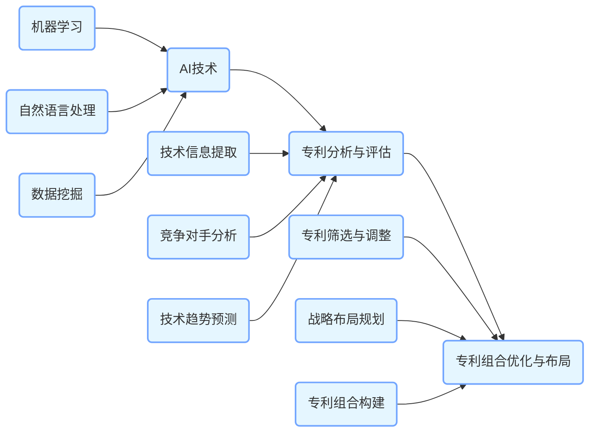

# AI驱动的企业知识产权战略：专利组合优化与布局

> 关键词：AI、企业知识产权战略、专利组合优化、专利布局、技术创新

> 摘要：本文聚焦于AI驱动下的企业知识产权战略，尤其是专利组合优化与布局。随着人工智能技术的飞速发展，企业在知识产权领域面临着新的机遇和挑战。文章详细阐述了相关核心概念，介绍了核心算法原理及操作步骤，通过数学模型和公式深入剖析其内在逻辑，并结合项目实战案例进行详细解读。同时，探讨了实际应用场景，推荐了学习资源、开发工具框架以及相关论文著作。最后对未来发展趋势与挑战进行总结，并给出常见问题解答和扩展阅读参考资料，旨在帮助企业更好地利用AI技术制定有效的知识产权战略。

## 1. 背景介绍 
### 1.1 目的和范围
在当今数字化时代，人工智能技术正以前所未有的速度改变着各个行业的格局。企业要在激烈的市场竞争中脱颖而出，不仅需要不断进行技术创新，还需要建立有效的知识产权战略来保护和管理自身的创新成果。专利作为企业知识产权的重要组成部分，其组合的优化与合理布局对于企业的技术领先地位、市场竞争力以及商业价值的实现具有至关重要的意义。

本文的目的在于深入探讨如何利用AI技术来驱动企业的专利组合优化与布局，为企业提供一套科学、系统的方法和策略。具体范围涵盖了AI在专利分析、评估、筛选以及布局规划等方面的应用，同时结合实际案例分析和理论研究，为企业在知识产权管理领域的决策提供参考。

### 1.2 预期读者
本文的预期读者主要包括企业的知识产权管理人员、技术研发人员、高层管理人员以及对人工智能和知识产权战略感兴趣的研究人员。对于知识产权管理人员，本文可以为他们提供利用AI技术优化专利组合和布局的具体方法和实践经验；对于技术研发人员，有助于他们了解如何通过专利布局来保护自己的创新成果，避免侵权风险；对于企业高层管理人员，能够帮助他们认识到知识产权战略对企业发展的重要性，并制定相应的战略决策；对于研究人员，则可以作为进一步深入研究的参考资料。

### 1.3 文档结构概述
本文将按照以下结构进行组织：
- 核心概念与联系：介绍与AI驱动的企业知识产权战略、专利组合优化与布局相关的核心概念，并通过文本示意图和Mermaid流程图展示其内在联系。
- 核心算法原理 & 具体操作步骤：详细讲解用于专利组合优化与布局的核心算法原理，并给出基于Python的具体实现代码。
- 数学模型和公式 & 详细讲解 & 举例说明：运用数学模型和公式对专利组合优化与布局的问题进行抽象和分析，并通过具体例子进行说明。
- 项目实战：代码实际案例和详细解释说明：通过一个实际的项目案例，展示如何利用AI技术进行专利组合优化与布局，包括开发环境搭建、源代码实现和代码解读。
- 实际应用场景：探讨AI驱动的企业知识产权战略在不同行业和场景中的实际应用。
- 工具和资源推荐：推荐学习资源、开发工具框架以及相关论文著作，帮助读者进一步深入学习和研究。
- 总结：未来发展趋势与挑战：对AI驱动的企业知识产权战略的未来发展趋势进行展望，并分析可能面临的挑战。
- 附录：常见问题与解答：对读者可能关心的常见问题进行解答。
- 扩展阅读 & 参考资料：提供相关的扩展阅读材料和参考资料。

### 1.4 术语表
#### 1.4.1 核心术语定义
- **AI（Artificial Intelligence）**：人工智能，是一门研究如何使计算机系统能够模拟人类智能的学科和技术领域，包括机器学习、深度学习、自然语言处理等多种技术。
- **企业知识产权战略**：企业为了实现自身的战略目标，围绕知识产权的创造、保护、运用和管理而制定的一系列策略和措施。
- **专利组合**：企业拥有的一系列专利的集合，这些专利在技术领域、法律状态、商业价值等方面可能存在差异。
- **专利组合优化**：通过对企业专利组合进行评估、筛选和调整，使专利组合在技术覆盖、市场价值、风险控制等方面达到最优状态。
- **专利布局**：企业根据自身的技术研发方向、市场竞争态势和战略目标，有计划地申请和获得专利，以构建合理的专利保护体系。

#### 1.4.2 相关概念解释
- **专利分析**：对专利文献进行收集、整理、统计和分析，以了解技术发展趋势、竞争对手动态、市场需求等信息。
- **专利评估**：对专利的价值进行评估，包括技术价值、经济价值、法律价值等方面，为专利组合优化和布局提供决策依据。
- **机器学习算法**：一类让计算机通过数据学习模式和规律，并进行预测和决策的算法，常用于专利分析和评估。

#### 1.4.3 缩略词列表
- **ML（Machine Learning）**：机器学习
- **DL（Deep Learning）**：深度学习
- **NLP（Natural Language Processing）**：自然语言处理

## 2. 核心概念与联系 

### 核心概念原理
AI驱动的企业知识产权战略中的专利组合优化与布局，涉及到多个核心概念的相互作用。

首先，AI技术为专利分析和评估提供了强大的工具。通过机器学习和自然语言处理技术，可以对海量的专利文献进行快速、准确的分析，提取关键信息，如技术领域、创新点、竞争对手等。例如，利用文本挖掘算法可以从专利文本中识别出技术关键词，构建技术图谱，帮助企业了解技术发展趋势和竞争态势。

其次，专利组合优化是基于专利评估的结果进行的。通过对专利的技术价值、经济价值和法律价值进行量化评估，企业可以确定哪些专利具有较高的价值，哪些专利需要进行调整或放弃。例如，可以使用多属性决策方法对专利进行综合评估，根据评估结果对专利组合进行筛选和优化。

最后，专利布局是在专利组合优化的基础上，结合企业的战略目标和市场需求进行的。企业可以根据技术发展趋势和竞争态势，有针对性地申请和获得专利，构建合理的专利保护体系。例如，在新兴技术领域提前布局专利，以抢占技术制高点。

### 架构的文本示意图
```plaintext
+------------------+       +------------------+       +------------------+
|       AI技术       | ----> |    专利分析与评估   | ----> |  专利组合优化与布局  |
+------------------+       +------------------+       +------------------+
| 机器学习          |       | 技术信息提取       |       | 专利筛选与调整       |
| 自然语言处理      |       | 竞争对手分析       |       | 战略布局规划       |
| 数据挖掘          |       | 技术趋势预测       |       | 专利组合构建       |
+------------------+       +------------------+       +------------------+
```

### Mermaid流程图


## 3. 核心算法原理 & 具体操作步骤 

### 核心算法原理
在AI驱动的企业知识产权战略中，常用的核心算法包括文本挖掘算法、机器学习算法和多属性决策算法。

#### 文本挖掘算法
文本挖掘算法主要用于从专利文本中提取关键信息。例如，词频 - 逆文档频率（TF - IDF）算法可以用于计算专利文本中每个词的重要性，从而提取出关键技术词汇。其原理是，一个词在某个专利文本中出现的频率越高，同时在其他专利文本中出现的频率越低，那么这个词就越能代表该专利的核心技术。

#### 机器学习算法
机器学习算法可以用于专利价值评估和技术趋势预测。例如，使用支持向量机（SVM）算法可以对专利的技术价值进行分类，将专利分为高价值、中价值和低价值三类。SVM算法的原理是通过寻找一个最优的超平面，将不同类别的样本分开。

#### 多属性决策算法
多属性决策算法用于专利组合优化。例如，层次分析法（AHP）可以用于确定不同专利评估指标的权重，然后通过加权求和的方式对专利进行综合评估。AHP算法的原理是将复杂的决策问题分解为多个层次，通过两两比较的方式确定各层次元素的相对重要性。

### 具体操作步骤及Python源代码

#### 文本挖掘：TF - IDF算法实现
```python
from sklearn.feature_extraction.text import TfidfVectorizer

# 示例专利文本数据
patent_texts = [
    "This patent is about a new method for data encryption.",
    "Another patent focuses on artificial intelligence in healthcare.",
    "This one is related to software development techniques."
]

# 创建TF - IDF向量器
vectorizer = TfidfVectorizer()

# 计算TF - IDF值
tfidf_matrix = vectorizer.fit_transform(patent_texts)

# 获取特征名称
feature_names = vectorizer.get_feature_names_out()

# 打印每个专利文本的TF - IDF值
for doc_index in range(len(patent_texts)):
    feature_index = tfidf_matrix[doc_index, :].nonzero()[1]
    tfidf_scores = zip(feature_index, [tfidf_matrix[doc_index, x] for x in feature_index])
    print(f"专利文本 {doc_index + 1} 的TF - IDF值:")
    for w, s in [(feature_names[i], s) for (i, s) in tfidf_scores]:
        print(f"{w}: {s}")
```

#### 机器学习：支持向量机（SVM）算法实现
```python
from sklearn import datasets
from sklearn.model_selection import train_test_split
from sklearn.svm import SVC
from sklearn.metrics import accuracy_score

# 示例数据（这里使用鸢尾花数据集作为示例）
iris = datasets.load_iris()
X = iris.data
y = iris.target

# 划分训练集和测试集
X_train, X_test, y_train, y_test = train_test_split(X, y, test_size=0.3, random_state=42)

# 创建SVM分类器
clf = SVC(kernel='linear')

# 训练模型
clf.fit(X_train, y_train)

# 预测
y_pred = clf.predict(X_test)

# 计算准确率
accuracy = accuracy_score(y_test, y_pred)
print(f"SVM模型的准确率: {accuracy}")
```

#### 多属性决策：层次分析法（AHP）算法实现
```python
import numpy as np

# 示例判断矩阵（假设用于评估专利的三个指标：技术创新性、市场潜力、法律稳定性）
A = np.array([[1, 3, 5],
              [1/3, 1, 3],
              [1/5, 1/3, 1]])

# 计算特征值和特征向量
eigenvalues, eigenvectors = np.linalg.eig(A)

# 获取最大特征值及其对应的特征向量
max_eigenvalue = np.max(eigenvalues)
max_eigenvector = eigenvectors[:, np.argmax(eigenvalues)]

# 归一化特征向量，得到权重
weights = max_eigenvector / np.sum(max_eigenvector)

print(f"各指标的权重: {weights.real}")
```

## 4. 数学模型和公式 & 详细讲解 & 举例说明 

### 文本挖掘：TF - IDF公式
TF - IDF（词频 - 逆文档频率）是一种用于信息检索与文本挖掘的常用加权技术。其计算公式如下：

词频（TF）：
$$TF_{t,d}=\frac{n_{t,d}}{\sum_{t' \in d} n_{t',d}}$$
其中，$n_{t,d}$ 表示词 $t$ 在文档 $d$ 中出现的次数，$\sum_{t' \in d} n_{t',d}$ 表示文档 $d$ 中所有词的出现次数之和。

逆文档频率（IDF）：
$$IDF_{t}=\log\frac{N}{df_{t}}$$
其中，$N$ 表示文档总数，$df_{t}$ 表示包含词 $t$ 的文档数。

TF - IDF值：
$$TF - IDF_{t,d}=TF_{t,d} \times IDF_{t}$$

举例说明：假设有三个文档，文档 $d_1$ 包含“apple”出现 2 次，文档总数 $N = 3$，包含“apple”的文档数 $df_{apple}=2$。

对于文档 $d_1$ 中的“apple”：
$TF_{apple,d_1}=\frac{2}{2}=1$
$IDF_{apple}=\log\frac{3}{2}\approx0.176$
$TF - IDF_{apple,d_1}=1\times0.176 = 0.176$

### 机器学习：支持向量机（SVM）公式
支持向量机的目标是找到一个最优的超平面，使得不同类别的样本能够被最大程度地分开。对于线性可分的情况，超平面的方程为：
$$w^T x + b = 0$$
其中，$w$ 是超平面的法向量，$x$ 是样本向量，$b$ 是偏置项。

SVM的优化目标是最小化以下目标函数：
$$\min_{w,b} \frac{1}{2}||w||^2$$
约束条件为：
$$y_i(w^T x_i + b) \geq 1, i = 1,2,\cdots,n$$
其中，$y_i$ 是样本 $x_i$ 的类别标签（$y_i \in \{-1, 1\}$），$n$ 是样本数量。

举例说明：假设有两个类别（$y = -1$ 和 $y = 1$）的二维样本点，SVM算法将找到一个最优的直线（二维情况下的超平面），使得这两类样本点被最大程度地分开。

### 多属性决策：层次分析法（AHP）公式
层次分析法通过构造判断矩阵来确定各指标的相对重要性。判断矩阵 $A=(a_{ij})_{n\times n}$ 中的元素 $a_{ij}$ 表示指标 $i$ 相对于指标 $j$ 的重要性程度，通常取值为 1, 3, 5, 7, 9 及其倒数。

一致性指标（CI）：
$$CI=\frac{\lambda_{max}-n}{n - 1}$$
其中，$\lambda_{max}$ 是判断矩阵 $A$ 的最大特征值，$n$ 是判断矩阵的阶数。

随机一致性比率（CR）：
$$CR=\frac{CI}{RI}$$
其中，$RI$ 是平均随机一致性指标，其值与判断矩阵的阶数有关。当 $CR < 0.1$ 时，认为判断矩阵具有满意的一致性。

举例说明：假设有一个三阶判断矩阵 $A$，计算得到 $\lambda_{max}=3.038$，$n = 3$，$RI = 0.58$。
$CI=\frac{3.038 - 3}{3 - 1}=0.019$
$CR=\frac{0.019}{0.58}\approx0.033 < 0.1$
说明该判断矩阵具有满意的一致性。

## 5. 项目实战：代码实际案例和详细解释说明 

### 5.1  开发环境搭建
- **操作系统**：推荐使用Linux（如Ubuntu）或Windows 10及以上版本。
- **Python版本**：Python 3.7及以上版本。
- **开发工具**：推荐使用Anaconda作为Python环境管理工具，同时可以使用PyCharm作为集成开发环境（IDE）。

#### 安装必要的Python库
可以使用以下命令安装所需的Python库：
```bash
pip install scikit-learn numpy pandas matplotlib
```

### 5.2  源代码详细实现和代码解读
以下是一个基于Python的专利组合优化与布局的实际案例，假设我们有一个包含多个专利信息的数据集，需要对这些专利进行评估和筛选。

```python
import pandas as pd
from sklearn.feature_extraction.text import TfidfVectorizer
from sklearn.svm import SVC
from sklearn.model_selection import train_test_split
from sklearn.metrics import accuracy_score
import numpy as np

# 步骤1：加载数据
data = pd.read_csv('patent_data.csv')
patent_texts = data['patent_text'].tolist()
patent_labels = data['value_label'].tolist()

# 步骤2：文本挖掘 - 计算TF - IDF值
vectorizer = TfidfVectorizer()
tfidf_matrix = vectorizer.fit_transform(patent_texts)

# 步骤3：机器学习 - 训练SVM模型
X_train, X_test, y_train, y_test = train_test_split(tfidf_matrix, patent_labels, test_size=0.2, random_state=42)
clf = SVC(kernel='linear')
clf.fit(X_train, y_train)
y_pred = clf.predict(X_test)
accuracy = accuracy_score(y_test, y_pred)
print(f"SVM模型的准确率: {accuracy}")

# 步骤4：多属性决策 - 层次分析法确定权重
# 假设我们有三个评估指标：技术创新性、市场潜力、法律稳定性
A = np.array([[1, 3, 5],
              [1/3, 1, 3],
              [1/5, 1/3, 1]])
eigenvalues, eigenvectors = np.linalg.eig(A)
max_eigenvalue = np.max(eigenvalues)
max_eigenvector = eigenvectors[:, np.argmax(eigenvalues)]
weights = max_eigenvector / np.sum(max_eigenvector)
print(f"各指标的权重: {weights.real}")

# 步骤5：专利组合优化与布局
# 假设我们根据SVM模型的预测结果和AHP确定的权重对专利进行综合评估
# 这里简单假设综合得分 = 技术创新性得分 * 权重1 + 市场潜力得分 * 权重2 + 法律稳定性得分 * 权重3
# 假设我们已经有了每个专利的各项得分
technical_scores = data['technical_score'].tolist()
market_scores = data['market_score'].tolist()
legal_scores = data['legal_score'].tolist()

total_scores = []
for i in range(len(technical_scores)):
    total_score = technical_scores[i] * weights[0].real + market_scores[i] * weights[1].real + legal_scores[i] * weights[2].real
    total_scores.append(total_score)

# 根据综合得分对专利进行排序
sorted_indices = np.argsort(total_scores)[::-1]
top_patents = [patent_texts[i] for i in sorted_indices[:10]]
print("排名前10的专利:")
for patent in top_patents:
    print(patent)
```

### 5.3  代码解读与分析
- **步骤1：加载数据**：使用 `pandas` 库读取包含专利信息的CSV文件，将专利文本和价值标签分别存储在 `patent_texts` 和 `patent_labels` 列表中。
- **步骤2：文本挖掘 - 计算TF - IDF值**：使用 `TfidfVectorizer` 对专利文本进行向量化，将文本转换为数值特征矩阵 `tfidf_matrix`。
- **步骤3：机器学习 - 训练SVM模型**：将TF - IDF矩阵和专利价值标签划分为训练集和测试集，使用 `SVC` 训练一个线性SVM模型，并计算模型的准确率。
- **步骤4：多属性决策 - 层次分析法确定权重**：构建判断矩阵 `A`，计算其最大特征值和对应的特征向量，归一化后得到各评估指标的权重。
- **步骤5：专利组合优化与布局**：根据SVM模型的预测结果和AHP确定的权重，对每个专利进行综合评估，计算综合得分。然后根据综合得分对专利进行排序，选取排名前10的专利。

## 6. 实际应用场景 
### 科技研发企业
科技研发企业通常拥有大量的技术创新成果，需要通过有效的专利组合优化与布局来保护和管理这些成果。例如，一家人工智能芯片研发企业可以利用AI技术对专利文献进行分析，了解竞争对手的技术布局和市场动态，从而有针对性地申请和布局专利。同时，通过对自身专利组合的优化，筛选出具有高价值的专利进行重点保护和商业化应用，提高企业的技术竞争力和市场价值。

### 传统制造企业
传统制造企业在转型升级过程中，也需要重视知识产权战略。例如，一家汽车制造企业可以利用AI技术对汽车零部件的专利进行分析，评估其技术创新性和市场潜力，优化专利组合。在新能源汽车、自动驾驶等新兴技术领域提前布局专利，为企业的未来发展奠定基础。

### 科研机构
科研机构在科研项目中产生了大量的科研成果，通过AI驱动的专利组合优化与布局，可以更好地保护科研成果的知识产权。科研机构可以利用AI技术对科研项目的专利申请进行评估和筛选，提高专利申请的质量和成功率。同时，通过专利布局，促进科研成果的转化和应用，实现科研价值的最大化。

## 7. 工具和资源推荐
### 7.1 学习资源推荐
#### 7.1.1 书籍推荐
- 《人工智能：现代方法》：全面介绍了人工智能的基本概念、算法和应用，是学习人工智能的经典教材。
- 《机器学习》：由周志华教授编写，系统地介绍了机器学习的各种算法和理论，适合深入学习机器学习的读者。
- 《自然语言处理入门》：详细介绍了自然语言处理的基本技术和方法，包括文本挖掘、信息检索等，对于从事专利文本分析的读者有很大帮助。

#### 7.1.2 在线课程
- Coursera上的“机器学习”课程：由斯坦福大学的Andrew Ng教授主讲，是一门非常受欢迎的机器学习入门课程。
- edX上的“人工智能基础”课程：介绍了人工智能的基本概念和技术，适合初学者学习。
- 中国大学MOOC上的“自然语言处理”课程：由国内知名高校的教师授课，系统地讲解了自然语言处理的理论和实践。

#### 7.1.3 技术博客和网站
- Medium：上面有很多关于人工智能、机器学习和知识产权的技术博客文章，可以及时了解最新的技术动态和研究成果。
- arXiv：一个预印本数据库，提供了大量关于人工智能和知识产权的研究论文，可以免费下载阅读。
- 知识产权学术网：专注于知识产权领域的学术研究和交流，提供了丰富的知识产权相关的文章和案例。

### 7.2 开发工具框架推荐
#### 7.2.1 IDE和编辑器
- PyCharm：一款专门为Python开发设计的集成开发环境，具有代码编辑、调试、版本控制等功能，非常适合Python开发者使用。
- Jupyter Notebook：一个基于网页的交互式开发环境，支持多种编程语言，适合进行数据探索、模型训练和可视化等工作。

#### 7.2.2 调试和性能分析工具
- PySnooper：一个简单易用的Python调试工具，可以自动记录函数的执行过程和变量的值，方便调试代码。
- cProfile：Python标准库中的性能分析工具，可以统计函数的执行时间和调用次数，帮助优化代码性能。

#### 7.2.3 相关框架和库
- Scikit-learn：一个强大的机器学习库，提供了各种机器学习算法的实现，包括分类、回归、聚类等，方便进行专利价值评估和预测。
- NLTK：自然语言处理工具包，提供了丰富的文本处理功能，如分词、词性标注、命名实体识别等，可用于专利文本挖掘。
- TensorFlow：一个开源的深度学习框架，可用于构建和训练复杂的深度学习模型，在专利技术趋势预测等方面有广泛应用。

### 7.3 相关论文著作推荐
#### 7.3.1 经典论文
- “Support-Vector Networks”：介绍了支持向量机的基本原理和算法，是支持向量机领域的经典论文。
- “A Mathematical Theory of Communication”：奠定了信息论的基础，对于理解文本挖掘和信息检索中的TF - IDF算法有重要意义。
- “Analytic Hierarchy Process: Planning, Priority Setting, Resource Allocation”：详细介绍了层次分析法的原理和应用，是多属性决策领域的经典著作。

#### 7.3.2 最新研究成果
- 近年来，关于AI在知识产权领域的应用研究不断涌现。可以通过IEEE Xplore、ACM Digital Library等学术数据库搜索相关的最新研究论文，了解该领域的前沿动态。

#### 7.3.3 应用案例分析
- 《知识产权管理案例集》：收集了大量企业在知识产权管理方面的实际案例，包括专利组合优化与布局的案例，可供企业参考和学习。

## 8. 总结：未来发展趋势与挑战
### 未来发展趋势
- **智能化程度不断提高**：随着AI技术的不断发展，其在企业知识产权战略中的应用将更加智能化。例如，利用深度学习算法可以实现更精准的专利价值评估和技术趋势预测，为企业的知识产权决策提供更有力的支持。
- **与其他技术融合发展**：AI将与区块链、大数据等技术深度融合，共同推动企业知识产权战略的发展。例如，区块链技术可以为专利的存证和交易提供安全可靠的平台，大数据技术可以为AI算法提供更丰富的数据资源。
- **全球化应用趋势明显**：随着全球经济一体化的发展，企业的知识产权战略将更加注重全球化布局。AI技术可以帮助企业更好地了解全球专利动态，进行跨国专利申请和布局，提高企业在国际市场的竞争力。

### 挑战
- **数据质量和安全问题**：AI算法的性能高度依赖于数据的质量和数量。在专利领域，数据的准确性、完整性和一致性是一个挑战。同时，专利数据涉及企业的核心机密，数据安全问题也需要引起重视。
- **算法可解释性问题**：一些复杂的AI算法，如深度学习算法，往往具有较高的黑盒性，其决策过程难以解释。在企业知识产权战略决策中，需要算法具有较好的可解释性，以便企业能够理解和信任算法的结果。
- **法律和伦理问题**：AI在知识产权领域的应用可能会带来一些法律和伦理问题。例如，AI生成的专利是否具有法律效力，如何避免AI算法的偏见和歧视等问题，需要进一步的研究和探讨。

## 9. 附录：常见问题与解答
### 问题1：AI技术在专利组合优化与布局中的应用效果如何？
AI技术可以大大提高专利组合优化与布局的效率和准确性。通过对海量专利数据的分析和挖掘，AI可以帮助企业快速了解技术发展趋势、竞争对手动态，准确评估专利的价值，从而制定更合理的专利组合优化和布局策略。但AI技术的应用效果也受到数据质量、算法选择等因素的影响，需要在实际应用中不断优化和调整。

### 问题2：企业在应用AI技术进行专利组合优化与布局时，需要具备哪些条件？
企业需要具备一定的技术基础和数据资源。在技术方面，需要掌握AI相关的算法和工具，如机器学习、自然语言处理等。在数据方面，需要收集和整理大量的专利数据，并保证数据的质量和安全性。此外，企业还需要有专业的知识产权管理人员和技术人员，能够将AI技术与知识产权战略相结合。

### 问题3：如何评估AI算法在专利组合优化与布局中的性能？
可以从多个方面评估AI算法的性能。在预测准确性方面，可以使用准确率、召回率、F1值等指标来评估分类算法的性能；在回归算法中，可以使用均方误差、平均绝对误差等指标来评估预测的准确性。此外，还可以从算法的效率、可解释性等方面进行评估。

## 10. 扩展阅读 & 参考资料
### 扩展阅读
- 《专利丛林：创新与竞争的法律困境》：深入探讨了专利领域的复杂问题，对于理解企业在专利布局中面临的挑战有很大帮助。
- 《人工智能时代的知识产权保护》：关注人工智能技术发展对知识产权保护带来的新问题和新挑战，提供了一些前瞻性的思考和建议。

### 参考资料
- IEEE Transactions on Artificial Intelligence：IEEE出版的人工智能领域的学术期刊，发表了大量关于AI技术在各个领域应用的研究论文。
- World Intellectual Property Organization（WIPO）官方网站：提供了全球知识产权领域的最新政策、法规和研究报告，是了解知识产权国际动态的重要资源。

作者：AI天才研究院/AI Genius Institute & 禅与计算机程序设计艺术 /Zen And The Art of Computer Programming