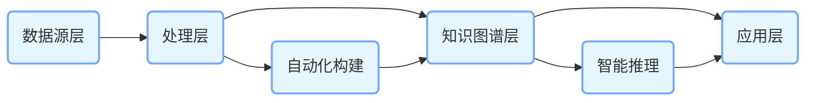

# AI驱动的企业知识图谱：自动化构建与智能推理的深度融合

> 关键词：AI、企业知识图谱、自动化构建、智能推理、深度融合

> 摘要：本文聚焦于AI驱动的企业知识图谱中自动化构建与智能推理的深度融合。首先介绍了相关背景，包括目的范围、预期读者等内容。接着详细阐述了核心概念及联系，给出了原理和架构的文本示意图与Mermaid流程图。深入讲解了核心算法原理，用Python代码进行具体操作步骤的展示。同时给出了相关数学模型和公式并举例说明。通过项目实战，从开发环境搭建到源代码详细实现与解读进行了分析。探讨了实际应用场景，推荐了学习、开发相关的工具和资源。最后总结了未来发展趋势与挑战，提供了常见问题解答和扩展阅读参考资料，旨在帮助读者全面深入理解AI驱动的企业知识图谱及其自动化构建与智能推理的深度融合。

## 1. 背景介绍 
### 1.1 目的和范围
随着企业数字化转型的加速，企业内部积累了海量的数据，这些数据分散在各个系统和部门中，缺乏有效的整合和利用。企业知识图谱作为一种能够有效整合和表示企业知识的技术，能够将企业内外部的各种数据关联起来，形成一个有机的知识网络，为企业提供更智能的决策支持、知识管理和业务创新能力。

本文的目的在于深入探讨如何利用AI技术实现企业知识图谱的自动化构建和智能推理，并将两者深度融合。具体范围包括核心概念的阐述、核心算法原理的分析、实际项目中的代码实现、应用场景的探讨以及相关工具和资源的推荐等。

### 1.2 预期读者
本文的预期读者主要包括企业的技术决策者、数据科学家、AI工程师、知识图谱开发者以及对企业知识图谱和AI技术感兴趣的研究人员。这些读者通常具备一定的编程基础和数据分析能力，希望深入了解如何利用AI技术构建和应用企业知识图谱。

### 1.3 文档结构概述
本文将按照以下结构进行组织：首先介绍相关背景信息，包括目的、预期读者和文档结构概述等。接着详细阐述核心概念与联系，包括核心概念的原理和架构的文本示意图与Mermaid流程图。然后深入讲解核心算法原理，并使用Python源代码详细阐述具体操作步骤。之后给出相关的数学模型和公式，并进行详细讲解和举例说明。通过项目实战，介绍开发环境搭建、源代码详细实现和代码解读。探讨实际应用场景，推荐学习、开发相关的工具和资源。最后总结未来发展趋势与挑战，提供常见问题解答和扩展阅读参考资料。

### 1.4 术语表
#### 1.4.1 核心术语定义
- **企业知识图谱**：是一种以图结构形式表示企业知识的技术，它将企业内外部的各种实体（如人员、产品、事件等）及其之间的关系（如隶属关系、合作关系等）进行建模和存储，形成一个语义网络。
- **自动化构建**：指利用AI技术，如自然语言处理、机器学习等，自动从企业的各种数据源（如文本、数据库等）中提取实体和关系，构建企业知识图谱的过程。
- **智能推理**：基于企业知识图谱中的已有知识，利用推理算法推导出新的知识或结论的过程。

#### 1.4.2 相关概念解释
- **知识表示**：是指将知识以计算机能够理解和处理的形式进行表示，常见的知识表示方法有三元组、本体等。
- **实体识别**：是自然语言处理中的一项任务，旨在从文本中识别出具有特定意义的实体，如人名、地名、组织机构名等。
- **关系抽取**：是指从文本中提取出实体之间的关系，如“张三是李四的上级”中的“上级”关系。

#### 1.4.3 缩略词列表
- **NLP**：Natural Language Processing，自然语言处理
- **ML**：Machine Learning，机器学习
- **RDF**：Resource Description Framework，资源描述框架

## 2. 核心概念与联系 
### 核心概念原理
企业知识图谱的核心是将企业的各种知识以图的形式进行表示，其中节点表示实体，边表示实体之间的关系。自动化构建的原理是利用AI技术对企业的各种数据源进行处理，自动识别出实体和关系，并将其添加到知识图谱中。智能推理则是基于知识图谱的结构和语义信息，利用推理规则和算法，推导出新的知识。

### 架构的文本示意图
```plaintext
+-------------------+           +-------------------+
|    数据源层       |           |    知识图谱层      |
| （文本、数据库等） |           | （实体、关系存储） |
+-------------------+           +-------------------+
        |                                |
        | 自动化构建（NLP、ML）          | 智能推理（规则、算法）
        |                                |
+-------------------+           +-------------------+
|    处理层         |           |    应用层         |
| （实体识别、关系抽取） |           | （决策支持、知识问答） |
+-------------------+           +-------------------+
```

### Mermaid流程图


这个流程图展示了企业知识图谱从数据源层开始，经过处理层的自动化构建形成知识图谱层，知识图谱层一方面直接为应用层提供支持，另一方面通过智能推理为应用层提供更深入的知识服务。

## 3. 核心算法原理 & 具体操作步骤 
### 核心算法原理
#### 实体识别算法 - 基于BiLSTM-CRF模型
BiLSTM（Bidirectional Long Short-Term Memory）是一种循环神经网络，能够处理序列数据，它可以同时考虑输入序列的前向和后向信息。CRF（Conditional Random Field）是一种概率图模型，常用于序列标注任务。在实体识别中，BiLSTM用于提取文本的特征，CRF用于对这些特征进行标注，确定每个词对应的实体标签。

#### 关系抽取算法 - 基于深度学习的方法
可以使用卷积神经网络（CNN）或预训练语言模型（如BERT）来进行关系抽取。这些模型可以学习文本中实体之间的语义信息，从而判断它们之间的关系。

### 具体操作步骤及Python代码实现
#### 实体识别（使用BiLSTM-CRF）
```python
import torch
import torch.nn as nn
from torchcrf import CRF

# 定义BiLSTM-CRF模型
class BiLSTM_CRF(nn.Module):
    def __init__(self, vocab_size, embedding_dim, hidden_dim, num_tags):
        super(BiLSTM_CRF, self).__init__()
        self.embedding = nn.Embedding(vocab_size, embedding_dim)
        self.lstm = nn.LSTM(embedding_dim, hidden_dim // 2,
                            num_layers=1, bidirectional=True)
        self.hidden2tag = nn.Linear(hidden_dim, num_tags)
        self.crf = CRF(num_tags)

    def forward(self, x):
        embedded = self.embedding(x)
        lstm_out, _ = self.lstm(embedded.view(len(x), 1, -1))
        emissions = self.hidden2tag(lstm_out.view(len(x), -1))
        return emissions

    def loss(self, x, tags):
        emissions = self.forward(x)
        return -self.crf(emissions.unsqueeze(0), tags.unsqueeze(0))

# 示例使用
vocab_size = 1000
embedding_dim = 100
hidden_dim = 200
num_tags = 5

model = BiLSTM_CRF(vocab_size, embedding_dim, hidden_dim, num_tags)
input_tensor = torch.randint(0, vocab_size, (10,))
tags = torch.randint(0, num_tags, (10,))

loss = model.loss(input_tensor, tags)
print(f"Loss: {loss.item()}")
```
#### 关系抽取（使用简单的CNN）
```python
import torch
import torch.nn as nn

# 定义CNN关系抽取模型
class CNN_Relation_Extraction(nn.Module):
    def __init__(self, vocab_size, embedding_dim, num_filters, filter_sizes, num_classes):
        super(CNN_Relation_Extraction, self).__init__()
        self.embedding = nn.Embedding(vocab_size, embedding_dim)
        self.convs = nn.ModuleList([
            nn.Conv2d(1, num_filters, (fs, embedding_dim)) for fs in filter_sizes
        ])
        self.fc = nn.Linear(len(filter_sizes) * num_filters, num_classes)

    def forward(self, x):
        embedded = self.embedding(x).unsqueeze(1)
        conved = [nn.functional.relu(conv(embedded)).squeeze(3) for conv in self.convs]
        pooled = [nn.functional.max_pool1d(conv, conv.shape[2]).squeeze(2) for conv in conved]
        cat = torch.cat(pooled, dim=1)
        return self.fc(cat)

# 示例使用
vocab_size = 1000
embedding_dim = 100
num_filters = 100
filter_sizes = [3, 4, 5]
num_classes = 3

model = CNN_Relation_Extraction(vocab_size, embedding_dim, num_filters, filter_sizes, num_classes)
input_tensor = torch.randint(0, vocab_size, (10,))
output = model(input_tensor.unsqueeze(0))
print(f"Output shape: {output.shape}")
```

## 4. 数学模型和公式 & 详细讲解 & 举例说明 
### BiLSTM数学模型
#### 前向LSTM单元
前向LSTM单元的输入门 $i_t$、遗忘门 $f_t$、输出门 $o_t$ 和细胞状态 $\tilde{C}_t$ 的计算公式如下：
$$
\begin{align*}
i_t &= \sigma(W_{ii}x_t + b_{ii} + W_{hi}h_{t-1} + b_{hi}) \\
f_t &= \sigma(W_{if}x_t + b_{if} + W_{hf}h_{t-1} + b_{hf}) \\
o_t &= \sigma(W_{io}x_t + b_{io} + W_{ho}h_{t-1} + b_{ho}) \\
\tilde{C}_t &= \tanh(W_{ic}x_t + b_{ic} + W_{hc}h_{t-1} + b_{hc})
\end{align*}
$$
其中，$x_t$ 是时刻 $t$ 的输入，$h_{t-1}$ 是上一时刻的隐藏状态，$W$ 是权重矩阵，$b$ 是偏置向量，$\sigma$ 是 sigmoid 函数，$\tanh$ 是双曲正切函数。

细胞状态 $C_t$ 和隐藏状态 $h_t$ 的更新公式为：
$$
\begin{align*}
C_t &= f_t \odot C_{t-1} + i_t \odot \tilde{C}_t \\
h_t &= o_t \odot \tanh(C_t)
\end{align*}
$$
其中，$\odot$ 表示逐元素相乘。

#### 后向LSTM单元
后向LSTM单元的计算过程与前向LSTM单元类似，只是输入序列是反向的。最终的隐藏状态是前向和后向隐藏状态的拼接。

### CRF数学模型
CRF的目标是最大化给定输入序列 $x$ 下标签序列 $y$ 的条件概率 $P(y|x)$。CRF的条件概率计算公式为：
$$
P(y|x) = \frac{\exp(\text{Score}(x, y))}{\sum_{y' \in Y(x)} \exp(\text{Score}(x, y'))}
$$
其中，$\text{Score}(x, y)$ 是标签序列 $y$ 在输入序列 $x$ 下的得分，$Y(x)$ 是所有可能的标签序列集合。

得分 $\text{Score}(x, y)$ 的计算公式为：
$$
\text{Score}(x, y) = \sum_{i=1}^{n} A_{y_{i-1}, y_i} + \sum_{i=1}^{n} P_{i, y_i}
$$
其中，$A$ 是转移矩阵，表示从一个标签转移到另一个标签的得分，$P$ 是发射矩阵，表示每个位置的标签得分。

### 举例说明
假设我们有一个简单的输入序列 $x = [x_1, x_2, x_3]$，标签集合 $Y = \{B - PER, I - PER, O\}$（分别表示人名的开始、人名的中间和其他）。我们使用BiLSTM-CRF模型进行实体识别。

首先，BiLSTM会对输入序列进行处理，得到每个位置的特征表示。然后，CRF会根据这些特征和转移矩阵、发射矩阵计算每个可能的标签序列的得分。假设最终计算得到的得分最高的标签序列是 $y = [B - PER, I - PER, O]$，那么我们就可以认为输入序列中前两个词构成一个人名实体。

## 5. 项目实战：代码实际案例和详细解释说明 
### 5.1  开发环境搭建
#### 安装Python
确保你已经安装了Python 3.6及以上版本。可以从Python官方网站（https://www.python.org/downloads/）下载并安装。

#### 安装必要的库
使用以下命令安装必要的库：
```sh
pip install torch torchcrf numpy pandas
```

### 5.2  源代码详细实现和代码解读
#### 数据准备
```python
import numpy as np
import pandas as pd

# 假设我们有一个包含文本和标签的CSV文件
data = pd.read_csv('data.csv')
texts = data['text'].tolist()
tags = data['tags'].tolist()

# 构建词汇表和标签表
vocab = set()
tag_set = set()
for text in texts:
    for word in text.split():
        vocab.add(word)
for tag_list in tags:
    for tag in tag_list.split():
        tag_set.add(tag)

vocab = list(vocab)
tag_set = list(tag_set)

word2idx = {word: idx for idx, word in enumerate(vocab)}
tag2idx = {tag: idx for idx, tag in enumerate(tag_set)}

# 将文本和标签转换为索引序列
texts_idx = []
tags_idx = []
for text, tag_list in zip(texts, tags):
    text_idx = [word2idx[word] for word in text.split()]
    tag_idx = [tag2idx[tag] for tag in tag_list.split()]
    texts_idx.append(text_idx)
    tags_idx.append(tag_idx)
```
这段代码的主要功能是读取包含文本和标签的CSV文件，构建词汇表和标签表，并将文本和标签转换为索引序列，以便后续输入到模型中。

#### 模型训练
```python
from torch.utils.data import Dataset, DataLoader
import torch.optim as optim

# 定义数据集类
class NERDataset(Dataset):
    def __init__(self, texts, tags):
        self.texts = texts
        self.tags = tags

    def __len__(self):
        return len(self.texts)

    def __getitem__(self, idx):
        text = torch.tensor(self.texts[idx])
        tag = torch.tensor(self.tags[idx])
        return text, tag

# 创建数据集和数据加载器
dataset = NERDataset(texts_idx, tags_idx)
dataloader = DataLoader(dataset, batch_size=1, shuffle=True)

# 初始化模型
vocab_size = len(vocab)
embedding_dim = 100
hidden_dim = 200
num_tags = len(tag_set)

model = BiLSTM_CRF(vocab_size, embedding_dim, hidden_dim, num_tags)

# 定义优化器
optimizer = optim.Adam(model.parameters(), lr=0.01)

# 训练模型
num_epochs = 10
for epoch in range(num_epochs):
    total_loss = 0
    for text, tag in dataloader:
        optimizer.zero_grad()
        loss = model.loss(text.squeeze(0), tag.squeeze(0))
        loss.backward()
        optimizer.step()
        total_loss += loss.item()
    print(f'Epoch {epoch + 1}, Loss: {total_loss / len(dataloader)}')
```
这段代码定义了一个自定义的数据集类 `NERDataset`，用于封装文本和标签数据。然后创建了数据加载器，初始化了BiLSTM-CRF模型和优化器。在训练过程中，通过循环迭代数据加载器中的数据，计算损失并进行反向传播和参数更新。

### 5.3  代码解读与分析
#### 数据准备部分
- 读取CSV文件中的文本和标签数据。
- 构建词汇表和标签表，将单词和标签映射到对应的索引。
- 将文本和标签转换为索引序列，方便模型处理。

#### 模型训练部分
- 自定义数据集类 `NERDataset`，继承自 `torch.utils.data.Dataset`，实现了 `__len__` 和 `__getitem__` 方法，用于封装数据。
- 创建数据加载器 `DataLoader`，用于批量加载数据。
- 初始化BiLSTM-CRF模型和优化器。
- 在训练循环中，通过调用模型的 `loss` 方法计算损失，然后进行反向传播和参数更新。

## 6. 实际应用场景 
### 智能客服
企业知识图谱可以为智能客服系统提供丰富的知识支持。当客户提出问题时，智能客服可以利用知识图谱进行智能推理，快速准确地找到答案。例如，客户询问某款产品的售后政策，智能客服可以根据知识图谱中产品与售后政策的关联关系，直接给出准确的答案。

### 决策支持
企业管理者在做出决策时，需要综合考虑各种因素。企业知识图谱可以整合企业的市场数据、销售数据、财务数据等，通过智能推理为管理者提供决策建议。例如，在制定新产品的推广策略时，知识图谱可以分析市场趋势、竞争对手情况等信息，为管理者提供参考。

### 知识管理
企业知识图谱可以将企业内部的各种知识进行整合和组织，方便员工查找和使用。例如，员工可以通过知识图谱快速找到相关的技术文档、业务流程等知识，提高工作效率。

### 风险预警
通过对企业知识图谱中的数据进行分析和推理，可以及时发现潜在的风险。例如，分析供应商与企业的合作关系、供应商的信誉等信息，提前预警供应链风险。

## 7. 工具和资源推荐
### 7.1 学习资源推荐
#### 7.1.1 书籍推荐
- 《知识图谱：方法、实践与应用》：全面介绍了知识图谱的基本概念、技术方法和实际应用案例，是学习知识图谱的经典书籍。
- 《自然语言处理入门》：适合初学者，系统地介绍了自然语言处理的基础知识和常用技术，对于理解知识图谱中的自然语言处理部分有很大帮助。

#### 7.1.2 在线课程
- Coursera上的“Natural Language Processing Specialization”：由顶尖高校的教授授课，涵盖了自然语言处理的各个方面，包括实体识别、关系抽取等。
- edX上的“Knowledge Graphs”：专门介绍知识图谱的构建和应用，课程内容丰富，有很多实际案例。

#### 7.1.3 技术博客和网站
- 博客园：有很多技术博主分享知识图谱和AI相关的技术文章，内容丰富多样。
- 机器之心：专注于人工智能领域的资讯和技术分享，经常发布关于知识图谱的最新研究成果和应用案例。

### 7.2 开发工具框架推荐
#### 7.2.1 IDE和编辑器
- PyCharm：功能强大的Python集成开发环境，提供了代码编辑、调试、版本控制等一系列功能，非常适合开发Python项目。
- Visual Studio Code：轻量级的代码编辑器，支持多种编程语言和插件扩展，对于快速开发和调试知识图谱项目很有帮助。

#### 7.2.2 调试和性能分析工具
- Py-Spy：可以对Python程序进行性能分析，找出程序中的性能瓶颈。
- TensorBoard：用于可视化深度学习模型的训练过程和性能指标，方便调试和优化模型。

#### 7.2.3 相关框架和库
- RDFLib：用于处理RDF数据的Python库，支持RDF数据的解析、存储和查询。
- Neo4j：流行的图数据库，提供了强大的图数据存储和查询功能，非常适合存储和管理企业知识图谱。

### 7.3 相关论文著作推荐
#### 7.3.1 经典论文
- “Entity Linking with a Knowledge Base: Issues, Techniques, and Solutions”：介绍了实体链接的相关技术和方法，是实体链接领域的经典论文。
- “Semantic Web for the Working Ontologist: Effective Modeling in RDFS and OWL”：详细介绍了语义网和本体的相关知识，对于理解知识图谱的语义表示有很大帮助。

#### 7.3.2 最新研究成果
- 关注ACL（Association for Computational Linguistics）、AAAI（Association for the Advancement of Artificial Intelligence）等顶级学术会议的论文，这些会议经常发表关于知识图谱和自然语言处理的最新研究成果。

#### 7.3.3 应用案例分析
- 一些知名企业（如Google、Microsoft等）会发布关于知识图谱在实际业务中应用的案例分析报告，可以从这些报告中学习到知识图谱的实际应用经验。

## 8. 总结：未来发展趋势与挑战
### 未来发展趋势
#### 与多模态数据的融合
未来的企业知识图谱将不仅仅局限于文本数据，还会融合图像、音频、视频等多模态数据。例如，在产品知识图谱中，可以将产品的图片、视频介绍等信息与文本描述关联起来，提供更丰富的知识表示。

#### 强化学习在智能推理中的应用
强化学习可以让知识图谱的智能推理更加灵活和自适应。通过与环境进行交互，不断学习最优的推理策略，提高推理的准确性和效率。

#### 联邦学习与知识图谱的结合
联邦学习可以在保护数据隐私的前提下，实现多个企业之间的知识图谱共享和协同构建。这将促进企业之间的合作和知识交流，推动行业的发展。

### 挑战
#### 数据质量和一致性问题
企业内部的数据来源广泛，数据质量参差不齐，存在数据重复、错误、不一致等问题。这些问题会影响知识图谱的构建和推理的准确性，需要投入大量的精力进行数据清洗和预处理。

#### 计算资源和效率问题
构建和维护大规模的企业知识图谱需要大量的计算资源，特别是在进行复杂的推理和分析时，计算效率会成为一个瓶颈。需要研究更高效的算法和技术，提高计算效率。

#### 知识图谱的可解释性问题
随着知识图谱的规模和复杂度不断增加，其推理结果的可解释性变得越来越重要。用户需要了解推理结果是如何得出的，以便更好地信任和使用知识图谱。因此，需要研究如何提高知识图谱的可解释性。

## 9. 附录：常见问题与解答
### 问题1：企业知识图谱和传统数据库有什么区别？
解答：传统数据库主要以表格形式存储数据，数据之间的关系相对固定，查询和分析主要基于结构化查询语言（SQL）。而企业知识图谱以图结构形式存储数据，能够更自然地表示实体之间的复杂关系，支持语义查询和智能推理，更适合处理复杂的知识管理和决策支持任务。

### 问题2：自动化构建企业知识图谱的准确率如何保证？
解答：可以通过以下方法提高自动化构建的准确率：
- 使用高质量的训练数据进行模型训练，确保模型学习到准确的特征和规律。
- 采用多种实体识别和关系抽取算法进行融合，综合利用不同算法的优势。
- 引入人工审核和修正机制，对自动化构建的结果进行人工检查和修正。

### 问题3：智能推理的结果可靠吗？
解答：智能推理的结果可靠性取决于多个因素，如知识图谱的质量、推理算法的合理性等。为了提高推理结果的可靠性，可以：
- 不断完善知识图谱，确保其包含准确和完整的知识。
- 选择合适的推理算法，并对算法进行优化和验证。
- 对推理结果进行评估和验证，结合实际情况进行判断和决策。

## 10. 扩展阅读 & 参考资料
### 扩展阅读
- 《人工智能：现代方法》：全面介绍了人工智能的基本概念、技术和应用，对于深入理解AI在企业知识图谱中的应用有很大帮助。
- 《图数据库实战》：详细介绍了图数据库的原理、使用方法和应用案例，对于掌握企业知识图谱的存储和管理有很大帮助。

### 参考资料
- 相关学术论文：可以从IEEE Xplore、ACM Digital Library等学术数据库中查找关于知识图谱、自然语言处理、智能推理等方面的论文。
- 开源项目：如OpenKE、GraphEmbedding等开源项目，提供了知识图谱构建和推理的相关代码和工具，可以参考学习。

作者：AI天才研究院/AI Genius Institute & 禅与计算机程序设计艺术 /Zen And The Art of Computer Programming