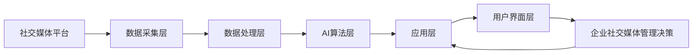

# AI驱动的企业社交媒体管理：策略与实践

> 关键词：AI、企业社交媒体管理、策略、实践、自动化、数据分析

> 摘要：本文围绕AI驱动的企业社交媒体管理展开，深入探讨其策略与实践。首先介绍了相关背景，包括目的、预期读者、文档结构和术语表。接着阐述了核心概念及联系，通过文本示意图和Mermaid流程图进行说明。详细讲解了核心算法原理，并结合Python代码给出具体操作步骤。同时，给出了数学模型和公式，并举例说明。在项目实战部分，进行了开发环境搭建，对源代码详细实现并解读。还分析了实际应用场景，推荐了学习资源、开发工具框架和相关论文著作。最后总结了未来发展趋势与挑战，提供了常见问题解答和扩展阅读参考资料，旨在为企业在AI时代的社交媒体管理提供全面且实用的指导。

## 1. 背景介绍 
### 1.1 目的和范围
在当今数字化时代，社交媒体已成为企业推广品牌、与客户互动和拓展业务的重要渠道。随着社交媒体平台的不断发展和用户数量的激增，企业面临着管理海量信息、制定有效营销策略以及提高用户参与度等诸多挑战。本文章的目的在于探讨如何利用人工智能（AI）技术来优化企业的社交媒体管理，提高管理效率和效果。

本文的范围涵盖了AI在企业社交媒体管理中的各个方面，包括但不限于内容创作、发布计划、用户互动、数据分析和精准营销等。通过深入研究AI技术在这些领域的应用，为企业提供实用的策略和实践建议。

### 1.2 预期读者
本文的预期读者主要包括企业的社交媒体管理人员、市场营销人员、品牌推广人员以及对AI技术在社交媒体管理中应用感兴趣的技术爱好者。这些读者希望通过了解AI技术在社交媒体管理中的应用，提升企业的社交媒体运营能力，实现更好的业务发展。

### 1.3 文档结构概述
本文将按照以下结构进行组织：
- 核心概念与联系：介绍AI驱动的企业社交媒体管理的核心概念，并通过文本示意图和Mermaid流程图展示其架构。
- 核心算法原理 & 具体操作步骤：详细讲解AI在社交媒体管理中应用的核心算法原理，并结合Python代码给出具体操作步骤。
- 数学模型和公式 & 详细讲解 & 举例说明：介绍相关的数学模型和公式，并通过具体例子进行说明。
- 项目实战：代码实际案例和详细解释说明：通过一个实际项目案例，展示如何使用AI技术进行企业社交媒体管理，并对代码进行详细解读。
- 实际应用场景：分析AI在企业社交媒体管理中的实际应用场景。
- 工具和资源推荐：推荐学习资源、开发工具框架和相关论文著作。
- 总结：未来发展趋势与挑战：总结AI驱动的企业社交媒体管理的未来发展趋势和面临的挑战。
- 附录：常见问题与解答：提供常见问题的解答。
- 扩展阅读 & 参考资料：提供扩展阅读的建议和参考资料。

### 1.4 术语表
#### 1.4.1 核心术语定义
- **人工智能（AI）**：指计算机系统能够执行通常需要人类智能才能完成的任务，如学习、推理、解决问题等。
- **企业社交媒体管理**：指企业通过社交媒体平台进行品牌推广、客户互动、市场调研等活动的管理过程。
- **自然语言处理（NLP）**：AI的一个分支，主要研究如何让计算机理解和处理人类语言。
- **机器学习（ML）**：AI的一个子领域，通过让计算机从数据中学习模式和规律，从而实现预测和决策。
- **深度学习（DL）**：一种基于神经网络的机器学习方法，能够处理复杂的模式和数据。

#### 1.4.2 相关概念解释
- **社交媒体平台**：指提供社交互动功能的网络平台，如Facebook、Twitter、Instagram、微信等。
- **内容创作**：指在社交媒体平台上创建和发布有价值的内容，如文章、图片、视频等。
- **用户互动**：指企业与社交媒体平台上的用户进行交流和互动，如回复评论、点赞、分享等。
- **数据分析**：指对社交媒体平台上的数据进行收集、整理、分析和挖掘，以了解用户行为和市场趋势。
- **精准营销**：指根据用户的兴趣、偏好和行为等信息，向用户推送个性化的营销信息。

#### 1.4.3 缩略词列表
- **AI**：Artificial Intelligence（人工智能）
- **NLP**：Natural Language Processing（自然语言处理）
- **ML**：Machine Learning（机器学习）
- **DL**：Deep Learning（深度学习）

## 2. 核心概念与联系 
### 核心概念原理
AI驱动的企业社交媒体管理主要基于以下几个核心概念：
- **自动化**：通过AI技术实现社交媒体管理的自动化，如自动发布内容、自动回复评论、自动进行数据分析等，提高管理效率。
- **个性化**：利用AI技术分析用户的兴趣、偏好和行为等信息，为用户提供个性化的内容和服务，提高用户参与度。
- **预测分析**：通过AI技术对社交媒体数据进行分析和挖掘，预测用户行为和市场趋势，为企业决策提供支持。
- **情感分析**：利用NLP技术对用户在社交媒体上的言论进行情感分析，了解用户对企业品牌和产品的态度和评价。

### 架构的文本示意图
AI驱动的企业社交媒体管理架构主要包括以下几个部分：
- **数据采集层**：负责从社交媒体平台上采集数据，包括用户信息、内容信息、互动信息等。
- **数据处理层**：对采集到的数据进行清洗、转换和存储，为后续的分析和应用提供基础。
- **AI算法层**：包括自然语言处理、机器学习、深度学习等算法，用于对数据进行分析和挖掘，实现自动化、个性化、预测分析和情感分析等功能。
- **应用层**：将AI算法层的结果应用到企业社交媒体管理的各个环节，如内容创作、发布计划、用户互动、精准营销等。
- **用户界面层**：为企业社交媒体管理人员提供一个直观、便捷的操作界面，方便他们进行管理和决策。

### Mermaid流程图


## 3. 核心算法原理 & 具体操作步骤 
### 核心算法原理
#### 自然语言处理（NLP）
NLP是AI在社交媒体管理中应用的重要算法之一，主要用于处理和分析用户在社交媒体上的文本信息。常见的NLP任务包括文本分类、情感分析、命名实体识别等。

文本分类是将文本划分为不同的类别，如正面评价、负面评价、中性评价等。情感分析是分析文本中表达的情感倾向，如积极、消极、中立等。命名实体识别是识别文本中提到的人名、地名、组织机构名等实体。

#### 机器学习（ML）
ML是AI的一个子领域，通过让计算机从数据中学习模式和规律，从而实现预测和决策。在社交媒体管理中，ML可以用于预测用户行为、推荐内容、进行精准营销等。

常见的ML算法包括决策树、支持向量机、神经网络等。决策树是一种基于树结构进行决策的算法，支持向量机是一种用于分类和回归分析的算法，神经网络是一种模仿人类神经系统的算法。

#### 深度学习（DL）
DL是一种基于神经网络的机器学习方法，能够处理复杂的模式和数据。在社交媒体管理中，DL可以用于图像识别、视频分析、语音识别等。

常见的DL模型包括卷积神经网络（CNN）、循环神经网络（RNN）、长短时记忆网络（LSTM）等。CNN主要用于处理图像数据，RNN主要用于处理序列数据，LSTM是RNN的一种改进模型，能够处理长序列数据。

### 具体操作步骤（以Python为例）
#### 安装必要的库
```python
pip install numpy pandas scikit-learn tensorflow nltk
```

#### 数据采集
```python
import tweepy

# 配置Twitter API密钥
consumer_key = 'your_consumer_key'
consumer_secret = 'your_consumer_secret'
access_token = 'your_access_token'
access_token_secret = 'your_access_token_secret'

# 认证
auth = tweepy.OAuthHandler(consumer_key, consumer_secret)
auth.set_access_token(access_token, access_token_secret)

# 创建API对象
api = tweepy.API(auth)

# 搜索推文
tweets = api.search(q='python', count=100)

# 保存推文文本
tweet_texts = [tweet.text for tweet in tweets]
```

#### 数据预处理
```python
import nltk
from nltk.corpus import stopwords
from nltk.stem import PorterStemmer
import re

nltk.download('stopwords')

# 定义预处理函数
def preprocess_text(text):
    # 转换为小写
    text = text.lower()
    # 去除特殊字符和数字
    text = re.sub('[^a-zA-Z]', ' ', text)
    # 分词
    words = text.split()
    # 去除停用词
    stop_words = set(stopwords.words('english'))
    words = [word for word in words if word not in stop_words]
    # 词干提取
    stemmer = PorterStemmer()
    words = [stemmer.stem(word) for word in words]
    # 合并单词
    text = ' '.join(words)
    return text

# 预处理推文文本
preprocessed_tweets = [preprocess_text(tweet) for tweet in tweet_texts]
```

#### 文本分类（使用朴素贝叶斯分类器）
```python
from sklearn.feature_extraction.text import CountVectorizer
from sklearn.naive_bayes import MultinomialNB
from sklearn.model_selection import train_test_split
from sklearn.metrics import accuracy_score

# 特征提取
vectorizer = CountVectorizer()
X = vectorizer.fit_transform(preprocessed_tweets)

# 假设我们有一些标签数据
labels = [0, 1, 0, 1, 0, 1, 0, 1, 0, 1]  # 示例标签
y = labels

# 划分训练集和测试集
X_train, X_test, y_train, y_test = train_test_split(X, y, test_size=0.2, random_state=42)

# 训练模型
model = MultinomialNB()
model.fit(X_train, y_train)

# 预测
y_pred = model.predict(X_test)

# 计算准确率
accuracy = accuracy_score(y_test, y_pred)
print(f'Accuracy: {accuracy}')
```

## 4. 数学模型和公式 & 详细讲解 & 举例说明 
### 朴素贝叶斯分类器的数学模型和公式
朴素贝叶斯分类器是一种基于贝叶斯定理的分类算法，其基本思想是通过计算样本属于各个类别的概率，将样本分类到概率最大的类别中。

贝叶斯定理的公式为：
$$P(C|X)=\frac{P(X|C)P(C)}{P(X)}$$
其中，$P(C|X)$ 表示在给定特征 $X$ 的情况下，样本属于类别 $C$ 的概率；$P(X|C)$ 表示在类别 $C$ 的情况下，特征 $X$ 出现的概率；$P(C)$ 表示类别 $C$ 出现的先验概率；$P(X)$ 表示特征 $X$ 出现的概率。

在朴素贝叶斯分类器中，假设特征之间是相互独立的，即：
$$P(X|C)=\prod_{i=1}^{n}P(x_i|C)$$
其中，$x_i$ 表示第 $i$ 个特征。

因此，朴素贝叶斯分类器的分类规则为：
$$\hat{C}=\arg\max_{C}P(C|X)=\arg\max_{C}\frac{P(X|C)P(C)}{P(X)}=\arg\max_{C}P(X|C)P(C)$$

### 详细讲解
- **先验概率 $P(C)$**：表示类别 $C$ 在训练数据中出现的概率。可以通过计算训练数据中属于类别 $C$ 的样本数占总样本数的比例来估计。
- **条件概率 $P(x_i|C)$**：表示在类别 $C$ 的情况下，特征 $x_i$ 出现的概率。可以通过计算训练数据中属于类别 $C$ 且特征 $x_i$ 出现的样本数占属于类别 $C$ 的样本数的比例来估计。
- **预测**：对于一个新的样本 $X$，计算其属于各个类别的概率 $P(C|X)$，并将其分类到概率最大的类别中。

### 举例说明
假设我们有一个文本分类任务，要将文本分为“体育”和“科技”两类。训练数据如下：

| 文本 | 类别 |
| ---- | ---- |
| 篮球比赛很精彩 | 体育 |
| 智能手机功能强大 | 科技 |
| 足球比赛很激烈 | 体育 |
| 电脑性能很出色 | 科技 |

我们要对新的文本“乒乓球比赛很有趣”进行分类。

#### 计算先验概率
- $P(体育)=\frac{2}{4}=0.5$
- $P(科技)=\frac{2}{4}=0.5$

#### 计算条件概率
假设我们使用词袋模型，将文本中的每个单词作为一个特征。对于“乒乓球比赛很有趣”，其特征为“乒乓球”、“比赛”、“有趣”。

- $P(乒乓球|体育)=\frac{0}{2}=0$（由于训练数据中没有出现“乒乓球”，为了避免概率为 0 的情况，通常会使用拉普拉斯平滑）
- $P(乒乓球|科技)=\frac{0}{2}=0$
- $P(比赛|体育)=\frac{2}{2}=1$
- $P(比赛|科技)=\frac{0}{2}=0$
- $P(有趣|体育)=\frac{0}{2}=0$
- $P(有趣|科技)=\frac{0}{2}=0$

使用拉普拉斯平滑后，假设词汇表的大小为 $V$，每个类别的样本数为 $N_c$，特征 $x_i$ 在类别 $C$ 中出现的次数为 $N_{x_i,C}$，则条件概率的计算公式为：
$$P(x_i|C)=\frac{N_{x_i,C}+1}{N_c+V}$$

假设词汇表为“篮球”、“比赛”、“精彩”、“智能手机”、“功能强大”、“足球”、“激烈”、“电脑”、“性能出色”、“乒乓球”、“有趣”，$V = 11$。

- $P(乒乓球|体育)=\frac{0 + 1}{2 + 11}=\frac{1}{13}$
- $P(乒乓球|科技)=\frac{0 + 1}{2 + 11}=\frac{1}{13}$
- $P(比赛|体育)=\frac{2 + 1}{2 + 11}=\frac{3}{13}$
- $P(比赛|科技)=\frac{0 + 1}{2 + 11}=\frac{1}{13}$
- $P(有趣|体育)=\frac{0 + 1}{2 + 11}=\frac{1}{13}$
- $P(有趣|科技)=\frac{0 + 1}{2 + 11}=\frac{1}{13}$

#### 计算后验概率
- $P(体育|乒乓球比赛很有趣)=P(乒乓球|体育)P(比赛|体育)P(有趣|体育)P(体育)=\frac{1}{13}\times\frac{3}{13}\times\frac{1}{13}\times0.5\approx0.001$
- $P(科技|乒乓球比赛很有趣)=P(乒乓球|科技)P(比赛|科技)P(有趣|科技)P(科技)=\frac{1}{13}\times\frac{1}{13}\times\frac{1}{13}\times0.5\approx0.0003$

由于 $P(体育|乒乓球比赛很有趣)>P(科技|乒乓球比赛很有趣)$，因此将文本“乒乓球比赛很有趣”分类为“体育”。

## 5. 项目实战：代码实际案例和详细解释说明 
### 5.1  开发环境搭建
#### 操作系统
可以选择Windows、Linux或macOS操作系统。

#### 编程语言
使用Python作为开发语言，建议使用Python 3.6及以上版本。

#### 开发工具
可以使用以下开发工具：
- **PyCharm**：一款功能强大的Python集成开发环境（IDE）。
- **Jupyter Notebook**：一个交互式的开发环境，适合进行数据分析和模型训练。

#### 安装必要的库
在命令行中执行以下命令安装必要的库：
```python
pip install numpy pandas scikit-learn tensorflow nltk tweepy
```

### 5.2  源代码详细实现和代码解读
#### 项目需求
我们要开发一个基于AI的企业社交媒体管理系统，实现以下功能：
- 从Twitter上采集与企业相关的推文。
- 对推文进行情感分析，判断其是正面、负面还是中性。
- 根据情感分析结果，自动回复推文。

#### 源代码实现
```python
import tweepy
import nltk
from nltk.sentiment.vader import SentimentIntensityAnalyzer
import re

# 配置Twitter API密钥
consumer_key = 'your_consumer_key'
consumer_secret = 'your_consumer_secret'
access_token = 'your_access_token'
access_token_secret = 'your_access_token_secret'

# 认证
auth = tweepy.OAuthHandler(consumer_key, consumer_secret)
auth.set_access_token(access_token, access_token_secret)

# 创建API对象
api = tweepy.API(auth)

# 下载VADER词典
nltk.download('vader_lexicon')

# 创建情感分析器
sia = SentimentIntensityAnalyzer()

# 定义关键词
keyword = 'your_company_name'

# 搜索推文
tweets = api.search(q=keyword, count=100)

# 处理推文
for tweet in tweets:
    tweet_text = tweet.text
    # 去除链接和特殊字符
    tweet_text = re.sub(r'http\S+', '', tweet_text)
    tweet_text = re.sub('[^a-zA-Z0-9\s]', '', tweet_text)
    
    # 进行情感分析
    sentiment_scores = sia.polarity_scores(tweet_text)
    compound_score = sentiment_scores['compound']
    
    # 判断情感极性
    if compound_score >= 0.05:
        sentiment = 'Positive'
        reply_text = 'Thank you for your positive feedback!'
    elif compound_score <= -0.05:
        sentiment = 'Negative'
        reply_text = 'We apologize for the inconvenience. Please contact us for further assistance.'
    else:
        sentiment = 'Neutral'
        reply_text = 'Thank you for your mention!'
    
    # 回复推文
    try:
        api.update_status(status=reply_text, in_reply_to_status_id=tweet.id)
        print(f'Replied to tweet: {tweet.id} with sentiment: {sentiment}')
    except tweepy.TweepError as e:
        print(f'Error replying to tweet: {tweet.id}, Error: {e}')
```

#### 代码解读
- **配置Twitter API密钥**：在代码中填写自己的Twitter API密钥，用于认证和访问Twitter API。
- **认证和创建API对象**：使用`tweepy.OAuthHandler`进行认证，然后创建`tweepy.API`对象，用于与Twitter API进行交互。
- **下载VADER词典**：使用`nltk.download('vader_lexicon')`下载VADER词典，用于情感分析。
- **创建情感分析器**：使用`SentimentIntensityAnalyzer`创建情感分析器。
- **搜索推文**：使用`api.search`方法搜索与关键词相关的推文。
- **处理推文**：对每条推文进行预处理，去除链接和特殊字符，然后使用情感分析器进行情感分析。
- **判断情感极性**：根据情感分析的结果，判断推文的情感极性是正面、负面还是中性。
- **回复推文**：根据情感极性，生成相应的回复文本，并使用`api.update_status`方法回复推文。

### 5.3  代码解读与分析
#### 优点
- **简单易用**：代码使用了Python和常见的库，易于理解和实现。
- **实时性**：可以实时从Twitter上采集推文，并进行情感分析和回复。
- **可扩展性**：可以根据需要扩展功能，如增加更多的社交媒体平台支持、优化情感分析算法等。

#### 缺点
- **准确性有限**：VADER情感分析器的准确性可能受到语言表达、文化背景等因素的影响。
- **API限制**：Twitter API有调用频率限制，可能会影响系统的实时性和处理能力。

#### 改进建议
- **使用更复杂的情感分析模型**：如深度学习模型，提高情感分析的准确性。
- **优化API调用策略**：合理安排API调用时间，避免超过调用频率限制。

## 6. 实际应用场景 
### 品牌推广
AI可以帮助企业在社交媒体上进行更精准的品牌推广。通过分析用户的兴趣、偏好和行为等信息，AI可以为用户推荐个性化的品牌内容，提高品牌曝光度和用户参与度。例如，企业可以使用AI算法分析用户在社交媒体上的互动数据，了解用户对不同类型内容的喜好，然后根据这些信息制作和发布更有针对性的品牌内容。

### 客户服务
AI可以实现社交媒体上的自动化客户服务。通过自然语言处理技术，AI可以理解用户的问题和需求，并自动回复用户的咨询和投诉。例如，企业可以使用聊天机器人在社交媒体上与用户进行实时沟通，解答用户的问题，处理用户的投诉，提高客户服务效率和质量。

### 市场调研
AI可以帮助企业进行社交媒体上的市场调研。通过分析用户在社交媒体上的言论和行为，AI可以了解用户对企业品牌和产品的态度和评价，以及市场趋势和竞争对手的情况。例如，企业可以使用情感分析技术分析用户在社交媒体上对企业产品的评价，了解用户的满意度和需求，为产品改进和市场策略调整提供依据。

### 危机公关
AI可以帮助企业在社交媒体上进行危机公关。通过实时监测社交媒体上的舆情信息，AI可以及时发现企业面临的危机和负面舆情，并自动发出预警。例如，企业可以使用舆情监测系统实时监测社交媒体上与企业相关的关键词，一旦发现负面舆情，系统可以及时通知企业公关部门，并提供相应的应对建议。

## 7. 工具和资源推荐
### 7.1 学习资源推荐
#### 7.1.1 书籍推荐
- 《Python自然语言处理》：介绍了Python在自然语言处理中的应用，包括文本分类、情感分析、命名实体识别等。
- 《机器学习实战》：通过实际案例介绍了机器学习的基本算法和应用，适合初学者。
- 《深度学习》：由深度学习领域的三位专家撰写，全面介绍了深度学习的理论和实践。

#### 7.1.2 在线课程
- Coursera上的“机器学习”课程：由斯坦福大学教授Andrew Ng讲授，是机器学习领域的经典课程。
- edX上的“人工智能基础”课程：介绍了人工智能的基本概念、算法和应用。
- Udemy上的“Python数据分析实战”课程：通过实际案例介绍了Python在数据分析中的应用。

#### 7.1.3 技术博客和网站
- Medium：一个技术博客平台，上面有很多关于AI和社交媒体管理的文章。
- Towards Data Science：专注于数据科学和机器学习领域的技术博客。
- Kaggle：一个数据科学竞赛平台，上面有很多关于AI和数据分析的开源项目和教程。

### 7.2 开发工具框架推荐
#### 7.2.1 IDE和编辑器
- PyCharm：一款功能强大的Python集成开发环境，适合专业开发者。
- Jupyter Notebook：一个交互式的开发环境，适合进行数据分析和模型训练。
- Visual Studio Code：一款轻量级的代码编辑器，支持多种编程语言和插件。

#### 7.2.2 调试和性能分析工具
- Py-Spy：一个Python性能分析工具，可以帮助开发者找出代码中的性能瓶颈。
- TensorBoard：TensorFlow的可视化工具，可以帮助开发者可视化模型训练过程和结果。
- PDB：Python的调试器，可以帮助开发者调试代码。

#### 7.2.3 相关框架和库
- TensorFlow：一个开源的深度学习框架，由Google开发，广泛应用于图像识别、语音识别、自然语言处理等领域。
- PyTorch：一个开源的深度学习框架，由Facebook开发，具有动态图和易于使用的特点。
- Scikit-learn：一个开源的机器学习库，提供了丰富的机器学习算法和工具。
- NLTK：一个开源的自然语言处理库，提供了丰富的自然语言处理工具和数据集。

### 7.3 相关论文著作推荐
#### 7.3.1 经典论文
- 《A Sentimental Education: Sentiment Analysis Using Subjectivity Summarization Based on Minimum Cuts》：介绍了一种基于最小割的情感分析方法。
- 《Deep Residual Learning for Image Recognition》：提出了残差网络（ResNet），在图像识别领域取得了很好的效果。
- 《Attention Is All You Need》：提出了Transformer模型，在自然语言处理领域取得了巨大的成功。

#### 7.3.2 最新研究成果
- 可以关注顶级学术会议如NeurIPS、ICML、ACL等的论文，了解AI在社交媒体管理领域的最新研究成果。

#### 7.3.3 应用案例分析
- 可以参考一些企业的官方博客和案例分享，了解AI在企业社交媒体管理中的实际应用案例和经验。

## 8. 总结：未来发展趋势与挑战
### 未来发展趋势
#### 更智能化的自动化管理
未来，AI将在企业社交媒体管理中实现更智能化的自动化管理。例如，自动生成高质量的内容、自动制定发布计划、自动进行用户互动等，进一步提高管理效率和效果。

#### 多模态数据分析
随着社交媒体平台上多媒体内容的增加，未来的AI将能够处理和分析多模态数据，如图像、视频、音频等。通过对多模态数据的分析，企业可以更全面地了解用户的需求和行为。

#### 个性化推荐的深化
未来，AI将能够根据用户的实时行为和情境，提供更个性化的推荐内容和服务。例如，在用户不同的时间段、不同的场景下，推荐不同的品牌内容和产品。

#### 与其他技术的融合
AI将与区块链、物联网等其他技术进行融合，为企业社交媒体管理带来更多的创新应用。例如，使用区块链技术确保数据的安全性和真实性，使用物联网技术实现更精准的用户定位和互动。

### 面临的挑战
#### 数据隐私和安全问题
在使用AI进行企业社交媒体管理时，需要处理大量的用户数据，这涉及到数据隐私和安全问题。企业需要采取有效的措施保护用户数据的安全，遵守相关的法律法规。

#### 算法偏见和公平性问题
AI算法可能存在偏见和不公平性，导致对某些用户群体的歧视。企业需要对AI算法进行评估和优化，确保算法的公平性和公正性。

#### 技术复杂性和人才短缺
AI技术具有较高的复杂性，企业需要具备专业的技术人才来进行开发和应用。目前，AI领域的人才短缺问题比较严重，企业需要加大人才培养和引进的力度。

#### 社交媒体平台政策变化
社交媒体平台的政策和规则可能会随时发生变化，这可能会影响企业的社交媒体管理策略和AI应用。企业需要及时关注平台政策的变化，调整自己的管理策略。

## 9. 附录：常见问题与解答
### 1. AI在企业社交媒体管理中的应用是否会取代人工？
不会。虽然AI可以实现自动化管理和数据分析等功能，但人工在企业社交媒体管理中仍然具有重要的作用。例如，人工可以进行创意内容的创作、与用户进行深度的情感沟通等。AI和人工应该相互配合，共同提高企业社交媒体管理的效率和效果。

### 2. 如何选择适合企业的AI工具和技术？
选择适合企业的AI工具和技术需要考虑以下几个因素：
- **企业需求**：根据企业的具体需求，选择能够满足需求的AI工具和技术。
- **技术能力**：考虑企业自身的技术能力和团队水平，选择易于使用和实现的AI工具和技术。
- **成本效益**：评估AI工具和技术的成本和效益，选择性价比高的方案。
- **数据质量**：确保企业拥有足够的高质量数据，以支持AI工具和技术的应用。

### 3. AI在企业社交媒体管理中的应用是否需要大量的数据？
是的。AI算法通常需要大量的数据来进行训练和优化，以提高模型的准确性和性能。因此，企业需要收集和整理足够的社交媒体数据，包括用户信息、内容信息、互动信息等。同时，企业还需要对数据进行清洗和预处理，以提高数据的质量。

### 4. 如何评估AI在企业社交媒体管理中的效果？
可以从以下几个方面评估AI在企业社交媒体管理中的效果：
- **指标评估**：使用一些关键指标，如粉丝增长数、内容曝光量、用户互动率、转化率等，来评估AI应用对企业社交媒体运营的影响。
- **用户反馈**：收集用户的反馈和评价，了解用户对AI应用的满意度和接受程度。
- **成本效益分析**：分析AI应用的成本和效益，评估其对企业业务的贡献。

## 10. 扩展阅读 & 参考资料
### 扩展阅读
- 《社交网络营销实战》：介绍了社交网络营销的策略和方法，对企业社交媒体管理有一定的参考价值。
- 《大数据时代》：探讨了大数据在各个领域的应用和影响，有助于了解数据在企业社交媒体管理中的重要性。
- 《AI未来简史》：对AI的未来发展进行了展望，引发对AI在企业社交媒体管理中应用的思考。

### 参考资料
- Twitter API官方文档：https://developer.twitter.com/en/docs
- TensorFlow官方文档：https://www.tensorflow.org/api_docs
- Scikit-learn官方文档：https://scikit-learn.org/stable/documentation.html
- NLTK官方文档：https://www.nltk.org/

作者：AI天才研究院/AI Genius Institute & 禅与计算机程序设计艺术 /Zen And The Art of Computer Programming