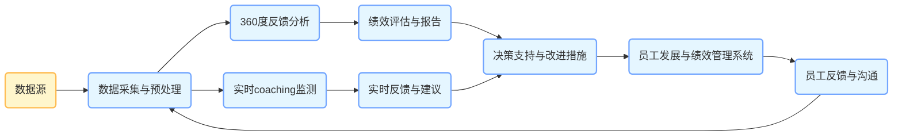

# AI驱动的企业绩效管理：360度反馈与实时coaching的智能化

> 关键词：AI、企业绩效管理、360度反馈、实时coaching、智能化

> 摘要：本文深入探讨了AI驱动下企业绩效管理中360度反馈与实时coaching智能化的相关内容。首先介绍了研究的背景和目的，明确预期读者和文档结构。接着阐述了核心概念及其联系，包括360度反馈、实时coaching和AI在其中的作用，并给出了相应的原理和架构示意图。详细讲解了核心算法原理，用Python代码进行示例说明，同时给出了相关的数学模型和公式。通过项目实战，展示了代码的实际案例和详细解读。分析了实际应用场景，推荐了相关的工具和资源，包括学习资源、开发工具框架和论文著作。最后总结了未来发展趋势与挑战，提供了常见问题解答和扩展阅读参考资料，旨在为企业在AI时代提升绩效管理水平提供全面的技术指导和理论支持。

## 1. 背景介绍 
### 1.1 目的和范围
在当今竞争激烈的商业环境中，企业需要不断提升自身的绩效管理水平，以提高员工的工作效率和企业的整体竞争力。传统的企业绩效管理方式存在反馈不及时、主观性强、缺乏个性化等问题，难以满足现代企业的发展需求。AI技术的快速发展为企业绩效管理带来了新的机遇，通过AI驱动的360度反馈与实时coaching智能化，可以实现更加客观、准确、及时的绩效管理。

本文的目的是深入探讨AI在企业绩效管理中的应用，特别是360度反馈与实时coaching的智能化实现。具体范围包括核心概念的解释、核心算法原理的阐述、数学模型的建立、项目实战案例的分析、实际应用场景的探讨以及相关工具和资源的推荐等。

### 1.2 预期读者
本文的预期读者包括企业的人力资源管理者、绩效管理专家、IT技术人员、对AI在企业管理中应用感兴趣的研究人员以及相关专业的学生等。人力资源管理者可以从本文中了解如何利用AI技术提升企业的绩效管理水平；IT技术人员可以获取相关的技术实现思路和代码示例；研究人员和学生可以将本文作为参考资料，深入研究AI在企业管理领域的应用。

### 1.3 文档结构概述
本文共分为十个部分。第一部分为背景介绍，阐述了研究的目的、范围、预期读者和文档结构；第二部分介绍了核心概念与联系，包括360度反馈、实时coaching和AI的相关原理和架构；第三部分详细讲解了核心算法原理，并给出了Python代码示例；第四部分建立了相关的数学模型和公式，并进行了详细讲解和举例说明；第五部分通过项目实战，展示了代码的实际应用和详细解读；第六部分分析了实际应用场景；第七部分推荐了相关的工具和资源；第八部分总结了未来发展趋势与挑战；第九部分为附录，提供了常见问题与解答；第十部分给出了扩展阅读和参考资料。

### 1.4 术语表
#### 1.4.1 核心术语定义
- **企业绩效管理（Enterprise Performance Management，EPM）**：是指企业通过设定目标、监控绩效、提供反馈和激励等手段，对员工和组织的绩效进行管理和提升的过程。
- **360度反馈（360-degree feedback）**：也称为全方位反馈，是一种从多个角度（如上级、同事、下属、客户等）收集员工绩效信息的方法，以全面、客观地评估员工的工作表现。
- **实时coaching（Real-time coaching）**：是指在员工工作过程中，及时提供针对性的指导和建议，帮助员工解决问题、提升技能和绩效的过程。
- **AI（Artificial Intelligence，人工智能）**：是指计算机系统能够执行通常需要人类智能才能完成的任务，如学习、推理、解决问题等。

#### 1.4.2 相关概念解释
- **机器学习（Machine Learning）**：是AI的一个重要分支，它让计算机通过数据和经验自动学习和改进，而无需明确的编程指令。在企业绩效管理中，机器学习可以用于分析大量的绩效数据，预测员工的绩效表现，提供个性化的反馈和建议。
- **自然语言处理（Natural Language Processing，NLP）**：是AI的另一个重要领域，它涉及计算机对人类语言的理解和处理。在360度反馈和实时coaching中，NLP可以用于分析文本反馈信息，提取关键信息，进行情感分析等。

#### 1.4.3 缩略词列表
- **EPM**：Enterprise Performance Management（企业绩效管理）
- **NLP**：Natural Language Processing（自然语言处理）
- **ML**：Machine Learning（机器学习）

## 2. 核心概念与联系 

### 2.1 核心概念原理
#### 2.1.1 360度反馈原理
360度反馈的原理是通过收集来自多个不同角度的评价信息，全面、客观地了解员工的工作表现。传统的绩效评估通常只依赖于上级的评价，容易受到主观因素的影响。而360度反馈可以从上级、同事、下属、客户等多个方面收集信息，这些信息可以反映员工在不同工作场景下的表现，从而提供更全面、准确的绩效评估。

例如，上级可以从管理的角度评价员工的工作能力、团队协作等方面；同事可以从合作的角度评价员工的沟通能力、工作效率等方面；下属可以从领导的角度评价员工的领导力、指导能力等方面；客户可以从服务的角度评价员工的服务质量、响应速度等方面。通过综合分析这些不同角度的评价信息，可以更全面地了解员工的优点和不足，为员工的绩效改进提供有针对性的建议。

#### 2.1.2 实时coaching原理
实时coaching的原理是在员工工作过程中，及时发现员工存在的问题，并提供针对性的指导和建议，帮助员工解决问题、提升技能和绩效。传统的绩效反馈通常是定期进行的，如年度绩效评估、季度绩效评估等，这种反馈方式存在反馈不及时的问题，员工可能在很长一段时间内都不知道自己的工作存在问题，导致问题积累和绩效下降。

实时coaching则可以通过实时监测员工的工作数据、行为表现等信息，及时发现员工存在的问题，并通过智能系统或教练及时向员工提供反馈和建议。例如，当员工在工作中遇到困难时，智能系统可以根据员工的历史数据和问题描述，提供相应的解决方案和建议；教练可以通过实时沟通工具，与员工进行交流，了解员工的问题，并提供个性化的指导和支持。

#### 2.1.3 AI在360度反馈与实时coaching中的作用
AI在360度反馈与实时coaching中发挥着重要的作用。在360度反馈中，AI可以用于分析大量的反馈数据，提取关键信息，进行情感分析等。例如，通过自然语言处理技术，AI可以对文本反馈信息进行分词、词性标注、命名实体识别等处理，提取出评价的关键内容和情感倾向；通过机器学习技术，AI可以对反馈数据进行分类、聚类、预测等分析，发现员工的绩效模式和潜在问题。

在实时coaching中，AI可以用于实时监测员工的工作数据，提供个性化的指导和建议。例如，通过机器学习算法，AI可以根据员工的历史工作数据和当前工作状态，预测员工可能遇到的问题，并提前提供相应的解决方案和建议；通过智能语音交互技术，AI可以与员工进行实时沟通，了解员工的问题，并提供语音指导和支持。

### 2.2 核心概念架构
以下是AI驱动的360度反馈与实时coaching智能化的架构示意图：



该架构主要包括以下几个部分：
1. **数据源**：包括员工的工作数据、绩效数据、反馈信息、客户评价等。
2. **数据采集与预处理**：负责采集各种数据源的数据，并进行清洗、转换、归一化等预处理操作，以便后续的分析和处理。
3. **360度反馈分析**：对采集到的反馈数据进行分析，提取关键信息，进行情感分析、绩效评估等。
4. **实时coaching监测**：实时监测员工的工作数据和行为表现，发现员工存在的问题，并提供实时反馈和建议。
5. **绩效评估与报告**：根据360度反馈分析的结果，生成员工的绩效评估报告，为企业的决策提供支持。
6. **实时反馈与建议**：根据实时coaching监测的结果，及时向员工提供反馈和建议，帮助员工解决问题、提升绩效。
7. **决策支持与改进措施**：根据绩效评估报告和实时反馈信息，为企业的决策提供支持，制定相应的改进措施。
8. **员工发展与绩效管理系统**：将决策支持与改进措施落实到员工的发展和绩效管理中，促进员工的成长和企业的发展。
9. **员工反馈与沟通**：员工可以通过该系统向企业反馈自己的意见和建议，促进企业与员工之间的沟通和交流。

## 3. 核心算法原理 & 具体操作步骤 

### 3.1 核心算法原理
#### 3.1.1 文本情感分析算法
在360度反馈中，文本反馈信息是重要的数据源之一。通过文本情感分析算法，可以了解评价者对员工的情感倾向，如积极、消极或中性。常用的文本情感分析算法有基于词典的方法和基于机器学习的方法。

基于词典的方法是通过预先定义的情感词典，对文本中的每个词语进行情感极性判断，然后根据词语的情感极性和权重计算文本的情感得分。例如，对于一个包含“优秀”“积极”等积极词语的文本，其情感得分会较高；对于一个包含“糟糕”“消极”等消极词语的文本，其情感得分会较低。

基于机器学习的方法是通过训练一个分类器，对文本的情感极性进行分类。常用的分类器有朴素贝叶斯分类器、支持向量机、深度学习模型等。这些分类器可以根据大量的标注数据进行训练，学习文本的情感特征，从而对新的文本进行情感分类。

#### 3.1.2 机器学习预测算法
在实时coaching中，机器学习预测算法可以用于预测员工的绩效表现和可能遇到的问题。常用的机器学习预测算法有线性回归、逻辑回归、决策树、随机森林、神经网络等。

线性回归和逻辑回归是简单的机器学习算法，适用于预测连续值和分类问题。决策树和随机森林是基于树结构的机器学习算法，具有较好的解释性和预测性能。神经网络是一种强大的机器学习模型，适用于处理复杂的非线性问题。

### 3.2 具体操作步骤
#### 3.2.1 文本情感分析的Python代码实现
```python
import nltk
from nltk.sentiment import SentimentIntensityAnalyzer
nltk.download('vader_lexicon')

# 初始化情感分析器
sia = SentimentIntensityAnalyzer()

# 定义待分析的文本
text = "这个员工工作非常出色，积极主动，值得表扬！"

# 进行情感分析
sentiment_scores = sia.polarity_scores(text)

# 输出情感得分
print("情感得分：", sentiment_scores)

# 判断情感极性
if sentiment_scores['compound'] >= 0.05:
    print("积极情感")
elif sentiment_scores['compound'] <= -0.05:
    print("消极情感")
else:
    print("中性情感")
```
代码解释：
1. 首先，导入`nltk`库和`SentimentIntensityAnalyzer`类，并下载`vader_lexicon`词典。
2. 然后，初始化`SentimentIntensityAnalyzer`对象。
3. 定义待分析的文本，并调用`polarity_scores`方法进行情感分析，得到情感得分。
4. 最后，根据情感得分判断文本的情感极性，并输出结果。

#### 3.2.2 机器学习预测的Python代码实现
```python
import pandas as pd
from sklearn.model_selection import train_test_split
from sklearn.ensemble import RandomForestRegressor
from sklearn.metrics import mean_squared_error

# 加载数据
data = pd.read_csv('employee_performance.csv')

# 分离特征和目标变量
X = data.drop('performance_score', axis=1)
y = data['performance_score']

# 划分训练集和测试集
X_train, X_test, y_train, y_test = train_test_split(X, y, test_size=0.2, random_state=42)

# 初始化随机森林回归模型
model = RandomForestRegressor(n_estimators=100, random_state=42)

# 训练模型
model.fit(X_train, y_train)

# 进行预测
y_pred = model.predict(X_test)

# 计算均方误差
mse = mean_squared_error(y_test, y_pred)
print("均方误差：", mse)
```
代码解释：
1. 首先，导入`pandas`库和相关的机器学习库。
2. 然后，加载员工绩效数据，并分离特征和目标变量。
3. 接着，将数据划分为训练集和测试集。
4. 初始化随机森林回归模型，并使用训练集进行训练。
5. 最后，使用测试集进行预测，并计算均方误差。

## 4. 数学模型和公式 & 详细讲解 & 举例说明 

### 4.1 文本情感分析的数学模型和公式
#### 4.1.1 基于词典的方法
基于词典的文本情感分析方法主要是通过计算文本中每个词语的情感得分，然后根据词语的权重计算文本的情感得分。假设文本 $T$ 由 $n$ 个词语 $w_1, w_2, \cdots, w_n$ 组成，每个词语的情感得分分别为 $s_1, s_2, \cdots, s_n$，词语的权重分别为 $w_1', w_2', \cdots, w_n'$，则文本的情感得分 $S$ 可以表示为：

$$S = \sum_{i=1}^{n} s_i \times w_i'$$

其中，词语的情感得分 $s_i$ 可以从预先定义的情感词典中获取，词语的权重 $w_i'$ 可以根据词语的词性、位置等因素进行调整。

例如，假设文本为“这个员工工作非常出色，积极主动，值得表扬！”，其中“出色”的情感得分 $s_1 = 0.8$，权重 $w_1' = 1$；“积极”的情感得分 $s_2 = 0.9$，权重 $w_2' = 1$；“表扬”的情感得分 $s_3 = 0.7$，权重 $w_3' = 1$，则文本的情感得分 $S$ 为：

$$S = 0.8 \times 1 + 0.9 \times 1 + 0.7 \times 1 = 2.4$$

#### 4.1.2 基于机器学习的方法
基于机器学习的文本情感分析方法主要是通过训练一个分类器，对文本的情感极性进行分类。常用的分类器有朴素贝叶斯分类器、支持向量机、深度学习模型等。以朴素贝叶斯分类器为例，其数学模型和公式如下：

假设文本 $T$ 属于情感类别 $C$ 的概率为 $P(C|T)$，根据贝叶斯定理，可以得到：

$$P(C|T) = \frac{P(T|C) \times P(C)}{P(T)}$$

其中，$P(T|C)$ 表示在情感类别 $C$ 下文本 $T$ 出现的概率，$P(C)$ 表示情感类别 $C$ 出现的先验概率，$P(T)$ 表示文本 $T$ 出现的概率。

由于 $P(T)$ 对于所有情感类别都是相同的，因此可以忽略不计。则文本 $T$ 属于情感类别 $C$ 的概率可以简化为：

$$P(C|T) \propto P(T|C) \times P(C)$$

在朴素贝叶斯分类器中，假设文本 $T$ 中的词语是相互独立的，则 $P(T|C)$ 可以表示为：

$$P(T|C) = \prod_{i=1}^{n} P(w_i|C)$$

其中，$P(w_i|C)$ 表示在情感类别 $C$ 下词语 $w_i$ 出现的概率。

通过计算文本 $T$ 属于每个情感类别的概率，选择概率最大的情感类别作为文本的情感极性。

### 4.2 机器学习预测的数学模型和公式
#### 4.2.1 线性回归
线性回归是一种简单的机器学习模型，用于预测连续值。假设数据集包含 $n$ 个样本，每个样本有 $m$ 个特征 $x_1, x_2, \cdots, x_m$ 和一个目标变量 $y$，线性回归模型可以表示为：

$$y = \theta_0 + \theta_1 x_1 + \theta_2 x_2 + \cdots + \theta_m x_m + \epsilon$$

其中，$\theta_0, \theta_1, \cdots, \theta_m$ 是模型的参数，$\epsilon$ 是误差项。

线性回归的目标是找到一组最优的参数 $\theta_0, \theta_1, \cdots, \theta_m$，使得预测值 $\hat{y}$ 与真实值 $y$ 之间的误差最小。常用的误差度量方法是均方误差（Mean Squared Error，MSE），其公式为：

$$MSE = \frac{1}{n} \sum_{i=1}^{n} (y_i - \hat{y}_i)^2$$

通过最小化均方误差，可以得到最优的参数 $\theta_0, \theta_1, \cdots, \theta_m$。

#### 4.2.2 随机森林
随机森林是一种基于决策树的集成学习模型，用于分类和回归问题。随机森林由多个决策树组成，每个决策树都是通过随机采样训练数据和随机选择特征进行训练的。

对于回归问题，随机森林的预测值是所有决策树预测值的平均值。假设随机森林中有 $k$ 个决策树，第 $j$ 个决策树对样本 $x$ 的预测值为 $\hat{y}_j(x)$，则随机森林对样本 $x$ 的预测值 $\hat{y}(x)$ 为：

$$\hat{y}(x) = \frac{1}{k} \sum_{j=1}^{k} \hat{y}_j(x)$$

随机森林的优点是具有较好的泛化能力和抗过拟合能力，能够处理高维数据和非线性问题。

## 5. 项目实战：代码实际案例和详细解释说明 

### 5.1  开发环境搭建
#### 5.1.1 安装Python
首先，需要安装Python开发环境。可以从Python官方网站（https://www.python.org/downloads/）下载适合自己操作系统的Python版本，并按照安装向导进行安装。

#### 5.1.2 安装必要的库
在项目中，需要使用一些Python库，如`pandas`、`numpy`、`scikit-learn`、`nltk`等。可以使用`pip`命令来安装这些库，例如：

```sh
pip install pandas numpy scikit-learn nltk
```

#### 5.1.3 下载数据集
为了进行项目实战，需要准备一个员工绩效数据集。可以从公开数据集网站（如Kaggle）下载相关数据集，也可以自己创建一个数据集。数据集应包含员工的相关特征（如工作年限、学历、技能水平等）和绩效得分。

### 5.2  源代码详细实现和代码解读
#### 5.2.1 数据预处理
```python
import pandas as pd
from sklearn.preprocessing import StandardScaler

# 加载数据
data = pd.read_csv('employee_performance.csv')

# 分离特征和目标变量
X = data.drop('performance_score', axis=1)
y = data['performance_score']

# 对特征进行标准化处理
scaler = StandardScaler()
X_scaled = scaler.fit_transform(X)

# 划分训练集和测试集
from sklearn.model_selection import train_test_split
X_train, X_test, y_train, y_test = train_test_split(X_scaled, y, test_size=0.2, random_state=42)
```
代码解读：
1. 首先，使用`pandas`库加载员工绩效数据集。
2. 然后，分离特征和目标变量。
3. 接着，使用`StandardScaler`对特征进行标准化处理，使得特征具有相同的尺度。
4. 最后，使用`train_test_split`函数将数据集划分为训练集和测试集。

#### 5.2.2 模型训练和评估
```python
from sklearn.ensemble import RandomForestRegressor
from sklearn.metrics import mean_squared_error

# 初始化随机森林回归模型
model = RandomForestRegressor(n_estimators=100, random_state=42)

# 训练模型
model.fit(X_train, y_train)

# 进行预测
y_pred = model.predict(X_test)

# 计算均方误差
mse = mean_squared_error(y_test, y_pred)
print("均方误差：", mse)
```
代码解读：
1. 首先，导入随机森林回归模型和均方误差评估指标。
2. 然后，初始化随机森林回归模型，并设置树的数量为100。
3. 接着，使用训练集对模型进行训练。
4. 最后，使用测试集进行预测，并计算均方误差。

#### 5.2.3 360度反馈文本分析
```python
import nltk
from nltk.sentiment import SentimentIntensityAnalyzer
nltk.download('vader_lexicon')

# 初始化情感分析器
sia = SentimentIntensityAnalyzer()

# 定义360度反馈文本
feedback_texts = [
    "这个员工工作非常出色，积极主动，值得表扬！",
    "该员工在工作中经常出现失误，需要改进。",
    "员工表现一般，没有特别突出的地方。"
]

# 进行情感分析
for text in feedback_texts:
    sentiment_scores = sia.polarity_scores(text)
    print("文本：", text)
    print("情感得分：", sentiment_scores)
    if sentiment_scores['compound'] >= 0.05:
        print("积极情感")
    elif sentiment_scores['compound'] <= -0.05:
        print("消极情感")
    else:
        print("中性情感")
    print()
```
代码解读：
1. 首先，导入`nltk`库和`SentimentIntensityAnalyzer`类，并下载`vader_lexicon`词典。
2. 然后，初始化`SentimentIntensityAnalyzer`对象。
3. 接着，定义一组360度反馈文本。
4. 最后，对每个反馈文本进行情感分析，并输出情感得分和情感极性。

### 5.3  代码解读与分析
#### 5.3.1 数据预处理的重要性
数据预处理是机器学习项目中非常重要的一步。通过对特征进行标准化处理，可以使得不同特征具有相同的尺度，避免某些特征对模型的影响过大。同时，划分训练集和测试集可以评估模型的泛化能力，避免过拟合。

#### 5.3.2 模型选择和调优
在本项目中，选择了随机森林回归模型。随机森林是一种强大的集成学习模型，具有较好的泛化能力和抗过拟合能力。在实际应用中，可以根据数据集的特点和问题的需求选择不同的模型，并进行模型调优，如调整模型的参数、使用交叉验证等方法，以提高模型的性能。

#### 5.3.3 360度反馈文本分析的应用
通过对360度反馈文本进行情感分析，可以了解评价者对员工的情感倾向，为员工的绩效评估和改进提供有价值的信息。在实际应用中，可以将情感分析结果与其他绩效数据相结合，进行更全面、客观的绩效评估。

## 6. 实际应用场景 
### 6.1 员工绩效评估
在企业中，AI驱动的360度反馈与实时coaching智能化可以用于员工绩效评估。通过收集来自多个角度的反馈信息，利用AI技术进行分析和处理，可以更全面、客观地评估员工的工作表现。同时，实时coaching可以及时发现员工存在的问题，并提供针对性的指导和建议，帮助员工提升绩效。

例如，在一家软件开发公司中，通过360度反馈系统收集上级、同事、下属和客户对开发人员的评价信息。利用AI技术对这些评价信息进行情感分析和绩效评估，发现开发人员在代码质量、团队协作等方面的优点和不足。同时，实时coaching系统可以根据开发人员的工作数据和行为表现，及时发现开发人员在编程过程中遇到的问题，并提供相应的解决方案和建议，帮助开发人员提高编程效率和代码质量。

### 6.2 员工培训与发展
AI驱动的360度反馈与实时coaching智能化可以为员工培训与发展提供有力支持。通过分析员工的绩效数据和反馈信息，了解员工的技能短板和发展需求，为员工制定个性化的培训计划。同时，实时coaching可以在员工培训过程中提供实时指导和支持，帮助员工更好地掌握培训内容。

例如，在一家销售公司中，通过360度反馈系统收集销售人员的销售业绩、客户评价等信息。利用AI技术对这些信息进行分析，发现销售人员在沟通技巧、客户关系管理等方面存在不足。根据分析结果，为销售人员制定个性化的培训计划，包括沟通技巧培训、客户关系管理培训等。在培训过程中，实时coaching系统可以根据销售人员的表现，及时提供反馈和建议，帮助销售人员改进培训效果。

### 6.3 团队建设与管理
在团队建设与管理中，AI驱动的360度反馈与实时coaching智能化可以促进团队成员之间的沟通和协作，提高团队的凝聚力和战斗力。通过收集团队成员之间的反馈信息，了解团队成员之间的合作情况和问题，及时进行调整和改进。同时，实时coaching可以帮助团队成员解决在工作中遇到的问题，提高团队的工作效率。

例如，在一个项目团队中，通过360度反馈系统收集团队成员对彼此的评价信息。利用AI技术对这些信息进行分析，发现团队成员之间存在沟通不畅、协作不紧密等问题。根据分析结果，团队管理者可以组织团队建设活动，加强团队成员之间的沟通和协作。同时，实时coaching系统可以在项目执行过程中，及时发现团队成员遇到的问题，并提供相应的支持和指导，确保项目的顺利进行。

### 6.4 企业战略规划
AI驱动的360度反馈与实时coaching智能化可以为企业战略规划提供重要的决策依据。通过分析员工的绩效数据和反馈信息，了解企业的人力资源状况和发展趋势，为企业的战略规划提供参考。同时，实时coaching可以帮助企业及时调整战略，适应市场变化。

例如，在一家制造业企业中，通过360度反馈系统收集员工对企业战略的理解和建议。利用AI技术对这些信息进行分析，发现员工对企业的新产品研发战略存在疑虑。根据分析结果，企业管理者可以重新评估新产品研发战略，调整战略方向。同时，实时coaching系统可以在战略实施过程中，及时发现问题并提供解决方案，确保企业战略的顺利实施。

## 7. 工具和资源推荐
### 7.1 学习资源推荐
#### 7.1.1 书籍推荐
- 《Python机器学习实战》：本书详细介绍了Python在机器学习中的应用，包括数据预处理、模型选择、模型评估等内容，适合初学者入门。
- 《人工智能：现代方法》：本书是人工智能领域的经典教材，全面介绍了人工智能的基本概念、算法和应用，适合有一定基础的读者深入学习。
- 《自然语言处理入门》：本书系统介绍了自然语言处理的基本理论和方法，包括分词、词性标注、命名实体识别、情感分析等内容，适合对自然语言处理感兴趣的读者。

#### 7.1.2 在线课程
- Coursera上的“机器学习”课程：由斯坦福大学教授Andrew Ng主讲，是机器学习领域的经典课程，涵盖了机器学习的基本概念、算法和应用。
- edX上的“人工智能基础”课程：由麻省理工学院教授Patrick Winston主讲，介绍了人工智能的基本原理和方法，包括搜索算法、知识表示、机器学习等内容。
- 网易云课堂上的“Python自然语言处理实战”课程：介绍了Python在自然语言处理中的应用，包括文本预处理、情感分析、文本分类等内容，适合初学者学习。

#### 7.1.3 技术博客和网站
- 博客园：是国内知名的技术博客平台，有很多关于人工智能、机器学习、自然语言处理等领域的技术文章。
- 开源中国：是国内最大的开源技术社区，提供了丰富的开源项目和技术资源，包括人工智能相关的开源项目。
- Towards Data Science：是国外知名的数据科学博客平台，有很多关于机器学习、深度学习、数据分析等领域的高质量文章。

### 7.2 开发工具框架推荐
#### 7.2.1 IDE和编辑器
- PyCharm：是一款专业的Python集成开发环境，提供了丰富的功能和插件，适合Python开发人员使用。
- Jupyter Notebook：是一款基于Web的交互式计算环境，支持Python、R等多种编程语言，适合数据科学家和机器学习工程师进行数据分析和模型开发。
- Visual Studio Code：是一款轻量级的代码编辑器，支持多种编程语言和插件，适合初学者和小型项目开发。

#### 7.2.2 调试和性能分析工具
- PDB：是Python自带的调试工具，可以帮助开发人员调试Python代码。
- TensorBoard：是TensorFlow的可视化工具，可以帮助开发人员可视化模型的训练过程和性能指标。
- Py-Spy：是一款Python性能分析工具，可以帮助开发人员分析Python代码的性能瓶颈。

#### 7.2.3 相关框架和库
- Scikit-learn：是Python中常用的机器学习库，提供了丰富的机器学习算法和工具，如分类、回归、聚类等。
- TensorFlow：是Google开发的深度学习框架，支持多种深度学习模型和算法，如卷积神经网络、循环神经网络等。
- PyTorch：是Facebook开发的深度学习框架，具有动态图机制，适合快速开发和实验深度学习模型。
- NLTK：是Python中常用的自然语言处理库，提供了丰富的自然语言处理工具和数据集，如分词、词性标注、命名实体识别等。

### 7.3 相关论文著作推荐
#### 7.3.1 经典论文
- 《A Machine Learning Approach to Sentiment Analysis》：介绍了基于机器学习的文本情感分析方法。
- 《Random Forests》：介绍了随机森林算法的原理和应用。
- 《Long Short-Term Memory》：介绍了长短期记忆网络（LSTM）的原理和应用。

#### 7.3.2 最新研究成果
- 《AI in Human Resources Management: Current Applications and Future Trends》：探讨了AI在人力资源管理中的应用现状和未来趋势。
- 《Real-Time Coaching in the Workplace: A Review of the Literature》：对工作场所中的实时coaching进行了文献综述。
- 《360-Degree Feedback: A Meta-Analysis of Correlates of Ratings》：对360度反馈的相关因素进行了元分析。

#### 7.3.3 应用案例分析
- 《How AI is Transforming Performance Management in Organizations》：介绍了AI在企业绩效管理中的应用案例。
- 《Implementing 360-Degree Feedback in a Large Organization: Lessons Learned》：分享了在大型企业中实施360度反馈的经验教训。
- 《Real-Time Coaching in Sales Teams: A Case Study》：通过案例分析了实时coaching在销售团队中的应用效果。

## 8. 总结：未来发展趋势与挑战
### 8.1 未来发展趋势
#### 8.1.1 更智能化的反馈和建议
随着AI技术的不断发展，未来的360度反馈与实时coaching将更加智能化。AI系统可以通过对大量数据的分析和学习，提供更加个性化、精准的反馈和建议。例如，根据员工的工作历史、技能水平、性格特点等因素，为员工提供定制化的发展计划和培训建议。

#### 8.1.2 与其他技术的融合
未来，AI驱动的360度反馈与实时coaching将与其他技术（如物联网、大数据、区块链等）进行融合。例如，通过物联网设备收集员工的工作数据和行为信息，为实时coaching提供更丰富的数据支持；利用大数据技术对海量的绩效数据进行分析和挖掘，发现潜在的问题和机会；借助区块链技术保证反馈数据的安全性和可信度。

#### 8.1.3 拓展应用领域
除了企业绩效管理领域，AI驱动的360度反馈与实时coaching还将拓展到其他领域，如教育、医疗、政府管理等。例如，在教育领域，为学生提供个性化的学习反馈和指导；在医疗领域，为医护人员提供实时的临床决策支持；在政府管理领域，为公务员提供绩效评估和职业发展建议。

### 8.2 挑战
#### 8.2.1 数据隐私和安全问题
在AI驱动的360度反馈与实时coaching中，需要收集和处理大量的员工数据，包括个人信息、工作数据、反馈信息等。这些数据涉及员工的隐私和安全问题，如果数据泄露或被滥用，将给员工带来严重的损失。因此，如何保障数据的隐私和安全是一个重要的挑战。

#### 8.2.2 算法的可解释性和公正性
AI算法在360度反馈与实时coaching中起着关键作用，但一些复杂的算法（如深度学习模型）往往具有较高的黑盒性，难以解释其决策过程和结果。这可能导致员工对评估结果的不信任，影响绩效管理的效果。此外，算法的公正性也是一个重要问题，如果算法存在偏差或歧视，将对员工的职业发展产生不利影响。

#### 8.2.3 员工接受度和参与度
引入AI驱动的360度反馈与实时coaching需要员工的积极参与和配合。然而，一些员工可能对新技术存在抵触情绪，担心自己的工作被AI取代，或者对评估结果的准确性和公正性存在疑虑。因此，如何提高员工的接受度和参与度是一个需要解决的问题。

## 9. 附录：常见问题与解答
### 9.1 如何确保360度反馈的客观性和准确性？
为了确保360度反馈的客观性和准确性，可以采取以下措施：
- 明确评价标准：在进行360度反馈之前，需要明确评价的标准和指标，让评价者清楚知道如何进行评价。
- 培训评价者：对评价者进行培训，使其了解评价的目的、方法和要求，提高评价者的评价能力和水平。
- 多渠道收集反馈：从多个角度（如上级、同事、下属、客户等）收集反馈信息，以全面、客观地了解员工的工作表现。
- 数据验证和清洗：对收集到的反馈数据进行验证和清洗，去除无效数据和异常数据，确保数据的质量。
- 使用AI技术分析：利用AI技术对反馈数据进行分析和处理，提取关键信息，进行情感分析和绩效评估，提高评价的准确性和客观性。

### 9.2 实时coaching是否会给员工带来压力？
实时coaching本身并不会给员工带来压力，相反，它可以帮助员工及时发现问题，解决问题，提升绩效。然而，如果实时coaching的方式不当，可能会给员工带来压力。例如，过于频繁的反馈和指导、不恰当的语气和方式等都可能让员工感到不舒服和有压力。

为了避免给员工带来压力，在实施实时coaching时，需要注意以下几点：
- 尊重员工的感受：在与员工沟通时，要尊重员工的感受和意见，采用温和、鼓励的语气和方式。
- 个性化指导：根据员工的特点和需求，提供个性化的指导和建议，避免一刀切的方式。
- 及时反馈和鼓励：及时给予员工反馈和鼓励，让员工感受到自己的努力和进步得到认可。
- 建立信任关系：与员工建立良好的信任关系，让员工愿意接受指导和建议。

### 9.3 AI算法在360度反馈与实时coaching中的应用有哪些局限性？
AI算法在360度反馈与实时coaching中的应用存在以下局限性：
- 数据质量依赖：AI算法的性能很大程度上依赖于数据的质量。如果数据存在偏差、噪声或缺失等问题，将影响算法的准确性和可靠性。
- 算法可解释性：一些复杂的AI算法（如深度学习模型）具有较高的黑盒性，难以解释其决策过程和结果。这可能导致员工对评估结果的不信任，影响绩效管理的效果。
- 缺乏人类情感理解：AI算法虽然可以进行情感分析，但它缺乏人类的情感理解能力，难以真正理解员工的情感和需求。
- 适应性问题：AI算法的适应性有限，对于一些新出现的问题或情况，可能无法及时做出准确的判断和处理。

### 9.4 如何提高员工对AI驱动的360度反馈与实时coaching的接受度？
为了提高员工对AI驱动的360度反馈与实时coaching的接受度，可以采取以下措施：
- 宣传和培训：向员工宣传AI驱动的360度反馈与实时coaching的目的、意义和优势，让员工了解新技术对他们的职业发展有帮助。同时，对员工进行相关的培训，使他们掌握使用新技术的方法和技巧。
- 透明和公正：确保评价过程和结果的透明和公正，让员工清楚知道评价的标准和方法，以及自己的评价结果是如何得出的。同时，及时向员工反馈评价结果，并给予他们解释和申诉的机会。
- 个性化体验：根据员工的特点和需求，提供个性化的反馈和建议，让员工感受到新技术对他们的关注和支持。
- 鼓励参与：鼓励员工积极参与360度反馈和实时coaching，让他们在这个过程中发挥自己的主观能动性，提出自己的意见和建议。

## 10. 扩展阅读 & 参考资料
### 10.1 扩展阅读
- 《人力资源管理中的数据分析》：深入探讨了数据分析在人力资源管理中的应用，包括员工绩效评估、招聘、培训等方面。
- 《智能时代的领导力》：介绍了在智能时代，领导者如何利用新技术提升领导力和管理能力。
- 《数字化转型：企业如何实现可持续增长》：讲述了企业在数字化转型过程中，如何利用新技术提升企业的竞争力和绩效。

### 10.2 参考资料
- [Python官方文档](https://docs.python.org/3/)
- [Scikit-learn官方文档](https://scikit-learn.org/stable/)
- [TensorFlow官方文档](https://www.tensorflow.org/api_docs)
- [PyTorch官方文档](https://pytorch.org/docs/stable/)
- [NLTK官方文档](https://www.nltk.org/)

作者：AI天才研究院/AI Genius Institute & 禅与计算机程序设计艺术 /Zen And The Art of Computer Programming