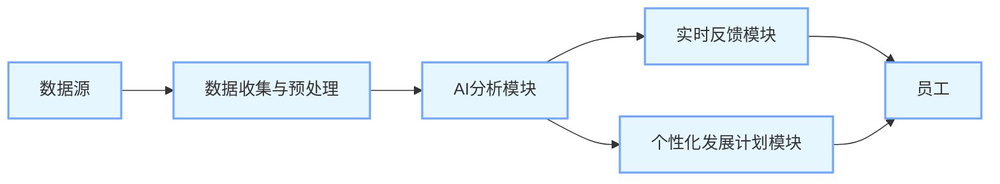

# AI驱动的企业绩效管理：实时反馈与个性化发展计划

> 关键词：AI、企业绩效管理、实时反馈、个性化发展计划、数据分析

> 摘要：本文聚焦于AI驱动的企业绩效管理，深入探讨了实时反馈和个性化发展计划这两个核心要素。首先介绍了相关背景知识，包括目的、预期读者等内容。接着阐述了核心概念及其联系，通过文本示意图和Mermaid流程图进行直观展示。详细讲解了核心算法原理并给出Python代码示例，同时介绍了相关数学模型和公式。通过项目实战案例，展示了如何在实际中运用这些技术。还探讨了实际应用场景，推荐了学习和开发所需的工具和资源。最后对未来发展趋势与挑战进行总结，并给出常见问题解答和扩展阅读参考资料，旨在为企业在AI时代提升绩效管理水平提供全面的技术指导和思路。

## 1. 背景介绍 
### 1.1 目的和范围
企业绩效管理是企业管理中的关键环节，传统的绩效管理方式往往存在反馈不及时、缺乏个性化等问题。随着AI技术的发展，将AI应用于企业绩效管理成为一种趋势。本文的目的在于深入探讨如何利用AI实现企业绩效管理中的实时反馈和个性化发展计划，为企业提供更高效、精准的管理方案。范围涵盖了AI技术在绩效管理中的核心概念、算法原理、实际应用案例以及相关工具和资源等方面。

### 1.2 预期读者
本文预期读者包括企业管理者、人力资源专家、绩效管理从业者、AI技术开发者以及对企业绩效管理和AI技术融合感兴趣的研究人员。企业管理者可以从中获取提升绩效管理效率和质量的思路；人力资源专家能够学习如何利用AI优化绩效评估和员工发展计划；绩效管理从业者可借鉴相关方法改进现有工作流程；AI技术开发者可以了解企业绩效管理领域的应用需求和技术挑战；研究人员则能获得该领域的最新研究动态和实践经验。

### 1.3 文档结构概述
本文将按照以下结构进行阐述：首先介绍背景知识，包括目的、预期读者和文档结构概述等；接着讲解核心概念与联系，通过文本示意图和Mermaid流程图进行说明；然后详细介绍核心算法原理和具体操作步骤，并给出Python代码示例；之后介绍相关数学模型和公式，并举例说明；通过项目实战案例展示代码实现和详细解读；探讨实际应用场景；推荐学习和开发所需的工具和资源；总结未来发展趋势与挑战；提供常见问题解答；最后给出扩展阅读和参考资料。

### 1.4 术语表
#### 1.4.1 核心术语定义
- **AI（Artificial Intelligence）**：人工智能，是指通过计算机技术模拟人类智能的理论、方法、技术及应用系统。
- **企业绩效管理（Enterprise Performance Management，EPM）**：企业为了实现战略目标，对企业各层级的绩效进行计划、监控、评估和改进的过程。
- **实时反馈（Real - time Feedback）**：在企业绩效管理中，指及时、迅速地向员工提供关于其工作表现的信息，以便员工能够及时调整工作行为。
- **个性化发展计划（Personalized Development Plan）**：根据员工的个人能力、兴趣、职业目标等因素制定的，适合员工自身发展的培训和发展计划。

#### 1.4.2 相关概念解释
- **机器学习（Machine Learning）**：是AI的一个重要分支，它让计算机通过数据学习模式和规律，从而做出预测和决策。在企业绩效管理中，可用于分析员工绩效数据、预测员工未来表现等。
- **自然语言处理（Natural Language Processing，NLP）**：使计算机能够理解、处理和生成人类语言的技术。在实时反馈中，可用于分析员工的文本反馈信息、生成自动反馈内容等。

#### 1.4.3 缩略词列表
- **AI**：Artificial Intelligence
- **EPM**：Enterprise Performance Management
- **NLP**：Natural Language Processing

## 2. 核心概念与联系 

### 核心概念原理
在AI驱动的企业绩效管理中，实时反馈和个性化发展计划是两个核心概念。

实时反馈的原理是利用AI技术对员工的工作数据进行实时收集和分析。通过传感器、企业信息系统等渠道获取员工的工作行为、任务完成情况等数据，然后利用机器学习算法对这些数据进行分析，判断员工的工作表现是否达到预期标准。一旦发现偏差，系统会立即向员工和管理者发送反馈信息。例如，在一个项目管理系统中，通过监控员工的任务进度、代码提交频率等数据，当发现某个员工的任务进度滞后时，系统会及时提醒该员工和其上级领导。

个性化发展计划的原理是基于员工的个人数据和企业的业务需求，为员工量身定制发展路径。AI系统会收集员工的技能水平、工作经验、兴趣爱好、职业目标等多方面的数据，利用数据分析和机器学习算法对这些数据进行建模和分析，找出员工的优势和不足。然后根据企业的战略目标和岗位需求，为员工制定个性化的培训计划、职业发展路径等。例如，对于一个有编程技能但缺乏项目管理经验的员工，系统可能会推荐他参加项目管理培训课程，并规划他在未来几年内从程序员向项目管理岗位发展的路径。

### 架构的文本示意图
```
+------------------+
| 数据源           |
| - 企业信息系统   |
| - 传感器         |
| - 员工反馈问卷   |
+------------------+
         |
         v
+------------------+
| 数据收集与预处理 |
| - 数据清洗       |
| - 特征提取       |
+------------------+
         |
         v
+------------------+
| AI分析模块       |
| - 机器学习算法   |
| - 自然语言处理   |
+------------------+
         |
         +----------------+
         |                |
         v                v
+------------------+ +------------------+
| 实时反馈模块     | | 个性化发展计划模块 |
| - 反馈生成       | | - 计划制定         |
| - 反馈推送       | | - 计划调整         |
+------------------+ +------------------+
         |                |
         v                v
+------------------+ +------------------+
| 员工             | | 员工             |
+------------------+ +------------------+
```

### Mermaid流程图


## 3. 核心算法原理 & 具体操作步骤 

### 核心算法原理
在AI驱动的企业绩效管理中，常用的核心算法包括机器学习中的分类算法和聚类算法，以及自然语言处理中的情感分析算法。

#### 分类算法（以逻辑回归为例）
逻辑回归是一种常用的分类算法，用于预测样本属于某个类别的概率。在企业绩效管理中，可以用逻辑回归来预测员工的绩效等级（如优秀、良好、合格、不合格）。逻辑回归的基本原理是通过一个逻辑函数将线性回归的结果映射到[0, 1]区间，从而得到样本属于某个类别的概率。

逻辑函数的公式为：
$$
\sigma(z)=\frac{1}{1 + e^{-z}}
$$
其中，$z = \theta_0+\theta_1x_1+\theta_2x_2+\cdots+\theta_nx_n$，$\theta_i$ 是模型的参数，$x_i$ 是样本的特征。

#### 聚类算法（以K - Means为例）
K - Means算法是一种无监督学习算法，用于将样本划分为K个不同的簇。在企业绩效管理中，可以用K - Means算法将员工按照工作表现、技能水平等特征进行聚类，以便为不同类别的员工制定不同的发展计划。

K - Means算法的基本步骤如下：
1. 随机选择K个样本作为初始聚类中心。
2. 计算每个样本到各个聚类中心的距离，将样本分配到距离最近的聚类中心所在的簇。
3. 重新计算每个簇的聚类中心。
4. 重复步骤2和3，直到聚类中心不再变化或达到最大迭代次数。

#### 情感分析算法（以基于词袋模型的朴素贝叶斯为例）
情感分析算法用于判断文本的情感倾向（如积极、消极、中性）。在企业绩效管理中，可以用情感分析算法分析员工的反馈信息，了解员工的工作满意度和情绪状态。

基于词袋模型的朴素贝叶斯算法的基本原理是：将文本看作是一个词的集合，不考虑词的顺序。通过计算文本中每个词在不同情感类别下的出现概率，利用贝叶斯定理计算文本属于某个情感类别的概率。

### 具体操作步骤

#### 数据收集与预处理
1. 从企业信息系统、传感器、员工反馈问卷等数据源收集员工的工作数据，包括任务完成情况、工作时长、代码行数、文本反馈等。
2. 对收集到的数据进行清洗，去除重复数据、缺失值和异常值。
3. 提取数据的特征，例如将文本数据转换为数值特征（如词袋模型、TF - IDF），对数值数据进行标准化处理。

#### 模型训练
1. 划分训练集和测试集，将预处理后的数据按照一定比例（如80:20）划分为训练集和测试集。
2. 选择合适的算法进行模型训练，例如使用逻辑回归算法训练绩效等级预测模型，使用K - Means算法进行员工聚类，使用基于词袋模型的朴素贝叶斯算法进行情感分析。
3. 对训练好的模型进行评估，使用测试集评估模型的性能指标（如准确率、召回率、F1值等），根据评估结果调整模型参数。

#### 实时反馈与个性化发展计划生成
1. 实时收集员工的工作数据，将数据输入到训练好的模型中进行预测和分析。
2. 根据模型的输出结果生成实时反馈信息，例如当员工的绩效等级预测为不合格时，及时向员工发送提醒信息。
3. 根据员工的聚类结果和个人数据，为员工制定个性化的发展计划，例如为某个簇的员工推荐特定的培训课程。

### Python源代码示例

```python
import numpy as np
from sklearn.linear_model import LogisticRegression
from sklearn.cluster import KMeans
from sklearn.feature_extraction.text import CountVectorizer
from sklearn.naive_bayes import MultinomialNB
from sklearn.model_selection import train_test_split
from sklearn.metrics import accuracy_score

# 示例数据
# 绩效数据
X_performance = np.random.rand(100, 5)  # 100个样本，每个样本5个特征
y_performance = np.random.randint(0, 2, 100)  # 绩效等级标签（0或1）

# 文本反馈数据
text_feedback = [
    "工作很有成就感",
    "任务太难，压力很大",
    "团队氛围很好"
]
y_sentiment = [1, 0, 1]  # 情感标签（1表示积极，0表示消极）

# 绩效等级预测（逻辑回归）
X_train_performance, X_test_performance, y_train_performance, y_test_performance = train_test_split(
    X_performance, y_performance, test_size=0.2, random_state=42
)
model_performance = LogisticRegression()
model_performance.fit(X_train_performance, y_train_performance)
y_pred_performance = model_performance.predict(X_test_performance)
accuracy_performance = accuracy_score(y_test_performance, y_pred_performance)
print(f"绩效等级预测准确率: {accuracy_performance}")

# 员工聚类（K - Means）
kmeans = KMeans(n_clusters=3, random_state=42)
kmeans.fit(X_performance)
labels = kmeans.labels_
print(f"员工聚类标签: {labels}")

# 情感分析（基于词袋模型的朴素贝叶斯）
vectorizer = CountVectorizer()
X_text = vectorizer.fit_transform(text_feedback)
X_train_text, X_test_text, y_train_text, y_test_text = train_test_split(
    X_text, y_sentiment, test_size=0.2, random_state=42
)
model_sentiment = MultinomialNB()
model_sentiment.fit(X_train_text, y_train_text)
y_pred_text = model_sentiment.predict(X_test_text)
accuracy_sentiment = accuracy_score(y_test_text, y_pred_text)
print(f"情感分析准确率: {accuracy_sentiment}")
```

## 4. 数学模型和公式 & 详细讲解 & 举例说明 

### 逻辑回归模型
逻辑回归模型用于二分类问题，其目标是找到一组参数 $\theta = [\theta_0, \theta_1, \cdots, \theta_n]$，使得对于给定的输入特征 $x = [x_0, x_1, \cdots, x_n]$（其中 $x_0 = 1$），能够预测样本属于正类的概率 $P(y = 1|x)$。

逻辑回归模型的公式为：
$$
P(y = 1|x)=\sigma(\theta^Tx)=\frac{1}{1 + e^{-\theta^Tx}}
$$
其中，$\theta^Tx=\theta_0x_0+\theta_1x_1+\cdots+\theta_nx_n$。

为了找到最优的参数 $\theta$，通常使用最大似然估计法。假设训练数据集为 $\{(x^{(1)}, y^{(1)}), (x^{(2)}, y^{(2)}), \cdots, (x^{(m)}, y^{(m)})\}$，其中 $x^{(i)}$ 是第 $i$ 个样本的特征向量，$y^{(i)} \in \{0, 1\}$ 是第 $i$ 个样本的标签。似然函数为：
$$
L(\theta)=\prod_{i = 1}^{m}P(y^{(i)}|x^{(i)};\theta)=\prod_{i = 1}^{m}[\sigma(\theta^Tx^{(i)})]^{y^{(i)}}[1 - \sigma(\theta^Tx^{(i)})]^{1 - y^{(i)}}
$$
为了方便计算，通常对似然函数取对数，得到对数似然函数：
$$
\ell(\theta)=\log L(\theta)=\sum_{i = 1}^{m}[y^{(i)}\log\sigma(\theta^Tx^{(i)})+(1 - y^{(i)})\log(1 - \sigma(\theta^Tx^{(i)}))]
$$
通过最大化对数似然函数 $\ell(\theta)$ 来求解参数 $\theta$，通常使用梯度上升法或其变种（如随机梯度上升法）。

#### 举例说明
假设我们有一个简单的二分类问题，特征向量 $x = [x_1, x_2]$，标签 $y \in \{0, 1\}$。我们有以下训练数据：
| $x_1$ | $x_2$ | $y$ |
| --- | --- | --- |
| 1 | 2 | 1 |
| 2 | 3 | 1 |
| 3 | 1 | 0 |
| 4 | 2 | 0 |

我们可以使用逻辑回归模型来预测新样本的标签。首先，我们需要初始化参数 $\theta = [\theta_0, \theta_1, \theta_2]$，然后使用梯度上升法迭代更新参数，直到对数似然函数收敛。

### K - Means聚类模型
K - Means聚类模型的目标是将 $n$ 个样本 $x_1, x_2, \cdots, x_n$ 划分为 $K$ 个簇 $C_1, C_2, \cdots, C_K$，使得每个样本到其所属簇的聚类中心的距离之和最小。

设第 $k$ 个簇的聚类中心为 $\mu_k$，则目标函数为：
$$
J=\sum_{k = 1}^{K}\sum_{x_i \in C_k}||x_i-\mu_k||^2
$$
其中，$||x_i-\mu_k||$ 表示样本 $x_i$ 到聚类中心 $\mu_k$ 的距离，通常使用欧几里得距离。

K - Means算法通过迭代的方式来求解目标函数的最小值，具体步骤如下：
1. 随机初始化 $K$ 个聚类中心 $\mu_1, \mu_2, \cdots, \mu_K$。
2. 对于每个样本 $x_i$，计算其到各个聚类中心的距离 $||x_i-\mu_k||$，将 $x_i$ 分配到距离最近的聚类中心所在的簇 $C_k$。
3. 对于每个簇 $C_k$，重新计算其聚类中心 $\mu_k=\frac{1}{|C_k|}\sum_{x_i \in C_k}x_i$，其中 $|C_k|$ 表示簇 $C_k$ 中的样本数量。
4. 重复步骤2和3，直到聚类中心不再变化或达到最大迭代次数。

#### 举例说明
假设我们有以下样本：
$$
x_1=(1, 2), x_2=(2, 3), x_3=(3, 1), x_4=(4, 2), x_5=(5, 3)
$$
我们要将这些样本划分为 $K = 2$ 个簇。首先，随机初始化两个聚类中心 $\mu_1=(1, 1)$ 和 $\mu_2=(5, 5)$。然后，计算每个样本到这两个聚类中心的距离，将样本分配到距离最近的聚类中心所在的簇。接着，重新计算每个簇的聚类中心，重复这个过程直到收敛。

### 基于词袋模型的朴素贝叶斯模型
基于词袋模型的朴素贝叶斯模型用于文本分类问题，假设文本中的每个词都是独立的。设文本 $d$ 由 $n$ 个词 $w_1, w_2, \cdots, w_n$ 组成，类别集合为 $C = \{c_1, c_2, \cdots, c_m\}$。

根据贝叶斯定理，文本 $d$ 属于类别 $c_j$ 的概率为：
$$
P(c_j|d)=\frac{P(d|c_j)P(c_j)}{P(d)}
$$
由于 $P(d)$ 对于所有类别都是相同的，因此我们只需要比较 $P(d|c_j)P(c_j)$ 的大小来确定文本 $d$ 所属的类别。

根据朴素贝叶斯的独立性假设，$P(d|c_j)=\prod_{i = 1}^{n}P(w_i|c_j)$。

$P(c_j)$ 可以通过训练数据中类别 $c_j$ 的样本数量占总样本数量的比例来估计，即：
$$
P(c_j)=\frac{N_{c_j}}{N}
$$
其中，$N_{c_j}$ 是类别 $c_j$ 的样本数量，$N$ 是总样本数量。

$P(w_i|c_j)$ 可以通过训练数据中词 $w_i$ 在类别 $c_j$ 的文本中出现的频率来估计，即：
$$
P(w_i|c_j)=\frac{count(w_i, c_j)+\alpha}{\sum_{w \in V}(count(w, c_j)+\alpha)}
$$
其中，$count(w_i, c_j)$ 是词 $w_i$ 在类别 $c_j$ 的文本中出现的次数，$V$ 是词汇表，$\alpha$ 是平滑参数，通常取 $\alpha = 1$（拉普拉斯平滑）。

#### 举例说明
假设我们有以下训练数据：
| 文本 | 类别 |
| --- | --- |
| "这部电影很棒" | 积极 |
| "这部电影很糟糕" | 消极 |
| "这本书很有趣" | 积极 |
| "这本书很无聊" | 消极 |

我们要对新文本 "这个游戏很有趣" 进行情感分类。首先，构建词汇表 $V = \{"这部", "电影", "很棒", "很糟糕", "这本书", "很有趣", "很无聊", "这个", "游戏"\}$。然后，计算每个类别的先验概率 $P(积极)$ 和 $P(消极)$，以及每个词在不同类别下的条件概率 $P(w_i|积极)$ 和 $P(w_i|消极)$。最后，根据贝叶斯定理计算文本 "这个游戏很有趣" 属于积极和消极类别的概率，选择概率较大的类别作为预测结果。

## 5. 项目实战：代码实际案例和详细解释说明 

### 5.1  开发环境搭建
#### 安装Python
首先，需要安装Python环境。建议使用Python 3.7及以上版本。可以从Python官方网站（https://www.python.org/downloads/）下载对应操作系统的安装包，按照安装向导进行安装。

#### 安装必要的库
在项目中，我们需要使用一些Python库，如NumPy、Pandas、Scikit - learn等。可以使用pip命令来安装这些库：
```sh
pip install numpy pandas scikit-learn
```

### 5.2  源代码详细实现和代码解读
以下是一个完整的项目实战代码示例，用于实现AI驱动的企业绩效管理中的实时反馈和个性化发展计划。

```python
import numpy as np
import pandas as pd
from sklearn.linear_model import LogisticRegression
from sklearn.cluster import KMeans
from sklearn.feature_extraction.text import CountVectorizer
from sklearn.naive_bayes import MultinomialNB
from sklearn.model_selection import train_test_split
from sklearn.metrics import accuracy_score

# 模拟数据生成
def generate_performance_data(n_samples, n_features):
    X = np.random.rand(n_samples, n_features)
    y = np.random.randint(0, 2, n_samples)
    return X, y

def generate_text_feedback_data():
    text_feedback = [
        "工作很有成就感",
        "任务太难，压力很大",
        "团队氛围很好",
        "项目进度太慢，很焦虑",
        "领导很支持，工作很愉快"
    ]
    y_sentiment = [1, 0, 1, 0, 1]
    return text_feedback, y_sentiment

# 绩效等级预测
def performance_prediction(X, y):
    X_train, X_test, y_train, y_test = train_test_split(
        X, y, test_size=0.2, random_state=42
    )
    model = LogisticRegression()
    model.fit(X_train, y_train)
    y_pred = model.predict(X_test)
    accuracy = accuracy_score(y_test, y_pred)
    print(f"绩效等级预测准确率: {accuracy}")
    return model

# 员工聚类
def employee_clustering(X):
    kmeans = KMeans(n_clusters=3, random_state=42)
    kmeans.fit(X)
    labels = kmeans.labels_
    print(f"员工聚类标签: {labels}")
    return kmeans

# 情感分析
def sentiment_analysis(text_feedback, y_sentiment):
    vectorizer = CountVectorizer()
    X_text = vectorizer.fit_transform(text_feedback)
    X_train_text, X_test_text, y_train_text, y_test_text = train_test_split(
        X_text, y_sentiment, test_size=0.2, random_state=42
    )
    model = MultinomialNB()
    model.fit(X_train_text, y_train_text)
    y_pred_text = model.predict(X_test_text)
    accuracy = accuracy_score(y_test_text, y_pred_text)
    print(f"情感分析准确率: {accuracy}")
    return model

# 主函数
def main():
    # 生成绩效数据
    n_samples = 100
    n_features = 5
    X_performance, y_performance = generate_performance_data(n_samples, n_features)

    # 生成文本反馈数据
    text_feedback, y_sentiment = generate_text_feedback_data()

    # 绩效等级预测
    performance_model = performance_prediction(X_performance, y_performance)

    # 员工聚类
    kmeans_model = employee_clustering(X_performance)

    # 情感分析
    sentiment_model = sentiment_analysis(text_feedback, y_sentiment)

if __name__ == "__main__":
    main()
```

### 代码解读与分析
#### 数据生成部分
- `generate_performance_data` 函数：用于生成模拟的绩效数据，包括特征矩阵 $X$ 和标签向量 $y$。
- `generate_text_feedback_data` 函数：用于生成模拟的文本反馈数据和对应的情感标签。

#### 绩效等级预测部分
- `performance_prediction` 函数：使用逻辑回归算法对绩效数据进行训练和预测。首先将数据划分为训练集和测试集，然后使用逻辑回归模型进行训练，最后计算预测准确率。

#### 员工聚类部分
- `employee_clustering` 函数：使用K - Means算法对绩效数据进行聚类。将员工划分为不同的簇，并输出聚类标签。

#### 情感分析部分
- `sentiment_analysis` 函数：使用基于词袋模型的朴素贝叶斯算法对文本反馈数据进行情感分析。首先将文本数据转换为词袋模型表示，然后将数据划分为训练集和测试集，使用朴素贝叶斯模型进行训练，最后计算预测准确率。

#### 主函数部分
- `main` 函数：调用上述各个函数，完成绩效等级预测、员工聚类和情感分析的任务。

通过这个项目实战，我们可以看到如何使用Python和相关机器学习库实现AI驱动的企业绩效管理中的实时反馈和个性化发展计划。

## 6. 实际应用场景 
### 实时反馈场景
- **项目进度监控**：在软件开发项目中，通过监控开发人员的代码提交频率、任务完成情况等数据，实时反馈项目进度。如果某个开发人员的任务进度滞后，系统可以及时提醒该开发人员和项目负责人，以便采取相应的措施。
- **客户服务质量监控**：在客户服务中心，通过分析客服人员与客户的对话记录、响应时间等数据，实时反馈客服人员的服务质量。如果发现某个客服人员的服务态度不好或响应时间过长，系统可以立即向该客服人员发送反馈信息，提高客户满意度。

### 个性化发展计划场景
- **员工培训**：根据员工的技能水平、工作经验和职业目标，为员工制定个性化的培训计划。例如，对于缺乏数据分析技能的员工，推荐数据分析相关的培训课程；对于有管理潜力的员工，推荐管理培训课程。
- **职业发展规划**：结合企业的战略目标和岗位需求，为员工规划个性化的职业发展路径。例如，为有技术专长的员工规划从技术专家到技术经理的发展路径；为有销售能力的员工规划从销售代表到销售经理的发展路径。

## 7. 工具和资源推荐
### 7.1 学习资源推荐
#### 7.1.1 书籍推荐
- 《机器学习》（周志华）：这本书全面介绍了机器学习的基本概念、算法和应用，是学习机器学习的经典教材。
- 《Python机器学习》（Sebastian Raschka）：以Python为工具，详细介绍了机器学习的各种算法和实现方法，适合初学者入门。
- 《自然语言处理入门》（何晗）：系统介绍了自然语言处理的基本理论和实践方法，对学习情感分析等自然语言处理技术有很大帮助。

#### 7.1.2 在线课程
- Coursera上的“机器学习”课程（Andrew Ng教授）：由机器学习领域的知名专家授课，内容全面、深入浅出，是学习机器学习的优质课程。
- edX上的“自然语言处理”课程：提供了丰富的自然语言处理知识和实践项目，帮助学习者掌握自然语言处理的核心技术。

#### 7.1.3 技术博客和网站
- 博客园（https://www.cnblogs.com/）：有很多技术博主分享机器学习、人工智能等领域的技术文章和实践经验。
- 机器之心（https://www.alldatasheet.com/）：专注于人工智能领域的资讯和技术解读，提供最新的行业动态和技术趋势。

### 7.2 开发工具框架推荐
#### 7.2.1 IDE和编辑器
- PyCharm：一款功能强大的Python集成开发环境，提供代码编辑、调试、版本控制等功能，适合Python开发。
- Jupyter Notebook：一种交互式的开发环境，支持Python代码的编写、运行和可视化展示，方便进行数据探索和模型实验。

#### 7.2.2 调试和性能分析工具
- PDB：Python自带的调试工具，可以帮助开发者定位代码中的错误和问题。
- cProfile：Python的性能分析工具，可以分析代码的运行时间和函数调用情况，帮助优化代码性能。

#### 7.2.3 相关框架和库
- Scikit - learn：一个简单易用的机器学习库，提供了丰富的机器学习算法和工具，适合快速开发机器学习模型。
- NLTK：自然语言处理工具包，提供了丰富的自然语言处理功能，如分词、词性标注、情感分析等。

### 7.3 相关论文著作推荐
#### 7.3.1 经典论文
- “A Logical Calculus of the Ideas Immanent in Nervous Activity”（Warren S. McCulloch和Walter Pitts）：这篇论文提出了人工神经网络的基本模型，是神经网络领域的经典之作。
- “Naive Bayes at Forty: The Independence Assumption in Information Retrieval”（Pedro Domingos和Michael Pazzani）：详细讨论了朴素贝叶斯算法在信息检索中的应用和独立性假设。

#### 7.3.2 最新研究成果
- 在ACM SIGKDD、IEEE ICML等顶级学术会议上，有很多关于机器学习在企业管理、人力资源等领域的最新研究成果。
- 《Journal of Management Information Systems》《Human Resource Management》等学术期刊也会发表相关的研究论文。

#### 7.3.3 应用案例分析
- 《哈佛商业评论》《麻省理工斯隆管理评论》等商业杂志上会有一些企业应用AI进行绩效管理的实际案例分析，可供参考和学习。

## 8. 总结：未来发展趋势与挑战
### 未来发展趋势
- **更智能化的反馈系统**：随着AI技术的不断发展，实时反馈系统将变得更加智能化。不仅能够提供基于数据的反馈，还能够理解员工的情感和意图，提供更加个性化、人性化的反馈信息。
- **与企业战略的深度融合**：AI驱动的企业绩效管理将与企业战略更加紧密地结合。通过对企业战略目标的分解和分析，为员工制定更加符合企业战略的个性化发展计划，提高企业的整体绩效。
- **跨部门协作的加强**：在企业中，绩效管理涉及多个部门，如人力资源部门、业务部门等。未来，AI技术将促进各部门之间的协作，实现数据的共享和整合，提高绩效管理的效率和效果。

### 挑战
- **数据隐私和安全问题**：在AI驱动的企业绩效管理中，需要收集和分析大量的员工数据，包括个人信息、工作数据等。如何保障这些数据的隐私和安全，是一个重要的挑战。
- **算法的可解释性**：一些复杂的AI算法（如深度学习算法）往往是黑盒模型，难以解释其决策过程。在企业绩效管理中，需要对算法的决策结果进行解释，以便员工和管理者理解和接受。
- **员工接受度**：引入AI技术进行绩效管理可能会引起员工的担忧和抵触情绪。如何提高员工对AI技术的接受度，让员工积极参与到绩效管理中，是一个需要解决的问题。

## 9. 附录：常见问题与解答
### 问题1：AI驱动的企业绩效管理是否会取代人力资源部门？
答：不会。AI技术可以辅助人力资源部门进行绩效管理，提高管理效率和准确性。但人力资源部门在员工沟通、团队建设、企业文化塑造等方面具有不可替代的作用。AI技术和人力资源部门应该相互协作，共同提升企业的绩效管理水平。

### 问题2：如何确保AI算法在企业绩效管理中的公平性？
答：可以从以下几个方面确保算法的公平性：一是使用多样化的数据集进行模型训练，避免数据偏差；二是对算法进行定期评估和审计，检查是否存在不公平的决策；三是在算法设计中考虑公平性原则，如避免对某些群体的歧视。

### 问题3：实施AI驱动的企业绩效管理需要多少成本？
答：实施成本因企业规模、需求和技术方案而异。主要成本包括数据收集和存储设备的购置、AI算法开发和模型训练的费用、人员培训费用等。企业可以根据自身情况选择合适的技术方案，逐步推进AI驱动的企业绩效管理。

## 10. 扩展阅读 & 参考资料
### 扩展阅读
- 《智能时代》（吴军）：介绍了人工智能在各个领域的应用和发展趋势，拓宽了对AI技术的认识。
- 《赋能：打造应对不确定性的敏捷团队》（斯坦利·麦克里斯特尔）：探讨了在快速变化的环境中，如何通过赋能员工和团队来提高企业的绩效。

### 参考资料
- 相关学术论文和研究报告，如ACM SIGKDD、IEEE ICML等会议的论文集。
- 企业管理和人力资源管理相关的书籍和期刊，如《人力资源管理概论》《哈佛商业评论》等。

作者：AI天才研究院/AI Genius Institute & 禅与计算机程序设计艺术 /Zen And The Art of Computer Programming