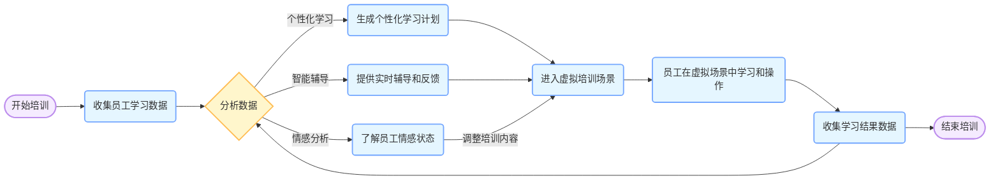

# AI驱动的企业虚拟现实培训：提升学习效果与参与度

> 关键词：AI、企业虚拟现实培训、学习效果、参与度、人工智能算法

> 摘要：本文聚焦于AI驱动的企业虚拟现实培训这一前沿领域，深入探讨其如何提升学习效果与参与度。首先介绍了该领域的背景信息，包括目的、预期读者等。接着阐述了核心概念与联系，分析了相关算法原理和具体操作步骤，并给出了数学模型和公式。通过项目实战案例展示了其实际应用，探讨了实际应用场景。同时推荐了相关的工具和资源，最后总结了未来发展趋势与挑战，为企业在这一领域的发展提供全面的参考。

## 1. 背景介绍 
### 1.1 目的和范围
在当今竞争激烈的商业环境中，企业需要不断提升员工的技能和知识水平，以保持竞争力。传统的培训方式往往存在效率低下、缺乏互动性等问题。AI驱动的企业虚拟现实培训作为一种新兴的培训方式，结合了人工智能和虚拟现实技术的优势，旨在为企业提供更高效、更具参与度的培训解决方案。本文的范围涵盖了AI驱动的企业虚拟现实培训的核心概念、算法原理、实际应用案例以及未来发展趋势等方面。

### 1.2 预期读者
本文的预期读者包括企业培训管理人员、人力资源专家、技术研发人员以及对AI和虚拟现实技术在企业培训领域应用感兴趣的专业人士。通过阅读本文，读者可以了解AI驱动的企业虚拟现实培训的基本原理、实际应用和发展前景，为企业的培训决策提供参考。

### 1.3 文档结构概述
本文共分为十个部分。第一部分为背景介绍，包括目的和范围、预期读者、文档结构概述和术语表。第二部分阐述核心概念与联系，通过文本示意图和Mermaid流程图展示相关原理和架构。第三部分讲解核心算法原理和具体操作步骤，使用Python源代码进行详细阐述。第四部分给出数学模型和公式，并进行详细讲解和举例说明。第五部分通过项目实战案例展示代码的实际应用和详细解释。第六部分探讨实际应用场景。第七部分推荐相关的工具和资源。第八部分总结未来发展趋势与挑战。第九部分为附录，解答常见问题。第十部分提供扩展阅读和参考资料。

### 1.4 术语表
#### 1.4.1 核心术语定义
- **AI（Artificial Intelligence）**：人工智能，是指计算机系统能够执行通常需要人类智能才能完成的任务，如学习、推理、解决问题等。
- **VR（Virtual Reality）**：虚拟现实，是一种利用计算机技术创建的模拟环境，用户可以通过特殊的设备（如头戴式显示器）沉浸其中，与环境进行交互。
- **企业虚拟现实培训**：利用虚拟现实技术为企业员工提供的培训服务，旨在通过模拟真实场景提高员工的技能和知识水平。
- **学习效果**：指员工在培训过程中获得的知识和技能的提升程度，通常通过考试、实际操作等方式进行评估。
- **参与度**：指员工在培训过程中的积极参与程度，包括注意力、互动性等方面。

#### 1.4.2 相关概念解释
- **机器学习**：是人工智能的一个分支，通过让计算机系统从数据中学习模式和规律，从而实现预测和决策等功能。
- **深度学习**：是机器学习的一种，通过构建深层神经网络来处理复杂的数据，如图像、语音等。
- **自然语言处理**：是人工智能的一个领域，旨在让计算机理解和处理人类语言，如语音识别、文本生成等。

#### 1.4.3 缩略词列表
- **AI**：Artificial Intelligence
- **VR**：Virtual Reality
- **ML**：Machine Learning
- **DL**：Deep Learning
- **NLP**：Natural Language Processing

## 2. 核心概念与联系 

### 核心概念原理
AI驱动的企业虚拟现实培训的核心原理是将人工智能技术与虚拟现实技术相结合，为员工提供个性化、沉浸式的培训体验。具体来说，人工智能技术可以用于以下几个方面：
- **个性化学习**：通过分析员工的学习数据，如学习进度、错误率等，为每个员工制定个性化的学习计划，提高学习效果。
- **智能辅导**：利用自然语言处理技术，为员工提供实时的辅导和反馈，帮助他们解决学习过程中遇到的问题。
- **情感分析**：通过分析员工的面部表情、语音语调等，了解他们的情感状态，及时调整培训内容和方式，提高参与度。

虚拟现实技术则为员工提供了一个沉浸式的学习环境，让他们可以在虚拟场景中进行实际操作和演练，提高技能水平。通过将人工智能技术与虚拟现实技术相结合，可以实现以下优势：
- **提高学习效果**：个性化的学习计划和智能辅导可以帮助员工更快地掌握知识和技能，提高学习效果。
- **增强参与度**：沉浸式的学习环境和情感分析可以让员工更加投入地参与培训，提高参与度。
- **降低培训成本**：虚拟现实培训可以减少实际培训所需的场地、设备和人力成本，降低培训成本。

### 架构的文本示意图
```plaintext
AI驱动的企业虚拟现实培训架构
|-- 数据层
|   |-- 员工学习数据
|   |-- 培训内容数据
|   |-- 虚拟场景数据
|-- 人工智能层
|   |-- 机器学习模型
|   |   |-- 个性化学习模型
|   |   |-- 智能辅导模型
|   |   |-- 情感分析模型
|   |-- 自然语言处理模块
|-- 虚拟现实层
|   |-- 虚拟场景生成模块
|   |-- 交互设备接口
|-- 用户界面层
|   |-- 培训界面
|   |-- 反馈界面
```

### Mermaid流程图


## 3. 核心算法原理 & 具体操作步骤 

### 核心算法原理
#### 个性化学习模型
个性化学习模型的核心思想是根据员工的学习数据，为每个员工制定个性化的学习计划。常用的算法是基于协同过滤的推荐算法，其基本原理是通过分析员工的学习历史和其他员工的学习行为，找出与当前员工相似的员工，然后根据相似员工的学习记录为当前员工推荐适合的学习内容。

以下是一个简单的基于协同过滤的个性化学习模型的Python代码示例：
```python
import numpy as np

# 员工学习记录矩阵，每行表示一个员工，每列表示一个学习内容
learning_records = np.array([
    [1, 0, 1, 0],
    [0, 1, 0, 1],
    [1, 1, 0, 0],
    [0, 0, 1, 1]
])

# 计算员工之间的相似度
def similarity(records, user1, user2):
    common_items = np.logical_and(records[user1] > 0, records[user2] > 0)
    if np.sum(common_items) == 0:
        return 0
    dot_product = np.dot(records[user1][common_items], records[user2][common_items])
    norm1 = np.linalg.norm(records[user1][common_items])
    norm2 = np.linalg.norm(records[user2][common_items])
    return dot_product / (norm1 * norm2)

# 为指定员工推荐学习内容
def recommend(records, user):
    num_items = records.shape[1]
    similarities = [similarity(records, user, i) for i in range(records.shape[0]) if i!= user]
    similarities = np.array(similarities)
    weighted_sum = np.zeros(num_items)
    for i in range(records.shape[0]):
        if i!= user:
            weighted_sum += similarities[i] * records[i]
    recommended_items = []
    for i in range(num_items):
        if records[user][i] == 0 and weighted_sum[i] > 0:
            recommended_items.append(i)
    return recommended_items

# 为第一个员工推荐学习内容
recommended = recommend(learning_records, 0)
print("为员工0推荐的学习内容：", recommended)
```

#### 智能辅导模型
智能辅导模型的核心是自然语言处理技术，通过对员工提出的问题进行理解和分析，给出相应的解答和建议。常用的算法是基于深度学习的问答系统，如BERT（Bidirectional Encoder Representations from Transformers）。

以下是一个简单的基于BERT的问答系统的Python代码示例：
```python
from transformers import AutoTokenizer, AutoModelForQuestionAnswering
import torch

# 加载预训练的BERT模型和分词器
tokenizer = AutoTokenizer.from_pretrained("bert-large-uncased-whole-word-masking-finetuned-squad")
model = AutoModelForQuestionAnswering.from_pretrained("bert-large-uncased-whole-word-masking-finetuned-squad")

# 定义问题和上下文
question = "什么是人工智能？"
context = "人工智能是指计算机系统能够执行通常需要人类智能才能完成的任务，如学习、推理、解决问题等。"

# 对问题和上下文进行分词
inputs = tokenizer(question, context, return_tensors='pt')

# 使用模型进行预测
outputs = model(**inputs)
answer_start_scores = outputs.start_logits
answer_end_scores = outputs.end_logits

# 找到答案的起始和结束位置
answer_start = torch.argmax(answer_start_scores)
answer_end = torch.argmax(answer_end_scores) + 1

# 提取答案
answer = tokenizer.convert_tokens_to_string(tokenizer.convert_ids_to_tokens(inputs['input_ids'][0][answer_start:answer_end]))

print("问题：", question)
print("答案：", answer)
```

#### 情感分析模型
情感分析模型的目的是通过分析员工的面部表情、语音语调等，了解他们的情感状态。常用的算法是基于卷积神经网络（CNN）的图像分类算法和基于循环神经网络（RNN）的语音识别算法。

以下是一个简单的基于CNN的情感分析模型的Python代码示例：
```python
import tensorflow as tf
from tensorflow.keras import layers, models

# 构建CNN模型
model = models.Sequential()
model.add(layers.Conv2D(32, (3, 3), activation='relu', input_shape=(150, 150, 3)))
model.add(layers.MaxPooling2D((2, 2)))
model.add(layers.Conv2D(64, (3, 3), activation='relu'))
model.add(layers.MaxPooling2D((2, 2)))
model.add(layers.Conv2D(128, (3, 3), activation='relu'))
model.add(layers.MaxPooling2D((2, 2)))
model.add(layers.Flatten())
model.add(layers.Dense(128, activation='relu'))
model.add(layers.Dense(1, activation='sigmoid'))

# 编译模型
model.compile(optimizer='adam',
              loss='binary_crossentropy',
              metrics=['accuracy'])

# 假设这里有训练数据和标签
# train_images, train_labels =...

# 训练模型
# model.fit(train_images, train_labels, epochs=10, batch_size=32)

# 预测新的图像
# new_image =...
# prediction = model.predict(new_image)
```

### 具体操作步骤
#### 数据收集
- 收集员工的学习数据，包括学习进度、错误率、答题时间等。
- 收集培训内容数据，如课件、视频、练习题等。
- 收集虚拟场景数据，包括场景模型、纹理、光照等。

#### 模型训练
- 使用收集到的数据对个性化学习模型、智能辅导模型和情感分析模型进行训练。
- 不断优化模型的参数，提高模型的准确性和性能。

#### 系统集成
- 将训练好的模型集成到虚拟现实培训系统中。
- 实现模型与虚拟现实场景的交互，如根据员工的情感状态调整场景的氛围。

#### 培训实施
- 员工使用虚拟现实设备进入培训场景。
- 系统根据员工的学习数据为其提供个性化的学习内容和智能辅导。
- 系统实时监测员工的情感状态，调整培训内容和方式。

#### 效果评估
- 收集员工的学习结果数据，如考试成绩、实际操作表现等。
- 分析学习效果和参与度，评估培训系统的性能。
- 根据评估结果对系统进行优化和改进。

## 4. 数学模型和公式 & 详细讲解 & 举例说明 

### 个性化学习模型的数学模型和公式
#### 相似度计算
在基于协同过滤的个性化学习模型中，常用的相似度计算方法是余弦相似度。对于两个员工的学习记录向量 $\mathbf{x}$ 和 $\mathbf{y}$，它们的余弦相似度计算公式为：
$$
\cos(\mathbf{x}, \mathbf{y}) = \frac{\mathbf{x} \cdot \mathbf{y}}{\|\mathbf{x}\| \|\mathbf{y}\|}
$$
其中，$\mathbf{x} \cdot \mathbf{y}$ 表示向量 $\mathbf{x}$ 和 $\mathbf{y}$ 的点积，$\|\mathbf{x}\|$ 和 $\|\mathbf{y}\|$ 分别表示向量 $\mathbf{x}$ 和 $\mathbf{y}$ 的模。

#### 推荐分数计算
为了为员工推荐学习内容，需要计算每个未学习内容的推荐分数。推荐分数的计算公式为：
$$
\text{Score}(i) = \sum_{j \neq u} \text{Similarity}(u, j) \cdot r_{j, i}
$$
其中，$\text{Score}(i)$ 表示第 $i$ 个学习内容的推荐分数，$\text{Similarity}(u, j)$ 表示员工 $u$ 和员工 $j$ 的相似度，$r_{j, i}$ 表示员工 $j$ 是否学习了第 $i$ 个学习内容（$1$ 表示学习，$0$ 表示未学习）。

#### 举例说明
假设有三个员工的学习记录向量分别为 $\mathbf{x} = [1, 0, 1]$，$\mathbf{y} = [0, 1, 1]$，$\mathbf{z} = [1, 1, 0]$。计算员工 $\mathbf{x}$ 和员工 $\mathbf{y}$ 的余弦相似度：
$$
\cos(\mathbf{x}, \mathbf{y}) = \frac{\mathbf{x} \cdot \mathbf{y}}{\|\mathbf{x}\| \|\mathbf{y}\|} = \frac{1 \times 0 + 0 \times 1 + 1 \times 1}{\sqrt{1^2 + 0^2 + 1^2} \sqrt{0^2 + 1^2 + 1^2}} = \frac{1}{\sqrt{2} \sqrt{2}} = \frac{1}{2}
$$

### 智能辅导模型的数学模型和公式
#### 损失函数
在基于深度学习的问答系统中，常用的损失函数是交叉熵损失函数。对于一个样本的预测概率分布 $\mathbf{p}$ 和真实标签分布 $\mathbf{q}$，交叉熵损失函数的计算公式为：
$$
H(\mathbf{p}, \mathbf{q}) = -\sum_{i} q_i \log(p_i)
$$
其中，$q_i$ 表示真实标签分布中第 $i$ 个类别的概率，$p_i$ 表示预测概率分布中第 $i$ 个类别的概率。

#### 梯度下降优化
为了最小化损失函数，通常使用梯度下降算法来更新模型的参数。梯度下降算法的更新公式为：
$$
\theta_{t+1} = \theta_t - \alpha \nabla H(\mathbf{p}, \mathbf{q})
$$
其中，$\theta_t$ 表示第 $t$ 次迭代时的模型参数，$\alpha$ 表示学习率，$\nabla H(\mathbf{p}, \mathbf{q})$ 表示损失函数关于模型参数的梯度。

#### 举例说明
假设一个二分类问题，真实标签分布为 $\mathbf{q} = [1, 0]$，预测概率分布为 $\mathbf{p} = [0.8, 0.2]$。计算交叉熵损失：
$$
H(\mathbf{p}, \mathbf{q}) = -(1 \times \log(0.8) + 0 \times \log(0.2)) \approx 0.223
$$

### 情感分析模型的数学模型和公式
#### 卷积操作
在卷积神经网络中，卷积操作是核心操作之一。对于输入图像 $X$ 和卷积核 $K$，卷积操作的计算公式为：
$$
Y_{i, j} = \sum_{m} \sum_{n} X_{i+m, j+n} K_{m, n}
$$
其中，$Y_{i, j}$ 表示输出特征图中第 $i$ 行第 $j$ 列的元素，$X_{i+m, j+n}$ 表示输入图像中第 $i+m$ 行第 $j+n$ 列的元素，$K_{m, n}$ 表示卷积核中第 $m$ 行第 $n$ 列的元素。

#### 池化操作
池化操作用于减少特征图的尺寸，常用的池化操作是最大池化。对于输入特征图 $X$，最大池化操作的计算公式为：
$$
Y_{i, j} = \max_{m, n \in S} X_{i+m, j+n}
$$
其中，$Y_{i, j}$ 表示输出特征图中第 $i$ 行第 $j$ 列的元素，$S$ 表示池化窗口的大小。

#### 举例说明
假设输入图像 $X$ 是一个 $3 \times 3$ 的矩阵：
$$
X = \begin{bmatrix}
1 & 2 & 3 \\
4 & 5 & 6 \\
7 & 8 & 9
\end{bmatrix}
$$
卷积核 $K$ 是一个 $2 \times 2$ 的矩阵：
$$
K = \begin{bmatrix}
1 & 0 \\
0 & 1
\end{bmatrix}
$$
进行卷积操作得到的输出特征图 $Y$ 为：
$$
Y = \begin{bmatrix}
1 \times 1 + 0 \times 2 + 0 \times 4 + 1 \times 5 & 1 \times 2 + 0 \times 3 + 0 \times 5 + 1 \times 6 \\
1 \times 4 + 0 \times 5 + 0 \times 7 + 1 \times 8 & 1 \times 5 + 0 \times 6 + 0 \times 8 + 1 \times 9
\end{bmatrix} = \begin{bmatrix}
6 & 8 \\
12 & 14
\end{bmatrix}
$$

## 5. 项目实战：代码实际案例和详细解释说明 

### 5.1  开发环境搭建
#### 硬件环境
- 高性能计算机：建议使用具有多核处理器和独立显卡的计算机，以满足虚拟现实和人工智能计算的需求。
- 虚拟现实设备：如Oculus Rift、HTC Vive等，用于员工进行沉浸式培训。

#### 软件环境
- 操作系统：Windows 10或更高版本。
- 编程语言：Python 3.7或更高版本。
- 深度学习框架：TensorFlow、PyTorch等。
- 虚拟现实开发引擎：Unity、Unreal Engine等。

#### 安装步骤
1. 安装Python：从Python官方网站下载并安装Python 3.7或更高版本。
2. 安装深度学习框架：使用pip命令安装TensorFlow或PyTorch。
```bash
pip install tensorflow
```
3. 安装虚拟现实开发引擎：从Unity或Unreal Engine官方网站下载并安装开发引擎。
4. 安装相关库：安装其他必要的Python库，如NumPy、Pandas等。
```bash
pip install numpy pandas
```

### 5.2  源代码详细实现和代码解读
#### 个性化学习模块
```python
import numpy as np

# 员工学习记录矩阵，每行表示一个员工，每列表示一个学习内容
learning_records = np.array([
    [1, 0, 1, 0],
    [0, 1, 0, 1],
    [1, 1, 0, 0],
    [0, 0, 1, 1]
])

# 计算员工之间的相似度
def similarity(records, user1, user2):
    common_items = np.logical_and(records[user1] > 0, records[user2] > 0)
    if np.sum(common_items) == 0:
        return 0
    dot_product = np.dot(records[user1][common_items], records[user2][common_items])
    norm1 = np.linalg.norm(records[user1][common_items])
    norm2 = np.linalg.norm(records[user2][common_items])
    return dot_product / (norm1 * norm2)

# 为指定员工推荐学习内容
def recommend(records, user):
    num_items = records.shape[1]
    similarities = [similarity(records, user, i) for i in range(records.shape[0]) if i!= user]
    similarities = np.array(similarities)
    weighted_sum = np.zeros(num_items)
    for i in range(records.shape[0]):
        if i!= user:
            weighted_sum += similarities[i] * records[i]
    recommended_items = []
    for i in range(num_items):
        if records[user][i] == 0 and weighted_sum[i] > 0:
            recommended_items.append(i)
    return recommended_items

# 为第一个员工推荐学习内容
recommended = recommend(learning_records, 0)
print("为员工0推荐的学习内容：", recommended)
```
**代码解读**：
- `learning_records`：表示员工的学习记录矩阵，每行表示一个员工，每列表示一个学习内容。
- `similarity` 函数：用于计算两个员工之间的相似度，使用余弦相似度公式。
- `recommend` 函数：为指定员工推荐学习内容，根据其他员工的学习记录和相似度计算推荐分数。
- 最后，调用 `recommend` 函数为第一个员工推荐学习内容，并打印推荐结果。

#### 智能辅导模块
```python
from transformers import AutoTokenizer, AutoModelForQuestionAnswering
import torch

# 加载预训练的BERT模型和分词器
tokenizer = AutoTokenizer.from_pretrained("bert-large-uncased-whole-word-masking-finetuned-squad")
model = AutoModelForQuestionAnswering.from_pretrained("bert-large-uncased-whole-word-masking-finetuned-squad")

# 定义问题和上下文
question = "什么是人工智能？"
context = "人工智能是指计算机系统能够执行通常需要人类智能才能完成的任务，如学习、推理、解决问题等。"

# 对问题和上下文进行分词
inputs = tokenizer(question, context, return_tensors='pt')

# 使用模型进行预测
outputs = model(**inputs)
answer_start_scores = outputs.start_logits
answer_end_scores = outputs.end_logits

# 找到答案的起始和结束位置
answer_start = torch.argmax(answer_start_scores)
answer_end = torch.argmax(answer_end_scores) + 1

# 提取答案
answer = tokenizer.convert_tokens_to_string(tokenizer.convert_ids_to_tokens(inputs['input_ids'][0][answer_start:answer_end]))

print("问题：", question)
print("答案：", answer)
```
**代码解读**：
- `tokenizer` 和 `model`：加载预训练的BERT模型和分词器。
- `question` 和 `context`：定义问题和上下文。
- `inputs`：对问题和上下文进行分词。
- `outputs`：使用模型进行预测，得到答案的起始和结束分数。
- `answer_start` 和 `answer_end`：找到答案的起始和结束位置。
- `answer`：提取答案并打印。

#### 情感分析模块
```python
import tensorflow as tf
from tensorflow.keras import layers, models

# 构建CNN模型
model = models.Sequential()
model.add(layers.Conv2D(32, (3, 3), activation='relu', input_shape=(150, 150, 3)))
model.add(layers.MaxPooling2D((2, 2)))
model.add(layers.Conv2D(64, (3, 3), activation='relu'))
model.add(layers.MaxPooling2D((2, 2)))
model.add(layers.Conv2D(128, (3, 3), activation='relu'))
model.add(layers.MaxPooling2D((2, 2)))
model.add(layers.Flatten())
model.add(layers.Dense(128, activation='relu'))
model.add(layers.Dense(1, activation='sigmoid'))

# 编译模型
model.compile(optimizer='adam',
              loss='binary_crossentropy',
              metrics=['accuracy'])

# 假设这里有训练数据和标签
# train_images, train_labels =...

# 训练模型
# model.fit(train_images, train_labels, epochs=10, batch_size=32)

# 预测新的图像
# new_image =...
# prediction = model.predict(new_image)
```
**代码解读**：
- `model`：构建一个简单的卷积神经网络模型。
- `model.compile`：编译模型，指定优化器、损失函数和评估指标。
- `model.fit`：训练模型，需要提供训练数据和标签。
- `model.predict`：预测新的图像，需要提供新的图像数据。

### 5.3  代码解读与分析
#### 个性化学习模块
- 优点：基于协同过滤的推荐算法简单易懂，能够根据员工的历史学习记录进行个性化推荐。
- 缺点：对于新员工或新的学习内容，可能无法提供准确的推荐。

#### 智能辅导模块
- 优点：使用预训练的BERT模型，能够处理自然语言问题，提供准确的答案。
- 缺点：需要大量的计算资源和时间进行训练，对于复杂的问题可能无法提供满意的答案。

#### 情感分析模块
- 优点：卷积神经网络能够自动提取图像的特征，对于情感分析任务具有较好的效果。
- 缺点：需要大量的标注数据进行训练，对于不同的数据集和任务，模型的性能可能会有所不同。

## 6. 实际应用场景 
### 工业制造领域
在工业制造领域，AI驱动的企业虚拟现实培训可以用于员工的技能培训。例如，通过虚拟现实场景模拟复杂的机械设备操作，让员工在虚拟环境中进行反复练习，提高操作技能和安全性。同时，人工智能技术可以根据员工的操作表现提供实时的反馈和指导，帮助员工更快地掌握技能。

### 医疗保健领域
在医疗保健领域，AI驱动的企业虚拟现实培训可以用于医生和护士的培训。例如，通过虚拟现实场景模拟手术过程，让医生在虚拟环境中进行手术演练，提高手术技能和应对突发情况的能力。此外，人工智能技术可以分析医生的操作行为，提供个性化的培训建议，帮助医生不断提升水平。

### 金融服务领域
在金融服务领域，AI驱动的企业虚拟现实培训可以用于员工的业务培训。例如，通过虚拟现实场景模拟客户服务场景，让员工在虚拟环境中与客户进行互动，提高沟通能力和服务质量。同时，人工智能技术可以根据员工的表现进行评估和反馈，帮助员工改进服务技巧。

### 教育培训领域
在教育培训领域，AI驱动的企业虚拟现实培训可以用于学生的学习。例如，通过虚拟现实场景模拟历史事件、科学实验等，让学生在虚拟环境中进行沉浸式学习，提高学习兴趣和效果。此外，人工智能技术可以根据学生的学习情况提供个性化的学习计划和辅导，帮助学生更好地掌握知识。

## 7. 工具和资源推荐
### 7.1 学习资源推荐
#### 7.1.1 书籍推荐
- 《人工智能：一种现代的方法》：这本书是人工智能领域的经典教材，全面介绍了人工智能的基本概念、算法和应用。
- 《深度学习》：由Ian Goodfellow、Yoshua Bengio和Aaron Courville合著，是深度学习领域的权威著作，详细介绍了深度学习的原理和方法。
- 《虚拟现实：从概念到实现》：这本书介绍了虚拟现实技术的基本原理、开发工具和应用案例，对于学习虚拟现实技术非常有帮助。

#### 7.1.2 在线课程
- Coursera上的“人工智能基础”课程：由知名高校的教授授课，系统介绍了人工智能的基本概念和算法。
- edX上的“深度学习专项课程”：由Andrew Ng教授主讲，深入讲解了深度学习的原理和应用。
- Udemy上的“虚拟现实开发实战”课程：通过实际项目案例，教授虚拟现实开发的技术和技巧。

#### 7.1.3 技术博客和网站
- Medium：上面有很多关于AI和虚拟现实技术的优秀文章，涵盖了最新的研究成果和应用案例。
- arXiv：是一个预印本服务器，提供了大量的人工智能和虚拟现实领域的研究论文。
- 机器之心：专注于人工智能领域的资讯和技术解读，提供了很多有价值的信息。

### 7.2 开发工具框架推荐
#### 7.2.1 IDE和编辑器
- PyCharm：是一款专业的Python集成开发环境，提供了丰富的功能和插件，适合开发Python项目。
- Visual Studio Code：是一款轻量级的代码编辑器，支持多种编程语言，具有丰富的扩展功能。
- Unity Hub：是Unity 3D游戏开发引擎的管理工具，方便开发者创建、管理和运行项目。

#### 7.2.2 调试和性能分析工具
- TensorBoard：是TensorFlow的可视化工具，用于监控和分析模型的训练过程和性能。
- PyTorch Profiler：是PyTorch的性能分析工具，用于分析模型的运行时间和内存使用情况。
- Unity Profiler：是Unity 3D游戏开发引擎的性能分析工具，用于分析游戏的性能瓶颈。

#### 7.2.3 相关框架和库
- TensorFlow：是一个开源的深度学习框架，提供了丰富的工具和库，用于构建和训练深度学习模型。
- PyTorch：是另一个流行的深度学习框架，具有动态图和易于使用的特点，适合快速开发和研究。
- OpenCV：是一个开源的计算机视觉库，提供了大量的图像处理和计算机视觉算法，用于处理图像和视频数据。

### 7.3 相关论文著作推荐
#### 7.3.1 经典论文
- “Attention Is All You Need”：提出了Transformer模型，是自然语言处理领域的重要突破。
- “ImageNet Classification with Deep Convolutional Neural Networks”：介绍了AlexNet模型，开启了深度学习在计算机视觉领域的应用热潮。
- “Generative Adversarial Nets”：提出了生成对抗网络（GAN），是生成式模型领域的重要成果。

#### 7.3.2 最新研究成果
- 在各大顶级学术会议（如NeurIPS、ICCV、CVPR等）上发表的关于AI和虚拟现实技术的最新研究论文。
- 在知名学术期刊（如Journal of Artificial Intelligence Research、IEEE Transactions on Pattern Analysis and Machine Intelligence等）上发表的相关研究成果。

#### 7.3.3 应用案例分析
- 一些知名企业（如Google、Microsoft、Facebook等）发布的关于AI和虚拟现实技术在企业培训领域的应用案例报告。
- 一些行业研究机构发布的关于AI驱动的企业虚拟现实培训的市场调研报告和案例分析。

## 8. 总结：未来发展趋势与挑战
### 未来发展趋势
#### 更加个性化的培训体验
随着人工智能技术的不断发展，AI驱动的企业虚拟现实培训将能够为员工提供更加个性化的培训体验。通过对员工的学习数据、行为数据和情感数据进行深入分析，系统可以为每个员工制定更加精准的学习计划和培训内容，满足不同员工的学习需求。

#### 与其他技术的融合
AI驱动的企业虚拟现实培训将与其他技术（如增强现实、物联网、区块链等）进行更加深入的融合。例如，结合增强现实技术可以将虚拟培训内容与现实场景相结合，提高培训的真实感和实用性；结合物联网技术可以实现对培训设备和环境的实时监测和控制；结合区块链技术可以保证培训数据的安全性和可信度。

#### 云化和移动化
随着云计算和移动互联网技术的发展，AI驱动的企业虚拟现实培训将逐渐向云化和移动化方向发展。员工可以通过手机、平板电脑等移动设备随时随地参与培训，不受时间和空间的限制。同时，云平台可以提供强大的计算和存储能力，支持大规模的培训数据处理和模型训练。

### 挑战
#### 技术难题
虽然AI和虚拟现实技术已经取得了很大的进展，但仍然存在一些技术难题需要解决。例如，如何提高人工智能模型的准确性和可靠性，如何优化虚拟现实场景的渲染效果和交互性能，如何实现多模态数据的融合和处理等。

#### 数据安全和隐私问题
AI驱动的企业虚拟现实培训需要收集和处理大量的员工数据，包括学习数据、行为数据和情感数据等。这些数据涉及员工的隐私和安全，需要采取有效的措施进行保护。例如，采用加密技术对数据进行加密存储和传输，建立严格的访问控制机制，确保数据的安全性和隐私性。

#### 成本问题
AI驱动的企业虚拟现实培训需要投入大量的资金用于技术研发、设备采购和人员培训等方面。对于一些中小企业来说，可能难以承担这样的成本。因此，如何降低培训成本，提高培训的性价比，是一个需要解决的问题。

## 9. 附录：常见问题与解答
### 问题1：AI驱动的企业虚拟现实培训适合所有类型的企业吗？
答：AI驱动的企业虚拟现实培训并不适合所有类型的企业。对于一些对员工技能要求较高、培训场景复杂的企业（如工业制造、医疗保健等领域），这种培训方式具有较大的优势。但对于一些对员工技能要求较低、培训内容简单的企业，可能传统的培训方式就可以满足需求。

### 问题2：实施AI驱动的企业虚拟现实培训需要具备哪些技术条件？
答：实施AI驱动的企业虚拟现实培训需要具备以下技术条件：高性能的计算机硬件、虚拟现实设备、深度学习框架、虚拟现实开发引擎等。同时，还需要具备一定的人工智能和虚拟现实技术开发能力，能够进行模型训练、系统集成和开发调试等工作。

### 问题3：如何评估AI驱动的企业虚拟现实培训的效果？
答：可以从以下几个方面评估AI驱动的企业虚拟现实培训的效果：学习效果评估，通过考试、实际操作等方式评估员工的知识和技能提升程度；参与度评估，通过分析员工的培训参与时间、互动频率等指标评估员工的参与度；满意度评估，通过问卷调查等方式了解员工对培训的满意度。

### 问题4：AI驱动的企业虚拟现实培训的成本高吗？
答：AI驱动的企业虚拟现实培训的成本相对较高。主要包括技术研发成本、设备采购成本、人员培训成本等。但随着技术的不断发展和普及，成本有望逐渐降低。同时，这种培训方式可以提高培训效果和效率，降低企业的长期培训成本。

## 10. 扩展阅读 & 参考资料
### 扩展阅读
- 《人工智能简史》：了解人工智能的发展历程和重要事件。
- 《虚拟现实：重塑人类社会》：探讨虚拟现实技术对人类社会的影响和未来发展趋势。
- 《企业培训与发展最佳实践》：学习企业培训的最佳实践和方法。

### 参考资料
- 《人工智能导论》教材
- 相关学术会议和期刊上的研究论文
- 各大技术公司发布的技术文档和白皮书
- 行业报告和市场调研报告

作者：AI天才研究院/AI Genius Institute & 禅与计算机程序设计艺术 /Zen And The Art of Computer Programming