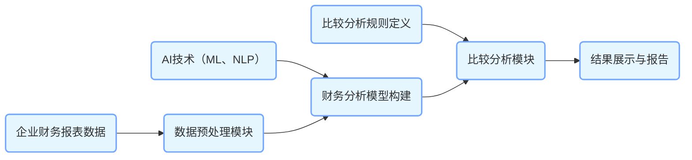

# AI驱动的企业财务报表比较分析系统

> 关键词：AI、企业财务报表、比较分析系统、数据分析、机器学习

> 摘要：本文围绕AI驱动的企业财务报表比较分析系统展开，深入探讨了该系统的背景、核心概念、算法原理、数学模型等内容。详细阐述了系统的开发与实现过程，包括开发环境搭建、源代码实现及解读。同时，介绍了系统在实际中的应用场景，推荐了相关的学习资源、开发工具框架以及论文著作。最后，对系统未来的发展趋势与挑战进行了总结，并提供了常见问题解答和扩展阅读参考资料，旨在为企业财务报表分析提供全面且深入的技术支持和理论指导。

## 1. 背景介绍 
### 1.1 目的和范围
企业财务报表是企业经营状况的重要反映，通过对财务报表的分析可以帮助企业管理者、投资者、债权人等利益相关者了解企业的财务状况、经营成果和现金流量。传统的财务报表分析方法往往依赖于人工经验和简单的财务比率计算，存在分析效率低、准确性不高、难以处理大量复杂数据等问题。

本系统的目的是利用AI技术构建一个高效、准确、智能的企业财务报表比较分析系统，实现对不同企业、不同时期财务报表的自动化比较和深入分析，挖掘财务数据背后的潜在信息和规律，为用户提供更有价值的决策支持。

本系统的范围涵盖了常见的企业财务报表，如资产负债表、利润表、现金流量表等，支持对不同行业、不同规模企业的财务报表进行比较分析，同时考虑了多种财务指标和分析方法。

### 1.2 预期读者
- 企业管理者：可以通过该系统全面了解企业的财务状况，与同行业其他企业进行对比，发现自身的优势和不足，为企业的战略决策提供依据。
- 投资者：借助系统对企业的财务报表进行深入分析，评估企业的投资价值和风险，做出更明智的投资决策。
- 财务分析师：利用系统提高财务报表分析的效率和准确性，挖掘更多有价值的信息，撰写更专业的财务分析报告。
- 学术研究人员：可以将该系统作为研究企业财务状况和经济规律的工具，开展相关的学术研究。

### 1.3 文档结构概述
本文将按照以下结构进行阐述：
- 核心概念与联系：介绍与AI驱动的企业财务报表比较分析系统相关的核心概念，以及它们之间的联系，并通过文本示意图和Mermaid流程图进行直观展示。
- 核心算法原理 & 具体操作步骤：详细讲解系统所使用的核心算法原理，并给出具体的Python源代码实现和操作步骤。
- 数学模型和公式 & 详细讲解 & 举例说明：介绍系统中涉及的数学模型和公式，对其进行详细讲解，并通过实际例子进行说明。
- 项目实战：代码实际案例和详细解释说明：包括开发环境搭建、源代码详细实现和代码解读，帮助读者实际动手实现该系统。
- 实际应用场景：介绍系统在实际中的应用场景，展示系统的实用性和价值。
- 工具和资源推荐：推荐相关的学习资源、开发工具框架和论文著作，帮助读者进一步深入学习和研究。
- 总结：未来发展趋势与挑战：对系统未来的发展趋势进行展望，分析可能面临的挑战。
- 附录：常见问题与解答：解答读者在使用系统过程中可能遇到的常见问题。
- 扩展阅读 & 参考资料：提供相关的扩展阅读材料和参考资料，方便读者进一步探索。

### 1.4 术语表
#### 1.4.1 核心术语定义
- **企业财务报表**：企业对外提供的反映企业某一特定日期的财务状况和某一会计期间的经营成果、现金流量等会计信息的文件，主要包括资产负债表、利润表、现金流量表等。
- **AI（人工智能）**：研究、开发用于模拟、延伸和扩展人的智能的理论、方法、技术及应用系统的一门新的技术科学，在本系统中主要用于数据处理、分析和模型构建。
- **比较分析**：将两个或多个相关的财务数据进行对比，以揭示它们之间的差异和关系，从而评估企业的财务状况和经营绩效。
- **机器学习**：一门多领域交叉学科，涉及概率论、统计学、逼近论、凸分析、算法复杂度理论等多门学科。它专门研究计算机怎样模拟或实现人类的学习行为，以获取新的知识或技能，重新组织已有的知识结构使之不断改善自身的性能。在本系统中用于构建财务分析模型。

#### 1.4.2 相关概念解释
- **财务比率**：是指企业财务报表中的某一项目与另一项目之间的比值，用于反映企业的财务状况和经营绩效，如流动比率、资产负债率、净利率等。
- **数据挖掘**：从大量的数据中通过算法搜索隐藏于其中信息的过程，在本系统中用于从财务报表数据中挖掘潜在的信息和规律。
- **自然语言处理（NLP）**：是计算机科学领域与人工智能领域中的一个重要方向，它研究能实现人与计算机之间用自然语言进行有效通信的各种理论和方法。在本系统中可用于对财务报表中的文本信息进行处理和分析。

#### 1.4.3 缩略词列表
- **AI**：Artificial Intelligence（人工智能）
- **ML**：Machine Learning（机器学习）
- **NLP**：Natural Language Processing（自然语言处理）

## 2. 核心概念与联系 

### 核心概念原理
本系统主要涉及以下几个核心概念：

#### 企业财务报表数据
企业财务报表数据是系统的基础输入，包括资产负债表、利润表、现金流量表等报表中的各项数据。这些数据反映了企业在一定时期内的财务状况和经营成果。

#### AI技术
AI技术在系统中起到核心驱动作用，主要包括机器学习和自然语言处理。机器学习用于构建财务分析模型，对财务数据进行分类、预测和聚类等分析；自然语言处理用于处理财务报表中的文本信息，如财务报告中的注释和说明。

#### 比较分析
比较分析是系统的主要功能之一，通过对不同企业、不同时期的财务报表数据进行对比，找出差异和趋势，为用户提供决策支持。比较分析可以基于财务比率、财务指标等进行。

### 架构的文本示意图
```plaintext
|-------------------|         |-------------------|
| 企业财务报表数据 | -------> | 数据预处理模块    |
|-------------------|         |-------------------|
                            |
                            v
|-------------------|         |-------------------|
| AI技术（ML、NLP） | -------> | 财务分析模型构建 |
|-------------------|         |-------------------|
                            |
                            v
|-------------------|         |-------------------|
| 比较分析规则定义 | -------> | 比较分析模块      |
|-------------------|         |-------------------|
                            |
                            v
|-------------------|
| 结果展示与报告    |
|-------------------|
```

### Mermaid流程图


## 3. 核心算法原理 & 具体操作步骤 

### 核心算法原理
本系统主要使用机器学习中的聚类算法和回归算法进行财务报表分析。

#### 聚类算法
聚类算法用于将不同的企业根据其财务特征进行分组，以便进行比较分析。常用的聚类算法有K-Means算法。

K-Means算法的基本思想是：首先随机选择K个中心点，然后将每个数据点分配到距离最近的中心点所在的簇中，接着重新计算每个簇的中心点，重复这个过程直到中心点不再发生变化或达到最大迭代次数。

#### 回归算法
回归算法用于预测企业的财务指标，如净利润、资产负债率等。常用的回归算法有线性回归算法。

线性回归算法的基本思想是：通过寻找一个线性函数来拟合数据，使得预测值与实际值之间的误差最小。线性回归模型的一般形式为：

$$y = \beta_0 + \beta_1x_1 + \beta_2x_2 + \cdots + \beta_nx_n + \epsilon$$

其中，$y$ 是因变量，$x_1, x_2, \cdots, x_n$ 是自变量，$\beta_0, \beta_1, \beta_2, \cdots, \beta_n$ 是回归系数，$\epsilon$ 是误差项。

### 具体操作步骤

#### 数据预处理
```python
import pandas as pd
from sklearn.preprocessing import StandardScaler

# 读取财务报表数据
data = pd.read_csv('financial_statements.csv')

# 选择需要分析的财务指标
selected_features = ['current_ratio', 'debt_ratio', 'net_profit_margin']
X = data[selected_features]

# 数据标准化
scaler = StandardScaler()
X_scaled = scaler.fit_transform(X)
```

#### 聚类分析
```python
from sklearn.cluster import KMeans

# 选择聚类的数量
k = 3

# 创建K-Means模型
kmeans = KMeans(n_clusters=k, random_state=42)

# 训练模型
kmeans.fit(X_scaled)

# 获取聚类结果
labels = kmeans.labels_
data['cluster'] = labels
```

#### 回归分析
```python
from sklearn.linear_model import LinearRegression
from sklearn.model_selection import train_test_split

# 选择自变量和因变量
X = data[['current_ratio', 'debt_ratio']]
y = data['net_profit_margin']

# 划分训练集和测试集
X_train, X_test, y_train, y_test = train_test_split(X, y, test_size=0.2, random_state=42)

# 创建线性回归模型
model = LinearRegression()

# 训练模型
model.fit(X_train, y_train)

# 预测
y_pred = model.predict(X_test)
```

## 4. 数学模型和公式 & 详细讲解 & 举例说明 

### 聚类算法中的数学模型和公式

#### K-Means算法
K-Means算法的目标是最小化所有数据点到其所属簇中心点的距离之和，即：

$$\min \sum_{i=1}^{k} \sum_{x_j \in C_i} \| x_j - \mu_i \|^2$$

其中，$k$ 是聚类的数量，$C_i$ 是第 $i$ 个簇，$x_j$ 是第 $j$ 个数据点，$\mu_i$ 是第 $i$ 个簇的中心点。

**举例说明**：假设有以下三个数据点：$x_1 = [1, 2]$, $x_2 = [2, 3]$, $x_3 = [8, 9]$，我们要将它们分为2个簇。首先随机选择两个中心点，假设 $\mu_1 = [1, 1]$，$\mu_2 = [8, 8]$。

计算每个数据点到两个中心点的距离：
- $d(x_1, \mu_1) = \sqrt{(1 - 1)^2 + (2 - 1)^2} = 1$
- $d(x_1, \mu_2) = \sqrt{(1 - 8)^2 + (2 - 8)^2} = \sqrt{49 + 36} = \sqrt{85}$
- $d(x_2, \mu_1) = \sqrt{(2 - 1)^2 + (3 - 1)^2} = \sqrt{1 + 4} = \sqrt{5}$
- $d(x_2, \mu_2) = \sqrt{(2 - 8)^2 + (3 - 8)^2} = \sqrt{36 + 25} = \sqrt{61}$
- $d(x_3, \mu_1) = \sqrt{(8 - 1)^2 + (9 - 1)^2} = \sqrt{49 + 64} = \sqrt{113}$
- $d(x_3, \mu_2) = \sqrt{(8 - 8)^2 + (9 - 8)^2} = 1$

根据距离将数据点分配到最近的中心点所在的簇中：$x_1$ 和 $x_2$ 分配到簇 $C_1$，$x_3$ 分配到簇 $C_2$。

重新计算中心点：
- $\mu_1 = \frac{x_1 + x_2}{2} = [\frac{1 + 2}{2}, \frac{2 + 3}{2}] = [1.5, 2.5]$
- $\mu_2 = x_3 = [8, 9]$

重复上述过程直到中心点不再发生变化或达到最大迭代次数。

### 回归算法中的数学模型和公式

#### 线性回归算法
线性回归模型的一般形式为：

$$y = \beta_0 + \beta_1x_1 + \beta_2x_2 + \cdots + \beta_nx_n + \epsilon$$

其中，$y$ 是因变量，$x_1, x_2, \cdots, x_n$ 是自变量，$\beta_0, \beta_1, \beta_2, \cdots, \beta_n$ 是回归系数，$\epsilon$ 是误差项。

回归系数的估计通常使用最小二乘法，即最小化误差平方和：

$$\min \sum_{i=1}^{m} (y_i - \hat{y}_i)^2 = \min \sum_{i=1}^{m} (y_i - (\beta_0 + \beta_1x_{i1} + \beta_2x_{i2} + \cdots + \beta_nx_{in}))^2$$

其中，$m$ 是样本数量，$y_i$ 是第 $i$ 个样本的实际值，$\hat{y}_i$ 是第 $i$ 个样本的预测值。

**举例说明**：假设有以下数据：

| $x$ | $y$ |
| --- | --- |
| 1   | 2   |
| 2   | 4   |
| 3   | 6   |

我们要建立一个简单的线性回归模型 $y = \beta_0 + \beta_1x$。

根据最小二乘法，回归系数的计算公式为：

$$\beta_1 = \frac{\sum_{i=1}^{m} (x_i - \bar{x})(y_i - \bar{y})}{\sum_{i=1}^{m} (x_i - \bar{x})^2}$$

$$\beta_0 = \bar{y} - \beta_1\bar{x}$$

其中，$\bar{x}$ 和 $\bar{y}$ 分别是 $x$ 和 $y$ 的均值。

计算均值：
- $\bar{x} = \frac{1 + 2 + 3}{3} = 2$
- $\bar{y} = \frac{2 + 4 + 6}{3} = 4$

计算 $\beta_1$：
- $\sum_{i=1}^{3} (x_i - \bar{x})(y_i - \bar{y}) = (1 - 2)(2 - 4) + (2 - 2)(4 - 4) + (3 - 2)(6 - 4) = 2 + 0 + 2 = 4$
- $\sum_{i=1}^{3} (x_i - \bar{x})^2 = (1 - 2)^2 + (2 - 2)^2 + (3 - 2)^2 = 1 + 0 + 1 = 2$
- $\beta_1 = \frac{4}{2} = 2$

计算 $\beta_0$：
- $\beta_0 = 4 - 2 \times 2 = 0$

所以，线性回归模型为 $y = 2x$。

## 5. 项目实战：代码实际案例和详细解释说明 

### 5.1  开发环境搭建
#### 安装Python
首先，确保你已经安装了Python 3.x版本。可以从Python官方网站（https://www.python.org/downloads/）下载并安装。

#### 安装必要的库
使用以下命令安装所需的Python库：
```sh
pip install pandas scikit-learn matplotlib
```

### 5.2  源代码详细实现和代码解读

```python
import pandas as pd
from sklearn.preprocessing import StandardScaler
from sklearn.cluster import KMeans
from sklearn.linear_model import LinearRegression
from sklearn.model_selection import train_test_split
import matplotlib.pyplot as plt

# 读取财务报表数据
data = pd.read_csv('financial_statements.csv')

# 选择需要分析的财务指标
selected_features = ['current_ratio', 'debt_ratio', 'net_profit_margin']
X = data[selected_features]

# 数据标准化
scaler = StandardScaler()
X_scaled = scaler.fit_transform(X)

# 聚类分析
# 选择聚类的数量
k = 3

# 创建K-Means模型
kmeans = KMeans(n_clusters=k, random_state=42)

# 训练模型
kmeans.fit(X_scaled)

# 获取聚类结果
labels = kmeans.labels_
data['cluster'] = labels

# 可视化聚类结果
plt.scatter(data['current_ratio'], data['net_profit_margin'], c=labels, cmap='viridis')
plt.xlabel('Current Ratio')
plt.ylabel('Net Profit Margin')
plt.title('K-Means Clustering of Financial Statements')
plt.show()

# 回归分析
# 选择自变量和因变量
X = data[['current_ratio', 'debt_ratio']]
y = data['net_profit_margin']

# 划分训练集和测试集
X_train, X_test, y_train, y_test = train_test_split(X, y, test_size=0.2, random_state=42)

# 创建线性回归模型
model = LinearRegression()

# 训练模型
model.fit(X_train, y_train)

# 预测
y_pred = model.predict(X_test)

# 可视化预测结果
plt.scatter(y_test, y_pred)
plt.xlabel('Actual Net Profit Margin')
plt.ylabel('Predicted Net Profit Margin')
plt.title('Linear Regression Prediction of Net Profit Margin')
plt.show()
```

### 5.3  代码解读与分析
#### 数据读取和预处理
- `pd.read_csv('financial_statements.csv')`：使用Pandas库读取财务报表数据文件。
- `StandardScaler()`：使用`StandardScaler`类对数据进行标准化处理，使数据具有零均值和单位方差，有助于提高模型的性能。

#### 聚类分析
- `KMeans(n_clusters=k, random_state=42)`：创建一个K-Means聚类模型，指定聚类的数量为 $k$。
- `kmeans.fit(X_scaled)`：使用标准化后的数据训练K-Means模型。
- `kmeans.labels_`：获取每个数据点的聚类标签。
- `plt.scatter()`：使用Matplotlib库绘制散点图，可视化聚类结果。

#### 回归分析
- `train_test_split(X, y, test_size=0.2, random_state=42)`：将数据划分为训练集和测试集，测试集占总数据的20%。
- `LinearRegression()`：创建一个线性回归模型。
- `model.fit(X_train, y_train)`：使用训练集数据训练线性回归模型。
- `model.predict(X_test)`：使用训练好的模型对测试集数据进行预测。
- `plt.scatter()`：使用Matplotlib库绘制散点图，可视化预测结果。

## 6. 实际应用场景 
### 企业管理者
企业管理者可以使用该系统对本企业的财务报表进行深入分析，并与同行业其他企业进行比较。通过聚类分析，管理者可以了解本企业在行业中的定位，发现自身的优势和不足。例如，如果本企业被划分到盈利能力较强的簇中，但资产负债率较高，管理者可以考虑优化资本结构，降低财务风险。

通过回归分析，管理者可以预测企业的财务指标，如净利润、资产负债率等，为企业的战略决策提供依据。例如，预测未来一段时间内企业的净利润，如果预测结果不理想，管理者可以提前采取措施，如调整产品结构、降低成本等。

### 投资者
投资者可以利用该系统对不同企业的财务报表进行比较分析，评估企业的投资价值和风险。通过聚类分析，投资者可以快速筛选出具有相似财务特征的企业，缩小投资范围。例如，投资者可以选择盈利能力较强、资产负债率较低的企业进行投资。

通过回归分析，投资者可以预测企业的未来发展趋势，判断企业是否具有投资潜力。例如，如果预测某企业的净利润将持续增长，投资者可以考虑增加对该企业的投资。

### 财务分析师
财务分析师可以使用该系统提高财务报表分析的效率和准确性。系统可以自动处理大量的财务数据，进行复杂的分析和计算，为财务分析师节省时间和精力。同时，系统提供的可视化结果可以帮助财务分析师更直观地展示分析结果，撰写更专业的财务分析报告。

## 7. 工具和资源推荐
### 7.1 学习资源推荐
#### 7.1.1 书籍推荐
- 《Python数据分析实战》：介绍了使用Python进行数据分析的基本方法和技巧，包括数据处理、可视化、机器学习等方面的内容。
- 《机器学习实战》：通过实际案例介绍了机器学习的基本算法和应用，适合初学者入门。
- 《财务报表分析》：系统地介绍了企业财务报表分析的方法和技巧，是财务分析领域的经典著作。

#### 7.1.2 在线课程
- Coursera上的“机器学习”课程：由斯坦福大学教授Andrew Ng主讲，是机器学习领域的经典课程。
- edX上的“Python for Data Science”课程：介绍了使用Python进行数据分析的基本方法和工具。
- 网易云课堂上的“财务报表分析实战”课程：结合实际案例介绍了企业财务报表分析的方法和技巧。

#### 7.1.3 技术博客和网站
- Medium：是一个技术博客平台，上面有很多关于AI、数据分析、财务分析等方面的文章。
- Kaggle：是一个数据科学竞赛平台，上面有很多公开的数据集和优秀的数据分析案例。
- 雪球网：是一个财经社区，上面有很多关于企业财务分析和投资的文章和讨论。

### 7.2 开发工具框架推荐
#### 7.2.1 IDE和编辑器
- PyCharm：是一款专业的Python集成开发环境，具有代码编辑、调试、自动补全等功能。
- Jupyter Notebook：是一个交互式的编程环境，适合进行数据分析和机器学习实验。
- Visual Studio Code：是一款轻量级的代码编辑器，支持多种编程语言和插件。

#### 7.2.2 调试和性能分析工具
- Py-Spy：是一个Python性能分析工具，可以帮助开发者找出代码中的性能瓶颈。
- pdb：是Python自带的调试工具，可以帮助开发者调试代码。
- TensorBoard：是TensorFlow提供的可视化工具，可以帮助开发者可视化模型的训练过程和性能指标。

#### 7.2.3 相关框架和库
- Pandas：是一个用于数据处理和分析的Python库，提供了高效的数据结构和数据操作方法。
- Scikit-learn：是一个用于机器学习的Python库，提供了各种机器学习算法和工具。
- Matplotlib：是一个用于数据可视化的Python库，提供了丰富的绘图功能。

### 7.3 相关论文著作推荐
#### 7.3.1 经典论文
- “A Method for Solving General Constraint Satisfaction Problems”：介绍了K-Means聚类算法的基本原理和实现方法。
- “Linear Regression Analysis: Theory and Computing”：系统地介绍了线性回归算法的理论和计算方法。
- “Financial Statement Analysis and Security Valuation”：是财务报表分析领域的经典论文，介绍了财务报表分析的基本方法和应用。

#### 7.3.2 最新研究成果
- 近年来，随着AI技术的不断发展，越来越多的研究将AI技术应用于企业财务报表分析中。例如，使用深度学习算法对财务报表数据进行分析和预测，取得了较好的效果。可以关注相关的学术期刊和会议，如《Journal of Financial Economics》、《International Conference on Machine Learning》等，了解最新的研究成果。

#### 7.3.3 应用案例分析
- 一些知名企业和机构已经将AI技术应用于企业财务报表分析中，并取得了良好的效果。可以关注相关的商业杂志和新闻报道，如《哈佛商业评论》、《华尔街日报》等，了解实际应用案例和经验。

## 8. 总结：未来发展趋势与挑战
### 未来发展趋势
- **更强大的AI技术应用**：随着AI技术的不断发展，未来的企业财务报表比较分析系统将应用更强大的机器学习和深度学习算法，如卷积神经网络（CNN）、循环神经网络（RNN）等，以提高分析的准确性和效率。
- **实时数据分析**：未来的系统将支持实时数据采集和分析，能够及时反映企业的财务状况和经营成果，为用户提供更及时的决策支持。
- **多源数据融合**：除了企业财务报表数据，未来的系统将融合更多的数据源，如市场数据、行业数据、社交媒体数据等，以更全面地了解企业的经营环境和竞争态势。
- **可视化和交互性增强**：未来的系统将提供更丰富的可视化工具和交互界面，使用户能够更直观地了解分析结果，并进行交互式的探索和分析。

### 挑战
- **数据质量问题**：企业财务报表数据的质量直接影响系统的分析结果。数据可能存在缺失、错误、不一致等问题，需要进行有效的数据清洗和预处理。
- **模型解释性问题**：一些复杂的AI模型，如深度学习模型，往往具有较高的预测准确性，但缺乏解释性。在企业财务报表分析中，用户需要了解模型的决策依据，因此需要解决模型解释性问题。
- **隐私和安全问题**：企业财务报表数据包含敏感信息，需要确保数据的隐私和安全。在数据采集、存储和传输过程中，需要采取有效的安全措施，防止数据泄露和滥用。
- **技术更新换代快**：AI技术发展迅速，新的算法和模型不断涌现。系统需要及时更新和升级，以跟上技术发展的步伐。

## 9. 附录：常见问题与解答
### 问题1：系统对数据的格式有什么要求？
答：系统通常支持常见的数据格式，如CSV、Excel等。数据文件应包含所需的财务指标列，且数据应为数值类型。如果数据存在缺失值或异常值，需要进行预处理。

### 问题2：如何选择合适的聚类数量？
答：选择合适的聚类数量是聚类分析中的一个重要问题。常用的方法有手肘法、轮廓系数法等。手肘法通过绘制不同聚类数量下的误差平方和（SSE）曲线，选择曲线拐点处的聚类数量。轮廓系数法通过计算每个样本的轮廓系数，选择轮廓系数最大的聚类数量。

### 问题3：系统能否处理不同行业的财务报表数据？
答：系统可以处理不同行业的财务报表数据。在进行比较分析时，可以根据行业特点选择合适的财务指标和分析方法。同时，聚类分析可以将不同行业的企业进行分组，以便进行更有针对性的比较。

### 问题4：如何评估线性回归模型的性能？
答：常用的评估指标有均方误差（MSE）、均方根误差（RMSE）、决定系数（$R^2$）等。均方误差和均方根误差反映了预测值与实际值之间的平均误差，值越小说明模型的性能越好。决定系数表示模型对数据的拟合程度，取值范围为 $[0, 1]$，值越接近1说明模型的拟合效果越好。

## 10. 扩展阅读 & 参考资料
### 扩展阅读
- 《人工智能：现代方法》：全面介绍了人工智能的基本概念、算法和应用，是人工智能领域的经典著作。
- 《数据挖掘：概念与技术》：系统地介绍了数据挖掘的基本方法和技术，包括聚类分析、分类分析、关联规则挖掘等。
- 《Python机器学习》：介绍了使用Python进行机器学习的方法和实践，适合有一定Python基础的读者。

### 参考资料
- 《企业财务报表分析方法与应用》：详细介绍了企业财务报表分析的方法和应用案例。
- 《机器学习算法原理与编程实践》：通过实际代码案例介绍了机器学习算法的原理和实现方法。
- 《自然语言处理入门》：介绍了自然语言处理的基本概念、算法和应用，适合初学者入门。

作者：AI天才研究院/AI Genius Institute & 禅与计算机程序设计艺术 /Zen And The Art of Computer Programming