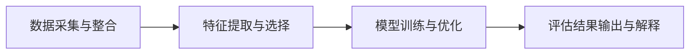

# AI驱动的企业财务报表质量评估系统

> 关键词：AI、企业财务报表、质量评估系统、数据分析、机器学习

> 摘要：本文围绕AI驱动的企业财务报表质量评估系统展开深入探讨。首先介绍了该系统的背景，包括目的、预期读者等内容。接着阐述了核心概念与联系，详细讲解了系统架构。在核心算法原理部分，使用Python代码进行了说明。还介绍了相关数学模型和公式，并给出举例。通过项目实战，展示了系统的开发环境搭建、源代码实现与解读。分析了系统的实际应用场景，推荐了学习、开发工具等资源。最后总结了未来发展趋势与挑战，解答了常见问题并提供了扩展阅读和参考资料，旨在为构建和应用此类系统提供全面的技术指导。

## 1. 背景介绍 
### 1.1 目的和范围
企业财务报表是企业财务状况和经营成果的重要反映，其质量的高低直接影响到投资者、债权人、监管机构等利益相关者的决策。然而，传统的财务报表质量评估方法往往依赖于人工分析，存在效率低、主观性强等问题。AI驱动的企业财务报表质量评估系统旨在利用人工智能技术，如机器学习、自然语言处理等，实现对企业财务报表质量的快速、客观、准确评估。

本系统的评估范围涵盖了企业财务报表的多个方面，包括财务数据的真实性、完整性、准确性，财务指标的合理性，以及财务报表的合规性等。通过对这些方面的综合评估，系统可以为用户提供一个全面的企业财务报表质量评价结果。

### 1.2 预期读者
本文的预期读者主要包括以下几类人群：
1. **企业财务管理人员**：帮助他们更好地了解企业财务报表的质量，发现潜在的问题，及时进行改进。
2. **投资者和债权人**：为他们的投资和信贷决策提供参考，降低投资和信贷风险。
3. **监管机构工作人员**：辅助他们对企业财务报表进行监管，提高监管效率和准确性。
4. **人工智能和数据分析领域的技术人员**：为他们在开发类似系统时提供技术思路和参考。

### 1.3 文档结构概述
本文将按照以下结构进行组织：
1. **核心概念与联系**：介绍与AI驱动的企业财务报表质量评估系统相关的核心概念，以及它们之间的联系，并通过文本示意图和Mermaid流程图进行展示。
2. **核心算法原理 & 具体操作步骤**：详细讲解系统所使用的核心算法原理，并使用Python源代码进行阐述。
3. **数学模型和公式 & 详细讲解 & 举例说明**：介绍系统所涉及的数学模型和公式，并进行详细讲解，同时给出具体的举例说明。
4. **项目实战：代码实际案例和详细解释说明**：通过一个实际的项目案例，展示系统的开发环境搭建、源代码实现和代码解读。
5. **实际应用场景**：分析AI驱动的企业财务报表质量评估系统在不同场景下的应用。
6. **工具和资源推荐**：推荐学习、开发相关系统所需的工具和资源。
7. **总结：未来发展趋势与挑战**：总结系统的未来发展趋势和面临的挑战。
8. **附录：常见问题与解答**：解答读者在使用系统过程中可能遇到的常见问题。
9. **扩展阅读 & 参考资料**：提供相关的扩展阅读材料和参考资料。

### 1.4 术语表
#### 1.4.1 核心术语定义
1. **企业财务报表**：企业按照一定的会计制度和方法，定期编制的反映企业财务状况、经营成果和现金流量的书面文件，主要包括资产负债表、利润表、现金流量表等。
2. **财务报表质量评估**：对企业财务报表的真实性、完整性、准确性、合理性和合规性等方面进行评价的过程。
3. **人工智能（AI）**：研究如何使计算机能够模拟人类的智能行为，如学习、推理、判断等的技术领域。
4. **机器学习**：人工智能的一个分支，通过让计算机从数据中自动学习模式和规律，从而实现对未知数据的预测和分类等任务。
5. **自然语言处理（NLP）**：人工智能的另一个分支，研究如何让计算机处理和理解人类语言的技术。

#### 1.4.2 相关概念解释
1. **数据预处理**：在进行数据分析和建模之前，对原始数据进行清洗、转换、归一化等操作，以提高数据的质量和可用性。
2. **特征工程**：从原始数据中提取和选择有价值的特征，以便机器学习模型能够更好地学习和预测。
3. **模型训练**：使用训练数据对机器学习模型进行参数调整，使模型能够学习到数据中的模式和规律。
4. **模型评估**：使用测试数据对训练好的机器学习模型进行评估，以衡量模型的性能和准确性。

#### 1.4.3 缩略词列表
1. **AI**：Artificial Intelligence（人工智能）
2. **ML**：Machine Learning（机器学习）
3. **NLP**：Natural Language Processing（自然语言处理）
4. **PCA**：Principal Component Analysis（主成分分析）
5. **SVM**：Support Vector Machine（支持向量机）

## 2. 核心概念与联系 

### 核心概念原理
AI驱动的企业财务报表质量评估系统主要基于以下几个核心概念：

#### 数据采集与整合
系统需要从多个数据源采集企业的财务报表数据，包括企业的财务系统、证券交易所网站、监管机构数据库等。采集到的数据可能存在格式不一致、数据缺失等问题，需要进行整合和清洗，以确保数据的质量和一致性。

#### 特征提取与选择
从整合后的数据中提取有价值的特征，这些特征可以是财务指标（如资产负债率、利润率等）、文本特征（如财务报表中的注释和说明）等。然后，通过特征选择算法选择最具代表性和区分度的特征，以减少特征维度，提高模型的训练效率和准确性。

#### 模型训练与优化
使用机器学习算法对提取的特征进行训练，建立财务报表质量评估模型。常见的机器学习算法包括决策树、支持向量机、神经网络等。在训练过程中，需要对模型进行优化，调整模型的参数，以提高模型的性能和泛化能力。

#### 评估结果输出与解释
模型训练完成后，使用测试数据对模型进行评估，得到评估结果。评估结果可以是一个质量评分，也可以是一个分类结果（如高质量、中质量、低质量）。同时，系统还需要对评估结果进行解释，说明评估结果的依据和意义，以便用户能够理解和使用。

### 架构的文本示意图
```plaintext
+-----------------+
| 数据采集与整合  |
+-----------------+
        |
        v
+-----------------+
| 特征提取与选择  |
+-----------------+
        |
        v
+-----------------+
| 模型训练与优化  |
+-----------------+
        |
        v
+-----------------+
| 评估结果输出与解释 |
+-----------------+
```

### Mermaid流程图


## 3. 核心算法原理 & 具体操作步骤 

### 算法原理讲解

#### 主成分分析（PCA）
主成分分析是一种常用的数据降维技术，用于减少数据的特征维度，同时保留数据的主要信息。其基本原理是通过线性变换将原始数据投影到一组新的正交坐标轴上，使得投影后的数据方差最大。

以下是使用Python实现PCA的代码示例：
```python
import numpy as np

def pca(X, n_components):
    # 计算数据的均值
    mean = np.mean(X, axis=0)
    # 数据中心化
    X_centered = X - mean
    # 计算协方差矩阵
    cov_matrix = np.cov(X_centered, rowvar=False)
    # 计算协方差矩阵的特征值和特征向量
    eigenvalues, eigenvectors = np.linalg.eig(cov_matrix)
    # 对特征值进行排序，选择前n_components个最大的特征值对应的特征向量
    indices = np.argsort(eigenvalues)[::-1][:n_components]
    selected_eigenvectors = eigenvectors[:, indices]
    # 将数据投影到选择的特征向量上
    X_pca = np.dot(X_centered, selected_eigenvectors)
    return X_pca

# 示例数据
X = np.array([[1, 2, 3], [4, 5, 6], [7, 8, 9]])
# 降维后的维度
n_components = 2
# 执行PCA
X_pca = pca(X, n_components)
print("PCA降维后的数据：", X_pca)
```

#### 支持向量机（SVM）
支持向量机是一种常用的分类和回归算法，其基本思想是在特征空间中找到一个最优的超平面，使得不同类别的数据点能够被最大程度地分开。

以下是使用Python实现SVM分类的代码示例：
```python
from sklearn import datasets
from sklearn.model_selection import train_test_split
from sklearn.svm import SVC
from sklearn.metrics import accuracy_score

# 加载数据集
iris = datasets.load_iris()
X = iris.data
y = iris.target

# 划分训练集和测试集
X_train, X_test, y_train, y_test = train_test_split(X, y, test_size=0.3, random_state=42)

# 创建SVM分类器
clf = SVC(kernel='linear')

# 训练模型
clf.fit(X_train, y_train)

# 预测测试集
y_pred = clf.predict(X_test)

# 计算准确率
accuracy = accuracy_score(y_test, y_pred)
print("SVM分类准确率：", accuracy)
```

### 具体操作步骤
1. **数据采集与整合**：从多个数据源采集企业的财务报表数据，使用数据清洗和转换工具对数据进行整合和清洗。
2. **特征提取与选择**：使用统计分析和机器学习算法从整合后的数据中提取有价值的特征，使用特征选择算法选择最具代表性和区分度的特征。
3. **模型训练与优化**：使用机器学习算法对提取的特征进行训练，建立财务报表质量评估模型。在训练过程中，使用交叉验证和网格搜索等方法对模型进行优化。
4. **评估结果输出与解释**：使用测试数据对训练好的模型进行评估，得到评估结果。使用可视化工具和文本解释工具对评估结果进行输出和解释。

## 4. 数学模型和公式 & 详细讲解 & 举例说明 

### 主成分分析（PCA）的数学模型和公式
#### 数学模型
给定一个 $n$ 维的数据集 $X = [x_1, x_2, \cdots, x_m]^T$，其中 $x_i \in \mathbb{R}^n$ 是第 $i$ 个样本，$m$ 是样本数量。PCA的目标是找到一个 $n \times k$ 的投影矩阵 $W$，使得投影后的数据 $Y = XW$ 的方差最大，其中 $k \leq n$ 是降维后的维度。

#### 公式推导
1. **数据中心化**：首先将数据进行中心化处理，即计算数据的均值 $\mu = \frac{1}{m} \sum_{i=1}^{m} x_i$，然后将每个样本减去均值，得到中心化后的数据 $X_{centered} = X - \mu$。
2. **计算协方差矩阵**：计算中心化后的数据的协方差矩阵 $C = \frac{1}{m} X_{centered}^T X_{centered}$。
3. **特征值分解**：对协方差矩阵 $C$ 进行特征值分解，得到特征值 $\lambda_1 \geq \lambda_2 \geq \cdots \geq \lambda_n$ 和对应的特征向量 $v_1, v_2, \cdots, v_n$。
4. **选择主成分**：选择前 $k$ 个最大的特征值对应的特征向量 $v_1, v_2, \cdots, v_k$，组成投影矩阵 $W = [v_1, v_2, \cdots, v_k]$。
5. **数据投影**：将中心化后的数据 $X_{centered}$ 投影到投影矩阵 $W$ 上，得到降维后的数据 $Y = X_{centered}W$。

#### 举例说明
假设我们有一个二维数据集 $X = \begin{bmatrix} 1 & 2 \\ 3 & 4 \\ 5 & 6 \end{bmatrix}$，我们要将其降维到一维。

1. **数据中心化**：
    - 计算均值 $\mu = \frac{1}{3} \begin{bmatrix} 1 + 3 + 5 \\ 2 + 4 + 6 \end{bmatrix} = \begin{bmatrix} 3 \\ 4 \end{bmatrix}$。
    - 中心化后的数据 $X_{centered} = X - \mu = \begin{bmatrix} 1 - 3 & 2 - 4 \\ 3 - 3 & 4 - 4 \\ 5 - 3 & 6 - 4 \end{bmatrix} = \begin{bmatrix} -2 & -2 \\ 0 & 0 \\ 2 & 2 \end{bmatrix}$。
2. **计算协方差矩阵**：
    - $C = \frac{1}{3} X_{centered}^T X_{centered} = \frac{1}{3} \begin{bmatrix} -2 & 0 & 2 \\ -2 & 0 & 2 \end{bmatrix} \begin{bmatrix} -2 & -2 \\ 0 & 0 \\ 2 & 2 \end{bmatrix} = \begin{bmatrix} \frac{8}{3} & \frac{8}{3} \\ \frac{8}{3} & \frac{8}{3} \end{bmatrix}$。
3. **特征值分解**：
    - 计算特征值 $\lambda_1 = \frac{16}{3}$，$\lambda_2 = 0$。
    - 对应的特征向量 $v_1 = \begin{bmatrix} \frac{1}{\sqrt{2}} \\ \frac{1}{\sqrt{2}} \end{bmatrix}$，$v_2 = \begin{bmatrix} -\frac{1}{\sqrt{2}} \\ \frac{1}{\sqrt{2}} \end{bmatrix}$。
4. **选择主成分**：
    - 选择最大的特征值 $\lambda_1$ 对应的特征向量 $v_1$ 作为投影矩阵 $W = \begin{bmatrix} \frac{1}{\sqrt{2}} \\ \frac{1}{\sqrt{2}} \end{bmatrix}$。
5. **数据投影**：
    - 降维后的数据 $Y = X_{centered}W = \begin{bmatrix} -2 & -2 \\ 0 & 0 \\ 2 & 2 \end{bmatrix} \begin{bmatrix} \frac{1}{\sqrt{2}} \\ \frac{1}{\sqrt{2}} \end{bmatrix} = \begin{bmatrix} -2\sqrt{2} \\ 0 \\ 2\sqrt{2} \end{bmatrix}$。

### 支持向量机（SVM）的数学模型和公式
#### 数学模型
对于一个二分类问题，给定一个训练数据集 $D = \{(x_1, y_1), (x_2, y_2), \cdots, (x_m, y_m)\}$，其中 $x_i \in \mathbb{R}^n$ 是第 $i$ 个样本，$y_i \in \{-1, +1\}$ 是第 $i$ 个样本的标签。SVM的目标是找到一个超平面 $w^T x + b = 0$，使得不同类别的数据点能够被最大程度地分开，同时满足分类的正确性。

#### 公式推导
1. **硬间隔SVM**：
    - 目标函数：$\min_{w, b} \frac{1}{2} \|w\|^2$，约束条件：$y_i (w^T x_i + b) \geq 1$，$i = 1, 2, \cdots, m$。
    - 通过拉格朗日乘子法将其转化为对偶问题：$\max_{\alpha} \sum_{i=1}^{m} \alpha_i - \frac{1}{2} \sum_{i=1}^{m} \sum_{j=1}^{m} \alpha_i \alpha_j y_i y_j x_i^T x_j$，约束条件：$\sum_{i=1}^{m} \alpha_i y_i = 0$，$\alpha_i \geq 0$，$i = 1, 2, \cdots, m$。
2. **软间隔SVM**：
    - 目标函数：$\min_{w, b, \xi} \frac{1}{2} \|w\|^2 + C \sum_{i=1}^{m} \xi_i$，约束条件：$y_i (w^T x_i + b) \geq 1 - \xi_i$，$\xi_i \geq 0$，$i = 1, 2, \cdots, m$，其中 $C$ 是惩罚参数。
    - 通过拉格朗日乘子法将其转化为对偶问题：$\max_{\alpha} \sum_{i=1}^{m} \alpha_i - \frac{1}{2} \sum_{i=1}^{m} \sum_{j=1}^{m} \alpha_i \alpha_j y_i y_j x_i^T x_j$，约束条件：$\sum_{i=1}^{m} \alpha_i y_i = 0$，$0 \leq \alpha_i \leq C$，$i = 1, 2, \cdots, m$。

#### 举例说明
假设我们有一个二维数据集 $D = \{(x_1, y_1), (x_2, y_2), (x_3, y_3), (x_4, y_4)\}$，其中 $x_1 = \begin{bmatrix} 1 \\ 2 \end{bmatrix}$，$y_1 = +1$；$x_2 = \begin{bmatrix} 2 \\ 3 \end{bmatrix}$，$y_2 = +1$；$x_3 = \begin{bmatrix} 3 \\ 1 \end{bmatrix}$，$y_3 = -1$；$x_4 = \begin{bmatrix} 4 \\ 2 \end{bmatrix}$，$y_4 = -1$。我们使用硬间隔SVM来求解最优超平面。

1. **构建对偶问题**：
    - 目标函数：$\max_{\alpha} \sum_{i=1}^{4} \alpha_i - \frac{1}{2} \sum_{i=1}^{4} \sum_{j=1}^{4} \alpha_i \alpha_j y_i y_j x_i^T x_j$。
    - 约束条件：$\sum_{i=1}^{4} \alpha_i y_i = 0$，$\alpha_i \geq 0$，$i = 1, 2, 3, 4$。
2. **求解对偶问题**：
    - 通过求解对偶问题得到最优的拉格朗日乘子 $\alpha^*$。
3. **计算最优超平面参数**：
    - $w^* = \sum_{i=1}^{4} \alpha_i^* y_i x_i$。
    - 选择一个支持向量 $x_s$，计算 $b^* = y_s - w^{*T} x_s$。
4. **得到最优超平面**：
    - 最优超平面为 $w^{*T} x + b^* = 0$。

## 5. 项目实战：代码实际案例和详细解释说明 

### 5.1  开发环境搭建
1. **安装Python**：建议使用Python 3.7及以上版本，可以从Python官方网站（https://www.python.org/downloads/）下载并安装。
2. **安装必要的库**：使用pip命令安装以下必要的库：
    ```bash
    pip install numpy pandas scikit-learn matplotlib
    ```
3. **安装开发工具**：可以选择使用Jupyter Notebook、PyCharm等开发工具，方便进行代码编写和调试。

### 5.2  源代码详细实现和代码解读
以下是一个使用Python实现的简单的企业财务报表质量评估系统的代码示例：
```python
import numpy as np
import pandas as pd
from sklearn.model_selection import train_test_split
from sklearn.preprocessing import StandardScaler
from sklearn.svm import SVC
from sklearn.metrics import accuracy_score

# 加载数据集
data = pd.read_csv('financial_statements.csv')

# 提取特征和标签
X = data.drop('quality_label', axis=1).values
y = data['quality_label'].values

# 划分训练集和测试集
X_train, X_test, y_train, y_test = train_test_split(X, y, test_size=0.3, random_state=42)

# 数据标准化
scaler = StandardScaler()
X_train = scaler.fit_transform(X_train)
X_test = scaler.transform(X_test)

# 创建SVM分类器
clf = SVC(kernel='linear')

# 训练模型
clf.fit(X_train, y_train)

# 预测测试集
y_pred = clf.predict(X_test)

# 计算准确率
accuracy = accuracy_score(y_test, y_pred)
print("财务报表质量评估准确率：", accuracy)
```

### 代码解读与分析
1. **数据加载**：使用`pandas`库的`read_csv`函数加载企业财务报表数据集，假设数据集文件名为`financial_statements.csv`，其中包含特征和标签信息。
2. **特征和标签提取**：使用`drop`方法从数据集中提取特征，使用`values`属性将数据转换为NumPy数组。
3. **数据集划分**：使用`train_test_split`函数将数据集划分为训练集和测试集，测试集占比为30%。
4. **数据标准化**：使用`StandardScaler`类对训练集和测试集进行标准化处理，使得数据具有零均值和单位方差。
5. **模型创建**：使用`SVC`类创建一个线性核的支持向量机分类器。
6. **模型训练**：使用`fit`方法对模型进行训练，传入训练集的特征和标签。
7. **模型预测**：使用`predict`方法对测试集进行预测，得到预测结果。
8. **模型评估**：使用`accuracy_score`函数计算模型的准确率，即预测正确的样本数占总样本数的比例。

## 6. 实际应用场景 
### 投资者决策
投资者在进行投资决策时，需要对企业的财务状况进行评估。AI驱动的企业财务报表质量评估系统可以帮助投资者快速、客观地评估企业财务报表的质量，发现潜在的财务风险，从而做出更加明智的投资决策。

### 债权人信贷评估
债权人在进行信贷决策时，需要评估企业的还款能力和信用风险。财务报表是评估企业还款能力的重要依据，系统可以帮助债权人评估企业财务报表的真实性和可靠性，降低信贷风险。

### 监管机构监管
监管机构需要对企业的财务报表进行监管，确保企业遵守相关的会计准则和法规。系统可以辅助监管机构对大量的企业财务报表进行快速筛查，发现可能存在的违规行为，提高监管效率和准确性。

### 企业内部管理
企业内部的财务管理人员可以使用系统对企业的财务报表进行自我评估，发现财务报表中存在的问题，及时进行改进，提高企业的财务管理水平。

## 7. 工具和资源推荐
### 7.1 学习资源推荐
#### 7.1.1 书籍推荐
1. 《Python数据分析实战》：介绍了使用Python进行数据分析的基本方法和技巧，包括数据处理、可视化、机器学习等方面的内容。
2. 《机器学习》（周志华著）：全面介绍了机器学习的基本概念、算法和应用，是机器学习领域的经典教材。
3. 《自然语言处理入门》：介绍了自然语言处理的基本概念、算法和应用，适合初学者入门。

#### 7.1.2 在线课程
1. Coursera上的“机器学习”课程：由斯坦福大学的Andrew Ng教授授课，是机器学习领域的经典课程。
2. edX上的“数据科学与人工智能微硕士项目”：提供了全面的数据科学和人工智能相关课程，包括机器学习、深度学习、数据挖掘等方面的内容。
3. 网易云课堂上的“Python数据分析与挖掘实战”课程：结合实际案例，介绍了使用Python进行数据分析和挖掘的方法和技巧。

#### 7.1.3 技术博客和网站
1. 博客园：提供了大量的技术博客文章，涵盖了人工智能、数据分析、机器学习等多个领域。
2. 掘金：专注于前端开发、后端开发、人工智能等技术领域，有很多高质量的技术文章。
3. Kaggle：是一个数据科学和机器学习竞赛平台，上面有很多优秀的开源代码和解决方案，可以学习和参考。

### 7.2 开发工具框架推荐
#### 7.2.1 IDE和编辑器
1. PyCharm：是一款专门为Python开发设计的集成开发环境，具有代码自动补全、调试、版本控制等功能。
2. Jupyter Notebook：是一个基于Web的交互式计算环境，适合进行数据分析、模型训练和可视化等工作。
3. Visual Studio Code：是一款轻量级的代码编辑器，支持多种编程语言，具有丰富的插件生态系统。

#### 7.2.2 调试和性能分析工具
1. Py-Spy：是一个Python性能分析工具，可以帮助开发者找出Python代码中的性能瓶颈。
2. PDB：是Python自带的调试器，可以帮助开发者调试Python代码。
3. TensorBoard：是TensorFlow提供的可视化工具，可以帮助开发者可视化模型的训练过程和性能指标。

#### 7.2.3 相关框架和库
1. NumPy：是Python中用于科学计算的基础库，提供了多维数组对象和各种数学函数。
2. Pandas：是Python中用于数据处理和分析的库，提供了数据结构和数据操作工具。
3. Scikit-learn：是Python中用于机器学习的库，提供了各种机器学习算法和工具。
4. TensorFlow：是一个开源的深度学习框架，由Google开发，广泛应用于图像识别、自然语言处理等领域。
5. PyTorch：是另一个开源的深度学习框架，由Facebook开发，具有动态图和易于使用的特点。

### 7.3 相关论文著作推荐
#### 7.3.1 经典论文
1. 《Support-Vector Networks》：介绍了支持向量机的基本原理和算法，是支持向量机领域的经典论文。
2. 《Gradient-Based Learning Applied to Document Recognition》：介绍了卷积神经网络在手写字符识别中的应用，是深度学习领域的经典论文。
3. 《Long Short-Term Memory》：介绍了长短期记忆网络（LSTM）的基本原理和算法，是循环神经网络领域的经典论文。

#### 7.3.2 最新研究成果
1. 《Attention Is All You Need》：介绍了Transformer模型的基本原理和算法，是自然语言处理领域的重要研究成果。
2. 《Generative Adversarial Networks》：介绍了生成对抗网络（GAN）的基本原理和算法，是生成模型领域的重要研究成果。
3. 《Masked Autoencoders Are Scalable Vision Learners》：介绍了掩码自编码器（MAE）在计算机视觉领域的应用，是计算机视觉领域的最新研究成果。

#### 7.3.3 应用案例分析
1. 《AI in Finance: Transforming the Financial Industry》：介绍了人工智能在金融领域的应用案例，包括风险评估、投资决策、客户服务等方面。
2. 《Data-Driven Decision Making in Healthcare》：介绍了数据分析和人工智能在医疗领域的应用案例，包括疾病预测、医疗影像分析、药物研发等方面。
3. 《AI for Social Good: Applications and Challenges》：介绍了人工智能在社会公益领域的应用案例，包括环境保护、教育、贫困缓解等方面。

## 8. 总结：未来发展趋势与挑战
### 未来发展趋势
1. **多模态数据融合**：未来的企业财务报表质量评估系统将不仅仅依赖于财务数据，还将融合文本数据、图像数据等多模态数据，以更全面地评估财务报表的质量。
2. **深度学习技术的应用**：深度学习技术在图像识别、自然语言处理等领域取得了巨大的成功，未来将在企业财务报表质量评估系统中得到更广泛的应用，提高评估的准确性和效率。
3. **可解释性人工智能**：随着人工智能技术的广泛应用，人们对模型的可解释性要求越来越高。未来的企业财务报表质量评估系统将更加注重模型的可解释性，以便用户能够理解评估结果的依据和意义。
4. **与区块链技术的结合**：区块链技术具有去中心化、不可篡改等特点，可以保证财务报表数据的真实性和可靠性。未来的企业财务报表质量评估系统将与区块链技术相结合，提高数据的安全性和可信度。

### 挑战
1. **数据质量问题**：企业财务报表数据可能存在数据缺失、错误、不一致等问题，影响评估系统的准确性和可靠性。需要加强数据质量管理，提高数据的质量。
2. **模型的泛化能力**：不同行业、不同企业的财务报表具有不同的特点，模型需要具有较强的泛化能力，才能在不同的数据集上取得较好的效果。
3. **法律法规和伦理问题**：人工智能技术的应用涉及到法律法规和伦理问题，如数据隐私保护、算法歧视等。需要建立健全相关的法律法规和伦理准则，规范人工智能技术的应用。
4. **人才短缺**：开发和应用AI驱动的企业财务报表质量评估系统需要具备人工智能、数据分析、财务等多方面知识的复合型人才，目前这类人才短缺，需要加强人才培养。

## 9. 附录：常见问题与解答
### 问题1：如何选择合适的机器学习算法？
解答：选择合适的机器学习算法需要考虑多个因素，如数据集的大小、特征的类型、问题的类型（分类、回归等）等。一般来说，可以先尝试一些简单的算法，如决策树、支持向量机等，然后根据实验结果选择性能较好的算法。同时，也可以使用交叉验证和网格搜索等方法对算法的参数进行调优。

### 问题2：如何处理数据缺失值？
解答：处理数据缺失值的方法有很多种，常见的方法包括删除含有缺失值的样本、使用均值、中位数或众数填充缺失值、使用插值法填充缺失值、使用机器学习算法预测缺失值等。选择哪种方法需要根据数据集的特点和具体问题来决定。

### 问题3：如何评估模型的性能？
解答：评估模型的性能需要使用合适的评估指标，如准确率、召回率、F1值、均方误差等。对于分类问题，常用的评估指标是准确率、召回率和F1值；对于回归问题，常用的评估指标是均方误差和均方根误差。同时，也可以使用交叉验证和混淆矩阵等方法对模型的性能进行评估。

### 问题4：如何提高模型的准确性？
解答：提高模型的准确性可以从多个方面入手，如增加数据集的大小、优化特征工程、选择合适的机器学习算法、对模型的参数进行调优等。同时，也可以使用集成学习等方法将多个模型的预测结果进行融合，提高模型的准确性。

## 10. 扩展阅读 & 参考资料
### 扩展阅读
1. 《人工智能：现代方法》：全面介绍了人工智能的基本概念、算法和应用，是人工智能领域的经典教材。
2. 《数据挖掘：概念与技术》：介绍了数据挖掘的基本概念、算法和应用，是数据挖掘领域的经典教材。
3. 《Python机器学习实战》：结合实际案例，介绍了使用Python进行机器学习的方法和技巧。

### 参考资料
1. 《机器学习》（周志华著）
2. 《自然语言处理入门》
3. 《Python数据分析实战》
4. Coursera上的“机器学习”课程
5. edX上的“数据科学与人工智能微硕士项目”
6. 网易云课堂上的“Python数据分析与挖掘实战”课程
7. 博客园、掘金、Kaggle等技术博客和网站
8. 《Support-Vector Networks》
9. 《Gradient-Based Learning Applied to Document Recognition》
10. 《Long Short-Term Memory》
11. 《Attention Is All You Need》
12. 《Generative Adversarial Networks》
13. 《Masked Autoencoders Are Scalable Vision Learners》
14. 《AI in Finance: Transforming the Financial Industry》
15. 《Data-Driven Decision Making in Healthcare》
16. 《AI for Social Good: Applications and Challenges》

作者：AI天才研究院/AI Genius Institute & 禅与计算机程序设计艺术 /Zen And The Art of Computer Programming