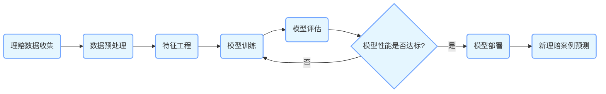

# AI驱动的保险理赔欺诈模式识别

> 关键词：AI、保险理赔欺诈、模式识别、机器学习、数据挖掘

> 摘要：本文围绕AI驱动的保险理赔欺诈模式识别展开深入探讨。首先介绍了保险理赔欺诈问题的背景，包括研究目的、预期读者等。接着阐述了核心概念，如保险理赔欺诈模式、AI识别技术等，并给出了原理和架构示意图。详细讲解了核心算法原理及操作步骤，通过Python代码进行示例。分析了相关数学模型和公式，并举例说明。结合项目实战，从开发环境搭建到代码实现与解读进行了全面说明。探讨了实际应用场景，推荐了学习资源、开发工具框架和相关论文著作。最后总结了未来发展趋势与挑战，提供了常见问题解答和扩展阅读参考资料，旨在为保险行业利用AI技术识别理赔欺诈提供全面的技术指导。

## 1. 背景介绍 
### 1.1 目的和范围
保险理赔欺诈是保险行业长期面临的严重问题，它不仅导致保险公司的经济损失，还破坏了保险市场的公平性和稳定性。据统计，全球每年因保险欺诈造成的损失高达数百亿美元。本研究的目的是利用AI技术识别保险理赔中的欺诈模式，减少保险公司的损失，提高保险业务的效率和公正性。

本研究的范围涵盖了常见的保险类型，如车险、健康险和财产险等。通过分析理赔数据中的各种特征，如索赔金额、索赔频率、事故描述等，运用机器学习和数据挖掘算法，构建欺诈模式识别模型。

### 1.2 预期读者
本文的预期读者包括保险行业的从业者，如理赔专员、风险管理人员和数据分析人员等，他们可以从中了解如何利用AI技术改进保险理赔流程，提高欺诈识别能力。同时，也适合对机器学习和数据挖掘在金融领域应用感兴趣的研究人员和学生，为他们提供实际案例和技术思路。

### 1.3 文档结构概述
本文将按照以下结构进行组织：首先介绍核心概念和它们之间的联系，包括保险理赔欺诈模式和AI识别技术的原理和架构；然后详细讲解核心算法原理和具体操作步骤，并给出Python代码示例；接着分析相关的数学模型和公式，并通过实际例子进行说明；再结合项目实战，介绍开发环境搭建、源代码实现和代码解读；探讨实际应用场景；推荐学习资源、开发工具框架和相关论文著作；最后总结未来发展趋势与挑战，提供常见问题解答和扩展阅读参考资料。

### 1.4 术语表
#### 1.4.1 核心术语定义
- **保险理赔欺诈**：指投保人、被保险人或受益人故意虚构保险事故、夸大损失程度或故意制造保险事故等手段，骗取保险金的行为。
- **模式识别**：是指对表征事物或现象的各种形式的（数值的、文字的和逻辑关系的）信息进行处理和分析，以对事物或现象进行描述、辨认、分类和解释的过程。
- **机器学习**：是一门多领域交叉学科，涉及概率论、统计学、逼近论、凸分析、算法复杂度理论等多门学科。它专门研究计算机怎样模拟或实现人类的学习行为，以获取新的知识或技能，重新组织已有的知识结构使之不断改善自身的性能。
- **数据挖掘**：是指从大量的数据中通过算法搜索隐藏于其中信息的过程。数据挖掘通常与计算机科学有关，并通过统计、在线分析处理、情报检索、机器学习、专家系统（依靠过去的经验法则）和模式识别等诸多方法来实现上述目标。

#### 1.4.2 相关概念解释
- **特征工程**：是指对原始数据进行预处理和转换，提取有价值的特征，以提高模型的性能。在保险理赔欺诈识别中，特征工程包括选择合适的理赔数据特征，如索赔金额、索赔频率、事故发生时间等，并对这些特征进行编码和标准化处理。
- **模型评估**：是指使用一定的评估指标和方法，对训练好的模型进行性能评估。常见的评估指标包括准确率、召回率、F1值等。在保险理赔欺诈识别中，模型评估的目的是判断模型是否能够准确地识别欺诈理赔案例。

#### 1.4.3 缩略词列表
- **AI**：Artificial Intelligence，人工智能
- **ML**：Machine Learning，机器学习
- **DM**：Data Mining，数据挖掘
- **ROC**：Receiver Operating Characteristic，受试者工作特征曲线
- **AUC**：Area Under the Curve，曲线下面积

## 2. 核心概念与联系 

### 核心概念原理
#### 保险理赔欺诈模式
保险理赔欺诈模式是指欺诈者在进行保险理赔时所表现出的一些具有规律性的行为特征。这些特征可以分为以下几类：
- **索赔频率异常**：欺诈者可能会频繁提出索赔申请，超出正常投保人的索赔频率。
- **索赔金额异常**：索赔金额过高或与实际损失不符，可能是欺诈的迹象。
- **事故描述不一致**：欺诈者可能会在事故描述中提供虚假信息，如事故发生时间、地点、原因等与实际情况不符。
- **关联索赔异常**：欺诈者可能会与其他欺诈者或相关利益方联合进行索赔，形成关联索赔异常。

#### AI识别技术
AI识别技术主要基于机器学习和数据挖掘算法，通过对大量的理赔数据进行学习和分析，构建欺诈模式识别模型。常见的机器学习算法包括决策树、随机森林、支持向量机、神经网络等。这些算法可以自动从数据中学习到欺诈模式的特征，并对新的理赔案例进行预测和判断。

### 架构示意图


该架构图展示了AI驱动的保险理赔欺诈模式识别的主要流程：首先收集理赔数据，然后进行数据预处理和特征工程，接着使用处理后的数据进行模型训练，训练完成后对模型进行评估。如果模型性能达标，则将模型部署到实际应用中，对新的理赔案例进行预测；如果模型性能不达标，则重新进行模型训练。

## 3. 核心算法原理 & 具体操作步骤 

### 核心算法原理
在保险理赔欺诈模式识别中，随机森林算法是一种常用且有效的机器学习算法。随机森林是由多个决策树组成的集成学习模型，它通过对多个决策树的结果进行综合，提高模型的准确性和稳定性。

随机森林的原理如下：
- **随机采样**：从原始数据集中随机有放回地抽取样本，形成多个不同的训练子集。每个训练子集用于训练一个决策树。
- **随机特征选择**：在每个决策树的节点分裂时，随机选择一部分特征进行考虑，而不是使用所有特征。这样可以增加决策树的多样性，减少过拟合的风险。
- **综合决策**：对于新的理赔案例，每个决策树都会给出一个预测结果，随机森林通过投票的方式综合所有决策树的预测结果，得出最终的预测结果。

### 具体操作步骤及Python代码示例
```python
import pandas as pd
from sklearn.model_selection import train_test_split
from sklearn.ensemble import RandomForestClassifier
from sklearn.metrics import accuracy_score, recall_score, f1_score

# 步骤1：数据加载
data = pd.read_csv('insurance_claims.csv')

# 步骤2：数据预处理
# 假设数据集中包含一些缺失值，使用均值填充
data.fillna(data.mean(), inplace=True)

# 步骤3：特征工程
# 选择一些可能与欺诈相关的特征
features = ['claim_amount', 'claim_frequency', 'accident_time']
X = data[features]
y = data['fraud_label']

# 步骤4：数据集划分
X_train, X_test, y_train, y_test = train_test_split(X, y, test_size=0.2, random_state=42)

# 步骤5：模型训练
rf_model = RandomForestClassifier(n_estimators=100, random_state=42)
rf_model.fit(X_train, y_train)

# 步骤6：模型预测
y_pred = rf_model.predict(X_test)

# 步骤7：模型评估
accuracy = accuracy_score(y_test, y_pred)
recall = recall_score(y_test, y_pred)
f1 = f1_score(y_test, y_pred)

print(f"Accuracy: {accuracy}")
print(f"Recall: {recall}")
print(f"F1-score: {f1}")
```

### 代码解释
1. **数据加载**：使用`pandas`库的`read_csv`函数加载保险理赔数据集。
2. **数据预处理**：使用均值填充数据集中的缺失值。
3. **特征工程**：选择一些可能与欺诈相关的特征，如索赔金额、索赔频率和事故发生时间等。将这些特征作为输入特征`X`，将欺诈标签作为目标变量`y`。
4. **数据集划分**：使用`train_test_split`函数将数据集划分为训练集和测试集，其中测试集占总数据集的20%。
5. **模型训练**：创建一个随机森林分类器，设置决策树的数量为100，并使用训练集对模型进行训练。
6. **模型预测**：使用训练好的模型对测试集进行预测。
7. **模型评估**：使用准确率、召回率和F1值等指标对模型的性能进行评估，并打印评估结果。

## 4. 数学模型和公式 & 详细讲解 & 举例说明 

### 随机森林中的数学模型和公式
#### 决策树的节点分裂准则
在随机森林中，每个决策树的节点分裂是基于某种准则进行的，常见的准则有信息增益、基尼不纯度等。

##### 信息增益
信息增益是衡量特征对分类结果的影响程度的指标。设数据集 $D$ 中包含 $n$ 个样本，属于 $k$ 个不同的类别，第 $i$ 个类别的样本数为 $n_i$，则数据集 $D$ 的信息熵为：
$$
H(D) = -\sum_{i=1}^{k} \frac{n_i}{n} \log_2 \frac{n_i}{n}
$$

设特征 $A$ 有 $v$ 个不同的取值 $\{a_1, a_2, \cdots, a_v\}$，根据特征 $A$ 的取值将数据集 $D$ 划分为 $v$ 个子集 $\{D_1, D_2, \cdots, D_v\}$，第 $j$ 个子集 $D_j$ 中包含的样本数为 $n_j$，则特征 $A$ 对数据集 $D$ 的信息增益为：
$$
IG(D, A) = H(D) - \sum_{j=1}^{v} \frac{n_j}{n} H(D_j)
$$

在决策树的节点分裂时，选择信息增益最大的特征作为分裂特征。

##### 基尼不纯度
基尼不纯度是另一种衡量数据集不纯度的指标。设数据集 $D$ 中包含 $n$ 个样本，属于 $k$ 个不同的类别，第 $i$ 个类别的样本数为 $n_i$，则数据集 $D$ 的基尼不纯度为：
$$
Gini(D) = 1 - \sum_{i=1}^{k} (\frac{n_i}{n})^2
$$

设特征 $A$ 有 $v$ 个不同的取值 $\{a_1, a_2, \cdots, a_v\}$，根据特征 $A$ 的取值将数据集 $D$ 划分为 $v$ 个子集 $\{D_1, D_2, \cdots, D_v\}$，第 $j$ 个子集 $D_j$ 中包含的样本数为 $n_j$，则特征 $A$ 对数据集 $D$ 的基尼指数为：
$$
Gini_index(D, A) = \sum_{j=1}^{v} \frac{n_j}{n} Gini(D_j)
$$

在决策树的节点分裂时，选择基尼指数最小的特征作为分裂特征。

#### 随机森林的综合决策
对于一个新的理赔案例 $x$，随机森林中的每个决策树 $T_i$ 都会给出一个预测结果 $y_i$。随机森林通过投票的方式综合所有决策树的预测结果，得出最终的预测结果 $\hat{y}$：
$$
\hat{y} = \arg \max_{c \in C} \sum_{i=1}^{N} I(y_i = c)
$$
其中，$C$ 是所有可能的类别集合，$N$ 是随机森林中决策树的数量，$I(y_i = c)$ 是指示函数，如果 $y_i = c$，则 $I(y_i = c) = 1$，否则 $I(y_i = c) = 0$。

### 举例说明
假设有一个保险理赔数据集，包含100个样本，其中欺诈样本有30个，非欺诈样本有70个。数据集的信息熵为：
$$
H(D) = -\frac{30}{100} \log_2 \frac{30}{100} - \frac{70}{100} \log_2 \frac{70}{100} \approx 0.881
$$

假设我们有一个特征 $A$，它有两个取值 $a_1$ 和 $a_2$。根据特征 $A$ 的取值将数据集 $D$ 划分为两个子集 $D_1$ 和 $D_2$，其中 $D_1$ 包含40个样本，其中欺诈样本有10个，非欺诈样本有30个；$D_2$ 包含60个样本，其中欺诈样本有20个，非欺诈样本有40个。则子集 $D_1$ 和 $D_2$ 的信息熵分别为：
$$
H(D_1) = -\frac{10}{40} \log_2 \frac{10}{40} - \frac{30}{40} \log_2 \frac{30}{40} \approx 0.811
$$
$$
H(D_2) = -\frac{20}{60} \log_2 \frac{20}{60} - \frac{40}{60} \log_2 \frac{40}{60} \approx 0.918
$$

特征 $A$ 对数据集 $D$ 的信息增益为：
$$
IG(D, A) = H(D) - \frac{40}{100} H(D_1) - \frac{60}{100} H(D_2) \approx 0.881 - 0.4 \times 0.811 - 0.6 \times 0.918 \approx 0.029
$$

假设我们使用随机森林对一个新的理赔案例进行预测，随机森林中有10个决策树，其中有7个决策树预测该案例为欺诈案例，3个决策树预测该案例为非欺诈案例。则最终的预测结果为欺诈案例。

## 5. 项目实战：代码实际案例和详细解释说明 

### 5.1  开发环境搭建
#### 安装Python
首先，需要安装Python环境。建议使用Python 3.7及以上版本。可以从Python官方网站（https://www.python.org/downloads/）下载并安装适合自己操作系统的Python版本。

#### 安装必要的库
在安装好Python后，需要安装一些必要的库，如`pandas`、`numpy`、`scikit-learn`等。可以使用`pip`命令进行安装：
```sh
pip install pandas numpy scikit-learn
```

### 5.2  源代码详细实现和代码解读
```python
import pandas as pd
from sklearn.model_selection import train_test_split
from sklearn.ensemble import RandomForestClassifier
from sklearn.metrics import accuracy_score, recall_score, f1_score

# 步骤1：数据加载
data = pd.read_csv('insurance_claims.csv')

# 步骤2：数据预处理
# 处理缺失值
data.fillna(data.mean(), inplace=True)

# 处理类别特征
categorical_features = ['claim_type', 'accident_location']
data = pd.get_dummies(data, columns=categorical_features)

# 步骤3：特征工程
# 选择特征
features = [col for col in data.columns if col!= 'fraud_label']
X = data[features]
y = data['fraud_label']

# 步骤4：数据集划分
X_train, X_test, y_train, y_test = train_test_split(X, y, test_size=0.2, random_state=42)

# 步骤5：模型训练
rf_model = RandomForestClassifier(n_estimators=100, random_state=42)
rf_model.fit(X_train, y_train)

# 步骤6：模型预测
y_pred = rf_model.predict(X_test)

# 步骤7：模型评估
accuracy = accuracy_score(y_test, y_pred)
recall = recall_score(y_test, y_pred)
f1 = f1_score(y_test, y_pred)

print(f"Accuracy: {accuracy}")
print(f"Recall: {recall}")
print(f"F1-score: {f1}")
```

### 代码解读与分析
#### 数据加载
使用`pandas`库的`read_csv`函数加载保险理赔数据集。

#### 数据预处理
- **处理缺失值**：使用均值填充数据集中的缺失值。
- **处理类别特征**：使用`pandas`的`get_dummies`函数对类别特征进行独热编码，将类别特征转换为数值特征。

#### 特征工程
选择除欺诈标签以外的所有特征作为输入特征`X`，将欺诈标签作为目标变量`y`。

#### 数据集划分
使用`train_test_split`函数将数据集划分为训练集和测试集，其中测试集占总数据集的20%。

#### 模型训练
创建一个随机森林分类器，设置决策树的数量为100，并使用训练集对模型进行训练。

#### 模型预测
使用训练好的模型对测试集进行预测。

#### 模型评估
使用准确率、召回率和F1值等指标对模型的性能进行评估，并打印评估结果。

## 6. 实际应用场景 
### 车险理赔欺诈识别
在车险理赔中，欺诈行为较为常见，如故意制造事故、夸大损失程度等。通过AI驱动的保险理赔欺诈模式识别技术，可以对车险理赔数据进行实时分析，识别出可能存在欺诈的理赔案例。例如，分析事故发生的时间、地点、碰撞痕迹等特征，判断是否符合正常的事故规律；对比不同修理厂的维修报价，发现异常的高额维修费用。

### 健康险理赔欺诈识别
健康险理赔欺诈包括虚构疾病、冒名顶替就医、过度医疗等行为。利用AI技术可以对健康险理赔数据进行深入挖掘，识别欺诈模式。例如，分析患者的就医记录、诊断结果、用药情况等，判断是否存在不合理的医疗行为；通过关联分析患者的社交网络和医疗数据，发现可能的欺诈团伙。

### 财产险理赔欺诈识别
财产险理赔欺诈主要表现为故意损坏财产、虚报财产损失等。AI驱动的识别技术可以对财产险理赔数据进行分析，识别欺诈迹象。例如，分析财产损失的原因、程度、修复费用等特征，判断是否存在夸大损失的情况；对比不同保险公司的理赔数据，发现异常的理赔模式。

## 7. 工具和资源推荐
### 7.1 学习资源推荐
#### 7.1.1 书籍推荐
- 《机器学习》（周志华）：这本书是机器学习领域的经典教材，全面介绍了机器学习的基本概念、算法和应用。
- 《Python机器学习实战》（Sebastian Raschka）：通过实际案例介绍了如何使用Python进行机器学习，适合初学者。
- 《数据挖掘：概念与技术》（Jiawei Han）：系统介绍了数据挖掘的基本概念、算法和应用，是数据挖掘领域的权威著作。

#### 7.1.2 在线课程
- Coursera上的“机器学习”课程（Andrew Ng教授授课）：这是一门非常经典的机器学习课程，涵盖了机器学习的基本概念、算法和应用。
- edX上的“数据科学与机器学习微硕士学位课程”：提供了系统的数据科学和机器学习课程，适合深入学习。
- 中国大学MOOC上的“人工智能基础”课程：介绍了人工智能的基本概念、算法和应用，适合初学者。

#### 7.1.3 技术博客和网站
- Kaggle（https://www.kaggle.com/）：一个数据科学和机器学习竞赛平台，提供了大量的数据集和优秀的解决方案。
- Towards Data Science（https://towardsdatascience.com/）：一个专注于数据科学和机器学习的技术博客，发布了许多高质量的技术文章。
- 机器之心（https://www.alldatasheet.com/）：提供了人工智能领域的最新技术动态和研究成果。

### 7.2 开发工具框架推荐
#### 7.2.1 IDE和编辑器
- PyCharm：一个功能强大的Python集成开发环境，提供了代码编辑、调试、版本控制等功能。
- Jupyter Notebook：一个交互式的笔记本环境，适合进行数据探索和模型开发。
- Visual Studio Code：一个轻量级的代码编辑器，支持多种编程语言，并且有丰富的扩展插件。

#### 7.2.2 调试和性能分析工具
- TensorBoard：一个用于可视化深度学习模型训练过程的工具，可以帮助用户分析模型的性能和训练过程。
- Scikit-learn的`cross_val_score`函数：可以用于模型的交叉验证和性能评估。
- PyTorch的`torch.utils.bottleneck`：可以用于分析PyTorch代码的性能瓶颈。

#### 7.2.3 相关框架和库
- Scikit-learn：一个简单易用的机器学习库，提供了丰富的机器学习算法和工具。
- TensorFlow：一个开源的深度学习框架，广泛应用于图像识别、自然语言处理等领域。
- PyTorch：一个基于Python的深度学习框架，具有动态图的优势，适合快速开发和研究。

### 7.3 相关论文著作推荐
#### 7.3.1 经典论文
- “Random Forests”（Leo Breiman）：随机森林算法的经典论文，详细介绍了随机森林的原理和算法。
- “Support Vector Machines”（Corinna Cortes and Vladimir Vapnik）：支持向量机算法的经典论文，介绍了支持向量机的基本原理和应用。
- “Neural Networks and Deep Learning”（Michael Nielsen）：一本关于神经网络和深度学习的在线书籍，系统介绍了神经网络和深度学习的基本概念、算法和应用。

#### 7.3.2 最新研究成果
- 在ACM SIGKDD、IEEE ICDM等数据挖掘顶级会议上发表的关于保险理赔欺诈识别的最新研究成果。
- 在Journal of Insurance Medicine、Risk Management and Insurance Review等保险领域期刊上发表的相关研究论文。

#### 7.3.3 应用案例分析
- 保险公司发布的关于AI驱动的保险理赔欺诈识别的应用案例报告，介绍了实际应用中的经验和效果。
- 咨询公司发布的关于保险行业数字化转型和欺诈风险管理的研究报告，提供了行业趋势和案例分析。

## 8. 总结：未来发展趋势与挑战
### 未来发展趋势
#### 多模态数据融合
未来的保险理赔欺诈模式识别将不仅仅依赖于理赔数据，还会融合更多的多模态数据，如图像、视频、音频等。例如，在车险理赔中，可以通过分析事故现场的照片和视频，更准确地判断事故的真实性和损失程度；在健康险理赔中，可以通过分析患者的语音和影像数据，辅助诊断疾病和识别欺诈行为。

#### 深度学习的广泛应用
深度学习在图像识别、自然语言处理等领域取得了巨大的成功，未来将在保险理赔欺诈识别中得到更广泛的应用。深度学习模型可以自动从大量的数据中学习到复杂的欺诈模式，提高识别的准确性和效率。例如，使用卷积神经网络（CNN）对事故现场的图像进行分析，使用循环神经网络（RNN）对理赔文本进行处理。

#### 实时监测和预警
随着保险业务的数字化和实时化，未来的保险理赔欺诈模式识别将更加注重实时监测和预警。通过实时分析理赔数据和业务流程，及时发现潜在的欺诈风险，并发出预警信号，帮助保险公司采取及时的措施，减少损失。

### 挑战
#### 数据质量和隐私问题
保险理赔数据往往存在数据质量不高、数据缺失、数据错误等问题，这会影响模型的训练和性能。同时，保险理赔数据涉及到大量的个人隐私信息，如何在保护数据隐私的前提下，有效地利用数据进行欺诈识别是一个重要的挑战。

#### 模型可解释性
深度学习模型虽然在识别准确率上表现出色，但往往是一个“黑盒”模型，难以解释其决策过程和依据。在保险理赔欺诈识别中，模型的可解释性非常重要，因为保险公司需要向客户解释为什么拒绝理赔或进行调查。因此，如何提高模型的可解释性是一个亟待解决的问题。

#### 欺诈手段的不断变化
欺诈者的手段不断变化和升级，新的欺诈模式不断涌现。保险理赔欺诈模式识别模型需要不断地更新和优化，以适应新的欺诈手段。这需要保险公司和研究人员不断地关注欺诈行为的变化趋势，及时调整和改进识别模型。

## 9. 附录：常见问题与解答
### 问题1：如何选择合适的特征进行保险理赔欺诈模式识别？
答：选择合适的特征需要结合保险业务的特点和经验。一般来说，可以从索赔频率、索赔金额、事故描述、投保人信息等方面选择特征。同时，还可以使用特征选择算法，如相关性分析、卡方检验等，筛选出与欺诈行为相关性较高的特征。

### 问题2：如何处理保险理赔数据中的缺失值？
答：处理缺失值的方法有多种，常见的方法包括删除含有缺失值的样本、使用均值或中位数填充缺失值、使用插值法填充缺失值等。具体选择哪种方法需要根据数据的特点和模型的要求来决定。

### 问题3：如何评估保险理赔欺诈模式识别模型的性能？
答：可以使用多种评估指标来评估模型的性能，如准确率、召回率、F1值、ROC曲线和AUC值等。准确率表示模型预测正确的样本占总样本的比例；召回率表示模型正确预测出的欺诈样本占实际欺诈样本的比例；F1值是准确率和召回率的调和平均值；ROC曲线和AUC值可以综合评估模型在不同阈值下的性能。

### 问题4：如何解决保险理赔欺诈模式识别模型的过拟合问题？
答：解决过拟合问题的方法有多种，常见的方法包括增加训练数据、减少模型复杂度、使用正则化方法等。增加训练数据可以让模型学习到更多的样本特征，减少过拟合的风险；减少模型复杂度可以避免模型过于复杂而拟合噪声数据；使用正则化方法可以对模型的参数进行约束，防止模型过拟合。

## 10. 扩展阅读 & 参考资料
### 扩展阅读
- 《人工智能：现代方法》（Stuart Russell and Peter Norvig）：一本全面介绍人工智能的经典教材，涵盖了人工智能的各个领域和方法。
- 《大数据时代：生活、工作与思维的大变革》（维克托·迈尔 - 舍恩伯格）：介绍了大数据的概念、特点和应用，以及大数据对社会和经济的影响。
- 《创新者的窘境》（克莱顿·克里斯坦森）：探讨了创新和技术变革对企业的影响，以及企业如何应对创新挑战。

### 参考资料
- 各保险公司的官方网站和年报，获取保险理赔数据和业务信息。
- 相关的学术期刊和会议论文，如ACM SIGKDD、IEEE ICDM、Journal of Insurance Medicine等。
- 政府部门和行业协会发布的统计数据和报告，如中国保险监督管理委员会发布的保险行业统计数据。

作者：AI天才研究院/AI Genius Institute & 禅与计算机程序设计艺术 /Zen And The Art of Computer Programming