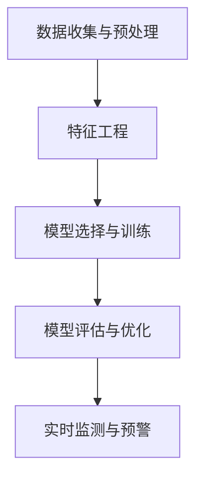

# AI驱动的信用卡fraud检测模型

> 关键词：AI、信用卡欺诈检测、机器学习、深度学习、数据挖掘、模型评估、风险防范

> 摘要：本文聚焦于AI驱动的信用卡欺诈检测模型。随着信用卡的广泛使用，欺诈行为日益增多，传统检测方法难以应对复杂多变的欺诈手段。AI技术为解决这一问题提供了强大的工具。文章详细介绍了信用卡欺诈检测的背景，包括目的、预期读者、文档结构和相关术语。阐述了核心概念及联系，通过文本示意图和Mermaid流程图进行直观展示。深入分析了核心算法原理，并用Python代码详细阐述。介绍了相关数学模型和公式，并举例说明。通过项目实战，展示了开发环境搭建、源代码实现与解读。探讨了实际应用场景，推荐了学习资源、开发工具框架和相关论文著作。最后总结了未来发展趋势与挑战，提供了常见问题解答和扩展阅读参考资料，旨在为信用卡欺诈检测领域的研究和实践提供全面的指导。

## 1. 背景介绍 
### 1.1 目的和范围
信用卡作为一种便捷的支付工具，在全球范围内得到了广泛应用。然而，信用卡欺诈问题也随之而来，给银行、金融机构和持卡人带来了巨大的经济损失。传统的信用卡欺诈检测方法主要基于规则和经验，难以适应日益复杂多变的欺诈手段。AI技术的发展为信用卡欺诈检测提供了新的思路和方法。本文的目的是介绍AI驱动的信用卡欺诈检测模型，包括其核心概念、算法原理、数学模型、项目实战等方面，旨在帮助读者深入理解和应用这些模型，提高信用卡欺诈检测的准确性和效率。本文的范围涵盖了常见的机器学习和深度学习算法在信用卡欺诈检测中的应用，以及相关的技术和工具。

### 1.2 预期读者
本文的预期读者包括金融科技领域的从业者，如银行风险管理人员、数据分析师、算法工程师等；对机器学习和深度学习在金融领域应用感兴趣的研究人员和学生；以及关注信用卡安全和风险防范的普通读者。

### 1.3 文档结构概述
本文共分为十个部分。第一部分为背景介绍，包括目的和范围、预期读者、文档结构概述和术语表。第二部分介绍核心概念与联系，通过文本示意图和Mermaid流程图展示相关概念的原理和架构。第三部分详细讲解核心算法原理，并使用Python源代码进行具体阐述。第四部分介绍数学模型和公式，并通过举例进行详细说明。第五部分进行项目实战，包括开发环境搭建、源代码详细实现和代码解读。第六部分探讨实际应用场景。第七部分推荐学习资源、开发工具框架和相关论文著作。第八部分总结未来发展趋势与挑战。第九部分为附录，提供常见问题与解答。第十部分列出扩展阅读和参考资料。

### 1.4 术语表
#### 1.4.1 核心术语定义
- **信用卡欺诈（Credit Card Fraud）**：指未经持卡人授权，使用信用卡进行非法交易的行为，包括盗刷、冒用、伪造等。
- **AI（Artificial Intelligence）**：即人工智能，是研究、开发用于模拟、延伸和扩展人的智能的理论、方法、技术及应用系统的一门新的技术科学。
- **机器学习（Machine Learning）**：是一门多领域交叉学科，涉及概率论、统计学、逼近论、凸分析、算法复杂度理论等多门学科。它专门研究计算机怎样模拟或实现人类的学习行为，以获取新的知识或技能，重新组织已有的知识结构使之不断改善自身的性能。
- **深度学习（Deep Learning）**：是机器学习的一个分支领域，它是一种基于对数据进行表征学习的方法。深度学习通过构建具有很多层的神经网络模型，自动从大量数据中学习特征和模式。
- **数据挖掘（Data Mining）**：是指从大量的数据中通过算法搜索隐藏于其中信息的过程。数据挖掘通常与计算机科学有关，并通过统计、在线分析处理、情报检索、机器学习、专家系统（依靠过去的经验法则）和模式识别等诸多方法来实现上述目标。

#### 1.4.2 相关概念解释
- **特征工程（Feature Engineering）**：是指从原始数据中提取特征，并将其转换为适合机器学习算法处理的格式的过程。在信用卡欺诈检测中，特征工程包括选择和提取与欺诈行为相关的特征，如交易金额、交易时间、交易地点等。
- **模型评估（Model Evaluation）**：是指使用评估指标来衡量机器学习模型性能的过程。在信用卡欺诈检测中，常用的评估指标包括准确率、召回率、F1值、ROC曲线和AUC值等。
- **过拟合（Overfitting）**：是指机器学习模型在训练数据上表现良好，但在测试数据上表现不佳的现象。过拟合通常是由于模型过于复杂，学习了训练数据中的噪声和异常值导致的。
- **欠拟合（Underfitting）**：是指机器学习模型在训练数据和测试数据上都表现不佳的现象。欠拟合通常是由于模型过于简单，无法学习到数据中的复杂模式导致的。

#### 1.4.3 缩略词列表
- **ROC（Receiver Operating Characteristic）**：受试者工作特征曲线，是一种用于评估二分类模型性能的图形化方法。
- **AUC（Area Under the Curve）**：曲线下面积，是ROC曲线下的面积，用于衡量二分类模型的性能。
- **FPR（False Positive Rate）**：假阳性率，是指模型将正常交易误判为欺诈交易的比例。
- **TPR（True Positive Rate）**：真阳性率，是指模型将欺诈交易正确判为欺诈交易的比例。
- **LR（Logistic Regression）**：逻辑回归，是一种常用的二分类机器学习算法。
- **SVM（Support Vector Machine）**：支持向量机，是一种常用的机器学习算法，可用于分类和回归问题。
- **RF（Random Forest）**：随机森林，是一种集成学习算法，由多个决策树组成。
- **DNN（Deep Neural Network）**：深度神经网络，是一种具有多个隐藏层的神经网络模型。

## 2. 核心概念与联系 

### 核心概念原理
在AI驱动的信用卡欺诈检测模型中，主要涉及以下几个核心概念：

#### 数据收集与预处理
首先需要收集大量的信用卡交易数据，这些数据包括交易时间、交易金额、交易地点、持卡人信息等。收集到的数据可能存在缺失值、异常值等问题，需要进行预处理。预处理的步骤包括数据清洗、数据归一化、数据编码等。数据清洗是指去除数据中的噪声和异常值；数据归一化是指将数据缩放到一个特定的范围内，以便于机器学习算法处理；数据编码是指将非数值型数据转换为数值型数据。

#### 特征工程
特征工程是信用卡欺诈检测的关键步骤之一。通过对原始数据进行特征提取和选择，可以得到与欺诈行为相关的特征。特征提取是指从原始数据中提取新的特征，例如计算交易的频率、交易的时间间隔等；特征选择是指从所有特征中选择最具有代表性和区分度的特征，以减少模型的复杂度和提高模型的性能。

#### 模型选择与训练
根据数据的特点和问题的需求，选择合适的机器学习或深度学习模型。常见的模型包括逻辑回归、支持向量机、随机森林、深度神经网络等。选择好模型后，使用预处理后的数据对模型进行训练。训练的过程是通过优化模型的参数，使得模型在训练数据上的损失函数最小化。

#### 模型评估与优化
使用评估指标对训练好的模型进行评估，评估指标包括准确率、召回率、F1值、ROC曲线和AUC值等。根据评估结果，对模型进行优化，例如调整模型的参数、更换模型结构、增加训练数据等。

#### 实时监测与预警
将训练好的模型部署到实际应用中，对实时的信用卡交易数据进行监测。当检测到可能的欺诈交易时，及时发出预警，通知银行或持卡人进行处理。

### 架构的文本示意图
```plaintext
+------------------+
|  数据收集与预处理  |
+------------------+
         |
         v
+------------------+
|    特征工程       |
+------------------+
         |
         v
+------------------+
|  模型选择与训练  |
+------------------+
         |
         v
+------------------+
|  模型评估与优化  |
+------------------+
         |
         v
+------------------+
|  实时监测与预警  |
+------------------+
```

### Mermaid流程图


## 3. 核心算法原理 & 具体操作步骤 

### 逻辑回归（Logistic Regression）
#### 原理
逻辑回归是一种常用的二分类机器学习算法，用于预测一个样本属于某个类别的概率。逻辑回归的基本思想是通过一个逻辑函数将线性回归的输出映射到[0, 1]之间，从而得到样本属于某个类别的概率。逻辑函数的表达式为：

$$\sigma(z)=\frac{1}{1 + e^{-z}}$$

其中，$z$ 是线性回归的输出，$\sigma(z)$ 是逻辑函数的输出。

逻辑回归的模型可以表示为：

$$P(y = 1|x)=\sigma(w^T x + b)$$

其中，$x$ 是输入特征向量，$w$ 是权重向量，$b$ 是偏置项，$P(y = 1|x)$ 是样本 $x$ 属于正类的概率。

#### Python代码实现
```python
import numpy as np
from sklearn.linear_model import LogisticRegression
from sklearn.model_selection import train_test_split
from sklearn.metrics import accuracy_score

# 生成示例数据
X = np.random.rand(100, 5)
y = np.random.randint(0, 2, 100)

# 划分训练集和测试集
X_train, X_test, y_train, y_test = train_test_split(X, y, test_size=0.2, random_state=42)

# 创建逻辑回归模型
model = LogisticRegression()

# 训练模型
model.fit(X_train, y_train)

# 预测
y_pred = model.predict(X_test)

# 评估模型
accuracy = accuracy_score(y_test, y_pred)
print(f"Accuracy: {accuracy}")
```

### 支持向量机（Support Vector Machine）
#### 原理
支持向量机是一种常用的机器学习算法，可用于分类和回归问题。在二分类问题中，支持向量机的目标是找到一个最优的超平面，将不同类别的样本分开，并且使得超平面到最近样本点的距离最大。这个距离称为间隔，支持向量机的目标就是最大化间隔。

支持向量机的数学模型可以表示为：

$$\min_{w,b}\frac{1}{2}\|w\|^2$$

subject to

$$y_i(w^T x_i + b)\geq 1, i = 1,2,\cdots,n$$

其中，$w$ 是超平面的法向量，$b$ 是偏置项，$x_i$ 是第 $i$ 个样本的特征向量，$y_i$ 是第 $i$ 个样本的标签。

#### Python代码实现
```python
from sklearn.svm import SVC
from sklearn.model_selection import train_test_split
from sklearn.metrics import accuracy_score
import numpy as np

# 生成示例数据
X = np.random.rand(100, 5)
y = np.random.randint(0, 2, 100)

# 划分训练集和测试集
X_train, X_test, y_train, y_test = train_test_split(X, y, test_size=0.2, random_state=42)

# 创建支持向量机模型
model = SVC()

# 训练模型
model.fit(X_train, y_train)

# 预测
y_pred = model.predict(X_test)

# 评估模型
accuracy = accuracy_score(y_test, y_pred)
print(f"Accuracy: {accuracy}")
```

### 随机森林（Random Forest）
#### 原理
随机森林是一种集成学习算法，由多个决策树组成。随机森林的基本思想是通过对训练数据进行随机抽样和特征随机选择，构建多个决策树，然后将这些决策树的预测结果进行综合，得到最终的预测结果。

随机森林的优点是可以处理高维数据，对缺失值和异常值具有较好的鲁棒性，并且可以并行计算。

#### Python代码实现
```python
from sklearn.ensemble import RandomForestClassifier
from sklearn.model_selection import train_test_split
from sklearn.metrics import accuracy_score
import numpy as np

# 生成示例数据
X = np.random.rand(100, 5)
y = np.random.randint(0, 2, 100)

# 划分训练集和测试集
X_train, X_test, y_train, y_test = train_test_split(X, y, test_size=0.2, random_state=42)

# 创建随机森林模型
model = RandomForestClassifier()

# 训练模型
model.fit(X_train, y_train)

# 预测
y_pred = model.predict(X_test)

# 评估模型
accuracy = accuracy_score(y_test, y_pred)
print(f"Accuracy: {accuracy}")
```

### 深度神经网络（Deep Neural Network）
#### 原理
深度神经网络是一种具有多个隐藏层的神经网络模型。深度神经网络可以自动从大量数据中学习特征和模式，具有很强的表达能力。

深度神经网络的基本结构包括输入层、隐藏层和输出层。输入层接收输入数据，隐藏层对输入数据进行特征提取和转换，输出层输出最终的预测结果。

深度神经网络的训练过程通常使用反向传播算法，通过不断调整网络的权重和偏置，使得网络的输出与真实标签之间的损失函数最小化。

#### Python代码实现
```python
import tensorflow as tf
from tensorflow.keras.models import Sequential
from tensorflow.keras.layers import Dense
from sklearn.model_selection import train_test_split
import numpy as np

# 生成示例数据
X = np.random.rand(100, 5)
y = np.random.randint(0, 2, 100)

# 划分训练集和测试集
X_train, X_test, y_train, y_test = train_test_split(X, y, test_size=0.2, random_state=42)

# 创建深度神经网络模型
model = Sequential([
    Dense(10, activation='relu', input_shape=(5,)),
    Dense(1, activation='sigmoid')
])

# 编译模型
model.compile(optimizer='adam', loss='binary_crossentropy', metrics=['accuracy'])

# 训练模型
model.fit(X_train, y_train, epochs=10, batch_size=32, validation_data=(X_test, y_test))

# 评估模型
_, accuracy = model.evaluate(X_test, y_test)
print(f"Accuracy: {accuracy}")
```

## 4. 数学模型和公式 & 详细讲解 & 举例说明 

### 逻辑回归的损失函数
逻辑回归通常使用对数损失函数（Log Loss），也称为交叉熵损失函数（Cross-Entropy Loss）。对数损失函数的表达式为：

$$L(y, \hat{y})=-\frac{1}{n}\sum_{i = 1}^{n}[y_i\log(\hat{y}_i)+(1 - y_i)\log(1 - \hat{y}_i)]$$

其中，$y_i$ 是第 $i$ 个样本的真实标签，$\hat{y}_i$ 是第 $i$ 个样本的预测概率，$n$ 是样本数量。

对数损失函数的意义是衡量模型预测的概率分布与真实标签的概率分布之间的差异。当模型的预测结果与真实标签完全一致时，对数损失函数的值为0；当模型的预测结果与真实标签完全相反时，对数损失函数的值趋近于正无穷。

**举例说明**：假设有一个二分类问题，样本数量 $n = 3$，真实标签 $y = [1, 0, 1]$，预测概率 $\hat{y} = [0.8, 0.2, 0.6]$。则对数损失函数的值为：

$$L(y, \hat{y})=-\frac{1}{3}[(1\times\log(0.8)+(1 - 1)\times\log(1 - 0.8))+(0\times\log(0.2)+(1 - 0)\times\log(1 - 0.2))+(1\times\log(0.6)+(1 - 1)\times\log(1 - 0.6))]$$

```python
import numpy as np

y = np.array([1, 0, 1])
y_hat = np.array([0.8, 0.2, 0.6])

loss = -np.mean(y * np.log(y_hat) + (1 - y) * np.log(1 - y_hat))
print(f"Log Loss: {loss}")
```

### 支持向量机的对偶问题
支持向量机的原始问题是一个二次规划问题，求解起来比较复杂。为了简化求解过程，可以将原始问题转换为对偶问题。支持向量机的对偶问题可以表示为：

$$\max_{\alpha}\sum_{i = 1}^{n}\alpha_i-\frac{1}{2}\sum_{i = 1}^{n}\sum_{j = 1}^{n}\alpha_i\alpha_jy_iy_jK(x_i, x_j)$$

subject to

$$\sum_{i = 1}^{n}\alpha_iy_i = 0$$

$$0\leq\alpha_i\leq C, i = 1,2,\cdots,n$$

其中，$\alpha_i$ 是拉格朗日乘子，$K(x_i, x_j)$ 是核函数，$C$ 是惩罚参数。

核函数的作用是将低维空间中的数据映射到高维空间中，使得数据在高维空间中更容易被分开。常见的核函数包括线性核函数、多项式核函数、高斯核函数等。

**举例说明**：假设有一个二维空间中的二分类问题，数据点如下：

```python
import numpy as np

X = np.array([[1, 2], [2, 3], [3, 1], [4, 2]])
y = np.array([1, 1, -1, -1])
```

使用线性核函数 $K(x_i, x_j)=x_i^T x_j$，可以将支持向量机的对偶问题表示为一个二次规划问题，然后使用Python的`cvxopt`库进行求解。

```python
from cvxopt import matrix, solvers

# 计算核矩阵
n_samples = X.shape[0]
K = np.zeros((n_samples, n_samples))
for i in range(n_samples):
    for j in range(n_samples):
        K[i, j] = np.dot(X[i], X[j])

# 构建二次规划问题的参数
P = matrix(np.outer(y, y) * K)
q = matrix(-np.ones((n_samples, 1)))
A = matrix(y.reshape(1, -1))
b = matrix(np.zeros(1))
G = matrix(-np.eye(n_samples))
h = matrix(np.zeros(n_samples))

# 求解二次规划问题
sol = solvers.qp(P, q, G, h, A, b)
alpha = np.ravel(sol['x'])
print(f"Alpha: {alpha}")
```

### 随机森林的决策树生成
随机森林中的每一棵决策树都是通过对训练数据进行随机抽样和特征随机选择生成的。决策树的生成过程通常使用贪心算法，通过递归地选择最优的特征和划分点，将数据集划分为不同的子集，直到满足停止条件。

决策树的节点划分通常使用信息增益、信息增益比、基尼指数等指标来衡量划分的优劣。以信息增益为例，信息增益的计算公式为：

$$IG(D, A)=H(D)-H(D|A)$$

其中，$D$ 是数据集，$A$ 是特征，$H(D)$ 是数据集 $D$ 的熵，$H(D|A)$ 是在特征 $A$ 条件下数据集 $D$ 的条件熵。

熵的计算公式为：

$$H(D)=-\sum_{k = 1}^{K}\frac{|C_k|}{|D|}\log_2\frac{|C_k|}{|D|}$$

其中，$K$ 是类别数，$C_k$ 是第 $k$ 个类别，$|C_k|$ 是第 $k$ 个类别的样本数量，$|D|$ 是数据集 $D$ 的样本数量。

条件熵的计算公式为：

$$H(D|A)=\sum_{i = 1}^{V}\frac{|D_i|}{|D|}H(D_i)$$

其中，$V$ 是特征 $A$ 的取值个数，$D_i$ 是特征 $A$ 取值为第 $i$ 个值的子集。

**举例说明**：假设有一个简单的数据集，包含两个特征和一个类别标签：

```python
import pandas as pd

data = {
    'Outlook': ['Sunny', 'Sunny', 'Overcast', 'Rain', 'Rain', 'Rain', 'Overcast', 'Sunny', 'Sunny', 'Rain', 'Sunny', 'Overcast', 'Overcast', 'Rain'],
    'Temperature': ['Hot', 'Hot', 'Hot', 'Mild', 'Cool', 'Cool', 'Cool', 'Mild', 'Cool', 'Mild', 'Mild', 'Mild', 'Hot', 'Mild'],
    'Play': ['No', 'No', 'Yes', 'Yes', 'Yes', 'No', 'Yes', 'No', 'Yes', 'Yes', 'Yes', 'Yes', 'Yes', 'No']
}

df = pd.DataFrame(data)
```

计算特征`Outlook`的信息增益：

```python
import math

# 计算数据集的熵
def entropy(y):
    classes = set(y)
    entropy = 0
    n = len(y)
    for c in classes:
        p = len(y[y == c]) / n
        entropy -= p * math.log2(p)
    return entropy

# 计算条件熵
def conditional_entropy(X, y, feature):
    values = set(X[feature])
    conditional_entropy = 0
    n = len(y)
    for v in values:
        subset_y = y[X[feature] == v]
        p = len(subset_y) / n
        conditional_entropy += p * entropy(subset_y)
    return conditional_entropy

# 计算信息增益
def information_gain(X, y, feature):
    return entropy(y) - conditional_entropy(X, y, feature)

ig = information_gain(df.drop('Play', axis=1), df['Play'], 'Outlook')
print(f"Information Gain of Outlook: {ig}")
```

### 深度神经网络的反向传播算法
深度神经网络的训练过程通常使用反向传播算法，通过不断调整网络的权重和偏置，使得网络的输出与真实标签之间的损失函数最小化。反向传播算法的基本思想是通过链式法则，从输出层开始，逐层计算损失函数对每个权重和偏置的梯度，然后根据梯度下降法更新权重和偏置。

以一个简单的三层神经网络为例，假设输入层有 $n$ 个神经元，隐藏层有 $m$ 个神经元，输出层有 $k$ 个神经元。输入层到隐藏层的权重矩阵为 $W_1$，偏置向量为 $b_1$；隐藏层到输出层的权重矩阵为 $W_2$，偏置向量为 $b_2$。

前向传播过程：

$$z_1 = W_1x + b_1$$

$$a_1 = f(z_1)$$

$$z_2 = W_2a_1 + b_2$$

$$a_2 = f(z_2)$$

其中，$x$ 是输入向量，$f$ 是激活函数，$a_1$ 是隐藏层的输出，$a_2$ 是输出层的输出。

反向传播过程：

$$\delta_2 = \frac{\partial L}{\partial z_2}$$

$$\frac{\partial L}{\partial W_2}=\delta_2a_1^T$$

$$\frac{\partial L}{\partial b_2}=\delta_2$$

$$\delta_1 = W_2^T\delta_2\odot f'(z_1)$$

$$\frac{\partial L}{\partial W_1}=\delta_1x^T$$

$$\frac{\partial L}{\partial b_1}=\delta_1$$

其中，$L$ 是损失函数，$\odot$ 是逐元素相乘，$f'$ 是激活函数的导数。

**举例说明**：假设有一个简单的三层神经网络，输入层有2个神经元，隐藏层有3个神经元，输出层有1个神经元。使用Python实现反向传播算法：

```python
import numpy as np

# 定义激活函数和其导数
def sigmoid(x):
    return 1 / (1 + np.exp(-x))

def sigmoid_derivative(x):
    return sigmoid(x) * (1 - sigmoid(x))

# 定义输入数据和真实标签
X = np.array([[0, 0], [0, 1], [1, 0], [1, 1]])
y = np.array([[0], [1], [1], [0]])

# 初始化权重和偏置
np.random.seed(42)
W1 = np.random.rand(2, 3)
b1 = np.zeros((1, 3))
W2 = np.random.rand(3, 1)
b2 = np.zeros((1, 1))

# 训练参数
learning_rate = 0.1
epochs = 10000

# 训练过程
for epoch in range(epochs):
    # 前向传播
    z1 = np.dot(X, W1) + b1
    a1 = sigmoid(z1)
    z2 = np.dot(a1, W2) + b2
    a2 = sigmoid(z2)

    # 计算损失
    loss = np.mean((a2 - y) ** 2)

    # 反向传播
    delta2 = (a2 - y) * sigmoid_derivative(z2)
    dW2 = np.dot(a1.T, delta2)
    db2 = np.sum(delta2, axis=0, keepdims=True)

    delta1 = np.dot(delta2, W2.T) * sigmoid_derivative(z1)
    dW1 = np.dot(X.T, delta1)
    db1 = np.sum(delta1, axis=0, keepdims=True)

    # 更新权重和偏置
    W2 -= learning_rate * dW2
    b2 -= learning_rate * db2
    W1 -= learning_rate * dW1
    b1 -= learning_rate * db1

    if epoch % 1000 == 0:
        print(f"Epoch {epoch}: Loss = {loss}")

# 预测
z1 = np.dot(X, W1) + b1
a1 = sigmoid(z1)
z2 = np.dot(a1, W2) + b2
a2 = sigmoid(z2)
print(f"Predictions: {a2}")
```

## 5. 项目实战：代码实际案例和详细解释说明 

### 5.1  开发环境搭建
#### 安装Python
首先需要安装Python，建议使用Python 3.7及以上版本。可以从Python官方网站（https://www.python.org/downloads/）下载安装包，按照安装向导进行安装。

#### 安装必要的库
在命令行中使用`pip`命令安装必要的库，包括`numpy`、`pandas`、`scikit-learn`、`tensorflow`等。

```bash
pip install numpy pandas scikit-learn tensorflow
```

### 5.2  源代码详细实现和代码解读
#### 数据加载与预处理
```python
import pandas as pd
from sklearn.preprocessing import StandardScaler
from sklearn.model_selection import train_test_split

# 加载数据
data = pd.read_csv('creditcard.csv')

# 分离特征和标签
X = data.drop('Class', axis=1)
y = data['Class']

# 数据标准化
scaler = StandardScaler()
X_scaled = scaler.fit_transform(X)

# 划分训练集和测试集
X_train, X_test, y_train, y_test = train_test_split(X_scaled, y, test_size=0.2, random_state=42)
```
**代码解读**：
- 使用`pandas`库的`read_csv`函数加载信用卡交易数据。
- 使用`drop`方法分离特征和标签，`Class`列表示交易是否为欺诈交易。
- 使用`StandardScaler`对特征数据进行标准化处理，使得数据的均值为0，标准差为1。
- 使用`train_test_split`函数将数据划分为训练集和测试集，测试集占比为20%。

#### 模型训练与评估
```python
from sklearn.linear_model import LogisticRegression
from sklearn.metrics import accuracy_score, recall_score, f1_score, roc_auc_score

# 创建逻辑回归模型
model = LogisticRegression()

# 训练模型
model.fit(X_train, y_train)

# 预测
y_pred = model.predict(X_test)
y_pred_proba = model.predict_proba(X_test)[:, 1]

# 评估模型
accuracy = accuracy_score(y_test, y_pred)
recall = recall_score(y_test, y_pred)
f1 = f1_score(y_test, y_pred)
auc = roc_auc_score(y_test, y_pred_proba)

print(f"Accuracy: {accuracy}")
print(f"Recall: {recall}")
print(f"F1 Score: {f1}")
print(f"AUC: {auc}")
```
**代码解读**：
- 使用`LogisticRegression`创建逻辑回归模型。
- 使用`fit`方法对模型进行训练。
- 使用`predict`方法进行预测，得到预测标签。
- 使用`predict_proba`方法得到预测概率。
- 使用`accuracy_score`、`recall_score`、`f1_score`和`roc_auc_score`评估模型的性能。

### 5.3  代码解读与分析
#### 数据预处理的重要性
数据预处理是信用卡欺诈检测的关键步骤之一。在实际应用中，信用卡交易数据可能存在缺失值、异常值等问题，需要进行数据清洗。同时，不同特征的取值范围可能不同，需要进行数据标准化处理，以提高模型的性能。

#### 模型评估指标的选择
在信用卡欺诈检测中，由于欺诈交易的比例通常较低，使用准确率作为评估指标可能会导致模型的评估结果不准确。因此，通常使用召回率、F1值和AUC值等指标来评估模型的性能。召回率表示模型正确预测为欺诈交易的比例，F1值是准确率和召回率的调和平均数，AUC值表示ROC曲线下的面积，用于衡量模型的整体性能。

#### 模型的优化
可以通过调整模型的参数、更换模型结构、增加训练数据等方法来优化模型的性能。例如，可以使用网格搜索或随机搜索等方法来寻找最优的模型参数；可以尝试使用不同的机器学习或深度学习模型，如支持向量机、随机森林、深度神经网络等；可以收集更多的信用卡交易数据，以提高模型的泛化能力。

## 6. 实际应用场景 
### 银行和金融机构
银行和金融机构是信用卡欺诈检测的主要应用场景。通过使用AI驱动的信用卡欺诈检测模型，银行可以实时监测信用卡交易，及时发现和阻止欺诈行为，减少经济损失。同时，模型可以帮助银行分析欺诈行为的模式和趋势，为风险防范提供决策支持。

### 支付平台
支付平台如支付宝、微信支付等也需要对用户的交易进行欺诈检测。通过使用AI技术，支付平台可以对交易数据进行实时分析，识别异常交易，保障用户的资金安全。

### 电子商务企业
电子商务企业在处理用户的支付信息时，也面临着信用卡欺诈的风险。通过使用信用卡欺诈检测模型，电子商务企业可以对用户的交易进行风险评估，防止欺诈交易的发生，提高用户的购物体验。

## 7. 工具和资源推荐
### 7.1 学习资源推荐
#### 7.1.1 书籍推荐
- 《机器学习》（周志华）：该书是机器学习领域的经典教材，全面介绍了机器学习的基本概念、算法和应用。
- 《深度学习》（Ian Goodfellow、Yoshua Bengio、Aaron Courville）：该书是深度学习领域的权威著作，详细介绍了深度学习的理论和实践。
- 《Python机器学习实战》（Sebastian Raschka）：该书通过实际案例介绍了Python在机器学习中的应用，适合初学者学习。

#### 7.1.2 在线课程
- Coursera上的“机器学习”课程（Andrew Ng）：该课程是机器学习领域的经典课程，由斯坦福大学的Andrew Ng教授授课，全面介绍了机器学习的基本概念和算法。
- edX上的“深度学习”课程（MIT）：该课程由麻省理工学院的教授授课，深入介绍了深度学习的理论和实践。
- Kaggle上的“机器学习微课程”：该课程是Kaggle平台上的免费课程，通过实际案例介绍了机器学习的基本概念和算法，适合初学者学习。

#### 7.1.3 技术博客和网站
- Medium：该网站上有很多关于机器学习和深度学习的技术博客，作者来自世界各地的技术专家和研究人员。
- Towards Data Science：该网站是一个专注于数据科学和机器学习的技术博客，提供了很多有价值的文章和教程。
- arXiv：该网站是一个预印本数据库，收录了很多关于机器学习和深度学习的最新研究成果。

### 7.2 开发工具框架推荐
#### 7.2.1 IDE和编辑器
- PyCharm：是一款专门为Python开发设计的集成开发环境，具有代码编辑、调试、版本控制等功能。
- Jupyter Notebook：是一个基于Web的交互式计算环境，适合进行数据分析和机器学习实验。
- Visual Studio Code：是一款轻量级的代码编辑器，支持多种编程语言和插件，适合快速开发和调试。

#### 7.2.2 调试和性能分析工具
- TensorBoard：是TensorFlow的可视化工具，可以用于可视化模型的训练过程、损失函数、准确率等指标。
- Py-Spy：是一个Python性能分析工具，可以用于分析Python程序的性能瓶颈。
- cProfile：是Python标准库中的性能分析模块，可以用于分析Python程序的运行时间和函数调用次数。

#### 7.2.3 相关框架和库
- TensorFlow：是一个开源的深度学习框架，由Google开发，支持多种深度学习模型和算法。
- PyTorch：是一个开源的深度学习框架，由Facebook开发，具有动态图和静态图两种模式，适合快速开发和研究。
- Scikit-learn：是一个开源的机器学习库，提供了丰富的机器学习算法和工具，适合初学者和研究者使用。

### 7.3 相关论文著作推荐
#### 7.3.1 经典论文
- 《Support-Vector Networks》（Cortes和Vapnik）：该论文是支持向量机领域的经典论文，提出了支持向量机的基本思想和算法。
- 《Gradient-Based Learning Applied to Document Recognition》（LeCun等）：该论文是卷积神经网络领域的经典论文，提出了LeNet-5卷积神经网络模型。
- 《Deep Residual Learning for Image Recognition》（He等）：该论文是残差网络领域的经典论文，提出了残差块和ResNet网络结构。

#### 7.3.2 最新研究成果
- 关注顶级学术会议如NeurIPS、ICML、CVPR等的论文，这些会议收录了机器学习和深度学习领域的最新研究成果。
- 关注顶级学术期刊如Journal of Machine Learning Research、Artificial Intelligence等的论文，这些期刊发表了机器学习和深度学习领域的高质量研究论文。

#### 7.3.3 应用案例分析
- Kaggle平台上有很多关于信用卡欺诈检测的竞赛和数据集，可以参考这些竞赛的解决方案和代码，了解实际应用中的技术和方法。
- 银行和金融机构的官方网站上可能会发布一些关于信用卡欺诈检测的研究报告和案例分析，可以参考这些资料，了解实际应用中的挑战和解决方案。

## 8. 总结：未来发展趋势与挑战
### 未来发展趋势
#### 融合多种AI技术
未来的信用卡欺诈检测模型将融合多种AI技术，如机器学习、深度学习、强化学习等。通过融合多种技术，可以充分发挥各种技术的优势，提高模型的性能和准确性。

#### 实时监测和预警
随着信用卡交易的实时性要求越来越高，未来的信用卡欺诈检测模型将更加注重实时监测和预警。模型将能够实时分析信用卡交易数据，及时发现和阻止欺诈行为，保障用户的资金安全。

#### 可解释性和透明度
随着AI技术在金融领域的广泛应用，模型的可解释性和透明度越来越受到关注。未来的信用卡欺诈检测模型将更加注重可解释性和透明度，能够向用户和监管机构解释模型的决策过程和依据。

#### 跨领域合作
信用卡欺诈检测涉及到金融、计算机科学、统计学等多个领域，未来的研究和实践将更加注重跨领域合作。通过跨领域合作，可以整合不同领域的知识和资源，推动信用卡欺诈检测技术的发展。

### 挑战
#### 数据不平衡问题
信用卡欺诈交易的比例通常较低，导致数据集中正负样本的比例严重不平衡。数据不平衡问题会影响模型的训练和评估，导致模型对欺诈交易的识别能力下降。解决数据不平衡问题是信用卡欺诈检测领域的一个重要挑战。

#### 欺诈手段的不断变化
欺诈分子的欺诈手段不断变化，新的欺诈模式和方法不断涌现。信用卡欺诈检测模型需要不断学习和适应新的欺诈手段，以保持较高的检测准确率。

#### 隐私和安全问题
信用卡交易数据包含了用户的敏感信息，如信用卡号、交易金额、交易时间等。在使用AI技术进行欺诈检测时，需要确保用户的隐私和数据安全。同时，模型的训练和部署也需要遵循相关的法律法规和行业标准。

#### 模型的可扩展性和效率
随着信用卡交易数据的不断增加，模型的可扩展性和效率成为一个重要挑战。模型需要能够处理大规模的交易数据，并且在保证检测准确率的前提下，提高模型的运行效率。

## 9. 附录：常见问题与解答
### 问题1：如何处理信用卡欺诈检测中的数据不平衡问题？
答：可以采用以下方法处理数据不平衡问题：
- **过采样**：通过复制少数类样本或生成新的少数类样本，增加少数类样本的数量，如SMOTE算法。
- **欠采样**：通过删除多数类样本，减少多数类样本的数量，使正负样本的比例更加平衡。
- **调整模型的评估指标**：使用召回率、F1值等对数据不平衡问题不敏感的评估指标，而不是单纯使用准确率。
- **代价敏感学习**：在模型训练过程中，对不同类别的样本赋予不同的权重，使得模型更加关注少数类样本。

### 问题2：如何选择适合的信用卡欺诈检测模型？
答：选择适合的信用卡欺诈检测模型需要考虑以下因素：
- **数据特点**：包括数据的规模、维度、分布等。如果数据规模较小，可以选择简单的机器学习模型，如逻辑回归、支持向量机等；如果数据规模较大，可以选择深度学习模型，如深度神经网络。
- **模型性能**：包括模型的准确率、召回率、F1值、AUC值等。可以通过交叉验证等方法对不同模型进行评估，选择性能最优的模型。
- **模型的可解释性**：在金融领域，模型的可解释性非常重要。如果需要向用户和监管机构解释模型的决策过程和依据，可以选择可解释性较强的模型，如逻辑回归、决策树等。
- **模型的训练和部署效率**：如果需要实时监测和预警，模型的训练和部署效率非常重要。可以选择训练和预测速度较快的模型，如随机森林、梯度提升树等。

### 问题3：如何评估信用卡欺诈检测模型的性能？
答：可以使用以下评估指标评估信用卡欺诈检测模型的性能：
- **准确率（Accuracy）**：表示模型预测正确的样本占总样本的比例。
- **召回率（Recall）**：表示模型正确预测为欺诈交易的比例，也称为真阳性率。
- **F1值（F1 Score）**：是准确率和召回率的调和平均数，用于综合衡量模型的性能。
- **ROC曲线（Receiver Operating Characteristic Curve）**：是一种用于评估二分类模型性能的图形化方法，横坐标为假阳性率，纵坐标为真阳性率。
- **AUC值（Area Under the Curve）**：是ROC曲线下的面积，用于衡量二分类模型的整体性能。AUC值越接近1，模型的性能越好。

### 问题4：信用卡欺诈检测模型的训练数据需要注意什么？
答：信用卡欺诈检测模型的训练数据需要注意以下几点：
- **数据的质量**：训练数据需要保证质量，避免存在缺失值、异常值等问题。可以使用数据清洗、数据预处理等方法提高数据的质量。
- **数据的代表性**：训练数据需要具有代表性，能够反映实际应用中的信用卡交易情况。可以通过随机抽样、分层抽样等方法保证数据的代表性。
- **数据的时效性**：信用卡欺诈手段不断变化，训练数据需要具有时效性。可以定期更新训练数据，以保证模型能够适应新的欺诈手段。
- **数据的安全性**：信用卡交易数据包含了用户的敏感信息，训练数据需要保证安全性。可以采用数据加密、访问控制等方法保护数据的安全。

## 10. 扩展阅读 & 参考资料
### 扩展阅读
- 《数据挖掘：概念与技术》（Jiawei Han、Jian Pei、Jianwen Yin）：该书全面介绍了数据挖掘的基本概念、算法和应用，适合对数据挖掘感兴趣的读者阅读。
- 《人工智能：一种现代的方法》（Stuart Russell、Peter Norvig）：该书是人工智能领域的经典教材，全面介绍了人工智能的基本概念、算法和应用。
- 《Python深度学习》（Francois Chollet）：该书通过实际案例介绍了Python在深度学习中的应用，适合对深度学习感兴趣的读者阅读。

### 参考资料
- 《信用卡欺诈检测技术综述》（作者姓名，发表期刊和年份）
- 《基于深度学习的信用卡欺诈检测模型研究》（作者姓名，发表期刊和年份）
- 《数据不平衡问题的处理方法研究》（作者姓名，发表期刊和年份）

作者：AI天才研究院/AI Genius Institute & 禅与计算机程序设计艺术 /Zen And The Art of Computer Programming