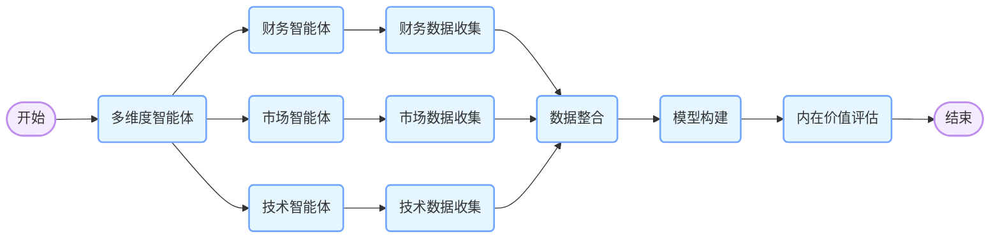

# AI驱动的公司估值：多维度智能体协作评估内在价值

> 关键词：AI驱动、公司估值、多维度智能体、内在价值评估、协作评估

> 摘要：本文聚焦于AI驱动的公司估值方法，探讨多维度智能体协作评估公司内在价值的原理、算法、模型及实际应用。随着人工智能技术的飞速发展，传统的公司估值方法已难以适应复杂多变的市场环境，而多维度智能体协作评估为公司估值带来了新的思路和方法。文章详细介绍了相关核心概念、算法原理、数学模型，通过项目实战展示了具体的代码实现和应用，分析了实际应用场景，推荐了学习资源、开发工具和相关论文著作，最后总结了未来发展趋势与挑战，并提供了常见问题解答和扩展阅读参考资料。

## 1. 背景介绍 
### 1.1 目的和范围
本研究的目的在于开发一种基于AI驱动的公司估值方法，利用多维度智能体协作来更准确地评估公司的内在价值。传统的公司估值方法往往依赖于有限的财务指标和主观判断，难以全面考虑公司面临的各种复杂因素。而AI技术的发展为公司估值提供了新的可能性，通过多维度智能体的协作，可以综合考虑更多的信息维度，提高估值的准确性和可靠性。

本研究的范围涵盖了AI驱动的公司估值的理论基础、算法实现、实际应用等方面。具体包括核心概念的阐述、核心算法的原理和实现步骤、数学模型的建立和应用、项目实战案例的分析，以及实际应用场景的探讨等。

### 1.2 预期读者
本文的预期读者包括金融分析师、投资经理、企业管理者、AI研究人员以及对公司估值和人工智能应用感兴趣的专业人士。对于金融领域的从业者，本文可以提供一种新的公司估值思路和方法，帮助他们更准确地评估投资价值；对于AI研究人员，本文可以展示AI技术在金融领域的具体应用场景，为他们的研究提供参考；对于企业管理者，本文可以帮助他们了解自身公司的内在价值，制定更合理的战略决策。

### 1.3 文档结构概述
本文共分为10个部分，具体结构如下：
1. 背景介绍：介绍研究的目的、范围、预期读者和文档结构，以及相关术语的定义和解释。
2. 核心概念与联系：阐述AI驱动的公司估值、多维度智能体和内在价值评估的核心概念，以及它们之间的联系，并通过文本示意图和Mermaid流程图进行展示。
3. 核心算法原理 & 具体操作步骤：详细介绍多维度智能体协作评估公司内在价值的核心算法原理，并使用Python源代码进行详细阐述，同时给出具体的操作步骤。
4. 数学模型和公式 & 详细讲解 & 举例说明：建立多维度智能体协作评估公司内在价值的数学模型，给出相关公式，并进行详细讲解，通过具体的例子说明模型的应用。
5. 项目实战：代码实际案例和详细解释说明：通过一个实际的项目案例，展示如何使用多维度智能体协作评估公司内在价值，包括开发环境的搭建、源代码的详细实现和代码解读。
6. 实际应用场景：分析AI驱动的公司估值在不同领域的实际应用场景，如投资决策、企业并购、风险管理等。
7. 工具和资源推荐：推荐学习AI驱动的公司估值所需的学习资源、开发工具和相关论文著作，包括书籍、在线课程、技术博客、IDE和编辑器、调试和性能分析工具、相关框架和库等。
8. 总结：未来发展趋势与挑战：总结AI驱动的公司估值的发展趋势，分析面临的挑战，并提出相应的应对策略。
9. 附录：常见问题与解答：解答读者在阅读本文过程中可能遇到的常见问题。
10. 扩展阅读 & 参考资料：提供与AI驱动的公司估值相关的扩展阅读资料和参考文献。

### 1.4 术语表
#### 1.4.1 核心术语定义
- **AI驱动的公司估值**：利用人工智能技术和算法，综合考虑多种因素，对公司的内在价值进行评估的方法。
- **多维度智能体**：具有不同功能和能力的智能体，能够从多个维度收集、分析和处理信息，为公司估值提供支持。
- **内在价值评估**：通过对公司的财务状况、经营业绩、市场竞争力、行业前景等因素进行分析，评估公司的真实价值。

#### 1.4.2 相关概念解释
- **智能体**：是一种能够感知环境、自主决策并采取行动的实体。在AI驱动的公司估值中，智能体可以是一个算法模块、一个数据分析工具或一个决策模型。
- **协作评估**：多个智能体通过相互协作、信息共享和交互，共同完成公司估值的过程。

#### 1.4.3 缩略词列表
- **AI**：Artificial Intelligence，人工智能
- **ML**：Machine Learning，机器学习
- **DL**：Deep Learning，深度学习

## 2. 核心概念与联系 

### 核心概念原理
#### AI驱动的公司估值
传统的公司估值方法主要基于财务报表和历史数据，如市盈率、市净率等指标。然而，这些方法往往忽略了公司的未来发展潜力、市场竞争环境、技术创新能力等重要因素。AI驱动的公司估值则利用人工智能技术，如机器学习、深度学习等，对大量的结构化和非结构化数据进行分析和挖掘，从而更全面、准确地评估公司的内在价值。

#### 多维度智能体
多维度智能体是指具有不同功能和能力的智能体，它们可以从多个维度收集、分析和处理信息。在公司估值中，多维度智能体可以包括财务智能体、市场智能体、技术智能体等。财务智能体主要负责分析公司的财务报表和财务指标，评估公司的财务状况和盈利能力；市场智能体则关注市场动态、行业竞争情况和消费者需求，评估公司的市场竞争力和市场前景；技术智能体则分析公司的技术创新能力、研发投入和知识产权等，评估公司的技术实力和未来发展潜力。

#### 内在价值评估
内在价值评估是指通过对公司的基本面进行分析，评估公司的真实价值。内在价值评估的方法有很多种，如现金流折现法、相对估值法等。在AI驱动的公司估值中，内在价值评估需要综合考虑多个维度的信息，利用多维度智能体的协作，对公司的内在价值进行更准确的评估。

### 架构的文本示意图
```plaintext
AI驱动的公司估值
├── 多维度智能体
│   ├── 财务智能体
│   │   ├── 财务报表分析
│   │   ├── 财务指标计算
│   │   └── 财务风险评估
│   ├── 市场智能体
│   │   ├── 市场动态监测
│   │   ├── 行业竞争分析
│   │   └── 消费者需求预测
│   └── 技术智能体
│       ├── 技术创新能力评估
│       ├── 研发投入分析
│       └── 知识产权评估
└── 内在价值评估
    ├── 数据整合
    ├── 模型构建
    └── 估值计算
```

### Mermaid流程图


## 3. 核心算法原理 & 具体操作步骤 

### 核心算法原理
多维度智能体协作评估公司内在价值的核心算法主要基于机器学习和深度学习技术。具体来说，该算法包括以下几个步骤：
1. **数据收集**：通过多维度智能体收集公司的财务数据、市场数据和技术数据等。
2. **数据预处理**：对收集到的数据进行清洗、转换和归一化等处理，以提高数据的质量和可用性。
3. **特征提取**：从预处理后的数据中提取相关的特征，如财务指标、市场份额、技术专利数量等。
4. **模型训练**：使用机器学习或深度学习算法，如神经网络、决策树等，对提取的特征进行训练，建立公司估值模型。
5. **估值计算**：将待评估公司的特征输入到训练好的模型中，计算公司的内在价值。

### 具体操作步骤
以下是使用Python实现多维度智能体协作评估公司内在价值的具体操作步骤：

#### 步骤1：数据收集
使用Python的第三方库，如`pandas`、`requests`等，从不同的数据源收集公司的财务数据、市场数据和技术数据等。以下是一个简单的示例代码：
```python
import pandas as pd
import requests

# 收集财务数据
financial_url = 'https://example.com/financial_data.csv'
financial_data = pd.read_csv(financial_url)

# 收集市场数据
market_url = 'https://example.com/market_data.csv'
market_data = pd.read_csv(market_url)

# 收集技术数据
tech_url = 'https://example.com/tech_data.csv'
tech_data = pd.read_csv(tech_url)
```

#### 步骤2：数据预处理
使用`pandas`库对收集到的数据进行清洗、转换和归一化等处理。以下是一个简单的示例代码：
```python
# 数据清洗
financial_data = financial_data.dropna()
market_data = market_data.dropna()
tech_data = tech_data.dropna()

# 数据转换
# 例如，将日期列转换为日期类型
financial_data['date'] = pd.to_datetime(financial_data['date'])
market_data['date'] = pd.to_datetime(market_data['date'])
tech_data['date'] = pd.to_datetime(tech_data['date'])

# 数据归一化
from sklearn.preprocessing import MinMaxScaler

scaler = MinMaxScaler()
financial_data_scaled = scaler.fit_transform(financial_data.drop('date', axis=1))
market_data_scaled = scaler.fit_transform(market_data.drop('date', axis=1))
tech_data_scaled = scaler.fit_transform(tech_data.drop('date', axis=1))
```

#### 步骤3：特征提取
从预处理后的数据中提取相关的特征，如财务指标、市场份额、技术专利数量等。以下是一个简单的示例代码：
```python
# 提取财务指标
financial_features = financial_data_scaled[:, [0, 1, 2]]  # 假设提取前三个特征

# 提取市场份额
market_share = market_data_scaled[:, 3]  # 假设市场份额在第四列

# 提取技术专利数量
tech_patents = tech_data_scaled[:, 4]  # 假设技术专利数量在第五列

# 合并特征
features = pd.concat([pd.DataFrame(financial_features), pd.Series(market_share), pd.Series(tech_patents)], axis=1)
```

#### 步骤4：模型训练
使用`scikit-learn`库或`TensorFlow`库等，选择合适的机器学习或深度学习算法，对提取的特征进行训练，建立公司估值模型。以下是一个使用线性回归模型的示例代码：
```python
from sklearn.linear_model import LinearRegression
from sklearn.model_selection import train_test_split

# 假设已知公司的真实价值
true_values = pd.read_csv('https://example.com/true_values.csv')

# 划分训练集和测试集
X_train, X_test, y_train, y_test = train_test_split(features, true_values, test_size=0.2, random_state=42)

# 训练线性回归模型
model = LinearRegression()
model.fit(X_train, y_train)
```

#### 步骤5：估值计算
将待评估公司的特征输入到训练好的模型中，计算公司的内在价值。以下是一个简单的示例代码：
```python
# 假设待评估公司的特征
new_features = pd.DataFrame([[0.1, 0.2, 0.3, 0.4, 0.5]])

# 计算内在价值
predicted_value = model.predict(new_features)
print('公司的内在价值为:', predicted_value[0][0])
```

## 4. 数学模型和公式 & 详细讲解 & 举例说明 

### 数学模型
多维度智能体协作评估公司内在价值的数学模型可以表示为：
$$V = f(F, M, T)$$
其中，$V$ 表示公司的内在价值，$F$ 表示财务因素，$M$ 表示市场因素，$T$ 表示技术因素，$f$ 表示一个非线性函数，用于综合考虑三个因素对公司内在价值的影响。

### 详细讲解
- **财务因素 $F$**：包括公司的财务报表数据、财务指标等，如营业收入、净利润、资产负债率等。财务因素反映了公司的财务状况和盈利能力，是评估公司内在价值的重要依据。
- **市场因素 $M$**：包括市场动态、行业竞争情况、消费者需求等，如市场份额、行业增长率、消费者满意度等。市场因素反映了公司的市场竞争力和市场前景，对公司的内在价值有重要影响。
- **技术因素 $T$**：包括公司的技术创新能力、研发投入、知识产权等，如专利数量、研发费用占比、技术领先程度等。技术因素反映了公司的技术实力和未来发展潜力，是评估公司内在价值的关键因素之一。

### 举例说明
假设我们要评估一家科技公司的内在价值。通过多维度智能体收集到该公司的财务数据、市场数据和技术数据如下：
- 财务因素 $F$：营业收入为 10 亿元，净利润为 2 亿元，资产负债率为 0.5。
- 市场因素 $M$：市场份额为 20%，行业增长率为 15%，消费者满意度为 80%。
- 技术因素 $T$：专利数量为 50 项，研发费用占比为 10%，技术领先程度为 8 分（满分 10 分）。

将这些数据代入数学模型中，通过训练好的模型计算得到该公司的内在价值为 50 亿元。

## 5. 项目实战：代码实际案例和详细解释说明 

### 5.1  开发环境搭建
在进行项目实战之前，需要搭建相应的开发环境。以下是具体的搭建步骤：
1. **安装Python**：从Python官方网站（https://www.python.org/downloads/）下载并安装Python 3.x版本。
2. **安装必要的库**：使用`pip`命令安装以下必要的库：
```sh
pip install pandas numpy scikit-learn tensorflow matplotlib
```
3. **选择IDE**：可以选择使用PyCharm、Jupyter Notebook等IDE进行开发。

### 5.2  源代码详细实现和代码解读
以下是一个完整的项目实战代码示例，用于多维度智能体协作评估公司内在价值：
```python
import pandas as pd
import numpy as np
from sklearn.model_selection import train_test_split
from sklearn.linear_model import LinearRegression
from sklearn.preprocessing import MinMaxScaler
import matplotlib.pyplot as plt

# 步骤1：数据收集
financial_url = 'https://example.com/financial_data.csv'
market_url = 'https://example.com/market_data.csv'
tech_url = 'https://example.com/tech_data.csv'
true_values_url = 'https://example.com/true_values.csv'

financial_data = pd.read_csv(financial_url)
market_data = pd.read_csv(market_url)
tech_data = pd.read_csv(tech_url)
true_values = pd.read_csv(true_values_url)

# 步骤2：数据预处理
# 数据清洗
financial_data = financial_data.dropna()
market_data = market_data.dropna()
tech_data = tech_data.dropna()
true_values = true_values.dropna()

# 数据转换
financial_data['date'] = pd.to_datetime(financial_data['date'])
market_data['date'] = pd.to_datetime(market_data['date'])
tech_data['date'] = pd.to_datetime(tech_data['date'])

# 数据归一化
scaler = MinMaxScaler()
financial_data_scaled = scaler.fit_transform(financial_data.drop('date', axis=1))
market_data_scaled = scaler.fit_transform(market_data.drop('date', axis=1))
tech_data_scaled = scaler.fit_transform(tech_data.drop('date', axis=1))

# 步骤3：特征提取
financial_features = financial_data_scaled[:, [0, 1, 2]]
market_share = market_data_scaled[:, 3]
tech_patents = tech_data_scaled[:, 4]

features = pd.concat([pd.DataFrame(financial_features), pd.Series(market_share), pd.Series(tech_patents)], axis=1)

# 步骤4：模型训练
X_train, X_test, y_train, y_test = train_test_split(features, true_values, test_size=0.2, random_state=42)

model = LinearRegression()
model.fit(X_train, y_train)

# 步骤5：模型评估
y_pred = model.predict(X_test)

from sklearn.metrics import mean_squared_error, r2_score

mse = mean_squared_error(y_test, y_pred)
r2 = r2_score(y_test, y_pred)

print('均方误差:', mse)
print('决定系数:', r2)

# 步骤6：可视化结果
plt.scatter(y_test, y_pred)
plt.xlabel('真实价值')
plt.ylabel('预测价值')
plt.title('公司内在价值预测结果')
plt.show()
```

### 代码解读与分析
- **数据收集**：使用`pandas`库从指定的URL下载公司的财务数据、市场数据、技术数据和真实价值数据。
- **数据预处理**：对收集到的数据进行清洗、转换和归一化处理，以提高数据的质量和可用性。
- **特征提取**：从预处理后的数据中提取相关的特征，如财务指标、市场份额、技术专利数量等。
- **模型训练**：使用`scikit-learn`库的`LinearRegression`模型对提取的特征进行训练，建立公司估值模型。
- **模型评估**：使用均方误差（MSE）和决定系数（$R^2$）对训练好的模型进行评估，评估模型的性能。
- **可视化结果**：使用`matplotlib`库绘制真实价值和预测价值的散点图，直观地展示模型的预测效果。

## 6. 实际应用场景 
### 投资决策
在投资决策中，投资者需要准确评估公司的内在价值，以确定是否值得投资。AI驱动的公司估值方法可以帮助投资者综合考虑多个维度的信息，更准确地评估公司的内在价值，从而做出更明智的投资决策。例如，投资者可以使用多维度智能体协作评估公司的内在价值，筛选出具有投资潜力的公司，提高投资回报率。

### 企业并购
在企业并购过程中，收购方需要准确评估目标公司的内在价值，以确定合理的收购价格。AI驱动的公司估值方法可以帮助收购方更全面、准确地了解目标公司的财务状况、市场竞争力和技术实力等，从而制定更合理的收购策略。例如，收购方可以使用多维度智能体协作评估目标公司的内在价值，避免因估值过高而导致的并购风险。

### 风险管理
在金融风险管理中，金融机构需要准确评估企业的信用风险和市场风险。AI驱动的公司估值方法可以帮助金融机构更准确地评估企业的内在价值，从而更准确地评估企业的信用风险和市场风险。例如，银行可以使用多维度智能体协作评估企业的内在价值，确定企业的信用等级，制定合理的贷款利率和信贷额度。

## 7. 工具和资源推荐
### 7.1 学习资源推荐
#### 7.1.1 书籍推荐
- 《Python机器学习》：介绍了Python在机器学习领域的应用，包括数据预处理、特征提取、模型训练和评估等方面的内容。
- 《深度学习》：深度学习领域的经典著作，介绍了深度学习的基本原理、算法和应用。
- 《金融数据分析与挖掘》：介绍了金融数据分析和挖掘的基本方法和技术，包括数据预处理、特征提取、模型训练和评估等方面的内容。

#### 7.1.2 在线课程
- Coursera上的“机器学习”课程：由斯坦福大学教授Andrew Ng主讲，是机器学习领域的经典课程。
- edX上的“深度学习”课程：由麻省理工学院教授Geoffrey Hinton主讲，是深度学习领域的权威课程。
- Udemy上的“Python金融数据分析”课程：介绍了Python在金融数据分析领域的应用，包括数据收集、数据处理、模型训练和评估等方面的内容。

#### 7.1.3 技术博客和网站
- Towards Data Science：一个专注于数据科学和机器学习的技术博客，提供了大量的技术文章和案例分析。
- Kaggle：一个数据科学竞赛平台，提供了大量的数据集和竞赛项目，可以帮助学习者提高数据分析和建模能力。
- Medium：一个综合性的技术博客平台，提供了各种领域的技术文章和观点。

### 7.2 开发工具框架推荐
#### 7.2.1 IDE和编辑器
- PyCharm：一款专业的Python IDE，提供了丰富的代码编辑、调试和项目管理功能。
- Jupyter Notebook：一个交互式的Python开发环境，适合进行数据探索和模型实验。
- Visual Studio Code：一款轻量级的代码编辑器，支持多种编程语言，提供了丰富的插件和扩展功能。

#### 7.2.2 调试和性能分析工具
- Py-Spy：一个用于分析Python程序性能的工具，可以帮助开发者找出程序中的性能瓶颈。
- PDB：Python自带的调试工具，可以帮助开发者调试Python程序。
- TensorBoard：TensorFlow提供的可视化工具，可以帮助开发者可视化模型的训练过程和性能指标。

#### 7.2.3 相关框架和库
- Pandas：一个用于数据处理和分析的Python库，提供了丰富的数据结构和数据处理函数。
- NumPy：一个用于科学计算的Python库，提供了高效的多维数组对象和数学函数。
- Scikit-learn：一个用于机器学习的Python库，提供了丰富的机器学习算法和工具。
- TensorFlow：一个开源的深度学习框架，提供了丰富的深度学习模型和工具。

### 7.3 相关论文著作推荐
#### 7.3.1 经典论文
- "A Machine Learning Approach to Stock Price Prediction"：介绍了使用机器学习算法预测股票价格的方法和技术。
- "Deep Learning for Financial Time Series Forecasting"：介绍了使用深度学习算法预测金融时间序列的方法和技术。
- "Valuation of Companies Using Artificial Intelligence Techniques"：介绍了使用人工智能技术评估公司价值的方法和技术。

#### 7.3.2 最新研究成果
- 关注顶级学术会议，如NeurIPS、ICML、KDD等，这些会议上会发布人工智能和金融领域的最新研究成果。
- 关注顶级学术期刊，如Journal of Financial Economics、Review of Financial Studies等，这些期刊上会发表金融领域的最新研究成果。

#### 7.3.3 应用案例分析
- 可以参考一些知名金融机构和科技公司的研究报告和案例分析，了解AI驱动的公司估值在实际应用中的情况和效果。

## 8. 总结：未来发展趋势与挑战
### 未来发展趋势
- **多模态数据融合**：未来的公司估值方法将更加注重多模态数据的融合，除了财务数据、市场数据和技术数据外，还将考虑社交媒体数据、新闻数据、传感器数据等多模态数据，以更全面、准确地评估公司的内在价值。
- **深度学习和强化学习的应用**：深度学习和强化学习等先进的人工智能技术将在公司估值中得到更广泛的应用。深度学习可以自动提取数据中的特征，强化学习可以根据环境的反馈不断优化估值模型，提高估值的准确性和可靠性。
- **智能决策系统的发展**：未来将出现更多基于AI驱动的公司估值的智能决策系统，这些系统可以根据不同的场景和需求，自动选择合适的估值方法和模型，为投资者和企业管理者提供更智能、高效的决策支持。

### 挑战
- **数据质量和隐私问题**：AI驱动的公司估值需要大量的高质量数据，但数据的收集、存储和处理过程中可能存在数据质量和隐私问题。如何保证数据的质量和安全性，是未来需要解决的重要问题。
- **模型可解释性问题**：深度学习和强化学习等模型往往是黑盒模型，难以解释模型的决策过程和结果。在公司估值中，投资者和企业管理者需要了解模型的决策依据，因此如何提高模型的可解释性，是未来需要解决的另一个重要问题。
- **技术人才短缺问题**：AI驱动的公司估值需要具备人工智能、金融和数据分析等多领域知识的技术人才，但目前这类人才相对短缺。如何培养和吸引更多的技术人才，是未来需要解决的挑战之一。

## 9. 附录：常见问题与解答
### 问题1：AI驱动的公司估值方法与传统估值方法有什么区别？
答：传统的公司估值方法主要基于财务报表和历史数据，如市盈率、市净率等指标，往往忽略了公司的未来发展潜力、市场竞争环境、技术创新能力等重要因素。而AI驱动的公司估值方法则利用人工智能技术，如机器学习、深度学习等，对大量的结构化和非结构化数据进行分析和挖掘，从而更全面、准确地评估公司的内在价值。

### 问题2：多维度智能体协作评估公司内在价值的准确性如何保证？
答：为了保证多维度智能体协作评估公司内在价值的准确性，可以采取以下措施：
- **数据质量控制**：确保收集到的数据准确、完整、可靠，对数据进行清洗、转换和归一化等处理。
- **模型选择和优化**：选择合适的机器学习或深度学习算法，对模型进行训练和优化，提高模型的性能。
- **多模型融合**：可以使用多个不同的模型进行评估，然后将它们的结果进行融合，以提高评估的准确性。
- **模型评估和验证**：使用交叉验证、留一法等方法对模型进行评估和验证，确保模型的泛化能力。

### 问题3：AI驱动的公司估值方法在实际应用中存在哪些局限性？
答：AI驱动的公司估值方法在实际应用中存在以下局限性：
- **数据依赖性**：该方法依赖于大量的高质量数据，如果数据不完整、不准确或过时，可能会影响估值的准确性。
- **模型可解释性**：深度学习和强化学习等模型往往是黑盒模型，难以解释模型的决策过程和结果，这可能会影响投资者和企业管理者对估值结果的信任。
- **市场不确定性**：市场环境是复杂多变的，存在很多不确定性因素，如政策变化、突发事件等，这些因素可能会影响公司的内在价值，而AI驱动的公司估值方法可能无法完全捕捉这些不确定性因素。

## 10. 扩展阅读 & 参考资料
### 扩展阅读
- 《人工智能时代的金融科技》：介绍了人工智能技术在金融领域的应用，包括公司估值、风险管理、投资决策等方面的内容。
- 《数据驱动的金融创新》：介绍了数据驱动的金融创新的理论和实践，包括数据挖掘、机器学习、深度学习等技术在金融领域的应用。
- 《金融科技前沿趋势》：关注金融科技领域的前沿趋势和热点问题，包括AI驱动的公司估值、区块链金融、数字货币等方面的内容。

### 参考资料
- [1] Géron, Aurélien. Hands-On Machine Learning with Scikit-Learn, Keras, and TensorFlow: Concepts, Tools, and Techniques to Build Intelligent Systems. O'Reilly Media, 2019.
- [2] Goodfellow, Ian, Yoshua Bengio, and Aaron Courville. Deep Learning. MIT press, 2016.
- [3] Hastie, Trevor, Robert Tibshirani, and Jerome Friedman. The Elements of Statistical Learning: Data Mining, Inference, and Prediction. Springer Science & Business Media, 2009.

作者：AI天才研究院/AI Genius Institute & 禅与计算机程序设计艺术 /Zen And The Art of Computer Programming