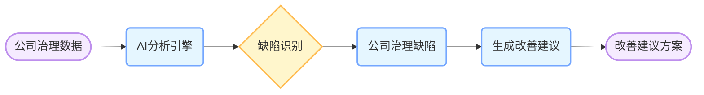

# AI驱动的公司治理缺陷识别与改善建议

> 关键词：AI、公司治理、缺陷识别、改善建议、数据分析

> 摘要：本文聚焦于AI在公司治理缺陷识别与改善方面的应用。首先介绍了研究的背景、目的、预期读者、文档结构及相关术语。接着阐述了AI与公司治理相关的核心概念及联系，通过文本示意图和Mermaid流程图进行清晰展示。详细讲解了用于缺陷识别的核心算法原理，结合Python源代码进行说明，并给出了相关的数学模型和公式。在项目实战部分，介绍了开发环境搭建、源代码实现及代码解读。探讨了AI在公司治理中的实际应用场景，推荐了学习资源、开发工具框架以及相关论文著作。最后总结了未来发展趋势与挑战，提供了常见问题解答和扩展阅读参考资料，旨在为企业利用AI提升公司治理水平提供全面的指导。

## 1. 背景介绍 
### 1.1 目的和范围
随着人工智能技术的飞速发展，其在各个领域的应用越来越广泛。在公司治理领域，AI技术为识别公司治理中的缺陷并提出改善建议提供了新的途径和方法。本研究的目的在于深入探讨如何利用AI技术准确识别公司治理中的缺陷，并基于识别结果给出有效的改善建议，以提升公司的治理水平和运营效率。研究范围涵盖了公司治理的各个方面，包括但不限于决策机制、监督机制、信息披露等，同时涉及多种AI技术在公司治理中的应用。

### 1.2 预期读者
本文的预期读者主要包括公司的高层管理人员、董事会成员、公司治理专家、研究人工智能在商业领域应用的学者以及对公司治理和AI技术感兴趣的专业人士。这些读者希望通过了解AI在公司治理中的应用，提升公司的治理水平，或者开展相关的研究工作。

### 1.3 文档结构概述
本文将按照以下结构进行组织：首先介绍相关的背景信息，包括研究目的、预期读者和文档结构等。接着阐述AI与公司治理相关的核心概念及联系，通过文本示意图和Mermaid流程图进行展示。详细讲解用于缺陷识别的核心算法原理，并结合Python源代码进行说明，同时给出相关的数学模型和公式。在项目实战部分，介绍开发环境搭建、源代码实现及代码解读。探讨AI在公司治理中的实际应用场景，推荐学习资源、开发工具框架以及相关论文著作。最后总结未来发展趋势与挑战，提供常见问题解答和扩展阅读参考资料。

### 1.4 术语表
#### 1.4.1 核心术语定义
- **公司治理**：指通过一套包括正式或非正式的、内部或外部的制度或机制来协调公司与所有利益相关者之间的利益关系，以保证公司决策的科学性和公正性，从而最终维护公司各方面的利益。
- **人工智能（AI）**：是一门研究如何使计算机能够模拟人类智能的学科和技术，包括机器学习、深度学习、自然语言处理等多种技术。
- **缺陷识别**：在公司治理中，指通过各种方法和技术，发现公司治理过程中存在的问题和不足之处。
- **改善建议**：针对公司治理中识别出的缺陷，提出的具有针对性的改进措施和方案。

#### 1.4.2 相关概念解释
- **机器学习**：是人工智能的一个分支，它让计算机通过数据学习模式和规律，从而能够进行预测和决策。在公司治理缺陷识别中，机器学习可以用于分析大量的公司数据，发现潜在的问题。
- **深度学习**：是机器学习的一种，它使用深度神经网络来处理复杂的数据，能够自动提取数据中的特征。在公司治理中，深度学习可以用于处理非结构化的数据，如文本信息。
- **自然语言处理（NLP）**：是人工智能的一个领域，它让计算机能够理解、处理和生成人类语言。在公司治理中，NLP可以用于分析公司的公告、报告等文本信息，识别其中的风险和问题。

#### 1.4.3 缩略词列表
- **AI**：Artificial Intelligence（人工智能）
- **ML**：Machine Learning（机器学习）
- **DL**：Deep Learning（深度学习）
- **NLP**：Natural Language Processing（自然语言处理）

## 2. 核心概念与联系 

### 核心概念原理
在AI驱动的公司治理缺陷识别与改善中，涉及到多个核心概念，它们相互关联，共同构成了一个完整的体系。

公司治理是整个体系的核心，它涵盖了公司的决策、监督、激励等多个方面。良好的公司治理能够保障公司的长期稳定发展，提高公司的竞争力。

人工智能技术则是实现公司治理缺陷识别与改善的关键工具。通过机器学习、深度学习和自然语言处理等技术，AI可以对公司的各种数据进行分析和挖掘，发现其中隐藏的问题和潜在的风险。

缺陷识别是基于AI技术对公司治理数据进行分析的过程。通过对公司的财务数据、运营数据、文本信息等进行处理和分析，AI可以识别出公司治理中存在的缺陷，如决策机制不健全、监督不力等。

改善建议是在缺陷识别的基础上提出的。根据识别出的缺陷，结合公司的实际情况和行业标准，AI可以给出具有针对性的改善建议，帮助公司改进治理水平。

### 架构的文本示意图
```
                +-----------------+
                |   公司治理数据   |
                +-----------------+
                        |
                        | 数据收集
                        v
                +-----------------+
                |    AI分析引擎    |
                |  机器学习模型   |
                |  深度学习模型   |
                |  自然语言处理   |
                +-----------------+
                        |
                        | 缺陷识别
                        v
                +-----------------+
                |  公司治理缺陷  |
                +-----------------+
                        |
                        | 生成建议
                        v
                +-----------------+
                |  改善建议方案  |
                +-----------------+
```

### Mermaid流程图


这个流程图展示了从公司治理数据收集到最终生成改善建议方案的整个过程。首先，收集公司治理相关的数据，然后将这些数据输入到AI分析引擎中进行处理。AI分析引擎利用机器学习、深度学习和自然语言处理等技术进行缺陷识别。一旦识别出公司治理中的缺陷，就会根据这些缺陷生成相应的改善建议方案。

## 3. 核心算法原理 & 具体操作步骤 

### 核心算法原理
在AI驱动的公司治理缺陷识别中，常用的算法包括决策树、随机森林、神经网络等。这里以决策树算法为例进行详细讲解。

决策树是一种基于树结构进行决策的算法，它通过对数据的特征进行划分，构建一个树状的模型。每个内部节点表示一个特征上的测试，每个分支表示一个测试输出，每个叶节点表示一个类别或值。

决策树的构建过程主要包括特征选择、树的生成和树的剪枝三个步骤。特征选择是指从所有特征中选择一个最优的特征作为当前节点的划分特征，常用的特征选择方法有信息增益、信息增益率、基尼指数等。树的生成是指根据选择的特征对数据集进行划分，递归地构建决策树的过程。树的剪枝是为了防止过拟合，提高决策树的泛化能力。

### Python源代码详细阐述
以下是一个使用Python的`scikit-learn`库实现决策树分类的示例代码：

```python
from sklearn.datasets import load_iris
from sklearn.model_selection import train_test_split
from sklearn.tree import DecisionTreeClassifier
from sklearn.metrics import accuracy_score

# 加载鸢尾花数据集
iris = load_iris()
X = iris.data  # 特征数据
y = iris.target  # 标签数据

# 划分训练集和测试集
X_train, X_test, y_train, y_test = train_test_split(X, y, test_size=0.3, random_state=42)

# 创建决策树分类器
clf = DecisionTreeClassifier()

# 训练模型
clf.fit(X_train, y_train)

# 预测测试集
y_pred = clf.predict(X_test)

# 计算准确率
accuracy = accuracy_score(y_test, y_pred)
print(f"Accuracy: {accuracy}")
```

### 具体操作步骤
1. **数据准备**：收集公司治理相关的数据，包括财务数据、运营数据、文本信息等，并进行清洗和预处理，将数据转换为适合机器学习模型输入的格式。
2. **特征选择**：从数据中选择对公司治理缺陷识别有重要影响的特征。可以使用特征选择算法，如相关性分析、信息增益等，来选择最优的特征子集。
3. **模型训练**：选择合适的机器学习算法，如决策树、随机森林、神经网络等，使用训练数据对模型进行训练。在训练过程中，需要调整模型的参数，以提高模型的性能。
4. **模型评估**：使用测试数据对训练好的模型进行评估，计算模型的准确率、召回率、F1值等指标，评估模型的性能。
5. **缺陷识别**：将公司的实际数据输入到训练好的模型中，模型会根据数据的特征进行预测，识别出公司治理中可能存在的缺陷。
6. **改善建议生成**：根据识别出的缺陷，结合公司的实际情况和行业标准，生成相应的改善建议。可以使用规则引擎、专家系统等方法来生成建议。

## 4. 数学模型和公式 & 详细讲解 & 举例说明 

### 信息增益
信息增益是决策树算法中常用的特征选择方法之一。它衡量了使用某个特征进行划分后，数据集的不确定性减少的程度。信息增益越大，说明该特征对分类的贡献越大。

信息增益的计算公式为：
$$
IG(D, A) = H(D) - H(D|A)
$$
其中，$IG(D, A)$ 表示使用特征 $A$ 对数据集 $D$ 进行划分的信息增益，$H(D)$ 表示数据集 $D$ 的熵，$H(D|A)$ 表示在已知特征 $A$ 的条件下，数据集 $D$ 的条件熵。

#### 熵的计算公式
数据集 $D$ 的熵定义为：
$$
H(D) = -\sum_{i=1}^{n} p_i \log_2 p_i
$$
其中，$n$ 表示数据集 $D$ 中类别的数量，$p_i$ 表示第 $i$ 个类别的样本在数据集中所占的比例。

#### 条件熵的计算公式
在已知特征 $A$ 的条件下，数据集 $D$ 的条件熵定义为：
$$
H(D|A) = \sum_{v \in Values(A)} \frac{|D^v|}{|D|} H(D^v)
$$
其中，$Values(A)$ 表示特征 $A$ 的所有可能取值，$D^v$ 表示特征 $A$ 取值为 $v$ 的样本子集，$|D^v|$ 表示 $D^v$ 的样本数量，$|D|$ 表示数据集 $D$ 的样本数量。

### 举例说明
假设有一个数据集 $D$ 包含 10 个样本，分为两个类别：正类和负类，其中正类有 6 个样本，负类有 4 个样本。则数据集 $D$ 的熵为：
$$
H(D) = -\left(\frac{6}{10} \log_2 \frac{6}{10} + \frac{4}{10} \log_2 \frac{4}{10}\right) \approx 0.971
$$

假设我们有一个特征 $A$，它有两个取值：$A_1$ 和 $A_2$。在特征 $A$ 取值为 $A_1$ 的样本子集中，有 3 个正类样本和 2 个负类样本；在特征 $A$ 取值为 $A_2$ 的样本子集中，有 3 个正类样本和 2 个负类样本。则条件熵为：
$$
H(D|A) = \frac{5}{10} \left(-\frac{3}{5} \log_2 \frac{3}{5} - \frac{2}{5} \log_2 \frac{2}{5}\right) + \frac{5}{10} \left(-\frac{3}{5} \log_2 \frac{3}{5} - \frac{2}{5} \log_2 \frac{2}{5}\right) \approx 0.950
$$

信息增益为：
$$
IG(D, A) = H(D) - H(D|A) \approx 0.971 - 0.950 = 0.021
$$

### 基尼指数
基尼指数也是一种常用的特征选择方法，它衡量了数据集的纯度。基尼指数越小，说明数据集的纯度越高。

基尼指数的计算公式为：
$$
Gini(D) = 1 - \sum_{i=1}^{n} p_i^2
$$
其中，$n$ 表示数据集 $D$ 中类别的数量，$p_i$ 表示第 $i$ 个类别的样本在数据集中所占的比例。

在使用特征 $A$ 进行划分时，基尼指数的计算公式为：
$$
Gini(D, A) = \sum_{v \in Values(A)} \frac{|D^v|}{|D|} Gini(D^v)
$$
其中，$Values(A)$ 表示特征 $A$ 的所有可能取值，$D^v$ 表示特征 $A$ 取值为 $v$ 的样本子集，$|D^v|$ 表示 $D^v$ 的样本数量，$|D|$ 表示数据集 $D$ 的样本数量。

### 举例说明
假设我们有一个数据集 $D$ 包含 10 个样本，分为两个类别：正类和负类，其中正类有 6 个样本，负类有 4 个样本。则数据集 $D$ 的基尼指数为：
$$
Gini(D) = 1 - \left(\left(\frac{6}{10}\right)^2 + \left(\frac{4}{10}\right)^2\right) = 0.48
$$

假设我们有一个特征 $A$，它有两个取值：$A_1$ 和 $A_2$。在特征 $A$ 取值为 $A_1$ 的样本子集中，有 3 个正类样本和 2 个负类样本；在特征 $A$ 取值为 $A_2$ 的样本子集中，有 3 个正类样本和 2 个负类样本。则使用特征 $A$ 进行划分的基尼指数为：
$$
Gini(D, A) = \frac{5}{10} \left(1 - \left(\frac{3}{5}\right)^2 - \left(\frac{2}{5}\right)^2\right) + \frac{5}{10} \left(1 - \left(\frac{3}{5}\right)^2 - \left(\frac{2}{5}\right)^2\right) = 0.48
$$

## 5. 项目实战：代码实际案例和详细解释说明 

### 5.1  开发环境搭建
#### 安装Python
首先，需要安装Python环境。可以从Python官方网站（https://www.python.org/downloads/）下载适合自己操作系统的Python安装包，并按照安装向导进行安装。建议安装Python 3.7及以上版本。

#### 安装必要的库
在Python环境中，需要安装一些必要的库，如`scikit-learn`、`pandas`、`numpy`等。可以使用`pip`命令进行安装：
```bash
pip install scikit-learn pandas numpy
```

#### 开发工具
可以使用任何喜欢的开发工具，如PyCharm、Jupyter Notebook等。这里推荐使用Jupyter Notebook，它可以方便地进行代码编写、运行和调试。可以使用以下命令安装Jupyter Notebook：
```bash
pip install jupyter notebook
```

### 5.2  源代码详细实现和代码解读
以下是一个使用决策树算法进行公司治理缺陷识别的实际案例代码：

```python
import pandas as pd
from sklearn.model_selection import train_test_split
from sklearn.tree import DecisionTreeClassifier
from sklearn.metrics import accuracy_score

# 读取数据集
data = pd.read_csv('company_governance_data.csv')

# 分离特征和标签
X = data.drop('defect', axis=1)  # 特征数据
y = data['defect']  # 标签数据

# 划分训练集和测试集
X_train, X_test, y_train, y_test = train_test_split(X, y, test_size=0.3, random_state=42)

# 创建决策树分类器
clf = DecisionTreeClassifier()

# 训练模型
clf.fit(X_train, y_train)

# 预测测试集
y_pred = clf.predict(X_test)

# 计算准确率
accuracy = accuracy_score(y_test, y_pred)
print(f"Accuracy: {accuracy}")

# 生成改善建议
def generate_improvement_suggestions(defect):
    if defect == 1:
        return "加强决策机制的监督，建立更加透明的决策流程。"
    else:
        return "继续保持良好的公司治理水平。"

# 为每个样本生成改善建议
suggestions = []
for defect in y_pred:
    suggestion = generate_improvement_suggestions(defect)
    suggestions.append(suggestion)

# 输出部分改善建议
print("部分改善建议：")
for i in range(5):
    print(suggestions[i])
```

### 代码解读与分析
1. **数据读取**：使用`pandas`库的`read_csv`函数读取公司治理数据集。数据集包含多个特征和一个标签列`defect`，表示公司是否存在治理缺陷。
2. **特征和标签分离**：使用`drop`方法将标签列从数据集中分离出来，得到特征数据`X`和标签数据`y`。
3. **划分训练集和测试集**：使用`train_test_split`函数将数据集划分为训练集和测试集，其中测试集占总数据集的30%。
4. **创建决策树分类器**：使用`DecisionTreeClassifier`类创建一个决策树分类器。
5. **模型训练**：使用训练集数据对决策树分类器进行训练。
6. **模型预测**：使用训练好的模型对测试集数据进行预测，得到预测结果`y_pred`。
7. **准确率计算**：使用`accuracy_score`函数计算模型的准确率，并输出结果。
8. **改善建议生成**：定义一个`generate_improvement_suggestions`函数，根据预测的缺陷情况生成相应的改善建议。
9. **输出改善建议**：遍历预测结果，为每个样本生成改善建议，并输出部分建议。

## 6. 实际应用场景 
### 决策机制优化
AI可以通过分析公司的决策流程数据，识别决策过程中存在的缺陷，如决策时间过长、决策结果不合理等。根据识别结果，AI可以提出优化建议，如简化决策流程、引入更多的数据分析等，以提高决策的效率和质量。

### 监督机制强化
AI可以对公司的监督数据进行实时监测，如财务报表、审计报告等，及时发现潜在的违规行为和风险。同时，AI可以分析监督机制的有效性，提出改进建议，如加强内部审计、建立举报机制等，以强化公司的监督机制。

### 信息披露改进
AI可以对公司的信息披露文本进行分析，识别信息披露中存在的问题，如信息不完整、不准确等。根据分析结果，AI可以提供改进建议，如完善信息披露制度、加强信息审核等，以提高信息披露的质量。

### 风险管理
AI可以通过对公司的风险数据进行分析，识别潜在的风险因素，如市场风险、信用风险等。根据风险评估结果，AI可以提出相应的风险管理策略，如风险分散、风险对冲等，以降低公司的风险水平。

## 7. 工具和资源推荐
### 7.1 学习资源推荐
#### 7.1.1 书籍推荐
- 《Python机器学习》：本书详细介绍了Python在机器学习中的应用，包括各种机器学习算法的原理和实现，适合初学者入门。
- 《深度学习》：由深度学习领域的三位顶尖专家所著，系统地介绍了深度学习的理论和实践，是深度学习领域的经典教材。
- 《公司治理》：全面介绍了公司治理的理论和实践，包括公司治理的结构、机制、法律法规等方面的内容，对理解公司治理有很大的帮助。

#### 7.1.2 在线课程
- Coursera上的“机器学习”课程：由斯坦福大学教授Andrew Ng主讲，是机器学习领域的经典课程，适合初学者学习。
- edX上的“深度学习基础”课程：由DeepLearning.AI提供，系统地介绍了深度学习的基础知识和应用，是学习深度学习的好选择。
- 中国大学MOOC上的“公司治理”课程：由国内知名高校的教授主讲，介绍了公司治理的基本理论和实践案例，有助于了解国内公司治理的现状。

#### 7.1.3 技术博客和网站
- Medium：是一个知名的技术博客平台，上面有很多关于人工智能和公司治理的文章，可以从中获取最新的技术动态和行业见解。
- Towards Data Science：专注于数据科学和机器学习领域的技术博客，提供了很多实用的技术教程和案例分析。
- 中国公司治理网：是国内专门研究公司治理的网站，提供了丰富的公司治理相关的研究报告、政策法规等资源。

### 7.2 开发工具框架推荐
#### 7.2.1 IDE和编辑器
- PyCharm：是一款专业的Python集成开发环境，提供了丰富的功能，如代码编辑、调试、版本控制等，适合开发大型的Python项目。
- Jupyter Notebook：是一个交互式的开发环境，可以方便地进行代码编写、运行和调试，同时还可以添加文本说明和可视化图表，适合进行数据分析和机器学习实验。
- Visual Studio Code：是一款轻量级的代码编辑器，支持多种编程语言，具有丰富的插件生态系统，可以根据需要安装各种插件来扩展功能。

#### 7.2.2 调试和性能分析工具
- Py-Spy：是一个用于Python代码性能分析的工具，可以实时监测Python程序的运行状态，找出性能瓶颈。
- PDB：是Python自带的调试工具，可以在代码中设置断点，逐行调试代码，帮助开发者找出代码中的错误。
- TensorBoard：是TensorFlow提供的可视化工具，可以用于可视化深度学习模型的训练过程和性能指标，帮助开发者更好地理解模型。

#### 7.2.3 相关框架和库
- Scikit-learn：是一个常用的机器学习库，提供了丰富的机器学习算法和工具，如分类、回归、聚类等，方便开发者进行机器学习模型的开发和训练。
- TensorFlow：是一个开源的深度学习框架，由Google开发，提供了高效的深度学习模型训练和部署工具，支持多种深度学习模型结构。
- PyTorch：是另一个流行的深度学习框架，由Facebook开发，具有简洁易用的特点，适合快速开发和实验深度学习模型。

### 7.3 相关论文著作推荐
#### 7.3.1 经典论文
- Jensen, M. C., & Meckling, W. H. (1976). Theory of the firm: managerial behavior, agency costs and ownership structure. Journal of financial economics, 3(4), 305-360. 这篇论文提出了代理理论，对公司治理领域产生了深远的影响。
- Fama, E. F., & Jensen, M. C. (1983). Separation of ownership and control. Journal of law and economics, 26(2), 301-325. 该论文探讨了公司所有权和控制权分离的问题，为公司治理的研究提供了重要的理论基础。

#### 7.3.2 最新研究成果
- 关注顶级学术期刊，如《Journal of Financial Economics》、《Review of Financial Studies》、《Management Science》等，这些期刊上发表了很多关于公司治理和人工智能应用的最新研究成果。
- 参加相关的学术会议，如美国金融协会年会（AFA）、中国金融学年会等，与国内外的专家学者交流，了解最新的研究动态。

#### 7.3.3 应用案例分析
- 《哈佛商业评论》：上面有很多关于公司治理和人工智能应用的实际案例分析，可以从中学习到企业在实践中的经验和教训。
- 各大咨询公司的研究报告，如麦肯锡、波士顿咨询等，这些报告通常会提供一些行业内的最佳实践和案例分析，对企业的决策有很大的参考价值。

## 8. 总结：未来发展趋势与挑战
### 未来发展趋势
- **智能化程度不断提高**：随着AI技术的不断发展，公司治理缺陷识别和改善建议生成的智能化程度将不断提高。AI将能够更准确地识别复杂的治理缺陷，并提供更加个性化、精准的改善建议。
- **与其他技术深度融合**：AI将与区块链、物联网等技术深度融合，为公司治理带来更多的创新应用。例如，区块链技术可以提高公司治理数据的安全性和可信度，物联网技术可以实时收集公司的运营数据，为AI分析提供更丰富的数据源。
- **应用范围不断扩大**：AI在公司治理中的应用范围将不断扩大，不仅涵盖传统的决策、监督、信息披露等方面，还将拓展到人力资源管理、供应链管理等领域，为企业的全面发展提供支持。

### 挑战
- **数据质量和安全问题**：AI的应用依赖于大量的高质量数据，但公司治理数据往往存在数据质量不高、数据安全隐患等问题。如何保证数据的准确性、完整性和安全性，是AI在公司治理中应用面临的重要挑战。
- **技术解释性和可信赖性**：一些复杂的AI模型，如深度学习模型，往往具有较高的黑箱性，难以解释其决策过程和结果。在公司治理中，需要保证AI模型的解释性和可信赖性，以便决策者能够理解和接受模型的建议。
- **法律法规和伦理问题**：AI在公司治理中的应用涉及到一系列的法律法规和伦理问题，如数据隐私保护、算法歧视等。如何在合法合规的前提下应用AI技术，是企业需要面对的挑战。

## 9. 附录：常见问题与解答
### 问题1：AI在公司治理缺陷识别中的准确率有多高？
AI在公司治理缺陷识别中的准确率受到多种因素的影响，如数据质量、模型选择、特征工程等。一般来说，通过合理的数据处理和模型优化，可以达到较高的准确率。但需要注意的是，AI模型的准确率并不是绝对的，还需要结合人工判断和经验进行综合分析。

### 问题2：如何选择适合的AI算法进行公司治理缺陷识别？
选择适合的AI算法需要考虑多个因素，如数据类型、数据规模、问题复杂度等。对于结构化数据，可以选择决策树、随机森林等传统机器学习算法；对于非结构化数据，如文本信息，可以选择深度学习算法，如卷积神经网络（CNN）、循环神经网络（RNN）等。同时，还可以通过实验比较不同算法的性能，选择最优的算法。

### 问题3：AI生成的改善建议是否具有可行性？
AI生成的改善建议是基于数据分析和模型预测得到的，具有一定的科学性和合理性。但在实际应用中，还需要结合公司的实际情况和行业特点进行评估和调整。建议在实施改善建议之前，进行充分的论证和试点，确保建议的可行性和有效性。

### 问题4：使用AI进行公司治理是否会取代人工决策？
AI在公司治理中可以提供有价值的信息和建议，但不会取代人工决策。公司治理涉及到很多复杂的因素，如战略规划、企业文化等，需要人类的智慧和判断力。AI可以作为辅助工具，帮助决策者更好地理解问题和做出决策。

## 10. 扩展阅读 & 参考资料
### 扩展阅读
- 《人工智能时代的商业新思维》：探讨了人工智能对商业领域的影响和变革，提供了一些在人工智能时代的商业创新思路。
- 《数字化转型：企业如何实现可持续增长》：介绍了企业数字化转型的方法和策略，包括如何利用人工智能等技术提升企业的竞争力。

### 参考资料
- 《机器学习实战》：提供了丰富的机器学习实践案例和代码实现，有助于加深对机器学习算法的理解和应用。
- 《深度学习实战》：详细介绍了深度学习的原理和实践，包括卷积神经网络、循环神经网络等模型的实现和应用。

作者：AI天才研究院/AI Genius Institute & 禅与计算机程序设计艺术 /Zen And The Art of Computer Programming