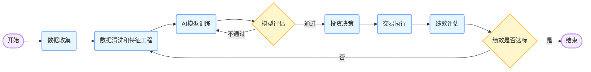

# AI驱动的动态价值投资策略适应

> 关键词：AI、动态价值投资策略、适应机制、金融市场、机器学习、深度学习

> 摘要：本文聚焦于AI驱动的动态价值投资策略适应这一主题，深入探讨了如何利用人工智能技术使价值投资策略在复杂多变的金融市场中动态适应。首先介绍了相关背景，包括目的、预期读者等内容。接着阐述了核心概念与联系，给出了原理和架构的示意图及流程图。详细讲解了核心算法原理，用Python代码进行了说明，并介绍了数学模型和公式。通过项目实战案例展示了如何在实际中应用这些策略，分析了实际应用场景。推荐了学习资源、开发工具框架以及相关论文著作。最后总结了未来发展趋势与挑战，解答了常见问题并提供了扩展阅读和参考资料，旨在为投资者和研究人员提供全面的技术和理论支持。

## 1. 背景介绍 
### 1.1 目的和范围
在金融市场中，价值投资一直是一种备受关注的投资理念，它强调寻找被低估的资产并长期持有。然而，金融市场是高度动态和复杂的，受到宏观经济因素、政策变化、公司基本面变化等多种因素的影响。传统的价值投资策略往往难以快速适应市场的动态变化，导致投资绩效不稳定。

本文的目的是探讨如何利用人工智能（AI）技术来驱动动态价值投资策略的适应，以提高投资组合的绩效和稳定性。具体范围包括研究AI在价值投资中的应用原理、核心算法、数学模型，通过实际案例展示如何构建和实施AI驱动的动态价值投资策略，分析其在不同市场环境下的应用场景，并为投资者和研究人员提供相关的学习资源和工具推荐。

### 1.2 预期读者
本文预期读者包括以下几类人群：
- **投资者**：无论是个人投资者还是机构投资者，希望了解如何利用AI技术优化价值投资策略，提高投资回报。
- **金融分析师**：负责分析金融市场和资产价值，需要掌握新的技术和方法来提升分析的准确性和效率。
- **技术人员**：包括程序员、数据科学家等，对将AI技术应用于金融领域感兴趣，希望了解相关的算法和实现细节。
- **研究人员**：从事金融科技、投资理论等相关领域的研究，关注AI在价值投资中的前沿发展和应用。

### 1.3 文档结构概述
本文的文档结构如下：
- **核心概念与联系**：介绍AI驱动的动态价值投资策略的核心概念，包括价值投资、AI技术等，并阐述它们之间的联系，给出原理和架构的示意图及流程图。
- **核心算法原理 & 具体操作步骤**：详细讲解用于动态价值投资策略适应的核心算法，如机器学习算法、深度学习算法等，并使用Python源代码进行说明。
- **数学模型和公式 & 详细讲解 & 举例说明**：介绍相关的数学模型和公式，如风险评估模型、收益预测模型等，并进行详细讲解和举例说明。
- **项目实战：代码实际案例和详细解释说明**：通过一个实际的项目案例，展示如何搭建开发环境、实现源代码，并对代码进行详细解读和分析。
- **实际应用场景**：分析AI驱动的动态价值投资策略在不同市场环境下的实际应用场景，如牛市、熊市、震荡市等。
- **工具和资源推荐**：推荐相关的学习资源、开发工具框架和论文著作，帮助读者进一步深入学习和研究。
- **总结：未来发展趋势与挑战**：总结AI驱动的动态价值投资策略的未来发展趋势，并分析可能面临的挑战。
- **附录：常见问题与解答**：解答读者在学习和应用过程中可能遇到的常见问题。
- **扩展阅读 & 参考资料**：提供相关的扩展阅读材料和参考资料，方便读者进一步探索。

### 1.4 术语表
#### 1.4.1 核心术语定义
- **价值投资**：一种投资策略，通过分析资产的内在价值，寻找被低估的资产并长期持有，以获得资产价值回归带来的收益。
- **AI（人工智能）**：计算机科学的一个分支，旨在使计算机能够模拟人类的智能行为，如学习、推理、决策等。
- **动态价值投资策略**：在价值投资的基础上，根据市场的动态变化实时调整投资组合，以适应不同的市场环境。
- **机器学习**：AI的一个重要领域，通过让计算机从数据中学习模式和规律，自动改进算法性能，以实现预测和决策等任务。
- **深度学习**：机器学习的一个子领域，使用深度神经网络来学习数据的深层特征表示，在图像识别、自然语言处理等领域取得了显著成果。

#### 1.4.2 相关概念解释
- **资产定价模型**：用于确定资产内在价值的数学模型，常见的有资本资产定价模型（CAPM）、多因素模型等。
- **风险评估**：对投资组合面临的各种风险进行评估和量化，如市场风险、信用风险、流动性风险等。
- **收益预测**：通过分析历史数据和市场信息，预测资产未来的收益情况。

#### 1.4.3 缩略词列表
- **AI**：Artificial Intelligence（人工智能）
- **ML**：Machine Learning（机器学习）
- **DL**：Deep Learning（深度学习）
- **CAPM**：Capital Asset Pricing Model（资本资产定价模型）

## 2. 核心概念与联系 

### 核心概念原理
#### 价值投资原理
价值投资的核心思想是基于资产的内在价值进行投资。资产的内在价值是指其未来现金流的现值，通过对公司的财务报表、行业前景、竞争优势等因素进行分析，可以估算出资产的内在价值。当市场价格低于内在价值时，认为该资产被低估，具有投资价值；反之，当市场价格高于内在价值时，认为该资产被高估，应避免投资。

#### AI技术原理
AI技术主要包括机器学习和深度学习。机器学习通过让计算机从数据中学习模式和规律，建立预测模型。常见的机器学习算法包括线性回归、逻辑回归、决策树、支持向量机等。深度学习则是使用深度神经网络来学习数据的深层特征表示，通过多层神经元的非线性变换，能够自动提取数据中的复杂特征。深度神经网络包括卷积神经网络（CNN）、循环神经网络（RNN）、长短时记忆网络（LSTM）等。

#### AI驱动的动态价值投资策略原理
AI驱动的动态价值投资策略结合了价值投资和AI技术的优势。首先，利用AI技术对大量的市场数据、公司基本面数据等进行分析和处理，挖掘数据中的潜在模式和规律。然后，根据这些模式和规律建立投资决策模型，实时评估资产的价值和风险。最后，根据市场的动态变化，自动调整投资组合，以实现投资绩效的最大化。

### 架构的文本示意图
```plaintext
|---------------------|
|    数据收集模块     |
|---------------------|
|      数据清洗       |
|      特征工程       |
|---------------------|
|    AI模型训练模块   |
|  - 机器学习算法     |
|  - 深度学习算法     |
|---------------------|
|  投资决策模块       |
|  - 价值评估         |
|  - 风险评估         |
|  - 投资组合优化     |
|---------------------|
|  交易执行模块       |
|  - 自动交易系统     |
|---------------------|
```

### Mermaid流程图


## 3. 核心算法原理 & 具体操作步骤 

### 线性回归算法原理
线性回归是一种简单而常用的机器学习算法，用于建立自变量和因变量之间的线性关系。假设我们有一组数据 $(x_1, y_1), (x_2, y_2), \cdots, (x_n, y_n)$，其中 $x_i$ 是自变量，$y_i$ 是因变量。线性回归模型的目标是找到一条直线 $y = \theta_0 + \theta_1x$，使得预测值 $\hat{y}_i$ 与真实值 $y_i$ 之间的误差最小。误差通常使用均方误差（MSE）来衡量，即：

$$MSE = \frac{1}{n}\sum_{i=1}^{n}(y_i - \hat{y}_i)^2 = \frac{1}{n}\sum_{i=1}^{n}(y_i - (\theta_0 + \theta_1x_i))^2$$

为了找到最优的 $\theta_0$ 和 $\theta_1$，可以使用最小二乘法，即对 $MSE$ 关于 $\theta_0$ 和 $\theta_1$ 求偏导数，并令偏导数为 0，得到：

$$\frac{\partial MSE}{\partial \theta_0} = -\frac{2}{n}\sum_{i=1}^{n}(y_i - (\theta_0 + \theta_1x_i)) = 0$$

$$\frac{\partial MSE}{\partial \theta_1} = -\frac{2}{n}\sum_{i=1}^{n}x_i(y_i - (\theta_0 + \theta_1x_i)) = 0$$

解上述方程组，即可得到最优的 $\theta_0$ 和 $\theta_1$。

### Python代码实现
```python
import numpy as np

# 生成一些示例数据
x = np.array([1, 2, 3, 4, 5])
y = np.array([2, 4, 6, 8, 10])

# 计算 x 和 y 的均值
x_mean = np.mean(x)
y_mean = np.mean(y)

# 计算斜率 theta_1
numerator = np.sum((x - x_mean) * (y - y_mean))
denominator = np.sum((x - x_mean) ** 2)
theta_1 = numerator / denominator

# 计算截距 theta_0
theta_0 = y_mean - theta_1 * x_mean

# 输出结果
print(f"截距 theta_0: {theta_0}")
print(f"斜率 theta_1: {theta_1}")

# 预测新数据
new_x = np.array([6, 7])
predicted_y = theta_0 + theta_1 * new_x
print(f"预测值: {predicted_y}")
```

### 具体操作步骤
1. **数据收集**：收集与投资相关的数据，如公司的财务指标、市场行情数据等。
2. **数据清洗和特征工程**：对收集到的数据进行清洗，去除缺失值和异常值。然后进行特征工程，选择和提取对投资决策有重要影响的特征。
3. **模型训练**：使用清洗和处理后的数据对线性回归模型进行训练，得到最优的参数 $\theta_0$ 和 $\theta_1$。
4. **模型评估**：使用测试数据对训练好的模型进行评估，计算均方误差等评估指标，评估模型的性能。
5. **投资决策**：根据训练好的模型，对新的资产进行价值评估和风险评估，做出投资决策。
6. **交易执行**：根据投资决策，执行相应的交易操作。
7. **绩效评估**：定期对投资组合的绩效进行评估，根据评估结果调整模型和投资策略。

## 4. 数学模型和公式 & 详细讲解 & 举例说明 

### 资本资产定价模型（CAPM）
#### 公式
资本资产定价模型（CAPM）用于描述资产的预期收益率与市场风险之间的关系，其公式为：

$$E(R_i) = R_f + \beta_i(E(R_m) - R_f)$$

其中：
- $E(R_i)$ 是资产 $i$ 的预期收益率。
- $R_f$ 是无风险收益率，通常使用国债收益率来近似表示。
- $\beta_i$ 是资产 $i$ 的贝塔系数，衡量资产 $i$ 的收益率相对于市场收益率的波动程度。
- $E(R_m)$ 是市场组合的预期收益率。

#### 详细讲解
CAPM的核心思想是，资产的预期收益率由两部分组成：无风险收益率和风险溢价。无风险收益率是投资者在没有风险的情况下所能获得的收益率，而风险溢价则是投资者为承担风险所要求的额外收益率。贝塔系数 $\beta_i$ 反映了资产 $i$ 与市场组合的相关性，当 $\beta_i > 1$ 时，资产 $i$ 的波动幅度大于市场组合；当 $\beta_i < 1$ 时，资产 $i$ 的波动幅度小于市场组合。

#### 举例说明
假设无风险收益率 $R_f = 3\%$，市场组合的预期收益率 $E(R_m) = 10\%$，某股票的贝塔系数 $\beta_i = 1.2$。则该股票的预期收益率为：

$$E(R_i) = 3\% + 1.2\times(10\% - 3\%) = 3\% + 8.4\% = 11.4\%$$

### 多因素模型
#### 公式
多因素模型是在CAPM的基础上发展而来的，考虑了多个因素对资产收益率的影响，其公式为：

$$E(R_i) = R_f + \beta_{i1}(F_1 - R_f) + \beta_{i2}(F_2 - R_f) + \cdots + \beta_{ik}(F_k - R_f)$$

其中：
- $E(R_i)$ 是资产 $i$ 的预期收益率。
- $R_f$ 是无风险收益率。
- $\beta_{ij}$ 是资产 $i$ 对因素 $j$ 的敏感系数。
- $F_j$ 是因素 $j$ 的预期收益率。

#### 详细讲解
多因素模型认为，资产的收益率不仅受到市场因素的影响，还受到其他因素的影响，如公司规模、市盈率、市净率等。通过引入多个因素，可以更全面地解释资产的收益率变化。

#### 举例说明
假设无风险收益率 $R_f = 3\%$，有两个因素 $F_1$ 和 $F_2$，其预期收益率分别为 $E(F_1) = 8\%$ 和 $E(F_2) = 12\%$，某股票对因素 $F_1$ 和 $F_2$ 的敏感系数分别为 $\beta_{i1} = 0.8$ 和 $\beta_{i2} = 0.6$。则该股票的预期收益率为：

$$E(R_i) = 3\% + 0.8\times(8\% - 3\%) + 0.6\times(12\% - 3\%) = 3\% + 4\% + 5.4\% = 12.4\%$$

## 5. 项目实战：代码实际案例和详细解释说明 

### 5.1  开发环境搭建
#### 操作系统
建议使用Linux或Windows操作系统，本文以Windows 10为例进行说明。

#### 编程语言和库
- **Python**：版本3.7及以上。
- **NumPy**：用于数值计算。
- **Pandas**：用于数据处理和分析。
- **Scikit-learn**：用于机器学习算法的实现。
- **Matplotlib**：用于数据可视化。

#### 安装步骤
1. 安装Python：从Python官方网站（https://www.python.org/downloads/）下载Python 3.7及以上版本，并按照安装向导进行安装。
2. 安装库：打开命令提示符或终端，使用以下命令安装所需的库：
```sh
pip install numpy pandas scikit-learn matplotlib
```

### 5.2  源代码详细实现和代码解读
#### 数据准备
```python
import pandas as pd
from sklearn.model_selection import train_test_split

# 读取数据
data = pd.read_csv('stock_data.csv')

# 提取特征和标签
X = data.drop('target', axis=1)
y = data['target']

# 划分训练集和测试集
X_train, X_test, y_train, y_test = train_test_split(X, y, test_size=0.2, random_state=42)
```
代码解读：
- 使用 `pandas` 库的 `read_csv` 函数读取存储在 `stock_data.csv` 文件中的股票数据。
- 提取特征矩阵 `X` 和标签向量 `y`，其中 `target` 列是我们要预测的目标变量。
- 使用 `sklearn` 库的 `train_test_split` 函数将数据划分为训练集和测试集，测试集占总数据的20%。

#### 模型训练
```python
from sklearn.linear_model import LinearRegression
from sklearn.metrics import mean_squared_error

# 创建线性回归模型
model = LinearRegression()

# 训练模型
model.fit(X_train, y_train)

# 预测
y_pred = model.predict(X_test)

# 计算均方误差
mse = mean_squared_error(y_test, y_pred)
print(f"均方误差: {mse}")
```
代码解读：
- 使用 `sklearn` 库的 `LinearRegression` 类创建线性回归模型。
- 使用 `fit` 方法对模型进行训练，将训练集的特征矩阵 `X_train` 和标签向量 `y_train` 作为输入。
- 使用 `predict` 方法对测试集的特征矩阵 `X_test` 进行预测，得到预测结果 `y_pred`。
- 使用 `sklearn` 库的 `mean_squared_error` 函数计算预测结果与真实标签之间的均方误差。

#### 可视化
```python
import matplotlib.pyplot as plt

# 绘制真实值和预测值的散点图
plt.scatter(y_test, y_pred)
plt.xlabel('真实值')
plt.ylabel('预测值')
plt.title('真实值 vs 预测值')
plt.show()
```
代码解读：
- 使用 `matplotlib` 库的 `scatter` 函数绘制真实值和预测值的散点图，直观地展示模型的预测效果。
- 设置坐标轴标签和标题，使用 `show` 方法显示图形。

### 5.3  代码解读与分析
#### 数据准备阶段
数据准备是机器学习项目的重要基础，包括数据读取、特征提取和数据划分。在这个阶段，我们使用 `pandas` 库读取数据，并将其划分为特征矩阵和标签向量。然后使用 `sklearn` 库的 `train_test_split` 函数将数据划分为训练集和测试集，以便对模型进行训练和评估。

#### 模型训练阶段
在模型训练阶段，我们使用 `sklearn` 库的 `LinearRegression` 类创建线性回归模型，并使用训练集的数据对模型进行训练。训练过程中，模型会自动调整参数，使得预测值与真实值之间的误差最小。

#### 模型评估阶段
在模型评估阶段，我们使用测试集的数据对训练好的模型进行评估，计算预测结果与真实标签之间的均方误差。均方误差是一种常用的评估指标，用于衡量模型的预测精度。较小的均方误差表示模型的预测效果较好。

#### 可视化阶段
可视化可以帮助我们更直观地理解模型的预测效果。通过绘制真实值和预测值的散点图，我们可以观察到模型的预测值与真实值之间的关系。如果散点图中的点大致分布在一条直线上，说明模型的预测效果较好。

## 6. 实际应用场景 
### 牛市环境
在牛市环境中，市场整体呈现上涨趋势，大多数资产的价格都在上升。AI驱动的动态价值投资策略可以通过分析市场数据和公司基本面数据，识别出具有较高增长潜力的资产，并及时调整投资组合，增加对这些资产的持仓。同时，策略可以实时监测市场风险，当市场出现过热迹象时，适当降低仓位，以保护投资收益。

### 熊市环境
在熊市环境中，市场整体下跌，资产价格普遍下降。此时，AI驱动的动态价值投资策略可以通过价值评估模型，筛选出被低估的优质资产，并逐步建仓。同时，策略可以利用风险评估模型，控制投资组合的风险暴露，避免过度损失。例如，通过增加防御性资产的持仓，如债券、黄金等，来降低投资组合的波动性。

### 震荡市环境
在震荡市环境中，市场价格波动较大，没有明显的上涨或下跌趋势。AI驱动的动态价值投资策略可以通过分析市场的短期波动规律，进行波段操作，获取差价收益。策略可以使用机器学习算法对市场数据进行实时分析，识别出短期的买卖信号，及时调整投资组合。同时，策略可以根据市场的整体估值水平，合理控制仓位，避免在市场波动中过度交易。

### 行业轮动环境
不同行业在不同的经济周期和市场环境下表现各异。AI驱动的动态价值投资策略可以通过分析宏观经济数据、行业数据和公司基本面数据，预测不同行业的发展趋势，进行行业轮动投资。例如，在经济复苏阶段，优先投资周期性行业，如钢铁、汽车等；在经济繁荣阶段，增加消费、科技等行业的持仓；在经济衰退阶段，转向防御性行业，如医药、公用事业等。

## 7. 工具和资源推荐
### 7.1 学习资源推荐
#### 7.1.1 书籍推荐
- 《机器学习》（周志华）：全面介绍了机器学习的基本概念、算法和应用，是机器学习领域的经典教材。
- 《深度学习》（Ian Goodfellow、Yoshua Bengio、Aaron Courville）：由深度学习领域的三位顶级专家撰写，系统地介绍了深度学习的理论和实践。
- 《价值投资：从格雷厄姆到巴菲特》（布鲁斯·格林沃尔德）：详细阐述了价值投资的理论和方法，结合了多位价值投资大师的经验和案例。
- 《金融市场与金融机构》（弗雷德里克·S·米什金）：介绍了金融市场和金融机构的基本原理和运作机制，是金融领域的经典教材。

#### 7.1.2 在线课程
- Coursera上的“机器学习”课程（Andrew Ng教授）：由机器学习领域的知名专家Andrew Ng教授授课，内容全面、深入浅出，是学习机器学习的优质课程。
- edX上的“深度学习专项课程”：由深度学习领域的权威专家提供，包括多个深度学习方向的课程，适合深入学习深度学习的学生和研究人员。
- 中国大学MOOC上的“金融投资学”课程：系统介绍了金融投资的基本理论和方法，结合了实际案例，适合初学者学习金融投资知识。

#### 7.1.3 技术博客和网站
- Medium：一个技术博客平台，有许多关于AI、金融科技等领域的优质文章。
- Towards Data Science：专注于数据科学和机器学习领域的博客，提供了大量的技术文章和案例分析。
- 雪球网：国内知名的金融投资社区，有许多投资者分享投资经验和见解，同时也提供了丰富的金融数据和分析工具。

### 7.2 开发工具框架推荐
#### 7.2.1 IDE和编辑器
- PyCharm：一款专业的Python集成开发环境，提供了丰富的代码编辑、调试和分析功能，适合Python开发。
- Jupyter Notebook：一个交互式的开发环境，支持Python、R等多种编程语言，方便进行数据探索和模型实验。
- Visual Studio Code：一款轻量级的代码编辑器，支持多种编程语言和插件扩展，具有强大的代码编辑和调试功能。

#### 7.2.2 调试和性能分析工具
- PDB：Python自带的调试工具，可以在代码中设置断点，逐步执行代码，查看变量的值和程序的执行流程。
- TensorBoard：TensorFlow提供的可视化工具，可以用于可视化模型的训练过程、损失函数曲线、模型结构等，帮助用户分析模型的性能。
- Scikit-learn的交叉验证和模型评估工具：Scikit-learn库提供了丰富的交叉验证和模型评估工具，如`cross_val_score`、`GridSearchCV`等，可以帮助用户选择最优的模型参数和评估模型的性能。

#### 7.2.3 相关框架和库
- TensorFlow：一个开源的深度学习框架，由Google开发，提供了丰富的深度学习模型和工具，支持分布式训练和移动端部署。
- PyTorch：另一个开源的深度学习框架，由Facebook开发，具有动态图和简洁的API，受到了许多研究人员和开发者的喜爱。
- Scikit-learn：一个简单易用的机器学习库，提供了丰富的机器学习算法和工具，如分类、回归、聚类等，适合初学者和快速开发。

### 7.3 相关论文著作推荐
#### 7.3.1 经典论文
- “The Capital Asset Pricing Model: Theory and Evidence”（Eugene F. Fama、Kenneth R. French）：对资本资产定价模型进行了深入的理论分析和实证研究，是金融领域的经典论文。
- “A Random Walk Down Wall Street”（Burton G. Malkiel）：提出了有效市场假说，认为股票价格是随机波动的，无法通过技术分析和基本面分析来预测，对投资理论产生了深远的影响。
- “Machine Learning for Asset Managers”（Marcos Lopez de Prado）：介绍了机器学习在资产管理中的应用，包括风险评估、投资组合优化等方面的内容。

#### 7.3.2 最新研究成果
- 关注顶级金融学术期刊，如《Journal of Finance》、《Review of Financial Studies》等，这些期刊发表了许多关于金融科技、投资理论等领域的最新研究成果。
- 参加金融科技和机器学习领域的学术会议，如NeurIPS、ICML等，了解最新的研究动态和技术发展趋势。

#### 7.3.3 应用案例分析
- 许多金融机构和科技公司会发布关于AI在投资领域应用的案例分析报告，如高盛、摩根大通等。可以通过他们的官方网站或研究报告获取这些案例分析，了解实际应用中的经验和教训。

## 8. 总结：未来发展趋势与挑战
### 未来发展趋势
#### 更广泛的应用领域
随着AI技术的不断发展和金融市场的不断创新，AI驱动的动态价值投资策略将在更广泛的领域得到应用。除了股票市场，还将应用于债券市场、期货市场、外汇市场等。同时，也将应用于私募股权、风险投资等领域，为投资者提供更多的投资机会和选择。

#### 多模态数据融合
未来的AI驱动的动态价值投资策略将不仅仅依赖于传统的金融数据，还将融合更多的多模态数据，如新闻资讯、社交媒体数据、卫星图像数据等。通过对多模态数据的分析和挖掘，可以更全面地了解市场动态和公司基本面，提高投资决策的准确性和及时性。

#### 强化学习和自适应策略
强化学习是一种通过智能体与环境进行交互，不断学习最优策略的机器学习方法。未来的AI驱动的动态价值投资策略将更多地应用强化学习技术，实现自适应的投资决策。智能体可以根据市场环境的变化实时调整投资策略，以获取最大的投资收益。

#### 与区块链技术的结合
区块链技术具有去中心化、不可篡改、透明等特点，可以为金融市场提供更安全、高效的交易环境。未来，AI驱动的动态价值投资策略可能会与区块链技术相结合，实现资产的数字化和智能化管理。例如，通过区块链技术实现资产的快速清算和结算，提高交易效率；利用智能合约实现自动化的投资决策和风险管理。

### 挑战
#### 数据质量和隐私问题
AI驱动的动态价值投资策略需要大量的高质量数据来进行训练和分析。然而，金融数据往往存在数据缺失、数据噪声、数据不一致等问题，影响模型的性能和准确性。同时，随着数据隐私保护法规的不断加强，如何在保护数据隐私的前提下，合理利用数据进行投资决策也是一个挑战。

#### 模型可解释性问题
深度学习等复杂的AI模型往往具有较高的预测精度，但模型的可解释性较差。在金融领域，投资者和监管机构通常需要了解模型的决策过程和依据，以便评估投资风险和合规性。因此，如何提高AI模型的可解释性是一个亟待解决的问题。

#### 市场不确定性和黑天鹅事件
金融市场是高度不确定的，存在各种难以预测的因素和黑天鹅事件。AI驱动的动态价值投资策略虽然可以通过学习历史数据和市场规律来进行预测和决策，但在面对极端市场情况和黑天鹅事件时，模型的性能可能会受到较大影响。如何提高模型的鲁棒性和适应性，应对市场的不确定性是一个挑战。

#### 技术人才短缺
AI驱动的动态价值投资策略需要具备金融知识和AI技术的复合型人才。然而，目前市场上这类复合型人才相对短缺，限制了该领域的发展。如何培养和吸引更多的复合型人才，是推动AI在价值投资领域应用的关键。

## 9. 附录：常见问题与解答
### 1. AI驱动的动态价值投资策略与传统价值投资策略有什么区别？
传统价值投资策略主要依赖于人工分析公司的基本面数据，如财务报表、行业前景等，来寻找被低估的资产并长期持有。而AI驱动的动态价值投资策略则利用人工智能技术对大量的市场数据和公司基本面数据进行分析和处理，挖掘数据中的潜在模式和规律，实时评估资产的价值和风险，并根据市场的动态变化自动调整投资组合。因此，AI驱动的动态价值投资策略具有更高的效率和适应性。

### 2. AI模型的预测准确性如何保证？
为了保证AI模型的预测准确性，可以采取以下措施：
- **数据质量控制**：对收集到的数据进行清洗和预处理，去除缺失值、异常值和噪声数据，提高数据的质量。
- **特征工程**：选择和提取对投资决策有重要影响的特征，避免使用无关或冗余的特征。
- **模型选择和调优**：根据数据的特点和问题的性质选择合适的模型，并使用交叉验证等方法对模型的参数进行调优。
- **模型评估和监控**：使用测试数据对模型进行评估，计算评估指标，如均方误差、准确率等。同时，定期对模型进行监控，当模型的性能下降时，及时进行调整和优化。

### 3. AI驱动的动态价值投资策略是否适合所有投资者？
AI驱动的动态价值投资策略并不适合所有投资者。该策略需要一定的技术和专业知识，包括机器学习、数据分析等方面的知识。同时，该策略需要使用大量的市场数据和计算资源，对投资者的技术能力和资金实力有一定的要求。因此，对于缺乏技术和专业知识的普通投资者来说，可能更适合选择传统的价值投资策略或寻求专业投资顾问的帮助。

### 4. 如何应对AI模型的可解释性问题？
为了应对AI模型的可解释性问题，可以采取以下方法：
- **选择可解释的模型**：优先选择可解释性较强的模型，如线性回归、决策树等。这些模型的决策过程相对简单，容易理解和解释。
- **使用解释性工具**：使用一些解释性工具，如LIME、SHAP等，来解释模型的预测结果。这些工具可以帮助我们了解模型在做出预测时考虑了哪些特征，以及每个特征的重要性。
- **结合专家知识**：在使用AI模型进行投资决策时，结合专家的知识和经验，对模型的预测结果进行验证和解释。专家可以根据自己的经验和判断，对模型的决策过程进行分析和解读。

## 10. 扩展阅读 & 参考资料
### 扩展阅读
- 《人工智能时代的投资革命》：探讨了AI技术在投资领域的应用和影响，分析了未来投资的发展趋势。
- 《量化投资：策略与技术》：介绍了量化投资的基本概念、策略和技术，包括数据处理、模型构建、回测等方面的内容。
- 《金融科技前沿：技术驱动的金融创新》：介绍了金融科技领域的最新技术和应用，如区块链、人工智能、大数据等在金融领域的应用。

### 参考资料
- 《机器学习实战》（Peter Harrington）：通过实际案例介绍了机器学习的算法和应用，提供了丰富的Python代码示例。
- 《Python数据分析实战》（Sebastian Raschka）：介绍了使用Python进行数据分析的方法和技巧，包括数据处理、可视化、机器学习等方面的内容。
- 《金融市场学》（张亦春、郑振龙）：系统介绍了金融市场的基本原理和运作机制，包括货币市场、资本市场、衍生品市场等方面的内容。

作者：AI天才研究院/AI Genius Institute & 禅与计算机程序设计艺术 /Zen And The Art of Computer Programming