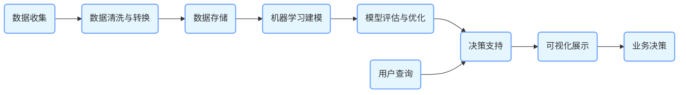

# AI驱动的商业智能：从数据到决策的全流程优化

> 关键词：AI、商业智能、数据、决策、全流程优化

> 摘要：本文聚焦于AI驱动的商业智能，深入探讨从数据到决策的全流程优化。首先介绍了商业智能及AI在其中应用的背景知识，阐述核心概念与联系，详细讲解核心算法原理及操作步骤，通过数学模型和公式加深理解。接着通过项目实战案例展示代码实现与解读，分析实际应用场景。同时推荐了学习、开发相关的工具和资源，包括书籍、在线课程、开发框架等。最后总结未来发展趋势与挑战，解答常见问题，并提供扩展阅读与参考资料，旨在为读者全面呈现AI驱动商业智能全流程优化的技术体系和实践方法。

## 1. 背景介绍 
### 1.1 目的和范围
在当今数字化时代，企业面临着海量的数据，如何从这些数据中提取有价值的信息并转化为有效的决策，是商业智能（BI）所关注的核心问题。而人工智能（AI）技术的飞速发展为商业智能带来了新的机遇和挑战。本文的目的在于深入探讨AI如何驱动商业智能实现从数据到决策的全流程优化，涵盖从数据的收集、清洗、分析到最终决策制定的整个过程。通过对相关技术原理、算法、实际案例的研究，为企业和技术人员提供全面的指导和参考，帮助他们更好地利用AI技术提升商业智能的效率和效果。

### 1.2 预期读者
本文的预期读者包括企业的管理人员、数据分析师、商业智能专家、AI技术开发者以及对商业智能和AI技术感兴趣的研究人员。对于企业管理人员，本文可以帮助他们了解如何利用AI技术优化企业的决策流程，提升企业的竞争力；对于数据分析师和商业智能专家，本文提供了深入的技术原理和实际操作方法，有助于他们提升数据分析和决策支持的能力；对于AI技术开发者，本文展示了AI在商业智能领域的应用场景和挑战，为他们的技术研发提供方向；对于研究人员，本文提供了丰富的研究资料和案例，有助于他们开展相关的学术研究。

### 1.3 文档结构概述
本文将按照以下结构进行组织：首先介绍商业智能和AI的相关背景知识，包括目的、预期读者和文档结构概述；接着阐述核心概念与联系，通过文本示意图和Mermaid流程图展示AI驱动商业智能的原理和架构；然后详细讲解核心算法原理及具体操作步骤，并使用Python源代码进行阐述；再通过数学模型和公式进一步加深对算法的理解，并举例说明；之后通过项目实战案例展示代码的实际实现和详细解释说明；分析AI驱动商业智能的实际应用场景；推荐相关的学习资源、开发工具框架和论文著作；最后总结未来发展趋势与挑战，解答常见问题，并提供扩展阅读与参考资料。

### 1.4 术语表
#### 1.4.1 核心术语定义
- **商业智能（Business Intelligence，BI）**：是指将企业中现有的数据转化为知识，帮助企业做出明智的业务经营决策的工具和技术。这些数据包括来自企业业务系统的订单、库存、交易账目、客户和供应商等，以及来自企业所处行业和竞争对手的数据，还有来自企业所处的其他外部环境中的各种数据。
- **人工智能（Artificial Intelligence，AI）**：是研究、开发用于模拟、延伸和扩展人的智能的理论、方法、技术及应用系统的一门新的技术科学。人工智能企图了解智能的实质，并生产出一种新的能以人类智能相似的方式做出反应的智能机器，该领域的研究包括机器人、语言识别、图像识别、自然语言处理和专家系统等。
- **机器学习（Machine Learning，ML）**：是一门多领域交叉学科，涉及概率论、统计学、逼近论、凸分析、算法复杂度理论等多门学科。它专门研究计算机怎样模拟或实现人类的学习行为，以获取新的知识或技能，重新组织已有的知识结构使之不断改善自身的性能。
- **深度学习（Deep Learning，DL）**：是机器学习的一个分支领域，它是一种基于对数据进行表征学习的方法。深度学习通过构建具有很多层的神经网络模型，自动从大量数据中学习复杂的模式和特征，从而实现对数据的分类、预测等任务。
- **数据挖掘（Data Mining，DM）**：是指从大量的数据中通过算法搜索隐藏于其中信息的过程。数据挖掘通常与计算机科学有关，并通过统计、在线分析处理、情报检索、机器学习、专家系统（依靠过去的经验法则）和模式识别等诸多方法来实现上述目标。

#### 1.4.2 相关概念解释
- **数据仓库（Data Warehouse，DW）**：是一个面向主题的、集成的、相对稳定的、反映历史变化的数据集合，用于支持管理决策。数据仓库中的数据是从多个数据源抽取、转换和加载而来的，经过清洗和整合后，以一种统一的格式存储在数据仓库中，方便企业进行数据分析和决策支持。
- **ETL（Extract, Transform, Load）**：是指从数据源中抽取数据，对数据进行转换和清洗，然后将处理后的数据加载到目标系统（如数据仓库）中的过程。ETL是数据仓库建设的重要环节，它确保了数据的质量和一致性。
- **预测分析（Predictive Analytics）**：是指利用统计学、机器学习和数据挖掘等技术，对历史数据进行分析和建模，以预测未来事件的发生概率和趋势的过程。预测分析可以帮助企业提前做出决策，降低风险，提高竞争力。
- **决策支持系统（Decision Support System，DSS）**：是一种基于计算机的信息系统，它通过对数据的分析和处理，为决策者提供决策所需的信息和支持。决策支持系统可以帮助决策者更好地理解问题，评估各种方案的优劣，从而做出更明智的决策。

#### 1.4.3 缩略词列表
| 缩略词 | 英文全称 | 中文全称 |
| ---- | ---- | ---- |
| BI | Business Intelligence | 商业智能 |
| AI | Artificial Intelligence | 人工智能 |
| ML | Machine Learning | 机器学习 |
| DL | Deep Learning | 深度学习 |
| DM | Data Mining | 数据挖掘 |
| DW | Data Warehouse | 数据仓库 |
| ETL | Extract, Transform, Load | 抽取、转换、加载 |
| DSS | Decision Support System | 决策支持系统 |

## 2. 核心概念与联系 
### 核心概念原理
AI驱动的商业智能核心在于将人工智能技术应用于商业智能的各个环节，实现从数据到决策的全流程优化。其原理主要基于以下几个方面：
- **数据驱动**：通过收集企业内外的各种数据，包括结构化数据（如数据库中的表格数据）和非结构化数据（如文本、图像、视频等），为商业智能提供丰富的信息来源。
- **机器学习与深度学习**：利用机器学习和深度学习算法对数据进行分析和建模，挖掘数据中的潜在模式和规律，从而实现对业务的预测和决策支持。例如，通过分类算法对客户进行细分，通过回归算法预测销售趋势等。
- **自然语言处理**：自然语言处理技术可以使计算机理解和处理人类语言，从而实现用户与商业智能系统的自然交互。例如，用户可以通过语音或文本方式查询数据和获取分析结果。
- **知识图谱**：知识图谱是一种基于图的数据结构，它将实体和实体之间的关系以图形的方式表示出来。通过构建知识图谱，可以整合企业内外的各种知识，为商业智能提供更全面的信息支持。

### 架构的文本示意图
AI驱动的商业智能架构主要包括以下几个层次：
- **数据层**：负责收集、存储和管理企业内外的各种数据，包括数据仓库、数据库、文件系统等。
- **数据处理层**：对数据进行清洗、转换和集成，以提高数据的质量和可用性。常见的数据处理技术包括ETL、数据挖掘等。
- **模型层**：利用机器学习和深度学习算法对数据进行建模和分析，挖掘数据中的潜在模式和规律。模型层可以包括分类模型、回归模型、聚类模型等。
- **应用层**：将模型的分析结果应用于实际业务场景，为企业的决策提供支持。应用层可以包括报表生成、可视化展示、预测分析、决策支持系统等。
- **用户界面层**：提供用户与商业智能系统的交互界面，使用户可以方便地查询数据、获取分析结果和进行决策。用户界面层可以包括网页界面、移动应用界面、语音交互界面等。

### Mermaid流程图

该流程图展示了AI驱动商业智能从数据收集到业务决策的主要流程。首先进行数据收集，然后对数据进行清洗和转换，存储到合适的地方。接着使用机器学习进行建模，对模型进行评估和优化。用户可以通过查询获取决策支持，系统将结果进行可视化展示，最终辅助企业进行业务决策。

## 3. 核心算法原理 & 具体操作步骤 
### 核心算法原理
在AI驱动的商业智能中，常用的核心算法包括机器学习中的分类算法、回归算法、聚类算法以及深度学习中的神经网络算法等。下面以分类算法中的决策树算法为例进行详细讲解。

决策树算法是一种基于树结构进行决策的算法，它通过对数据的特征进行递归划分，构建一棵决策树。决策树的每个内部节点是一个特征上的测试，每个分支是测试输出，每个叶节点是一个类别或值。决策树算法的核心思想是通过对数据的学习，找到最优的划分特征和划分点，使得划分后的子集尽可能地纯净（即同一子集中的数据属于同一类别）。

### 具体操作步骤
以下是使用Python实现决策树算法的具体步骤：
```python
# 步骤1：导入必要的库
import numpy as np
import pandas as pd
from sklearn.datasets import load_iris
from sklearn.model_selection import train_test_split
from sklearn.tree import DecisionTreeClassifier
from sklearn.metrics import accuracy_score

# 步骤2：加载数据集
iris = load_iris()
X = iris.data  # 特征数据
y = iris.target  # 标签数据

# 步骤3：划分训练集和测试集
X_train, X_test, y_train, y_test = train_test_split(X, y, test_size=0.2, random_state=42)

# 步骤4：创建决策树分类器
clf = DecisionTreeClassifier()

# 步骤5：训练模型
clf.fit(X_train, y_train)

# 步骤6：预测
y_pred = clf.predict(X_test)

# 步骤7：评估模型
accuracy = accuracy_score(y_test, y_pred)
print(f"模型准确率: {accuracy}")
```
### 代码解释
- **步骤1**：导入必要的库，包括`numpy`用于数值计算，`pandas`用于数据处理，`sklearn`中的相关模块用于加载数据集、划分数据集、创建决策树分类器和评估模型。
- **步骤2**：加载鸢尾花数据集，将特征数据存储在`X`中，标签数据存储在`y`中。
- **步骤3**：使用`train_test_split`函数将数据集划分为训练集和测试集，其中测试集占总数据集的20%。
- **步骤4**：创建一个决策树分类器对象`clf`。
- **步骤5**：使用训练集数据对决策树分类器进行训练。
- **步骤6**：使用训练好的模型对测试集数据进行预测，得到预测结果`y_pred`。
- **步骤7**：使用`accuracy_score`函数计算模型的准确率，并将结果打印输出。

## 4. 数学模型和公式 & 详细讲解 & 举例说明 
### 决策树算法的数学模型和公式
决策树算法的核心是选择最优的划分特征和划分点，常用的划分准则有信息增益、信息增益率和基尼指数等。下面以信息增益为例进行详细讲解。

#### 信息熵
信息熵是衡量数据纯度的一个指标，它表示数据的不确定性程度。对于一个具有$n$个类别的数据集$D$，其信息熵的计算公式为：
$$H(D)=-\sum_{i=1}^{n}p_i\log_2p_i$$
其中，$p_i$表示第$i$个类别的样本在数据集$D$中所占的比例。

#### 条件熵
条件熵是在已知某个特征$A$的取值情况下，数据集$D$的信息熵。对于特征$A$有$v$个不同的取值$\{a_1,a_2,\cdots,a_v\}$，将数据集$D$划分为$v$个子集$\{D_1,D_2,\cdots,D_v\}$，则在特征$A$的条件下，数据集$D$的条件熵的计算公式为：
$$H(D|A)=\sum_{i=1}^{v}\frac{|D_i|}{|D|}H(D_i)$$
其中，$|D|$表示数据集$D$的样本数量，$|D_i|$表示子集$D_i$的样本数量。

#### 信息增益
信息增益是指在划分数据集前后信息熵的减少量，它表示使用某个特征进行划分后，数据集的纯度提高了多少。信息增益的计算公式为：
$$Gain(D,A)=H(D)-H(D|A)$$
在决策树算法中，选择信息增益最大的特征作为当前节点的划分特征。

### 详细讲解
信息熵$H(D)$反映了数据集$D$的不确定性程度，信息熵越大，数据集的不确定性越大，纯度越低；信息熵越小，数据集的不确定性越小，纯度越高。条件熵$H(D|A)$表示在已知特征$A$的取值情况下，数据集$D$的不确定性程度。信息增益$Gain(D,A)$表示使用特征$A$进行划分后，数据集$D$的不确定性减少的程度，信息增益越大，说明使用特征$A$进行划分后，数据集的纯度提高得越多。

### 举例说明
假设我们有一个数据集$D$，包含10个样本，分为两个类别：正类和负类，其中正类有6个样本，负类有4个样本。则数据集$D$的信息熵为：
$$H(D)=-\frac{6}{10}\log_2\frac{6}{10}-\frac{4}{10}\log_2\frac{4}{10}\approx0.971$$
假设我们有一个特征$A$，它有两个取值：$a_1$和$a_2$。使用特征$A$进行划分后，得到两个子集$D_1$和$D_2$，其中$D_1$包含4个样本，正类有3个，负类有1个；$D_2$包含6个样本，正类有3个，负类有3个。则子集$D_1$和$D_2$的信息熵分别为：
$$H(D_1)=-\frac{3}{4}\log_2\frac{3}{4}-\frac{1}{4}\log_2\frac{1}{4}\approx0.811$$
$$H(D_2)=-\frac{3}{6}\log_2\frac{3}{6}-\frac{3}{6}\log_2\frac{3}{6}=1$$
则在特征$A$的条件下，数据集$D$的条件熵为：
$$H(D|A)=\frac{4}{10}H(D_1)+\frac{6}{10}H(D_2)=\frac{4}{10}\times0.811+\frac{6}{10}\times1\approx0.924$$
使用特征$A$进行划分的信息增益为：
$$Gain(D,A)=H(D)-H(D|A)=0.971 - 0.924 = 0.047$$

## 5. 项目实战：代码实际案例和详细解释说明 
### 5.1  开发环境搭建
在进行项目实战之前，需要搭建相应的开发环境。以下是具体的搭建步骤：
- **安装Python**：可以从Python官方网站（https://www.python.org/downloads/）下载并安装Python 3.x版本。
- **安装开发工具**：推荐使用Anaconda，它是一个集成了Python、各种科学计算库和开发工具的平台。可以从Anaconda官方网站（https://www.anaconda.com/products/individual）下载并安装Anaconda。
- **安装必要的库**：使用以下命令安装项目所需的库：
```bash
pip install numpy pandas scikit-learn matplotlib seaborn
```
### 5.2  源代码详细实现和代码解读
以下是一个使用Python实现的基于机器学习的客户细分项目的源代码：
```python
import numpy as np
import pandas as pd
import matplotlib.pyplot as plt
import seaborn as sns
from sklearn.cluster import KMeans
from sklearn.preprocessing import StandardScaler

# 步骤1：加载数据集
data = pd.read_csv('customer_data.csv')

# 步骤2：数据预处理
# 选择需要的特征
features = data[['Age', 'Annual Income (k$)', 'Spending Score (1-100)']]

# 数据标准化
scaler = StandardScaler()
scaled_features = scaler.fit_transform(features)

# 步骤3：确定最优的聚类数
inertia = []
for k in range(1, 11):
    kmeans = KMeans(n_clusters=k, random_state=42)
    kmeans.fit(scaled_features)
    inertia.append(kmeans.inertia_)

# 绘制手肘图
plt.plot(range(1, 11), inertia, marker='o')
plt.xlabel('Number of clusters')
plt.ylabel('Inertia')
plt.title('Elbow method')
plt.show()

# 步骤4：进行聚类分析
# 根据手肘图选择最优的聚类数
optimal_k = 5
kmeans = KMeans(n_clusters=optimal_k, random_state=42)
kmeans.fit(scaled_features)

# 步骤5：将聚类结果添加到原始数据集中
data['Cluster'] = kmeans.labels_

# 步骤6：可视化聚类结果
sns.scatterplot(data=data, x='Annual Income (k$)', y='Spending Score (1-100)', hue='Cluster', palette='viridis')
plt.xlabel('Annual Income (k$)')
plt.ylabel('Spending Score (1-100)')
plt.title('Customer Segmentation')
plt.show()
```
### 代码解读与分析
- **步骤1**：使用`pandas`库的`read_csv`函数加载客户数据集，数据集文件名为`customer_data.csv`。
- **步骤2**：选择需要的特征`Age`、`Annual Income (k$)`和`Spending Score (1-100)`，并使用`StandardScaler`对数据进行标准化处理，以消除不同特征之间的量纲影响。
- **步骤3**：使用手肘法确定最优的聚类数。手肘法是通过计算不同聚类数下的惯性（即样本到其所属聚类中心的距离的平方和），绘制惯性随聚类数变化的曲线，找到曲线的“手肘”位置，该位置对应的聚类数即为最优的聚类数。
- **步骤4**：根据手肘图选择最优的聚类数（这里为5），创建`KMeans`聚类模型，并使用标准化后的数据进行训练。
- **步骤5**：将聚类结果添加到原始数据集中，方便后续的分析和可视化。
- **步骤6**：使用`seaborn`库的`scatterplot`函数绘制散点图，可视化客户细分结果，不同颜色的点表示不同的客户聚类。

通过这个项目实战，我们可以看到如何使用机器学习算法对客户进行细分，从而为企业的营销策略制定提供支持。

## 6. 实际应用场景 
### 市场营销
- **客户细分**：通过对客户的特征（如年龄、性别、收入、购买行为等）进行分析和聚类，将客户划分为不同的细分群体。企业可以针对不同的细分群体制定个性化的营销策略，提高营销效果。
- **精准营销**：利用机器学习算法对客户的购买行为和偏好进行预测，为客户提供个性化的产品推荐和营销信息。例如，电商平台可以根据客户的历史购买记录和浏览行为，为客户推荐符合其兴趣的商品。
- **营销活动优化**：通过对营销活动的数据进行分析，评估营销活动的效果，找出影响营销效果的因素，并进行优化。例如，企业可以通过分析不同渠道的营销效果，调整营销预算的分配，提高营销投入的回报率。

### 风险管理
- **信用风险评估**：银行和金融机构可以利用机器学习算法对客户的信用风险进行评估，预测客户违约的概率。通过对客户的信用历史、收入状况、负债情况等数据进行分析，建立信用风险评估模型，为贷款审批和风险管理提供支持。
- **欺诈检测**：在金融交易、电子商务等领域，欺诈行为时有发生。利用机器学习算法对交易数据进行实时监测和分析，识别异常交易模式，及时发现欺诈行为，减少企业的损失。
- **市场风险预测**：企业可以利用机器学习算法对市场趋势和价格波动进行预测，评估市场风险。例如，能源企业可以通过分析市场供需关系、天气变化等因素，预测能源价格的走势，制定合理的采购和销售策略。

### 供应链管理
- **需求预测**：通过对历史销售数据、市场趋势、季节因素等进行分析，利用机器学习算法预测产品的需求。企业可以根据需求预测结果，合理安排生产计划、采购计划和库存管理，提高供应链的效率和响应速度。
- **供应商选择**：企业可以利用机器学习算法对供应商的绩效进行评估，包括交货期、质量、价格等方面。通过对供应商的数据进行分析，选择最优的供应商，降低采购成本和供应链风险。
- **物流优化**：利用机器学习算法对物流路径、运输方式、库存布局等进行优化，提高物流效率和降低物流成本。例如，物流企业可以通过分析交通流量、货物重量和体积等因素，选择最优的运输路线和配送方案。

### 客户服务
- **智能客服**：利用自然语言处理技术和机器学习算法，开发智能客服系统。智能客服系统可以自动回答客户的问题，解决客户的投诉和建议，提高客户服务的效率和质量。
- **客户满意度预测**：通过对客户的反馈数据（如评价、投诉、建议等）进行分析，利用机器学习算法预测客户的满意度。企业可以根据预测结果，及时采取措施改进服务，提高客户的忠诚度。
- **客户流失预警**：通过对客户的行为数据（如购买频率、消费金额、活跃度等）进行分析，利用机器学习算法预测客户流失的概率。企业可以根据预警结果，及时采取挽留措施，减少客户流失。

## 7. 工具和资源推荐
### 7.1 学习资源推荐
#### 7.1.1 书籍推荐
- 《Python机器学习》（第二版）：本书详细介绍了Python在机器学习中的应用，包括数据预处理、模型选择、分类、回归、聚类等内容，适合初学者和有一定基础的读者。
- 《深度学习》：由深度学习领域的三位先驱Ian Goodfellow、Yoshua Bengio和Aaron Courville撰写，是深度学习领域的经典教材，全面介绍了深度学习的理论和实践。
- 《商业智能：数据分析与决策支持》：本书系统地介绍了商业智能的概念、技术和应用，包括数据仓库、ETL、数据分析、可视化等内容，适合从事商业智能工作的人员阅读。

#### 7.1.2 在线课程
- Coursera上的“机器学习”课程：由斯坦福大学教授Andrew Ng主讲，是机器学习领域的经典课程，介绍了机器学习的基本概念、算法和应用。
- edX上的“深度学习”课程：由微软和伯克利大学联合推出，介绍了深度学习的基本原理、算法和应用，包括神经网络、卷积神经网络、循环神经网络等内容。
- Udemy上的“商业智能实战”课程：通过实际案例介绍了商业智能的开发流程和技术，包括数据仓库建设、数据分析、可视化等内容。

#### 7.1.3 技术博客和网站
- Towards Data Science：是一个专注于数据科学和机器学习的技术博客，提供了大量的技术文章、教程和案例分析。
- Kaggle：是一个数据科学竞赛平台，提供了丰富的数据集和竞赛项目，同时也有很多优秀的数据科学家分享他们的经验和代码。
- Analytics Vidhya：是一个数据科学和分析的社区，提供了技术文章、教程、竞赛和工作机会等资源。

### 7.2 开发工具框架推荐
#### 7.2.1 IDE和编辑器
- PyCharm：是一款专门为Python开发设计的集成开发环境（IDE），提供了代码编辑、调试、版本控制等功能，适合专业的Python开发者使用。
- Jupyter Notebook：是一个基于Web的交互式计算环境，支持Python、R等多种编程语言，适合数据科学家和分析师进行数据探索和模型开发。
- Visual Studio Code：是一款轻量级的代码编辑器，支持多种编程语言和插件扩展，适合初学者和快速开发。

#### 7.2.2 调试和性能分析工具
- Py-Spy：是一个用于Python程序的性能分析工具，可以实时监控Python程序的CPU使用率和函数调用情况，帮助开发者找出性能瓶颈。
- cProfile：是Python标准库中的一个性能分析模块，可以统计Python程序中各个函数的调用次数和执行时间，帮助开发者优化代码性能。
- TensorBoard：是TensorFlow提供的一个可视化工具，可以用于监控深度学习模型的训练过程，包括损失函数、准确率、梯度等指标的变化情况。

#### 7.2.3 相关框架和库
- Scikit-learn：是一个用于机器学习的Python库，提供了丰富的机器学习算法和工具，包括分类、回归、聚类、降维等算法，以及数据预处理、模型选择和评估等工具。
- TensorFlow：是一个开源的深度学习框架，由Google开发和维护，提供了丰富的深度学习模型和工具，包括神经网络、卷积神经网络、循环神经网络等模型，以及分布式训练、模型部署等功能。
- PyTorch：是一个开源的深度学习框架，由Facebook开发和维护，提供了动态图和静态图两种编程方式，支持多种深度学习模型和算法，具有简洁易用、灵活高效的特点。

### 7.3 相关论文著作推荐
#### 7.3.1 经典论文
- “A Decision-Theoretic Generalization of On-Line Learning and an Application to Boosting”：由Yoav Freund和Robert E. Schapire撰写，介绍了Adaboost算法，是机器学习领域的经典论文之一。
- “Gradient-Based Learning Applied to Document Recognition”：由Yann LeCun、Léon Bottou、Yoshua Bengio和Patrick Haffner撰写，介绍了卷积神经网络（CNN）在手写数字识别中的应用，是深度学习领域的经典论文之一。
- “Long Short-Term Memory”：由Sepp Hochreiter和Jürgen Schmidhuber撰写，介绍了长短期记忆网络（LSTM），是循环神经网络（RNN）领域的经典论文之一。

#### 7.3.2 最新研究成果
- 关注顶级学术会议和期刊，如NeurIPS（神经信息处理系统大会）、ICML（国际机器学习会议）、KDD（知识发现与数据挖掘会议）等，这些会议和期刊会发表最新的机器学习和数据挖掘研究成果。
- 关注知名研究机构和学者的研究动态，如Google Research、Microsoft Research、Stanford AI Lab等，他们经常会发布一些前沿的研究成果和技术报告。

#### 7.3.3 应用案例分析
- 《智能商业》：由曾鸣撰写，通过大量的实际案例介绍了人工智能在商业领域的应用，包括电商、金融、医疗、教育等行业，为企业的数字化转型提供了参考和借鉴。
- 《大数据时代的商业分析》：由陈恭和撰写，通过实际案例介绍了大数据分析在商业决策中的应用，包括市场分析、客户细分、风险管理等方面，帮助企业更好地利用大数据实现商业价值。

## 8. 总结：未来发展趋势与挑战
### 未来发展趋势
- **融合化**：AI技术将与物联网、区块链、云计算等技术深度融合，形成更加智能化、自动化的商业智能解决方案。例如，物联网设备可以实时收集大量的数据，区块链技术可以保证数据的安全性和可信度，云计算技术可以提供强大的计算能力，这些技术的融合将为商业智能带来更广阔的发展空间。
- **智能化**：AI技术将不断发展和创新，商业智能系统将更加智能化。例如，智能决策支持系统可以根据实时数据和历史数据自动生成决策建议，智能客服系统可以通过自然语言处理技术理解客户的意图并提供更加个性化的服务。
- **可视化**：数据可视化技术将不断发展和完善，商业智能系统将提供更加直观、生动的可视化界面。例如，三维可视化、虚拟现实和增强现实技术将应用于商业智能领域，帮助用户更好地理解和分析数据。
- **行业化**：AI驱动的商业智能将更加注重行业应用，不同行业将根据自身的特点和需求，开发出更加专业化、个性化的商业智能解决方案。例如，医疗行业可以利用AI技术进行疾病诊断和治疗方案推荐，金融行业可以利用AI技术进行风险评估和投资决策。

### 挑战
- **数据质量**：数据质量是AI驱动商业智能的基础，如果数据存在噪声、缺失值、错误等问题，将影响模型的准确性和可靠性。因此，如何提高数据质量，保证数据的准确性、完整性和一致性，是商业智能面临的一个重要挑战。
- **算法可解释性**：深度学习等AI算法通常是黑盒模型，其决策过程难以解释。在商业决策中，决策者需要了解模型的决策依据和风险，因此如何提高算法的可解释性，是商业智能面临的一个重要挑战。
- **隐私和安全**：AI驱动的商业智能需要收集和处理大量的用户数据，这些数据涉及用户的隐私和安全。因此，如何保护用户的隐私和数据安全，防止数据泄露和滥用，是商业智能面临的一个重要挑战。
- **人才短缺**：AI驱动的商业智能需要具备跨学科知识和技能的人才，包括数据科学、机器学习、商业分析等方面的知识和技能。目前，这类人才相对短缺，如何培养和吸引更多的相关人才，是商业智能面临的一个重要挑战。

## 9. 附录：常见问题与解答
### 问题1：AI驱动的商业智能与传统商业智能有什么区别？
**解答**：传统商业智能主要依赖于人工分析和报表生成，通过数据仓库和ETL技术将数据整合到一起，然后使用数据分析工具进行分析和可视化展示。而AI驱动的商业智能则引入了人工智能技术，如机器学习、深度学习等，能够自动从大量数据中挖掘潜在的模式和规律，实现预测分析和智能决策支持。AI驱动的商业智能具有更高的自动化程度和分析能力，能够提供更准确、更及时的决策建议。

### 问题2：如何选择适合的AI算法用于商业智能？
**解答**：选择适合的AI算法需要考虑多个因素，包括数据类型、问题类型、数据规模、算法复杂度等。例如，如果是分类问题，可以选择决策树、支持向量机、神经网络等算法；如果是回归问题，可以选择线性回归、岭回归、随机森林回归等算法；如果是聚类问题，可以选择K-Means、DBSCAN等算法。同时，还需要考虑算法的可解释性、训练时间、预测性能等因素，综合选择最适合的算法。

### 问题3：AI驱动的商业智能需要多少数据？
**解答**：AI驱动的商业智能需要的数据量取决于多个因素，包括算法类型、问题复杂度、数据质量等。一般来说，机器学习和深度学习算法需要大量的数据来进行训练，以提高模型的准确性和泛化能力。但是，数据量并不是越多越好，过多的数据可能会导致过拟合问题。因此，需要根据具体情况选择合适的数据量，并进行数据预处理和特征工程，以提高数据的质量和可用性。

### 问题4：如何评估AI驱动的商业智能模型的性能？
**解答**：评估AI驱动的商业智能模型的性能需要选择合适的评估指标，根据问题类型的不同，评估指标也会有所不同。例如，对于分类问题，可以使用准确率、召回率、F1值等指标；对于回归问题，可以使用均方误差、平均绝对误差等指标；对于聚类问题，可以使用轮廓系数、Calinski-Harabasz指数等指标。同时，还需要进行交叉验证和模型选择，以确保模型的泛化能力和稳定性。

## 10. 扩展阅读 & 参考资料
### 扩展阅读
- 《人工智能：现代方法》：全面介绍了人工智能的基本概念、算法和应用，是人工智能领域的经典教材。
- 《数据挖掘：概念与技术》：系统地介绍了数据挖掘的基本概念、算法和应用，包括关联规则挖掘、分类、聚类、异常检测等内容。
- 《自然语言处理入门》：介绍了自然语言处理的基本概念、算法和应用，包括分词、词性标注、命名实体识别、文本分类等内容。

### 参考资料
- 官方文档：Scikit-learn官方文档（https://scikit-learn.org/stable/documentation.html）、TensorFlow官方文档（https://www.tensorflow.org/api_docs）、PyTorch官方文档（https://pytorch.org/docs/stable/index.html）等。
- 学术论文：可以通过学术数据库（如IEEE Xplore、ACM Digital Library、ScienceDirect等）查找相关的学术论文，了解最新的研究成果和技术发展趋势。
- 行业报告：可以参考知名咨询公司（如Gartner、IDC、麦肯锡等）发布的行业报告，了解行业的发展动态和趋势。

作者：AI天才研究院/AI Genius Institute & 禅与计算机程序设计艺术 /Zen And The Art of Computer Programming