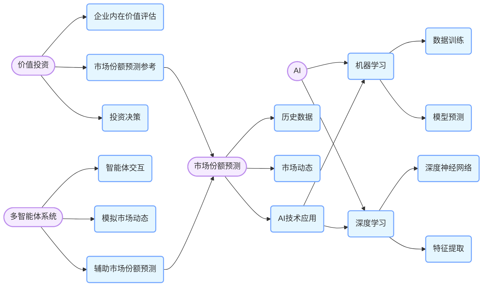

# AI驱动的市场份额预测：价值投资中的多智能体应用

> 关键词：AI、市场份额预测、价值投资、多智能体应用、金融科技

> 摘要：本文聚焦于AI驱动的市场份额预测在价值投资中的多智能体应用。首先介绍了该研究的背景、目的、预期读者和文档结构，明确了相关术语。接着阐述了核心概念，包括AI、市场份额预测、价值投资和多智能体系统的原理及联系，并给出了文本示意图和Mermaid流程图。详细讲解了核心算法原理，用Python代码展示了多智能体系统模拟市场份额预测的具体操作步骤。深入分析了数学模型和公式，通过举例说明其应用。以实际项目为例，进行开发环境搭建，给出源代码并详细解读。探讨了实际应用场景，推荐了学习资源、开发工具框架和相关论文著作。最后总结了未来发展趋势与挑战，解答常见问题，并提供扩展阅读和参考资料，为投资者和研究者在该领域的探索提供全面的指导。

## 1. 背景介绍 
### 1.1 目的和范围
在当今复杂多变的金融市场环境中，准确的市场份额预测对于价值投资决策至关重要。传统的市场份额预测方法往往难以应对海量数据和复杂的市场动态。而人工智能（AI）技术的快速发展为解决这一问题提供了新的途径。多智能体系统作为AI的一个重要分支，能够模拟多个参与者之间的交互行为，从而更真实地反映市场的实际情况。

本文的目的在于深入探讨AI驱动的市场份额预测在价值投资中的多智能体应用。具体范围包括核心概念的阐述、核心算法原理的分析、数学模型和公式的推导、实际项目案例的展示以及应用场景的探讨等。通过全面的研究，为投资者和研究者提供一套系统的方法和理论支持，帮助他们更好地利用AI技术进行市场份额预测和价值投资决策。

### 1.2 预期读者
本文的预期读者主要包括以下几类人群：
- **投资者**：无论是个人投资者还是机构投资者，都希望能够通过准确的市场份额预测来做出更明智的价值投资决策。本文提供的方法和案例可以为他们提供新的思路和工具。
- **金融分析师**：金融分析师需要对市场进行深入研究和分析，AI驱动的市场份额预测方法可以为他们的工作提供更科学、更准确的支持。
- **人工智能研究者**：多智能体系统在金融领域的应用是一个新兴的研究方向，本文的研究成果可以为相关研究者提供参考和启示。
- **计算机科学专业学生**：对于对金融科技和人工智能感兴趣的计算机科学专业学生来说，本文可以帮助他们了解多智能体系统在实际应用中的具体场景和实现方法。

### 1.3 文档结构概述
本文的文档结构如下：
- **核心概念与联系**：介绍AI、市场份额预测、价值投资和多智能体系统的核心概念，并分析它们之间的联系。
- **核心算法原理 & 具体操作步骤**：详细讲解多智能体系统用于市场份额预测的核心算法原理，并给出具体的Python代码实现。
- **数学模型和公式 & 详细讲解 & 举例说明**：推导市场份额预测的数学模型和公式，并通过具体例子进行说明。
- **项目实战：代码实际案例和详细解释说明**：以一个实际的市场份额预测项目为例，介绍开发环境搭建、源代码实现和代码解读。
- **实际应用场景**：探讨AI驱动的市场份额预测在价值投资中的实际应用场景。
- **工具和资源推荐**：推荐相关的学习资源、开发工具框架和论文著作。
- **总结：未来发展趋势与挑战**：总结AI驱动的市场份额预测在价值投资中的未来发展趋势和面临的挑战。
- **附录：常见问题与解答**：解答读者在阅读过程中可能遇到的常见问题。
- **扩展阅读 & 参考资料**：提供相关的扩展阅读材料和参考资料。

### 1.4 术语表
#### 1.4.1 核心术语定义
- **人工智能（AI）**：是一门研究如何使计算机能够模拟人类智能的学科，包括机器学习、深度学习、自然语言处理等多个领域。
- **市场份额预测**：是指对企业或产品在市场中所占份额的未来变化进行预测的过程。
- **价值投资**：是一种投资策略，通过分析企业的基本面和内在价值，寻找被低估的股票进行投资。
- **多智能体系统**：是由多个智能体组成的系统，每个智能体都具有一定的自主性和智能，能够与其他智能体进行交互和协作。

#### 1.4.2 相关概念解释
- **机器学习**：是AI的一个重要分支，通过让计算机从数据中学习模式和规律，从而实现预测和决策的功能。
- **深度学习**：是机器学习的一种，通过构建深度神经网络来学习数据的复杂特征，在图像识别、语音识别等领域取得了显著的成果。
- **智能体**：是指具有感知、决策和行动能力的实体，可以是软件程序、机器人等。

#### 1.4.3 缩略词列表
- **AI**：Artificial Intelligence（人工智能）
- **ML**：Machine Learning（机器学习）
- **DL**：Deep Learning（深度学习）
- **MAS**：Multi-Agent System（多智能体系统）

## 2. 核心概念与联系 
### 核心概念原理
#### 人工智能（AI）
人工智能是让计算机模拟人类智能的技术，它涵盖了机器学习、深度学习等多个子领域。机器学习通过数据训练模型，让模型能够从数据中学习规律，从而对未知数据进行预测。深度学习则是机器学习的一个分支，它使用深度神经网络来自动提取数据的特征，适用于处理复杂的数据，如图像、语音等。

#### 市场份额预测
市场份额预测是基于历史数据和市场动态，对企业或产品在未来市场中所占份额进行估计。传统的市场份额预测方法可能依赖于统计分析和经验判断，但随着数据量的增加和市场复杂性的提高，AI技术逐渐被应用于市场份额预测中，以提高预测的准确性。

#### 价值投资
价值投资是一种投资策略，它认为股票的价格会围绕其内在价值波动。投资者通过分析企业的财务状况、行业前景等因素，评估企业的内在价值，寻找被低估的股票进行投资，等待股票价格回归其内在价值，从而获得收益。

#### 多智能体系统（MAS）
多智能体系统由多个智能体组成，每个智能体都有自己的目标和决策能力，并且能够与其他智能体进行交互。在市场份额预测中，每个智能体可以代表一个企业或投资者，它们通过相互竞争和合作来影响市场份额的变化。

### 核心概念联系
AI技术为市场份额预测提供了强大的工具，通过机器学习和深度学习算法，可以更准确地分析市场数据，预测市场份额的变化。价值投资需要准确的市场份额预测来评估企业的竞争力和发展前景，从而做出合理的投资决策。多智能体系统可以模拟市场中多个参与者的行为，更真实地反映市场的动态变化，为市场份额预测和价值投资提供更有效的模型。

### 文本示意图
```plaintext
AI
 |
 |-- 机器学习
 |   |-- 数据训练
 |   |-- 模型预测
 |
 |-- 深度学习
 |   |-- 深度神经网络
 |   |-- 特征提取

市场份额预测
 |
 |-- 历史数据
 |-- 市场动态
 |-- AI技术应用

价值投资
 |
 |-- 企业内在价值评估
 |-- 市场份额预测参考
 |-- 投资决策

多智能体系统
 |
 |-- 智能体交互
 |-- 模拟市场动态
 |-- 辅助市场份额预测
```

### Mermaid流程图


## 3. 核心算法原理 & 具体操作步骤 
### 核心算法原理
在使用多智能体系统进行市场份额预测时，我们可以采用基于强化学习的算法。强化学习是一种机器学习方法，智能体通过与环境进行交互，根据环境反馈的奖励信号来学习最优的行为策略。

在市场份额预测的场景中，每个智能体代表一个企业，智能体的行为可以是调整产品价格、增加广告投入等。智能体的目标是最大化自己的市场份额，环境则是整个市场，包括其他企业的行为和市场需求的变化。智能体根据当前的市场状态选择一个行为，执行该行为后，环境会反馈一个奖励信号，智能体根据这个奖励信号更新自己的策略，以期望在未来获得更高的奖励。

### 具体操作步骤及Python代码实现
以下是一个简单的基于强化学习的多智能体系统模拟市场份额预测的Python代码示例：

```python
import numpy as np
import random

# 定义智能体类
class Agent:
    def __init__(self, id, initial_market_share):
        self.id = id
        self.market_share = initial_market_share
        self.strategy = np.random.rand(2)  # 随机初始化策略，例如调整价格和广告投入的比例

    def choose_action(self):
        # 根据策略选择一个行为
        action = np.random.choice([0, 1], p=self.strategy)
        return action

    def update_strategy(self, reward):
        # 根据奖励更新策略
        if reward > 0:
            self.strategy[1] += 0.1
            self.strategy[0] = 1 - self.strategy[1]
        else:
            self.strategy[0] += 0.1
            self.strategy[1] = 1 - self.strategy[0]

        # 确保策略概率在合理范围内
        self.strategy = np.clip(self.strategy, 0, 1)
        self.strategy /= np.sum(self.strategy)

# 定义市场环境类
class Market:
    def __init__(self, agents):
        self.agents = agents
        self.total_market_size = 100

    def step(self):
        actions = []
        for agent in self.agents:
            action = agent.choose_action()
            actions.append(action)

        # 模拟市场动态，根据行为更新市场份额
        for i, agent in enumerate(self.agents):
            if actions[i] == 1:
                # 执行行为1，例如增加广告投入，市场份额可能增加
                agent.market_share += random.uniform(0, 5)
            else:
                # 执行行为0，市场份额可能不变或减少
                agent.market_share -= random.uniform(0, 3)

            # 确保市场份额在合理范围内
            agent.market_share = np.clip(agent.market_share, 0, self.total_market_size)

        # 计算奖励
        rewards = []
        for agent in self.agents:
            reward = agent.market_share - agent.market_share  # 简单示例，奖励为市场份额的变化
            agent.update_strategy(reward)
            rewards.append(reward)

        return rewards

# 初始化智能体和市场
num_agents = 3
agents = [Agent(i, 100 / num_agents) for i in range(num_agents)]
market = Market(agents)

# 模拟市场运行
num_steps = 10
for step in range(num_steps):
    rewards = market.step()
    print(f"Step {step}: Rewards = {rewards}")
    for agent in agents:
        print(f"Agent {agent.id} Market Share: {agent.market_share}")
```

### 代码解释
1. **Agent类**：代表一个企业智能体，包含智能体的ID、初始市场份额和策略。`choose_action`方法根据策略选择一个行为，`update_strategy`方法根据奖励更新策略。
2. **Market类**：代表市场环境，包含多个智能体。`step`方法模拟市场的一个时间步，每个智能体选择一个行为，根据行为更新市场份额，并计算奖励。
3. **主程序**：初始化智能体和市场，模拟市场运行多个时间步，输出每个时间步的奖励和每个智能体的市场份额。

## 4. 数学模型和公式 & 详细讲解 & 举例说明 
### 数学模型
在基于强化学习的多智能体市场份额预测模型中，我们可以使用马尔可夫决策过程（MDP）来描述智能体与环境的交互。马尔可夫决策过程由一个四元组 $(S, A, P, R)$ 表示，其中：
- $S$ 是状态空间，代表市场的所有可能状态，例如每个企业的市场份额、产品价格等。
- $A$ 是动作空间，代表智能体可以采取的所有行为，例如调整价格、增加广告投入等。
- $P(s'|s, a)$ 是状态转移概率，表示在状态 $s$ 下采取动作 $a$ 后转移到状态 $s'$ 的概率。
- $R(s, a)$ 是奖励函数，表示在状态 $s$ 下采取动作 $a$ 后获得的奖励。

智能体的目标是最大化长期累积奖励，即：
$$
V(s) = \max_{\pi} \mathbb{E}\left[\sum_{t=0}^{\infty} \gamma^t R(s_t, a_t) | s_0 = s, \pi\right]
$$
其中，$V(s)$ 是状态 $s$ 的价值函数，$\pi$ 是策略，$\gamma$ 是折扣因子（$0 \leq \gamma \leq 1$），表示未来奖励的重要程度。

### 详细讲解
在市场份额预测的场景中，状态 $s$ 可以表示为一个向量，包含每个企业的市场份额、产品价格、广告投入等信息。动作 $a$ 可以是一个离散的选择，例如提高价格、降低价格、增加广告投入等。状态转移概率 $P(s'|s, a)$ 可以通过历史数据或模拟来估计，表示在当前状态 $s$ 下采取动作 $a$ 后市场状态转移到 $s'$ 的可能性。奖励函数 $R(s, a)$ 可以定义为市场份额的变化，例如智能体采取动作 $a$ 后市场份额增加，则奖励为正；市场份额减少，则奖励为负。

智能体通过不断与环境交互，根据当前状态选择一个动作，执行动作后获得奖励并转移到新的状态，然后根据奖励更新自己的策略，以最大化长期累积奖励。

### 举例说明
假设市场中有两个企业 $A$ 和 $B$，初始市场份额分别为 $s_A = 50$ 和 $s_B = 50$。状态 $s$ 可以表示为 $(s_A, s_B)$，动作空间 $A = \{ \text{提高价格}, \text{降低价格}, \text{增加广告投入} \}$。

假设企业 $A$ 选择动作 $\text{增加广告投入}$，根据历史数据和市场模拟，我们估计状态转移概率 $P((s_A', s_B')|(s_A, s_B), \text{增加广告投入})$。如果 $s_A' = 55$，$s_B' = 45$，则企业 $A$ 的奖励 $R((s_A, s_B), \text{增加广告投入}) = s_A' - s_A = 5$。企业 $A$ 根据这个奖励更新自己的策略，以便在未来做出更优的决策。

## 5. 项目实战：代码实际案例和详细解释说明 
### 5.1  开发环境搭建
为了实现基于多智能体系统的市场份额预测项目，我们需要搭建以下开发环境：
- **操作系统**：可以选择Windows、Linux或macOS。
- **Python版本**：建议使用Python 3.7及以上版本。
- **Python库**：需要安装以下Python库：
    - `numpy`：用于数值计算。
    - `pandas`：用于数据处理和分析。
    - `matplotlib`：用于数据可视化。
    - `tensorflow` 或 `pytorch`：用于深度学习模型的实现（如果需要）。

可以使用以下命令安装这些库：
```bash
pip install numpy pandas matplotlib tensorflow
```

### 5.2  源代码详细实现和代码解读
以下是一个更完整的基于多智能体系统的市场份额预测项目的源代码：

```python
import numpy as np
import pandas as pd
import matplotlib.pyplot as plt

# 定义智能体类
class Agent:
    def __init__(self, id, initial_market_share, learning_rate=0.1, discount_factor=0.9):
        self.id = id
        self.market_share = initial_market_share
        self.learning_rate = learning_rate
        self.discount_factor = discount_factor
        self.q_table = {}  # Q表，用于存储状态-动作值

    def get_q_value(self, state, action):
        if (state, action) not in self.q_table:
            self.q_table[(state, action)] = 0
        return self.q_table[(state, action)]

    def choose_action(self, state, epsilon=0.1):
        if np.random.uniform(0, 1) < epsilon:
            # 探索：随机选择一个动作
            action = np.random.choice([0, 1, 2])
        else:
            # 利用：选择Q值最大的动作
            q_values = [self.get_q_value(state, a) for a in [0, 1, 2]]
            action = np.argmax(q_values)
        return action

    def update_q_table(self, state, action, reward, next_state):
        max_q_next = max([self.get_q_value(next_state, a) for a in [0, 1, 2]])
        current_q = self.get_q_value(state, action)
        new_q = current_q + self.learning_rate * (reward + self.discount_factor * max_q_next - current_q)
        self.q_table[(state, action)] = new_q

# 定义市场环境类
class Market:
    def __init__(self, agents, total_market_size=100):
        self.agents = agents
        self.total_market_size = total_market_size

    def get_state(self):
        # 状态表示为每个智能体的市场份额
        state = tuple([agent.market_share for agent in self.agents])
        return state

    def step(self):
        state = self.get_state()
        actions = []
        for agent in self.agents:
            action = agent.choose_action(state)
            actions.append(action)

        # 模拟市场动态，根据行为更新市场份额
        new_market_shares = []
        for i, agent in enumerate(self.agents):
            if actions[i] == 0:
                # 动作0：提高价格，市场份额可能减少
                agent.market_share -= np.random.uniform(0, 5)
            elif actions[i] == 1:
                # 动作1：降低价格，市场份额可能增加
                agent.market_share += np.random.uniform(0, 5)
            else:
                # 动作2：增加广告投入，市场份额可能增加
                agent.market_share += np.random.uniform(0, 3)

            # 确保市场份额在合理范围内
            agent.market_share = np.clip(agent.market_share, 0, self.total_market_size)
            new_market_shares.append(agent.market_share)

        next_state = tuple(new_market_shares)

        # 计算奖励
        rewards = []
        for agent in self.agents:
            reward = agent.market_share - state[agent.id]
            agent.update_q_table(state, actions[agent.id], reward, next_state)
            rewards.append(reward)

        return next_state, rewards

# 初始化智能体和市场
num_agents = 3
agents = [Agent(i, 100 / num_agents) for i in range(num_agents)]
market = Market(agents)

# 模拟市场运行
num_steps = 100
market_share_history = []
for step in range(num_steps):
    next_state, rewards = market.step()
    market_share_history.append([agent.market_share for agent in agents])

# 可视化市场份额变化
market_share_history = np.array(market_share_history)
plt.figure(figsize=(10, 6))
for i in range(num_agents):
    plt.plot(market_share_history[:, i], label=f'Agent {i}')
plt.xlabel('Step')
plt.ylabel('Market Share')
plt.title('Market Share Evolution')
plt.legend()
plt.show()
```

### 5.3  代码解读与分析
1. **Agent类**：
    - `__init__` 方法：初始化智能体的ID、初始市场份额、学习率和折扣因子，并创建一个空的Q表。
    - `get_q_value` 方法：获取状态-动作对的Q值，如果该状态-动作对不在Q表中，则初始化为0。
    - `choose_action` 方法：根据epsilon-greedy策略选择一个动作，以一定的概率进行探索（随机选择动作），以一定的概率进行利用（选择Q值最大的动作）。
    - `update_q_table` 方法：根据Q学习算法更新Q表。

2. **Market类**：
    - `get_state` 方法：获取当前市场的状态，状态表示为每个智能体的市场份额。
    - `step` 方法：模拟市场的一个时间步，每个智能体选择一个动作，根据动作更新市场份额，计算奖励，并更新Q表。

3. **主程序**：
    - 初始化智能体和市场。
    - 模拟市场运行多个时间步，记录每个时间步的市场份额。
    - 使用 `matplotlib` 库可视化市场份额的变化。

通过这个项目，我们可以观察到不同智能体在市场中的竞争和合作行为，以及市场份额的动态变化。

## 6. 实际应用场景 
### 企业战略规划
企业可以利用AI驱动的市场份额预测来制定战略规划。通过预测不同市场环境下的市场份额变化，企业可以评估不同战略方案的可行性和效果，例如调整产品价格、推出新产品、拓展新市场等。企业可以根据预测结果选择最优的战略方案，以提高市场竞争力和市场份额。

### 投资决策
投资者可以使用市场份额预测来进行价值投资决策。通过分析企业的市场份额趋势和竞争力，投资者可以评估企业的内在价值和发展前景。如果预测某个企业的市场份额将持续增长，投资者可以考虑买入该企业的股票；反之，如果预测市场份额将下降，投资者可以考虑卖出或避免投资该企业的股票。

### 市场竞争分析
市场份额预测可以帮助企业和投资者进行市场竞争分析。通过比较不同企业的市场份额预测结果，企业可以了解竞争对手的实力和市场策略，从而制定相应的竞争策略。投资者可以根据市场竞争格局的变化，调整投资组合，以获取更高的投资回报。

### 行业趋势研究
研究机构和政府部门可以利用市场份额预测来研究行业趋势。通过分析整个行业内企业的市场份额变化，研究机构可以了解行业的发展动态和竞争态势，为行业政策的制定和调整提供参考。政府部门可以根据行业趋势研究结果，制定相关的产业政策，促进产业的健康发展。

## 7. 工具和资源推荐
### 7.1 学习资源推荐
#### 7.1.1 书籍推荐
- 《人工智能：一种现代的方法》：这是一本经典的人工智能教材，全面介绍了人工智能的各个领域，包括机器学习、自然语言处理、计算机视觉等。
- 《机器学习》：由周志华教授编写，系统地介绍了机器学习的基本概念、算法和应用。
- 《强化学习：原理与Python实现》：详细介绍了强化学习的理论和实践，通过Python代码示例帮助读者理解和实现强化学习算法。

#### 7.1.2 在线课程
- Coursera上的“机器学习”课程：由斯坦福大学的Andrew Ng教授授课，是一门非常受欢迎的机器学习入门课程。
- edX上的“人工智能基础”课程：介绍了人工智能的基本概念、技术和应用。
- Udemy上的“深度强化学习实战”课程：通过实际项目案例，帮助学习者掌握深度强化学习的应用。

#### 7.1.3 技术博客和网站
- Medium：上面有很多关于人工智能和机器学习的技术文章和教程。
- Towards Data Science：专注于数据科学和机器学习领域的技术分享和交流。
- AI Time：提供人工智能领域的前沿研究成果和学术动态。

### 7.2 开发工具框架推荐
#### 7.2.1 IDE和编辑器
- PyCharm：是一款功能强大的Python集成开发环境，提供代码编辑、调试、版本控制等功能。
- Jupyter Notebook：是一个交互式的开发环境，适合进行数据分析和机器学习实验。
- Visual Studio Code：是一款轻量级的代码编辑器，支持多种编程语言和插件扩展。

#### 7.2.2 调试和性能分析工具
- TensorBoard：是TensorFlow提供的可视化工具，可以帮助用户监控模型训练过程、分析模型性能。
- Py-Spy：是一个Python性能分析工具，可以帮助用户找出代码中的性能瓶颈。
- PDB：是Python自带的调试器，可以帮助用户调试代码中的错误。

#### 7.2.3 相关框架和库
- TensorFlow：是一个开源的深度学习框架，提供了丰富的深度学习模型和工具。
- PyTorch：是另一个流行的深度学习框架，具有动态图和易于使用的特点。
- OpenAI Gym：是一个用于开发和比较强化学习算法的工具包，提供了多种模拟环境。

### 7.3 相关论文著作推荐
#### 7.3.1 经典论文
- “Reinforcement Learning: An Introduction”：由Richard S. Sutton和Andrew G. Barto撰写，是强化学习领域的经典著作。
- “Playing Atari with Deep Reinforcement Learning”：首次提出了使用深度强化学习玩Atari游戏的方法，开创了深度强化学习的先河。
- “Multi-Agent Systems: Algorithmic, Game-Theoretic, and Logical Foundations”：介绍了多智能体系统的算法、博弈论和逻辑基础。

#### 7.3.2 最新研究成果
- 可以关注顶级人工智能会议（如NeurIPS、ICML、AAAI等）和期刊（如Journal of Artificial Intelligence Research、Artificial Intelligence等）上的最新研究成果。
- arXiv是一个预印本平台，上面有很多关于人工智能和机器学习的最新研究论文。

#### 7.3.3 应用案例分析
- Kaggle是一个数据科学竞赛平台，上面有很多关于市场预测和投资决策的实际案例，可以学习其他选手的解决方案和思路。
- 一些金融科技公司和研究机构会发布关于市场份额预测和价值投资的应用案例报告，可以关注这些报告以了解实际应用情况。

## 8. 总结：未来发展趋势与挑战
### 未来发展趋势
- **融合多种AI技术**：未来的市场份额预测将不仅仅依赖于单一的AI技术，而是会融合机器学习、深度学习、自然语言处理等多种技术，以更全面、准确地分析市场数据。例如，结合自然语言处理技术分析新闻和社交媒体数据，获取市场情绪和舆论信息，从而提高市场份额预测的准确性。
- **多智能体系统的进一步发展**：多智能体系统将不断发展和完善，能够更真实地模拟市场中多个参与者的复杂交互行为。智能体的决策能力和学习能力将不断提高，能够更好地适应市场的动态变化。同时，多智能体系统将与其他技术（如区块链）相结合，提高市场信息的透明度和可信度。
- **实时预测和决策支持**：随着数据处理技术和计算能力的不断提升，市场份额预测将实现实时化。投资者和企业可以根据实时的市场数据和预测结果，及时做出决策，提高决策的及时性和准确性。

### 面临的挑战
- **数据质量和隐私问题**：市场份额预测需要大量的高质量数据，但数据质量往往受到数据来源、数据采集方法等因素的影响。同时，数据隐私问题也是一个重要的挑战，如何在保护数据隐私的前提下，充分利用数据进行市场份额预测是一个亟待解决的问题。
- **模型可解释性**：深度学习等复杂的AI模型在市场份额预测中取得了较好的效果，但这些模型往往是黑盒模型，难以解释其决策过程和结果。在价值投资中，投资者需要了解模型的预测依据，因此提高模型的可解释性是一个重要的挑战。
- **市场不确定性**：市场是复杂多变的，受到多种因素的影响，如宏观经济环境、政策法规、突发事件等。这些因素增加了市场的不确定性，使得市场份额预测变得更加困难。如何应对市场不确定性，提高预测模型的鲁棒性是未来需要研究的方向。

## 9. 附录：常见问题与解答
### 问题1：多智能体系统在市场份额预测中的优势是什么？
多智能体系统能够模拟市场中多个参与者的交互行为，更真实地反映市场的动态变化。与传统的预测方法相比，多智能体系统可以考虑到不同企业之间的竞争和合作关系，以及市场环境的不确定性，从而提高市场份额预测的准确性。

### 问题2：如何选择合适的AI算法进行市场份额预测？
选择合适的AI算法需要考虑多个因素，如数据类型、数据量、预测精度要求等。如果数据量较小，可以选择简单的机器学习算法，如线性回归、决策树等；如果数据量较大且数据结构复杂，可以考虑使用深度学习算法，如神经网络、卷积神经网络等。同时，还可以结合多智能体系统和强化学习算法，以更好地模拟市场动态。

### 问题3：市场份额预测模型的准确性如何评估？
可以使用多种指标来评估市场份额预测模型的准确性，如均方误差（MSE）、平均绝对误差（MAE）、决定系数（$R^2$）等。这些指标可以衡量预测值与实际值之间的差异程度，指标值越小，说明模型的准确性越高。

### 问题4：如何处理市场份额预测中的缺失数据？
处理缺失数据的方法有很多种，常见的方法包括删除缺失数据、填充缺失数据等。删除缺失数据是最简单的方法，但可能会导致数据量减少，影响模型的准确性。填充缺失数据可以使用均值、中位数、众数等统计量进行填充，也可以使用机器学习算法进行预测填充。

## 10. 扩展阅读 & 参考资料
### 扩展阅读
- 《金融科技：技术驱动的金融创新》：介绍了金融科技的发展现状和趋势，以及AI技术在金融领域的应用。
- 《智能投资：AI时代的投资新策略》：探讨了AI技术在投资决策中的应用和发展趋势。
- 《复杂系统与复杂网络》：介绍了复杂系统和复杂网络的基本概念和理论，对于理解多智能体系统和市场动态有一定的帮助。

### 参考资料
- [Sutton, R. S., & Barto, A. G. (2018). Reinforcement Learning: An Introduction. MIT press.](https://mitpress.mit.edu/books/reinforcement-learning-second-edition)
- [Mnih, V., Kavukcuoglu, K., Silver, D., Rusu, A. A., Veness, J., Bellemare, M. G.,... & Petersen, S. (2015). Human-level control through deep reinforcement learning. Nature, 518(7540), 529-533.](https://www.nature.com/articles/nature14236)
- [Shoham, Y., & Leyton-Brown, K. (2009). Multi-Agent Systems: Algorithmic, Game-Theoretic, and Logical Foundations. Cambridge University Press.](https://www.cambridge.org/core/books/multiagent-systems/3574775675553362666)

作者：AI天才研究院/AI Genius Institute & 禅与计算机程序设计艺术 /Zen And The Art of Computer Programming