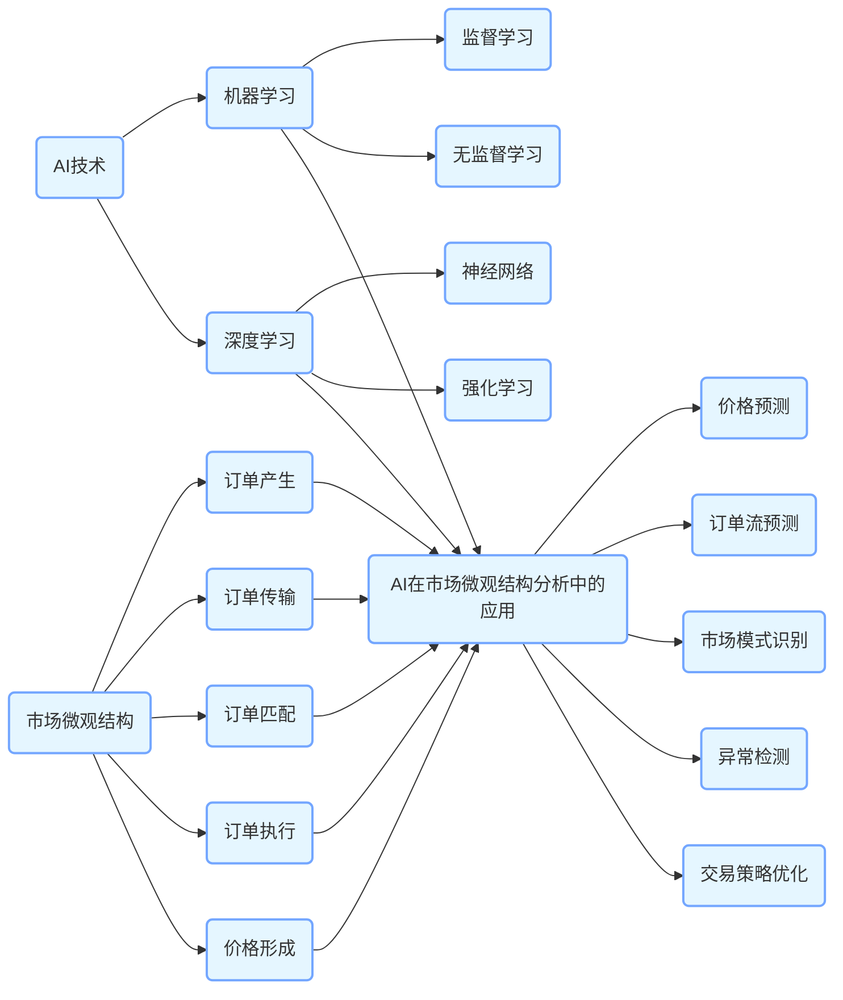

# AI驱动的市场微观结构分析

> 关键词：AI、市场微观结构分析、算法交易、机器学习、深度学习、高频交易、量化投资

> 摘要：本文深入探讨了AI驱动的市场微观结构分析这一前沿领域。从背景介绍入手，明确目的、范围、预期读者和文档结构，并对相关术语进行解释。接着阐述核心概念及其联系，包括市场微观结构的基本原理和AI在其中的作用机制，通过文本示意图和Mermaid流程图直观展示。详细讲解核心算法原理，结合Python源代码进行说明，同时给出数学模型和公式，并举例阐释。通过项目实战，展示开发环境搭建、源代码实现及代码解读。分析实际应用场景，推荐学习资源、开发工具框架和相关论文著作。最后总结未来发展趋势与挑战，解答常见问题，并提供扩展阅读和参考资料，旨在为读者全面呈现AI在市场微观结构分析中的应用与发展。

## 1. 背景介绍 
### 1.1 目的和范围
市场微观结构分析主要研究金融市场中资产交易的过程和机制，包括订单的形成、执行、价格发现等方面。传统的市场微观结构分析方法往往依赖于简单的统计模型和经验法则，难以处理复杂多变的市场数据。随着人工智能技术的飞速发展，AI在市场微观结构分析中的应用越来越广泛。本文的目的在于深入探讨AI如何驱动市场微观结构分析，介绍相关的核心概念、算法原理、数学模型以及实际应用案例。范围涵盖了从基础的机器学习算法到先进的深度学习技术在市场微观结构分析中的应用，以及相关的开发工具和资源。

### 1.2 预期读者
本文预期读者包括金融领域的从业者，如量化分析师、交易员、投资经理等，他们希望了解如何利用AI技术提升市场微观结构分析的能力和效果；计算机科学和人工智能领域的研究者和开发者，对将AI技术应用于金融市场感兴趣；以及对金融市场和人工智能交叉领域有学习需求的学生和爱好者。

### 1.3 文档结构概述
本文首先介绍背景信息，包括目的、范围、预期读者和文档结构，以及相关术语。接着阐述核心概念与联系，通过文本示意图和Mermaid流程图展示市场微观结构和AI的关系。然后详细讲解核心算法原理，给出Python源代码示例，并介绍数学模型和公式。通过项目实战，展示开发环境搭建、源代码实现和代码解读。分析实际应用场景，推荐学习资源、开发工具框架和相关论文著作。最后总结未来发展趋势与挑战，解答常见问题，并提供扩展阅读和参考资料。

### 1.4 术语表
#### 1.4.1 核心术语定义
- **市场微观结构**：指金融市场中资产交易的具体机制和过程，包括订单的提交、匹配、执行，以及价格的形成和变化等。
- **AI（人工智能）**：是一门研究如何使计算机系统能够模拟人类智能的学科，包括机器学习、深度学习、自然语言处理等技术。
- **机器学习**：是AI的一个重要分支，通过让计算机从数据中学习模式和规律，从而进行预测和决策。
- **深度学习**：是一种基于人工神经网络的机器学习技术，能够自动从大量数据中学习复杂的特征和模式。
- **高频交易**：指利用计算机算法和高速网络，在极短的时间内进行大量交易的策略。
- **量化投资**：通过建立数学模型和算法，利用历史数据进行分析和预测，以实现投资决策的科学化和自动化。

#### 1.4.2 相关概念解释
- **订单簿**：是市场微观结构中的一个重要概念，记录了所有未成交的买入和卖出订单的信息，包括价格、数量等。
- **价格发现**：指市场通过交易过程确定资产合理价格的机制。
- **流动性**：指资产能够以合理价格快速买卖的能力。

#### 1.4.3 缩略词列表
- **AI**：Artificial Intelligence
- **ML**：Machine Learning
- **DL**：Deep Learning
- **HFT**：High-Frequency Trading
- **QIS**：Quantitative Investment Strategy

## 2. 核心概念与联系 

### 市场微观结构基本原理
市场微观结构主要关注金融市场中交易的具体过程和机制。它涉及到多个方面，包括订单的产生、传输、匹配和执行，以及价格的形成和波动。订单簿是市场微观结构的核心组成部分，它记录了所有买家和卖家的报价和数量。当买家的出价等于或高于卖家的要价时，交易就会发生，从而影响市场价格。

### AI在市场微观结构分析中的作用机制
AI技术可以通过对大量市场数据的分析和学习，帮助我们更好地理解市场微观结构。机器学习算法可以用于预测价格走势、识别市场模式和异常情况。深度学习模型，如神经网络，可以自动从复杂的数据中提取特征，从而更准确地进行预测和决策。例如，通过对历史订单簿数据的学习，AI模型可以预测未来的订单流和价格变化，为交易策略的制定提供依据。

### 文本示意图
```plaintext
市场微观结构
|-- 订单产生
|   |-- 投资者决策
|   |-- 交易策略生成
|-- 订单传输
|   |-- 交易系统
|   |-- 通信网络
|-- 订单匹配
|   |-- 订单簿
|   |-- 匹配算法
|-- 订单执行
|   |-- 交易清算
|   |-- 交割结算
|-- 价格形成
|   |-- 供需关系
|   |-- 市场情绪
|   |-- 信息传播

AI技术
|-- 机器学习
|   |-- 监督学习
|   |   |-- 分类算法
|   |   |-- 回归算法
|   |-- 无监督学习
|   |   |-- 聚类算法
|   |   |-- 降维算法
|-- 深度学习
|   |-- 神经网络
|   |   |-- 卷积神经网络
|   |   |-- 循环神经网络
|   |-- 强化学习
|   |   |-- 策略梯度算法
|   |   |-- Q学习算法

AI在市场微观结构分析中的应用
|-- 价格预测
|-- 订单流预测
|-- 市场模式识别
|-- 异常检测
|-- 交易策略优化
```

### Mermaid流程图


## 3. 核心算法原理 & 具体操作步骤 

### 线性回归算法原理
线性回归是一种简单而常用的机器学习算法，用于建立自变量和因变量之间的线性关系。在市场微观结构分析中，我们可以使用线性回归来预测资产价格。假设我们有一组自变量 $X = [x_1, x_2,..., x_n]$ 和因变量 $y$，线性回归模型的形式可以表示为：

$$y = \theta_0 + \theta_1x_1 + \theta_2x_2 +... + \theta_nx_n + \epsilon$$

其中，$\theta_0, \theta_1,..., \theta_n$ 是模型的参数，$\epsilon$ 是误差项。我们的目标是找到一组最优的参数 $\theta$，使得模型的预测值与实际值之间的误差最小。通常使用最小二乘法来求解参数 $\theta$，即最小化误差平方和：

$$J(\theta) = \frac{1}{2m}\sum_{i=1}^{m}(h_{\theta}(x^{(i)}) - y^{(i)})^2$$

其中，$m$ 是样本数量，$h_{\theta}(x^{(i)})$ 是模型对第 $i$ 个样本的预测值，$y^{(i)}$ 是第 $i$ 个样本的实际值。

### Python代码实现
```python
import numpy as np
from sklearn.linear_model import LinearRegression

# 生成一些示例数据
X = np.array([[1], [2], [3], [4], [5]])
y = np.array([2, 4, 6, 8, 10])

# 创建线性回归模型
model = LinearRegression()

# 拟合模型
model.fit(X, y)

# 进行预测
new_X = np.array([[6]])
prediction = model.predict(new_X)

print("预测值:", prediction)
```

### 代码解释
1. **导入必要的库**：`numpy` 用于处理数值计算，`sklearn.linear_model.LinearRegression` 是线性回归模型的实现。
2. **生成示例数据**：创建自变量 $X$ 和因变量 $y$。
3. **创建线性回归模型**：实例化 `LinearRegression` 类。
4. **拟合模型**：使用 `fit` 方法将模型拟合到数据上，即求解最优参数 $\theta$。
5. **进行预测**：使用 `predict` 方法对新的数据进行预测。

### 决策树算法原理
决策树是一种基于树结构进行决策的机器学习算法。在市场微观结构分析中，决策树可以用于分类和预测问题。决策树的构建过程是递归地将数据集划分为更小的子集，直到满足某个停止条件。每个内部节点代表一个特征的测试，每个分支代表一个测试输出，每个叶节点代表一个类别或值。

### Python代码实现
```python
from sklearn.datasets import load_iris
from sklearn.tree import DecisionTreeClassifier
from sklearn.model_selection import train_test_split
from sklearn.metrics import accuracy_score

# 加载鸢尾花数据集
iris = load_iris()
X = iris.data
y = iris.target

# 划分训练集和测试集
X_train, X_test, y_train, y_test = train_test_split(X, y, test_size=0.2, random_state=42)

# 创建决策树分类器
clf = DecisionTreeClassifier()

# 拟合模型
clf.fit(X_train, y_train)

# 进行预测
y_pred = clf.predict(X_test)

# 计算准确率
accuracy = accuracy_score(y_test, y_pred)

print("准确率:", accuracy)
```

### 代码解释
1. **导入必要的库**：`load_iris` 用于加载鸢尾花数据集，`DecisionTreeClassifier` 是决策树分类器的实现，`train_test_split` 用于划分训练集和测试集，`accuracy_score` 用于计算准确率。
2. **加载数据集**：使用 `load_iris` 加载鸢尾花数据集，并将特征和标签分别存储在 $X$ 和 $y$ 中。
3. **划分训练集和测试集**：使用 `train_test_split` 将数据集划分为训练集和测试集，测试集占比为 20%。
4. **创建决策树分类器**：实例化 `DecisionTreeClassifier` 类。
5. **拟合模型**：使用 `fit` 方法将模型拟合到训练数据上。
6. **进行预测**：使用 `predict` 方法对测试数据进行预测。
7. **计算准确率**：使用 `accuracy_score` 计算预测结果的准确率。

## 4. 数学模型和公式 & 详细讲解 & 举例说明 

### 线性回归的数学模型和公式
线性回归的目标是找到一组最优的参数 $\theta$，使得误差平方和 $J(\theta)$ 最小。可以使用梯度下降法来求解参数 $\theta$。梯度下降法的基本思想是沿着误差函数的负梯度方向更新参数，直到达到局部最优解。

梯度下降法的更新公式为：

$$\theta_j := \theta_j - \alpha\frac{\partial J(\theta)}{\partial \theta_j}$$

其中，$\alpha$ 是学习率，控制参数更新的步长。

对于线性回归，误差函数 $J(\theta)$ 的偏导数为：

$$\frac{\partial J(\theta)}{\partial \theta_j} = \frac{1}{m}\sum_{i=1}^{m}(h_{\theta}(x^{(i)}) - y^{(i)})x_j^{(i)}$$

### 举例说明
假设我们有以下数据集：

| $x$ | $y$ |
| --- | --- |
| 1   | 2   |
| 2   | 4   |
| 3   | 6   |

我们使用线性回归模型 $y = \theta_0 + \theta_1x$ 来拟合数据。初始参数 $\theta_0 = 0$，$\theta_1 = 0$，学习率 $\alpha = 0.01$。

1. 计算误差函数 $J(\theta)$：

$$J(\theta) = \frac{1}{2\times3}[( \theta_0 + \theta_1\times1 - 2)^2 + (\theta_0 + \theta_1\times2 - 4)^2 + (\theta_0 + \theta_1\times3 - 6)^2]$$

2. 计算偏导数：

$$\frac{\partial J(\theta)}{\partial \theta_0} = \frac{1}{3}[( \theta_0 + \theta_1\times1 - 2) + (\theta_0 + \theta_1\times2 - 4) + (\theta_0 + \theta_1\times3 - 6)]$$

$$\frac{\partial J(\theta)}{\partial \theta_1} = \frac{1}{3}[( \theta_0 + \theta_1\times1 - 2)\times1 + (\theta_0 + \theta_1\times2 - 4)\times2 + (\theta_0 + \theta_1\times3 - 6)\times3]$$

3. 更新参数：

$$\theta_0 := \theta_0 - \alpha\frac{\partial J(\theta)}{\partial \theta_0}$$

$$\theta_1 := \theta_1 - \alpha\frac{\partial J(\theta)}{\partial \theta_1}$$

重复步骤 1 - 3，直到参数收敛。

### 决策树的数学模型和公式
决策树的构建过程通常使用信息增益或基尼不纯度来选择最优的划分特征。信息增益是基于信息熵的概念，用于衡量划分前后数据集的不确定性减少程度。信息熵的计算公式为：

$$H(S) = -\sum_{i=1}^{c}p_i\log_2p_i$$

其中，$S$ 是数据集，$c$ 是类别数，$p_i$ 是第 $i$ 个类别的概率。

信息增益的计算公式为：

$$IG(S, A) = H(S) - \sum_{v\in Values(A)}\frac{|S_v|}{|S|}H(S_v)$$

其中，$A$ 是特征，$Values(A)$ 是特征 $A$ 的取值集合，$S_v$ 是数据集 $S$ 中特征 $A$ 取值为 $v$ 的子集。

### 举例说明
假设我们有以下数据集：

| 天气 | 温度 | 湿度 | 风力 | 是否打球 |
| --- | --- | --- | --- | --- |
| 晴 | 高 | 高 | 弱 | 否 |
| 晴 | 高 | 高 | 强 | 否 |
| 多云 | 高 | 高 | 弱 | 是 |
| 雨 | 适中 | 高 | 弱 | 是 |
| 雨 | 低 | 正常 | 弱 | 是 |
| 雨 | 低 | 正常 | 强 | 否 |
| 多云 | 低 | 正常 | 强 | 是 |
| 晴 | 适中 | 高 | 弱 | 否 |
| 晴 | 低 | 正常 | 弱 | 是 |
| 雨 | 适中 | 正常 | 弱 | 是 |
| 晴 | 适中 | 正常 | 强 | 是 |
| 多云 | 适中 | 高 | 强 | 是 |
| 多云 | 高 | 正常 | 弱 | 是 |
| 雨 | 适中 | 高 | 强 | 否 |

我们要构建一个决策树来预测是否打球。首先计算数据集的信息熵：

$$H(S) = -\frac{9}{14}\log_2\frac{9}{14} - \frac{5}{14}\log_2\frac{5}{14} \approx 0.94$$

然后计算每个特征的信息增益：

以天气特征为例：

- 天气为晴时，数据集 $S_{晴}$ 中有 5 个样本，其中 2 个打球，3 个不打球，信息熵为：

$$H(S_{晴}) = -\frac{2}{5}\log_2\frac{2}{5} - \frac{3}{5}\log_2\frac{3}{5} \approx 0.97$$

- 天气为多云时，数据集 $S_{多云}$ 中有 4 个样本，其中 4 个打球，信息熵为：

$$H(S_{多云}) = -\frac{4}{4}\log_2\frac{4}{4} = 0$$

- 天气为雨时，数据集 $S_{雨}$ 中有 5 个样本，其中 3 个打球，2 个不打球，信息熵为：

$$H(S_{雨}) = -\frac{3}{5}\log_2\frac{3}{5} - \frac{2}{5}\log_2\frac{2}{5} \approx 0.97$$

- 天气特征的信息增益为：

$$IG(S, 天气) = 0.94 - (\frac{5}{14}\times0.97 + \frac{4}{14}\times0 + \frac{5}{14}\times0.97) \approx 0.24$$

同理，可以计算其他特征的信息增益，选择信息增益最大的特征作为根节点的划分特征，然后递归地构建决策树。

## 5. 项目实战：代码实际案例和详细解释说明 

### 5.1  开发环境搭建
#### 安装Python
首先需要安装Python，建议使用Python 3.7及以上版本。可以从Python官方网站（https://www.python.org/downloads/）下载适合自己操作系统的安装包，然后按照安装向导进行安装。

#### 安装必要的库
在命令行中使用 `pip` 安装以下必要的库：
```sh
pip install numpy pandas scikit-learn matplotlib
```
- `numpy`：用于处理数值计算。
- `pandas`：用于数据处理和分析。
- `scikit-learn`：提供了各种机器学习算法的实现。
- `matplotlib`：用于数据可视化。

### 5.2  源代码详细实现和代码解读
#### 数据准备
```python
import pandas as pd
from sklearn.model_selection import train_test_split

# 读取数据集
data = pd.read_csv('market_data.csv')

# 提取特征和标签
X = data.drop('target', axis=1)
y = data['target']

# 划分训练集和测试集
X_train, X_test, y_train, y_test = train_test_split(X, y, test_size=0.2, random_state=42)
```
代码解释：
1. **读取数据集**：使用 `pandas` 的 `read_csv` 函数读取存储在 `market_data.csv` 中的市场数据。
2. **提取特征和标签**：将数据集中除了目标列 `target` 以外的列作为特征，存储在 $X$ 中；将目标列作为标签，存储在 $y$ 中。
3. **划分训练集和测试集**：使用 `train_test_split` 函数将数据集划分为训练集和测试集，测试集占比为 20%。

#### 模型训练
```python
from sklearn.ensemble import RandomForestClassifier

# 创建随机森林分类器
clf = RandomForestClassifier(n_estimators=100, random_state=42)

# 拟合模型
clf.fit(X_train, y_train)
```
代码解释：
1. **创建随机森林分类器**：使用 `scikit-learn` 的 `RandomForestClassifier` 类创建一个随机森林分类器，设置树的数量为 100。
2. **拟合模型**：使用 `fit` 方法将模型拟合到训练数据上。

#### 模型评估
```python
from sklearn.metrics import accuracy_score, classification_report

# 进行预测
y_pred = clf.predict(X_test)

# 计算准确率
accuracy = accuracy_score(y_test, y_pred)
print("准确率:", accuracy)

# 打印分类报告
print(classification_report(y_test, y_pred))
```
代码解释：
1. **进行预测**：使用 `predict` 方法对测试数据进行预测。
2. **计算准确率**：使用 `accuracy_score` 函数计算预测结果的准确率。
3. **打印分类报告**：使用 `classification_report` 函数打印分类报告，包括精确率、召回率、F1 值等指标。

### 5.3  代码解读与分析
- **数据准备阶段**：数据的质量和特征的选择对模型的性能有很大影响。在实际应用中，可能需要对数据进行清洗、预处理和特征工程，以提高模型的准确性。
- **模型训练阶段**：随机森林是一种集成学习算法，通过组合多个决策树来提高模型的性能。`n_estimators` 参数控制树的数量，一般来说，树的数量越多，模型的性能越好，但训练时间也会相应增加。
- **模型评估阶段**：准确率是一个常用的评估指标，但在某些情况下，可能需要考虑其他指标，如精确率、召回率和 F1 值，以更全面地评估模型的性能。

## 6. 实际应用场景 
### 高频交易
在高频交易中，AI驱动的市场微观结构分析可以帮助交易员快速捕捉市场机会。通过对订单簿数据的实时分析，AI模型可以预测订单流的变化和价格走势，从而制定最优的交易策略。例如，当模型预测到某个资产的价格即将上涨时，交易员可以及时买入；当预测到价格即将下跌时，可以及时卖出。

### 量化投资
量化投资通过建立数学模型和算法来进行投资决策。AI技术可以用于优化量化投资策略，提高投资组合的收益和风险控制能力。例如，通过对市场微观结构的分析，AI模型可以识别出市场中的异常波动和趋势，从而调整投资组合的权重。

### 风险管理
金融机构需要对市场风险进行有效的管理。AI驱动的市场微观结构分析可以帮助金融机构更好地理解市场风险的来源和特征，从而制定相应的风险管理策略。例如，通过对市场流动性的分析，金融机构可以评估资产的变现能力，避免因流动性不足而导致的损失。

### 市场监管
监管机构需要对金融市场进行监管，维护市场的公平、公正和透明。AI技术可以用于监测市场中的异常交易行为和操纵市场的行为。通过对市场微观结构数据的分析，监管机构可以及时发现可疑的交易模式，采取相应的监管措施。

## 7. 工具和资源推荐
### 7.1 学习资源推荐
#### 7.1.1 书籍推荐
- 《机器学习》（周志华）：这本书全面介绍了机器学习的基本概念、算法和应用，是机器学习领域的经典教材。
- 《深度学习》（Ian Goodfellow、Yoshua Bengio和Aaron Courville）：该书系统地介绍了深度学习的理论和实践，是深度学习领域的权威著作。
- 《金融市场微观结构理论》（Maurice G. Kendall）：这本书深入探讨了金融市场微观结构的理论和实践，是金融市场微观结构分析领域的重要参考书。

#### 7.1.2 在线课程
- Coursera上的“机器学习”课程（Andrew Ng教授）：这是一门非常经典的机器学习课程，适合初学者入门。
- edX上的“深度学习”课程（MIT）：该课程由麻省理工学院的教授授课，内容涵盖了深度学习的各个方面。
- Udemy上的“量化交易与金融数据分析”课程：该课程结合了量化交易和金融数据分析的知识，适合金融从业者和对量化投资感兴趣的人士。

#### 7.1.3 技术博客和网站
- Medium：上面有很多关于AI和金融市场的技术博客文章，作者来自世界各地的专业人士。
- Towards Data Science：专注于数据科学和机器学习领域的技术博客，有很多关于金融数据分析的文章。
- QuantNet：是一个量化金融领域的专业社区，提供了丰富的学习资源和交流平台。

### 7.2 开发工具框架推荐
#### 7.2.1 IDE和编辑器
- PyCharm：是一款专业的Python集成开发环境，提供了丰富的功能和插件，适合开发Python项目。
- Jupyter Notebook：是一个交互式的开发环境，适合进行数据探索和模型实验。
- Visual Studio Code：是一款轻量级的代码编辑器，支持多种编程语言，有丰富的插件生态系统。

#### 7.2.2 调试和性能分析工具
- Py-Spy：是一个Python性能分析工具，可以帮助我们找出代码中的性能瓶颈。
- PDB：是Python自带的调试器，可以帮助我们调试代码中的错误。
- TensorBoard：是TensorFlow的可视化工具，可以帮助我们可视化模型的训练过程和性能指标。

#### 7.2.3 相关框架和库
- TensorFlow：是一个开源的深度学习框架，提供了丰富的深度学习模型和工具。
- PyTorch：是另一个流行的深度学习框架，具有动态图的特点，易于使用和调试。
- scikit-learn：是一个简单而强大的机器学习库，提供了各种机器学习算法的实现。

### 7.3 相关论文著作推荐
#### 7.3.1 经典论文
- “The Limits of Arbitrage”（Andrei Shleifer和Robert W. Vishny）：该论文探讨了套利的局限性，对理解金融市场的有效性和异常现象有重要意义。
- “A Theory of Intraday Patterns: Volume and Price Variability”（Albert S. Kyle和Avraham Wohl）：这篇论文提出了一个关于日内交易模式的理论模型，对市场微观结构的研究有重要贡献。
- “Machine Learning for Asset Managers”（Lopez de Prado）：该论文介绍了机器学习在资产管理中的应用，是该领域的经典之作。

#### 7.3.2 最新研究成果
- 可以关注顶级金融学术期刊，如《Journal of Finance》、《Review of Financial Studies》等，上面会发表关于市场微观结构和AI应用的最新研究成果。
- 还可以关注机器学习和人工智能领域的顶级会议，如NeurIPS、ICML等，了解相关领域的最新技术和应用。

#### 7.3.3 应用案例分析
- 一些金融机构和量化投资公司会发布他们在市场微观结构分析和AI应用方面的案例研究报告，可以通过他们的官方网站或专业金融媒体获取这些报告。

## 8. 总结：未来发展趋势与挑战
### 未来发展趋势
- **更复杂的模型应用**：随着AI技术的不断发展，未来会有更多复杂的模型应用于市场微观结构分析，如深度强化学习、生成对抗网络等。这些模型可以更好地处理复杂的市场数据和动态变化的市场环境。
- **多源数据融合**：除了传统的市场数据，未来会融合更多的多源数据，如社交媒体数据、新闻数据、卫星图像数据等。通过对多源数据的分析，可以更全面地了解市场的情况和投资者的情绪。
- **实时分析和决策**：随着计算能力的提升和数据传输速度的加快，未来的市场微观结构分析将更加注重实时性。交易员和投资者可以根据实时的分析结果做出快速的决策。
- **与区块链技术结合**：区块链技术具有去中心化、不可篡改等特点，可以为市场微观结构分析提供更可靠的数据来源。未来，AI和区块链技术的结合可能会为金融市场带来新的变革。

### 挑战
- **数据质量和隐私问题**：市场微观结构分析需要大量的数据，但数据的质量和隐私问题是一个挑战。如何确保数据的准确性、完整性和安全性，以及如何在保护用户隐私的前提下进行数据分析，是需要解决的问题。
- **模型解释性**：一些复杂的AI模型，如深度学习模型，往往是黑箱模型，难以解释其决策过程和结果。在金融领域，模型的解释性非常重要，因为监管机构和投资者需要了解模型的决策依据。
- **市场变化和适应性**：金融市场是动态变化的，市场规则、投资者行为和宏观经济环境都可能发生变化。如何使AI模型能够适应市场的变化，及时调整策略，是一个挑战。
- **人才短缺**：AI驱动的市场微观结构分析需要既懂金融又懂AI技术的复合型人才。目前，这类人才相对短缺，如何培养和吸引更多的复合型人才是行业面临的挑战之一。

## 9. 附录：常见问题与解答
### 问题1：AI技术在市场微观结构分析中的应用是否会取代人类交易员？
解答：虽然AI技术在市场微观结构分析中具有很多优势，但目前还不会完全取代人类交易员。AI模型可以帮助交易员快速分析大量数据、发现市场机会和制定策略，但人类交易员具有丰富的经验、判断力和创造力，能够处理一些复杂的情况和不确定性。未来，AI技术和人类交易员将相互补充，共同提高交易的效率和效果。

### 问题2：如何评估AI模型在市场微观结构分析中的性能？
解答：可以使用多种指标来评估AI模型在市场微观结构分析中的性能，如准确率、精确率、召回率、F1值、均方误差等。此外，还可以通过回测和模拟交易来评估模型在实际市场中的表现。同时，需要注意模型的泛化能力，即模型在新数据上的表现。

### 问题3：在使用AI技术进行市场微观结构分析时，需要注意哪些法律和监管问题？
解答：在使用AI技术进行市场微观结构分析时，需要遵守相关的法律法规和监管要求。例如，需要保护用户的隐私和数据安全，不得进行内幕交易和市场操纵等违法行为。此外，一些金融监管机构可能对AI模型的使用有特定的要求和规范，需要进行合规性审查。

### 问题4：如何选择适合的AI算法和模型进行市场微观结构分析？
解答：选择适合的AI算法和模型需要考虑多个因素，如数据的特点、问题的类型、模型的复杂度和可解释性等。对于简单的分类和回归问题，可以选择线性回归、逻辑回归、决策树等算法；对于复杂的模式识别和预测问题，可以选择深度学习模型，如神经网络、卷积神经网络等。同时，需要进行模型的比较和评估，选择性能最优的模型。

## 10. 扩展阅读 & 参考资料
### 扩展阅读
- 《人工智能时代的金融风险管理》
- 《量化交易实战》
- 《金融科技前沿》

### 参考资料
- [周志华. 机器学习[M]. 清华大学出版社, 2016.](https://book.douban.com/subject/25708119/)
- [Ian Goodfellow, Yoshua Bengio, Aaron Courville. Deep Learning[M]. MIT Press, 2016.](https://www.deeplearningbook.org/)
- [Maurice G. Kendall. The Advanced Theory of Statistics[M]. Charles Griffin & Company Limited, 1943.](https://www.worldcat.org/title/advanced-theory-of-statistics/oclc/2346083)

作者：AI天才研究院/AI Genius Institute & 禅与计算机程序设计艺术 /Zen And The Art of Computer Programming