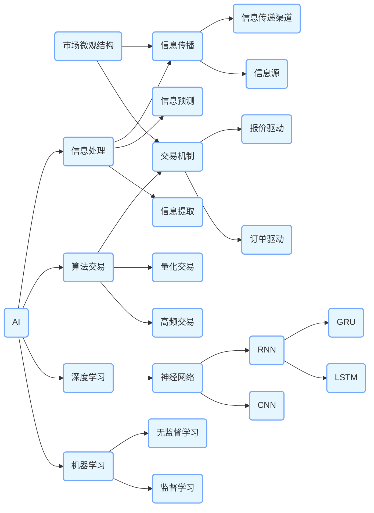

# AI驱动的市场微观结构变化影响分析

> 关键词：AI、市场微观结构、变化影响、算法交易、信息传播

> 摘要：本文聚焦于AI驱动下市场微观结构的变化及影响。首先介绍了研究的背景、目的、预期读者等内容。接着阐述了相关核心概念及其联系，详细讲解了核心算法原理与操作步骤，并运用数学模型和公式进行深入分析。通过项目实战案例，展示了AI在市场微观结构中的具体应用。探讨了实际应用场景，推荐了相关的学习资源、开发工具框架和论文著作。最后总结了未来发展趋势与挑战，提供了常见问题解答和扩展阅读参考资料，旨在全面剖析AI对市场微观结构的多方面影响。

## 1. 背景介绍 
### 1.1 目的和范围
随着人工智能技术的飞速发展，其在金融市场等各个领域的应用日益广泛。本研究的目的在于深入分析AI驱动下市场微观结构所发生的变化以及这些变化带来的影响。研究范围涵盖了股票市场、期货市场等多种金融市场，以及其他涉及交易和价格形成机制的市场，旨在全面揭示AI对市场微观层面的作用机制和效果。

### 1.2 预期读者
本文预期读者包括金融市场从业者，如交易员、分析师、基金经理等，他们可以通过本文了解AI对市场交易的具体影响，以便调整交易策略和风险管理方法；计算机科学领域的研究人员和开发者，可从中获取AI在金融市场应用的案例和思路；高校相关专业的师生，有助于他们进行学术研究和教学活动；同时也适合对金融市场和人工智能交叉领域感兴趣的普通读者。

### 1.3 文档结构概述
本文将首先介绍相关的核心概念和它们之间的联系，构建起理论基础。然后详细讲解核心算法原理和具体操作步骤，结合Python代码进行阐述。接着运用数学模型和公式对相关现象进行量化分析，并举例说明。通过项目实战展示AI在市场微观结构中的实际应用，包括开发环境搭建、源代码实现和解读。探讨AI在不同市场中的实际应用场景，推荐相关的学习资源、开发工具框架和论文著作。最后总结未来发展趋势与挑战，提供常见问题解答和扩展阅读参考资料。

### 1.4 术语表
#### 1.4.1 核心术语定义
- **市场微观结构**：指市场交易机制和交易过程中的各种细节，包括价格形成机制、交易指令处理、市场参与者行为等方面，它描述了市场在微观层面的运行方式。
- **AI（人工智能）**：是一门研究如何使计算机系统能够模拟人类智能的技术，包括机器学习、深度学习、自然语言处理等多种技术手段，可用于数据分析、预测和决策等任务。
- **算法交易**：利用计算机算法自动生成和执行交易指令的交易方式，通过预设的规则和模型来决定交易的时机、价格和数量。
- **信息传播**：市场中各种信息在参与者之间传递和扩散的过程，信息传播的速度和方式会影响市场参与者的决策和市场价格的形成。

#### 1.4.2 相关概念解释
- **高频交易**：是算法交易的一种特殊形式，它利用高速计算机系统在极短的时间内进行大量的交易，旨在从微小的价格波动中获取利润。高频交易通常依赖于快速的信息处理和交易执行能力。
- **市场流动性**：指市场中资产能够以合理价格快速买卖的能力。高流动性意味着市场中有大量的买家和卖家，交易成本较低；低流动性则可能导致交易困难和价格波动较大。
- **价格发现**：市场通过交易活动确定资产合理价格的过程。在有效的市场中，价格发现机制能够使资产价格反映其内在价值，但在AI影响下，价格发现过程可能会发生变化。

#### 1.4.3 缩略词列表
- **AI**：Artificial Intelligence（人工智能）
- **ML**：Machine Learning（机器学习）
- **DL**：Deep Learning（深度学习）
- **HFT**：High-Frequency Trading（高频交易）

## 2. 核心概念与联系 

### 核心概念原理
#### 市场微观结构原理
市场微观结构主要基于交易机制和信息传递来运行。交易机制包括订单驱动和报价驱动两种基本模式。在订单驱动市场中，买卖双方提交订单，通过订单匹配来完成交易，价格由供求关系决定。例如，在股票市场中，投资者提交买入或卖出订单，交易所的交易系统根据一定的规则（如价格优先、时间优先）进行订单匹配。报价驱动市场则由做市商提供买卖报价，投资者与做市商进行交易，做市商通过买卖价差获取利润。信息传递在市场微观结构中起着关键作用，新的信息会影响市场参与者的预期和决策，从而导致价格的波动。

#### AI原理
AI主要基于机器学习和深度学习技术。机器学习是让计算机通过数据学习模式和规律，以实现预测和决策的能力。例如，使用监督学习算法，如线性回归、决策树等，根据历史数据训练模型，预测未来的市场价格。深度学习则是机器学习的一个分支，它通过构建多层神经网络来自动提取数据中的复杂特征。例如，卷积神经网络（CNN）在图像识别中表现出色，而循环神经网络（RNN）及其变体（如LSTM、GRU）在处理序列数据（如时间序列的市场数据）方面具有优势。

### 核心概念架构
以下是市场微观结构与AI相互作用的架构示意图：



这个架构图展示了市场微观结构和AI的各个组成部分及其相互关系。AI通过算法交易影响市场的交易机制，通过信息处理影响市场的信息传播。同时，市场微观结构中的交易机制和信息传播也为AI提供了数据和应用场景。

## 3. 核心算法原理 & 具体操作步骤 

### 核心算法原理
#### 机器学习算法：线性回归
线性回归是一种简单而常用的监督学习算法，用于建立自变量和因变量之间的线性关系。在市场微观结构分析中，我们可以使用线性回归来预测市场价格。假设我们有一组历史市场数据，包括多个特征（如交易量、开盘价、最高价等）和对应的收盘价，我们可以使用线性回归模型来建立这些特征与收盘价之间的关系。

线性回归的数学模型可以表示为：

$y = \theta_0 + \theta_1x_1 + \theta_2x_2 + \cdots + \theta_nx_n + \epsilon$

其中，$y$ 是因变量（如收盘价），$x_1, x_2, \cdots, x_n$ 是自变量（如交易量、开盘价等），$\theta_0, \theta_1, \cdots, \theta_n$ 是模型的参数，$\epsilon$ 是误差项。

#### 深度学习算法：LSTM
长短期记忆网络（LSTM）是一种特殊的循环神经网络，能够有效处理序列数据中的长期依赖关系。在市场微观结构分析中，市场数据通常是时间序列数据，LSTM可以捕捉到价格和交易量等数据在不同时间步的变化规律。

LSTM的核心结构包括输入门、遗忘门和输出门，通过这些门控机制来控制信息的流动和记忆。具体来说，遗忘门决定了上一时刻的细胞状态有多少信息需要被遗忘；输入门决定了当前输入有多少信息需要被添加到细胞状态中；输出门决定了当前细胞状态有多少信息需要被输出。

### 具体操作步骤

#### 数据收集与预处理
首先，我们需要收集市场数据，包括历史价格、交易量等信息。可以从金融数据提供商（如雅虎财经、万得等）获取数据。然后，对数据进行预处理，包括数据清洗（去除缺失值、异常值等）、归一化（将数据缩放到一定的范围，如[0, 1]）等操作。

以下是使用Python进行数据收集和预处理的示例代码：

```python
import pandas as pd
import numpy as np
from sklearn.preprocessing import MinMaxScaler

# 假设从雅虎财经获取数据
def get_market_data(ticker, start_date, end_date):
    import yfinance as yf
    data = yf.download(ticker, start=start_date, end=end_date)
    return data

# 数据预处理
def preprocess_data(data):
    # 去除缺失值
    data = data.dropna()
    # 选择需要的特征
    features = data[['Open', 'High', 'Low', 'Close', 'Volume']]
    # 归一化处理
    scaler = MinMaxScaler()
    scaled_features = scaler.fit_transform(features)
    return scaled_features, scaler

# 示例使用
ticker = 'AAPL'
start_date = '2020-01-01'
end_date = '2021-01-01'
market_data = get_market_data(ticker, start_date, end_date)
scaled_data, scaler = preprocess_data(market_data)
```

#### 模型训练
接下来，我们使用预处理后的数据来训练模型。以线性回归为例，我们可以使用 `scikit-learn` 库来实现。

```python
from sklearn.linear_model import LinearRegression
from sklearn.model_selection import train_test_split

# 划分训练集和测试集
X = scaled_data[:, :-1]  # 特征
y = scaled_data[:, -1]   # 目标值
X_train, X_test, y_train, y_test = train_test_split(X, y, test_size=0.2, random_state=42)

# 训练线性回归模型
model = LinearRegression()
model.fit(X_train, y_train)
```

对于LSTM模型，我们可以使用 `Keras` 库来实现。

```python
from tensorflow.keras.models import Sequential
from tensorflow.keras.layers import LSTM, Dense

# 调整数据格式以适应LSTM输入
def create_sequences(data, seq_length):
    xs = []
    ys = []
    for i in range(len(data) - seq_length):
        x = data[i:i+seq_length]
        y = data[i+seq_length, -1]
        xs.append(x)
        ys.append(y)
    return np.array(xs), np.array(ys)

seq_length = 10
X_seq, y_seq = create_sequences(scaled_data, seq_length)
X_train_seq, X_test_seq, y_train_seq, y_test_seq = train_test_split(X_seq, y_seq, test_size=0.2, random_state=42)

# 构建LSTM模型
model_lstm = Sequential()
model_lstm.add(LSTM(50, input_shape=(seq_length, X_train_seq.shape[2])))
model_lstm.add(Dense(1))
model_lstm.compile(optimizer='adam', loss='mse')

# 训练LSTM模型
model_lstm.fit(X_train_seq, y_train_seq, epochs=50, batch_size=32)
```

#### 模型评估与预测
训练完成后，我们需要对模型进行评估，以确定其性能。可以使用均方误差（MSE）、均方根误差（RMSE）等指标来评估模型的预测准确性。

```python
from sklearn.metrics import mean_squared_error

# 线性回归模型评估
y_pred = model.predict(X_test)
mse = mean_squared_error(y_test, y_pred)
rmse = np.sqrt(mse)
print(f'Linear Regression MSE: {mse}, RMSE: {rmse}')

# LSTM模型评估
y_pred_lstm = model_lstm.predict(X_test_seq)
mse_lstm = mean_squared_error(y_test_seq, y_pred_lstm)
rmse_lstm = np.sqrt(mse_lstm)
print(f'LSTM MSE: {mse_lstm}, RMSE: {rmse_lstm}')
```

最后，我们可以使用训练好的模型进行预测。

```python
# 线性回归模型预测
new_data = scaled_data[-1, :-1].reshape(1, -1)
predicted_price = model.predict(new_data)
print(f'Linear Regression Predicted Price: {predicted_price}')

# LSTM模型预测
last_sequence = scaled_data[-seq_length:].reshape(1, seq_length, -1)
predicted_price_lstm = model_lstm.predict(last_sequence)
print(f'LSTM Predicted Price: {predicted_price_lstm}')
```

## 4. 数学模型和公式 & 详细讲解 & 举例说明 

### 线性回归模型
#### 数学公式
线性回归模型的目标是找到一组参数 $\theta = [\theta_0, \theta_1, \cdots, \theta_n]^T$，使得预测值 $\hat{y}$ 与真实值 $y$ 之间的误差最小。通常使用最小二乘法来求解参数，即最小化误差平方和：

$J(\theta) = \frac{1}{2m} \sum_{i=1}^{m} (h_{\theta}(x^{(i)}) - y^{(i)})^2$

其中，$m$ 是样本数量，$x^{(i)}$ 是第 $i$ 个样本的特征向量，$y^{(i)}$ 是第 $i$ 个样本的真实值，$h_{\theta}(x^{(i)}) = \theta_0 + \theta_1x_1^{(i)} + \theta_2x_2^{(i)} + \cdots + \theta_nx_n^{(i)}$ 是预测值。

#### 详细讲解
最小二乘法的原理是通过对误差平方和 $J(\theta)$ 求偏导数，并令偏导数等于0，得到参数 $\theta$ 的最优解。具体来说，对于参数 $\theta_j$，其偏导数为：

$\frac{\partial J(\theta)}{\partial \theta_j} = \frac{1}{m} \sum_{i=1}^{m} (h_{\theta}(x^{(i)}) - y^{(i)})x_j^{(i)}$

令 $\frac{\partial J(\theta)}{\partial \theta_j} = 0$，可以得到一个方程组，解这个方程组就可以得到参数 $\theta$ 的值。在实际应用中，通常使用矩阵运算来求解，参数 $\theta$ 的解可以表示为：

$\theta = (X^T X)^{-1} X^T y$

其中，$X$ 是样本特征矩阵，$y$ 是样本真实值向量。

#### 举例说明
假设我们有以下市场数据：

| 交易量 | 开盘价 | 收盘价 |
| ---- | ---- | ---- |
| 100 | 20 | 22 |
| 200 | 21 | 23 |
| 300 | 22 | 24 |

我们可以使用线性回归模型来预测收盘价。首先，将数据表示为矩阵形式：

$X = \begin{bmatrix} 1 & 100 & 20 \\ 1 & 200 & 21 \\ 1 & 300 & 22 \end{bmatrix}$

$y = \begin{bmatrix} 22 \\ 23 \\ 24 \end{bmatrix}$

然后，计算 $(X^T X)^{-1} X^T y$ 得到参数 $\theta$ 的值，进而可以进行预测。

### LSTM模型
#### 数学公式
LSTM的核心公式包括遗忘门、输入门、输出门和细胞状态的更新公式。

遗忘门：

$f_t = \sigma(W_f [h_{t-1}, x_t] + b_f)$

输入门：

$i_t = \sigma(W_i [h_{t-1}, x_t] + b_i)$

候选细胞状态：

$\tilde{C}_t = \tanh(W_C [h_{t-1}, x_t] + b_C)$

细胞状态更新：

$C_t = f_t \odot C_{t-1} + i_t \odot \tilde{C}_t$

输出门：

$o_t = \sigma(W_o [h_{t-1}, x_t] + b_o)$

隐藏状态更新：

$h_t = o_t \odot \tanh(C_t)$

其中，$x_t$ 是当前时刻的输入，$h_{t-1}$ 是上一时刻的隐藏状态，$C_{t-1}$ 是上一时刻的细胞状态，$\sigma$ 是 sigmoid 函数，$\tanh$ 是双曲正切函数，$\odot$ 表示逐元素相乘，$W_f, W_i, W_C, W_o$ 是权重矩阵，$b_f, b_i, b_C, b_o$ 是偏置向量。

#### 详细讲解
遗忘门 $f_t$ 决定了上一时刻的细胞状态 $C_{t-1}$ 中有多少信息需要被遗忘。输入门 $i_t$ 决定了当前输入 $x_t$ 中有多少信息需要被添加到细胞状态中。候选细胞状态 $\tilde{C}_t$ 是根据当前输入和上一时刻的隐藏状态计算得到的新的细胞状态候选值。细胞状态 $C_t$ 通过遗忘门和输入门的控制进行更新。输出门 $o_t$ 决定了当前细胞状态 $C_t$ 中有多少信息需要被输出到当前时刻的隐藏状态 $h_t$ 中。

#### 举例说明
假设我们有一个时间序列的市场数据，每个时间步的输入 $x_t$ 是一个包含多个特征的向量。在第 $t$ 个时间步，首先计算遗忘门 $f_t$，根据 $f_t$ 的值决定是否遗忘上一时刻细胞状态 $C_{t-1}$ 中的某些信息。然后计算输入门 $i_t$ 和候选细胞状态 $\tilde{C}_t$，将 $i_t$ 和 $\tilde{C}_t$ 相乘并与经过遗忘门处理后的 $C_{t-1}$ 相加，得到新的细胞状态 $C_t$。最后，计算输出门 $o_t$，根据 $o_t$ 和 $\tanh(C_t)$ 得到当前时刻的隐藏状态 $h_t$。通过不断地更新细胞状态和隐藏状态，LSTM可以捕捉到时间序列数据中的长期依赖关系。

## 5. 项目实战：代码实际案例和详细解释说明 

### 5.1  开发环境搭建
#### 安装Python
首先，需要安装Python编程语言。建议使用Python 3.7及以上版本，可以从Python官方网站（https://www.python.org/downloads/） 下载安装包进行安装。

#### 安装必要的库
在项目中，我们需要使用一些Python库，如 `pandas` 用于数据处理，`numpy` 用于数值计算，`scikit-learn` 用于机器学习算法，`tensorflow` 或 `pytorch` 用于深度学习算法，`yfinance` 用于获取金融数据。可以使用 `pip` 命令来安装这些库：

```sh
pip install pandas numpy scikit-learn tensorflow yfinance
```

### 5.2  源代码详细实现和代码解读
以下是一个完整的项目实战代码示例，使用LSTM模型预测股票价格。

```python
import pandas as pd
import numpy as np
from sklearn.preprocessing import MinMaxScaler
from tensorflow.keras.models import Sequential
from tensorflow.keras.layers import LSTM, Dense
import yfinance as yf

# 数据收集
def get_market_data(ticker, start_date, end_date):
    data = yf.download(ticker, start=start_date, end=end_date)
    return data

# 数据预处理
def preprocess_data(data):
    data = data.dropna()
    features = data[['Open', 'High', 'Low', 'Close', 'Volume']]
    scaler = MinMaxScaler()
    scaled_features = scaler.fit_transform(features)
    return scaled_features, scaler

# 创建时间序列数据
def create_sequences(data, seq_length):
    xs = []
    ys = []
    for i in range(len(data) - seq_length):
        x = data[i:i+seq_length]
        y = data[i+seq_length, -1]
        xs.append(x)
        ys.append(y)
    return np.array(xs), np.array(ys)

# 构建LSTM模型
def build_lstm_model(seq_length, input_dim):
    model = Sequential()
    model.add(LSTM(50, input_shape=(seq_length, input_dim)))
    model.add(Dense(1))
    model.compile(optimizer='adam', loss='mse')
    return model

# 主函数
def main():
    ticker = 'AAPL'
    start_date = '2020-01-01'
    end_date = '2021-01-01'
    market_data = get_market_data(ticker, start_date, end_date)
    scaled_data, scaler = preprocess_data(market_data)

    seq_length = 10
    X, y = create_sequences(scaled_data, seq_length)

    train_size = int(len(X) * 0.8)
    X_train, X_test = X[:train_size], X[train_size:]
    y_train, y_test = y[:train_size], y[train_size:]

    model = build_lstm_model(seq_length, X_train.shape[2])
    model.fit(X_train, y_train, epochs=50, batch_size=32)

    y_pred = model.predict(X_test)

    # 反归一化
    y_test_actual = scaler.inverse_transform(np.hstack((X_test[:, -1, :-1], y_test.reshape(-1, 1))))[:, -1]
    y_pred_actual = scaler.inverse_transform(np.hstack((X_test[:, -1, :-1], y_pred.reshape(-1, 1))))[:, -1]

    import matplotlib.pyplot as plt
    plt.plot(y_test_actual, label='Actual Price')
    plt.plot(y_pred_actual, label='Predicted Price')
    plt.legend()
    plt.show()

if __name__ == "__main__":
    main()
```

### 5.3  代码解读与分析
#### 数据收集部分
`get_market_data` 函数使用 `yfinance` 库从雅虎财经获取指定股票在指定日期范围内的市场数据，包括开盘价、最高价、最低价、收盘价和交易量等信息。

#### 数据预处理部分
`preprocess_data` 函数对获取到的数据进行清洗，去除缺失值，然后选择需要的特征进行归一化处理，将数据缩放到[0, 1]的范围内，以提高模型的训练效果。

#### 时间序列数据创建部分
`create_sequences` 函数将预处理后的数据转换为适合LSTM模型输入的时间序列数据。对于每个时间步，选取前 `seq_length` 个时间步的数据作为输入，下一个时间步的收盘价作为目标值。

#### 模型构建部分
`build_lstm_model` 函数构建一个简单的LSTM模型，包含一个LSTM层和一个全连接层。使用 `adam` 优化器和均方误差（MSE）损失函数进行模型训练。

#### 主函数部分
在主函数中，首先调用上述函数完成数据收集、预处理和时间序列数据创建。然后将数据划分为训练集和测试集，训练LSTM模型。最后，对模型的预测结果进行反归一化处理，将其转换为实际的股票价格，并使用 `matplotlib` 库绘制实际价格和预测价格的对比图。

通过这个项目实战，我们可以看到如何使用LSTM模型来预测股票价格，并且可以直观地观察到模型的预测效果。

## 6. 实际应用场景 
### 算法交易
AI在算法交易中有着广泛的应用。高频交易公司利用AI算法分析市场数据，快速捕捉微小的价格波动和交易机会，自动生成和执行交易指令。例如，通过分析市场的订单簿数据、交易历史数据等，AI算法可以预测价格的短期走势，从而决定是否进行买入或卖出操作。量化交易也是算法交易的一种形式，它利用AI技术构建量化模型，根据模型的信号进行交易决策，如基于多因子模型的选股策略等。

### 风险管理
在金融市场中，风险管理至关重要。AI可以帮助金融机构更好地识别和评估风险。通过分析大量的市场数据、宏观经济数据和企业财务数据等，AI模型可以预测市场的波动性和潜在的风险事件。例如，使用深度学习模型对信用风险进行评估，预测借款人的违约概率，从而帮助银行等金融机构合理调整信贷政策和风险敞口。

### 市场情绪分析
市场情绪对市场价格的波动有着重要影响。AI可以通过分析社交媒体、新闻报道等文本数据来感知市场情绪。例如，使用自然语言处理技术对新闻文章进行情感分析，判断市场参与者对某一资产或市场的看法是积极还是消极。金融机构可以根据市场情绪分析的结果调整投资策略，避免因市场情绪的过度波动而遭受损失。

### 价格发现
AI有助于提高市场的价格发现效率。通过分析大量的市场数据和信息，AI模型可以更准确地评估资产的内在价值，促进市场价格向其内在价值回归。例如，在股票市场中，AI算法可以综合考虑公司的基本面数据、行业竞争态势、宏观经济环境等因素，对股票的合理价格进行估计，从而为投资者提供更有价值的参考。

## 7. 工具和资源推荐
### 7.1 学习资源推荐
#### 7.1.1 书籍推荐
- 《Python机器学习》（Sebastian Raschka著）：这本书详细介绍了Python在机器学习中的应用，包括各种机器学习算法的原理和实现，适合初学者入门。
- 《深度学习》（Ian Goodfellow、Yoshua Bengio和Aaron Courville著）：深度学习领域的经典著作，全面介绍了深度学习的理论和实践，对理解AI的核心技术有很大帮助。
- 《金融市场微观结构理论》（Maureen O'Hara著）：系统阐述了金融市场微观结构的理论和模型，是研究市场微观结构的重要参考书籍。

#### 7.1.2 在线课程
- Coursera上的“机器学习”课程（Andrew Ng教授主讲）：这是一门非常经典的机器学习课程，涵盖了机器学习的基本概念、算法和应用，适合初学者学习。
- edX上的“深度学习”系列课程：由知名高校的教授授课，深入讲解了深度学习的各种技术和应用，对于想深入研究AI的学习者来说是很好的选择。
- Udemy上的“金融市场数据分析与量化交易”课程：结合金融市场实际案例，介绍了如何使用Python进行数据分析和量化交易，对金融从业者有很大的帮助。

#### 7.1.3 技术博客和网站
- Medium：上面有很多关于AI和金融市场的技术博客文章，涵盖了最新的研究成果和实践经验。
- Towards Data Science：专注于数据科学和机器学习领域，有很多高质量的技术文章和教程。
- 量化投资与机器学习论坛：专门讨论量化投资和机器学习在金融市场应用的论坛，有很多从业者和研究者分享经验和观点。

### 7.2 开发工具框架推荐
#### 7.2.1 IDE和编辑器
- PyCharm：功能强大的Python集成开发环境，提供了代码编辑、调试、版本控制等一系列功能，适合Python项目的开发。
- Jupyter Notebook：交互式的开发环境，方便进行数据分析和模型实验，支持代码、文本、图表等多种形式的展示，非常适合数据科学和机器学习项目。

#### 7.2.2 调试和性能分析工具
- TensorBoard：TensorFlow提供的可视化工具，可以帮助开发者直观地观察模型的训练过程、参数变化等信息，方便进行调试和性能分析。
- Py-Spy：一个轻量级的Python性能分析工具，可以分析Python程序的CPU使用情况和函数调用时间，帮助开发者找出性能瓶颈。

#### 7.2.3 相关框架和库
- TensorFlow：Google开发的开源深度学习框架，提供了丰富的深度学习模型和工具，支持分布式训练和部署，广泛应用于各种AI项目。
- PyTorch：Facebook开发的深度学习框架，具有动态图的特点，易于使用和调试，在学术界和工业界都有很高的人气。
- scikit-learn：Python中常用的机器学习库，提供了各种机器学习算法的实现，如分类、回归、聚类等，方便开发者进行快速实验和模型开发。

### 7.3 相关论文著作推荐
#### 7.3.1 经典论文
- “The Limits of Arbitrage”（Andrei Shleifer和Robert W. Vishny著）：该论文探讨了套利的局限性，对理解市场的有效性和价格偏离有重要意义。
- “A Simple Model of Capital Market Equilibrium with Incomplete Information”（Stephen A. Ross著）：提出了一个基于不完全信息的资本市场均衡模型，为研究市场微观结构提供了理论基础。

#### 7.3.2 最新研究成果
- 可以关注《Journal of Financial Economics》《Review of Financial Studies》等金融领域的顶级学术期刊，上面经常发表关于AI在金融市场应用的最新研究成果。
- 一些知名的学术会议，如NeurIPS（神经信息处理系统大会）、ICML（国际机器学习会议）等，也会有关于AI和金融市场交叉领域的研究论文。

#### 7.3.3 应用案例分析
- 可以参考一些金融机构的研究报告和案例分析，了解AI在实际金融市场中的应用情况和效果。例如，高盛、摩根大通等国际知名金融机构会发布关于量化投资和AI应用的研究报告。

## 8. 总结：未来发展趋势与挑战
### 未来发展趋势
#### AI与金融科技的深度融合
未来，AI将与金融科技进一步深度融合，推动金融服务的创新和升级。例如，智能投顾将更加普及，为投资者提供个性化的投资建议和资产配置方案；区块链技术与AI结合，将提高金融交易的安全性和透明度。

#### 多学科交叉研究
AI在市场微观结构分析中的应用将涉及更多的学科领域，如物理学、数学、计算机科学等。多学科交叉研究将为解决复杂的市场问题提供新的思路和方法，推动市场微观结构理论的发展。

#### 实时数据分析和决策
随着数据处理技术和计算能力的不断提升，AI将能够实现实时的市场数据分析和决策。金融机构可以根据实时数据快速调整投资策略和风险管理措施，提高市场反应速度和竞争力。

### 挑战
#### 数据隐私和安全问题
AI在市场微观结构分析中需要大量的市场数据和用户信息，这涉及到数据隐私和安全问题。如何保护数据的隐私和安全，防止数据泄露和滥用，是一个亟待解决的问题。

#### 模型可解释性
AI模型，尤其是深度学习模型，往往是黑盒模型，其决策过程难以解释。在金融市场中，模型的可解释性至关重要，因为金融决策需要有明确的依据。如何提高AI模型的可解释性，是当前研究的热点和难点。

#### 监管和合规问题
AI在金融市场的应用带来了新的监管和合规挑战。监管机构需要制定相应的政策和法规，规范AI技术的应用，确保金融市场的稳定和安全。同时，金融机构也需要遵守相关的监管要求，确保其使用AI技术的行为符合法律法规。

## 9. 附录：常见问题与解答
### 问题1：AI在市场微观结构分析中的应用是否会导致市场的不公平竞争？
解答：AI在市场微观结构分析中的应用本身不会直接导致市场的不公平竞争。然而，如果某些机构或个人利用先进的AI技术和大量的数据资源获取不公平的优势，可能会影响市场的公平性。例如，高频交易公司如果利用高速的算法交易系统和低延迟的网络连接，在市场中获得比其他投资者更快的交易执行速度，可能会对市场公平性产生一定的影响。为了防止这种情况的发生，监管机构需要加强对市场交易行为的监管，制定相关的规则和标准，确保市场的公平竞争环境。

### 问题2：如何评估AI模型在市场微观结构分析中的性能？
解答：评估AI模型在市场微观结构分析中的性能可以从多个方面进行。常见的评估指标包括均方误差（MSE）、均方根误差（RMSE）、平均绝对误差（MAE）等，这些指标可以衡量模型的预测准确性。此外，还可以使用夏普比率、信息比率等金融指标来评估模型在投资决策中的表现。除了定量指标外，还可以从模型的稳定性、可解释性等方面进行评估，确保模型在不同市场环境下都能保持较好的性能，并且其决策过程可以被理解和解释。

### 问题3：AI技术在市场微观结构分析中的应用是否会完全取代人类分析师？
解答：虽然AI技术在市场微观结构分析中具有强大的数据分析和预测能力，但目前还不会完全取代人类分析师。人类分析师具有丰富的经验、直觉和判断力，能够考虑到一些难以量化的因素，如市场情绪、政策变化等。而AI模型主要基于历史数据进行学习和预测，对于一些突发的、复杂的情况可能无法准确应对。因此，未来更可能的是AI技术与人类分析师相互协作，AI技术为人类分析师提供数据支持和分析建议，人类分析师则根据自己的经验和判断做出最终的决策。

## 10. 扩展阅读 & 参考资料
### 扩展阅读
- 《智能金融：AI时代金融行业的创新与变革》：深入探讨了AI在金融行业的应用和发展趋势，对理解AI与金融市场的结合有很大帮助。
- 《数据驱动的金融科技：从算法交易到区块链》：介绍了数据驱动下金融科技的各种应用，包括算法交易、区块链等领域，拓宽了对金融科技的认识。

### 参考资料
- Yahoo Finance（https://finance.yahoo.com/）：提供了丰富的金融市场数据，是获取市场历史数据的重要来源。
- 中国金融期货交易所（https://www.cffex.com.cn/）：提供了期货市场的相关信息和数据，对于研究期货市场微观结构有重要参考价值。
- 国际金融协会（https://www.IIF.com/）：发布了很多关于金融市场和金融科技的研究报告和数据，是了解金融行业最新动态的重要渠道。

作者：AI天才研究院/AI Genius Institute & 禅与计算机程序设计艺术 /Zen And The Art of Computer Programming